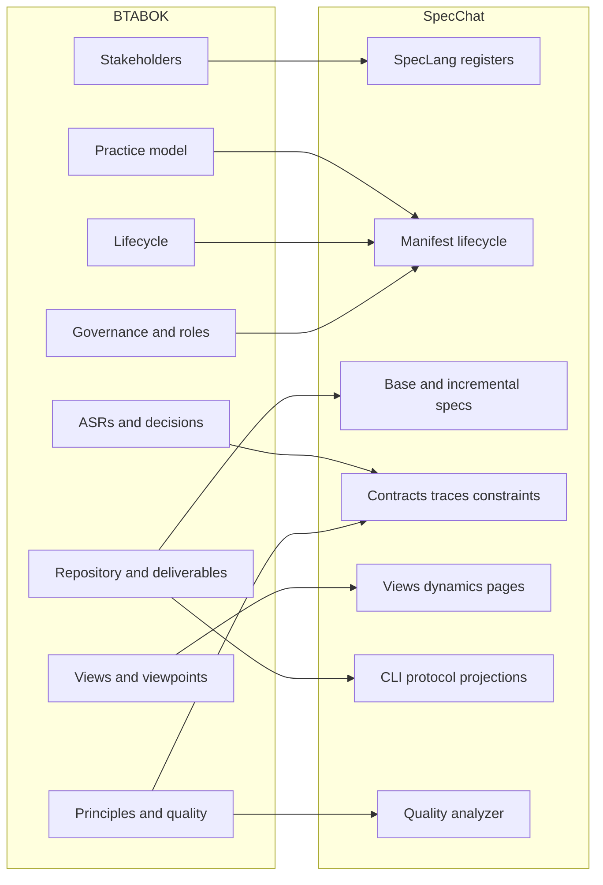
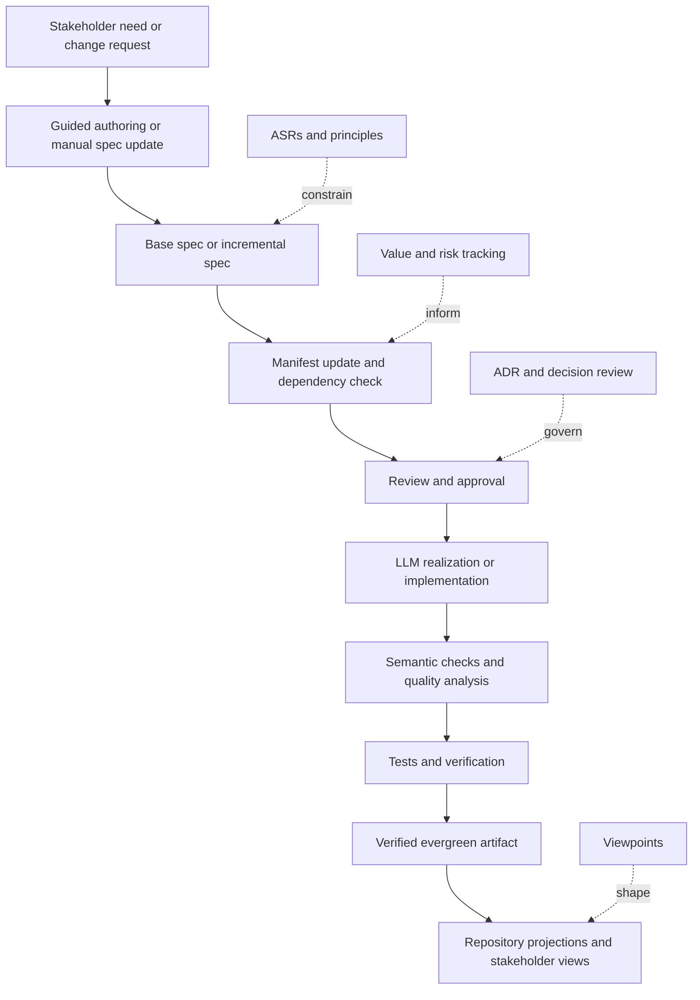

# BTABOK and SpecChat Alignment Report

## Executive Summary

The official BTABOK published by entity["organization","IASA Global","architecture association"] frames architecture as the art and science of designing and delivering valuable technology strategy, and it treats architecture not as a document template but as a professional practice with its own competency model, lifecycle, views and viewpoints, decision methods, repository expectations, governance posture, and stakeholder orientation. The public BTABOK archive also emphasizes lightweight but durable deliverables, explicit traceability from requirements to decisions, and a repository that exists first to improve architect decision-making and communication rather than to accumulate unused documentation. citeturn20view0turn5view0turn18view0turn7view9turn7view3turn17view2turn15view0turn19view0

Against that frame, the provided SpecChat corpus is **strongly aligned at the architecture-description and delivery-mechanics level** and **partially aligned at the architecture-practice level**. In the uploaded documents, SpecChat already provides a formal language, a grammar, a lifecycle-bearing manifest, traceability, topology rules, deployment views, dynamic interaction models, design pages and visualizations, package policy controls, platform realization, semantic analysis, projections, and repair-oriented conversation protocol. The strongest overlap with BTABOK is in architecture description, decisions, views, lifecycle traceability, and minimal evergreen artifacts. The biggest gaps are in business value framing, stakeholder power/interest mapping, explicit architect roles and decision rights, governance boards and waivers, risk and benefit management, viewpoint cataloging, and repository operating rules beyond file-level versioning.

In practical terms, SpecChat can become a very BTABOK-compatible architecture operating system if it is extended in three directions. First, it needs **practice metadata**: owners, approvers, stakeholder classes, ASRs, principles, risks, and waivers. Second, it needs **business and governance artifacts**: business case, roadmap, capability/value mapping, stakeholder plan, decision registry, and benefit/risk registers. Third, it needs **repository and tool integration**: explicit artifact ownership, freshness rules, dashboards, and integrations with delivery and governance tooling. Those additions would keep SpecChat’s executable precision while bringing it materially closer to BTABOK’s full practice model.

## Source Base and Analytical Lens

This report uses two source families. For BTABOK, the primary basis is the official public BTABOK archive and directly related official pages on architecture definition, views and viewpoints, architecturally significant requirements and decisions, deliverables, governance, repository, tools, lifecycle, roles, competency model, and structured canvases. The education-portal page in the supplied link was not text-retrievable in this browser session, so the analysis relies on the official public BTABOK mirror maintained by the same organization. citeturn3view0turn17view0turn20view0turn7view3turn7view4turn7view5turn19view0turn14view1turn15view0turn16view0turn7view9turn18view0turn7view0

For SpecChat, the accessible corpus in this workspace contains **12 markdown documents**. The core language and system papers are `SpecChat-Overview.md`, `SpecLang-Specification.md`, and `SpecLang-Grammar.md`. The sample and manifest materials are `PizzaShop.spec.md`, `PizzaShop.manifest.md`, `PayGate.spec.md`, `SendGate.spec.md`, `TodoApp.spec.md`, `TodoApp.manifest.md`, `todo-app-the-standard.spec.md`, `todo-app-the-standard.manifest.md`, and `todo-app-description.md`. No additional separately retrievable nine-file sample set was present beyond those 12 files, so the report analyzes the material actually available.

The analytical test used here is straightforward: **where BTABOK expects an architecture practice concept, artifact, role, lifecycle checkpoint, governance mechanism, or repository behavior, does SpecChat provide a native construct, an indirect equivalent, or nothing at all?** BTABOK itself argues for minimum necessary documentation, explicit traceability, stakeholder-driven views, auditable decisions, and repositories that stay evergreen and useful to architects. That is the right lens for judging whether SpecChat is merely a specification format or a candidate architecture practice substrate. citeturn17view0turn19view0turn15view0turn17view4turn17view2

A concise characterization of the accessible SpecChat corpus is below.

| Corpus slice | Files | What it contributes |
|---|---|---|
| Core concept | `SpecChat-Overview.md` | Purpose, layering, workflow, `/spec-chat` guided authoring, spec-first philosophy |
| Language semantics | `SpecLang-Specification.md` | Registers, constructs, semantic model, protocol, projections, quality analysis, CLI, implementation phases |
| Language syntax | `SpecLang-Grammar.md` | Lexer, tokens, EBNF grammar, precedence, parser assumptions |
| Governance wrapper | `*.manifest.md` files | Tracking block, lifecycle states, dependencies, document type registry, execution tiers |
| Architecture examples | `PizzaShop.spec.md`, `PayGate.spec.md`, `SendGate.spec.md`, `TodoApp.spec.md`, `todo-app-the-standard.spec.md` | Contexts, systems, entities, contracts, topology, phases, traces, constraints, package policies, platform realization, deployments, views, dynamics, and pages |

The through-line is that SpecChat is already more than a notation. In its current design, it is a specification language, workflow, and analysis/projection system intended to replace traditional design-document stacks with a smaller set of primary artifacts: the spec, the manifest, and generated or derived projections.

## BTABOK-to-SpecChat Concept Mapping

BTABOK spans practice, lifecycle, perspectives, decisions, governance, repository design, and role competency. The uploaded SpecChat materials span specification semantics, syntax, lifecycle-bearing manifests, executable architecture structures, and generative/validation tooling. The mapping below synthesizes the official BTABOK concepts most relevant to architecture practice and architecture description. citeturn20view0turn18view0turn7view9turn7view3turn7view4turn7view5turn19view0turn14view1turn15view0turn16view0turn17view0turn17view2turn17view3turn17view4

**Status legend:** **Aligned** = native, first-class support; **Partial** = present but incomplete relative to BTABOK; **Gap** = materially absent.

| BTABOK concept | BTABOK intent | SpecChat equivalent in uploaded corpus | Status | Assessment |
|---|---|---|---|---|
| Architecture as valuable technology strategy | Architecture must connect business value and technology strategy | SpecChat is strongly architecture-centric but focuses primarily on specification fidelity and realization mechanics | Partial | Strong on design rigor; weak on explicit value framing and business-case language |
| Architecture practice model | Architecture should operate as a profession/practice, not just a method | Manifest lifecycle plus core/projection tooling imply a practice, but there is no full practice operating model | Partial | Process exists; practice governance, careering, and organizational model do not |
| Competency model and five pillars | Shared competency baseline for all architects | No competency representation in core spec language or manifests | Gap | Languages and workflows exist, but architect capability modeling does not |
| Architect roles and decision rights | Protected architect decision rights and role clarity | `person` models actors in solutions; manifests imply reviewers/approvers, but no explicit architecture role taxonomy | Partial | Solution actors exist; practice roles do not |
| Stakeholder orientation | Architecture must begin from stakeholder concerns | `person`, `external system`, `relationship`, page `role`, and dynamic interactions | Aligned | Strong structural support for who uses the system and how |
| Power/interest and stakeholder management | Architects should map influence, motivation, and engagement strategy | No native power-interest grid, stakeholder plan, or influence metadata | Gap | Important BTABOK stakeholder-management layer is absent |
| ASRs | Architecturally significant requirements should drive decisions | Contracts, invariants, constraints, traces, phases, and page concepts cover much of the substance | Partial | Semantically strong but no explicit ASR artifact/classification |
| ASDs / ADRs | Significant decisions should be explicit, traceable, auditable | Structured rationale, decision specs, traces, and manifest lifecycle | Partial | Strong raw material, but no single canonical ADR registry model |
| Views and viewpoints | Different stakeholders need different architecture perspectives | `view` declarations, dynamic declarations, and mandatory Mermaid renderings | Aligned | Very strong correspondence to BTABOK and ISO 42010 viewpoint thinking |
| Viewpoint catalog/repository | Practices should define reusable viewpoint templates | Views exist, but no native reusable viewpoint library metadata | Partial | Present at instance level, not at practice-library level |
| Architecture description | Deliverables should describe architectures through views and viewpoints | Base `.spec.md` plus generated projections and inline diagrams | Aligned | This is one of SpecChat’s strongest matches |
| Deliverables as lightweight, useful, owned artifacts | Minimal useful deliverables with ownership and usage | Spec/manifest are intentionally minimal and evergreen; projections are secondary artifacts | Partial | Excellent minimalism; ownership/usage governance missing |
| Repository first for architects | Architecture repository should improve architect decisions and communication | Spec collection plus manifest, traces, projections, and quality tooling | Partial | Good foundation, but weak on repository operating rules, freshness, and integration |
| Governance as enabling, not policing | Early stakeholder-informed governance, with architects governed not governing | Review/approve lifecycle states exist; no formal governance board, waiver, or decision-right model | Partial | Governance stages exist but governance structure does not |
| Lifecycle from strategy to utilize/measure | ADLC should connect baseline, target, transition, delivery, and measurement | Spec phases, dependencies, execution order, and verification flow | Partial | Delivery lifecycle is strong; strategy/investment/value-measure layers are thin |
| Principles | Principles should create guardrails without over-prescription | Constraints, package policies, deny rules, and rationale | Partial | Mechanically strong, but principle artifacts are implicit rather than explicit |
| Quality attributes | Cross-cutting qualities need explicit planning and testing | Constraints, contracts, dynamic flows, and sample test gates | Partial | A lot of infrastructure exists, but there is no dedicated quality-attribute scenario artifact |
| Tool support and integration | Architecture tools should support lifecycle, traceability, collaboration, APIs, and reporting | CLI, projections, semantic analysis, and protocol are strong; enterprise integrations are not specified | Partial | Tooling exists, but architecture-tool ecosystem integration is underspecified |
| Business case, roadmap, benefit dependency, capability model | Architecture must tie technology choices to business outcomes and investment | Sample traces map concepts to components/pages/tests; no business case, capability, benefit, or roadmap primitives in core docs | Gap | This is the largest strategic gap |

The central conclusion from the mapping is that **SpecChat is already a solid BTABOK-aligned architecture description and implementation-governance mechanism, but it is not yet a full BTABOK-aligned architecture practice model**. It captures architecture structure exceptionally well; it captures architecture profession and enterprise operating context only lightly.

## Integration Points, Conflicts, and Opportunities

Several integration points are immediately visible. The first is **architecture description**. BTABOK emphasizes views, viewpoints, architecture descriptions, and minimal but useful deliverables; SpecChat’s base specs, view declarations, dynamic declarations, pages, visualizations, and mandatory diagram projections map very naturally onto that expectation. The second is **decision traceability**. BTABOK wants decisions tied back to requirements and preserved for governance and learning; SpecChat already has structured rationale, decision-spec document types, traces, constraints, lifecycle states, and repair diagnostics. The third is **repository thinking**. BTABOK wants evergreen artifacts used by architects first; SpecChat’s philosophy that the spec is the enduring source of truth is closely aligned with that stance. citeturn17view4turn17view2turn19view0turn15view0

The main conflicts are not technical incompatibilities. They are **scope mismatches**. BTABOK is broader than an architecture description language. It covers stakeholder influence, business value, risk, governance, careering, practice maturity, and multi-deliverable engagement. SpecChat treats the specification as the primary artifact and intentionally collapses many traditional documents into a smaller formal core. That is powerful, but it risks under-serving executive, portfolio, procurement, governance, and change-management audiences unless additional BTABOK-style artifacts are generated or modeled explicitly. BTABOK also cautions against governance becoming a police state; SpecChat’s rich semantic controls could drift into exactly that outcome if approval rights, waiver flows, and stakeholder collaboration are not modeled as first-class practice concerns. citeturn14view1turn19view0turn15view0

A second conflict is **value visibility**. BTABOK keeps pulling architecture toward objectives, business cases, roadmap choices, capability models, and benefits realization. The SpecChat corpus is far more explicit about entities, contracts, dependencies, phases, projections, and tests than about why an initiative matters economically, which stakeholders gain or lose, or how value will be measured after deployment. That creates a real risk: a highly structured, technically coherent spec system that remains weak on business prioritization. citeturn7view4turn7view9turn19view0turn16view1

### Artifact comparison

| BTABOK artifact | BTABOK purpose | Current SpecChat analogue | Assessment |
|---|---|---|---|
| Architecture description | Formal description using multiple views/viewpoints | Base `.spec.md` plus `view`/`dynamic` declarations and Mermaid projections | Strong equivalent |
| ADR / architecture decision | Traceable decision with context, consequences, approver | Structured `rationale`, decision spec doc type, traces | Good start, but approver/status registry should be standardized |
| Stakeholder mapping | Identify key stakeholders and their concerns/influence | `person`, `external system`, relationships | Missing influence, power, and engagement strategy |
| Architecture repository | Evergreen store of critical artifacts | Spec collection + manifest + projections | Needs ownership, freshness SLA, query/report model |
| Principles set | Guardrails for teams and decisions | Constraints, package policies, deny rules | Should be promoted into explicit reusable principle artifacts |
| Risk register | Capture architectural risk and monitoring | Scattered across rationale and constraints | No explicit risk artifact |
| Governance waiver | Controlled deviation from standards with tracked risk | None | Clear gap |
| Business case / NABC | Value, need, benefits, considerations | None in core language | Clear gap |
| Roadmap | Sequence and dependency of change over time | Phases and manifest execution order | Strong delivery-order support, weak business roadmap support |
| Quality-attribute planning canvas | Scenarios, risks, monitoring strategy | Constraints, contracts, test gates | Partial; needs dedicated QA scenario support |

### API and interaction-surface comparison

| Surface | Purpose | Interaction style | Message/schema status in corpus | Security/governance status |
|---|---|---|---|---|
| SpecLang DSL | Formal architecture/spec authoring | Markdown-embedded DSL in fenced `spec` blocks | Very explicit; grammar and semantics are documented in detail | No author identity or approval metadata in the language itself |
| SpecChat CLI | Analysis, projection, conversation, diffing | Command-line (`spec check`, `spec converse`, `spec project`, etc.) | Explicitly specified in `SpecLang-Specification.md` | RBAC, audit, and tenancy are unspecified |
| `/spec-chat` guided authoring | Guided natural-language-to-spec workflow | Staged question flow producing `.spec.md` files | Explicitly described in `SpecChat-Overview.md` | Human approval workflow outside file lifecycle is unspecified |
| `PizzaShop.spec.md` app API | Ordering, payment, cancellation, admin operations | Web app + API contracts + shared DTO concept | Contracts/entities strongly specified; full endpoint list not exhaustively enumerated in the visible corpus | Authentication/authorization largely unspecified |
| `PayGate.spec.md` | Payment test harness | REST surface mirroring entity["company","Stripe","payments company"] | Endpoints and behavior modes are explicitly specified | HTTPS is named; authN/authZ and secrets handling are unspecified |
| `SendGate.spec.md` | Email test harness | REST surface mirroring entity["company","SendGrid","email delivery company"] | Mail send + inbox inspection/model operations are explicitly specified | HTTPS is named; authN/authZ and retention concerns are unspecified |
| Dynamic declarations | Runtime behavior documentation | Sequence-style interaction definitions | Strongly specified and rendered | Excellent for communication; not yet tied to formal governance checkpoints |

### Role comparison

| BTABOK role category | What BTABOK expects | What SpecChat currently models | Assessment |
|---|---|---|---|
| Architect / architecture practice | Named practice, roles, decision rights, competencies | Implicit human author plus LLM collaborator; no explicit architect role model in core docs | Partial |
| Stakeholders / users / external actors | Explicit stakeholder concerns and interactions | Strong `person` and context modeling in sample specs | Strong |
| Extended engineering/test/ops team | Collaboration across delivery lifecycle | Components, tests, CI actors, deployment nodes, phase gates | Strong |
| Governance body / ARB / steering group | Approval, waivers, review authority, engagement rules | Lifecycle states imply review/approval; no named body or authority model | Weak |
| Product/business/portfolio stakeholders | Business case, prioritization, capability, investment and value | Only lightly represented through sample actors and prose rationale | Weak |
| Competency/career owners | Maturity, capability development, practice growth | Absent from the SpecChat language and manifests | Gap |

The opportunities are therefore crisp. **Technically**, SpecChat can absorb BTABOK metadata with relatively little disruption because its language already has tags, rationale, traces, constraints, phases, and projections. **Process-wise**, the manifest already creates a lifecycle home for reviews, approvals, dependencies, and verification. **Governance-wise**, decision specs and structured rationale can evolve into an auditable ADR layer. **Organizationally**, the missing pieces are mostly additive: roles, approvers, waivers, risk/benefit models, and viewpoint catalogs.

That flow is already mostly present in the SpecChat corpus. BTABOK’s added value is that it would make the dotted-line controls explicit, named, owned, and reusable across teams.

## Alignment Roadmap

The strongest alignment path is to **keep SpecChat’s spec-first core intact** and add BTABOK-style practice scaffolding around it. BTABOK is very clear that deliverables should stay lightweight, useful, and owned, that repositories should stay focused on what architects truly maintain, and that tools should support lifecycle traceability, stakeholders, principles, decisions, and integration. A good roadmap should therefore extend SpecChat without turning it into a giant architecture-document bureaucracy. citeturn19view0turn15view0turn16view1turn16view2

| Horizon | Priority actions | Required new or changed artifacts | Role changes | Governance changes |
|---|---|---|---|---|
| Short term | Introduce explicit **BTABOK overlay metadata** into SpecChat: `asr`, `principle`, `risk`, `benefit`, `owner`, `approver`, `stakeholder_class`, `decision_id`, `waiver_ref` | Extend `SpecLang-Specification.md`; add example files and validation rules | Name a **spec owner**, **decision approver**, and **repository owner** for every manifest | Add manifest fields for approver, owner, review body, waiver status |
| Short term | Standardize **decision records** as a first-class projection from structured rationale and decision specs | ADR projection template; decision registry view | Assign a named decision sponsor and approver | Require every Reviewed/Approved decision spec to emit ADR output |
| Short term | Add **viewpoint catalog** support so a view can declare which reusable viewpoint it conforms to | `viewpoint` template artifact plus projection | Assign viewpoint stewards | Review body validates viewpoint completeness for major specs |
| Short term | Add a **stakeholder plan** artifact using person/external-system data plus influence metadata | Stakeholder mapping projection, power-interest matrix projection | Assign stakeholder owner per initiative | Approval gate checks stakeholder coverage on significant specs |
| Medium term | Add **business/value artifacts**: NABC-style business case, capability map, benefit dependency model, roadmap links | Business case spec type, capability projection, roadmap projection | Add business architect/product sponsor participation | Approval requires value statement and success metric baseline |
| Medium term | Add **quality attribute scenarios** and monitoring strategy as first-class spec blocks | QA scenario/card artifact, monitoring-plan projection | Assign quality owner per quality domain | Verification requires evidence for critical quality attributes |
| Medium term | Add **repository operating model**: freshness SLAs, artifact ownership, usage telemetry, evergreen list | Repository policy, dashboard, archival rules | Add repository curator and artifact maintainers | Governance validates freshness and archives unused artifacts |
| Medium term | Add **tool integrations** for delivery flow | Connectors/projections for issue trackers, CI, source control, and architecture dashboards | Shared ownership with engineering enablement | Review board consumes live dashboards rather than static documents |
| Long term | Model the **architecture practice itself** in SpecChat or adjacent artifacts | Practice manifest, role/competency matrix, maturity assessments | Explicit chief architect, solution architect, steward, reviewer roles | Formalize decision rights, waiver process, and review thresholds |
| Long term | Build **cross-framework support** so SpecChat can coexist with enterprise planning and delivery frameworks | Import/export mappings and reporting views | Architecture methods lead | Governance norms for framework interoperability |
| Long term | Establish **benefits realization loop** after deployment | Outcome scorecards and post-deployment roadmap artifacts | Business + architecture joint ownership | “Verified” expands from implementation correctness to measured outcome confirmation |

A concrete minimal implementation package would consist of seven additions:

1. **Spec extension** for ASRs, principles, risks, benefits, owners, approvers, and waivers.  
2. **ADR projection** generated from decision specs and structured rationale.  
3. **Stakeholder projection** generated from persons, external systems, and influence metadata.  
4. **Viewpoint catalog** for reusable stakeholder-centered views.  
5. **Business-case and roadmap artifact types** linked to manifests and traces.  
6. **Repository policy** defining evergreen artifacts, owners, freshness, and archival rules.  
7. **Governance model** defining who can review, approve, waive, and verify.

If only one near-term move is possible, it should be the **ADR + ASR + owner/approver extension**. That single change closes the biggest gap between SpecChat as a very good architecture language and SpecChat as a BTABOK-aligned architecture practice mechanism.

## Risks, Dependencies, and Success Metrics

The major risks come from **over-technicalization, under-governance, and under-businessing** the model. BTABOK repeatedly warns that artifacts must be useful, owned, and connected to delivery and value, and that governance should enable rather than suffocate agility. If SpecChat expands by simply adding more syntax without creating ownership, usage, and decision-right clarity, it will drift away from BTABOK rather than toward it. citeturn19view0turn14view1turn15view0

| Risk | Why it matters | Dependency | Mitigation |
|---|---|---|---|
| SpecChat becomes an engineering-only artifact | BTABOK expects stakeholder, business, and value communication, not just technical control | Business-case and stakeholder artifacts | Add stakeholder/value projections and approval participation |
| Governance ambiguity | Lifecycle states exist, but authority and waiver paths do not | Named roles and governance body | Add approver, board, waiver, and decision-right metadata |
| Security blind spots | Corpus specifies HTTPS and some package/constraint controls, but not full auth, secrets, or privacy policies | Security architecture overlays | Add security principle, threat/risk, identity, and secrets artifacts |
| Artifact sprawl | BTABOK wants minimum viable architecture and evergreen artifacts | Repository policy and usage telemetry | Track freshness, usage, and ownership; archive what is not used |
| Weak value traceability | Strong code/spec traceability can still miss business outcomes | Business case, benefits, roadmap | Require objective, outcome, and success metrics in manifests/specs |
| Role confusion | Practice success depends on explicit ownership and decision rights | Role model and RACI | Name spec owner, decision owner, approver, verifier, steward |
| Tool isolation | BTABOK expects tools to integrate with lifecycle and collaboration | Delivery-tool interfaces | Build projections/integrations into issue tracking, CI, and dashboards |
| Sample-driven narrowness | Current example set is heavily .NET and app-delivery focused | Broader sample library | Add security-, data-, infra-, enterprise-, and portfolio-oriented examples |

Several dependencies are already visible from the corpus. The language can carry more metadata. The manifests already encode lifecycle states and dependencies. The CLI/projection architecture can emit new artifacts without changing the philosophical center of the system. The constraint, trace, quality, and projection machinery is therefore a strong base. The missing dependencies are organizational rather than purely technical: a review body, named owners, business sponsors, repository stewardship, and a practice-level understanding of what must remain evergreen.

Success should be measured at three levels: **spec quality**, **practice quality**, and **business impact**.

| Metric class | Suggested metric | What “good” looks like |
|---|---|---|
| Spec quality | Percentage of specs with context, topology, phases, traces, views, deployments, and rationale | High structural completeness without excessive noise |
| Spec quality | Percentage of significant decisions with ADR-equivalent records and approvers | Near-total coverage for material decisions |
| Practice quality | Median cycle time from Draft to Verified | Predictable and improving across teams |
| Practice quality | Percentage of evergreen artifacts with named owner and freshness SLA met | Repository stays current and trusted |
| Practice quality | Percentage of governance exceptions with recorded waiver and linked risk | No hidden deviations |
| Practice quality | Stakeholder usage rate of projections/views after 90 days | Artifacts are actually consumed |
| Delivery quality | Number of topology/package-policy violations prevented before merge | Preventive architecture control is demonstrably useful |
| Delivery quality | Trace coverage from concepts/ASRs to components/pages/tests | Few orphan concepts or implementations |
| Business quality | Percentage of specs linked to objective, benefit, and measurable outcome | Architecture connects to value, not just structure |
| Business quality | Defect escape rate attributable to missing/ambiguous specification | Trending downward |
| Business quality | Lead time from significant decision to implemented/verified change | Faster without loss of governance fidelity |

The most important final judgment is this: **SpecChat already looks like the kernel of a BTABOK-compatible architecture repository and architecture description system**. It is rigorous, explicit, traceable, and unusually strong in turning architecture into an executable, testable source of truth. What it lacks is not architectural seriousness. What it lacks is the broader BTABOK practice envelope: value, stakeholders, roles, governance, and repository stewardship. If those are added deliberately and lightly, SpecChat can move from “specification-driven development system” to “BTABOK-aligned architecture practice platform.”

---

## Appendix A. Reference Sources

### A.1 Official BTABOK / IASA Sources

The analysis used the official public BTABOK archive as the primary retrievable source base, while retaining the IASA education-portal architecture overview link as the original target page supplied for the inquiry. ([iasa-global.github.io][1])

1. **Business Technology Architecture Body of Knowledge (BTABoK)**
   `https://iasa-global.github.io/btabok/` ([iasa-global.github.io][1])

2. **What is Architecture | IASA - BTABoK**
   `https://iasa-global.github.io/btabok/what_is_architecture.html` ([iasa-global.github.io][2])

3. **Views and Viewpoints | IASA - BTABoK**
   `https://iasa-global.github.io/btabok/views.html` ([iasa-global.github.io][3])

4. **Views & Viewpoints | IASA - BTABoK**
   `https://iasa-global.github.io/btabok/views_viewpoints.html` ([iasa-global.github.io][4])

5. **Requirements | IASA - BTABoK**
   `https://iasa-global.github.io/btabok/requirements.html` ([iasa-global.github.io][5])

6. **Decisions | IASA - BTABoK**
   `https://iasa-global.github.io/btabok/decisions.html` ([iasa-global.github.io][6])

7. **Deliverables | IASA - BTABoK**
   `https://iasa-global.github.io/btabok/deliverables.html` ([iasa-global.github.io][7])

8. **Repository | IASA - BTABoK**
   `https://iasa-global.github.io/btabok/repository.html` ([iasa-global.github.io][8])

9. **Governance | IASA - BTABoK**
   `https://iasa-global.github.io/btabok/governance.html` ([iasa-global.github.io][9])

10. **Governance | IASA - BTABoK**
    `https://iasa-global.github.io/btabok/governance_em.html` ([iasa-global.github.io][10])

11. **Architecture Lifecycle | IASA - BTABoK**
    `https://iasa-global.github.io/btabok/architecture_lifecycle.html` ([iasa-global.github.io][11])

12. **Architecture Tools | IASA - BTABoK**
    `https://iasa-global.github.io/btabok/architecture_tools.html` ([iasa-global.github.io][12])

13. **Roles | IASA - BTABoK**
    `https://iasa-global.github.io/btabok/roles.html` ([iasa-global.github.io][13])

14. **Competency | IASA - BTABoK**
    `https://iasa-global.github.io/btabok/competency.html` ([iasa-global.github.io][14])

15. **Competency Model | IASA - BTABoK**
    `https://iasa-global.github.io/btabok/competency_model_m.html` ([iasa-global.github.io][15])

16. **Structured Canvases | IASA - BTABoK**
    `https://iasa-global.github.io/btabok/structured_canvases_m.html` ([iasa-global.github.io][16])

17. **Architect Organization Capability Canvas | IASA - BTABoK**
    `https://iasa-global.github.io/btabok/architect_organization_canvas.html` ([iasa-global.github.io][17])

18. **BTABoK Architecture Manager / Architecture Overview**
    `https://education.iasaglobal.org/browse/btabok/3.2/core-site/core/canvas/architecture-overview` ([education.iasaglobal.org][18])

### A.2 SpecChat Corpus Sources

1. `SpecChat-Overview.md`
2. `SpecLang-Specification.md`
3. `SpecLang-Grammar.md`
4. `PizzaShop.spec.md`
5. `PizzaShop.manifest.md`
6. `PayGate.spec.md`
7. `SendGate.spec.md`
8. `TodoApp.spec.md`
9. `TodoApp.manifest.md`
10. `todo-app-the-standard.spec.md`
11. `todo-app-the-standard.manifest.md`
12. `todo-app-description.md`

### A.3 Suggested Caption

**Reference note:** BTABOK citations point to official IASA Global sources. The SpecChat sources are the twelve markdown documents supplied with the analysis set.

[1]: https://iasa-global.github.io/btabok/?utm_source=chatgpt.com "Business Technology Architecture Body of Knowledge | IASA - BTABoK"
[2]: https://iasa-global.github.io/btabok/what_is_architecture.html?utm_source=chatgpt.com "What is Architecture | IASA - BTABoK"
[3]: https://iasa-global.github.io/btabok/views.html?utm_source=chatgpt.com "Views and Viewpoints | IASA - BTABoK"
[4]: https://iasa-global.github.io/btabok/views_viewpoints.html?utm_source=chatgpt.com "Views & Viewpoints | IASA - BTABoK"
[5]: https://iasa-global.github.io/btabok/requirements.html?utm_source=chatgpt.com "Requirements | IASA - BTABoK"
[6]: https://iasa-global.github.io/btabok/decisions.html?utm_source=chatgpt.com "Decisions | IASA - BTABoK"
[7]: https://iasa-global.github.io/btabok/deliverables.html?utm_source=chatgpt.com "Deliverables | IASA - BTABoK"
[8]: https://iasa-global.github.io/btabok/repository.html?utm_source=chatgpt.com "Repository | IASA - BTABoK"
[9]: https://iasa-global.github.io/btabok/governance.html?utm_source=chatgpt.com "Governance | IASA - BTABoK"
[10]: https://iasa-global.github.io/btabok/governance_em.html?utm_source=chatgpt.com "Governance | IASA - BTABoK"
[11]: https://iasa-global.github.io/btabok/architecture_lifecycle.html?utm_source=chatgpt.com "Architecture Lifecycle | IASA - BTABoK"
[12]: https://iasa-global.github.io/btabok/architecture_tools.html?utm_source=chatgpt.com "Architecture Tools | IASA - BTABoK"
[13]: https://iasa-global.github.io/btabok/roles.html?utm_source=chatgpt.com "Roles | IASA - BTABoK"
[14]: https://iasa-global.github.io/btabok/competency.html?utm_source=chatgpt.com "Competency | IASA - BTABoK"
[15]: https://iasa-global.github.io/btabok/competency_model_m.html?utm_source=chatgpt.com "Competency Model | IASA - BTABoK"
[16]: https://iasa-global.github.io/btabok/structured_canvases_m.html?utm_source=chatgpt.com "Structured Canvases | IASA - BTABoK"
[17]: https://iasa-global.github.io/btabok/architect_organization_canvas.html?utm_source=chatgpt.com "Architect Organization Capability Canvas | IASA - BTABoK"
[18]: https://education.iasaglobal.org/browse/btabok/3.2/core-site/core/canvas/architecture-overview "BTABoK Architecture Manager"
