# Global Corp. Enterprise Architecture
## A Fictional BTABOK-Complete Enterprise Architecture for Global Supply Chain Tracking

## Tracking

| Field | Value |
|---|---|
| Document ID | GC-EA-001 |
| Version | 0.2 |
| Created | 2026-04-16 |
| Last Reviewed | 2026-04-16 |
| State | Draft |
| Owner | PER-01 Lena Brandt, Chief Architect |
| Approver | PER-11 Anja Petersen, Chair EARB |
| Ever-green | Yes |
| Freshness SLA | 90 days |
| Dependencies | None |
| Classification | Fictional enterprise used to exercise BTABOK practices end-to-end |
| CoDL itemType | EnterpriseArchitecture |
| CoDL slug | global-corp-enterprise-architecture |
| CoDL publishStatus | Draft |
| CoDL retentionPolicy | indefinite |

## 1. Purpose

This document defines a fictional global corporation, **Global Corp.**, whose mission is to provide end-to-end visibility, traceability, compliance, and decision support for goods moving through the global supply chain.

The company is fictional. The realism is intentional. Its market pressures, standards choices, regulatory drivers, and operating constraints are derived from current public sources on global logistics, traceability, security, and BTABOK architecture practice. [R1][R2][R3][R4][R5][R6][R7][R8][R9][R10][R11][R12][R13]

The goal is to model an **enterprise architecture that fully exercises the BTABOK Engagement Model**, including:

- strategy and business value
- lifecycle thinking
- stakeholders and concerns with named owners and approvers
- views and viewpoints with a concrete view gallery
- architecturally significant requirements and decisions with full traceability
- governance with waiver handling
- repository operating model with freshness and ownership rules
- lightweight but durable deliverables
- metrics, risks, waivers, experiments, legacy modernization, and roadmap transitions

Every artifact in this document carries a stable, human-readable identifier, a named owner, and a named approver. This is intentional. The document is meant to exhibit the governance discipline it prescribes, not merely describe it.

## 1.1 CoDL and CaDL Alignment Note

This document is designed as a BTABOK-complete exemplar. Following the April 2026 publication of the Concept Definition Language (CoDL) and Canvas Definition Language (CaDL) by IASA Global on the BTABoK 3.2 education portal, it also doubles as a seed for CoDL concept instances and CaDL canvas definitions.

The stable IDs used throughout this document (ASR-01, ASD-01, WVR-01, STK-01, VP-01, V-01, and so on) correspond directly to CoDL `slug` values on their respective concept instances. The first column of each artifact table therefore maps to the CoDL Standard Metadata profile field `slug` (URL-safe stable identifier).

The Owner and Approver fields used throughout this document correspond to fields in the CoDL Standard Metadata profile. Owner aligns with `committer` (the single owning steward of a concept) and with membership in `authors`. Approver aligns with membership in `reviewers`, or with `committer` when the approver is also the owning steward.

The View Gallery in section 28 serves as a catalog of CaDL canvases defined over the document's CoDL concepts. Following the governing CaDL principle that "a canvas is a view of a concept, not a separate stored object type," each V-xx entry describes a rendering over concepts defined elsewhere in this document, not a new stored object.

For the full alignment between CoDL, CaDL, and the SpecLang/SpecChat vocabulary used in earlier BTABOK work, see `WIP/CoDL-CaDL-Integration-Notes.md`. The architectural decision recorded there is Option A: CoDL syntax is canonical, with optional SpecLang-style aliases.

## 2. Design Intent

This architecture deliberately incorporates the BTABOK Engagement Model elements that are often underrepresented in delivery-centric specification systems:

- business case and benefits realization
- stakeholder management beyond simple actor lists
- owners, approvers, and decision rights for every artifact
- decision registry with traceable ASDs linked to ASRs
- governance boards and waiver handling with concrete examples
- repository stewardship, freshness SLAs, and usage rules
- viewpoint cataloging with one instantiated view per viewpoint
- roadmap and transition architectures with capability baselines and targets

That design intent reflects the main lesson from the earlier BTABOK/SpecChat alignment work: architecture description alone is not enough. A BTABOK-aligned enterprise architecture must also carry value, governance, repository discipline, stakeholder concerns, and measurable outcomes. [R14]

## 3. External Context and Realism Anchors

Global Corp. operates in a world where international supply chains are large, distributed, multi-party, and increasingly regulated. The business context is shaped by five realities.

### 3.1 Reliability and resilience matter

The World Bank's Logistics Performance Index emphasizes reliability, quality of logistics services, infrastructure, and border processes as core determinants of how effectively goods move across borders. [R7]

### 3.2 Event interoperability matters

GS1 EPCIS 2.0 is designed to capture and share supply-chain visibility events across organizations, including the what, when, where, why, and how of tracked objects. It also supports sensor data and developer-friendly APIs. [R8]

### 3.3 Ocean visibility needs common milestones and APIs

DCSA Track & Trace standards provide common data semantics, APIs, and milestone structures for container shipping across shipment phases and carriers. [R9]

### 3.4 Traceability is becoming regulatory infrastructure

The EU Ecodesign for Sustainable Products Regulation introduces the Digital Product Passport as a digital identity for products, components, and materials. [R10]
The U.S. FDA FSMA 204 final rule requires Critical Tracking Events and Key Data Elements for covered foods, with a compliance date of January 20, 2026. [R11]

### 3.5 Security must extend into the supply chain itself

NIST CSF 2.0 guidance now includes focused quick-start guidance for cybersecurity supply chain risk management. [R12]
ISO 28000:2022 provides requirements for security management systems relevant to supply chain security and resilience. [R13]

These realities make Global Corp. credible as a business. They also make it a strong vehicle for exercising BTABOK in a realistic way.

## 4. Global Corp. at a Glance

**Global Corp.** is a fictional multinational business technology company that provides a **Supply Chain Visibility and Trust Platform** to manufacturers, retailers, logistics providers, and regulators.

### 4.1 Corporate profile

- **Legal HQ:** Zurich
- **Operational headquarters:** Singapore
- **Regional hubs:** Rotterdam, Dubai, Atlanta, Sao Paulo, Johannesburg
- **Primary customers:** global manufacturers, consumer goods firms, pharma distributors, food shippers, 3PLs, ocean-forwarding networks, customs brokers
- **Core business model:** subscription SaaS plus premium data services, integration services, regulatory reporting packs, and managed control-tower operations
- **Primary differentiator:** normalized event visibility across ocean, air, road, warehouse, and product-level traceability domains
- **Headcount:** approximately 4,200 employees
- **Revenue (current year):** USD 780M, with 22% year-over-year growth
- **Strategic horizon of this document:** 36 months

### 4.2 What Global Corp. sells

Global Corp. does not move freight itself. It sells:

1. **Visibility** shipment, container, pallet, lot, serial, and product-level event visibility
2. **Trust** chain of custody, audit trails, provenance, and evidence retention
3. **Compliance** regulatory traceability, sustainability reporting support, digital product passport readiness, food-traceability workflows
4. **Decision support** ETA prediction, exception management, delay risk scoring, route disruption signals, inventory exposure analytics
5. **Partner interoperability** onboarding, mapping, standards mediation, and API/EDI normalization

## 5. Strategic Thesis

Global Corp.'s strategy is built on one premise:

> **The winning supply-chain platform is not just a data collector. It is the system that turns fragmented, partner-specific logistics signals into trusted, governed, decision-ready architecture.**

### 5.1 Strategic objectives

1. Become the preferred cross-enterprise traceability platform for global manufacturers and retailers.
2. Reduce customer time-to-detect supply disruptions from hours to minutes.
3. Reduce partner onboarding effort through standards-first integration.
4. Support regulated traceability and sustainability reporting in major markets.
5. Create a reusable enterprise architecture repository that allows the business to scale without architecture drift.

### 5.2 Business outcomes

- lower disruption cost for customers
- faster recall and quarantine support
- stronger auditability
- improved compliance readiness
- higher trust in multi-party event data
- reusable integration and domain patterns
- reduced architecture rework inside Global Corp.

## 6. Business Case (NABC)

The Business Case is deliverable #1 in the Minimum Durable Deliverable Set (see section 24). It is structured using the NABC framing (Need, Approach, Benefits, Competition).

| Element | Content |
|---|---|
| **Need** | Global manufacturers and retailers lose measurable revenue to supply-chain disruption, compliance gaps, and partner-integration rework. FSMA 204 and EU DPP raise the regulatory floor. Existing tools solve point problems but fragment across modes, regions, and data models. |
| **Approach** | Build a standards-first visibility and trust platform. Normalize events from all modes and partners into a canonical graph. Layer operational intelligence, compliance packs, and sustainability support on the graph. Preserve lineage to source evidence so every visible state is explainable. |
| **Benefits** | Customer disruption detection time drops from hours to minutes. Partner onboarding effort drops 50% over 24 months through standards mediation. Compliance evidence turnaround drops from days to hours. Platform gross margin improves as integration costs flatten against customer growth. |
| **Competition and alternatives** | In-house visibility teams at large shippers (high cost, low portability). Point-solution control towers (fragmented, no product-level traceability). General data platforms with logistics overlays (weak on event semantics, weak on regulatory packs). |
| **Primary owner** | PER-05 Sven Lindqvist, CEO |
| **Sponsor** | PER-06 Priya Raman, CFO |
| **Review cadence** | Annual |

## 7. How This Enterprise Fully Exercises BTABOK

This model intentionally covers the main BTABOK Engagement Model practice zones.

| BTABOK concern | How Global Corp. exercises it |
|---|---|
| Architecture as value-driven strategy | Business case in section 6, objective hierarchy in section 5, benefit metrics in Outcome Scorecard (section 32) |
| Views and viewpoints | 10 viewpoints defined in section 27, one view per viewpoint in View Gallery (section 28) |
| ASRs and decisions | ASR catalog (section 21), ASD registry (section 22), ASR-to-ASD traceability matrix (section 23) |
| Deliverables | Minimum Durable Deliverable Set (section 24), each with ID, owner, review cadence, freshness SLA |
| Repository | Curated repository with freshness rules (section 24), Repository Stewardship Group (section 25) |
| Governance | EARB, Domain Design Councils, Regional Architecture Forum, waiver process (section 25) with concrete waivers (section 26) |
| Lifecycle | Full six-stage ADLC walkthrough in section 12, innovation experiment cards in section 13 |
| Stakeholder orientation | Stakeholder catalog with named persons, concerns, influence, and engagement strategy (section 10) |
| Principles and standards | 10 enterprise principles (section 11) linked to ASRs and ASDs, Standards Catalog (section 33) |
| Experiments | Innovation Experiment Cards in section 13 |
| Legacy modernization | Decommissioning vignette for LGY-01 GlobalTrack-APAC v3 (section 29) |
| Tooling and reporting | Architecture dashboards, policy checks, traceability reports, adoption telemetry (section 32) |

## 8. Business Architecture

### 8.1 Core value streams

Global Corp. operates six primary value streams.

| ID | Value Stream | Owner |
|---|---|---|
| VS-01 | Acquire and Onboard Customer | PER-09 Elena Vasquez, CPO |
| VS-02 | Onboard Partner Network | PER-03 Maria Oliveira, Chief Architect of Integration |
| VS-03 | Capture and Normalize Events | PER-02 Arjun Desai, Chief Architect of Data |
| VS-04 | Assess Risk and Compliance | PER-17 Isabelle Laurent, Chief Architect of Compliance |
| VS-05 | Provide Operational Decisions | PER-18 Kenji Sato, Chief Architect of Operations |
| VS-06 | Measure Value and Renew | PER-06 Priya Raman, CFO |

### 8.2 Business capabilities

Each capability carries a stable ID, a baseline maturity (current state), a target maturity (36-month horizon), a strategic importance, and a named owner.

| ID | L1 Capability | L2 Capabilities | Baseline | Target | Importance | Owner |
|---|---|---|---|---|---|---|
| CAP-COM-01 | Commercial | Product management, pricing, deal governance | Medium | Medium-high | Medium | PER-09 Elena Vasquez |
| CAP-CDL-01 | Customer Delivery | Solution design, integration delivery, change management | Medium | High | High | PER-19 Emma Richardson |
| CAP-PAR-01 | Partner Interoperability | API onboarding, EDI mapping, standards mediation, certification | Low-medium | High | Critical | PER-03 Maria Oliveira |
| CAP-TRC-01 | Traceability Operations | Event ingestion, event normalization, identity resolution, lineage tracking | Medium | High | Critical | PER-02 Arjun Desai |
| CAP-CTR-01 | Control Tower | ETA, exception management, alerting, case management | Medium-low | Medium-high | High | PER-18 Kenji Sato |
| CAP-CPS-01 | Compliance and Sustainability | DPP readiness, FSMA workflows, audit export, retention policy | Low | Medium-high | High | PER-17 Isabelle Laurent |
| CAP-DAI-01 | Data and Intelligence | Analytics, forecasting, risk models, customer insights | Medium | High | High | PER-02 Arjun Desai |
| CAP-TAS-01 | Trust and Security | IAM, tenant isolation, security monitoring, evidence chain, third-party risk | Medium | High | Critical | PER-04 Daniel Park |
| CAP-ENT-01 | Enterprise Management | Finance, HR, legal, architecture governance, PMO | Medium | High | Critical | PER-01 Lena Brandt |
| CAP-REP-01 | Architecture Repository Discipline | Artifact lifecycle, ownership, freshness, decision registry | Low-medium | High | Critical | PER-16 Thomas Müller |
| CAP-GOV-01 | Governance and Waiver | ARB operations, waiver lifecycle, standards oversight | Low-medium | Medium-high | Medium | PER-11 Anja Petersen |
| CAP-OUT-01 | Outcome Measurement | KPI definition, scorecard operation, benefit tracking | Low | High | High | PER-06 Priya Raman |

## 9. Personas Directory

Named personas referenced throughout this document. In a real deployment these would be actual employees. Here they are consistent fictional roles that let ownership and approval discipline be exhibited rather than prescribed. The ID column in this table maps to the CoDL `slug` field for each concept instance.

| ID | Name | Role | Location |
|---|---|---|---|
| PER-01 | Lena Brandt | Chief Architect (enterprise) | Zurich |
| PER-02 | Arjun Desai | Chief Architect of Data, VP Data Platform | Singapore |
| PER-03 | Maria Oliveira | Chief Architect of Integration | Sao Paulo |
| PER-04 | Daniel Park | Chief Architect of Security | Singapore |
| PER-05 | Sven Lindqvist | CEO | Zurich |
| PER-06 | Priya Raman | CFO | Zurich |
| PER-07 | Hiroshi Tanaka | COO | Singapore |
| PER-08 | Chioma Okafor | CISO | Johannesburg |
| PER-09 | Elena Vasquez | Chief Product Officer | Atlanta |
| PER-10 | Yuki Nakamura | Head of Regulatory Affairs | Singapore |
| PER-11 | Anja Petersen | Chair, Enterprise Architecture Review Board | Zurich |
| PER-12 | Ravi Menon | Regional Operations Lead, APAC | Singapore |
| PER-13 | Sarah Goldberg | Regional Operations Lead, Americas | Atlanta |
| PER-14 | Fatima Al-Hassan | Regional Operations Lead, MEA | Dubai |
| PER-15 | Marcus Weber | Head of Sustainability | Rotterdam |
| PER-16 | Thomas Müller | Repository Steward Lead | Zurich |
| PER-17 | Isabelle Laurent | Chief Architect of Compliance | Rotterdam |
| PER-18 | Kenji Sato | Chief Architect of Operations | Singapore |
| PER-19 | Emma Richardson | Product Architect, Control Tower | Atlanta |
| PER-20 | Aleksandr Volkov | Platform SRE Lead | Zurich |

## 10. Stakeholders and Concerns

**CoDL itemType:** StakeholderCard

BTABOK insists that views exist for stakeholders, not for the comfort of the architecture team alone. [R3]

Each stakeholder has a stable ID, a named occupant (from the Personas Directory), concerns, influence classification, required viewpoints, and an engagement strategy. The ID column in this table maps to the CoDL `slug` field for each StakeholderCard concept instance.

| ID | Stakeholder (occupant) | Concerns | Influence | Required viewpoints | Engagement strategy |
|---|---|---|---|---|---|
| STK-01 | CEO (PER-05) | Growth, market expansion, resilience narrative | High | VP-01 Strategic, VP-10 Outcome | Quarterly architecture review, strategic reviews |
| STK-02 | CFO (PER-06) | Margin, implementation cost, hosting efficiency | High | VP-02 Capability, VP-10 Outcome | Monthly scorecard, annual investment review |
| STK-03 | COO (PER-07) | Onboarding speed, service reliability, regional execution | High | VP-06 Operational, VP-08 Deployment | Weekly ops sync, regional checkpoints |
| STK-04 | CPO (PER-09) | Product coherence, differentiation, roadmap reuse | High | VP-02 Capability, VP-04 Decision rollup | Biweekly product architecture sync |
| STK-05 | Chief Architect (PER-01) | Coherence, standards, reuse, technical debt, repository quality | High | All | EARB chair, standards governance lead |
| STK-06 | CISO (PER-08) | Tenant isolation, supplier cyber risk, incident response | High | VP-07 Security, VP-09 Governance | EARB member, security review gate |
| STK-07 | Regional Ops Lead APAC (PER-12) | Local partner realities, customs timing, SLA practicality | Medium-high | VP-06 Operational, VP-08 Deployment | Regional Architecture Forum |
| STK-08 | Integration Partner (external) | API stability, standards mappings, certification cost | Medium | VP-05 Integration | Partner Advisory Council |
| STK-09 | Customer Supply Chain Director (external) | Visibility, ETA confidence, exception handling | High | VP-06 Operational, VP-02 Capability | Customer Advisory Board |
| STK-10 | Regulatory Affairs Lead (PER-10) | Auditability, retention, traceability completeness | Medium-high | VP-04 Information, VP-07 Security | Compliance review board |
| STK-11 | Sustainability Lead (PER-15) | DPP readiness, product provenance, circularity data | Medium | VP-04 Information, VP-02 Capability | Sustainability working group |
| STK-12 | EARB (PER-11 chair) | Exception handling, standards use, risk posture | High | VP-09 Governance, VP-04 Decision rollup | EARB cadence and waiver process |

The Influence column maps cleanly to a CoDL enum field on the StakeholderCard concept: `influence: enum(high, medium_high, medium, low)`. The power/interest grid positioning in section 10.1 is data that would be stored on each StakeholderCard instance (typed fields for power and interest scores, with the quadrant derived).

### 10.1 Power and interest positioning

Stakeholders are positioned on a power/interest grid. Engagement intensity is calibrated to this positioning per BTABOK's guidance on stakeholder management.

| Position | Power | Interest | Stakeholders |
|---|---|---|---|
| Manage closely | High | High | STK-01, STK-02, STK-04, STK-05, STK-06, STK-09, STK-12 |
| Keep satisfied | High | Medium | STK-03 |
| Keep informed | Medium | High | STK-07, STK-08, STK-10, STK-11 |
| Monitor | Medium | Medium | (none currently) |

## 11. Architecture Principles

**CoDL itemType:** PrincipleCard

Global Corp. uses the following enterprise principles. Each has a stable ID, an owner, an approver, and explicit links to the ASRs and ASDs that implement or depend on it. The ID column in this table maps to the CoDL `slug` field for each PrincipleCard concept instance.

| ID | Principle | Statement | Owner | Approver | Implements | Depends on |
|---|---|---|---|---|---|---|
| P-01 | Standards before custom | Prefer GS1 EPCIS, DCSA event models, and published partner APIs before inventing bespoke schemas. [R8][R9] | PER-03 | PER-11 | ASR-04 | ASD-01 |
| P-02 | Events are the source of operational truth | The platform is event-driven first, report-driven second. | PER-02 | PER-11 | ASR-01, ASR-05 | ASD-02 |
| P-03 | Canonical identity, federated evidence | Global Corp. normalizes core identifiers while preserving source evidence and lineage. | PER-02 | PER-11 | ASR-02 | ASD-04 |
| P-04 | Trust requires lineage | Every externally significant state must be explainable from retained evidence. | PER-17 | PER-11 | ASR-02, ASR-06 | ASD-04 |
| P-05 | Views must serve stakeholders | No architecture artifact exists without a named audience and decision purpose. [R3][R4] | PER-01 | PER-11 | ASR-09 | ASD-08 |
| P-06 | Deliverables stay lightweight | Architecture deliverables are tools for thinking, communication, and leadership, not document bulk. [R4] | PER-16 | PER-11 | ASR-09 | ASD-08 |
| P-07 | Repository is first for architects | The repository exists first to improve architectural decision-making, then to serve the wider enterprise. [R5] | PER-16 | PER-11 | ASR-09 | ASD-06 |
| P-08 | Governance should guide, not suffocate | Standards and reviews should accelerate good decisions, with waivers for justified exceptions. [R6] | PER-11 | PER-05 | ASR-08 | ASD-07 |
| P-09 | Global consistency, regional compliance | Shared platforms are global; legal controls, retention, and reporting adapt by jurisdiction. | PER-01 | PER-05 | ASR-03 | ASD-03 |
| P-10 | Security includes the supply chain | Cybersecurity, third-party risk, operational resilience, and physical supply-chain trust are designed together. [R12][R13] | PER-04 | PER-08 | ASR-02 | (cross-cutting) |

In CoDL terms, the Owner column corresponds to the `committer` field on each PrincipleCard (the single owning steward). The Approver column corresponds to membership in `reviewers`, or to `committer` when the approver is also the owning steward. The Implements and Depends on columns correspond to CoDL relationship declarations on the PrincipleCard concept, expressed as typed references such as `implements<ASRCard>` and `uses<ASRCard>`.

## 12. BTABOK Lifecycle Applied to Global Corp.

BTABOK's Architecture Development Life Cycle spans innovation, strategy, planning, transformation, utilize-and-measure, and decommission. [R2]

### 12.1 Innovation
- Identify new market needs such as DPP orchestration, multimodal ETA, and cold-chain analytics.
- Evaluate customer pain signals and partner ecosystem shifts.
- Track with Innovation Experiment Cards (section 13).

### 12.2 Strategy
- Define priority business cases (section 6).
- Select funded architecture assignments.
- Establish target and transition architectures (section 30).

### 12.3 Planning
- Define architecture deliverables.
- Assign owners, approvers, standards, and review gates.
- Prepare transition sequencing.

### 12.4 Transformation
- Execute product and platform changes.
- Operate architecture governance and waiver control.
- Manage architecture change as product realities emerge.

### 12.5 Utilize and Measure
- Compare delivered business outcomes with target metrics (section 32).
- Refine decisions, standards, and patterns.
- Retire underused artifacts and dead-end variants.

### 12.6 Decommission
- Retire obsolete partner protocols, regional components, and unneeded reports (section 29).
- Preserve decision records and compliance evidence.
- Migrate customers off deprecated interfaces.

## 13. Innovation Experiment Cards

**CoDL itemType:** ExperimentCard

Innovation experiments are time-bounded, budget-capped, and carry explicit kill criteria. Cards below are active or recently concluded. The EXP-xx identifiers map to the CoDL `slug` field for each ExperimentCard concept instance.

### 13.1 EXP-01 Cold-Chain Anomaly Detection via Sensor Fusion

| Field | Value |
|---|---|
| Hypothesis | Combining IoT temperature streams with ETA models detects cold-chain excursions 15+ minutes earlier than threshold-only monitoring |
| Owner | PER-19 Emma Richardson |
| Sponsor | PER-18 Kenji Sato |
| Duration | 90 days |
| Cost cap | USD 240K |
| Kill criteria | Median detection lead time improvement under 5 minutes, or false-positive rate above 8% |
| Success measures | Detection lead time, precision, recall, customer-validated incident prevention |
| Status | Active (day 42) |

### 13.2 EXP-02 DPP Orchestration for Electronics Category

| Field | Value |
|---|---|
| Hypothesis | A DPP assembly service using canonical product graph produces audit-ready DPPs 60% faster than manual compilation for electronics |
| Owner | PER-15 Marcus Weber |
| Sponsor | PER-10 Yuki Nakamura |
| Duration | 120 days |
| Cost cap | USD 380K |
| Kill criteria | DPP assembly time savings under 25%, or auditor rejection rate above 10% |
| Success measures | Assembly time, auditor acceptance rate, reusability across categories |
| Status | Concluded (day 118), Proceed to Productization |

### 13.3 EXP-03 Multimodal ETA with Carrier Consensus

| Field | Value |
|---|---|
| Hypothesis | Blending multiple carrier ETA signals with platform-observed events produces more stable shipment ETAs than any single-source model |
| Owner | PER-18 Kenji Sato |
| Sponsor | PER-07 Hiroshi Tanaka |
| Duration | 60 days |
| Cost cap | USD 120K |
| Kill criteria | ETA volatility reduction under 15%, or stakeholder NPS flat |
| Success measures | ETA stability, customer trust score, exception precision |
| Status | Active (day 17) |

## 14. Target Enterprise Architecture

### 14.1 Enterprise context view

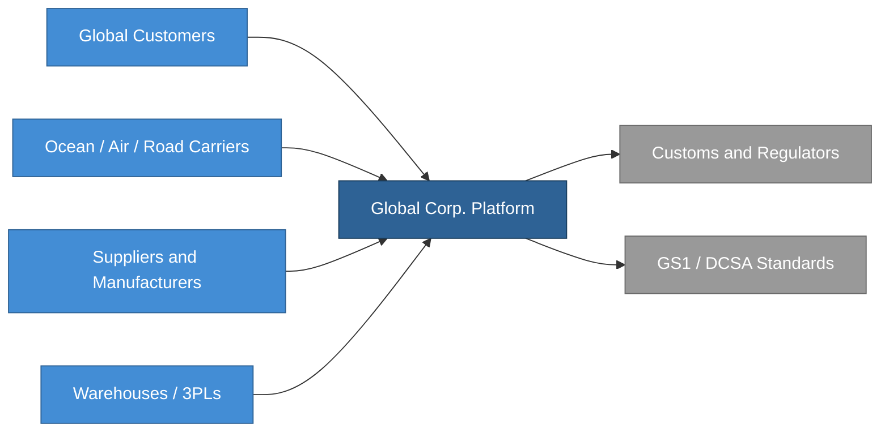

### 14.2 Business services

Global Corp. exposes the following business services.

| ID | Service | Owner |
|---|---|---|
| BSVC-01 | Visibility API and control-tower portal | PER-19 Emma Richardson |
| BSVC-02 | Partner onboarding and certification service | PER-03 Maria Oliveira |
| BSVC-03 | Compliance evidence export service | PER-17 Isabelle Laurent |
| BSVC-04 | Product traceability graph service | PER-02 Arjun Desai |
| BSVC-05 | Sustainability and DPP readiness service | PER-15 Marcus Weber |
| BSVC-06 | Exception and incident collaboration service | PER-18 Kenji Sato |
| BSVC-07 | Analytics and executive scorecard service | PER-06 Priya Raman |

## 15. Application Architecture

The target application landscape is modular but not fragmented.

### 15.1 Core application domains

| ID | Domain | Primary responsibility | Owner |
|---|---|---|---|
| APP-CX | Customer Experience | Portals, dashboards, case management, notifications | PER-19 |
| APP-PC | Partner Connectivity | API gateway, EDI translation, partner adapters, webhook handling | PER-03 |
| APP-EB | Event Backbone | Ingestion, validation, deduplication, sequencing, replay | PER-02 |
| APP-TC | Traceability Core | Canonical shipment/product graph, chain-of-custody, provenance | PER-02 |
| APP-OI | Operational Intelligence | ETA models, rule engine, alerting, workflow orchestration | PER-18 |
| APP-CC | Compliance Core | Recall workflows, audit packages, retention policies, jurisdiction packs | PER-17 |
| APP-SD | Sustainability and DPP | Product passport assembly, sustainability evidence, material provenance | PER-15 |
| APP-ES | Enterprise Services | Identity, billing, tenant management, contract and entitlement management | PER-01 |
| APP-DP | Data Platform | Lakehouse, reporting marts, model training data, historical archives | PER-02 |
| APP-SO | Security and Operations | SIEM integration, secrets, observability, vulnerability and posture management | PER-04 |

### 15.2 Logical application view

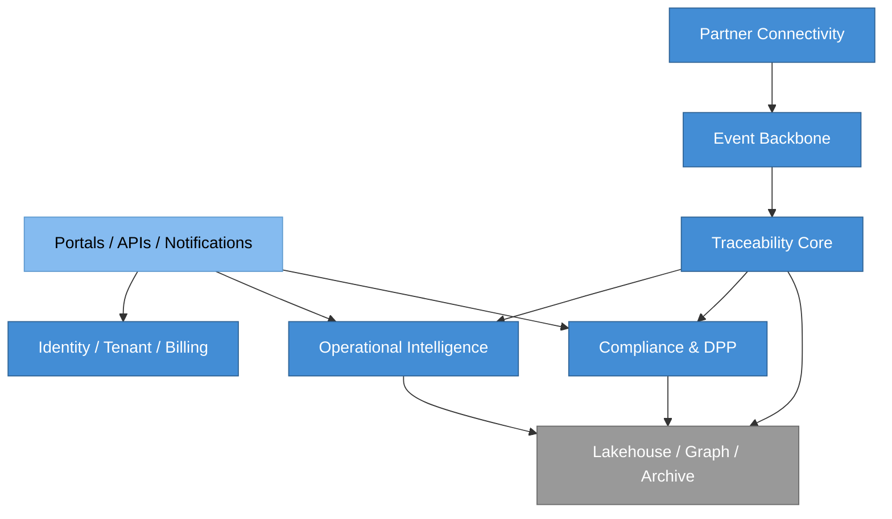

### 15.3 Application design rationale

- **Partner Connectivity (APP-PC)** is isolated because partner protocols change faster than core business semantics (implements P-01, depends on ASD-01).
- **Event Backbone (APP-EB)** is separated from **Traceability Core (APP-TC)** so ingestion elasticity does not contaminate canonical model quality (implements P-02, depends on ASD-02).
- **Compliance and DPP (APP-CC, APP-SD)** is separated from general analytics because auditability and retention obligations are stricter and more explicit (implements P-04, depends on ASD-05).
- **Operational Intelligence (APP-OI)** consumes normalized events and graph context, not raw partner payloads.
- **Enterprise Services (APP-ES)** are shared platform primitives; they are not buried inside product modules.

## 16. Information Architecture

### 16.1 Canonical information objects

Global Corp. normalizes the following enterprise objects.

| ID | Object | Description |
|---|---|---|
| ENT-01 | Organization | A legal entity that participates in shipments (customer, partner, regulator) |
| ENT-02 | Site | A physical location owned or operated by an organization |
| ENT-03 | Lane | A named origin-destination corridor with carrier preferences |
| ENT-04 | Shipment | A planned movement of goods under a carrier contract |
| ENT-05 | Consignment | A cargo unit tied to a shipment from a specific shipper to a specific consignee |
| ENT-06 | Order | A commercial order that drives one or more shipments |
| ENT-07 | Container | A physical transport unit with a unique identifier |
| ENT-08 | Pallet | An aggregation unit below container |
| ENT-09 | Case | A packing unit below pallet |
| ENT-10 | Item / Serial | A serialized product instance |
| ENT-11 | Batch / Lot | A manufacturing batch spanning many items |
| ENT-12 | Product | A product specification with category and attributes |
| ENT-13 | Event | A canonical visibility event (see section 16.2) |
| ENT-14 | Document | A regulatory, commercial, or operational document attached to shipments or products |
| ENT-15 | CustodyRecord | A record of who physically or logically held an item, container, or shipment at a time |
| ENT-16 | ComplianceCase | A regulatory case (recall, audit, inspection) |
| ENT-17 | Alert | An operational exception signal raised by rules or models |
| ENT-18 | Exception | A human-confirmed deviation requiring resolution |
| ENT-19 | PartnerContract | The commercial and technical agreement with a partner organization |

### 16.2 Event entity (formal definition)

```
ENT-13 Event
  id: EventId                       // UUIDv7, time-ordered
  subjectId: SubjectRef             // points to Item, Container, Shipment, etc.
  eventType: EventType              // ObjectEvent, AggregationEvent, TransformationEvent, AssociationEvent
  businessStep: BusinessStepCode    // EPCIS CBV-aligned
  timestamp: UtcInstant             // event occurrence
  receivedAt: UtcInstant            // platform receipt
  sourceSystemId: SourceSystemRef
  sourceEvidenceRef: EvidenceUri    // required, see INV-01
  location: LocationRef             // optional
  businessContext: BusinessContext  // optional structured context
  actorId: OrganizationRef
  transportUnit: TransportUnitRef   // optional
  parentAggregation: SubjectRef     // optional
  sensorMeasurements: Measurement[] // optional
  confidenceScore: Confidence       // 0.0 to 1.0
  lineagePointer: LineageRef        // chain back to source event(s)
  payloadHash: Sha256Hash           // required, see INV-02
```

### 16.3 Contracts

| ID | Contract | Purpose | Owner |
|---|---|---|---|
| CTR-01 | EventIngestion | Accept raw partner events, return a canonical event or a rejection | PER-02 |
| CTR-02 | EvidenceRetrieval | Given an event, return the source payload and lineage chain | PER-17 |
| CTR-03 | ComplianceExport | Given a compliance case, produce a signed evidence package | PER-17 |
| CTR-04 | ETAPredict | Given a shipment, return predicted ETA with confidence | PER-18 |
| CTR-05 | PartnerOnboard | Given a partner profile, return a certification status and mapping pack | PER-03 |

**CTR-01 EventIngestion (formal)**

```
contract CTR-01 EventIngestion
  preconditions:
    - partner is certified (see CTR-05)
    - payload is well-formed JSON or valid EPCIS XML
    - payload signature is valid under partner's registered key
  postconditions:
    - on accept: a canonical Event (ENT-13) is persisted with payloadHash set, lineagePointer set, confidenceScore computed
    - on reject: a RejectionRecord is persisted with reason code and retained payload hash
    - the partner receives a synchronous ack with the canonical event ID or the rejection reason
  invariants:
    - INV-01 payload hash retention
    - INV-02 lineage completeness
  error modes:
    - PARTNER_NOT_CERTIFIED, SIGNATURE_INVALID, PAYLOAD_MALFORMED, DUPLICATE_EVENT, SCHEMA_UNKNOWN
```

### 16.4 Invariants

| ID | Invariant | Scope | Owner |
|---|---|---|---|
| INV-01 | Every canonical event retains the SHA-256 hash of its original partner payload | Traceability Core, Event Backbone | PER-02 |
| INV-02 | Every canonical event has a lineage pointer that resolves to at least one source evidence record | Traceability Core | PER-02 |
| INV-03 | No externally visible shipment state exists without a supporting event chain | Control Tower, Customer Experience | PER-18 |
| INV-04 | Product, asset, shipment, and facility identifiers are mastered independently and joined through graph relationships only | Traceability Core, Data Platform | PER-02 |
| INV-05 | Retention policies are applied per jurisdiction at write time, not at read time | Compliance Core, Data Platform | PER-17 |
| INV-06 | PII fields are minimized and never replicated outside the region of origin unless a regional waiver authorizes the replication | Compliance Core, Data Platform | PER-08 |

### 16.5 Information policies

1. No externally visible status exists without a retained source evidence pointer (INV-01).
2. Every canonical event retains its original partner payload hash (INV-01).
3. Product, asset, shipment, and facility identifiers are mastered separately and linked through graph relationships (INV-04).
4. Retention policies are jurisdiction-sensitive (INV-05).
5. Personally identifiable information is minimized and regionally controlled (INV-06).

## 17. Integration Architecture

### 17.1 Integration patterns

Global Corp. supports multiple partner interaction styles:

- REST / JSON APIs
- webhooks
- AS2 / SFTP batch exchange
- EDI for legacy logistics partners
- GS1 EPCIS capture and query flows
- DCSA-compatible event APIs for ocean tracking
- IoT telemetry ingestion for temperature, shock, and location
- document ingestion for certificates, bills of lading, declarations, and inspection artifacts

### 17.2 Integration policy

- Standards-compliant integration paths are preferred (P-01).
- Every non-standard integration requires an onboarding exception memo backed by a waiver.
- Every partner integration gets a certification profile (CTR-05).
- Adapters are versioned and region-aware.
- Breaking changes require a customer and partner transition plan.

## 18. Deployment and Operations Architecture

### 18.1 Deployment model

Global Corp. runs a global, multi-region cloud deployment with regional control points.

- **Primary regions:** EU, US, APAC
- **Secondary regions:** Middle East, Latin America
- **Control model:** global shared control plane, regional data planes
- **Tenant strategy:** logical multi-tenancy with tenant-isolated encryption scopes
- **Data strategy:** operational event stores region-local where required; replicated metadata and aggregate analytics where allowed (INV-05, INV-06)

### 18.2 Deployment view

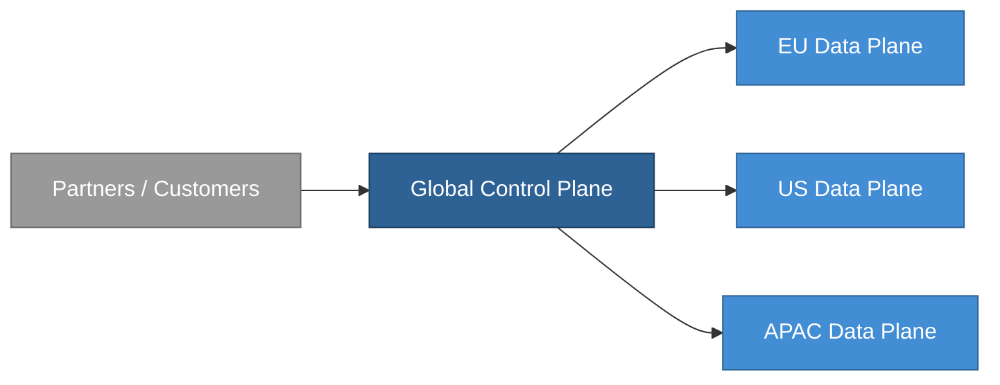

### 18.3 Component-to-node instance mapping

| Component | Global Control Plane | EU Plane | US Plane | APAC Plane |
|---|---|---|---|---|
| APP-ES Identity | Primary | Read replica | Read replica | Read replica |
| APP-ES Billing | Primary | N/A | N/A | N/A |
| APP-PC Partner Gateway | Routing | Regional instance | Regional instance | Regional instance |
| APP-EB Event Backbone | N/A | Regional primary | Regional primary | Regional primary |
| APP-TC Traceability Core | Metadata only | Regional primary | Regional primary | Regional primary |
| APP-OI Operational Intelligence | Aggregation | Regional instance | Regional instance | Regional instance |
| APP-CC Compliance Core | Policy engine | Regional primary | Regional primary | Regional primary |
| APP-DP Data Platform | Cross-region aggregation | Regional warehouse | Regional warehouse | Regional warehouse |
| APP-SO Security Ops | SIEM, policy | Collectors | Collectors | Collectors |

### 18.4 Operational posture

- 24x7 follow-the-sun operations (PER-20 SRE lead)
- centralized architecture standards with regional adaptation packs
- platform SRE plus regional incident coordinators
- shared observability, distributed runbooks
- disaster recovery by region and critical service tier

## 19. Security and Trust Architecture

### 19.1 Security objectives

- protect customer and partner data
- preserve integrity of event evidence (INV-01, INV-02)
- support tenant isolation
- reduce third-party and supplier cyber risk
- support jurisdiction-specific compliance
- maintain forensic traceability

### 19.2 Security architecture controls

- zero-trust network assumptions
- centralized identity and policy decision points
- workload identity for service-to-service calls
- encryption in transit and at rest
- immutable evidence logs for externally significant events
- software supply chain controls for internal development
- third-party risk scoring and onboarding reviews
- regional key management
- privileged access segregation
- continuous compliance scanning

### 19.3 Security rationale

This architecture aligns with the practical need to treat cyber supply chain risk management as a first-class operating capability, not as an afterthought. [R12] It also reflects the broader supply-chain security posture described by ISO 28000. [R13] The security viewpoint (VP-07) in section 28.7 gives the view that visualizes these controls.

## 20. Dynamic Interactions

Selected runtime sequences that exercise the canonical model.

### 20.1 DYN-01 Partner submits event batch

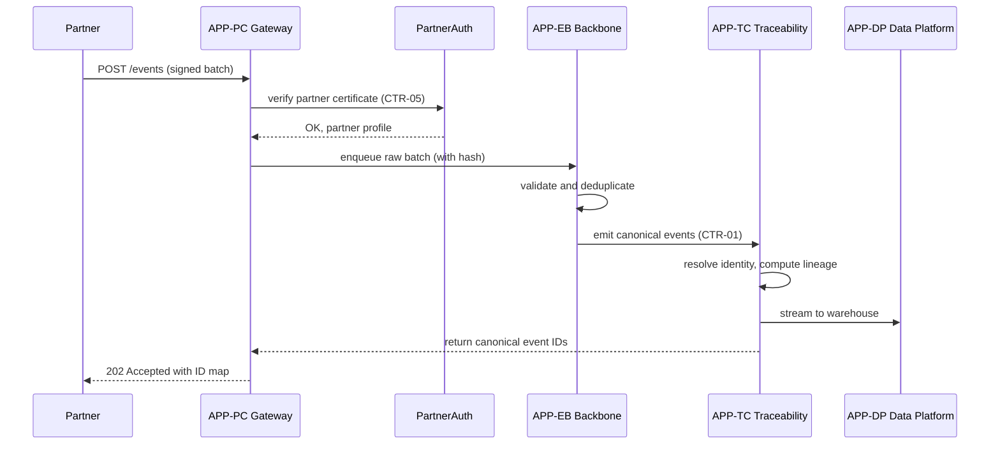

### 20.2 DYN-02 Customer requests ETA

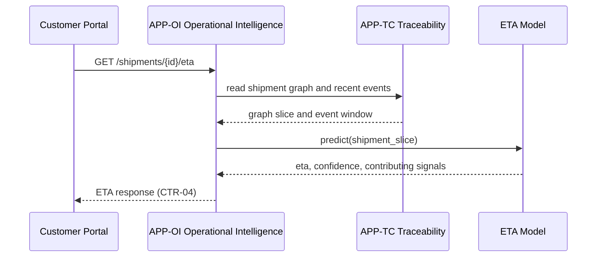

### 20.3 DYN-03 Compliance evidence export

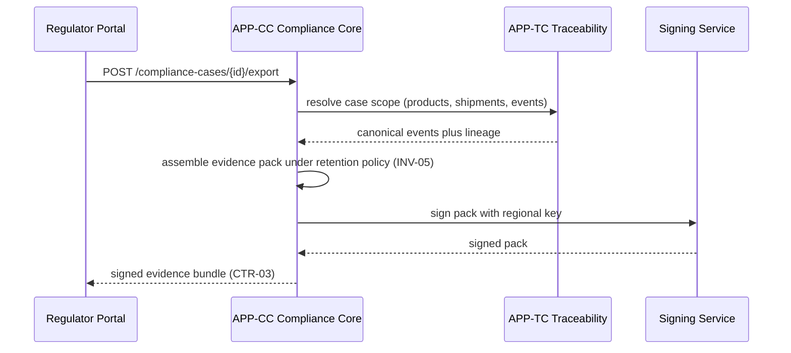

### 20.4 DYN-04 Waiver request and approval

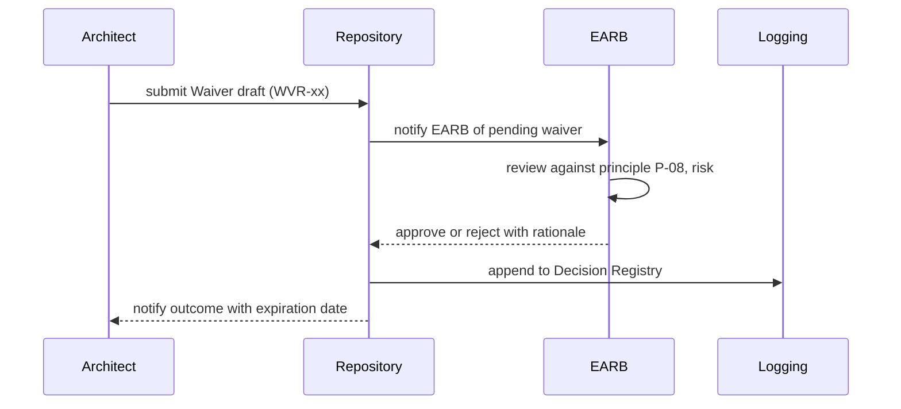

## 21. Architecturally Significant Requirements

**CoDL itemType:** ASRCard

Each ASR carries an owner, approver, implementing principle, and verification approach. The ID column in this table maps to the CoDL `slug` field for each ASRCard concept instance.

| ID | ASR | Why it matters | Implements | Owner | Approver | Verification |
|---|---|---|---|---|---|---|
| ASR-01 | The platform must ingest and normalize multi-party events across modes and regions with auditable lineage | Core business value | P-02, P-03 | PER-02 | PER-11 | CTR-01, INV-02 |
| ASR-02 | Every customer-visible shipment or product state must be explainable from retained evidence | Trust and compliance | P-03, P-04, P-10 | PER-17 | PER-11 | INV-01, INV-03, CTR-02 |
| ASR-03 | The platform must support regional data-residency enforcement where required | Global operations | P-09 | PER-17 | PER-08 | INV-05, INV-06 |
| ASR-04 | Partner onboarding must not require core-model rewrites for each carrier or supplier | Scalability | P-01 | PER-03 | PER-11 | CTR-05 |
| ASR-05 | High-severity disruptions must trigger actionable exceptions within 5 minutes median, 10 minutes p95 | Operational value | P-02 | PER-18 | PER-07 | MET-OP-03 |
| ASR-06 | Compliance evidence packages must be reproducible and exportable on demand within 4 hours | Regulatory support | P-04 | PER-17 | PER-10 | CTR-03, MET-OP-06 |
| ASR-07 | The architecture must support both shipment-level and product-level traceability | Market breadth | P-03 | PER-02 | PER-09 | ENT-04, ENT-10, ENT-11, ENT-12 |
| ASR-08 | Governance exceptions must be explicit, time-bounded, and reviewable | Architecture control | P-08 | PER-11 | PER-05 | Waiver register (section 26) |
| ASR-09 | Repository artifacts must be useful, owned, and current within their freshness SLA | BTABOK repository discipline | P-05, P-06, P-07 | PER-16 | PER-11 | MET-AR-02, MET-AR-04 |
| ASR-10 | The platform must support decommissioning and backward-compatible transition plans for legacy protocols | Long-term maintainability | P-01 | PER-03 | PER-11 | Section 29 |

## 22. Architecturally Significant Decisions

**CoDL itemType:** DecisionRecord

Each ASD uses the full BTABOK decision shape: scope, type, options considered, recommendation, reversibility, linked ASRs, status, approver, and date. The ASD-xx identifiers map to the CoDL `slug` field for each DecisionRecord concept instance.

The per-decision field-value blocks below (ASD-01 through ASD-08) illustrate the shape of a CoDL DecisionRecord concept. A formal CoDL definition declares these fields (Scope, Type, Options, Recommendation, Reversibility, Method, Linked ASRs, Linked principles, Cascades, Status, Owner, Approver, Decided) as typed sections and metadata rather than free-form rows. A representative CoDL definition looks roughly like:

```codl
concept DecisionRecord extends StandardMetadata {
  scope: enum(Enterprise, Solution, Component)
  type: enum(Structural, Constraint, Principle, Tactical)
  options: list<shortText>
  recommendation: shortText
  reversibility: enum(High, Medium, Low, NearImpossible)
  method: enum(Opinion, Scoring, CostBenefit, BudgetedEvaluation, Spike)
  linkedASRs: list<ref<ASRCard>>
  linkedPrinciples: list<ref<PrincipleCard>>
  cascades: list<ref<DecisionRecord | WaiverRecord>>
  status: enum(Proposed, Accepted, Superseded, Rejected)
  owner: PersonRef
  approver: PersonRef
  decided: date
}
```

### 22.1 ASD-01 Adopt standards-first canonical model

| Field | Value |
|---|---|
| Scope | Enterprise |
| Type | Structural |
| Options considered | (a) bespoke canonical schema; (b) EPCIS-aligned canonical with transport extensions; (c) partner-pass-through with no canonical |
| Recommendation | (b) EPCIS-aligned canonical with DCSA transport extensions |
| Reversibility | Low |
| Method | Budgeted evaluation with standards workshop |
| Linked ASRs | ASR-01, ASR-04, ASR-07 |
| Linked principles | P-01, P-02 |
| Cascades | ASD-02, ASD-04 |
| Status | Accepted |
| Owner | PER-02 |
| Approver | PER-11 |
| Decided | 2025-11-08 |

### 22.2 ASD-02 Separate ingestion from canonical traceability core

| Field | Value |
|---|---|
| Scope | Solution |
| Type | Structural |
| Options considered | (a) single ingestion-and-canonical service; (b) separate Event Backbone and Traceability Core |
| Recommendation | (b) separate services |
| Reversibility | Medium |
| Method | Architecture spike with load modeling |
| Linked ASRs | ASR-01 |
| Linked principles | P-02 |
| Cascades | ASD-05 |
| Status | Accepted |
| Owner | PER-02 |
| Approver | PER-11 |
| Decided | 2025-11-22 |

### 22.3 ASD-03 Use regional data planes

| Field | Value |
|---|---|
| Scope | Enterprise |
| Type | Constraint |
| Options considered | (a) single global data plane; (b) regional data planes with global control plane; (c) fully federated per-tenant planes |
| Recommendation | (b) regional data planes with global control plane |
| Reversibility | Near impossible |
| Method | Budgeted evaluation including legal review |
| Linked ASRs | ASR-03 |
| Linked principles | P-09 |
| Cascades | WVR-02 |
| Status | Accepted |
| Owner | PER-17 |
| Approver | PER-05 |
| Decided | 2025-12-02 |

### 22.4 ASD-04 Treat lineage as a first-class data object

| Field | Value |
|---|---|
| Scope | Solution |
| Type | Structural |
| Options considered | (a) derived lineage computed on demand; (b) lineage as first-class persisted object with pointers |
| Recommendation | (b) first-class lineage |
| Reversibility | Low |
| Method | Cost-benefit analysis |
| Linked ASRs | ASR-02, ASR-06 |
| Linked principles | P-03, P-04 |
| Cascades | INV-01, INV-02 |
| Status | Accepted |
| Owner | PER-02 |
| Approver | PER-11 |
| Decided | 2025-12-14 |

### 22.5 ASD-05 Keep compliance services separate from general analytics

| Field | Value |
|---|---|
| Scope | Solution |
| Type | Structural |
| Options considered | (a) shared analytics and compliance stack; (b) separate compliance services with dedicated retention and signing |
| Recommendation | (b) separate compliance services |
| Reversibility | Medium |
| Method | Scoring |
| Linked ASRs | ASR-06, ASR-03 |
| Linked principles | P-04, P-09 |
| Cascades | INV-05, INV-06 |
| Status | Accepted |
| Owner | PER-17 |
| Approver | PER-10 |
| Decided | 2026-01-09 |

### 22.6 ASD-06 Use a curated architecture repository with explicit ownership

| Field | Value |
|---|---|
| Scope | Enterprise |
| Type | Constraint |
| Options considered | (a) free-for-all Confluence; (b) curated repository with ownership, freshness SLAs, archival rules |
| Recommendation | (b) curated repository |
| Reversibility | Medium |
| Method | Opinion plus reference-benchmarking |
| Linked ASRs | ASR-09 |
| Linked principles | P-05, P-06, P-07 |
| Cascades | CAP-REP-01 |
| Status | Accepted |
| Owner | PER-16 |
| Approver | PER-11 |
| Decided | 2026-01-20 |

### 22.7 ASD-07 Formalize waiver process

| Field | Value |
|---|---|
| Scope | Enterprise |
| Type | Constraint |
| Options considered | (a) informal exceptions via email; (b) formal waiver process with ID, expiration, approver |
| Recommendation | (b) formal waiver process |
| Reversibility | Low |
| Method | Scoring |
| Linked ASRs | ASR-08 |
| Linked principles | P-08 |
| Cascades | Section 26 waivers |
| Status | Accepted |
| Owner | PER-11 |
| Approver | PER-05 |
| Decided | 2026-01-27 |

### 22.8 ASD-08 Use BTABOK-style lightweight deliverables

| Field | Value |
|---|---|
| Scope | Enterprise |
| Type | Principle |
| Options considered | (a) full TOGAF-style deliverable set; (b) BTABOK-style minimum durable deliverable set |
| Recommendation | (b) BTABOK-style minimum set |
| Reversibility | Medium |
| Method | Opinion |
| Linked ASRs | ASR-09 |
| Linked principles | P-05, P-06 |
| Cascades | Section 24 |
| Status | Accepted |
| Owner | PER-01 |
| Approver | PER-11 |
| Decided | 2026-02-03 |

## 23. ASR-to-ASD Traceability Matrix

Bidirectional mapping linking each ASR to the ASDs that address it and vice versa.

| | ASD-01 | ASD-02 | ASD-03 | ASD-04 | ASD-05 | ASD-06 | ASD-07 | ASD-08 |
|---|---|---|---|---|---|---|---|---|
| ASR-01 | X | X | | X | | | | |
| ASR-02 | | | | X | X | | | |
| ASR-03 | | | X | | X | | | |
| ASR-04 | X | | | | | | | |
| ASR-05 | | X | | | | | | |
| ASR-06 | | | | X | X | | | |
| ASR-07 | X | | | X | | | | |
| ASR-08 | | | | | | | X | |
| ASR-09 | | | | | | X | | X |
| ASR-10 | X | | | | | | | |

Each ASR has at least one addressing ASD. Each ASD addresses at least one ASR. No decision is orphaned from the requirement base.

## 24. Repository and Deliverables

BTABOK describes the repository as being first for architects, and warns that maintained documentation should stay minimal and useful. [R4][R5]

### 24.1 Repository structure

| ID | Repository area | Contents | Steward |
|---|---|---|---|
| REP-ST | Strategy | Business cases, objective trees, investment themes, roadmaps | PER-06 |
| REP-PS | Principles and Standards | Principle catalog, standards profiles, approved reference patterns | PER-01 |
| REP-DR | Decision Registry | ASDs, waivers, consequences, linked ASRs | PER-11 |
| REP-VL | Viewpoint Library | Reusable viewpoint templates and example views | PER-16 |
| REP-DM | Domain Models | Capability map, information concepts, master taxonomy | PER-02 |
| REP-RA | Reference Architectures | Integration, data, security, deployment, analytics, compliance | PER-01 |
| REP-DA | Delivery Alignment | Initiative traceability, architecture checkpoints, implementation evidence | PER-19 |
| REP-OM | Operate and Measure | KPI definitions, outcome scorecards, architecture fitness metrics | PER-06 |

### 24.2 Minimum durable deliverable set

Every deliverable has an ID, an owner, an approver, a review cadence, a freshness SLA, and an intended decision audience. The ID column in this table maps to the CoDL `slug` field for each deliverable concept instance.

| ID | Deliverable | Owner | Approver | Cadence | Freshness SLA | Audience |
|---|---|---|---|---|---|---|
| DEL-01 | Business Case | PER-05 | PER-06 | Annual | 12 months | ETSC |
| DEL-02 | Capability Map | PER-01 | PER-11 | Semi-annual | 6 months | Product, EARB |
| DEL-03 | Stakeholder and Concern Map | PER-11 | PER-05 | Quarterly | 3 months | EARB |
| DEL-04 | ASR Catalog | PER-01 | PER-11 | Quarterly | 3 months | EARB, domain councils |
| DEL-05 | Decision Registry | PER-11 | PER-01 | Continuous | 30 days | Everyone |
| DEL-06 | Principle Catalog | PER-01 | PER-11 | Annual | 12 months | Everyone |
| DEL-07 | Reference Architecture Pack | PER-01 | PER-11 | Semi-annual | 6 months | Engineering |
| DEL-08 | Roadmap and Transition Architecture | PER-01 | PER-05 | Quarterly | 3 months | ETSC, product |
| DEL-09 | Waiver Register | PER-11 | PER-05 | Continuous | 30 days | EARB, auditors |
| DEL-10 | Outcome Scorecard | PER-06 | PER-05 | Monthly | 30 days | ETSC, domain councils |
| DEL-11 | Standards Catalog | PER-01 | PER-11 | Semi-annual | 6 months | Engineering, partners |
| DEL-12 | Viewpoint Catalog and View Gallery | PER-16 | PER-11 | Semi-annual | 6 months | Everyone |

## 25. Governance Model

**CoDL itemType:** GovernanceBody for section 25.1, GovernanceRule for section 25.2.

### 25.1 Governance bodies

| ID | Body | Scope | Authority | Chair | Cadence |
|---|---|---|---|---|---|
| GOV-ETSC | Executive Technology Steering Committee | Funding, strategic direction, major platform bets | Approve strategic assignments | PER-05 | Quarterly |
| GOV-EARB | Enterprise Architecture Review Board | Reference architecture, major decisions, waivers | Approve or reject material architecture changes | PER-11 | Biweekly |
| GOV-DDC-D | Domain Design Council: Data | Data canonical model, information policies | Define data standards | PER-02 | Biweekly |
| GOV-DDC-I | Domain Design Council: Integration | Partner integration patterns and standards | Define integration standards | PER-03 | Biweekly |
| GOV-DDC-S | Domain Design Council: Security | Security architecture, third-party risk | Define security standards | PER-04 | Biweekly |
| GOV-DDC-O | Domain Design Council: Operations | Observability, SRE, runbooks | Define operational standards | PER-18 | Biweekly |
| GOV-DDC-C | Domain Design Council: Compliance | Retention, audit, regulatory packs | Define compliance standards | PER-17 | Biweekly |
| GOV-RAF-EU | Regional Architecture Forum, EU | Local legal and operational fit | Escalate local exceptions | PER-15 | Monthly |
| GOV-RAF-US | Regional Architecture Forum, Americas | Local legal and operational fit | Escalate local exceptions | PER-13 | Monthly |
| GOV-RAF-APAC | Regional Architecture Forum, APAC | Local legal and operational fit | Escalate local exceptions | PER-12 | Monthly |
| GOV-RAF-MEA | Regional Architecture Forum, MEA | Local legal and operational fit | Escalate local exceptions | PER-14 | Monthly |
| GOV-RSG | Repository Stewardship Group | Artifact freshness, taxonomy, viewpoint catalog | Archive stale artifacts and enforce ownership | PER-16 | Monthly |

### 25.2 Governance rules

1. Every material architecture change requires named sponsor, named architect owner, affected ASRs, decision record, impacted standards statement.
2. Every exception requires waiver ID, justification, risk assessment, expiration date, approver.
3. Every reusable standard must have owner, target audience, effective date, review cadence.
4. Every major delivery initiative must show target capability movement, expected benefit metric, required viewpoints, verification plan.

### 25.3 Governance posture

Global Corp. uses **guided governance**, not punitive governance. Validation surfaces warnings by default. Treat-warnings-as-errors is a per-initiative opt-in. This is consistent with BTABOK's emphasis that governance should remain practical, stakeholder-informed, and enabling. [R6]

### 25.4 RACI for representative decision types

| Decision type | Responsible | Accountable | Consulted | Informed |
|---|---|---|---|---|
| New canonical entity added to Event model | DDC-D (GOV-DDC-D) | EARB (GOV-EARB) | DDC-I, DDC-C | Engineering leads |
| New partner integration outside standards | DDC-I | EARB | DDC-D, legal | Regional forum |
| Retention policy change for a jurisdiction | DDC-C | EARB | CISO, legal | Regional forum |
| Regional data residency waiver | DDC-C, CISO | EARB | DDC-D, legal | ETSC |
| Standard deprecation | DDC-I | EARB | Partners, engineering | Customers |

## 26. Waiver Register

**CoDL itemType:** WaiverRecord

Concrete waivers demonstrating the pattern. Every waiver has a rule reference, justification, risk, expiration, and approver. The WVR-xx identifiers map to the CoDL `slug` field for each WaiverRecord concept instance.

### 26.1 WVR-01 Non-standard integration for FreightCo

| Field | Value |
|---|---|
| Rule reference | P-01 Standards before custom, ASD-01 |
| Description | FreightCo uses a proprietary XML feed. No EPCIS or DCSA equivalent exists for their consolidation events. Custom adapter required. |
| Justification | FreightCo represents 14% of APAC consolidation volume. No feasible alternative in 2026. |
| Risk | Custom mapping increases onboarding cost for similar partners and creates ongoing maintenance obligation. |
| Compensating controls | Adapter isolated in APP-PC, quarterly review for standards emergence, sunset clause on next FreightCo API release. |
| Requested by | PER-03 Maria Oliveira |
| Approver | PER-11 Anja Petersen (EARB) |
| Approved | 2026-03-02 |
| Expires | 2027-03-02 |
| Status | Active |

### 26.2 WVR-02 Cross-region metadata replication for EU DPP index

| Field | Value |
|---|---|
| Rule reference | INV-06 PII regional control, ASD-03 |
| Description | EU DPP index queries require product metadata to be available in a cross-region read path. |
| Justification | DPP queries arrive from multiple regions; regional-only access fails read latency SLA. |
| Risk | Metadata carries limited supplier identifiers that may be interpreted as PII under some readings. |
| Compensating controls | Metadata scrubbed of direct PII; legal review signed off; quarterly audit of replicated fields. |
| Requested by | PER-15 Marcus Weber |
| Approver | PER-08 Chioma Okafor (CISO) and PER-11 Anja Petersen (EARB) |
| Approved | 2026-02-18 |
| Expires | 2026-08-18 |
| Status | Active, renewal review pending |

### 26.3 WVR-03 Temporary suspension of autonomy check for Legacy-Bridge module

| Field | Value |
|---|---|
| Rule reference | P-07 Repository discipline, reference architecture for APP-PC |
| Description | Legacy-Bridge module shares a canonical model library with its successor during the LGY-01 decommissioning window. |
| Justification | Parallel operation required during migration to guarantee evidence continuity. |
| Risk | Shared library reduces isolation until migration completes. |
| Compensating controls | Freeze changes to shared library; daily integrity audit; migration completion target 2026-07-31. |
| Requested by | PER-18 Kenji Sato |
| Approver | PER-11 Anja Petersen (EARB) |
| Approved | 2026-03-14 |
| Expires | 2026-08-31 |
| Status | Active |

## 27. Viewpoint Catalog

**CoDL itemType:** ViewpointCard

Global Corp. uses a reusable viewpoint catalog. Each viewpoint has an ID, audience, concern, required models, and an owner. The View Gallery in section 28 instantiates each viewpoint with at least one concrete view. The ID column in this table maps to the CoDL `slug` field for each ViewpointCard concept instance.

| ID | Viewpoint | Audience | Concern answered | Required models | Owner |
|---|---|---|---|---|---|
| VP-01 | Strategic | CEO, CFO, board | Why are we doing this and what value do we expect? | Objective tree, benefit metric map | PER-05 |
| VP-02 | Capability | Product and enterprise leaders | Which capabilities matter and where are the gaps? | Capability heat map | PER-09 |
| VP-03 | Stakeholder | Sponsors, change leaders | Who is affected, who decides, who resists? | Power-interest grid, concern map | PER-11 |
| VP-04 | Information | Data and compliance teams | What is the canonical meaning of tracked things and events? | Entity model, event model, lineage model | PER-02 |
| VP-05 | Integration | Engineering and partner teams | How do partners connect and how are standards applied? | Partner interaction model, standards adoption map | PER-03 |
| VP-06 | Operational | Control-tower and SRE teams | How does the business run day to day? | Process flow, exception flow | PER-18 |
| VP-07 | Security | CISO, auditors, regulators | How are trust, isolation, and evidence maintained? | Trust boundary model, control map | PER-04 |
| VP-08 | Deployment | Infrastructure and operations leaders | Where does it run and how is resilience achieved? | Deployment topology, failover map | PER-20 |
| VP-09 | Governance | EARB, executives | How are standards, waivers, and major decisions controlled? | Approval flow, RACI | PER-11 |
| VP-10 | Outcome | Sponsors and finance | Are we realizing the promised value? | Outcome scorecard | PER-06 |

## 28. View Gallery

**CoDL itemType:** CanvasDefinition (CaDL)

One view per viewpoint. Each view (V-01 through V-10) is a CaDL canvas definition over one or more CoDL concepts defined elsewhere in this document. Following the governing CaDL principle that a canvas is a view of a concept and not a separate stored object type, the Mermaid diagrams below are the rendered output; the CaDL definition describes which concepts, sections, and fields are surfaced by the canvas. The V-xx identifiers map to the CoDL `slug` field for each CanvasDefinition instance.

An illustrative CaDL definition for V-01 (the strategic objective tree) is shown below. The Mermaid rendering that follows remains the canonical human-readable output; the CaDL block is the structural intent.

```cadl
canvas V-01-strategic-objective-tree {
  renders: viewpoint<VP-01>
  audience: [STK-01, STK-02, STK-12]
  layout: tree
  root: concept<EnterpriseArchitecture>.mission
  branches: list<concept<Objective>> from strategic.objectives
  leaves: list<concept<ASRCard>> from objective.implementedBy
  surfaces: [slug, name, shortDescription]
  rendererHints: { orientation: "top-down", grouping: "by-objective" }
}
```

### 28.1 V-01 Strategic view: objective tree (VP-01)

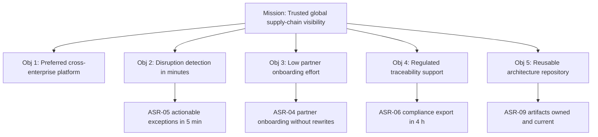

### 28.2 V-02 Capability heat map view (VP-02)

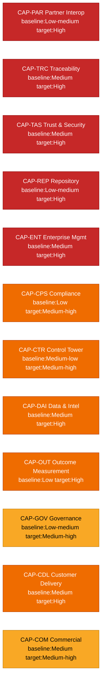

### 28.3 V-03 Stakeholder power-interest grid view (VP-03)

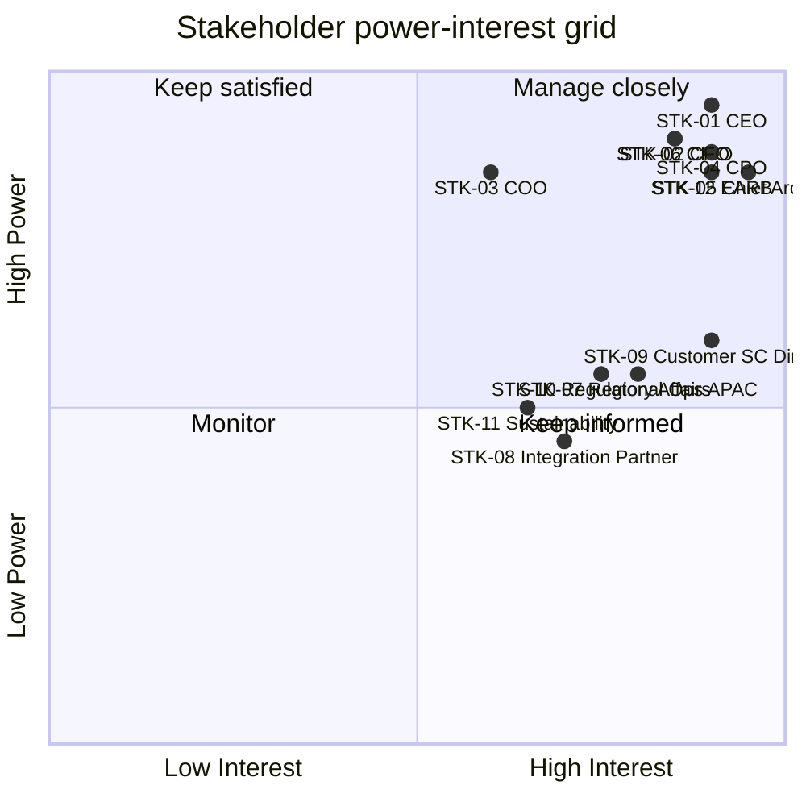

### 28.4 V-04 Information view: canonical event lineage (VP-04)

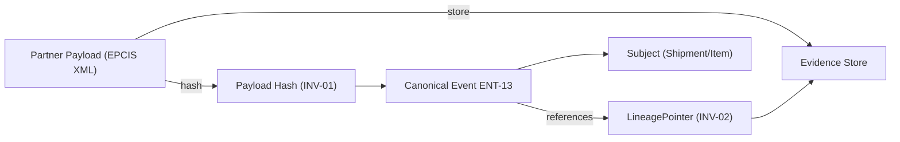

### 28.5 V-05 Integration view: partner interaction model (VP-05)

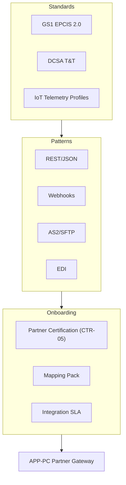

### 28.6 V-06 Operational view: exception management flow (VP-06)

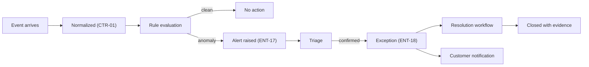

### 28.7 V-07 Security view: trust boundaries (VP-07)

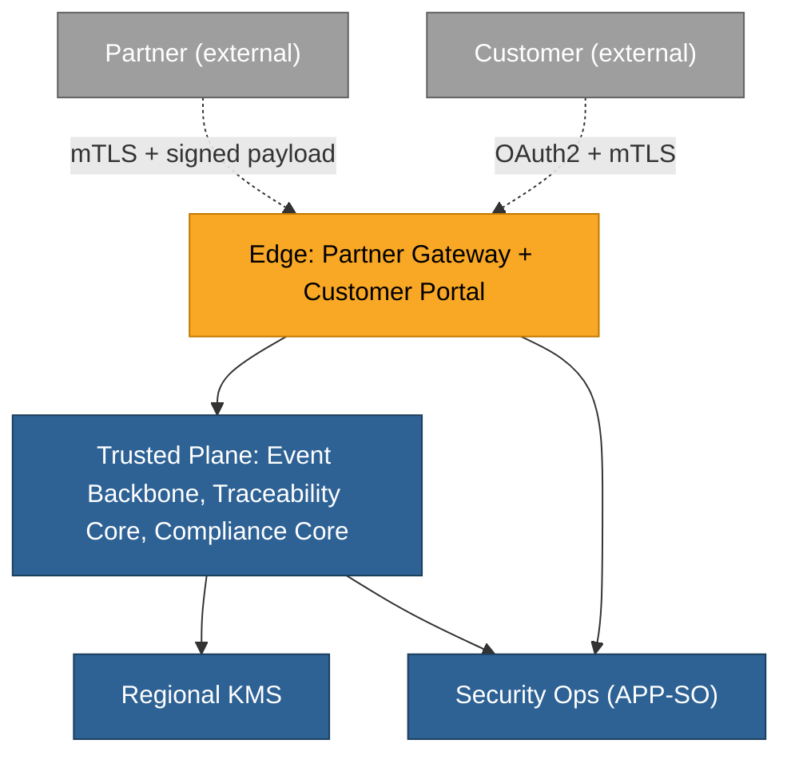

### 28.8 V-08 Deployment view: regional failover (VP-08)

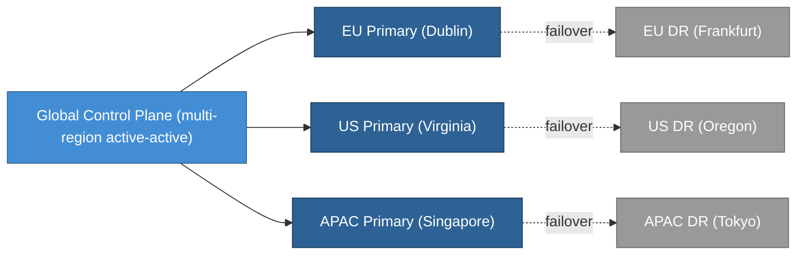

### 28.9 V-09 Governance view: approval flow (VP-09)

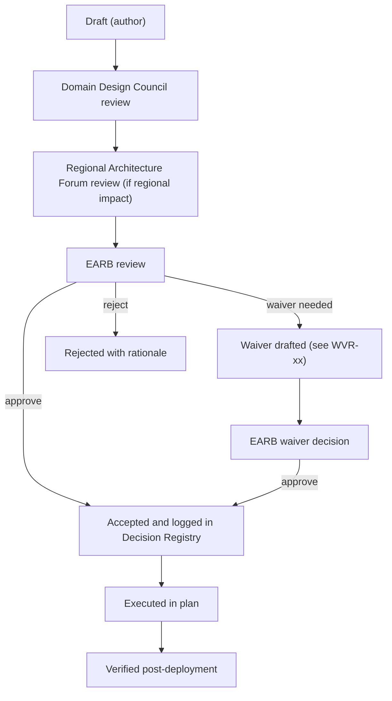

### 28.10 V-10 Outcome view: scorecard (VP-10)

See section 32 for the full Outcome Scorecard. This view renders the top-line KPI panel referenced by VP-10.

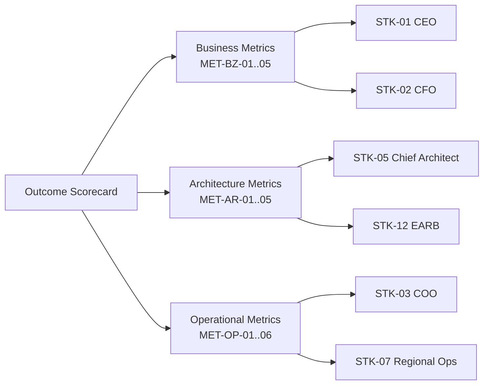

## 29. Legacy Modernization

**CoDL itemType:** LegacyModernizationRecord

The LGY-xx identifiers map to the CoDL `slug` field for each LegacyModernizationRecord concept instance.

### 29.1 LGY-01 GlobalTrack-APAC v3 decommissioning

| Field | Value |
|---|---|
| System | GlobalTrack-APAC v3 |
| Acquired via | 2022 acquisition of APAC logistics analytics firm |
| Current scope | Visibility tooling for 112 APAC customers, ocean and road only |
| Replaced by | APP-TC, APP-OI, APP-CX (Global Corp. core) |
| Owner | PER-12 Ravi Menon |
| Sponsor | PER-07 Hiroshi Tanaka |
| Current state | Production, feature-frozen |
| Target state | Decommissioned |
| Migration window | 2026-03-01 to 2026-08-31 |
| Evidence preservation | Full event history exported to APP-DP Data Platform archive with lineage preserved |
| Customer migration plan | Tiered, 14 customer waves by volume and contract renewal date |
| Parallel operation | Shared canonical library under WVR-03 until cutover |
| Risks | Evidence discontinuity, customer retention during migration, partner API breakage |
| Mitigations | Daily integrity audit, dedicated migration team, per-customer parallel run of 30 days |
| Status | Active, wave 4 of 14 |

### 29.2 LGY-02 Legacy EDI 214 consolidation handler

| Field | Value |
|---|---|
| System | EDI214-Adapter-v2 |
| Current scope | 23 US road carriers still transmit via EDI 214 only |
| Target state | Retained as bridge until standards adoption exceeds 90% of US carriers |
| Owner | PER-03 Maria Oliveira |
| Sponsor | PER-13 Sarah Goldberg |
| Review cadence | Quarterly against standards-adoption metric |
| Status | Retained |

## 30. Roadmap and Transition Architectures

**CoDL itemType:** TransitionArchitecture for each T1/T2/T3 and target block; RoadmapItem for capability movements within a transition.

Each transition references specific capability movements (baseline to target) and the ASRs/ASDs it advances.

### 30.1 Baseline architecture

- Fragmented point integrations (CAP-PAR-01 at Low-medium)
- Region-specific visibility tools including LGY-01
- Inconsistent event semantics (no canonical model)
- Weak audit lineage (no INV-01/INV-02 enforcement)
- Inconsistent partner onboarding time (CAP-PAR-01 weak)
- Manual compliance reporting (CAP-CPS-01 at Low)

### 30.2 Transition T1: Foundation (months 0-9)

- Establish canonical event model (ASD-01, ENT-13)
- Build partner connectivity layer (APP-PC)
- Launch repository and decision registry (ASD-06, CAP-REP-01 move to Medium)
- Deploy first cross-region control plane
- Capability movements: CAP-PAR-01 Low-medium to Medium, CAP-TRC-01 Medium to Medium-high, CAP-REP-01 Low-medium to Medium

### 30.3 Transition T2: Operational excellence (months 9-18)

- Introduce traceability graph (ASD-04)
- Launch exception management and ETA intelligence (ASR-05)
- Standardize ocean visibility with DCSA-aligned onboarding
- Formalize waiver process (ASD-07)
- Capability movements: CAP-CTR-01 Medium-low to Medium-high, CAP-PAR-01 Medium to High, CAP-GOV-01 Low-medium to Medium-high

### 30.4 Transition T3: Compliance and sustainability (months 18-30)

- Add DPP support (EXP-02 productization)
- Add food-traceability packs (FSMA 204 alignment)
- Implement evidence exports and regional retention controls (ASR-06)
- Launch executive value dashboard (CAP-OUT-01 to High)
- Capability movements: CAP-CPS-01 Low to Medium-high, CAP-OUT-01 Low to High

### 30.5 Target architecture (month 30+)

- Global standards-first visibility platform
- Product and shipment traceability unified
- Regionalized compliance and data control
- Governed repository with durable architecture assets
- Measurable business outcomes tied to capability movement

## 31. Risks and Mitigations

**CoDL itemType:** RiskCard

The ID column in this table maps to the CoDL `slug` field for each RiskCard concept instance.

| ID | Risk | Impact | Probability | Owner | Mitigation |
|---|---|---|---|---|---|
| RSK-01 | Over-customization for large customers | Platform fragmentation | Medium | PER-01 | Standards-first policy, waiver control |
| RSK-02 | Partner data quality variability | False alerts, poor ETA quality | High | PER-03 | Lineage, confidence scoring, certification profiles |
| RSK-03 | Regional data sovereignty conflicts | Regulatory exposure | Medium | PER-17 | Regional data planes, jurisdiction packs, ASD-03 |
| RSK-04 | Artifact sprawl in repository | Low trust in architecture | High | PER-16 | Freshness SLA, archive policy, owner enforcement, ASD-06 |
| RSK-05 | Governance overload | Slower delivery | Medium | PER-11 | Guided governance, tiered review thresholds, treat-warnings-as-errors per initiative |
| RSK-06 | Weak business-value traceability | Architecture loses sponsorship | Medium | PER-06 | Outcome scorecard (section 32), benefit owner |
| RSK-07 | Compliance surface expands faster than platform | Market lag | High | PER-10 | Modular compliance packs |
| RSK-08 | Cyber supplier risk | Compromise through ecosystem | Medium | PER-08 | Supplier risk assessments and policy requirements, P-10 |
| RSK-09 | LGY-01 migration evidence discontinuity | Customer trust loss | Low | PER-12 | Daily integrity audit, parallel run, WVR-03 |
| RSK-10 | Shadow IT reintroducing fragmentation | Architecture erosion | Medium | PER-01 | Repository visibility, discovery scans, waiver mandatory |

## 32. Outcome Scorecard

**CoDL itemType:** ScorecardDefinition (SpecChat extension)

The MET-xx identifiers map to the CoDL `slug` field for each metric concept instance within the scorecard.

### 32.1 Business metrics

| ID | Metric | Baseline | Target (month 30) | Measurement | Owner |
|---|---|---|---|---|---|
| MET-BZ-01 | Customer disruption detection time (median) | 3.4 hours | 5 minutes | Platform telemetry | PER-18 |
| MET-BZ-02 | Customer renewal rate (logo) | 82% | 93% | CRM | PER-09 |
| MET-BZ-03 | Partners using standards-based interfaces | 41% | 85% | Partner catalog | PER-03 |
| MET-BZ-04 | Compliance package turnaround (p95) | 38 hours | 4 hours | Compliance Core logs | PER-17 |
| MET-BZ-05 | Revenue from premium compliance and sustainability services | USD 28M | USD 120M | Finance | PER-06 |

### 32.2 Architecture metrics

| ID | Metric | Baseline | Target (month 30) | Measurement | Owner |
|---|---|---|---|---|---|
| MET-AR-01 | Major changes with decision record | 44% | 100% | Decision Registry | PER-11 |
| MET-AR-02 | Reusable standards with current owner and review date | 52% | 98% | Standards Catalog | PER-01 |
| MET-AR-03 | Waiver volume and waiver aging (median age) | n/a baseline | under 45 days | Waiver Register | PER-11 |
| MET-AR-04 | Repository freshness rate | 58% | 95% | Repository telemetry | PER-16 |
| MET-AR-05 | Strategic initiatives mapped to target capabilities | 67% | 100% | Roadmap to capability map | PER-01 |

### 32.3 Operational metrics

| ID | Metric | Baseline | Target (month 30) | Measurement | Owner |
|---|---|---|---|---|---|
| MET-OP-01 | Event ingestion timeliness (p95) | 12 seconds | 2 seconds | Platform telemetry | PER-02 |
| MET-OP-02 | Traceability completeness (events with lineage) | 71% | 99.5% | INV-02 check | PER-02 |
| MET-OP-03 | High-severity exception time to actionable alert (p95) | 24 minutes | 10 minutes | Operational Intelligence | PER-18 |
| MET-OP-04 | Alert precision | 62% | 90% | Triage feedback | PER-18 |
| MET-OP-05 | Partner onboarding lead time (median) | 84 days | 21 days | Partner Onboarding service | PER-03 |
| MET-OP-06 | Audit evidence reproduction time (p95) | 52 hours | 4 hours | Compliance Core | PER-17 |

## 33. Standards Catalog

**CoDL itemType:** StandardCard

External and internal standards adopted by Global Corp. The STD-xx identifiers map to the CoDL `slug` field for each StandardCard concept instance.

| ID | Standard | Version | Scope | Owner | Review cadence | Status |
|---|---|---|---|---|---|---|
| STD-01 | GS1 EPCIS and CBV | 2.0 | Event semantics across product, shipment, transport | PER-02 | Annual | Adopted |
| STD-02 | DCSA Track and Trace | current | Ocean shipment milestones and APIs | PER-03 | Annual | Adopted |
| STD-03 | ISO 28000 | 2022 | Supply chain security management | PER-04 | Biennial | Adopted |
| STD-04 | NIST CSF | 2.0 | Cybersecurity framework including supply chain | PER-08 | Annual | Adopted |
| STD-05 | EU Ecodesign Sustainable Products Regulation | current | DPP compliance | PER-15 | Continuous | Adopted |
| STD-06 | FDA FSMA 204 | final rule 2023 | Food traceability CTEs and KDEs | PER-10 | Continuous | Adopted |
| STD-07 | OAuth 2.1 / OIDC | current | Customer and partner identity | PER-04 | Annual | Adopted |
| STD-08 | mTLS with certificate pinning | internal profile v1.2 | Service-to-service and partner calls | PER-04 | Semi-annual | Adopted |
| STD-09 | OpenTelemetry | current | Observability across platform | PER-20 | Annual | Adopted |
| STD-10 | Global Corp. Canonical Event Schema | v1.0 | Internal canonical event model | PER-02 | Quarterly | Adopted |

## 34. Final Assessment

Global Corp. is intentionally designed as a **BTABOK Engagement Model-complete fictional enterprise**.

It does not stop at a technical reference architecture. It treats architecture as a practice that spans:

- value and strategy, with a named business case and sponsor
- stakeholders and concerns, with named occupants and engagement strategy
- views and viewpoints, with one view per viewpoint actually instantiated
- ASRs and decisions, with bidirectional traceability and full decision metadata
- repository discipline, with every deliverable carrying ID, owner, approver, cadence, and freshness SLA
- governance and waivers, with concrete waiver examples and a posture of guided governance
- transition planning, with capability-movement targets
- outcome measurement, with baselines and targets per metric
- legacy modernization, with a concrete decommissioning vignette
- experiments, with hypothesis, cost cap, and kill criteria

That is the key point. A supply-chain tracking company is a good vehicle for this exercise because the domain naturally forces the architecture to confront interoperability, traceability, regulation, resilience, and distributed decision-making. The resulting enterprise architecture is therefore a credible testbed for BTABOK, not just a decorative scenario.

This document also serves as the seed for a SpecChat BTABOK profile worked example. Appendix B maps the enterprise architecture into SpecChat artifacts.

---

## Appendix A. Source References

### BTABOK / IASA
**[R1]** Business Technology Architecture Body of Knowledge | IASA - BTABoK.
https://iasa-global.github.io/btabok/

**[R2]** Architecture Lifecycle | IASA - BTABoK.
https://iasa-global.github.io/btabok/architecture_lifecycle.html

**[R3]** Views and Viewpoints | IASA - BTABoK.
https://iasa-global.github.io/btabok/views.html

**[R4]** Deliverables | IASA - BTABoK.
https://iasa-global.github.io/btabok/deliverables.html

**[R5]** Repository | IASA - BTABoK.
https://iasa-global.github.io/btabok/repository.html

**[R6]** Governance Approach | IASA - BTABoK.
https://iasa-global.github.io/btabok/governance_em.html

### Supply chain and standards realism
**[R7]** World Bank Releases Logistics Performance Index 2023.
https://www.worldbank.org/en/news/press-release/2023/04/21/world-bank-releases-logistics-performance-index-2023

**[R8]** EPCIS and CBV | GS1.
https://www.gs1.org/standards/epcis

**[R9]** Track and Trace standard | DCSA.
https://dcsa.org/standards/track-and-trace

**[R10]** Digital Product Passport under the Ecodesign for Sustainable Products Regulation | European Commission.
https://commission.europa.eu/energy-climate-change-environment/standards-tools-and-labels/products-labelling-rules-and-requirements/ecodesign-sustainable-products-regulation_en

**[R11]** FSMA Final Rule on Requirements for Additional Traceability Records for Certain Foods (Food Traceability Rule, Section 204) | FDA.
https://www.fda.gov/food/food-safety-modernization-act-fsma/fsma-final-rule-requirements-additional-traceability-records-certain-foods

**[R12]** NIST Cybersecurity Framework 2.0: Quick-Start Guide for Cybersecurity Supply Chain Risk Management (SP 1305) | NIST.
https://www.nist.gov/publications/nist-cybersecurity-framework-20-quick-start-guide-cybersecurity-supply-chain-risk

**[R13]** ISO 28000:2022 Security and resilience, Security management systems, Requirements | ISO.
https://www.iso.org/standard/79612.html

### Prior workspace learning
**[R14]** BTABOK and SpecChat Alignment Report, workspace source file `BTA-BOK-integration.md`, dated 2026-04-16.

### CoDL and CaDL (authoritative)
**[R15]** Preiss, Paul. Structured Concept Definition Language. BTABoK 3.2, IASA Global Education Portal (2026).

**[R16]** WIP workspace: CoDL-CaDL-Integration-Notes.md

---

## Appendix B. SpecChat Manifest Scaffolding

This appendix maps the Global Corp. enterprise architecture into a SpecChat spec collection using the BTABOK profile. It is a scaffolding sketch, not a final spec set.

### B.1 Proposed spec collection

| File | Type | Profile | Tier | CoDL itemType | Description |
|---|---|---|---|---|---|
| global-corp.manifest.md | Manifest | Core + BTABOK | n/a | CollectionManifest | Root manifest for the collection |
| global-corp.architecture.spec.md | Base System Spec | Core + BTABOK | 0 | SystemSpec | Enterprise base spec, system context and principles |
| global-corp.stakeholders.spec.md | Context/Stakeholder Spec | BTABOK | 0 | StakeholderCard | STK-01..STK-12 with concerns and viewpoints |
| global-corp.asrs.spec.md | ASR/Quality Spec | BTABOK | 0 | ASRCard | ASR-01..ASR-10 |
| global-corp.decisions.spec.md | Decision Registry | BTABOK | 1 | DecisionRecord | ASD-01..ASD-08 |
| global-corp.governance.spec.md | Governance Spec | BTABOK | 1 | GovernanceBody, GovernanceRule | Governance bodies, rules, RACI |
| global-corp.waivers.spec.md | Waiver Register | BTABOK | 2 | WaiverRecord | WVR-01..WVR-03 |
| global-corp.roadmap.spec.md | Roadmap/Transition Spec | BTABOK | 1 | TransitionArchitecture, RoadmapItem | T1, T2, T3, target |
| global-corp.viewpoints.spec.md | Viewpoint Catalog | BTABOK | 0 | ViewpointCard | VP-01..VP-10 |
| global-corp.views.spec.md | View Gallery | Core + BTABOK | 1 | CanvasDefinition | V-01..V-10 |
| global-corp.standards.spec.md | Standards Catalog | BTABOK | 0 | StandardCard | STD-01..STD-10 |
| event-backbone.spec.md | Base System Spec | Core + BTABOK | 2 | SystemSpec | APP-EB detailed system spec |
| traceability-core.spec.md | Base System Spec | Core + BTABOK | 2 | SystemSpec | APP-TC detailed system spec |
| partner-connectivity.spec.md | Base System Spec | Core + BTABOK | 2 | SystemSpec | APP-PC detailed system spec |
| compliance-core.spec.md | Base System Spec | Core + BTABOK | 3 | SystemSpec | APP-CC detailed system spec |
| operational-intelligence.spec.md | Base System Spec | Core + BTABOK | 3 | SystemSpec | APP-OI detailed system spec |
| dpp-sustainability.spec.md | Base System Spec | Core + BTABOK | 3 | SystemSpec | APP-SD detailed system spec |
| legacy-globaltrack-apac.decommission.spec.md | Legacy Modernization Spec | BTABOK | 3 | LegacyModernizationRecord | LGY-01 decommissioning plan |
| experiment-cold-chain-fusion.spec.md | Experiment Spec | BTABOK | 3 | ExperimentCard | EXP-01 |
| experiment-dpp-electronics.spec.md | Experiment Spec | BTABOK | 3 | ExperimentCard | EXP-02 |
| outcome-scorecard.spec.md | Scorecard Spec | BTABOK | 2 | ScorecardDefinition | MET-BZ, MET-AR, MET-OP |

### B.2 Execution order (tiered)

- **Tier 0 (enterprise foundation):** manifest, architecture base, stakeholders, ASRs, viewpoints, standards
- **Tier 1 (governance and planning):** decisions, governance, roadmap, views
- **Tier 2 (platform systems and scorecard):** event-backbone, traceability-core, partner-connectivity, waivers, outcome-scorecard
- **Tier 3 (dependent systems, modernization, experiments):** compliance-core, operational-intelligence, dpp-sustainability, legacy-globaltrack-apac, experiment specs

### B.3 Cross-document reference convention

All references use the stable human-readable IDs introduced in this document (ASR-xx, ASD-xx, WVR-xx, STK-xx, VP-xx, V-xx, MET-xx, STD-xx, ENT-xx, CTR-xx, INV-xx, DYN-xx, EXP-xx, LGY-xx, CAP-xx, P-xx, PER-xx, BSVC-xx, APP-xx, DEL-xx, REP-xx, GOV-xx, VS-xx, RSK-xx). Each ID is globally unique within the Global Corp. collection. Cross-spec references cite the ID with no file-path dependency, so moves and renames do not break the reference graph.

---

## Appendix C. Scope Mapping: BTABOK Engagement Model vs. Out-of-Scope Models

Per the SpecChat BTABOK integration scope decision (see `WIP/BTABOK-EngagementModel-Mapping.md`), only the Engagement Model is mapped to SpecChat. This appendix declares which sections of this document feed Engagement Model specs and which are enterprise context that would not be expressed as SpecChat artifacts.

| Section | Content | SpecChat EM extraction | Notes |
|---|---|---|---|
| 1, 2, 4 | Purpose, design intent, corporate profile | Prose in base spec or manifest | Background, not itself a spec |
| 5 | Strategic thesis and objectives | Prose context only | Value Model territory; reference only |
| 6 | Business case (NABC) | Reference only | Value Model, not extracted |
| 8 | Business architecture: value streams, capabilities | Capability catalog (reference) | Partially extractable as context |
| 9 | Personas directory | Owner/approver reference data in manifest | Identity references only, not a spec |
| 10 | Stakeholders and concerns | Stakeholder Spec (EM) | Extracted as context spec |
| 11 | Principles | Principles catalog (EM) | Extracted |
| 12 | Lifecycle walkthrough | Prose in governance/roadmap specs | Context |
| 13 | Experiment cards | Experiment Specs (EM) | Extracted |
| 14-19 | Target architecture, applications, information, integration, deployment, security | Base System Specs (EM) | Extracted as multiple system specs |
| 20 | Dynamic interactions | Dynamic blocks in base specs (Core SpecLang) | Extracted |
| 21 | ASRs | ASR/Quality Spec (EM) | Extracted |
| 22 | ASDs | Decision Specs (EM) | Extracted |
| 23 | Traceability matrix | Derived projection (EM) | Generated from ASRs and ASDs |
| 24 | Repository and deliverables | Manifest metadata (EM) | Extracted into manifest |
| 25 | Governance bodies and rules | Governance Spec (EM) | Extracted |
| 26 | Waivers | Waiver Register (EM) | Extracted |
| 27 | Viewpoint catalog | Viewpoint Catalog (EM) | Extracted |
| 28 | View gallery | View Gallery (EM) | Extracted |
| 29 | Legacy modernization | Legacy Modernization Spec (EM) | Extracted |
| 30 | Roadmap and transitions | Roadmap/Transition Spec (EM) | Extracted |
| 31 | Risks | Risk register metadata (EM) | Extracted as manifest or dedicated spec |
| 32 | Outcome scorecard | Scorecard Spec (EM boundary case) | Extracted; some Value Model overlap |
| 33 | Standards catalog | Standards Catalog Spec (EM) | Extracted |
| 34 | Final assessment | Prose only | Document closing, not a spec |

Out of scope entirely (mentioned here but not extracted into SpecChat): career paths for personas, competency models for architects, organizational structure, compensation and employment relationships, community and professional development activities. These are People Model and Competency Model concerns.
