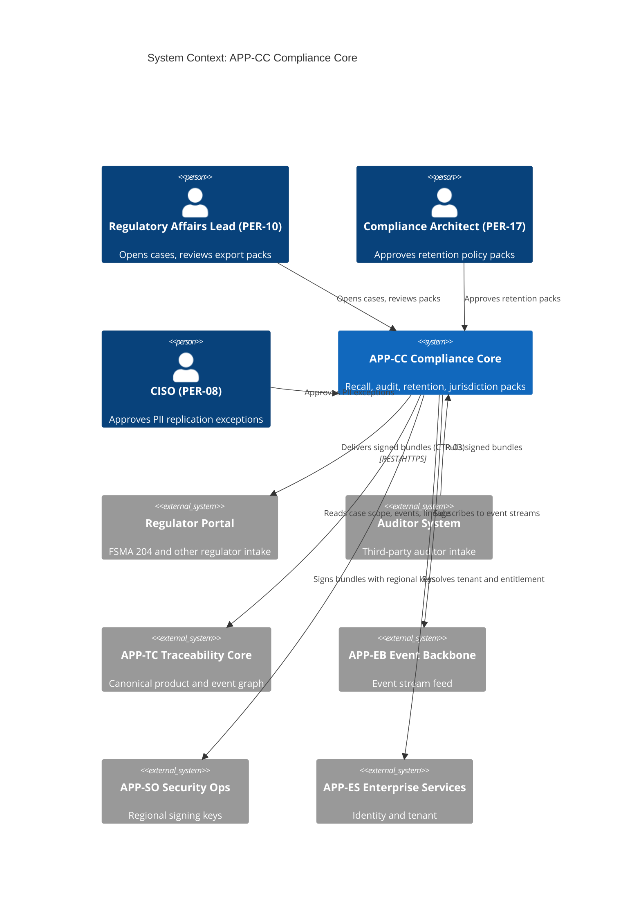
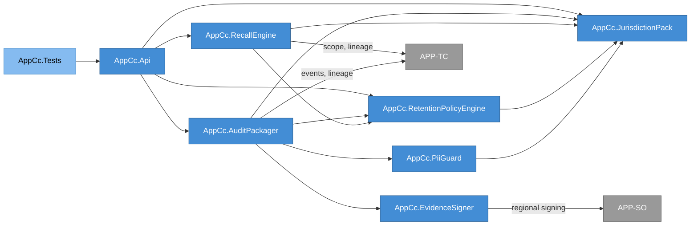
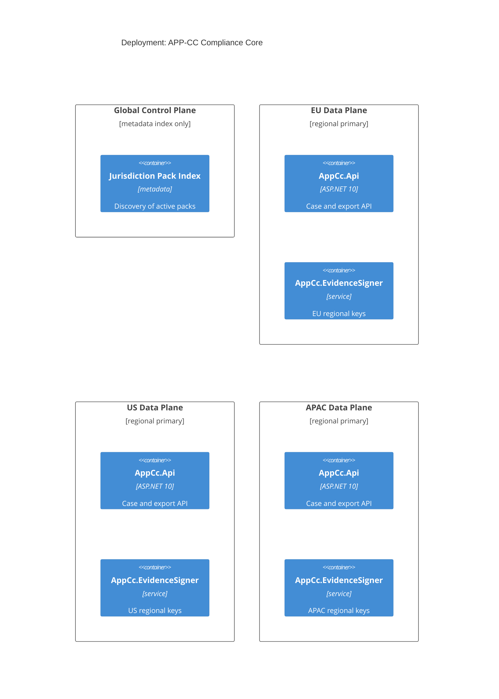
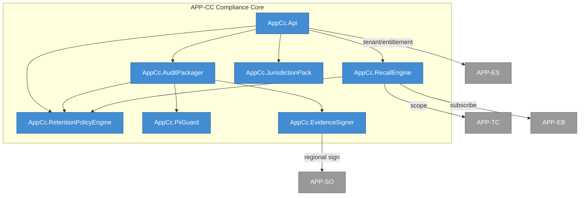
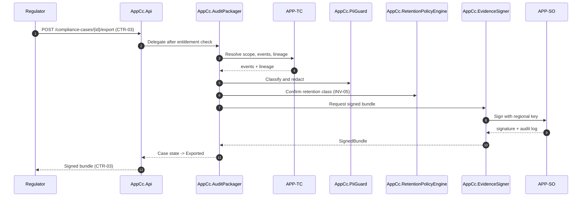
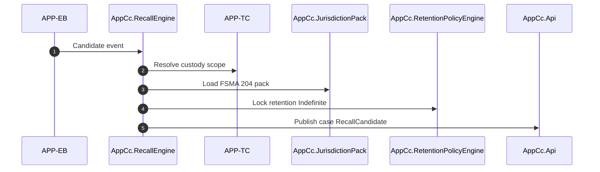

# APP-CC Compliance Core -- System Specification

## Tracking

| Field | Value |
|---|---|
| slug | app-cc-compliance-core |
| itemType | SystemSpec |
| name | APP-CC Compliance Core |
| version | 2 |
| specLangVersion | 0.1.0 |
| publishStatus | Draft |
| retentionPolicy | indefinite |
| freshnessSla | P180D |
| authors | [PER-17 Isabelle Laurent] |
| reviewers | [PER-01 Lena Brandt] |
| committer | PER-17 Isabelle Laurent |
| createdAt | 2026-04-17T00:00:00Z |
| updatedAt | 2026-04-18T00:00:00Z |
| Dependencies | global-corp.manifest.md, global-corp.architecture.spec.md, aspire-apphost.spec.md, service-defaults.spec.md, customs-gate.spec.md, fsma-gate.spec.md, audit-gate.spec.md |
| Profile | BTABOK |
| profileVersion | 0.1.0 |
| codlVersion | 0.2 |
| cadlVersion | 0.1 |
| tags | [local-simulation-first, aspire] |

## 1. Purpose and Scope

APP-CC Compliance Core is the regulatory workbench of the Global Corp. platform. It owns the workflows, data structures, and evidence mechanics that let Global Corp. respond to food recalls, food-traceability inquiries, regulatory audits, inspections, and jurisdiction-specific retention obligations without compromising the canonical event and product graph held in APP-TC Traceability Core.

This spec is a sibling of APP-SD Sustainability and DPP. Both draw on the same canonical event graph and both enforce the separation mandated by ASD-05 (keep compliance services separate from general analytics). APP-CC focuses on the food-traceability and auditable-evidence regimes represented by FDA FSMA 204 (STD-06), jurisdictional retention rules, and general auditor-facing evidence exports under contract CTR-03. APP-SD carries the EU Digital Product Passport regime under STD-05.

The primary responsibility of APP-CC is:

1. Organize compliance work as ComplianceCase instances (ENT-16) with a clear lifecycle.
2. Attach and retain Documents (ENT-14) that support the case, with jurisdiction-aware retention.
3. Compose, sign, and emit evidence bundles under CTR-03 ComplianceExport, reproducible within 4 hours p95 per ASR-06.
4. Enforce INV-05 (retention applied at write time) and INV-06 (PII minimization and regional control) for all compliance data paths.
5. Orchestrate FSMA 204 recall workflows across product, lot, shipment, and custody scopes.

Out of scope for this system: general analytics reporting (APP-DP), ETA and operational alerting (APP-OI), partner protocol mediation (APP-PC), and DPP assembly (APP-SD).

APP-CC runs under the Aspire AppHost in the Local Simulation Profile as described in `global-corp.architecture.spec.md` Section 11.1. External regulator, FSMA portal, and auditor platform interactions route through the CustomsGate, FsmaGate, and AuditGate simulator containers (architecture spec Section 10 Gate Inventory). Cloud Production Profile preserves the cloud-deploy path via configuration; real customs, FDA, and auditor endpoints substitute for the gate containers without code change (Constraint 2).

## 2. Context

```spec
person RegulatoryAffairsLead {
    slug: "per-10-regulatory-affairs";
    description: "PER-10 Yuki Nakamura. Requests audits, coordinates with
                  external regulators, reviews compliance export packages
                  before they leave the platform.";
    @tag("internal", "compliance");
}

person ComplianceArchitect {
    slug: "per-17-compliance-architect";
    description: "PER-17 Isabelle Laurent, Chief Architect of Compliance.
                  Owns APP-CC, approves retention policy packs, chairs the
                  compliance review board.";
    @tag("internal", "architect");
}

person CISO {
    slug: "per-08-ciso";
    description: "PER-08 Chioma Okafor. Approves cross-region replication
                  of metadata and PII-adjacent fields under INV-06.";
    @tag("internal", "security");
}

external system RegulatorPortal {
    slug: "ext-regulator-portal";
    description: "Jurisdictional regulator submission endpoint. Receives
                  signed evidence bundles produced by CTR-03. Examples:
                  FDA FSMA 204 submission channels, national competent
                  authorities under EU regimes.";
    technology: "REST/HTTPS, signed artifacts";
    @tag("regulator", "external");
}

external system AuditorSystem {
    slug: "ext-auditor-system";
    description: "Third-party auditor evidence intake system. Pulls signed
                  compliance export bundles during engagement windows.";
    technology: "REST/HTTPS";
    @tag("auditor", "external");
}

external system TraceabilityCore {
    slug: "app-tc-traceability-core";
    description: "APP-TC. Source of canonical events (ENT-13), product
                  graph, custody records, and lineage pointers. APP-CC
                  reads case scope from APP-TC, never the reverse.";
    technology: "internal service";
    @tag("internal", "sibling-app");
}

external system EventBackbone {
    slug: "app-eb-event-backbone";
    description: "APP-EB. Provides raw event stream subscriptions that
                  trigger case-watch rules (for example, a temperature
                  excursion that promotes a shipment into a recall-
                  candidate state).";
    technology: "internal service";
    @tag("internal", "sibling-app");
}

external system SecurityOps {
    slug: "app-so-security-ops";
    description: "APP-SO. Provides regional signing keys and HSM-backed
                  operations used by AppCc.EvidenceSigner. Also receives
                  compliance-relevant audit logs.";
    technology: "internal service";
    @tag("internal", "sibling-app");
}

external system EnterpriseServices {
    slug: "app-es-enterprise-services";
    description: "APP-ES. Identity, tenant, and entitlement. Verifies
                  that a caller is authorized to open or close a
                  compliance case on a given tenant.";
    technology: "internal service";
    @tag("internal", "sibling-app");
}

external system CustomsGate {
    slug: "gate-customs";
    description: "GATE-CUSTOMS simulator (architecture spec Section
                  10). Local Docker container that mimics the REST
                  surfaces of national customs declaration and
                  clearance systems. Consumed by APP-CC through the
                  typed CustomsGate.Client library. In Cloud
                  Production Profile the client base URL points to
                  the real customs authority endpoint; no APP-CC
                  code changes.";
    technology: "REST/HTTPS, Docker container";
    @tag("external", "gate", "regulator");
}

external system FsmaGate {
    slug: "gate-fsma";
    description: "GATE-FSMA simulator (architecture spec Section 10).
                  Local Docker container that mimics the FDA FSMA
                  reporting portal surface (CTE/KDE submissions,
                  recall submissions, receipts). Consumed by APP-CC
                  through the typed FsmaGate.Client library. In
                  Cloud Production Profile the client base URL
                  points to the real FDA portal; no APP-CC code
                  changes.";
    technology: "REST/HTTPS, Docker container";
    @tag("external", "gate", "regulator");
}

external system AuditGate {
    slug: "gate-audit";
    description: "GATE-AUDIT simulator (architecture spec Section
                  10). Local Docker container that mimics third-
                  party auditor evidence-intake platforms. Consumed
                  by APP-CC through the typed AuditGate.Client
                  library. In Cloud Production Profile the client
                  base URL points to the real auditor platform.";
    technology: "REST/HTTPS, Docker container";
    @tag("external", "gate", "auditor");
}

RegulatoryAffairsLead -> AppCc.AuditPackager : "Opens cases, reviews export packs before release.";
ComplianceArchitect -> AppCc.RetentionPolicyEngine : "Approves jurisdiction packs and retention changes.";
CISO -> AppCc.PiiGuard : "Approves PII replication exceptions.";
AppCc.AuditPackager -> RegulatorPortal {
    description: "Delivers signed evidence bundles under CTR-03. In
                  Local Simulation Profile the route is CustomsGate
                  for customs declarations, FsmaGate for FDA FSMA
                  submissions and recalls, and AuditGate for third-
                  party auditor bundles. Cloud Production Profile
                  substitutes the real endpoints by configuration.";
    technology: "REST/HTTPS";
};
AuditorSystem -> AppCc.AuditPackager : "Pulls signed bundles for in-scope tenants.";
AppCc.RecallEngine -> TraceabilityCore : "Resolves case scope over product, lot, shipment, custody.";
AppCc.RecallEngine -> EventBackbone : "Subscribes to event streams that feed recall-candidate rules.";
AppCc.EvidenceSigner -> SecurityOps : "Requests regional signing operations.";
AppCc.AuditPackager -> EnterpriseServices : "Resolves tenant and entitlement for case access.";
AppCc.RecallEngine -> FsmaGate : "Submits FDA FSMA 204 recall notices via FsmaGate.Client in Local Simulation; real FDA portal in Cloud Production.";
AppCc.AuditPackager -> CustomsGate : "Submits signed customs declarations via CustomsGate.Client.";
AppCc.AuditPackager -> FsmaGate : "Submits FSMA 204 CTE and KDE bundles via FsmaGate.Client.";
AppCc.AuditPackager -> AuditGate : "Submits third-party auditor evidence bundles via AuditGate.Client.";
```

Rendered system context:



## 3. System Declaration

```spec
system AppCc {
    slug: "app-cc-compliance-core";
    target: "net10.0";
    responsibility: "Regulatory workbench for Global Corp. Owns compliance
                     case lifecycle, retention policy enforcement, PII
                     minimization, FSMA 204 recall orchestration, and
                     auditor-facing evidence export (CTR-03) with regional
                     signing. Separated from general analytics per ASD-05.";

    authored component AppCc.RecallEngine {
        kind: service;
        path: "src/AppCc.RecallEngine";
        status: new;
        responsibility: "Orchestrates FSMA 204 food recall workflows. Given
                         a recall trigger (batch, lot, product, shipment),
                         resolves affected custody chain via APP-TC and
                         drives the case through recall-candidate, recall-
                         confirmed, and recall-closed states. When a
                         recall is confirmed, the engine routes the
                         recall-submission payload through
                         FsmaGate.Client in Local Simulation Profile;
                         Cloud Production Profile routes the same
                         call to the real FDA portal via
                         configuration.";
        contract {
            guarantees "Every recall case is backed by an explicit event
                        chain in APP-TC. No recall reaches the confirmed
                        state without a resolved custody scope (INV-03,
                        consumed).";
            guarantees "Critical Tracking Events and Key Data Elements
                        required by FSMA 204 are captured against the case
                        before a recall is confirmed.";
            guarantees "Cases can be paused by the Regulatory Affairs Lead
                        without losing collected evidence.";
            guarantees "Recall submission calls are issued through
                        FsmaGate.Client. Profile switching between
                        simulated FDA and real FDA endpoints is a
                        configuration change with no code difference.";
        }
        rationale {
            context "FSMA 204 requires traceability for listed foods with
                     CTEs and KDEs captured through the chain. A generic
                     case tool would not express the recall workflow
                     cleanly.";
            decision "A dedicated recall engine owns the state machine and
                      pulls scope from APP-TC rather than replicating the
                      event graph.";
            consequence "Changes to the canonical event model propagate
                         through APP-TC contracts, not through recall code.";
        }
    }

    authored component AppCc.AuditPackager {
        kind: service;
        path: "src/AppCc.AuditPackager";
        status: new;
        responsibility: "Assembles regulator-facing and auditor-facing
                         evidence packages under CTR-03 ComplianceExport.
                         Composes events, lineage, documents, custody
                         records, and retention metadata into a single
                         bundle ready for signing. Persisted bundles
                         land in the MinIO `gc-compliance-bundles`
                         bucket (APP-DP bucket catalog). Signed
                         bundle delivery routes through
                         CustomsGate.Client for customs declarations,
                         FsmaGate.Client for FSMA submissions, and
                         AuditGate.Client for third-party auditors in
                         Local Simulation Profile; Cloud Production
                         Profile substitutes the real endpoints via
                         configuration.";
        contract {
            guarantees "Any bundle produced is reproducible from the case
                        ID and a point-in-time snapshot of APP-TC within
                        4 hours p95 (ASR-06).";
            guarantees "Bundle content is filtered by the jurisdiction
                        pack bound to the case (INV-05, INV-06).";
            guarantees "Bundles are never emitted without a signature from
                        AppCc.EvidenceSigner.";
            guarantees "Evidence bundle uploads are written to the
                        `gc-compliance-bundles` MinIO bucket using
                        the Minio .NET client in Local Simulation
                        Profile. The same storage client code path
                        targets AWS S3, Azure Blob Storage, or GCP
                        Cloud Storage in Cloud Production Profile via
                        configuration and the appropriate Aspire
                        storage integration.";
        }
    }

    authored component AppCc.RetentionPolicyEngine {
        kind: service;
        path: "src/AppCc.RetentionPolicyEngine";
        status: new;
        responsibility: "Evaluates jurisdiction-sensitive retention rules at
                         write time for Documents, ComplianceCases, and
                         evidence snapshots. Runs in-process. Retention
                         timers enforce INV-05 per jurisdiction: purge
                         and preservation decisions fire at the
                         jurisdiction-configured duration without
                         relying on a scheduled cloud job.";
        contract {
            guarantees "Retention class is assigned at write time, not at
                        read time. No record is accepted without a
                        resolved retention class.";
            guarantees "Retention class changes require an approved
                        jurisdiction pack revision; in-flight records are
                        not retroactively downgraded.";
        }
        rationale {
            context "INV-05 requires retention decisions to be made when
                     data is written. Applying retention at read time
                     opens auditability gaps when the read path fails or
                     when data is exported outside the platform.";
            decision "Retention policy is a first-class service invoked by
                      every write path that produces compliance-relevant
                      records.";
            consequence "Write paths in AppCc components must route through
                         the policy engine. Bypass requires a waiver.";
        }
    }

    authored component AppCc.PiiGuard {
        kind: service;
        path: "src/AppCc.PiiGuard";
        status: new;
        responsibility: "Enforces INV-06 PII minimization and regional
                         control. Classifies fields on inbound documents,
                         redacts or regionally pins them, and refuses
                         cross-region replication unless an explicit
                         waiver token is attached.";
        contract {
            guarantees "PII-classified fields never leave their region of
                        origin without a valid waiver token signed by the
                        CISO (PER-08).";
            guarantees "Every classification decision is logged with the
                        classifier version and the rule that fired.";
        }
    }

    authored component AppCc.JurisdictionPack {
        kind: library;
        path: "src/AppCc.JurisdictionPack";
        status: new;
        responsibility: "Per-region compliance artifact library. Holds the
                         declarative rules, templates, retention classes,
                         and redaction maps for FSMA 204, GDPR-adjacent
                         controls, EU Ecodesign companion controls, and
                         other regimes. Consumed by the policy engine, the
                         PII guard, and the audit packager. Jurisdiction
                         metadata is declarative: each pack is authored
                         as JSON or YAML embedded in the app-cc
                         project under `src/AppCc.JurisdictionPack/packs/`
                         and loaded at startup. No cloud pack-
                         distribution service is required.";
        contract {
            guarantees "Pack revisions are versioned and carry an approver
                        reference. Unversioned packs are rejected at load
                        time.";
            guarantees "Packs are region-scoped. A pack loaded in region X
                        cannot be applied to cases in region Y without an
                        explicit cross-region mapping declaration.";
        }
    }

    authored component AppCc.EvidenceSigner {
        kind: service;
        path: "src/AppCc.EvidenceSigner";
        status: new;
        responsibility: "Produces signed evidence bundles using regional
                         key material. In Local Simulation Profile the
                         key material is sourced from Aspire parameter
                         resources (dev-grade, not production
                         secrets) exposed to the component through
                         IConfiguration. In Cloud Production Profile
                         the same IConfiguration binding resolves to
                         AWS KMS, Azure Key Vault, or GCP KMS through
                         the appropriate Aspire.Azure or Aspire.AWS
                         integration; no AppCc.EvidenceSigner code
                         change is required (Constraint 2). The
                         component never persists key material; it
                         requests signing operations through the
                         resolved key provider.";
        contract {
            guarantees "Signatures are produced with the regional key
                        bound to the case jurisdiction, not a global key.";
            guarantees "Every signing operation produces an audit log
                        entry forwarded to APP-SO.";
            guarantees "In Local Simulation Profile the key resource
                        is an Aspire parameter; the component resolves
                        it through IConfiguration and fails fast if
                        the parameter is missing.";
            guarantees "JWS/JWT signing primitives come from
                        Microsoft.IdentityModel.Tokens. No custom
                        cryptographic implementation is written.";
        }
    }

    authored component AppCc.Api {
        kind: "api-host";
        path: "src/AppCc.Api";
        status: new;
        responsibility: "ASP.NET 10 minimal API surface for APP-CC. Hosts
                         the CTR-03 ComplianceExport endpoint, case-
                         management endpoints, and the jurisdiction pack
                         administration endpoints. Integrates with APP-ES
                         for identity and tenant resolution.";
    }

    authored component AppCc.Tests {
        kind: tests;
        path: "tests/AppCc.Tests";
        status: new;
        responsibility: "Integration and unit tests for the compliance
                         core. Includes contract tests against CTR-03,
                         jurisdiction-pack fixtures, and PII classifier
                         regression suites.";
    }

    consumed component AppTcClient {
        source: internal("AppTc.Client");
        responsibility: "Client library for APP-TC Traceability Core. Used
                         to resolve case scope and pull event lineage.";
        used_by: [AppCc.RecallEngine, AppCc.AuditPackager];
    }

    consumed component AppSoClient {
        source: internal("AppSo.Client");
        responsibility: "Client library for APP-SO Security Ops. Used for
                         regional signing operations and audit log
                         forwarding.";
        used_by: [AppCc.EvidenceSigner];
    }

    consumed component AppEsClient {
        source: internal("AppEs.Client");
        responsibility: "Client library for APP-ES Enterprise Services.
                         Tenant and entitlement resolution.";
        used_by: [AppCc.Api];
    }

    consumed component GlobalCorp.ServiceDefaults {
        source: internal("service-defaults.spec.md");
        responsibility: "Shared Aspire service defaults: OpenTelemetry
                         wiring, health checks, resilience policies,
                         and standard configuration binding consumed
                         by every APP-CC project.";
        used_by: [AppCc.Api, AppCc.RecallEngine, AppCc.AuditPackager,
                  AppCc.RetentionPolicyEngine, AppCc.PiiGuard,
                  AppCc.EvidenceSigner, AppCc.JurisdictionPack];
    }

    consumed component CustomsGateClient {
        source: project_reference("src/CustomsGate.Client");
        spec: weakRef<SystemSpec>("customs-gate");
        responsibility: "Typed .NET client library for CustomsGate
                         (GATE-CUSTOMS). Used by APP-CC for customs
                         declaration submission and clearance status
                         retrieval. In Local Simulation Profile the
                         client base URL points at the `gate-customs`
                         Aspire container; in Cloud Production Profile
                         it points at the real customs authority
                         endpoint. Swap is configuration-only.";
        used_by: [AppCc.AuditPackager];
    }

    consumed component FsmaGateClient {
        source: project_reference("src/FsmaGate.Client");
        spec: weakRef<SystemSpec>("fsma-gate");
        responsibility: "Typed .NET client library for FsmaGate
                         (GATE-FSMA). Used by APP-CC for CTE/KDE
                         submissions, recall submissions, and receipt
                         retrieval. Base URL resolves to the
                         `gate-fsma` Aspire container in Local
                         Simulation Profile and to the real FDA
                         portal in Cloud Production Profile.";
        used_by: [AppCc.AuditPackager, AppCc.RecallEngine];
    }

    consumed component AuditGateClient {
        source: project_reference("src/AuditGate.Client");
        spec: weakRef<SystemSpec>("audit-gate");
        responsibility: "Typed .NET client library for AuditGate
                         (GATE-AUDIT). Used by APP-CC for third-party
                         auditor engagement and evidence submission.
                         Base URL resolves to the `gate-audit` Aspire
                         container in Local Simulation Profile and to
                         the real auditor platform endpoint in Cloud
                         Production Profile.";
        used_by: [AppCc.AuditPackager];
    }

    consumed component MinioClient {
        source: nuget("Minio");
        responsibility: "MinIO .NET client used by AppCc.AuditPackager
                         to persist signed evidence bundles in the
                         `gc-compliance-bundles` bucket (APP-DP
                         bucket catalog) in Local Simulation Profile.
                         In Cloud Production Profile the same upload
                         path swaps to AWS S3, Azure Blob Storage, or
                         GCP Cloud Storage via the appropriate Aspire
                         storage integration without code change.";
        used_by: [AppCc.AuditPackager];
    }

    consumed component IdentityModelTokens {
        source: nuget("Microsoft.IdentityModel.Tokens");
        responsibility: "JWS and JWT signing primitives used by
                         AppCc.EvidenceSigner for evidence bundle
                         signatures. Key material is resolved from
                         IConfiguration backed by Aspire parameter
                         resources in Local Simulation Profile and
                         by cloud KMS in Cloud Production Profile.";
        used_by: [AppCc.EvidenceSigner];
    }

    consumed component GlobalCorpPackagePolicy {
        source: weakRef<PackagePolicy>(GlobalCorpPolicy);
        responsibility: "Enterprise NuGet package policy (architecture
                         spec Section 8). APP-CC inherits the allow
                         and deny categories without subsystem-local
                         overrides. No 3rd-party charting NuGet and
                         no CSS-framework NuGet is consumed. Minio
                         and Microsoft.IdentityModel.Tokens fall
                         within the allowed storage-drivers and auth
                         categories respectively.";
        used_by: [AppCc.Api, AppCc.RecallEngine, AppCc.AuditPackager,
                  AppCc.RetentionPolicyEngine, AppCc.PiiGuard,
                  AppCc.EvidenceSigner, AppCc.JurisdictionPack];

        rationale {
            context "Constraint 5 (zero 3rd-party JS) and Constraint
                     6 (SVG + CSS) are enforced at the enterprise
                     package-policy level. APP-CC is a backend
                     subsystem and does not require any charting or
                     CSS-framework NuGet.";
            decision "Reference the enterprise policy by weakRef and
                      declare no subsystem-local allowances.";
            consequence "Any future APP-CC NuGet that falls outside
                         the policy's allow categories requires an
                         explicit rationale block added to this
                         spec.";
        }
    }
}
```

## 4. Topology

```spec
topology Dependencies {
    allow AppCc.Api -> AppCc.RecallEngine;
    allow AppCc.Api -> AppCc.AuditPackager;
    allow AppCc.Api -> AppCc.RetentionPolicyEngine;
    allow AppCc.Api -> AppCc.JurisdictionPack;
    allow AppCc.AuditPackager -> AppCc.EvidenceSigner;
    allow AppCc.AuditPackager -> AppCc.RetentionPolicyEngine;
    allow AppCc.AuditPackager -> AppCc.PiiGuard;
    allow AppCc.AuditPackager -> AppCc.JurisdictionPack;
    allow AppCc.RecallEngine -> AppCc.RetentionPolicyEngine;
    allow AppCc.RecallEngine -> AppCc.JurisdictionPack;
    allow AppCc.RetentionPolicyEngine -> AppCc.JurisdictionPack;
    allow AppCc.PiiGuard -> AppCc.JurisdictionPack;

    deny AppCc.JurisdictionPack -> AppCc.RecallEngine;
    deny AppCc.JurisdictionPack -> AppCc.AuditPackager;
    deny AppCc.RetentionPolicyEngine -> AppCc.AuditPackager;
    deny AppCc.EvidenceSigner -> AppCc.AuditPackager;
    deny AppCc.RecallEngine -> AppCc.EvidenceSigner;

    invariant "no compliance-to-analytics dependency":
        AppCc.* does not reference AppDp.*;
    invariant "no compliance-to-operations dependency":
        AppCc.* does not reference AppOi.*;
    invariant "signing goes through APP-SO":
        AppCc.EvidenceSigner references only AppSo.Client for key ops;

    rationale {
        context "ASD-05 requires compliance services to remain separate
                 from general analytics. The retention, PII, and signing
                 contracts are strict enough that incidental coupling to
                 analytics or operations would weaken auditability.";
        decision "Topology denies references from APP-CC to APP-DP and
                  APP-OI. Cross-sibling reads go through APP-TC only.";
        consequence "Compliance reports are computed from APP-TC and APP-
                     CC state, never from analytics marts. This preserves
                     reproducibility for CTR-03.";
    }
}
```

Rendered topology:



## 5. Data

### 5.1 Enums

```spec
enum ComplianceCaseType {
    Recall: "Food or product recall under FSMA 204 or equivalent",
    Audit: "Scheduled or unscheduled regulatory audit",
    Inspection: "On-site inspection evidence request",
    LegalHold: "Case opened under legal hold, blocking retention purge",
    InternalReview: "Internal compliance review, not externally reported"
}

enum ComplianceCaseState {
    Draft: "Case created but not opened",
    Open: "Case active, evidence being assembled",
    RecallCandidate: "Case promoted to a recall-candidate status",
    RecallConfirmed: "Recall decision made, CTEs and KDEs captured",
    UnderExport: "Bundle assembly in progress",
    Exported: "Signed bundle emitted to the regulator or auditor",
    Closed: "Case closed, retention clock controls purge",
    Suspended: "Case paused, evidence retained"
}

enum Jurisdiction {
    US_FDA: "United States, FDA FSMA 204 regime",
    EU: "European Union, DPP and related regimes",
    APAC_SG: "Singapore regulator",
    APAC_JP: "Japan regulator",
    MEA: "Middle East and Africa composite profile",
    LATAM: "Latin America composite profile"
}

enum RetentionClass {
    Short: "Minimum statutory period, typically 2 years",
    Standard: "7 years, default audit retention",
    Long: "15 years, food traceability and product safety",
    Indefinite: "Evidence under legal hold or active recall"
}

enum PiiClass {
    None: "No PII present",
    LowSensitivity: "Business contact data, low sensitivity",
    Personal: "Personal identifier present, region-pinned",
    Sensitive: "Sensitive personal data, strict regional control"
}
```

### 5.2 Entities

```spec
entity ComplianceCase {
    slug: "ent-16-compliance-case";
    id: CaseId;
    tenantId: TenantRef;
    caseType: ComplianceCaseType;
    state: ComplianceCaseState @default(Draft);
    jurisdiction: Jurisdiction;
    scopeProducts: list<ref<Product>>;
    scopeShipments: list<ref<Shipment>>;
    scopeLots: list<ref<Batch>>;
    scopeItems: list<ref<Item>>;
    openedBy: ref<Person>;
    openedAt: UtcInstant;
    closedAt: UtcInstant?;
    retentionClass: RetentionClass;
    documents: list<ref<Document>>;
    eventWindow: TimeRange;
    lineagePointers: list<ref<LineagePointer>>;
    signedBundleRef: weakRef<SignedBundle>?;
    jurisdictionPackRef: ref<JurisdictionPack>;

    invariant "tenant required": tenantId != null;
    invariant "scope non-empty for confirmed recall":
        state == RecallConfirmed implies
            (count(scopeProducts) + count(scopeLots) +
             count(scopeShipments) + count(scopeItems)) > 0;
    invariant "jurisdiction matches pack":
        jurisdictionPackRef.jurisdiction == jurisdiction;
    invariant "retention set at open":
        state != Draft implies retentionClass != null;
    invariant "close after open":
        closedAt == null or closedAt >= openedAt;

    rationale "retentionClass" {
        context "INV-05 requires retention decisions at write time. A case
                 record that does not carry a retention class cannot be
                 correctly purged or preserved.";
        decision "retentionClass is required from the first non-draft
                  state transition. The jurisdiction pack resolves the
                  default class, which can be overridden upward only.";
        consequence "Draft cases can exist without a class for UX reasons,
                     but any Open or later state must have one.";
    }
}

entity Document {
    slug: "ent-14-document";
    id: DocumentId;
    tenantId: TenantRef;
    caseId: ref<ComplianceCase>?;
    kind: DocumentKind;
    title: string;
    storageRef: StorageUri;
    payloadHash: Sha256Hash;
    piiClass: PiiClass @default(None);
    region: Jurisdiction;
    retentionClass: RetentionClass;
    receivedAt: UtcInstant;

    invariant "hash required": payloadHash != "";
    invariant "storage required": storageRef != "";
    invariant "retention required": retentionClass != null;
    invariant "region pinned for sensitive":
        piiClass == Sensitive implies region != null;
}

entity RetentionPolicy {
    slug: "retention-policy";
    id: PolicyId;
    jurisdiction: Jurisdiction;
    appliesTo: list<EntityKind>;
    retentionClass: RetentionClass;
    durationDays: int;
    approvedBy: ref<Person>;
    effectiveFrom: UtcInstant;
    effectiveUntil: UtcInstant?;

    invariant "positive duration or indefinite":
        retentionClass == Indefinite or durationDays > 0;
    invariant "approver present": approvedBy != null;
}

entity JurisdictionPack {
    slug: "jurisdiction-pack";
    id: PackId;
    jurisdiction: Jurisdiction;
    version: string;
    retentionPolicies: list<ref<RetentionPolicy>>;
    redactionRules: list<RedactionRule>;
    approver: ref<Person>;
    approvedAt: UtcInstant;

    invariant "version required": version != "";
    invariant "approver required": approver != null;
}

entity SignedBundle {
    slug: "signed-bundle";
    id: BundleId;
    caseId: ref<ComplianceCase>;
    contentHash: Sha256Hash;
    signatureAlg: SignatureAlgorithm;
    signatureValue: string;
    keyRegion: Jurisdiction;
    signedAt: UtcInstant;
    signerIdentity: string;

    invariant "content hash required": contentHash != "";
    invariant "signature required": signatureValue != "";
    invariant "regional key":
        keyRegion == caseId.jurisdiction;
}

entity LineagePointer {
    slug: "lineage-pointer";
    id: LineageId;
    eventId: weakRef<Event>;
    sourceEvidenceRef: EvidenceUri;
    invariant "source evidence required": sourceEvidenceRef != "";
}
```

### 5.3 Contracts

```spec
contract CTR-03-ComplianceExport {
    slug: "ctr-03-compliance-export";
    requires case.state in [Open, RecallConfirmed, UnderExport];
    requires case.retentionClass != null;
    requires case.jurisdictionPackRef != null;
    ensures result.signedBundleRef != null;
    ensures result.signedBundleRef.keyRegion == case.jurisdiction;
    guarantees "Produces a signed evidence bundle containing canonical
                events, lineage pointers, custody records, and attached
                documents in scope for the case. The bundle is reproducible
                from the case ID and the APP-TC snapshot at signing time
                within 4 hours p95 (ASR-06).";
    guarantees "PII fields are filtered by AppCc.PiiGuard according to
                the jurisdiction pack before bundle assembly.";
    guarantees "No bundle is emitted if the retention policy for any
                included artifact is unresolved.";
}

contract OpenComplianceCase {
    slug: "open-compliance-case";
    requires tenantId != null;
    requires caseType in ComplianceCaseType;
    requires jurisdiction in Jurisdiction;
    ensures case.state == Open;
    ensures case.retentionClass != null;
    guarantees "A new case is created with a retention class resolved from
                the jurisdiction pack. The case is persisted with an
                audit record naming the opener.";
}

contract AttachDocument {
    slug: "attach-document";
    requires case.state != Closed;
    requires document.payloadHash != "";
    ensures document.retentionClass != null;
    ensures document.piiClass != null;
    guarantees "Document is classified by AppCc.PiiGuard, its retention
                class is assigned by AppCc.RetentionPolicyEngine, and it
                is linked to the case. Cross-region attachment requires a
                waiver token.";
}

contract ConfirmRecall {
    slug: "confirm-recall";
    requires case.caseType == Recall;
    requires case.state == RecallCandidate;
    requires count(case.scopeProducts) +
             count(case.scopeLots) +
             count(case.scopeShipments) +
             count(case.scopeItems) > 0;
    ensures case.state == RecallConfirmed;
    guarantees "CTEs and KDEs required by FSMA 204 for the product
                category are captured against the case. Downstream
                notification workflows are enqueued.";
}
```

### 5.4 Invariants (system-level)

```spec
invariant INV-05-RetentionAtWrite {
    slug: "inv-05-retention";
    scope: [AppCc.RetentionPolicyEngine, AppCc.RecallEngine,
            AppCc.AuditPackager];
    rule: "Every write of a ComplianceCase, Document, or SignedBundle
           must carry a resolved retentionClass. Read-path resolution
           of retention is not permitted.";
}

invariant INV-06-PiiRegionalControl {
    slug: "inv-06-pii";
    scope: [AppCc.PiiGuard, AppCc.AuditPackager];
    rule: "PII-classified fields never leave their region of origin
           unless a waiver token signed by the CISO is attached to the
           request and logged.";
}
```

## 6. Deployment

APP-CC is authored with two deployment profiles. Local Simulation Profile is primary and is the profile exercised by all development and integration tests. Cloud Production Profile is deferred; the multi-region plane below is retained as documented target state.

### 6.1 Local Simulation Profile (primary)

```spec
deployment AppCcLocalSimulation {
    slug: "app-cc-local-simulation";
    status: primary;
    profile: "Local Simulation";

    node "Developer Workstation" {
        technology: "Docker Desktop, .NET 10 SDK, Aspire 13.2 CLI";
        aspire_apphost: "GlobalCorp.AppHost";
        instance: AppCc.Api;
        instance: AppCc.RecallEngine;
        instance: AppCc.AuditPackager;
        instance: AppCc.RetentionPolicyEngine;
        instance: AppCc.PiiGuard;
        instance: AppCc.EvidenceSigner;
        instance: AppCc.JurisdictionPack;
        binds_to: "pg-eu, pg-us, pg-apac, minio, app-tc, app-eb, app-so, app-es, gate-customs, gate-fsma, gate-audit";
        service_defaults: required;
        description: "All APP-CC components run as a single .NET
                      project composed by the Aspire AppHost.
                      Regional separation is simulated by pinning
                      each tenant to one of the three regional
                      PostgreSQL containers via the region
                      assignment resolved through APP-ES. Evidence
                      bundles land in the `gc-compliance-bundles`
                      MinIO bucket. Outbound regulator, FDA, and
                      auditor calls route through CustomsGate,
                      FsmaGate, and AuditGate containers.
                      EvidenceSigner reads regional keys from
                      Aspire parameter resources through
                      IConfiguration.";
    }

    rationale {
        context "Constraint 1 (local simulation first) and
                 Constraint 7 (external subsystems in Docker
                 containers locally) require regulator, FDA, and
                 auditor surfaces to be simulated through gate
                 containers on a developer workstation.";
        decision "Local Simulation Profile collapses the multi-
                  region compliance plane into a workstation
                  composition. Keys are Aspire parameter resources;
                  evidence storage is MinIO; regulator calls route
                  through the three gates.";
        consequence "A developer runs dotnet run against the
                     AppHost and exercises APP-CC end-to-end without
                     cloud, KMS, or real regulator dependencies.
                     Cloud Production Profile swap is configuration-
                     only (Constraint 2).";
    }
}
```

### 6.2 Cloud Production Profile (deferred)

```spec
deployment RegionalCompliancePlane {
    status: deferred;
    profile: "Cloud Production";
    node "Global Control Plane" {
        technology: "shared control plane";
        node "Policy Index" {
            instance: AppCc.JurisdictionPack;
            responsibility: "Metadata-only index of active packs for
                             discovery. Pack content is regional.";
        }
    }

    node "EU Data Plane" {
        technology: "regional primary";
        instance: AppCc.Api;
        instance: AppCc.RecallEngine;
        instance: AppCc.AuditPackager;
        instance: AppCc.RetentionPolicyEngine;
        instance: AppCc.PiiGuard;
        instance: AppCc.EvidenceSigner;
    }

    node "US Data Plane" {
        technology: "regional primary";
        instance: AppCc.Api;
        instance: AppCc.RecallEngine;
        instance: AppCc.AuditPackager;
        instance: AppCc.RetentionPolicyEngine;
        instance: AppCc.PiiGuard;
        instance: AppCc.EvidenceSigner;
    }

    node "APAC Data Plane" {
        technology: "regional primary";
        instance: AppCc.Api;
        instance: AppCc.RecallEngine;
        instance: AppCc.AuditPackager;
        instance: AppCc.RetentionPolicyEngine;
        instance: AppCc.PiiGuard;
        instance: AppCc.EvidenceSigner;
    }

    rationale {
        context "ASD-03 Regional data planes. Compliance evidence, PII,
                 and retention rules differ across jurisdictions. A global
                 data plane would force every evidence operation through
                 one region, which is both legally and operationally
                 unacceptable.";
        decision "APP-CC is deployed as a regional primary per data plane.
                  The control plane holds only a metadata-only pack index,
                  never case or document content.";
        consequence "US cases cannot be signed with EU keys; EU cases
                     cannot be read from US-resident infrastructure. Cross-
                     region queries are explicit and waiver-gated.";
    }
}
```

Rendered deployment:



## 7. Views

```spec
view systemContext of AppCc ContextView {
    slug: "app-cc-context-view";
    include: all;
    autoLayout: top-down;
    description: "APP-CC with its internal persons (PER-10, PER-17, PER-
                  08) and external systems: regulator portals, auditor
                  systems, APP-TC, APP-EB, APP-SO, APP-ES.";
}

view container of AppCc ContainerView {
    slug: "app-cc-container-view";
    include: all;
    autoLayout: left-right;
    description: "Internal structure showing RecallEngine, AuditPackager,
                  RetentionPolicyEngine, PiiGuard, JurisdictionPack,
                  EvidenceSigner, and Api with allowed and denied
                  references.";
}

view deployment of RegionalCompliancePlane RegionalPlaneView {
    slug: "app-cc-regional-plane-view";
    include: all;
    autoLayout: top-down;
    description: "Three regional data planes hosting full AppCc stacks,
                  with a metadata-only control plane index.";
    @tag("deployment", "regional");
}

view dynamic of ComplianceExportFlow ComplianceExportView {
    slug: "app-cc-compliance-export-view";
    include: all;
    autoLayout: top-down;
    description: "Visualizes DYN-03. Regulator calls CTR-03, APP-CC
                  resolves scope through APP-TC, assembles the pack,
                  signs it with a regional key, and returns the bundle.";
    @tag("dynamic");
}
```

Rendered container view:



## 8. Dynamics

### 8.1 DYN-03 Compliance evidence export

```spec
dynamic ComplianceExportFlow {
    slug: "dyn-03-compliance-export";
    1: RegulatorPortal -> AppCc.Api {
        description: "POST /compliance-cases/{id}/export under CTR-03.";
        technology: "REST/HTTPS";
    };
    2: AppCc.Api -> AppCc.AuditPackager
        : "Delegates to the packager after entitlement check via
           AppEsClient.";
    3: AppCc.AuditPackager -> TraceabilityCore
        : "Resolves case scope: products, shipments, lots, items, custody,
           events, lineage.";
    4: TraceabilityCore -> AppCc.AuditPackager
        : "Returns canonical events plus lineage chain.";
    5: AppCc.AuditPackager -> AppCc.PiiGuard
        : "Classifies fields and applies jurisdiction-pack redactions.";
    6: AppCc.AuditPackager -> AppCc.RetentionPolicyEngine
        : "Confirms retention class for each included artifact (INV-05).";
    7: AppCc.AuditPackager -> AppCc.EvidenceSigner
        : "Requests signed bundle with case jurisdiction.";
    8: AppCc.EvidenceSigner -> SecurityOps
        : "Signs bundle with regional key.";
    9: SecurityOps -> AppCc.EvidenceSigner
        : "Returns signature and signing audit log.";
    10: AppCc.EvidenceSigner -> AppCc.AuditPackager
        : "Signed bundle.";
    11: AppCc.AuditPackager -> AppCc.Api
        : "Persists SignedBundle to MinIO `gc-compliance-bundles`
           bucket and updates case state to Exported.";
    12: AppCc.AuditPackager -> CustomsGate {
        description: "Customs declaration submission via
                      CustomsGate.Client in Local Simulation
                      Profile; real customs authority endpoint in
                      Cloud Production Profile.";
        technology: "REST/HTTPS";
    };
    13: AppCc.AuditPackager -> FsmaGate {
        description: "FSMA 204 CTE/KDE submission via
                      FsmaGate.Client in Local Simulation Profile;
                      real FDA portal in Cloud Production Profile.";
        technology: "REST/HTTPS";
    };
    14: AppCc.AuditPackager -> AuditGate {
        description: "Auditor evidence submission via
                      AuditGate.Client in Local Simulation Profile;
                      real auditor platform in Cloud Production
                      Profile.";
        technology: "REST/HTTPS";
    };
    15: AppCc.Api -> RegulatorPortal {
        description: "Returns signed bundle reference under CTR-03.
                      In Local Simulation Profile the regulator-
                      visible side of this call is the gate
                      container that accepted the submission.";
        technology: "REST/HTTPS";
    };
}
```

Rendered sequence:



### 8.2 Recall candidate promotion

```spec
dynamic RecallCandidatePromotion {
    slug: "recall-candidate-promotion";
    1: EventBackbone -> AppCc.RecallEngine
        : "Stream delivers event matching a recall-candidate rule.";
    2: AppCc.RecallEngine -> TraceabilityCore
        : "Resolves affected custody scope: items, lots, shipments.";
    3: AppCc.RecallEngine -> AppCc.JurisdictionPack
        : "Loads FSMA 204 pack for the tenant jurisdiction.";
    4: AppCc.RecallEngine -> AppCc.RetentionPolicyEngine
        : "Locks retention to Indefinite while case is open.";
    5: AppCc.RecallEngine -> AppCc.Api
        : "Publishes case in state RecallCandidate, notifies PER-10.";
    6: AppCc.RecallEngine -> FsmaGate {
        description: "On confirmation, submits the FSMA 204 recall
                      notice via FsmaGate.Client in Local Simulation
                      Profile. Cloud Production Profile routes the
                      same call to the real FDA portal without code
                      change.";
        technology: "REST/HTTPS";
    };
}
```

Rendered sequence:



## 9. BTABOK Traces

```spec
trace AsrTrace {
    slug: "app-cc-asr-trace";
    ref<ASRCard>("ASR-02") -> [AppCc.AuditPackager, AppCc.EvidenceSigner];
    ref<ASRCard>("ASR-03") -> [AppCc.RetentionPolicyEngine, AppCc.PiiGuard,
                               AppCc.EvidenceSigner, AppCc.JurisdictionPack];
    ref<ASRCard>("ASR-06") -> [AppCc.AuditPackager, AppCc.RecallEngine];

    invariant "every authored component traces to at least one ASR":
        all AppCc.* have count(inbound asr traces) >= 1;
}

trace AsdTrace {
    slug: "app-cc-asd-trace";
    ref<DecisionRecord>("ASD-03") -> [AppCc.RetentionPolicyEngine,
                                      AppCc.EvidenceSigner];
    ref<DecisionRecord>("ASD-04") -> [AppCc.AuditPackager, AppCc.RecallEngine];
    ref<DecisionRecord>("ASD-05") -> [AppCc.RecallEngine, AppCc.AuditPackager,
                                      AppCc.RetentionPolicyEngine,
                                      AppCc.JurisdictionPack, AppCc.PiiGuard,
                                      AppCc.EvidenceSigner];
}

trace PrincipleTrace {
    slug: "app-cc-principle-trace";
    ref<PrincipleCard>("P-04") -> [AppCc.AuditPackager, AppCc.RecallEngine,
                                   AppCc.EvidenceSigner];
    ref<PrincipleCard>("P-09") -> [AppCc.JurisdictionPack,
                                   AppCc.RetentionPolicyEngine,
                                   AppCc.EvidenceSigner];
    ref<PrincipleCard>("P-10") -> [AppCc.PiiGuard, AppCc.EvidenceSigner];
}

trace StandardTrace {
    slug: "app-cc-standard-trace";
    ref<StandardCard>("STD-06") -> [AppCc.RecallEngine, AppCc.JurisdictionPack];
    ref<StandardCard>("STD-04") -> [AppCc.PiiGuard, AppCc.RetentionPolicyEngine];
    ref<StandardCard>("STD-08") -> [AppCc.EvidenceSigner];
}

trace ContractTrace {
    slug: "app-cc-contract-trace";
    ref<Contract>("CTR-03") -> [AppCc.AuditPackager, AppCc.EvidenceSigner,
                                AppCc.Api];
    ref<Contract>("CTR-02") -> [AppCc.AuditPackager];
}

trace InvariantTrace {
    slug: "app-cc-invariant-trace";
    ref<Invariant>("INV-05") -> [AppCc.RetentionPolicyEngine,
                                 AppCc.AuditPackager, AppCc.RecallEngine];
    ref<Invariant>("INV-06") -> [AppCc.PiiGuard, AppCc.AuditPackager];
}
```

## 10. Cross-references

- Manifest: weakRef<Manifest>("global-corp.manifest")
- Enterprise architecture spec: weakRef<SystemSpec>("global-corp.architecture.spec")
- Sibling specs:
  - ref<SystemSpec>("app-sd-sustainability-dpp") for the DPP sibling
  - weakRef<SystemSpec>("app-tc-traceability-core") for canonical event and product graph
  - weakRef<SystemSpec>("app-eb-event-backbone") for event stream feeds
  - weakRef<SystemSpec>("app-so-security-ops") for regional signing
  - weakRef<SystemSpec>("app-es-enterprise-services") for tenant and entitlement
- Gate specs consumed (architecture spec Section 10 Gate Inventory):
  - weakRef<SystemSpec>("customs-gate") for GATE-CUSTOMS (CustomsGate.Client)
  - weakRef<SystemSpec>("fsma-gate") for GATE-FSMA (FsmaGate.Client)
  - weakRef<SystemSpec>("audit-gate") for GATE-AUDIT (AuditGate.Client)
- Platform specs consumed:
  - weakRef<SystemSpec>("aspire-apphost") for local composition
  - weakRef<SystemSpec>("service-defaults") for shared Aspire defaults
- Canonical entities referenced: ref<Entity>("ENT-10 Item"), ref<Entity>("ENT-11 Batch"),
  ref<Entity>("ENT-12 Product"), ref<Entity>("ENT-13 Event"),
  ref<Entity>("ENT-15 CustodyRecord")
- ASRs: ref<ASRCard>("ASR-02"), ref<ASRCard>("ASR-03"), ref<ASRCard>("ASR-06")
- ASDs: ref<DecisionRecord>("ASD-03"), ref<DecisionRecord>("ASD-04"),
  ref<DecisionRecord>("ASD-05")
- Principles: ref<PrincipleCard>("P-04"), ref<PrincipleCard>("P-09"),
  ref<PrincipleCard>("P-10")
- Standards: ref<StandardCard>("STD-06 FDA FSMA 204"),
  ref<StandardCard>("STD-04 NIST CSF 2.0"),
  ref<StandardCard>("STD-08 mTLS")
- Dynamic: ref<Dynamic>("DYN-03 Compliance evidence export")
- View: ref<Viewpoint>("VP-07 Security") companion view in the enterprise gallery

## 11. Open Items

- Confirm FSMA 204 compliance date and any FDA enforcement extensions at spec review time (see section 3.4 of Global-Corp-Exemplar).
- Align AppCc.JurisdictionPack revisioning cadence with the STD-06 continuous review cadence.
- Decide whether APP-CC will expose a direct subscription for APP-SD when a DPP case requires a companion compliance export, or whether APP-SD will continue to call APP-CC through CTR-03.
