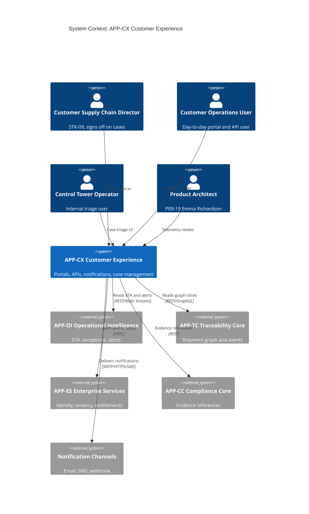
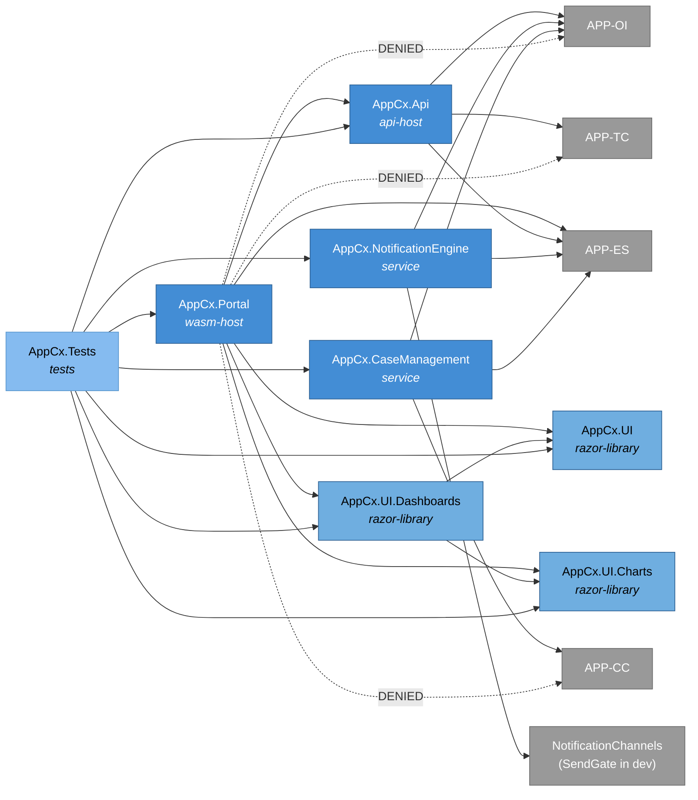
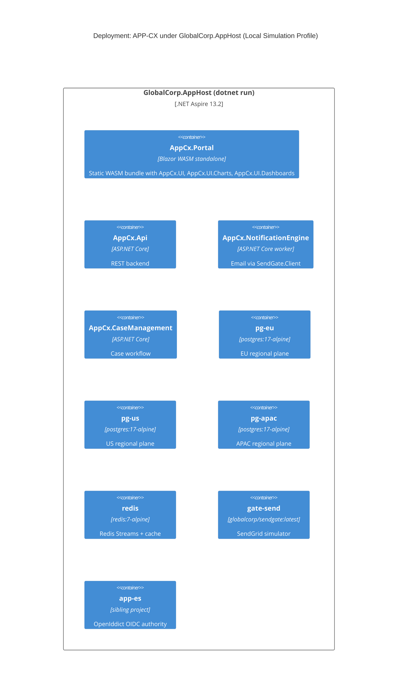
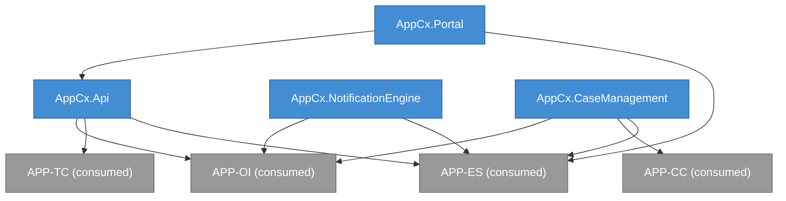
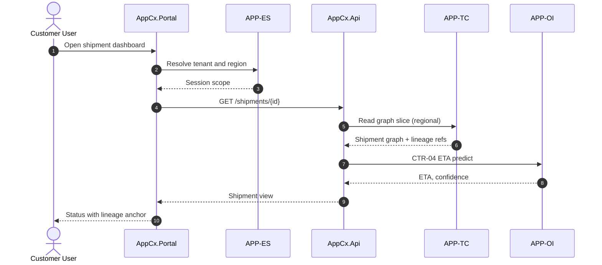
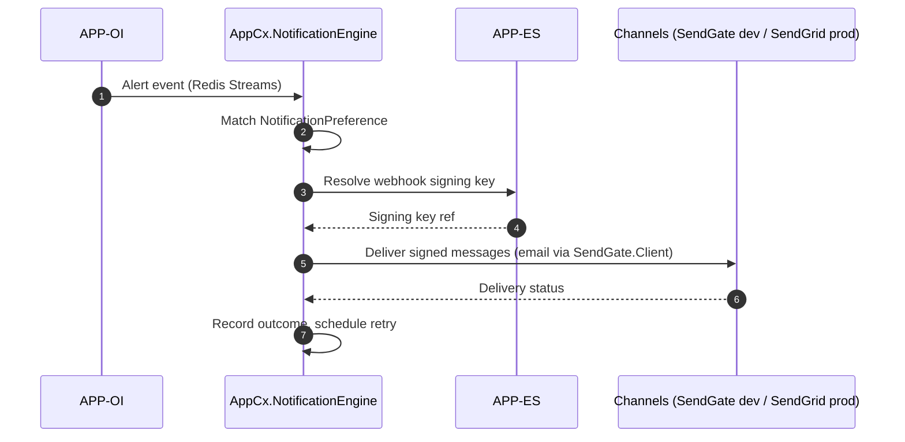

# APP-CX Customer Experience -- System Specification

## Tracking

| Field | Value |
|---|---|
| slug | app-cx-customer-experience |
| itemType | SystemSpec |
| name | APP-CX Customer Experience |
| version | 2 |
| specLangVersion | 0.1.0 |
| publishStatus | Draft |
| retentionPolicy | indefinite |
| freshnessSla | P180D |
| lastReviewed | 2026-04-18 |
| authors | [PER-19 Emma Richardson] |
| reviewers | [PER-01 Lena Brandt, PER-09 Elena Vasquez, PER-11 Anja Petersen] |
| committer | PER-19 Emma Richardson |
| tags | [subsystem, customer-facing, control-tower, app-cx, local-simulation-first, aspire] |
| createdAt | 2026-04-17T00:00:00Z |
| updatedAt | 2026-04-18T00:00:00Z |
| Dependencies | global-corp.manifest.md, global-corp.architecture.spec.md, app-oi.operational-intelligence.spec.md, app-tc.traceability-core.spec.md, app-es.enterprise-services.spec.md, aspire-apphost.spec.md, service-defaults.spec.md, SendGate.spec.md |
| Profile | BTABOK |
| profileVersion | 0.1.0 |
| codlVersion | 0.2 |
| cadlVersion | 0.1 |

## Purpose and Scope

APP-CX Customer Experience is the user-facing application domain of the Global Corp. platform. It hosts customer portals, role-specific dashboards, the shipment query API, the notification engine, and customer-case management workflows. The domain is owned by PER-19 Emma Richardson (Product Architect, Control Tower, Atlanta), reporting into the Chief Product Officer organization (PER-09) and reviewed through the Enterprise Architecture Review Board chaired by PER-11.

APP-CX is where customer supply-chain directors and operations staff experience the platform. It realizes CAP-CDL-01 Customer Delivery and the customer surfaces of CAP-CTR-01 Control Tower. It is not an authoring system for canonical events or compliance evidence; it is a read-side and notification surface over APP-TC Traceability Core, APP-OI Operational Intelligence, and APP-CC Compliance Core. It consumes identity and tenant context from APP-ES Enterprise Services and never holds its own copy of the partner contract.

Out of scope for APP-CX: raw partner ingestion (APP-PC, APP-EB), canonical shipment graph mastering (APP-TC), ETA model training or rule evaluation (APP-OI), compliance evidence assembly (APP-CC), DPP assembly (APP-SD), and multi-tenant identity and billing primitives (APP-ES). APP-CX calls those domains through published contracts and never reaches into their storage.

APP-CX runs under the Aspire AppHost in the Local Simulation Profile defined by `aspire-apphost.spec.md`. The customer portal is a Blazor WebAssembly standalone application; the backend API, notification engine, and case management service run as separate ASP.NET Core projects composed into `GlobalCorp.AppHost` alongside APP-ES Identity, the `sendgate` container, and the regional PostgreSQL data planes. UI is authored as Razor Class Libraries with SVG chart primitives and library-bundled CSS; no 3rd-party JavaScript charting or CSS-framework NuGets are consumed. The cloud-deploy path is preserved: base URLs, notification channel endpoints, and identity authority locations swap through configuration without code changes.

## Context

```spec
person CustomerSupplyChainDirector {
    description: "External customer stakeholder (STK-09). Logs into
                  the customer portal, monitors shipment status,
                  reviews exceptions, and signs off on case
                  resolutions.";
    @tag("external", "customer", "STK-09");
}

person CustomerOperationsUser {
    description: "Day-to-day customer operations user. Views
                  shipments, subscribes to alerts, opens cases
                  against exceptions.";
    @tag("external", "customer");
}

person ControlTowerOperator {
    description: "Internal Global Corp. operator (occupant role
                  aligned with PER-19's team). Triages cases,
                  adjusts customer notification preferences on
                  customer request, inspects audit trails for
                  customer sessions.";
    @tag("internal", "operator", "PER-19");
}

person ProductArchitect {
    description: "PER-19 Emma Richardson. Owns APP-CX and governs
                  its component-level decisions.";
    @tag("internal", "architect", "PER-19");
}

external system AppOi {
    description: "APP-OI Operational Intelligence. Provides ETA
                  predictions, exception state, and alert
                  streams.";
    technology: "REST/HTTPS, Redis Streams";
    @tag("internal-domain", "APP-OI");
}

external system AppTc {
    description: "APP-TC Traceability Core. Provides canonical
                  shipment graph slices and event windows used
                  for customer-visible status.";
    technology: "REST/HTTPS, GraphQL";
    @tag("internal-domain", "APP-TC");
}

external system AppEs {
    description: "APP-ES Enterprise Services. Provides identity,
                  tenant configuration, and entitlement
                  resolution.";
    technology: "OAuth 2.1/OIDC, REST/HTTPS";
    @tag("internal-domain", "APP-ES");
}

external system AppCc {
    description: "APP-CC Compliance Core. Serves read-only
                  evidence references when a customer case links
                  to a compliance case.";
    technology: "REST/HTTPS";
    @tag("internal-domain", "APP-CC");
}

external system NotificationChannels {
    description: "Third-party and first-party delivery channels:
                  email, SMS, webhook targets hosted by customers,
                  and mobile push. In the Local Simulation Profile,
                  email traffic terminates at SendGate (a containerized
                  SendGrid simulator); in the Cloud Production Profile,
                  email traffic targets the real SendGrid endpoint.
                  Webhook and SMS targets are customer-operated in both
                  profiles.";
    technology: "SendGate (dev) or SendGrid (prod) for email, HTTPS webhook, SMS gateway";
    @tag("external-channel", "gated");
}

CustomerSupplyChainDirector -> AppCx.Portal {
    description: "Signs in to dashboards, reviews shipments,
                  approves case resolutions.";
    technology: "HTTPS";
}

CustomerOperationsUser -> AppCx.Portal {
    description: "Uses dashboards and case UI day-to-day.";
    technology: "HTTPS";
}

CustomerOperationsUser -> AppCx.Api {
    description: "Machine-to-machine queries for shipment state,
                  ETA, and exception views.";
    technology: "REST/HTTPS";
}

ControlTowerOperator -> AppCx.CaseManagement {
    description: "Triages exception-linked cases, applies
                  resolutions, and records disposition.";
    technology: "HTTPS";
}

ProductArchitect -> AppCx.Portal {
    description: "Reviews telemetry and user-visible behavior for
                  architectural fitness.";
    technology: "HTTPS";
}

AppCx.Api -> AppOi {
    description: "Reads ETA, exception state, and alert windows.";
    technology: "REST/HTTPS";
}

AppCx.Api -> AppTc {
    description: "Reads shipment graph slices for customer views.
                  Never writes.";
    technology: "REST/HTTPS, GraphQL";
}

AppCx.Portal -> AppEs {
    description: "Delegates authentication and resolves tenant
                  scope and entitlements.";
    technology: "OAuth 2.1/OIDC";
}

AppCx.CaseManagement -> AppCc {
    description: "Looks up linked compliance case references when
                  a customer case touches regulated scope.";
    technology: "REST/HTTPS";
}

AppCx.NotificationEngine -> NotificationChannels {
    description: "Fans out customer notifications to email,
                  webhook targets, and SMS.";
    technology: "SMTP, HTTPS webhook, SMS gateway";
}

AppOi -> AppCx.NotificationEngine {
    description: "Publishes alert events that the notification
                  engine translates into customer-scoped
                  messages.";
    technology: "Redis Streams";
}
```

Rendered system context:



## System Declaration

```spec
system AppCx {
    target: "net10.0";
    responsibility: "User-facing application domain of the Global
                     Corp. platform. Hosts the Blazor WebAssembly
                     customer portal, the shipment query API, the
                     notification engine, customer case management,
                     and the shared Razor Libraries that supply UI
                     layout, forms, chart primitives, and composed
                     dashboards. Reads from APP-OI, APP-TC, APP-CC
                     and consumes identity and tenancy from APP-ES.
                     Owns no canonical events, no compliance
                     evidence, and no partner contracts.";

    authored component AppCx.Portal {
        kind: "wasm-host";
        path: "src/AppCx.Portal";
        status: new;
        responsibility: "Blazor WebAssembly standalone host that
                         serves the customer portal single-page app
                         to browsers. Delegates authentication to
                         APP-ES.Identity via OIDC using
                         Microsoft.AspNetCore.Components.WebAssembly.Authentication.
                         Consumes AppCx.UI, AppCx.UI.Charts, and
                         AppCx.UI.Dashboards as Razor Class Library
                         references. Holds no server-rendered state;
                         all data calls go through AppCx.Api.";
        contract {
            guarantees "Every page renders within a tenant scope
                        resolved by APP-ES. No cross-tenant data
                        is returned from the portal regardless of
                        request manipulation.";
            guarantees "Shipment status rendered in the portal
                        always carries a reference to the
                        contributing canonical event set (INV-03).
                        No status is shown without a retained
                        source event.";
            guarantees "All portal sessions honor regional data
                        routing: EU users read from the EU data
                        plane, US users from the US data plane,
                        APAC users from the APAC data plane
                        (ASR-03).";
            guarantees "The portal ships no 3rd-party JavaScript
                        charting, mapping, or CSS-framework code.
                        Built-in browser APIs via JSInterop (such
                        as clipboard and localStorage) are
                        permitted; 3rd-party library JavaScript is
                        not.";
        }

        rationale {
            context "The customer portal is the most visible face
                     of Global Corp. and must carry the platform's
                     lineage discipline. An older design served
                     shipment status from a caching layer with no
                     back-reference to events; it drifted from
                     canonical state and created trust incidents.";
            decision "Every rendered status element carries a
                      lineage pointer provided by APP-TC. The
                      portal refuses to render status without one.
                      The portal is authored as Blazor WebAssembly
                      standalone per Rule 4 of the Global Corp
                      Platform Implementation Brief; interactive
                      server render is not used.";
            consequence "INV-03 is enforced at the UI boundary and
                         not only deep inside APP-TC. Customer
                         trust in rendered state is auditable. The
                         WASM standalone posture makes the portal
                         cacheable at static-hosting layers and
                         independent of any server-render session
                         affinity.";
        }
    }

    authored component AppCx.Api {
        kind: "api-host";
        path: "src/AppCx.Api";
        status: new;
        responsibility: "ASP.NET Core REST backend exposing shipment
                         status, ETA, exception views, and case
                         summaries to the AppCx.Portal WASM client
                         and to authenticated customer integrations.
                         Read-only against APP-TC and APP-OI; writes
                         only its own session state and case
                         records. Validates bearer JWTs issued by
                         APP-ES.Identity.";
        contract {
            guarantees "Every request is authenticated through
                        APP-ES and scoped to a single tenant.
                        Unscoped requests are rejected with 401
                        or 403.";
            guarantees "Shipment and ETA responses include the
                        CTR-04 predicted ETA payload shape with
                        confidence and contributing signals when
                        provided by APP-OI.";
            guarantees "The API never writes to APP-TC, APP-OI,
                        APP-EB, or APP-CC. Any mutation request
                        is limited to entities owned by APP-CX.";
        }

        rationale {
            context "Direct read-through to APP-TC or APP-OI from
                     each customer integration would couple
                     external callers to internal schemas and make
                     regional data-plane routing inconsistent.";
            decision "APP-CX hosts a stable outward API whose
                      shapes are versioned and jurisdictionally
                      routed. Internal schema drift is absorbed
                      inside APP-CX.";
            consequence "Breaking changes to canonical schemas in
                         APP-TC do not force customer integrators
                         to reintegrate.";
        }
    }

    authored component AppCx.UI {
        kind: "razor-library";
        path: "src/AppCx.UI";
        status: new;
        responsibility: "Razor Class Library containing shared
                         layout and form components: navigation
                         chrome, breadcrumb, page headers, form
                         inputs, validation messages, modal dialog,
                         toast, table primitives, and card. Bundles
                         its own wwwroot/css/AppCx.UI.css with no
                         external 3rd-party CSS dependencies.
                         Referenced by AppCx.Portal and, where
                         needed, by UI surfaces in other
                         subsystems.";
        contract {
            guarantees "Every component authored here uses semantic
                        HTML and honors the accessibility shape
                        described in the brief's Section 9.2
                        component contract: ARIA roles, keyboard
                        navigation, focus management, and
                        CSS-variable theming.";
            guarantees "The library carries no runtime dependency
                        on Bootstrap, Tailwind, MudBlazor, Radzen,
                        AntDesign, or any other 3rd-party CSS
                        framework. Styling is authored CSS bundled
                        with the library.";
        }
    }

    authored component AppCx.UI.Charts {
        kind: "razor-library";
        path: "src/AppCx.UI.Charts";
        status: new;
        responsibility: "Razor Class Library containing the 15
                         authored SVG chart primitive components
                         catalogued in brief Section 9.1: LineChart,
                         BarChart, StackedBarChart, HeatMap,
                         TimelineChart, GanttChart, NetworkDiagram,
                         TreeMap, Sankey, GeoMap, RouteOverlay,
                         QuadrantChart, RadialGauge, DonutChart,
                         WaterfallChart. Every component is
                         authored as Razor with an inline SVG body
                         and CSS styling. Bundles its own
                         wwwroot/css/AppCx.UI.Charts.css and any
                         static basemap assets (such as the world
                         SVG basemap consumed by GeoMap).";
        contract {
            guarantees "Each component follows a uniform contract
                        shape per brief Section 9.2: props for
                        series or data model, title, axis labels,
                        and theme; events OnDataPointClick,
                        OnHover, and optional OnZoom where
                        interactive; accessibility via semantic
                        SVG with role and aria-label attributes,
                        keyboard navigation, and text alternatives;
                        theming via CSS variables and dark-mode
                        media queries with no runtime JavaScript
                        theme switching beyond attribute toggling;
                        responsive sizing via SVG viewBox and
                        preserveAspectRatio.";
            guarantees "GeoMap renders a world basemap baked into
                        the library as a static SVG asset (per
                        brief Section 9.3). Overlays including
                        route lines, shipment markers, and region
                        highlights are drawn programmatically from
                        caller-supplied data. No runtime 3rd-party
                        mapping library is loaded.";
            guarantees "The library depends on no 3rd-party
                        charting NuGet (no Plotly.Blazor,
                        ChartJs.Blazor, Radzen.Blazor, ApexCharts,
                        Syncfusion, Telerik, DevExpress,
                        MudBlazor.Charts) and no 3rd-party
                        JavaScript chart library. All chart code is
                        authored in this repository.";
        }
        rationale {
            context "Rule 5 of the Global Corp Platform
                     Implementation Brief forbids 3rd-party
                     JavaScript in shipped UI. Rule 6 requires
                     every chart to be authored as SVG plus CSS.
                     Pattern reference is the FStar.UI chart
                     library in blazor-harness.spec.md.";
            decision "AppCx.UI.Charts is the single authority for
                      chart primitives across APP-CX and any other
                      subsystem that needs to render a chart.
                      Chart primitives ship as Razor components
                      with uniform props, events, and accessibility
                      per brief Section 9.2.";
            consequence "Dashboards and feature pages assemble
                         charts by referencing this library.
                         Replacing a primitive (for example,
                         changing LineChart's axis rendering)
                         propagates to every dashboard without
                         per-page edits. The library is
                         reproducible without any external
                         charting service.";
        }
    }

    authored component AppCx.UI.Dashboards {
        kind: "razor-library";
        path: "src/AppCx.UI.Dashboards";
        status: new;
        responsibility: "Razor Class Library composing charts from
                         AppCx.UI.Charts and layout primitives from
                         AppCx.UI into the customer-facing
                         dashboards listed in brief Section 9.1:
                         Control Tower, Exception Trends, Capacity
                         Map, Shipment Detail, Compliance Dashboard,
                         Sustainability View, Risk Matrix, and DPP
                         Detail. Each dashboard is a Razor component
                         that takes a data model from AppCx.Portal
                         and renders a composed layout of charts,
                         tables, and filters. Bundles its own
                         wwwroot/css/AppCx.UI.Dashboards.css.";
        contract {
            guarantees "Dashboards perform no direct API calls.
                        They accept data models as component
                        parameters; AppCx.Portal pages load the
                        data via AppCx.Api and pass it in. This
                        keeps dashboards testable with bunit
                        without HTTP fixtures.";
            guarantees "Every dashboard that renders shipment
                        status delegates to the same LineageBadge
                        component so that INV-03 is observed
                        uniformly across views.";
        }
    }

    authored component AppCx.NotificationEngine {
        kind: "service";
        path: "src/AppCx.NotificationEngine";
        status: new;
        responsibility: "ASP.NET Core worker service that consumes
                         alerts from APP-OI, applies customer
                         notification preferences, and dispatches
                         transactional messages to email, SMS, and
                         webhook channels. In the Local Simulation
                         Profile the email path uses SendGate.Client
                         against the gate-send container; in the
                         Cloud Production Profile the email path
                         uses the real SendGrid client. The swap is
                         configuration-driven; the worker code is
                         identical across profiles. Tracks delivery
                         outcomes and retries under bounded policy.";
        contract {
            guarantees "An alert produced by APP-OI is translated
                        into zero or more customer messages only
                        when a matching NotificationPreference
                        record exists for the tenant, user, and
                        channel.";
            guarantees "Webhook deliveries sign outbound payloads
                        with a per-tenant signing key resolved
                        through APP-ES, so customers can verify
                        authenticity.";
            guarantees "No notification payload contains personal
                        data that crosses the region of origin
                        (INV-06). Regional fanout stays regional.";
            guarantees "Email traffic flows through a single typed
                        client interface whose backing
                        implementation is selected by configuration:
                        SendGate.Client for Local Simulation,
                        SendGrid for Cloud Production. Application
                        code depends on the interface, not the
                        implementation.";
        }

        rationale {
            context "Running notifications inside APP-OI coupled
                     rule evaluation latency to email and webhook
                     retry behavior. A customer-visible outage
                     surface got attached to the rule engine. In
                     addition, Rule 7 of the Global Corp Platform
                     Implementation Brief requires every external
                     integration point to route through a gate
                     simulator in the dev profile, which SendGrid
                     historically did not.";
            decision "Notification is a separate component inside
                      APP-CX. APP-OI emits alerts; APP-CX decides
                      who to tell and how. Email delivery routes
                      through SendGate in Local Simulation and
                      through SendGrid in Cloud Production; the
                      code path is identical.";
            consequence "Rule-engine performance is decoupled from
                         channel performance. Notification policy
                         lives next to the customer experience
                         that owns it. CI coverage of email flows
                         is deterministic because SendGate supports
                         stub, record, replay, and fault-inject
                         modes per its spec.";
        }
    }

    authored component AppCx.CaseManagement {
        kind: "service";
        path: "src/AppCx.CaseManagement";
        status: new;
        responsibility: "Customer case workflow: open, triage,
                         assign, resolve, and close cases linked
                         to exceptions in APP-OI and optionally
                         to compliance cases in APP-CC. Emits
                         audit trail entries on every transition.";
        contract {
            guarantees "Every case is bound to a tenant resolved
                        by APP-ES and to at least one Exception
                        reference (ENT-18) or compliance case
                        reference (ENT-16).";
            guarantees "State transitions are appended to an
                        immutable case audit log. Prior states are
                        never overwritten.";
            guarantees "A case cannot be closed while its linked
                        Exception is still in Open or In-Progress
                        state upstream. The check is synchronous
                        against APP-OI.";
        }

        rationale {
            context "Early prototypes let customer cases close
                     independently of the underlying exception,
                     which broke reconciliation with APP-OI and
                     produced 'ghost resolutions' in reports.";
            decision "Case closure is gated on exception state. If
                      the exception is not resolved, the case
                      cannot close, regardless of UI pressure.";
            consequence "Customer-visible case status is always
                         consistent with APP-OI exception state,
                         preserving trust in the scorecard.";
        }
    }

    authored component AppCx.Tests {
        kind: tests;
        path: "tests/AppCx.Tests";
        status: new;
        responsibility: "xUnit plus bunit test project covering the
                         portal WASM host, the API, the notification
                         engine, case management, and the Razor
                         Class Libraries (AppCx.UI, AppCx.UI.Charts,
                         AppCx.UI.Dashboards). Verifies tenant
                         isolation, lineage-bound rendering,
                         notification preference matching,
                         case-to-exception gating, chart component
                         contracts (props, events, accessibility),
                         and the SendGate-backed email path in Local
                         Simulation Profile.";
    }

    consumed component AspNetCore {
        source: nuget("Microsoft.AspNetCore.App");
        version: "10.*";
        responsibility: "Web host and HTTP pipeline for portal,
                         API, notification engine, and case
                         management.";
        used_by: [AppCx.Portal, AppCx.Api, AppCx.NotificationEngine,
                  AppCx.CaseManagement];
    }

    consumed component BlazorWasmAuthentication {
        source: nuget("Microsoft.AspNetCore.Components.WebAssembly.Authentication");
        version: "10.*";
        responsibility: "OIDC client integration for Blazor
                         WebAssembly standalone apps. Used by
                         AppCx.Portal to delegate authentication to
                         APP-ES.Identity via Authorization Code
                         flow with PKCE, and to attach access
                         tokens to API calls through
                         AuthorizationMessageHandler.";
        used_by: [AppCx.Portal];
    }

    consumed component JwtBearer {
        source: nuget("Microsoft.AspNetCore.Authentication.JwtBearer");
        version: "10.*";
        responsibility: "Bearer token validation against OpenIddict
                         JWTs issued by APP-ES.Identity.";
        used_by: [AppCx.Api, AppCx.NotificationEngine,
                  AppCx.CaseManagement];
    }

    consumed component RedisStreamsClient {
        source: nuget("StackExchange.Redis");
        responsibility: "Redis Streams consumer for APP-OI alert
                         stream (replaces the previous AMQP
                         dependency; APP-EB uses Redis Streams as
                         the primary event-distribution mechanism
                         per the implementation brief).";
        used_by: [AppCx.NotificationEngine];
    }

    consumed component NpgsqlClient {
        source: nuget("Npgsql");
        responsibility: "PostgreSQL driver for the regional data
                         planes (pg-eu, pg-us, pg-apac). Used for
                         CustomerSession, NotificationPreference,
                         CaseRecord, and CaseAuditEntry storage.";
        used_by: [AppCx.Api, AppCx.NotificationEngine,
                  AppCx.CaseManagement];
    }

    consumed component SendGateClient {
        source: internal("SendGate.Client");
        responsibility: "Typed .NET client wrapping the SendGrid-
                         compatible HTTP surface defined by
                         SendGate.spec.md. Used by
                         AppCx.NotificationEngine for email
                         delivery in the Local Simulation Profile.
                         In the Cloud Production Profile the same
                         interface is backed by a SendGrid adapter;
                         selection is configuration-driven.";
        used_by: [AppCx.NotificationEngine];
    }

    consumed component GlobalCorp.ServiceDefaults {
        source: internal("GlobalCorp.ServiceDefaults");
        responsibility: "Shared OpenTelemetry, health check,
                         resilience, and service-discovery wiring
                         contributed to every APP-CX project per
                         service-defaults.spec.md.";
        used_by: [AppCx.Portal, AppCx.Api, AppCx.NotificationEngine,
                  AppCx.CaseManagement];
    }

    consumed component PackagePolicy {
        source: weakRef<PackagePolicy>(GlobalCorpPolicy);
        responsibility: "Inherits the enterprise package policy
                         from global-corp.architecture.spec.md.
                         APP-CX adds no subsystem-local allowances
                         beyond the enterprise defaults. Rationale:
                         the enterprise policy already denies the
                         charting and CSS-framework NuGet
                         categories that APP-CX must avoid, and
                         allows the platform, Aspire, auth,
                         storage-driver, testing, and observability
                         categories that every APP-CX project
                         depends on.";
    }
}
```

### Authentication Pattern (OIDC + Blazor WebAssembly Standalone)

APP-CX follows the authentication pattern documented in the Global Corp Platform Implementation Brief Section 7: Authorization Code flow with PKCE between AppCx.Portal and APP-ES.Identity, and bearer-token validation at AppCx.Api.

```spec
auth_pattern OidcBlazorWasmStandalone {
    authority: ref<SystemComponent>("AppEs.Identity");
    flow: "authorization-code-with-pkce";

    client AppCxPortalClient {
        clientId: "app-cx-portal";
        clientType: "public";
        responseType: "code";
        defaultScopes: [
            "openid",
            "profile",
            "gc.shipments.read",
            "gc.shipments.write"
        ];
        redirectUri: "configured per deployment profile";
        postLogoutRedirectUri: "configured per deployment profile";
        notes: "AppCx.Portal configures
                Microsoft.AspNetCore.Components.WebAssembly.Authentication
                via AddOidcAuthentication. ProviderOptions.Authority
                resolves to AppEs.Identity's service URL, supplied
                through Aspire service discovery in Local Simulation
                Profile and through a configured authority URL in
                Cloud Production Profile. ProviderOptions.ClientId
                is app-cx-portal. ProviderOptions.ResponseType is
                code. DefaultScopes include openid, profile, and
                the gc.shipments.read and gc.shipments.write API
                scopes required by customer dashboards.";
    }

    api_handler AuthorizationMessageHandler {
        attached_to: "AppCxApi HttpClient";
        responsibility: "Acquires an access token from the OIDC
                         token store and attaches it as a Bearer
                         Authorization header to every request to
                         AppCx.Api. Handles silent token refresh
                         through the Blazor WASM authentication
                         library's built-in token manager. Surfaces
                         401 responses back to the portal's
                         authentication state provider, which
                         triggers a re-login flow when the session
                         expires.";
    }

    api_validation {
        appliesTo: [AppCx.Api, AppCx.NotificationEngine,
                    AppCx.CaseManagement];
        responsibility: "Each API host registers JwtBearer
                         authentication against APP-ES.Identity's
                         OpenIddict issuer. Authorization policies
                         map required scopes to endpoints: for
                         example, gc.shipments.read gates shipment
                         GET endpoints; gc.shipments.write gates
                         case-creation endpoints; gc.notifications.manage
                         gates NotificationPreference writes.";
    }

    rationale {
        context "Rule 5 of the Global Corp Platform Implementation
                 Brief forbids 3rd-party JavaScript. The Blazor
                 WASM Authentication library is part of the
                 Microsoft.AspNetCore.Components.WebAssembly
                 platform and ships as a platform-allowed NuGet
                 per the enterprise package policy. It implements
                 Authorization Code flow with PKCE, which is the
                 correct flow for a public Blazor WASM standalone
                 client per Microsoft's security guidance.";
        decision "AppCx.Portal uses AddOidcAuthentication with
                  OpenIddict as the authority. AuthorizationMessageHandler
                  attaches bearer tokens to the AppCx.Api HttpClient.
                  API hosts validate bearer JWTs issued by the same
                  OpenIddict instance. No server-side cookie
                  authentication is used.";
        consequence "Sign-in, silent token refresh, and sign-out
                     are handled by the platform authentication
                     library. Tokens flow across the portal/API
                     boundary in a standard way that is testable
                     with bunit and with xUnit integration fixtures
                     against AppEs.Identity under the AppHost.";
    }
}
```

## Topology

```spec
topology Dependencies {
    allow AppCx.Portal -> AppCx.Api;
    allow AppCx.Portal -> AppEs;
    allow AppCx.Portal -> AppCx.UI;
    allow AppCx.Portal -> AppCx.UI.Charts;
    allow AppCx.Portal -> AppCx.UI.Dashboards;
    allow AppCx.UI.Dashboards -> AppCx.UI.Charts;
    allow AppCx.UI.Dashboards -> AppCx.UI;
    allow AppCx.Api -> AppOi;
    allow AppCx.Api -> AppTc;
    allow AppCx.Api -> AppEs;
    allow AppCx.NotificationEngine -> AppOi;
    allow AppCx.NotificationEngine -> NotificationChannels;
    allow AppCx.NotificationEngine -> AppEs;
    allow AppCx.CaseManagement -> AppOi;
    allow AppCx.CaseManagement -> AppCc;
    allow AppCx.CaseManagement -> AppEs;
    allow AppCx.Tests -> AppCx.Portal;
    allow AppCx.Tests -> AppCx.Api;
    allow AppCx.Tests -> AppCx.NotificationEngine;
    allow AppCx.Tests -> AppCx.CaseManagement;
    allow AppCx.Tests -> AppCx.UI;
    allow AppCx.Tests -> AppCx.UI.Charts;
    allow AppCx.Tests -> AppCx.UI.Dashboards;

    deny AppCx.Portal -> AppTc;
    deny AppCx.Portal -> AppOi;
    deny AppCx.Portal -> AppCc;
    deny AppCx.Api -> AppEb;
    deny AppCx.Api -> AppCc;
    deny AppCx.NotificationEngine -> AppTc;
    deny AppCx.Api -> AppDp;
    deny AppCx.CaseManagement -> AppEb;

    deny AppCx.UI -> AppCx.Api;
    deny AppCx.UI.Charts -> AppCx.Api;
    deny AppCx.UI.Dashboards -> AppCx.Api;

    invariant "portal reads through API only":
        AppCx.Portal does not reference AppTc, AppOi, AppCc, AppEb;

    invariant "no writes to canonical state":
        AppCx.* does not write to AppTc, AppEb, AppOi, AppCc;

    invariant "UI libraries are data-agnostic":
        AppCx.UI, AppCx.UI.Charts, AppCx.UI.Dashboards do not reference
        AppCx.Api, AppOi, AppTc, AppEs, AppCc;

    rationale {
        context "APP-CX is a read-side and notification surface.
                 Permitting the portal to read APP-TC and APP-OI
                 directly would bypass the stable outward API,
                 duplicate tenancy logic, and make regional
                 routing inconsistent. The Razor Class Libraries
                 must stay reusable across subsystems, which
                 requires keeping them free of AppCx.Api
                 coupling.";
        decision "The portal reaches internal domains only
                  through AppCx.Api. Write paths into canonical
                  state are denied outright. Razor Libraries
                  accept data as component parameters; they do
                  not call APIs themselves.";
        consequence "APP-TC and APP-OI schemas can evolve behind
                     AppCx.Api. Customer-visible surfaces remain
                     stable; INV-03 and INV-04 stay enforceable.
                     AppCx.UI.Charts is consumable by any
                     subsystem with a UI surface without carrying
                     an implicit dependency on AppCx.Api.";
    }
}
```

Rendered topology:



## Data

```spec
entity CustomerSession {
    id: string;
    tenantId: string;
    userId: string;
    issuedAt: string;
    expiresAt: string;
    region: string;

    invariant "session has tenant": tenantId != "";
    invariant "session has user": userId != "";
    invariant "region recorded": region in ["EU", "US", "APAC", "MEA", "LATAM"];

    rationale "region" {
        context "Regional data-plane routing (ASR-03, ASD-03)
                 requires every session to be anchored in a
                 region at issuance, not resolved at read time.";
        decision "Session records carry the region computed at
                  login.";
        consequence "Every downstream read uses the session's
                     region to select the correct data plane,
                     preserving INV-05 and INV-06.";
    }
}

entity NotificationPreference {
    id: string;
    tenantId: string;
    userId: string;
    channel: string;
    eventCategory: string;
    severityFloor: string;
    webhookTarget: string?;
    webhookSecretRef: string?;

    invariant "tenant scoped": tenantId != "";
    invariant "channel known": channel in ["email", "sms", "webhook", "in-app"];
    invariant "severity known": severityFloor in ["info", "warning", "critical"];
}

entity CaseRecord {
    id: string;
    tenantId: string;
    exceptionRef: string;
    complianceCaseRef: string?;
    status: string;
    openedAt: string;
    closedAt: string?;
    assignee: string?;

    invariant "tenant scoped": tenantId != "";
    invariant "exception reference required": exceptionRef != "";
    invariant "status known": status in ["Open", "Triage", "InProgress", "Resolved", "Closed"];
    invariant "closed implies resolution timestamp":
        status == "Closed" implies closedAt != null;
}

entity CaseAuditEntry {
    id: string;
    caseId: string;
    actor: string;
    fromStatus: string;
    toStatus: string;
    timestamp: string;
    note: string?;

    invariant "case reference required": caseId != "";
    invariant "actor recorded": actor != "";
    invariant "transition recorded": fromStatus != toStatus;
}

consumed entity Shipment {
    source: AppTc;
    canonical: ENT-04;
    access: read-only;
    responsibility: "Customer-visible shipment state. APP-CX
                     reads graph slices via AppTc and never
                     materializes a local mutable copy.";
}

consumed entity Alert {
    source: AppOi;
    canonical: ENT-17;
    access: read-only;
    responsibility: "Alert stream consumed by the notification
                     engine. Alerts are translated into messages
                     under NotificationPreference matching.";
}

consumed entity Exception {
    source: AppOi;
    canonical: ENT-18;
    access: read-only;
    responsibility: "Exception referenced by CaseRecord. Its
                     upstream status gates case closure.";
}
```

## Contracts

```spec
contract CxShipmentQuery {
    requires session.tenantId != "";
    requires shipmentId != "";
    ensures response.shipmentId == shipmentId;
    ensures response.lineageRef != "";
    guarantees "Returns a customer-scoped shipment view composed
                of ENT-04 Shipment graph slice plus the most
                recent CTR-04 ETAPredict response. Every rendered
                status element carries a lineage reference
                resolvable via CTR-02 EvidenceRetrieval
                (INV-03).";
}

contract CxExceptionQuery {
    requires session.tenantId != "";
    ensures all exceptions in response are tenant-scoped;
    guarantees "Returns a paginated list of Exception (ENT-18)
                summaries for the tenant. Each entry links to
                the originating Alert (ENT-17) and, if present,
                to the active CaseRecord.";
}

contract CxSubscribeNotifications {
    requires session.userId != "";
    requires preference.channel in ["email", "sms", "webhook", "in-app"];
    ensures preference.id != "";
    guarantees "Creates or updates a NotificationPreference for
                the user, tenant, channel, and category. Webhook
                subscriptions generate a tenant-scoped signing
                key reference resolved via APP-ES.";
}

contract CxOpenCase {
    requires session.tenantId != "";
    requires exceptionRef != "";
    ensures case.status == "Open";
    ensures case.exceptionRef == exceptionRef;
    guarantees "Creates a CaseRecord bound to the given
                Exception. Writes a CaseAuditEntry with actor
                equal to the session user and toStatus Open.";
}

contract CxCloseCase {
    requires case.status in ["Resolved"];
    requires upstream exception.status == "Resolved";
    ensures case.status == "Closed";
    ensures case.closedAt != null;
    guarantees "Closes the case only when the upstream Exception
                in APP-OI is already Resolved. Writes a
                CaseAuditEntry with fromStatus Resolved and
                toStatus Closed.";
}

weakRef contract CTR-04-ETAPredict {
    description: "ETA prediction contract owned by APP-OI.
                  APP-CX consumes it through AppCx.Api.";
}

weakRef contract CTR-02-EvidenceRetrieval {
    description: "Evidence retrieval contract owned by APP-CC.
                  APP-CX surfaces the result through the portal
                  when a customer drills into the lineage of a
                  rendered status.";
}
```

## Invariants

```spec
invariant CxTenantIsolation {
    scope: [AppCx.Portal, AppCx.Api, AppCx.NotificationEngine, AppCx.CaseManagement];
    rule: "No response, notification, or case record crosses
           tenant boundaries. Tenant scope is resolved at session
           issuance by APP-ES and enforced on every read and
           write.";
}

invariant CxLineageBoundRendering {
    scope: [AppCx.Portal, AppCx.Api];
    rule: "No externally visible shipment state is rendered
           without a lineage reference provided by APP-TC.
           Realizes INV-03 at the customer boundary.";
    weakRef invariant: INV-03;
}

invariant CxRegionalDataLocality {
    scope: [AppCx.Portal, AppCx.Api, AppCx.NotificationEngine];
    rule: "Reads route to the region recorded on the session.
           Notification payloads do not cross the region of
           origin. Realizes INV-06 and the customer-visible
           contract of ASR-03.";
    weakRef invariant: INV-06;
}

invariant CxCaseClosureGated {
    scope: [AppCx.CaseManagement];
    rule: "A CaseRecord transitions to Closed only after the
           linked Exception upstream is Resolved. Case audit
           entries are append-only.";
}

invariant CxPreferenceMatching {
    scope: [AppCx.NotificationEngine];
    rule: "An inbound alert produces outbound messages only
           where a matching NotificationPreference exists for
           tenant, user, channel, event category, and severity
           floor.";
}
```

## Deployment

APP-CX exposes two deployment profiles. The Local Simulation Profile is primary and fully exercised; the Cloud Production Profile is deferred and documented as the long-term target.

### Local Simulation Profile (primary)

```spec
deployment LocalSimulationProfile {
    profile: "local-simulation";
    host: ref<AspireAppHost>("GlobalCorp.AppHost");

    node "GlobalCorp.AppHost (dotnet run)" {
        technology: ".NET Aspire 13.2, net10.0";

        instance: AppCx.Portal;
        instance: AppCx.Api;
        instance: AppCx.NotificationEngine;
        instance: AppCx.CaseManagement;

        launch_note: "AppCx.Portal is launched as a Blazor
                      WebAssembly standalone app via dotnet run.
                      The WASM host serves the static Blazor
                      bundle (compiled AppCx.UI, AppCx.UI.Charts,
                      and AppCx.UI.Dashboards assemblies) from
                      wwwroot. AppCx.Api, AppCx.NotificationEngine,
                      and AppCx.CaseManagement are launched as
                      separate ASP.NET Core projects under the
                      same AppHost. No regional replication is
                      simulated at the component level; regional
                      routing is exercised by pointing tenant
                      sessions at pg-eu, pg-us, or pg-apac through
                      the tenant-to-region mapping in APP-ES.";

        resource "pg-eu" {
            kind: "postgres-container";
            image: "postgres:17-alpine";
            responsibility: "Regional PostgreSQL data plane
                             simulating the EU region. Holds APP-CX
                             session, preference, case, and audit
                             state for EU tenants.";
        }
        resource "pg-us" {
            kind: "postgres-container";
            image: "postgres:17-alpine";
            responsibility: "Regional PostgreSQL data plane
                             simulating the US region.";
        }
        resource "pg-apac" {
            kind: "postgres-container";
            image: "postgres:17-alpine";
            responsibility: "Regional PostgreSQL data plane
                             simulating the APAC region.";
        }
        resource "redis" {
            kind: "redis-container";
            image: "redis:7-alpine";
            responsibility: "Redis Streams consumed by
                             AppCx.NotificationEngine for the
                             APP-OI alert stream; also serves as
                             session-level cache.";
        }
        resource "gate-send" {
            kind: "gate-container";
            image: "globalcorp/sendgate:latest";
            responsibility: "SendGrid-compatible gate simulator
                             defined by SendGate.spec.md. Terminates
                             email traffic from
                             AppCx.NotificationEngine in the Local
                             Simulation Profile. Supports stub,
                             record, replay, and fault-inject
                             modes.";
        }
        resource "app-es" {
            kind: "sibling-project";
            responsibility: "APP-ES.Identity hosts OpenIddict as
                             the OIDC authority in-process. Issues
                             tokens to AppCx.Portal and validates
                             them at AppCx.Api.";
        }
    }

    config "email-channel" {
        responsibility: "SendChannel:Provider defaults to
                         'SendGate' in the Local Simulation
                         Profile and resolves the SendGate.Client
                         backing implementation of the
                         INotificationEmailSender interface used
                         by AppCx.NotificationEngine.";
    }

    rationale {
        context "Rule 1 (local simulation first), Rule 4 (Blazor
                 WebAssembly + Razor Libraries for all UI), and
                 Rule 7 (all external subsystems in Docker
                 containers locally) in the Global Corp Platform
                 Implementation Brief. APP-CX must run end-to-end
                 on a developer workstation with no 3rd-party
                 charting or CSS-framework NuGets and no real
                 SendGrid account.";
        decision "AppCx.Portal, AppCx.Api, AppCx.NotificationEngine,
                  and AppCx.CaseManagement compose into
                  GlobalCorp.AppHost. PostgreSQL regional planes,
                  Redis, and gate-send are declared as AppHost
                  resources. APP-ES.Identity is consumed as a
                  sibling project. Razor Class Libraries
                  (AppCx.UI, AppCx.UI.Charts, AppCx.UI.Dashboards)
                  are project-referenced by AppCx.Portal and
                  compiled into its WASM bundle.";
        consequence "A dotnet run against GlobalCorp.AppHost
                     starts the portal, APIs, and all gate
                     simulators. Sign-in, shipment views,
                     dashboards, notifications, and case
                     workflows all exercise end-to-end without
                     external network dependencies.";
    }
}
```

### Cloud Production Profile (deferred)

```spec
deployment CloudProductionProfile {
    profile: "cloud-production";
    status: deferred;

    node "Global Control Plane" {
        technology: "Kubernetes, net10.0";
        instance: AppCx.CaseManagement;
        responsibility: "Case aggregation across regions when a
                         customer has shipments in multiple data
                         planes. Holds no event payloads.";
    }

    node "EU Data Plane" {
        technology: "Kubernetes, net10.0";
        instance: AppCx.Portal;
        instance: AppCx.Api;
        instance: AppCx.NotificationEngine;
    }

    node "US Data Plane" {
        technology: "Kubernetes, net10.0";
        instance: AppCx.Portal;
        instance: AppCx.Api;
        instance: AppCx.NotificationEngine;
    }

    node "APAC Data Plane" {
        technology: "Kubernetes, net10.0";
        instance: AppCx.Portal;
        instance: AppCx.Api;
        instance: AppCx.NotificationEngine;
    }

    config "email-channel" {
        responsibility: "SendChannel:Provider resolves to
                         'SendGrid'. The same
                         INotificationEmailSender interface is
                         backed by a SendGrid adapter. Code paths
                         in AppCx.NotificationEngine are unchanged
                         from the Local Simulation Profile.";
    }

    rationale {
        context "Exemplar Section 18.3 places customer-facing
                 compute regionally. Only case aggregation spans
                 regions, since a customer's case view can union
                 exceptions across planes without moving event
                 payloads.";
        decision "Portal, API, and notification engine instances
                  run per region. Case management runs on the
                  control plane and reads regional summaries
                  without copying regional payloads. Cloud
                  rollout is a configuration change from the
                  Local Simulation Profile, not a rewrite.";
        consequence "INV-05 and INV-06 are respected at the
                     compute boundary. A customer session stays
                     regional; a cross-region case view returns
                     metadata only.";
    }
}
```

Rendered deployment (Local Simulation Profile):



## Views

```spec
view container of AppCx ContainerView {
    include: all;
    autoLayout: left-right;
    description: "Internal structure of APP-CX showing portal,
                  API, notification engine, case management,
                  tests, and consumed neighbor domains.";
}

view dynamic of AppCx CustomerShipmentView {
    description: "Sequence a customer follows to view a shipment
                  and its ETA through AppCx.Api.";
    @tag("dyn-cx-01");
}

view dynamic of AppCx NotificationFanoutView {
    description: "Sequence an APP-OI alert follows through the
                  notification engine to a customer webhook or
                  email.";
    @tag("dyn-cx-02");
}
```

Rendered internal view:



## Dynamics

### DYN-CX-01 Customer views shipment status

Realizes exemplar DYN-02 at the APP-CX boundary.

```spec
dynamic CustomerViewsShipment {
    1: CustomerOperationsUser -> AppCx.Portal {
        description: "Opens the shipment dashboard after signing
                      in via OIDC.";
        technology: "HTTPS";
    };
    2: AppCx.Portal -> AppEs {
        description: "Resolves tenant scope, entitlements, and
                      session region.";
        technology: "OIDC";
    };
    3: AppCx.Portal -> AppCx.Api {
        description: "GET /shipments/{id}";
        technology: "REST/HTTPS";
    };
    4: AppCx.Api -> AppTc {
        description: "Reads a shipment graph slice scoped to
                      the session region.";
        technology: "REST/HTTPS";
    };
    5: AppCx.Api -> AppOi {
        description: "Fetches the current ETA prediction via
                      CTR-04.";
        technology: "REST/HTTPS";
    };
    6: AppCx.Api -> AppCx.Portal {
        description: "Returns the customer-scoped shipment view
                      including lineage references.";
        technology: "REST/HTTPS";
    };
    7: AppCx.Portal -> CustomerOperationsUser {
        description: "Renders status with visible lineage anchor
                      per INV-03.";
        technology: "HTTPS";
    };
}
```

Rendered interaction sequence:



### DYN-CX-02 Exception-driven notification fanout

```spec
dynamic ExceptionFanout {
    1: AppOi -> AppCx.NotificationEngine {
        description: "Publishes an Alert event to the regional
                      Redis Streams alert topic.";
        technology: "Redis Streams";
    };
    2: AppCx.NotificationEngine -> AppCx.NotificationEngine
        : "Matches alert against NotificationPreference
           records for tenant, user, category, and severity
           floor.";
    3: AppCx.NotificationEngine -> AppEs {
        description: "Resolves per-tenant webhook signing key.";
        technology: "REST/HTTPS";
    };
    4: AppCx.NotificationEngine -> NotificationChannels {
        description: "Dispatches signed webhook messages,
                      email via SendGate.Client in Local
                      Simulation Profile (SendGrid in Cloud
                      Production Profile), and SMS to the
                      configured SMS gateway, all within the
                      region of origin.";
        technology: "HTTPS webhook, SendGate or SendGrid for email, SMS gateway";
    };
    5: AppCx.NotificationEngine -> AppCx.NotificationEngine
        : "Records delivery outcome; schedules bounded retries
           on transient failure.";
}
```

Rendered interaction sequence:



## BTABOK-profile Traces

```spec
trace AsrCoverage {
    ASR-01 -> [AppCx.Api, AppCx.Portal];
    ASR-03 -> [AppCx.Portal, AppCx.Api, AppCx.NotificationEngine];
    ASR-05 -> [AppCx.NotificationEngine, AppCx.CaseManagement];
    ASR-07 -> [AppCx.Api];

    invariant "every ASR has a component":
        all sources have count(targets) >= 1;
}

trace AsdCoverage {
    ASD-03 -> [AppCx.Portal, AppCx.Api, AppCx.NotificationEngine];
    ASD-05 -> [AppCx.CaseManagement];

    rationale "APP-CX inherits ASD-03 (regional data planes) at
               the compute boundary and relates to ASD-05 through
               its case linkage to APP-CC, without absorbing
               compliance storage.";
}

trace PrincipleCoverage {
    P-02 -> [AppCx.NotificationEngine, AppCx.Api];
    P-05 -> [AppCx.Portal, AppCx.Api];
    P-09 -> [AppCx.Portal, AppCx.Api, AppCx.NotificationEngine];
}

trace CapabilityCoverage {
    CAP-CDL-01 -> [AppCx.Portal, AppCx.Api, AppCx.CaseManagement];
    CAP-CTR-01 -> [AppCx.NotificationEngine, AppCx.CaseManagement, AppCx.Api];
}

trace EntityCoverage {
    CustomerSession -> [AppCx.Portal, AppCx.Api];
    NotificationPreference -> [AppCx.Portal, AppCx.NotificationEngine];
    CaseRecord -> [AppCx.CaseManagement];
    CaseAuditEntry -> [AppCx.CaseManagement];
    Shipment -> [AppCx.Api];
    Alert -> [AppCx.NotificationEngine];
    Exception -> [AppCx.Api, AppCx.CaseManagement];
}
```

## Cross-references

APP-CX Customer Experience participates in the Global Corp. architecture through the following cross-collection references. Strong `ref<>` syntax is used when the target concept lives in the same manifest; `weakRef` is used when the target is outside the APP-CX collection and lives in the parent `global-corp.manifest.md`.

- ASRs: `weakRef<ASRCard>(ASR-01)`, `weakRef<ASRCard>(ASR-03)`, `weakRef<ASRCard>(ASR-05)`, `weakRef<ASRCard>(ASR-07)`.
- ASDs: `weakRef<DecisionRecord>(ASD-03)`, `weakRef<DecisionRecord>(ASD-05)`.
- Principles: `weakRef<PrincipleCard>(P-02)`, `weakRef<PrincipleCard>(P-05)`, `weakRef<PrincipleCard>(P-09)`.
- Capabilities: `weakRef<CapabilityCard>(CAP-CDL-01)`, `weakRef<CapabilityCard>(CAP-CTR-01)`.
- Viewpoints: `weakRef<ViewpointCard>(VP-02)`, `weakRef<ViewpointCard>(VP-04)`, `weakRef<ViewpointCard>(VP-06)`.
- Stakeholders: `weakRef<StakeholderCard>(STK-04)`, `weakRef<StakeholderCard>(STK-09)`, `weakRef<StakeholderCard>(STK-12)`.
- Canonical entities: `weakRef<EntityCard>(ENT-04)`, `weakRef<EntityCard>(ENT-17)`, `weakRef<EntityCard>(ENT-18)`, `weakRef<EntityCard>(ENT-16)`.
- Contracts: `weakRef<ContractCard>(CTR-02)`, `weakRef<ContractCard>(CTR-04)`.
- Invariants: `weakRef<InvariantCard>(INV-03)`, `weakRef<InvariantCard>(INV-05)`, `weakRef<InvariantCard>(INV-06)`.
- Dynamics: `weakRef<DynamicsCard>(DYN-02)`.
- Platform specs: `weakRef<SystemSpec>(aspire-apphost)`, `weakRef<SystemSpec>(service-defaults)`.
- Gate specs: `weakRef<SystemSpec>(SendGate)` for the email gate simulator (GATE-SEND) consumed by `AppCx.NotificationEngine` in the Local Simulation Profile.
- Personas and ownership: committer `weakRef<PersonCard>(PER-19)`, reviewers `weakRef<PersonCard>(PER-01)`, `weakRef<PersonCard>(PER-09)`, `weakRef<PersonCard>(PER-11)`.

## Open Items

- Detailed pagination and rate-limit shape for AppCx.Api (deferred to a feature spec).
- Webhook replay tooling for customer integrators (scoped to a future increment of AppCx.NotificationEngine).
- Customer self-service case export to compliance evidence bundles (depends on finalization of APP-CC export contract).
