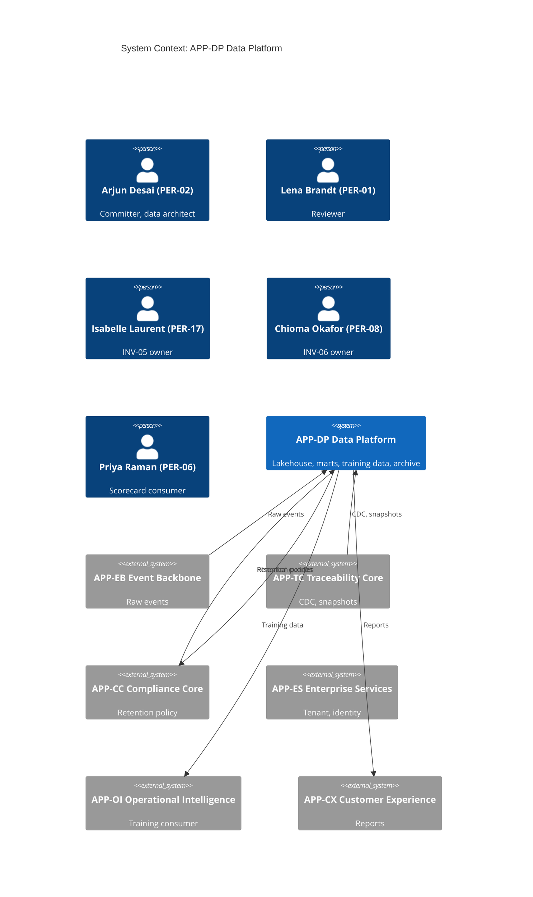
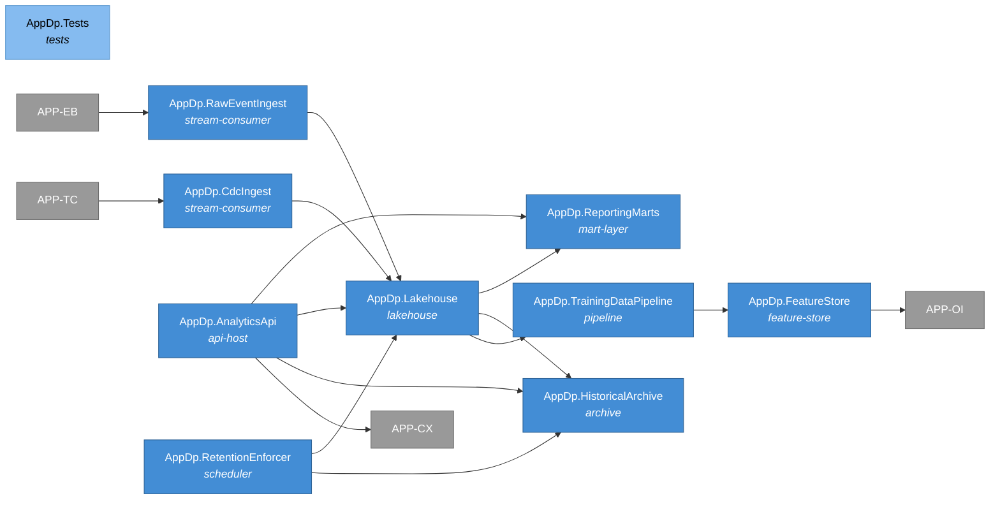
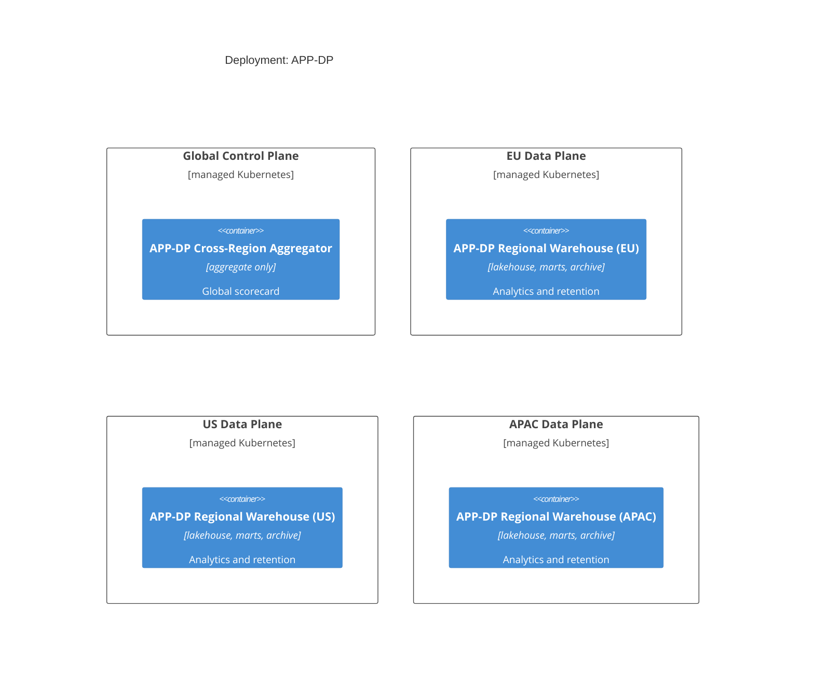
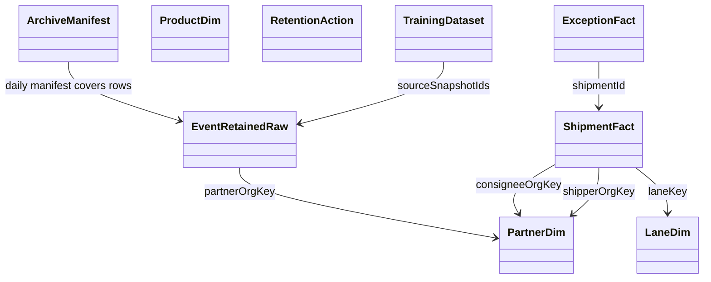
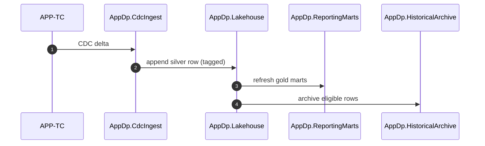
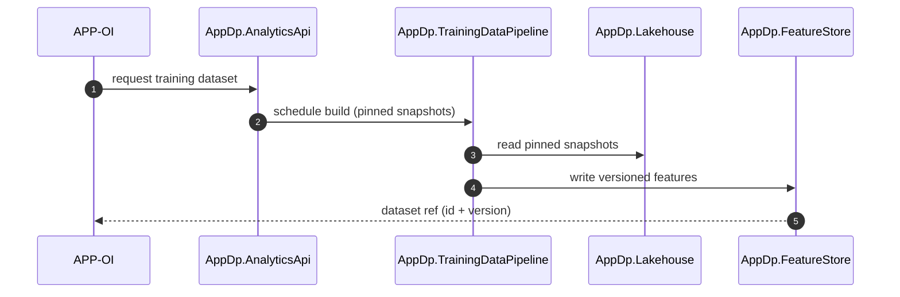
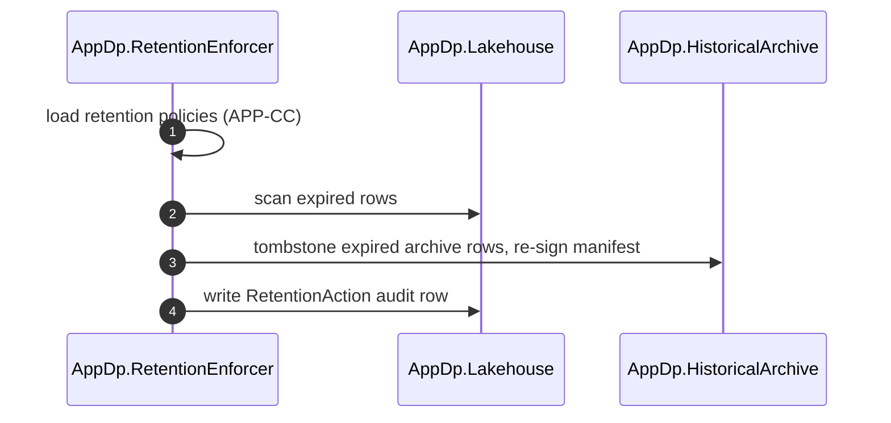
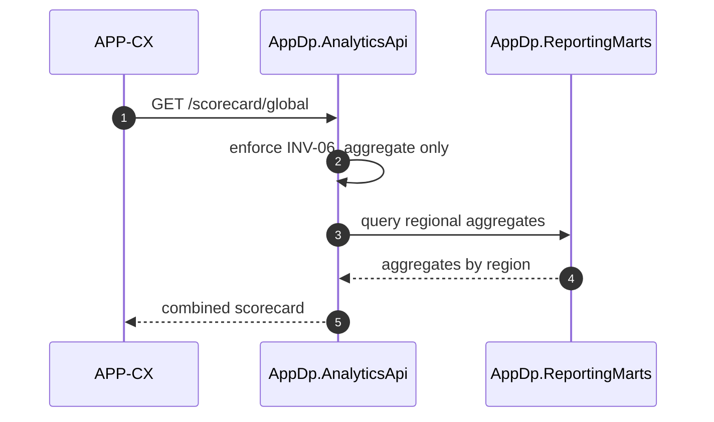

# APP-DP Data Platform -- System Specification

## Tracking

| Field | Value |
|---|---|
| slug | app-dp-data-platform |
| itemType | SystemSpec |
| name | APP-DP Data Platform |
| version | 2 |
| specLangVersion | 0.1.0 |
| publishStatus | Draft |
| retentionPolicy | indefinite |
| freshnessSla | P180D |
| authors | [PER-02 Arjun Desai] |
| reviewers | [PER-01 Lena Brandt] |
| committer | PER-02 Arjun Desai |
| createdAt | 2026-04-17T00:00:00Z |
| updatedAt | 2026-04-18T00:00:00Z |
| Dependencies | global-corp.manifest.md, global-corp.architecture.spec.md, app-tc.traceability-core.spec.md, aspire-apphost.spec.md, service-defaults.spec.md |
| Profile | BTABOK |
| profileVersion | 0.1.0 |
| codlVersion | 0.2 |
| cadlVersion | 0.1 |
| tags | [local-simulation-first, aspire] |

This specification describes APP-DP Data Platform, the analytics and
historical reporting application for Global Corp. APP-DP owns the
lakehouse, reporting marts, model training datasets, and long-term
archives. It consumes raw event streams from APP-EB, traceability
snapshots and change-data from APP-TC, and compliance metadata from
APP-CC. It feeds APP-OI model training, customer insights surfaced
through APP-CX, and indirect compliance exports. APP-DP is a
data-owned application, same committer as APP-TC: PER-02 Arjun Desai.

APP-DP is the retention centerpiece for regulations such as FSMA 204
and Digital Product Passport evidence, so its retention posture is
multi-year per jurisdiction under INV-05, and its regional replication
discipline is governed by INV-06.

APP-DP runs under the Aspire AppHost in the Local Simulation Profile.
The lakehouse is materialized as parquet files inside a MinIO
S3-compatible object store (resource `minio` declared in Section 9 of
`global-corp.architecture.spec.md`). The analytics engine is DuckDB,
embedded in-process through the `DuckDB.NET.Data.Full` NuGet; there is
no separate analytics container. The subsystem preserves a cloud-deploy
path via configuration: the same project binds to S3 (or equivalent
object storage) in the Cloud Production Profile, and the query layer
swaps trivially for a managed warehouse without changes to ingestion
or mart build code.

## 1. Purpose and Scope

The platform recognizes that analytics, historical archive, and model
training have different access patterns, failure modes, and retention
obligations than the operational canonical graph in APP-TC. Mixing
them with APP-TC would either slow canonical reads or leak long-term
retention discipline into operational workloads.

**In scope:**

- Lakehouse on MinIO object storage with parquet files for raw events
  and canonical projections. DuckDB embedded in-process serves ad hoc
  SQL and feeds mart builds.
- Reporting marts that serve customer-facing visibility reports and
  executive scorecards.
- Training data pipelines that prepare datasets for APP-OI's ETA and
  risk models.
- Historical archive with jurisdiction-aware retention, serving as the
  long-term evidence store for FSMA 204 and DPP-style audit queries.
- Internal analytics API for BI, data science, and exploration.
- Change-data capture ingestion from APP-TC and raw-event ingestion
  from APP-EB.

**Out of scope:**

- Canonical graph maintenance (APP-TC).
- Partner payload validation (APP-EB).
- Evidence package assembly and signing (APP-CC). APP-DP provides
  historical data for such packages; it does not produce them.
- Customer-facing portals (APP-CX).
- Identity and tenant management (APP-ES).

## 2. Context

```spec
person Arjun_Desai {
    slug: "per-02";
    description: "Chief Architect of Data, VP Data Platform. Committer
                  for APP-DP and APP-TC. Owns the lakehouse and
                  analytical projections.";
    @tag("internal", "architect", "data");
}

person Lena_Brandt {
    slug: "per-01";
    description: "Chief Architect. Reviewer for APP-DP.";
    @tag("internal", "architect", "enterprise");
}

person Isabelle_Laurent {
    slug: "per-17";
    description: "Chief Architect of Compliance. Owns INV-05 and the
                  retention policies that APP-DP enforces at write
                  time.";
    @tag("internal", "architect", "compliance");
}

person Chioma_Okafor {
    slug: "per-08";
    description: "CISO. Owns INV-06 regional PII posture.";
    @tag("internal", "executive", "security");
}

person Priya_Raman {
    slug: "per-06";
    description: "CFO. Consumes the executive scorecard mart through
                  BSVC-07 Analytics and executive scorecard service.";
    @tag("internal", "executive");
}

external system APP_EB {
    slug: "app-eb";
    description: "Event Backbone. APP-DP subscribes to the raw-event
                  stream for analytical retention that retains the
                  original partner payload shape.";
    technology: "event stream, CDC";
    @tag("internal", "upstream");
}

external system APP_TC {
    slug: "app-tc";
    description: "Traceability Core. APP-DP subscribes to the
                  AppTc.CdcPublisher stream for canonical-graph
                  deltas and takes periodic snapshots for mart
                  rebuilds.";
    technology: "CDC stream, snapshot import";
    @tag("internal", "upstream");
}

external system APP_CC {
    slug: "app-cc";
    description: "Compliance Core. Provides retention policies (INV-05)
                  and compliance metadata that APP-DP honors at write
                  time. APP-DP serves historical queries that APP-CC
                  uses inside evidence package assembly.";
    technology: "REST, internal";
    @tag("internal", "peer");
}

external system APP_ES {
    slug: "app-es";
    description: "Enterprise Services. Provides tenant identity and
                  entitlement for the Analytics API.";
    technology: "REST, internal";
    @tag("internal", "platform");
}

external system APP_OI {
    slug: "app-oi";
    description: "Operational Intelligence. Consumes training datasets
                  for ETA and risk models.";
    technology: "batch file, feature store";
    @tag("internal", "downstream");
}

external system APP_CX {
    slug: "app-cx";
    description: "Customer Experience. Serves customer reports from
                  marts produced by APP-DP.";
    technology: "REST, internal";
    @tag("internal", "downstream");
}

APP_EB -> APP_DP {
    description: "Streams raw events with payload references so that
                  APP-DP can retain the full event history for
                  multi-year archive.";
    technology: "event stream";
}

APP_TC -> APP_DP {
    description: "Streams canonical graph deltas (CDC) and periodic
                  snapshots so that APP-DP can project to
                  report-optimized marts.";
    technology: "CDC stream, snapshot";
}

APP_CC -> APP_DP {
    description: "Provides retention and jurisdiction policies that
                  APP-DP honors at write time.";
    technology: "REST, internal";
}

APP_DP -> APP_OI {
    description: "Serves training datasets for ETA and risk models via
                  a feature store and scheduled extracts.";
    technology: "feature store, batch file";
}

APP_DP -> APP_CX {
    description: "Serves customer reporting marts for portal display.";
    technology: "REST, internal";
}

APP_DP -> APP_CC {
    description: "Serves historical queries that APP-CC uses during
                  evidence package assembly, subject to retention and
                  regional policy.";
    technology: "REST, internal";
}
```

Rendered system context:



## 3. System Declaration

```spec
system APP_DP {
    slug: "app-dp-data-platform";
    target: "regional data plane, three primary regions (EU, US,
             APAC); cross-region aggregation at the global control
             plane for aggregate-only metrics per INV-06";
    responsibility: "Operate the lakehouse, reporting marts, training
                     data pipelines, historical archive, and analytics
                     API for Global Corp. Retain raw events and
                     canonical projections for multi-year regulatory
                     windows. Enforce jurisdiction-specific retention
                     at write time and regional PII controls on
                     replication.";

    authored component AppDp.Lakehouse {
        kind: "lakehouse";
        path: "src/AppDp.Lakehouse";
        status: new;
        responsibility: "Columnar lakehouse on MinIO object storage.
                         Raw and curated data land as parquet files
                         organized by bucket and by date-partitioned
                         prefixes. Bronze (raw regional event archive),
                         silver (canonical projections from APP-TC
                         CDC), and gold (report-ready facts and
                         dimensions) layers map onto distinct buckets.
                         The bucket layout for the Local Simulation
                         Profile is:

                         - `gc-events-eu`, `gc-events-us`,
                           `gc-events-apac`: raw regional event archive
                           (bronze), partitioned by date.
                         - `gc-compliance-bundles`: signed evidence
                           storage consumed by APP-CC.
                         - `gc-dpp-assets`: Digital Product Passport
                           binary attachments.
                         - `gc-analytics-marts`: columnar parquet files
                           (gold) that DuckDB reads to serve reports.
                         - `gc-archives`: long-term compressed
                           write-once archive (see
                           AppDp.HistoricalArchive).

                         Bucket access is scoped by the MinIO access
                         key injected by Aspire. The lakehouse module
                         wraps the MinIO .NET client; it does not
                         expose storage primitives to consumers.";
        contract {
            guarantees "Bronze parquet files retain every raw event
                        received from APP-EB with its payloadHash,
                        enabling reconstruction of the source event
                        under INV-01.";
            guarantees "Silver parquet files materialize canonical
                        projections from APP-TC CDC deltas with source
                        lineage preserved.";
            guarantees "Gold parquet files in `gc-analytics-marts`
                        hold report-ready denormalized facts and
                        dimensions. DuckDB reads them in-process for
                        the Analytics API and for mart refresh jobs.";
            guarantees "Every write carries a retentionClass tag
                        derived from APP-CC policy so that retention
                        enforcement is write-time (INV-05).";
        }

        rationale {
            context "Section 14.3 of the Implementation Brief pins the
                     Local Simulation Profile to a MinIO + DuckDB
                     stack. The Implementation Brief's Section 16.3
                     enumerates the initial bucket set. MinIO gives us
                     the S3 API locally; DuckDB embedded in-process
                     removes the need for a separate warehouse
                     container.";
            decision "Use MinIO as the S3-compatible object store for
                      raw and curated parquet files. Use DuckDB
                      embedded in-process to serve SQL against those
                      parquet files. The Aspire AppHost declares the
                      container as `minio` with image
                      `minio/minio:latest` per Section 9 of the
                      architecture spec. DuckDB runs in-process via
                      `DuckDB.NET.Data.Full`; it has no container
                      resource.";
            consequence "Teams publish to silver and gold through
                         governed pipelines. Direct bronze access is
                         gated by data science entitlements. In the
                         Cloud Production Profile the MinIO binding
                         swaps for the regional S3-equivalent object
                         store, and the DuckDB query layer swaps
                         trivially for a managed warehouse at the
                         query layer via a configuration change.";
        }
    }

    authored component AppDp.CdcIngest {
        kind: "stream-consumer";
        path: "src/AppDp.CdcIngest";
        status: new;
        responsibility: "Consumes the change-data stream published by
                         AppTc.CdcPublisher. Writes deltas as parquet
                         files to the lakehouse silver prefix,
                         preserving temporal validity on each projected
                         row. Reads the canonical CDC Redis Stream
                         (see APP-EB) through `StackExchange.Redis`
                         with consumer-group semantics.";
        contract {
            guarantees "Exactly-once application of CDC events into
                        silver parquet files, keyed by the graph node
                        or edge identifier plus its version. Consumer
                        offsets are committed after the parquet file
                        closes cleanly on MinIO.";
            guarantees "CDC events whose regionOfOrigin forbids
                        replication are materialized only in the
                        region of origin; cross-region aggregates use
                        anonymized summaries (INV-06).";
        }
    }

    authored component AppDp.RawEventIngest {
        kind: "stream-consumer";
        path: "src/AppDp.RawEventIngest";
        status: new;
        responsibility: "Consumes the raw-event Redis Stream published
                         by APP-EB and writes raw event records as
                         parquet files to the per-region bronze
                         buckets (`gc-events-eu`, `gc-events-us`,
                         `gc-events-apac`) partitioned by date and
                         tenant. Preserves the full raw payload
                         envelope for multi-year archive. Connects to
                         Redis through `StackExchange.Redis` with a
                         durable consumer group.";
        contract {
            guarantees "Bronze parquet rows carry payloadHash and a
                        pointer to APP-EB's retained payload, so that
                        any event can be traced back to its partner
                        source.";
            guarantees "Ingestion honors per-tenant retention class:
                        low-retention tenants do not land in long-term
                        archive storage.";
            guarantees "Region of origin maps directly to the bronze
                        bucket: an event with regionOfOrigin=EU is
                        written to `gc-events-eu` and to no other
                        region's bucket.";
        }
    }

    authored component AppDp.ReportingMarts {
        kind: "mart-layer";
        path: "src/AppDp.ReportingMarts";
        status: new;
        responsibility: "Mart layer for customer-facing reports and
                         internal BI. Builds and refreshes denormalized
                         shipment, consignment, and product marts on
                         scheduled cadences. Supports ShipmentFact,
                         PartnerDim, LaneDim, ProductDim, and
                         ExceptionFact projections.";
        contract {
            guarantees "Every mart row references the canonical IDs
                        used by APP-TC, so that drill-through paths
                        from report to canonical graph remain valid.";
            guarantees "Mart refresh cadence and freshness SLA are
                        published as metadata, so that consumers can
                        reason about staleness.";
        }
    }

    authored component AppDp.TrainingDataPipeline {
        kind: "pipeline";
        path: "src/AppDp.TrainingDataPipeline";
        status: new;
        responsibility: "Prepares training datasets for APP-OI ETA and
                         risk models. Combines canonical events with
                         historical outcomes into versioned feature
                         sets. Feature vectors are produced by DuckDB
                         queries over the silver parquet files and
                         materialized into the `gc-analytics-marts`
                         bucket as versioned parquet datasets.
                         Integrates with a feature store for online
                         and offline feature serving.";
        contract {
            guarantees "Every training dataset is versioned and carries
                        the source snapshot IDs and lineage pointers
                        required to reproduce it.";
            guarantees "Training sets honor INV-06: PII features do
                        not cross region boundaries without a waiver
                        such as WVR-02.";
            used_by: [AppDp.AnalyticsApi];
        }
    }

    authored component AppDp.HistoricalArchive {
        kind: "archive";
        path: "src/AppDp.HistoricalArchive";
        status: new;
        responsibility: "Long-term event archive retained per
                         jurisdiction. Supports FSMA 204 two-year
                         window, Digital Product Passport multi-year
                         retention, and any contractually defined
                         partner retention. The archive is another
                         layer within MinIO: the `gc-archives` bucket
                         holds compressed, write-once parquet files
                         organized by region, retention class, and
                         date. Bucket versioning plus object-lock
                         semantics enforce write-once at the storage
                         layer.";
        contract {
            guarantees "Retention class is set at write time and
                        enforced by a scheduled purge worker
                        (INV-05).";
            guarantees "Archive records carry a signed manifest per
                        region per day, so that downstream auditors can
                        confirm that the archive has not been tampered
                        with.";
            guarantees "Cross-region queries return aggregate-only
                        results unless an explicit waiver authorizes
                        row-level replication (INV-06).";
        }
    }

    authored component AppDp.AnalyticsApi {
        kind: "api-host";
        path: "src/AppDp.AnalyticsApi";
        status: new;
        responsibility: "Query API for internal analytics and
                         customer-facing reporting. Delegates to the
                         lakehouse for ad hoc queries, to marts for
                         structured reports, and to the archive for
                         historical queries.";
        contract {
            guarantees "All endpoints require a tenant-scoped token
                        issued by APP-ES.";
            guarantees "Query results carry the retentionClass and
                        regionOfOrigin of underlying rows so that
                        downstream surfaces (APP-CX, APP-CC) can
                        render them correctly.";
        }
    }

    authored component AppDp.RetentionEnforcer {
        kind: "scheduler";
        path: "src/AppDp.RetentionEnforcer";
        status: new;
        responsibility: "Applies retention policy at scheduled
                         intervals. Implemented as an in-process
                         scheduled worker (Quartz.NET or an ASP.NET
                         `HostedService`) that prunes parquet files
                         older than the retention window. Each
                         region's bucket (`gc-events-eu`,
                         `gc-events-us`, `gc-events-apac`, and the
                         corresponding archive prefixes) has its own
                         retention policy per INV-05; the worker
                         evaluates policies per jurisdiction and
                         deletes or tombstones parquet files whose
                         retention class has expired. Emits a
                         retention-action audit record for every
                         enforcement pass.";
        contract {
            guarantees "INV-05 holds: retention is enforced at scale
                        per jurisdiction, and every deletion is
                        accompanied by an audit record.";
            guarantees "Retention actions are idempotent and
                        replayable; a repeated enforcement pass over
                        already-purged data is a no-op.";
            guarantees "The worker runs in-process; it does not
                        require an external scheduler container.";
        }
    }

    authored component AppDp.FeatureStore {
        kind: "feature-store";
        path: "src/AppDp.FeatureStore";
        status: new;
        responsibility: "Online and offline feature store serving
                         APP-OI models. Online store supports
                         low-latency inference features; offline store
                         supports reproducible training.";
        contract {
            guarantees "Features are versioned and traceable back to
                        the training dataset version that defined
                        them.";
            guarantees "Online feature reads are tenant-scoped and
                        region-local.";
        }
    }

    authored component AppDp.Tests {
        kind: tests;
        path: "tests/AppDp.Tests";
        status: new;
        responsibility: "Unit, integration, and retention tests for
                         the data platform. Verifies INV-05 at-write
                         retention, INV-06 regional PII posture, and
                         mart freshness contracts.";
    }

    consumed component Minio {
        source: nuget("Minio");
        version: "6.*";
        responsibility: "S3-compatible .NET client for the `minio`
                         container. Used to read and write parquet
                         files for all bronze, silver, gold, archive,
                         compliance-bundle, and DPP-asset buckets.";
        used_by: [AppDp.Lakehouse, AppDp.CdcIngest,
                   AppDp.RawEventIngest, AppDp.ReportingMarts,
                   AppDp.HistoricalArchive,
                   AppDp.TrainingDataPipeline,
                   AppDp.RetentionEnforcer];
    }

    consumed component DuckDB {
        source: nuget("DuckDB.NET.Data.Full");
        version: "1.*";
        responsibility: "Embedded analytics engine. DuckDB runs
                         in-process; it has no separate container
                         resource. Queries read parquet files from
                         MinIO (through the S3 extension) and serve
                         the Analytics API, mart refresh, and training
                         pipeline.";
        used_by: [AppDp.Lakehouse, AppDp.AnalyticsApi,
                   AppDp.ReportingMarts, AppDp.TrainingDataPipeline];
    }

    consumed component RedisClient {
        source: nuget("StackExchange.Redis");
        version: "2.*";
        responsibility: "Redis client used by the ingestion workers
                         to read canonical and raw event Redis Streams
                         published by APP-EB, with durable
                         consumer-group semantics.";
        used_by: [AppDp.CdcIngest, AppDp.RawEventIngest];
    }

    consumed component RetentionPolicyClient {
        source: internal("APP-CC retention policy SDK");
        version: "1.*";
        responsibility: "Resolves the retention class for a tenant and
                         jurisdiction, used at write time by ingestion
                         paths.";
        used_by: [AppDp.CdcIngest, AppDp.RawEventIngest,
                   AppDp.RetentionEnforcer];
    }

    consumed component TenantClient {
        source: internal("APP-ES tenant and identity SDK");
        version: "1.*";
        responsibility: "Tenant scoping, token verification, and
                         entitlement checks.";
        used_by: [AppDp.AnalyticsApi];
    }

    consumed component GlobalCorp.ServiceDefaults {
        source: internal("service-defaults.spec.md");
        version: "1.*";
        responsibility: "Shared OpenTelemetry, health-check, resilience,
                         and configuration conventions applied to every
                         APP-DP ASP.NET host and hosted worker. Wired
                         from the Aspire AppHost through the standard
                         ServiceDefaults extension method.";
        used_by: [AppDp.AnalyticsApi, AppDp.CdcIngest,
                   AppDp.RawEventIngest, AppDp.RetentionEnforcer];
    }

    package_policy_ref: weakRef<PackagePolicy>(GlobalCorpPolicy);
    rationale "package policy reference" {
        context "Section 8 of `global-corp.architecture.spec.md`
                 declares the enterprise NuGet package policy. Every
                 subsystem inherits that policy rather than restating
                 its deny and allow lists.";
        decision "APP-DP references GlobalCorpPolicy by `weakRef` and
                  adds no subsystem-local package allowances. Minio,
                  DuckDB.NET.Data.Full, and StackExchange.Redis are
                  covered by the `storage-drivers` allow category.
                  No 3rd-party charting or CSS-framework NuGet is
                  introduced here.";
        consequence "Any future NuGet outside the allowed categories
                     will require a per-package rationale block in
                     this spec.";
    }
}
```

## 4. Topology

```spec
topology Dependencies {
    allow AppDp.CdcIngest -> AppDp.Lakehouse;
    allow AppDp.RawEventIngest -> AppDp.Lakehouse;
    allow AppDp.ReportingMarts -> AppDp.Lakehouse;
    allow AppDp.HistoricalArchive -> AppDp.Lakehouse;
    allow AppDp.TrainingDataPipeline -> AppDp.Lakehouse;
    allow AppDp.TrainingDataPipeline -> AppDp.FeatureStore;
    allow AppDp.AnalyticsApi -> AppDp.Lakehouse;
    allow AppDp.AnalyticsApi -> AppDp.ReportingMarts;
    allow AppDp.AnalyticsApi -> AppDp.HistoricalArchive;
    allow AppDp.RetentionEnforcer -> AppDp.Lakehouse;
    allow AppDp.RetentionEnforcer -> AppDp.HistoricalArchive;
    allow AppDp.Tests -> AppDp.AnalyticsApi;
    allow AppDp.Tests -> AppDp.Lakehouse;
    allow AppDp.Tests -> AppDp.HistoricalArchive;
    allow AppDp.Tests -> AppDp.RetentionEnforcer;
    allow AppDp.Tests -> AppDp.ReportingMarts;

    deny AppDp.Lakehouse -> AppDp.AnalyticsApi;
    deny AppDp.Lakehouse -> AppDp.CdcIngest;
    deny AppDp.HistoricalArchive -> AppDp.AnalyticsApi;
    deny AppDp.ReportingMarts -> AppDp.HistoricalArchive;
    deny AppDp.FeatureStore -> AppDp.Lakehouse;

    invariant "no writeback to canonical":
        AppDp.* does not write to APP-TC or APP-EB;
    invariant "retention enforcer is independent":
        AppDp.RetentionEnforcer has no consumer dependency on
        AppDp.AnalyticsApi;
    invariant "mart does not reach archive":
        AppDp.ReportingMarts does not query AppDp.HistoricalArchive
        directly; cross-tier queries go through AppDp.AnalyticsApi;

    rationale {
        context "APP-DP is a read-oriented application. Writeback into
                 operational systems would violate the separation
                 between operational truth (APP-TC) and analytical
                 projections (APP-DP).";
        decision "One-way flow: operational systems produce events,
                  APP-DP consumes and projects. Retention enforcer is
                  independent of the query API so that retention does
                  not block read paths and vice versa.";
        consequence "Any proposed path that violates this topology
                     requires a waiver (cf. ASD-07).";
    }
}
```

Rendered topology:



## 5. Data

APP-DP retains projections of the canonical entities defined in
APP-TC and augments them with warehouse-oriented facts and dimensions
optimized for reporting, scorecard, and training workloads.

```spec
enum RetentionClass {
    Short: "90 days or less",
    Operational: "12 months",
    Compliance_Fsma204: "Two years per FSMA 204",
    Compliance_Dpp: "Ten years per Digital Product Passport",
    Contractual: "Customer-specific per contract",
    Indefinite: "Indefinite retention"
}

enum MartLayer {
    Bronze: "Raw, immutable event shape",
    Silver: "Canonical projections from APP-TC CDC",
    Gold: "Report-ready denormalized facts and dimensions"
}

enum RegionOfOrigin {
    EU: "European Union data plane",
    US: "United States data plane",
    APAC: "Asia-Pacific data plane",
    MEA: "Middle East and Africa data plane",
    LATAM: "Latin America data plane",
    Global: "Non-regional, safe for cross-region replication"
}

entity ShipmentFact {
    slug: "shipment-fact";
    shipmentId: CanonicalId;
    tenantId: CanonicalId;
    shipperOrgKey: weakRef;
    consigneeOrgKey: weakRef;
    laneKey: weakRef;
    productCategoryKey: shortText;
    plannedDeparture: UtcInstant;
    plannedArrival: UtcInstant;
    actualDeparture: UtcInstant?;
    actualArrival: UtcInstant?;
    totalEvents: int;
    exceptionCount: int;
    retentionClass: RetentionClass;
    regionOfOrigin: RegionOfOrigin;
    validFrom: UtcInstant;
    validTo: UtcInstant?;
    sourceSnapshotId: shortText;

    invariant "shipment required": shipmentId != "";
    invariant "tenant required": tenantId != "";
    invariant "non-negative counts":
        totalEvents >= 0 && exceptionCount >= 0;
    invariant "retention set at write":
        retentionClass != null;

    rationale "denormalization" {
        context "Shipment-level reports and scorecards query shipment
                 state repeatedly. Reading the canonical graph through
                 APP-TC for every report query would be expensive and
                 would couple APP-DP to the operational path.";
        decision "Denormalize shipment state into a ShipmentFact row
                  in the gold layer, refreshed from silver-layer CDC
                  on a scheduled cadence.";
        consequence "Reports read ShipmentFact directly. Drill-through
                     to the canonical graph uses shipmentId to call
                     APP-TC, preserving source-of-truth semantics.";
    }
}

entity ExceptionFact {
    slug: "exception-fact";
    exceptionId: CanonicalId;
    shipmentId: weakRef;
    tenantId: CanonicalId;
    exceptionType: shortText;
    severity: shortText;
    raisedAt: UtcInstant;
    resolvedAt: UtcInstant?;
    resolutionMinutes: int?;
    retentionClass: RetentionClass;
    regionOfOrigin: RegionOfOrigin;

    invariant "exception required": exceptionId != "";
    invariant "raised at required": raisedAt != null;
    invariant "resolution ordered":
        resolvedAt == null || resolvedAt >= raisedAt;
}

entity EventRetainedRaw {
    slug: "event-retained-raw";
    canonicalEventId: CanonicalId;
    payloadHash: Sha256Hash;
    payloadUri: ExternalEvidenceUri;
    receivedAt: UtcInstant;
    partnerOrgKey: weakRef;
    retentionClass: RetentionClass;
    regionOfOrigin: RegionOfOrigin;
    martLayer: MartLayer @default(Bronze);

    invariant "canonical event required":
        canonicalEventId != "";
    invariant "payload hash required (INV-01)":
        payloadHash != null;
    invariant "payload uri required":
        payloadUri != null;
}

entity PartnerDim {
    slug: "partner-dim";
    partnerKey: CanonicalId;
    legalName: shortText;
    partnerType: shortText;
    primaryCountry: shortText;
    tier: shortText;
    onboardedAt: UtcInstant;
    regionOfOrigin: RegionOfOrigin;

    invariant "partner key required": partnerKey != "";
}

entity LaneDim {
    slug: "lane-dim";
    laneKey: CanonicalId;
    originCountry: shortText;
    destinationCountry: shortText;
    modeOfTransport: shortText;
    averageTransitHours: int;

    invariant "lane key required": laneKey != "";
}

entity ProductDim {
    slug: "product-dim";
    productKey: CanonicalId;
    gtin: shortText;
    category: shortText;
    hazardous: bool @default(false);
    dppRequired: bool @default(false);

    invariant "product key required": productKey != "";
    invariant "gtin required": gtin != "";
}

entity RetentionAction {
    slug: "retention-action";
    id: CanonicalId;
    runId: shortText;
    tableName: shortText;
    retentionClass: RetentionClass;
    rowsPurged: int;
    executedAt: UtcInstant;
    operator: shortText;

    invariant "non-negative rows":
        rowsPurged >= 0;
    invariant "executed at required":
        executedAt != null;
}

entity TrainingDataset {
    slug: "training-dataset";
    datasetId: CanonicalId;
    modelTarget: shortText;
    version: shortText;
    sourceSnapshotIds: list<shortText> cardinality(1..*);
    featureSchema: text;
    rowCount: int;
    createdAt: UtcInstant;
    regionOfOrigin: RegionOfOrigin;

    invariant "at least one source snapshot":
        count(sourceSnapshotIds) >= 1;
    invariant "non-negative row count":
        rowCount >= 0;

    rationale "reproducibility" {
        context "APP-OI models must be reproducible. The training
                 dataset must pin the canonical-graph snapshots used
                 so that a retrained model can be compared fairly
                 against its predecessors.";
        decision "Every TrainingDataset records the source snapshot
                  IDs it was built from, along with the feature schema
                  and a version string.";
        consequence "Audit of a model decision traces back through the
                     dataset to the canonical events, then to the
                     source evidence retained by APP-EB.";
    }
}

entity ArchiveManifest {
    slug: "archive-manifest";
    id: CanonicalId;
    region: RegionOfOrigin;
    forDate: date;
    rowCount: int;
    hashOfContents: Sha256Hash;
    signedBy: shortText;
    signedAt: UtcInstant;

    invariant "hash required": hashOfContents != null;
    invariant "signer required": signedBy != "";
}
```

### Invariants enforced by APP-DP

```spec
invariant INV_05_RetentionAtWrite {
    slug: "inv-05-retention-at-write";
    scope: [AppDp.CdcIngest, AppDp.RawEventIngest,
             AppDp.HistoricalArchive, AppDp.RetentionEnforcer];
    rule: "Retention policies are applied per jurisdiction at write
           time, not at read time. Every ingested row carries its
           retentionClass tag. The RetentionEnforcer purges expired
           rows on a scheduled cadence and emits an auditable
           RetentionAction record.";
    @owner("PER-17");
}

invariant INV_06_RegionalPii {
    slug: "inv-06-regional-pii";
    scope: [AppDp.Lakehouse, AppDp.HistoricalArchive,
             AppDp.TrainingDataPipeline];
    rule: "PII fields are minimized and never replicated outside the
           region of origin unless a regional waiver authorizes the
           replication. Cross-region aggregates use anonymized
           summaries. Every row carries regionOfOrigin so that
           replication machinery can enforce the rule without ad hoc
           classification.";
    @owner("PER-08");
    @waivers("WVR-02 cross-region metadata replication for EU DPP
              index");
}

invariant INV_01_PayloadHashRetention_Archive {
    slug: "inv-01-archive";
    scope: [EventRetainedRaw, AppDp.HistoricalArchive];
    rule: "The long-term archive retains the payload hash and the
           URI of every ingested event for the lifetime of the
           archived row. When APP-EB's own retention expires before
           the archive's, APP-DP's archive becomes the last defense
           for evidence recovery.";
    @owner("PER-02");
    @shared_with("APP-EB", "APP-TC");
}
```

## 6. Deployment

APP-DP declares two deployment profiles. The Local Simulation Profile
is the primary development and validation target; the Cloud Production
Profile is deferred, along with cloud-warehouse targets (Snowflake,
BigQuery, Databricks, Redshift) that were proposed in earlier drafts.
Per Section 14.3 of the Implementation Brief, each such cloud warehouse
is a Cloud Production Profile concern only. The Lakehouse + DuckDB
pattern trivially swaps for any of them at the query layer via a
configuration change: ingestion writes parquet to object storage in
both profiles; only the query engine rebinds.

### 6.1 Local Simulation Profile (primary)

```spec
deployment LocalSimulation {
    slug: "app-dp-local-simulation";
    description: "APP-DP runs as an Aspire-orchestrated .NET project
                  under the Global Corp AppHost. The project connects
                  to the `minio` container via Aspire `WithReference`,
                  to the APP-EB Redis Streams via the shared `redis`
                  container, and to APP-TC and APP-CC via internal
                  REST. DuckDB is embedded in-process; it has no
                  container resource.";

    node "Aspire AppHost" {
        technology: "Aspire 13.2 host, .NET 10";

        node "app-dp project" {
            technology: "ASP.NET API host and hosted workers, .NET 10";
            instance: AppDp.AnalyticsApi;
            instance: AppDp.CdcIngest;
            instance: AppDp.RawEventIngest;
            instance: AppDp.ReportingMarts;
            instance: AppDp.HistoricalArchive;
            instance: AppDp.TrainingDataPipeline;
            instance: AppDp.FeatureStore;
            instance: AppDp.RetentionEnforcer;
            instance: AppDp.Lakehouse;
            responsibility: "Single project hosts the Analytics API
                             and the CDC ingest, raw event ingest,
                             mart refresh, training pipeline, feature
                             store, retention enforcer, and lakehouse
                             modules. DuckDB runs in-process within
                             this project. ServiceDefaults wires
                             telemetry, health checks, and
                             resilience.";
        }

        node "minio container" {
            technology: "minio/minio:latest";
            responsibility: "S3-compatible object store. Holds the
                             initial bucket set (`gc-events-eu`,
                             `gc-events-us`, `gc-events-apac`,
                             `gc-compliance-bundles`, `gc-dpp-assets`,
                             `gc-analytics-marts`, `gc-archives`).
                             The MinIO volume preserves parquet data
                             across AppHost restarts.";
        }

        node "redis container (shared)" {
            technology: "redis:7";
            responsibility: "Redis Streams published by APP-EB. The
                             CDC and raw event ingest workers consume
                             the streams through `StackExchange.Redis`
                             with durable consumer groups.";
        }
    }

    rationale {
        context "Section 14.3 of the Implementation Brief specifies a
                 local-simulation-first stack. Constraint 2 requires
                 that every subsystem preserve a cloud-deploy path via
                 configuration.";
        decision "Run APP-DP as a single Aspire project bound to the
                  enterprise `minio` and `redis` containers. DuckDB
                  runs in-process. The same project binds to
                  S3-equivalent object storage and to a managed
                  warehouse or to a cloud-hosted DuckDB in the Cloud
                  Production Profile; only configuration differs.";
        consequence "The developer-machine loop is `aspire run` with
                     no cloud prerequisites. Regional distribution is
                     deferred to the Cloud Production Profile.";
    }
}
```

### 6.2 Cloud Production Profile (deferred)

The regional-warehouse deployment described below is the intended Cloud
Production Profile shape. It is deferred pending the Phase 2c roadmap
per the Implementation Brief. Cloud-warehouse integrations (Snowflake,
BigQuery, Databricks, Redshift) each slot in here at the query layer
only, with ingestion still targeting object storage.

```spec
deployment Regional {
    slug: "app-dp-regional";
    description: "APP-DP runs as a regional warehouse in each primary
                  data plane with a cross-region aggregation tier at
                  the global control plane. Section 18.3 of the Global
                  Corp exemplar is the authoritative component-to-node
                  mapping.";

    node "Global Control Plane" {
        technology: "managed Kubernetes, object storage, aggregate
                     workloads";

        node "APP-DP Cross-Region Aggregator" {
            technology: "lakehouse aggregator, read-only views";
            instance: AppDp.AnalyticsApi;
            responsibility: "Serves aggregate-only, non-PII queries
                             that span regions, such as the global
                             scorecard. Honors INV-06 by refusing
                             row-level cross-region reads.";
        }
    }

    node "EU Data Plane" {
        technology: "managed Kubernetes, region-local object storage";

        node "APP-DP Regional Warehouse (EU)" {
            technology: "lakehouse, mart layer, archive";
            instance: AppDp.Lakehouse;
            instance: AppDp.CdcIngest;
            instance: AppDp.RawEventIngest;
            instance: AppDp.ReportingMarts;
            instance: AppDp.HistoricalArchive;
            instance: AppDp.TrainingDataPipeline;
            instance: AppDp.FeatureStore;
            instance: AppDp.AnalyticsApi;
            instance: AppDp.RetentionEnforcer;
        }
    }

    node "US Data Plane" {
        technology: "managed Kubernetes, region-local object storage";

        node "APP-DP Regional Warehouse (US)" {
            technology: "lakehouse, mart layer, archive";
            instance: AppDp.Lakehouse;
            instance: AppDp.CdcIngest;
            instance: AppDp.RawEventIngest;
            instance: AppDp.ReportingMarts;
            instance: AppDp.HistoricalArchive;
            instance: AppDp.TrainingDataPipeline;
            instance: AppDp.FeatureStore;
            instance: AppDp.AnalyticsApi;
            instance: AppDp.RetentionEnforcer;
        }
    }

    node "APAC Data Plane" {
        technology: "managed Kubernetes, region-local object storage";

        node "APP-DP Regional Warehouse (APAC)" {
            technology: "lakehouse, mart layer, archive";
            instance: AppDp.Lakehouse;
            instance: AppDp.CdcIngest;
            instance: AppDp.RawEventIngest;
            instance: AppDp.ReportingMarts;
            instance: AppDp.HistoricalArchive;
            instance: AppDp.TrainingDataPipeline;
            instance: AppDp.FeatureStore;
            instance: AppDp.AnalyticsApi;
            instance: AppDp.RetentionEnforcer;
        }
    }

    rationale {
        context "ASD-03 mandates regional data planes. Analytics
                 workloads and long-term retention are particularly
                 sensitive to INV-05 and INV-06 because retention
                 windows stretch for years and PII is far easier to
                 accumulate inside analytical projections.";
        decision "Regional warehouse per primary plane. Control-plane
                  aggregator is aggregate-only, with no row-level
                  cross-region reads unless WVR-02 is active for the
                  dataset in question.";
        consequence "A regional outage does not prevent other regions
                     from operating. Cross-region scorecards remain
                     computable through the aggregator tier.";
    }
}
```

Rendered deployment:



## 7. Views

```spec
view systemContext of APP_DP ContextView {
    slug: "app-dp-context-view";
    include: all;
    autoLayout: top-down;
    description: "APP-DP with its data-owning stakeholders and the
                  peer applications that produce or consume its
                  projections.";
}

view container of APP_DP ContainerView {
    slug: "app-dp-container-view";
    include: all;
    autoLayout: left-right;
    description: "Internal structure: Lakehouse, ingestion consumers,
                  mart layer, archive, training pipeline, feature
                  store, analytics API, and retention enforcer.";
}

view dataModel of APP_DP DataModelView {
    slug: "app-dp-data-model-view";
    include: [ShipmentFact, ExceptionFact, EventRetainedRaw,
              PartnerDim, LaneDim, ProductDim, RetentionAction,
              TrainingDataset, ArchiveManifest];
    autoLayout: top-down;
    description: "Warehouse-oriented fact and dimension model plus
                  retention and archive artifacts.";
}

view retention of APP_DP RetentionView {
    slug: "app-dp-retention-view";
    include: [AppDp.Lakehouse, AppDp.HistoricalArchive,
              AppDp.RetentionEnforcer, RetentionClass, RetentionAction];
    autoLayout: top-down;
    description: "Retention posture, showing how retentionClass tags
                  flow from ingestion to enforcement.";
    @tag("compliance");
}

view deployment of Regional RegionalDeploymentView {
    slug: "app-dp-regional-deployment-view";
    include: all;
    autoLayout: top-down;
    description: "Regional warehouses in EU, US, APAC with a
                  control-plane aggregator for aggregate-only cross-
                  region queries.";
    @tag("regional");
}
```

Rendered warehouse model:



## 8. Dynamics

### 8.1 Canonical change-data projection

```spec
dynamic CdcProjection {
    slug: "app-dp-cdc-projection";
    1: APP_TC -> AppDp.CdcIngest {
        description: "Streams graph-state deltas from AppTc.CdcPublisher
                      with regionOfOrigin and lineage references.";
        technology: "CDC stream";
    };
    2: AppDp.CdcIngest -> AppDp.Lakehouse
        : "Resolves retentionClass via APP-CC retention policy client,
           appends to the silver layer with region and retention
           tags applied.";
    3: AppDp.Lakehouse -> AppDp.ReportingMarts
        : "Scheduled mart refresh pulls silver-layer rows into
           ShipmentFact, ExceptionFact, and dimension tables.";
    4: AppDp.Lakehouse -> AppDp.HistoricalArchive
        : "Eligible rows are also written to the archive under the
           assigned retention class.";
}
```

Rendered:



### 8.2 Training dataset preparation for APP-OI

```spec
dynamic TrainingDataPreparation {
    slug: "app-dp-training-prep";
    1: APP_OI -> AppDp.AnalyticsApi {
        description: "Requests a training dataset for the ETA model
                      with model target, horizon, and tenant scope.";
        technology: "REST, internal";
    };
    2: AppDp.AnalyticsApi -> AppDp.TrainingDataPipeline
        : "Schedules a dataset build: pins source snapshot IDs from
           the lakehouse silver and gold layers.";
    3: AppDp.TrainingDataPipeline -> AppDp.Lakehouse
        : "Reads canonical projections and historical outcomes under
           the pinned snapshots.";
    4: AppDp.TrainingDataPipeline -> AppDp.FeatureStore
        : "Writes versioned features to the offline feature store;
           records the TrainingDataset metadata (datasetId, version,
           sourceSnapshotIds).";
    5: AppDp.FeatureStore -> APP_OI {
        description: "Serves the training dataset to APP-OI by
                      reference (datasetId + version).";
        technology: "feature store";
    };
}
```

Rendered:



### 8.3 Retention enforcement

```spec
dynamic RetentionEnforcementPass {
    slug: "app-dp-retention-enforcement";
    1: AppDp.RetentionEnforcer -> AppDp.RetentionEnforcer
        : "Scheduled trigger. Loads the active retention policies
           from APP-CC.";
    2: AppDp.RetentionEnforcer -> AppDp.Lakehouse
        : "Scans retentionClass tags and identifies rows whose
           retention window has expired.";
    3: AppDp.RetentionEnforcer -> AppDp.HistoricalArchive
        : "Scans archive rows for the same; rows scheduled for
           deletion are tombstoned and their ArchiveManifest
           re-signed.";
    4: AppDp.RetentionEnforcer -> AppDp.Lakehouse
        : "Writes a RetentionAction row for every purge, with
           runId, tableName, retentionClass, and rowsPurged.";
}
```

Rendered:



### 8.4 Cross-region aggregate query

```spec
dynamic CrossRegionAggregate {
    slug: "app-dp-cross-region-aggregate";
    1: APP_CX -> AppDp.AnalyticsApi {
        description: "Requests the global scorecard for a tenant
                      spanning EU, US, and APAC.";
        technology: "REST, internal";
    };
    2: AppDp.AnalyticsApi -> AppDp.AnalyticsApi
        : "Evaluates INV-06: no row-level data crosses regions
           without a waiver; only aggregates are permitted for this
           tenant.";
    3: AppDp.AnalyticsApi -> AppDp.ReportingMarts
        : "Queries regional marts in EU, US, and APAC for aggregate
           results.";
    4: AppDp.AnalyticsApi -> APP_CX {
        description: "Returns combined aggregate scorecard.";
        technology: "REST, internal";
    };
}
```

Rendered:



## 9. BTABOK Traces

```spec
trace AsrCoverage {
    slug: "app-dp-asr-coverage";
    ASR_02_RetainedEvidence -> [AppDp.RawEventIngest,
                                 AppDp.HistoricalArchive,
                                 AppDp.Lakehouse];
    ASR_03_RegionalDataResidency -> [AppDp.Lakehouse,
                                      AppDp.HistoricalArchive,
                                      AppDp.AnalyticsApi];
    ASR_06_ReproducibleEvidencePackages -> [AppDp.HistoricalArchive,
                                             AppDp.AnalyticsApi];
}

trace AsdCoverage {
    slug: "app-dp-asd-coverage";
    ASD_03_RegionalDataPlanes -> [AppDp.Lakehouse,
                                   AppDp.HistoricalArchive,
                                   AppDp.AnalyticsApi];
    ASD_05_ComplianceSeparation -> [AppDp.HistoricalArchive,
                                     AppDp.RetentionEnforcer];
}

trace PrincipleCoverage {
    slug: "app-dp-principle-coverage";
    P_04_TrustRequiresLineage -> [AppDp.RawEventIngest,
                                   AppDp.HistoricalArchive];
    P_09_GlobalConsistencyRegionalCompliance -> [AppDp.Lakehouse,
                                                  AppDp.HistoricalArchive,
                                                  AppDp.AnalyticsApi];
}

trace InvariantCoverage {
    slug: "app-dp-invariant-coverage";
    INV_01_PayloadHashRetention_Archive -> [AppDp.RawEventIngest,
                                             AppDp.HistoricalArchive];
    INV_05_RetentionAtWrite -> [AppDp.CdcIngest,
                                 AppDp.RawEventIngest,
                                 AppDp.HistoricalArchive,
                                 AppDp.RetentionEnforcer];
    INV_06_RegionalPii -> [AppDp.Lakehouse,
                            AppDp.TrainingDataPipeline,
                            AppDp.AnalyticsApi];
}

trace EntityResponsibility {
    slug: "app-dp-entity-responsibility";
    ShipmentFact       -> [AppDp.Lakehouse, AppDp.ReportingMarts];
    ExceptionFact      -> [AppDp.Lakehouse, AppDp.ReportingMarts];
    EventRetainedRaw   -> [AppDp.RawEventIngest, AppDp.Lakehouse,
                            AppDp.HistoricalArchive];
    PartnerDim         -> [AppDp.ReportingMarts];
    LaneDim            -> [AppDp.ReportingMarts];
    ProductDim         -> [AppDp.ReportingMarts];
    RetentionAction    -> [AppDp.RetentionEnforcer];
    TrainingDataset    -> [AppDp.TrainingDataPipeline,
                            AppDp.FeatureStore];
    ArchiveManifest    -> [AppDp.HistoricalArchive];
}

trace WaiverCoverage {
    slug: "app-dp-waiver-coverage";
    WVR_02_CrossRegionMetadata -> [AppDp.AnalyticsApi,
                                    AppDp.Lakehouse];
}
```

## 10. Cross-references

- **Application catalog.** Section 15.1 of the Global Corp exemplar
  lists APP-DP with primary responsibility for lakehouse, reporting
  marts, model training data, and historical archives; owner PER-02.
- **Deployment mapping.** Section 18.3 assigns APP-DP as "Cross-region
  aggregation" at the global control plane and "Regional warehouse"
  in each primary data plane; this spec realizes that mapping.
- **Canonical entities consumed.** APP-DP does not own the canonical
  entities ENT-01 through ENT-19. It projects them into warehouse-
  oriented facts and dimensions defined here, retaining canonical IDs
  as keys to support drill-through into APP-TC.
- **Contracts.** APP-DP does not own any of the contracts CTR-01
  through CTR-05 as primary. It supports CTR-06 (if extended) and
  serves historical evidence queries that APP-CC consumes during
  CTR-03 ComplianceExport assembly.
- **Invariants.** INV-05 and INV-06 are enforced here at scale. INV-01
  is extended into the long-term archive by retaining payload hashes
  and pointers beyond APP-EB's operational retention.
- **Decisions.** ASD-03 (regional data planes) and ASD-05 (compliance
  separation) are the direct drivers.
- **Principles.** P-04 (trust requires lineage) and P-09 (global
  consistency, regional compliance) are primary. P-07 (repository is
  first for architects) shapes the metadata and freshness SLAs on
  marts.
- **Dynamics.** APP-DP participates in DYN-01 (raw-event retention
  step) and in DYN-03 (compliance evidence export) by serving the
  historical evidence that APP-CC assembles.
- **Waivers.** WVR-02 governs cross-region metadata replication that
  APP-DP supports for the EU Digital Product Passport index.

## 11. Open Items

- Confirm the feature-store technology choice with PER-18 (APP-OI
  owner) and close the co-design item. The Local Simulation Profile
  default is an in-process feature store materialized as parquet in
  `gc-analytics-marts`.
- Finalize the ArchiveManifest signing key rotation policy with
  PER-08 and PER-17.
- Confirm with PER-17 the list of retention classes for tenant types
  that have contractual rather than regulatory retention terms.
- Cross-region metadata replication (WVR-02): the replication worker
  remains as previously specified and runs in-process. It writes
  scrubbed metadata to the `gc-dpp-index` dataset (materialized as
  parquet inside `gc-analytics-marts`) which is readable across
  regions. The worker does not cross-write row-level PII.
- Confirm the pinned MinIO and DuckDB versions alongside the Apache
  AGE pin in the enterprise `global-corp.architecture.spec.md`
  Section 9 composition.
