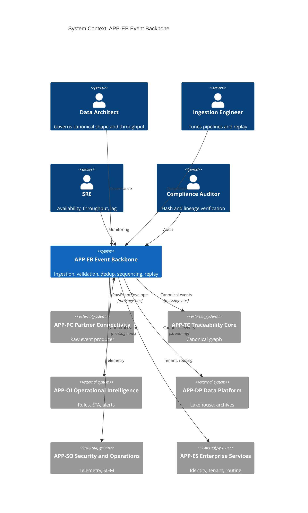
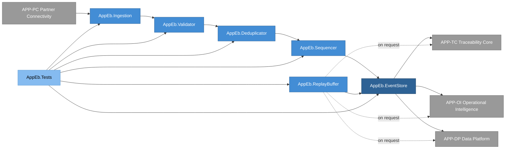
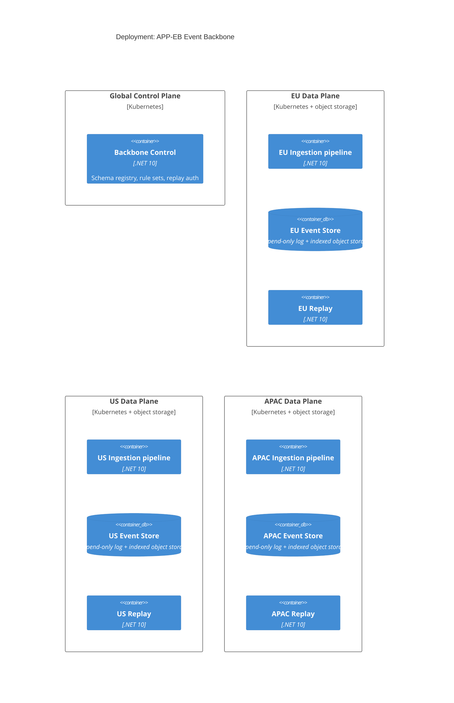
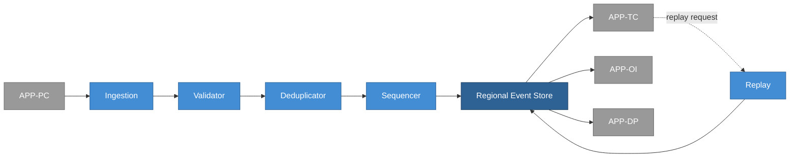
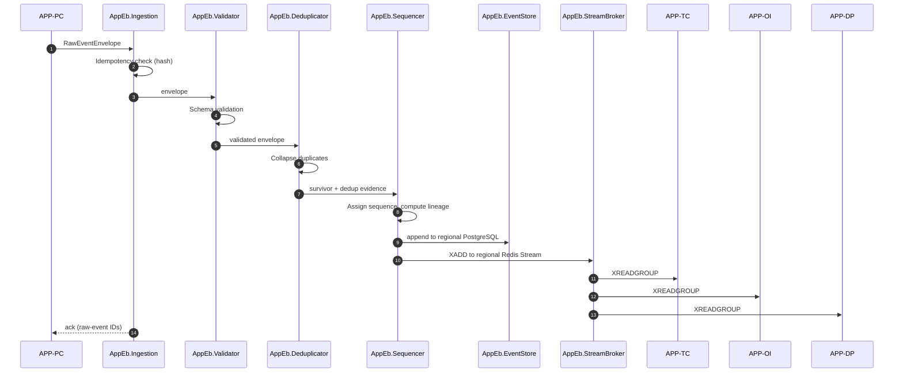

# APP-EB Event Backbone, System Specification

## Tracking

| Field | Value |
|---|---|
| slug | app-eb-event-backbone |
| itemType | SystemSpec |
| name | APP-EB Event Backbone |
| version | 2 |
| specLangVersion | 0.1.0 |
| publishStatus | Draft |
| retentionPolicy | indefinite |
| freshnessSla | P180D |
| authors | [PER-02 Arjun Desai] |
| reviewers | [PER-01 Lena Brandt] |
| committer | PER-02 Arjun Desai |
| tags | [ingestion, event-backbone, redis-streams, postgres, local-simulation-first, aspire] |
| createdAt | 2026-04-17T00:00:00Z |
| updatedAt | 2026-04-18T00:00:00Z |
| Dependencies | global-corp.manifest.md, global-corp.architecture.spec.md, aspire-apphost.spec.md, service-defaults.spec.md |
| Profile | BTABOK |
| profileVersion | 0.1.0 |
| codlVersion | 0.2 |
| cadlVersion | 0.1 |

## Purpose and Scope

APP-EB Event Backbone is the high-throughput ingestion and sequencing
layer of the Global Corp. platform. It receives RawEventEnvelope
records from APP-PC Partner Connectivity, validates them against the
canonical event schema, deduplicates by payload hash, orders events
within a subject's timeline, persists them in a regional append-only
store, and makes them available for downstream consumers: APP-TC
Traceability Core (canonical event assembly), APP-OI Operational
Intelligence (rule engine and ETA models), and APP-DP Data Platform
(analytics and archive). APP-EB also owns replay capability so that
downstream consumers can re-derive their state without re-contacting
partners.

APP-EB exists because ingestion elasticity must not contaminate
canonical model quality. Raw ingestion load fluctuates with partner
behavior, batch cadence, and peak commerce cycles; canonical
traceability needs predictable shape and strict semantic enforcement.
This separation is ASD-02 (separate ingestion from canonical
traceability core), it cascades to ASD-04 (lineage first-class), and
it implements P-02 (events are the source of operational truth). The
canonical event model (ENT-13 Event) is authoritative at the APP-TC
boundary; APP-EB's job is to prepare events such that APP-TC's
semantic checks can succeed cheaply.

Scope covers envelope validation, schema enforcement for the canonical
event shape, deduplication, sequencing, regional persistence,
replay, and partner-visible ingestion acknowledgements. Scope excludes
partner identity, adapter logic, canonical identity resolution, and
cross-event lineage computation; those belong to APP-PC, APP-TC, and
APP-DP respectively. Capability coverage runs through CAP-TRC-01
Canonical Event Ingestion in the enterprise capability catalog.

In the Local Simulation Profile, APP-EB runs as a set of .NET 10
projects composed under the Global Corp Aspire AppHost (see
`aspire-apphost.spec.md`). The event broker is **Redis Streams**
(XADD and XREADGROUP, not Redis Pub/Sub): downstream consumers APP-TC,
APP-OI, and APP-DP read from consumer groups on a set of per-region
streams. The event store is **PostgreSQL 17**, provisioned as three
regional containers (`pg-eu`, `pg-us`, `pg-apac`) through Aspire
`WithReference`. Multi-region event-store routing is resolved
per-request against the tenant's region, which APP-ES maps and
APP-EB consults at persistence time. The deduplication index and
sequencing state live in the same regional PostgreSQL container as
the event they pertain to.

The Cloud Production Profile is preserved as a deferred target. Any
cloud-managed event broker or event store (managed Kafka, AWS MSK,
Azure Event Grid, managed PostgreSQL) is out of scope for v0.1 and
is documented only to confirm that the Local Simulation composition
can be promoted to cloud by configuration, not by rewrite (Constraint
2). Every authored component consumes `GlobalCorp.ServiceDefaults`
(see `service-defaults.spec.md`) for OpenTelemetry, resilience
policies, service discovery, JWT bearer validation, and health-check
conventions.

## Context

```spec
person DataArchitect {
    description: "Data platform and backbone architect responsible for
                  canonical event shape, throughput characteristics,
                  and regional persistence guarantees.";
    @tag("internal", "architecture");
}

person IngestionEngineer {
    description: "Engineer who tunes ingestion pipelines, triages
                  dedup anomalies, and manages replay windows.";
    @tag("internal", "engineering");
}

person SRE {
    description: "Site reliability engineer responsible for APP-EB
                  availability, throughput, lag, and regional
                  failover.";
    @tag("internal", "operations");
}

person ComplianceAuditor {
    description: "Auditor who verifies INV-01 payload hash retention
                  and INV-02 lineage completeness at the backbone
                  layer.";
    @tag("internal", "compliance");
}

external system APP-PC {
    description: "Partner Connectivity. Emits RawEventEnvelope records
                  that APP-EB ingests.";
    technology: "Internal message bus";
    @tag("platform", "upstream");
}

external system APP-TC {
    description: "Traceability Core. Consumes canonical events from
                  APP-EB, resolves identity, and builds the
                  shipment/product graph.";
    technology: "Internal message bus, internal RPC";
    @tag("platform", "downstream");
}

external system APP-OI {
    description: "Operational Intelligence. Subscribes to canonical
                  events for rule engine evaluation, ETA modelling,
                  and alerting.";
    technology: "Internal message bus";
    @tag("platform", "downstream");
}

external system APP-DP {
    description: "Data Platform. Subscribes to canonical events for
                  lakehouse, reporting marts, model training data, and
                  historical archives.";
    technology: "Internal message bus, streaming connector";
    @tag("platform", "downstream");
}

external system APP-SO {
    description: "Security and Operations. Receives observability
                  telemetry (metrics, traces, audit logs) from APP-EB.";
    technology: "OpenTelemetry, SIEM connector";
    @tag("platform", "observability");
}

external system APP-ES {
    description: "Enterprise Services. Provides tenant metadata and
                  regional routing policy consulted at persistence
                  time.";
    technology: "Internal RPC";
    @tag("platform", "shared");
}

DataArchitect -> APP-EB : "Governs canonical event shape and
                           throughput posture.";
IngestionEngineer -> APP-EB : "Tunes pipelines, triages dedup and
                               lag anomalies, manages replay.";
SRE -> APP-EB : "Monitors availability, throughput, lag.";
ComplianceAuditor -> APP-EB : "Verifies hash retention and lineage
                               completeness evidence.";

APP-PC -> APP-EB {
    description: "Forwards RawEventEnvelope records with partner and
                  adapter provenance.";
    technology: "Internal message bus";
}

APP-EB -> APP-TC {
    description: "Publishes canonical Event records and
                  deduplication-aware sequencing metadata.";
    technology: "Internal message bus";
}

APP-EB -> APP-OI {
    description: "Publishes canonical events for rule engine and ETA
                  model consumption.";
    technology: "Internal message bus";
}

APP-EB -> APP-DP {
    description: "Publishes canonical events for analytics and
                  archival.";
    technology: "Streaming connector";
}

APP-EB -> APP-SO {
    description: "Emits telemetry, metrics, and audit logs.";
    technology: "OpenTelemetry, SIEM";
}

APP-EB -> APP-ES {
    description: "Consults tenant metadata and regional routing
                  policy.";
    technology: "Internal RPC";
}
```

Rendered system context:



## System Declaration

```spec
system APP-EB {
    target: "net10.0";
    responsibility: "Accept RawEventEnvelope records from APP-PC,
                     validate them against the canonical event schema,
                     deduplicate by payload hash, sequence per subject,
                     persist them in the regional append-only event
                     store, and publish canonical events to APP-TC,
                     APP-OI, and APP-DP. Provide replay capability
                     bounded by the regional retention window.
                     Implements P-02 and realizes ASD-02.";

    authored component AppEb.Ingestion {
        kind: service;
        path: "src/AppEb.Ingestion";
        status: new;
        responsibility: "High-throughput ingestion front end. Pulls
                         RawEventEnvelope records from the partner
                         ingestion bus, performs envelope-level
                         idempotency check by (partnerContractId,
                         payloadHash), and hands surviving envelopes
                         to AppEb.Validator. Emits synchronous ingest
                         acknowledgements back to APP-PC.";
        contract {
            guarantees "Every accepted envelope produces an
                        acknowledgement with a raw-event identifier
                        within the ingestion SLO.";
            guarantees "An envelope with a (partnerContractId,
                        payloadHash) pair seen within the dedup
                        window is acknowledged idempotently without
                        re-emission downstream.";
            guarantees "Ingestion does not drop envelopes silently;
                        dropped envelopes produce a DeadLetterRecord.";
        }
    }

    authored component AppEb.Validator {
        kind: service;
        path: "src/AppEb.Validator";
        status: new;
        responsibility: "Schema validation of canonical event content
                         derived from the envelope. Checks required
                         canonical fields (see ENT-13), enum
                         conformance for eventType and businessStep,
                         timestamp sanity, confidenceScore bounds, and
                         payload hash presence. Rejects envelopes that
                         violate the schema with reason codes.";
        contract {
            guarantees "Every accepted envelope yields a schema-valid
                        canonical Event record or a RejectionRecord.";
            guarantees "Schema rejections preserve the payloadHash and
                        the partner and adapter provenance for audit.";
            guarantees "Validator rule set is versioned; rule-set
                        rollback does not invalidate previously
                        accepted events.";
        }
    }

    authored component AppEb.Deduplicator {
        kind: service;
        path: "src/AppEb.Deduplicator";
        status: new;
        responsibility: "Event deduplication by payload hash within a
                         dedup window scoped per subject. Collapses
                         partner-duplicate submissions and re-delivered
                         webhook events into a single canonical Event.
                         Records the duplicate count on the surviving
                         event for observability.";
        contract {
            guarantees "Two envelopes with the same payload hash,
                        subject, and event type within the dedup
                        window result in one canonical Event
                        downstream.";
            guarantees "The surviving event carries duplicateCount and
                        a list of envelopeIds that collapsed into it.";
            guarantees "Dedup does not cross subjects; identical hashes
                        for different subjects remain distinct.";
        }

        rationale {
            context "Partner retry semantics, webhook re-delivery, and
                     batch reprocessing all produce duplicates. Dedup
                     state is colocated with the canonical event in
                     its region of origin so that residency invariants
                     hold for the index as well as the event.";
            decision "Deduplication is per subject, keyed on
                      payloadHash, with duplicate evidence retained
                      rather than discarded. The dedup index lives in
                      the regional PostgreSQL container resolved by
                      AppEb.ConnectionFactory, alongside the canonical
                      event.";
            consequence "Downstream systems (APP-TC, APP-OI, APP-DP)
                         never see duplicate canonical events, but the
                         duplicate history remains auditable and
                         regionally resident.";
        }
    }

    authored component AppEb.Sequencer {
        kind: service;
        path: "src/AppEb.Sequencer";
        status: new;
        responsibility: "Establish per-subject event ordering. Uses
                         UUIDv7 time ordering for new events and
                         applies out-of-order windowing when partner
                         timestamps arrive late. Emits an explicit
                         sequenceNumber on each canonical Event so that
                         APP-TC and APP-OI can reason about order
                         without re-sorting.";
        contract {
            guarantees "Every canonical Event carries a monotonic
                        sequenceNumber scoped to (subjectId,
                        eventType).";
            guarantees "Out-of-order arrivals within the sequencing
                        window are reordered before publication;
                        arrivals past the window are emitted with a
                        lateArrival marker.";
            guarantees "Sequencing is deterministic: replaying the
                        same envelope stream yields the same
                        sequenceNumbers.";
        }
    }

    authored component AppEb.ReplayBuffer {
        kind: service;
        path: "src/AppEb.ReplayBuffer";
        status: new;
        responsibility: "Replay capability bounded by the regional
                         retention window. Given a (subjectId,
                         eventTypeFilter, fromSequence, toSequence)
                         request, re-emits canonical events to a
                         requesting consumer without re-contacting
                         partners. Used by APP-TC for graph rebuild,
                         APP-OI for rule backfill, and APP-DP for
                         historical load.";
        contract {
            guarantees "Replay requests produce events in original
                        sequenceNumber order.";
            guarantees "Replay is isolated per consumer; a replay to
                        APP-TC does not disturb the live stream to
                        APP-OI or APP-DP.";
            guarantees "Replays beyond the regional retention window
                        are rejected with REPLAY_OUT_OF_WINDOW.";
        }
    }

    authored component AppEb.EventStore {
        kind: datastore;
        path: "src/AppEb.EventStore";
        status: new;
        responsibility: "Source-of-truth append-only event store for
                         canonical events and the envelopes they
                         derived from. Regional. Realized as a set of
                         schemas in three PostgreSQL 17 containers
                         (pg-eu, pg-us, pg-apac) declared by the
                         AppHost. Stores canonical Event records,
                         envelope provenance, dedup evidence, the
                         payload hash index that INV-01 requires, and
                         the dedup-window index keyed by (subjectId,
                         payloadHash). Writes for a tenant go to the
                         container that matches the tenant's region
                         per the routing decision made in
                         AppEb.ConnectionFactory.";
        contract {
            guarantees "Writes are append-only; no in-place updates
                        to canonical events after publication.";
            guarantees "Payload hash is indexed for hash-based lookup
                        required by INV-01 audit queries.";
            guarantees "Retention follows the jurisdiction policy that
                        applies to the event's region of origin.";
            guarantees "Every canonical event is written to exactly
                        one regional container; cross-region writes
                        are denied.";
            guarantees "The dedup index and sequencing state are
                        colocated with the canonical event in the
                        same regional container.";
        }

        rationale {
            context "APP-TC and APP-DP both need authoritative access
                     to canonical events, and compliance audits require
                     the payload hash index. INV-05 and INV-06
                     (regional residency) require that a tenant's data
                     never leave its home region without an explicit
                     waiver.";
            decision "Event store is owned by APP-EB, append-only,
                      regional, with a hash index. In Local Simulation
                      Profile each region is a PostgreSQL 17 container
                      on the developer machine. Regional selection is
                      resolved through AppEb.ConnectionFactory.";
            consequence "APP-TC does not re-persist raw events; it
                         derives its graph from the authoritative
                         event store. Replay and audit both query the
                         same source of truth. Residency invariants
                         hold by construction in dev and prod.";
        }
    }

    authored component AppEb.ConnectionFactory {
        kind: library;
        path: "src/AppEb.ConnectionFactory";
        status: new;
        responsibility: "Multi-region connection factory. Given an
                         incoming event's tenant context, resolves the
                         tenant's region through APP-ES and returns a
                         PostgreSQL connection to the matching
                         regional container (pg-eu, pg-us, or
                         pg-apac). Used by AppEb.Sequencer for writes,
                         AppEb.EventStore for reads, and
                         AppEb.ReplayBuffer for replay queries. The
                         factory is payload-agnostic; routing is
                         decided from tenant context only, never from
                         event content.";
        contract {
            guarantees "The factory never infers region from event
                        payload; it reads tenant context from the
                        request or from the envelope provenance and
                        consults APP-ES for the region mapping.";
            guarantees "A tenant with no region mapping produces a
                        TenantRegionUnresolved error; no default
                        region is assumed.";
            guarantees "Connections are pooled per region;
                        cross-region pool sharing is denied.";
            guarantees "Switching regions for a given tenant is an
                        explicit administrative action in APP-ES; the
                        factory picks up the new mapping on the next
                        resolution.";
        }

        rationale {
            context "INV-05 and INV-06 require per-tenant regional
                     residency. The pipeline stages must not carry
                     per-region branching.";
            decision "Centralize region resolution in a single
                      connection factory. Every write and read path
                      consults it, and it is the only component that
                      opens regional PostgreSQL connections.";
            consequence "Adding or removing a region is a single-point
                         change. Pipeline code stays region-agnostic.";
        }
    }

    authored component AppEb.StreamBroker {
        kind: library;
        path: "src/AppEb.StreamBroker";
        status: new;
        responsibility: "Redis Streams broker wrapper. Uses XADD to
                         publish canonical events to per-region
                         streams (gc.events.eu, gc.events.us,
                         gc.events.apac) and maintains consumer groups
                         for APP-TC, APP-OI, and APP-DP via
                         XREADGROUP, XACK, and XPENDING. This
                         component targets Redis Streams specifically,
                         not Redis Pub/Sub, because canonical event
                         distribution requires durable delivery,
                         replay, and consumer-group semantics. The
                         analytics consumer (APP-DP) reads the same
                         streams through an ingestion worker; no
                         separate CDC pipeline is needed in Local
                         Simulation Profile.";
        contract {
            guarantees "Publication uses XADD with MAXLEN trimming
                        bounded by the replay retention window.";
            guarantees "Each downstream consumer (APP-TC, APP-OI,
                        APP-DP) has its own consumer group; delivery
                        to one group does not advance the pointer for
                        any other group.";
            guarantees "Stream identifiers include the region so that
                        regional isolation holds at the broker layer
                        as well as the store layer.";
            guarantees "Pub/Sub semantics are not used; durable
                        streams are the only distribution channel.";
        }

        rationale {
            context "Constraint 1 requires a locally runnable broker.
                     Redis Streams delivers durable, replayable,
                     consumer-group-aware semantics in a single
                     redis:7-alpine container, which matches the
                     Constraint 7 posture.";
            decision "The broker surface targets Redis Streams (XADD,
                      XREADGROUP, XACK, XPENDING, XLEN) explicitly.
                      Cloud-managed Kafka, AWS MSK, and Azure Event
                      Grid are deferred to Cloud Production Profile
                      and referenced only in deployment documentation.";
            consequence "APP-TC, APP-OI, and APP-DP share one broker
                         container in dev. Switching to a cloud broker
                         in prod is a configuration change on the
                         StreamBroker options, not a code change.";
        }
    }

    authored component AppEb.Tests {
        kind: tests;
        path: "tests/AppEb.Tests";
        status: new;
        responsibility: "Unit and integration tests for ingestion,
                         validation, deduplication, sequencing,
                         replay, and event store. Includes load
                         harness that exercises peak and burst
                         throughput targets and an invariant harness
                         that proves INV-01 and INV-02 at the
                         backbone layer.";
    }

    consumed component Microsoft.AspNetCore {
        source: nuget("Microsoft.AspNetCore.App");
        version: "10.*";
        responsibility: "HTTP host for management APIs and replay
                         endpoint.";
        used_by: [AppEb.Ingestion, AppEb.ReplayBuffer];
    }

    consumed component GlobalCorp.ServiceDefaults {
        kind: library;
        source: project("../../src/GlobalCorp.ServiceDefaults");
        responsibility: "Shared ServiceDefaults library. Provides
                         OpenTelemetry wiring, resilience policies,
                         service discovery, JWT bearer validation, and
                         health-check conventions. Referenced by every
                         HTTP-hosting authored component in APP-EB.";
        used_by: [AppEb.Ingestion, AppEb.ReplayBuffer];
    }

    consumed component Aspire.Hosting {
        kind: library;
        source: nuget("Aspire.Hosting");
        version: "13.2.*";
        responsibility: "Aspire resource model for AppHost composition
                         and connection-string binding. Consumed
                         indirectly through the AppHost project;
                         APP-EB components receive the pg-eu, pg-us,
                         pg-apac connection strings and the redis
                         connection string through Aspire WithReference
                         bindings at runtime.";
        used_by: [AppEb.ConnectionFactory, AppEb.StreamBroker,
                  AppEb.EventStore];
    }

    consumed component Npgsql {
        kind: library;
        source: nuget("Npgsql");
        version: "9.*";
        responsibility: "PostgreSQL 17 data provider. Used by
                         AppEb.EventStore for append-only event
                         persistence, by AppEb.Deduplicator for the
                         dedup index, and by AppEb.Sequencer for
                         sequence state. Connections are obtained
                         through AppEb.ConnectionFactory so that
                         regional routing holds.";
        used_by: [AppEb.ConnectionFactory, AppEb.Deduplicator,
                  AppEb.Sequencer, AppEb.EventStore,
                  AppEb.ReplayBuffer];
    }

    consumed component StackExchange.Redis {
        kind: library;
        source: nuget("StackExchange.Redis");
        version: "2.*";
        responsibility: "Redis 7 client library. Used by
                         AppEb.StreamBroker to implement XADD,
                         XREADGROUP, XACK, XPENDING, and XLEN against
                         the shared redis container. Pub/Sub APIs are
                         not used.";
        used_by: [AppEb.StreamBroker];
    }

    consumed component OpenTelemetry {
        source: nuget("OpenTelemetry");
        version: "1.*";
        responsibility: "Distributed tracing, metrics, and logs.
                         Wired through GlobalCorp.ServiceDefaults.
                         Emits to the Aspire Dashboard in dev and to
                         APP-SO collectors in prod.";
        used_by: [AppEb.Ingestion, AppEb.Validator,
                  AppEb.Deduplicator, AppEb.Sequencer,
                  AppEb.ReplayBuffer, AppEb.EventStore,
                  AppEb.StreamBroker, AppEb.ConnectionFactory];
    }

    consumed component xunit {
        source: nuget("xunit");
        version: "2.*";
        responsibility: "Unit and integration testing framework.";
        used_by: [AppEb.Tests];
    }

    package_policy: weakRef<PackagePolicy>(GlobalCorpPolicy)
        from "./global-corp.architecture.spec.md#section-8"
        rationale "APP-EB inherits the enterprise package policy
                   without additions. Npgsql and StackExchange.Redis
                   are covered by the storage-drivers allow category;
                   Aspire.* is covered by the aspire allow category.
                   No charting or CSS-framework NuGets are used.";
}
```

## Topology

```spec
topology Dependencies {
    allow AppEb.Ingestion -> AppEb.Validator;
    allow AppEb.Validator -> AppEb.Deduplicator;
    allow AppEb.Deduplicator -> AppEb.Sequencer;
    allow AppEb.Deduplicator -> AppEb.ConnectionFactory;
    allow AppEb.Sequencer -> AppEb.EventStore;
    allow AppEb.Sequencer -> AppEb.ConnectionFactory;
    allow AppEb.Sequencer -> AppEb.StreamBroker;
    allow AppEb.EventStore -> AppEb.ConnectionFactory;
    allow AppEb.ReplayBuffer -> AppEb.EventStore;
    allow AppEb.ReplayBuffer -> AppEb.ConnectionFactory;
    allow AppEb.Tests -> AppEb.Ingestion;
    allow AppEb.Tests -> AppEb.Validator;
    allow AppEb.Tests -> AppEb.Deduplicator;
    allow AppEb.Tests -> AppEb.Sequencer;
    allow AppEb.Tests -> AppEb.ReplayBuffer;
    allow AppEb.Tests -> AppEb.EventStore;
    allow AppEb.Tests -> AppEb.ConnectionFactory;
    allow AppEb.Tests -> AppEb.StreamBroker;

    deny AppEb.Validator -> AppEb.Ingestion;
    deny AppEb.Deduplicator -> AppEb.Validator;
    deny AppEb.Sequencer -> AppEb.Deduplicator;
    deny AppEb.EventStore -> AppEb.Sequencer;
    deny AppEb.EventStore -> AppEb.ReplayBuffer;
    deny AppEb.Ingestion -> AppEb.EventStore;
    deny AppEb.ConnectionFactory -> AppEb.Sequencer;
    deny AppEb.StreamBroker -> AppEb.Sequencer;

    invariant "unidirectional pipeline":
        AppEb.Ingestion -> AppEb.Validator -> AppEb.Deduplicator ->
        AppEb.Sequencer -> AppEb.EventStore is the only live data
        path; no back-edges.

    invariant "no canonical identity resolution in backbone":
        AppEb.* contains no reference to APP-TC canonical identity
        services.

    invariant "no partner-adapter dependency":
        AppEb.* contains no reference to AppPc.PartnerAdapters.

    rationale {
        context "ASD-02 requires APP-EB to be independently scalable
                 from APP-TC. A backbone that depends on canonical
                 identity resolution cannot scale ingestion under
                 burst load.";
        decision "Pipeline is strictly unidirectional, back-edges are
                  denied, and canonical identity resolution lives in
                  APP-TC only. Backbone produces deterministic
                  canonical events that APP-TC enriches.";
        consequence "APP-EB scales horizontally on ingest load. APP-TC
                     scales separately on graph complexity. Neither
                     deployment reshapes the other.";
    }
}
```

Rendered topology:



## Data

```spec
entity Event {
    // ENT-13 canonical Event, expressed in SpecLang entity form.
    id: string;
    subjectId: string;
    eventType: EventType;
    businessStep: string;
    timestamp: string;
    receivedAt: string;
    sourceSystemId: string;
    sourceEvidenceRef: string;
    location: string?;
    businessContext: string?;
    actorId: string;
    transportUnit: string?;
    parentAggregation: string?;
    sensorMeasurements: string?;
    confidenceScore: float @range(0.0..1.0);
    lineagePointer: string;
    payloadHash: string;
    sequenceNumber: int;
    duplicateCount: int @default(0);

    invariant "id required": id != "";
    invariant "subject required": subjectId != "";
    invariant "source evidence present": sourceEvidenceRef != "";
    invariant "payload hash present": payloadHash != "";
    invariant "lineage pointer present": lineagePointer != "";
    invariant "confidence in range":
        confidenceScore >= 0.0 and confidenceScore <= 1.0;
    invariant "timestamp before or equal receivedAt":
        timestamp <= receivedAt or lateArrival == true;

    rationale "payloadHash" {
        context "INV-01 requires retention of the SHA-256 hash of the
                 original partner payload for every canonical event.";
        decision "payloadHash is a first-class required field on the
                  canonical Event, indexed in AppEb.EventStore.";
        consequence "Compliance audits can prove INV-01 with a single
                     index scan.";
    }

    rationale "lineagePointer" {
        context "INV-02 requires every canonical event to trace back
                 to at least one source evidence record.";
        decision "lineagePointer is required and produced at
                  sequencing time from envelope provenance and
                  adapter metadata.";
        consequence "APP-TC can compute transitive lineage without
                     calling back into APP-PC.";
    }

    // ENT-13 canonical reference
    weakRef canonical: ENT-13 Event;
}

entity RawEventEnvelope {
    id: string;
    partnerContractId: string;
    adapterName: string;
    adapterProfileVersion: string;
    receivedAt: string;
    sourceSystemId: string;
    payloadFormat: string;
    payload: string;
    payloadHash: string;
    signatureRef: string?;

    invariant "id required": id != "";
    invariant "partner required": partnerContractId != "";
    invariant "payload hash present": payloadHash != "";

    // Produced by APP-PC; consumed by APP-EB.
    weakRef producer: AppPc.PartnerAdapters;
}

entity RejectionRecord {
    id: string;
    envelopeId: string;
    reasonCode: RejectionReason;
    detail: string?;
    payloadHash: string;
    rejectedAt: string;

    invariant "id required": id != "";
    invariant "envelope required": envelopeId != "";
    invariant "hash retained": payloadHash != "";
}

entity DeadLetterRecord {
    id: string;
    envelopeId: string;
    stage: PipelineStage;
    reason: string;
    deadLetteredAt: string;

    invariant "id required": id != "";
    invariant "stage identified": stage != null;
}

entity DedupEvidence {
    survivingEventId: string;
    duplicateEnvelopeIds: list<string>;
    collapsedAt: string;

    invariant "surviving event identified": survivingEventId != "";
    invariant "at least one duplicate": duplicateEnvelopeIds.count >= 1;
}

entity ReplayRequest {
    id: string;
    requesterId: string;
    subjectId: string;
    eventTypeFilter: list<EventType>;
    fromSequence: int;
    toSequence: int;
    requestedAt: string;

    invariant "id required": id != "";
    invariant "requester identified": requesterId != "";
    invariant "range valid": fromSequence <= toSequence;
}

enum EventType {
    ObjectEvent: "EPCIS ObjectEvent, single subject observed",
    AggregationEvent: "EPCIS AggregationEvent, parent-child composition",
    TransformationEvent: "EPCIS TransformationEvent, input-to-output",
    AssociationEvent: "EPCIS AssociationEvent, link between subjects"
}

enum RejectionReason {
    SignatureInvalid: "Envelope signature failed verification at ingress",
    PayloadMalformed: "Payload could not be parsed into the canonical shape",
    SchemaUnknown: "Schema or transaction set is not recognized",
    DuplicateEvent: "Event is a duplicate beyond the dedup window retention",
    PartnerNotCertified: "Partner certification was revoked after envelope creation"
}

enum PipelineStage {
    Ingestion: "AppEb.Ingestion front end",
    Validation: "AppEb.Validator schema stage",
    Deduplication: "AppEb.Deduplicator stage",
    Sequencing: "AppEb.Sequencer stage",
    Persistence: "AppEb.EventStore append stage"
}
```

## Contracts

```spec
contract CTR-01-EventIngestion {
    // Implements Section 16.3 CTR-01 EventIngestion.
    requires envelope.partnerContractId != "";
    requires envelope.payloadHash != "";
    requires partnerContract.certificationStatus == Certified;
    requires envelope.payloadFormat != null;

    ensures result.outcome in [Accepted, Rejected, Duplicate];
    ensures result.outcome == Accepted implies event.id != "" and
            event.payloadHash == envelope.payloadHash and
            event.lineagePointer != "";
    ensures result.outcome == Rejected implies rejectionRecord.id != "";
    ensures result.outcome == Duplicate implies
            dedupEvidence.survivingEventId != "";

    guarantees "Every accepted envelope yields exactly one canonical
                Event with payloadHash, lineagePointer, and
                sequenceNumber set. INV-01 and INV-02 hold at
                publication time.";
    guarantees "Rejections produce a RejectionRecord that preserves
                the payload hash for audit, with reason codes drawn
                from the documented set.";
    guarantees "Duplicate envelopes collapse into an existing Event
                with DedupEvidence recorded; downstream consumers do
                not see duplicate canonical events.";
    guarantees "A partner submission receives a synchronous
                acknowledgement with the canonical event identifier
                or the rejection reason.";

    error_modes {
        PartnerNotCertified,
        SignatureInvalid,
        PayloadMalformed,
        DuplicateEvent,
        SchemaUnknown
    }
}

contract RequestReplay {
    requires request.requesterId != "";
    requires request.subjectId != "";
    requires request.fromSequence >= 0;
    requires request.fromSequence <= request.toSequence;

    ensures replaySession.id != "";
    ensures replaySession.eventsDelivered >= 0;

    guarantees "Replay delivers canonical events in sequenceNumber
                order for the requested subject and event-type
                filter.";
    guarantees "Replay beyond the regional retention window is
                rejected with REPLAY_OUT_OF_WINDOW.";
    guarantees "Replay is bounded and resumable; an interrupted
                session can be resumed at the last delivered
                sequenceNumber.";
}

contract QueryByPayloadHash {
    requires hash != "";
    ensures result.count >= 0;
    guarantees "Given a SHA-256 payload hash, returns all canonical
                events whose payloadHash matches. Backs INV-01
                audits.";
    guarantees "Hash queries are index-backed, not scan-based.";
}

contract PublishCanonicalEvent {
    requires event.id != "";
    requires event.payloadHash != "";
    ensures subscribers in [APP-TC, APP-OI, APP-DP] receive the event;
    guarantees "Canonical events are fan-out published to APP-TC,
                APP-OI, and APP-DP exactly once per subscriber with
                delivery retry on subscriber failure.";
    guarantees "Publication order matches sequenceNumber per
                subject.";
}
```

## Invariants

```spec
invariant INV-01-backbone {
    scope: [AppEb.Validator, AppEb.Sequencer, AppEb.EventStore];
    statement: "Every canonical Event persisted in AppEb.EventStore
                retains the SHA-256 hash of its original partner
                payload. The hash arrives on RawEventEnvelope,
                propagates unchanged through the pipeline, and is
                indexed in the event store.";
    enforces: weakRef INV-01;
}

invariant INV-02-backbone {
    scope: [AppEb.Sequencer, AppEb.EventStore];
    statement: "Every canonical Event carries a lineagePointer that
                resolves to at least one source evidence record. The
                pointer is derived from envelope provenance and
                adapter metadata at sequencing time and persisted
                with the event.";
    enforces: weakRef INV-02;
}

invariant DeduplicationBounded {
    scope: [AppEb.Deduplicator];
    statement: "Deduplication operates on (subjectId, payloadHash)
                within a declared dedup window. Outside the window,
                identical hashes are not collapsed; that condition
                surfaces as an audit signal rather than a silent
                merge.";
}

invariant AppendOnlyPersistence {
    scope: [AppEb.EventStore];
    statement: "Canonical events are immutable after publication.
                Corrections require a compensating event produced by
                APP-TC, not an in-place edit.";
}

invariant RegionalPersistence {
    scope: [AppEb.EventStore];
    statement: "A canonical event is written to the event store of
                the region in which it was ingested. Cross-region
                replication is controlled by tenant residency policy
                from APP-ES.";
    enforces: weakRef INV-05, weakRef INV-06;
}

invariant SequencingDeterminism {
    scope: [AppEb.Sequencer];
    statement: "Replaying the same envelope stream through the
                pipeline yields the same sequenceNumbers per subject.";
}

invariant TenantRegionRouting {
    scope: [AppEb.ConnectionFactory, AppEb.Sequencer,
            AppEb.EventStore, AppEb.StreamBroker,
            AppEb.ReplayBuffer];
    statement: "Every read and write of a canonical Event goes to the
                regional PostgreSQL container that matches the event's
                tenant context, as resolved by
                AppEb.ConnectionFactory against APP-ES. Every XADD
                and XREADGROUP operation targets the regional Redis
                Stream for the same region. Routing is decided from
                tenant context only, never from event payload.";
    enforces: weakRef INV-05, weakRef INV-06;
}

invariant StreamBrokerIsStreams {
    scope: [AppEb.StreamBroker];
    statement: "AppEb.StreamBroker uses Redis Streams operations
                (XADD, XREADGROUP, XACK, XPENDING, XLEN) and does
                not use Redis Pub/Sub (PUBLISH, SUBSCRIBE,
                PSUBSCRIBE). Durable consumer-group semantics are
                required for APP-TC, APP-OI, and APP-DP delivery.";
}
```

## Deployment

```spec
deployment LocalSimulation {
    // Primary deployment profile for 2026-04-18. Everything runs on a
    // single developer machine composed by the Global Corp Aspire
    // AppHost. Cloud-managed Kafka, AWS MSK, and Azure Event Grid are
    // explicitly out of scope for this profile.

    node "Developer Workstation" {
        technology: "Docker Desktop, .NET 10, Aspire 13.2 AppHost";

        node "Aspire AppHost Process" {
            technology: ".NET 10 DistributedApplication";
            responsibility: "Composes every APP-EB project, binds the
                             regional PostgreSQL containers, binds
                             the Redis container, and wires health
                             checks and telemetry.";
            instance: AppEb.Ingestion;
            instance: AppEb.Validator;
            instance: AppEb.Deduplicator;
            instance: AppEb.Sequencer;
            instance: AppEb.ReplayBuffer;
            instance: AppEb.EventStore;
            instance: AppEb.ConnectionFactory;
            instance: AppEb.StreamBroker;
        }

        node "Regional PostgreSQL Containers" {
            technology: "postgres:17-alpine x 3 (pg-eu, pg-us, pg-apac)";
            responsibility: "Event store, dedup index, and sequencing
                             state for each simulated region. Region
                             selection is resolved per request by
                             AppEb.ConnectionFactory.";
        }

        node "Redis Streams Container" {
            technology: "redis:7-alpine";
            responsibility: "Event broker for canonical event
                             distribution to APP-TC, APP-OI, and
                             APP-DP. Runs XADD and XREADGROUP; Pub/Sub
                             is not used.";
        }
    }

    rationale {
        context "Constraint 1 (local simulation first), Constraint 3
                 (.NET Aspire orchestration), and Constraint 7 (all
                 externals in Docker) require that the event backbone
                 run end-to-end on one developer machine against
                 container-hosted Redis and PostgreSQL.";
        decision "Redis Streams is the single event-distribution
                  mechanism in dev. Three PostgreSQL 17 containers
                  simulate the EU, US, and APAC data planes.
                  AppEb.ConnectionFactory resolves the correct region
                  per tenant; AppEb.StreamBroker writes canonical
                  events to per-region streams.";
        consequence "A developer runs dotnet run against the AppHost
                     and exercises ingestion, dedup, sequencing,
                     persistence, and consumer-group delivery without
                     any cloud dependencies.";
    }
}

deployment CloudProduction {
    // Deferred per 2026-04-18 implementation brief. Retained as the
    // documented long-term target. Cloud-managed Kafka, AWS MSK, and
    // Azure Event Grid are candidate brokers selectable at
    // composition time without changing APP-EB source code, because
    // AppEb.StreamBroker abstracts the broker surface. Cloud-managed
    // PostgreSQL (Aurora, Azure Database, Cloud SQL) replaces the
    // three regional containers.

    node "Global Control Plane" {
        technology: "Managed Kubernetes";

        node "Backbone Control" {
            technology: ".NET 10";
            responsibility: "Schema registry, rule-set publication,
                             replay authorization. No canonical event
                             traffic.";
        }
    }

    node "EU Data Plane" {
        technology: "Managed Kubernetes, regional object storage";

        node "EU Ingestion" {
            technology: ".NET 10";
            instance: AppEb.Ingestion;
            instance: AppEb.Validator;
            instance: AppEb.Deduplicator;
            instance: AppEb.Sequencer;
        }

        node "EU Event Store" {
            technology: "Append-only log + indexed object storage";
            instance: AppEb.EventStore;
        }

        node "EU Replay" {
            technology: ".NET 10";
            instance: AppEb.ReplayBuffer;
        }
    }

    node "US Data Plane" {
        technology: "Managed Kubernetes, regional object storage";

        node "US Ingestion" {
            technology: ".NET 10";
            instance: AppEb.Ingestion;
            instance: AppEb.Validator;
            instance: AppEb.Deduplicator;
            instance: AppEb.Sequencer;
        }

        node "US Event Store" {
            technology: "Append-only log + indexed object storage";
            instance: AppEb.EventStore;
        }

        node "US Replay" {
            technology: ".NET 10";
            instance: AppEb.ReplayBuffer;
        }
    }

    node "APAC Data Plane" {
        technology: "Managed Kubernetes, regional object storage";

        node "APAC Ingestion" {
            technology: ".NET 10";
            instance: AppEb.Ingestion;
            instance: AppEb.Validator;
            instance: AppEb.Deduplicator;
            instance: AppEb.Sequencer;
        }

        node "APAC Event Store" {
            technology: "Append-only log + indexed object storage";
            instance: AppEb.EventStore;
        }

        node "APAC Replay" {
            technology: ".NET 10";
            instance: AppEb.ReplayBuffer;
        }
    }

    rationale {
        context "Section 18 mandates regional data planes with a
                 global control plane. INV-05 and INV-06 require
                 regional persistence. ASD-02 requires that
                 ingestion elasticity not contaminate canonical
                 quality. This profile is deferred as of 2026-04-18;
                 it is documented so that Constraint 2 (cloud-
                 deployable by configuration) can be verified against
                 a concrete target shape.";
        decision "AppEb.EventStore is regional primary with no
                  cross-region primary replication. Pipeline stages
                  scale horizontally within their region. The control
                  plane owns only schema registry, rule-set
                  publication, and replay authorization. Broker and
                  store implementations are selected at composition
                  time: managed Kafka, AWS MSK, or Azure Event Grid
                  replace Redis Streams; managed PostgreSQL replaces
                  the regional containers.";
        consequence "Each region can ride out independent bursts and
                     failures. Compliance residency requirements hold
                     by construction. Source code is identical to the
                     Local Simulation Profile; only configuration
                     differs.";
    }
}
```

Rendered deployment:



## Views

```spec
view systemContext of APP-EB ContextView {
    include: all;
    autoLayout: top-down;
    description: "APP-EB with APP-PC upstream and APP-TC, APP-OI,
                  APP-DP downstream, plus APP-SO for telemetry and
                  APP-ES for tenant and routing policy.";
}

view container of APP-EB ContainerView {
    include: all;
    autoLayout: left-right;
    description: "Pipeline view of AppEb.Ingestion, AppEb.Validator,
                  AppEb.Deduplicator, AppEb.Sequencer, plus
                  AppEb.EventStore and AppEb.ReplayBuffer.";
}

view deployment of LocalSimulation LocalSimulationDeploymentView {
    include: all;
    autoLayout: top-down;
    description: "Developer workstation running the Aspire AppHost:
                  APP-EB pipeline projects plus pg-eu, pg-us, pg-apac,
                  and the shared redis container. Primary deployment
                  profile as of 2026-04-18.";
    @tag("dev", "local-simulation");
}

view deployment of CloudProduction ProductionDeploymentView {
    include: all;
    autoLayout: top-down;
    description: "Control plane (registry, authorization) with
                  regional ingestion pipelines and regional event
                  stores. Deferred cloud profile retained for
                  configuration-parity reference.";
    @tag("prod", "deferred");
}

view dynamic DYN-01-View {
    include: [AppEb.Ingestion, AppEb.Validator,
              AppEb.Deduplicator, AppEb.Sequencer,
              AppEb.EventStore];
    autoLayout: left-right;
    description: "Partner event batch arriving from APP-PC and
                  flowing through ingestion, validation, dedup,
                  sequencing, and persistence. See DYN-01.";
}

view dynamic ReplayView {
    include: [AppEb.ReplayBuffer, AppEb.EventStore];
    autoLayout: left-right;
    description: "APP-TC requests a replay for a subject; replay
                  buffer streams canonical events from the event
                  store.";
}
```



## Dynamics

```spec
dynamic DYN-01-PartnerBatch {
    // Aligned with Section 20.1 DYN-01 Partner submits event batch.
    // This view focuses on the APP-EB-internal path; the APP-PC
    // steps are owned by the APP-PC spec.
    1: APP-PC -> AppEb.Ingestion {
        description: "Deliver RawEventEnvelope records with partner
                      and adapter provenance.";
        technology: "Internal message bus";
    };
    2: AppEb.Ingestion -> AppEb.Ingestion
        : "Idempotency check by (partnerContractId, payloadHash).";
    3: AppEb.Ingestion -> AppEb.Validator
        : "Hand envelope to validator.";
    4: AppEb.Validator -> AppEb.Validator
        : "Schema validation of canonical event content.";
    5: AppEb.Validator -> AppEb.Deduplicator
        : "Hand schema-valid envelope to deduplicator.";
    6: AppEb.Deduplicator -> AppEb.Deduplicator
        : "Collapse duplicates by (subjectId, payloadHash) within
           dedup window; record DedupEvidence for survivors.";
    7: AppEb.Deduplicator -> AppEb.Sequencer
        : "Hand surviving envelope and dedup evidence to sequencer.";
    8: AppEb.Sequencer -> AppEb.Sequencer
        : "Assign sequenceNumber, compute lineagePointer, produce
           canonical Event.";
    8a: AppEb.Sequencer -> AppEb.ConnectionFactory
        : "Resolve tenant region and obtain the regional PostgreSQL
           connection for the write.";
    9: AppEb.Sequencer -> AppEb.EventStore
        : "Append canonical Event to the regional PostgreSQL
           container (pg-eu, pg-us, or pg-apac).";
    9a: AppEb.Sequencer -> AppEb.StreamBroker
        : "XADD canonical Event to the regional Redis Stream
           (gc.events.eu, gc.events.us, or gc.events.apac).";
    10: AppEb.StreamBroker -> APP-TC {
        description: "Deliver canonical Event to the APP-TC consumer
                      group via XREADGROUP.";
        technology: "Redis Streams";
    };
    11: AppEb.StreamBroker -> APP-OI {
        description: "Deliver canonical Event to the APP-OI consumer
                      group via XREADGROUP.";
        technology: "Redis Streams";
    };
    12: AppEb.StreamBroker -> APP-DP {
        description: "Deliver canonical Event to the APP-DP ingestion
                      worker consumer group via XREADGROUP.";
        technology: "Redis Streams";
    };
    13: AppEb.Ingestion -> APP-PC {
        description: "Return synchronous acknowledgement with
                      raw-event IDs.";
        technology: "Internal message bus";
    };
}

dynamic DYN-EB-02-Replay {
    1: APP-TC -> AppEb.ReplayBuffer {
        description: "POST /replay with subject, event-type filter,
                      and sequence range.";
        technology: "REST/HTTPS, internal";
    };
    2: AppEb.ReplayBuffer -> AppEb.EventStore
        : "Query canonical events in requested range.";
    3: AppEb.EventStore -> AppEb.ReplayBuffer
        : "Stream matching events in sequenceNumber order.";
    4: AppEb.ReplayBuffer -> APP-TC {
        description: "Deliver events to requesting consumer.";
        technology: "Internal message bus";
    };
    5: AppEb.ReplayBuffer -> AppEb.ReplayBuffer
        : "Record replay session, update eventsDelivered, allow
           resume on interruption.";
}

dynamic DYN-EB-03-AuditHashLookup {
    1: ComplianceAuditor -> AppEb.EventStore {
        description: "Query canonical events by payload hash.";
        technology: "REST/HTTPS, internal";
    };
    2: AppEb.EventStore -> AppEb.EventStore
        : "Hash-index lookup for matching canonical events.";
    3: AppEb.EventStore -> ComplianceAuditor
        : "Return events with payload hash, lineage pointer, and
           adapter provenance for INV-01 and INV-02 evidence.";
}
```

Rendered DYN-01 sequence:



## BTABOK traces

```spec
trace ASR-EB-Coverage {
    ref<ASRCard> ASR-01 -> [AppEb.Ingestion, AppEb.Validator,
                            AppEb.Deduplicator, AppEb.Sequencer,
                            AppEb.EventStore];

    invariant "every listed ASR reaches at least one component":
        all sources have count(targets) >= 1;
}

trace ASD-EB-Coverage {
    ref<DecisionRecord> ASD-01 -> [AppEb.Validator, AppEb.Sequencer];
    ref<DecisionRecord> ASD-02 -> [AppEb.Ingestion, AppEb.Validator,
                                   AppEb.Deduplicator,
                                   AppEb.Sequencer, AppEb.EventStore,
                                   AppEb.ReplayBuffer];
    ref<DecisionRecord> ASD-04 -> [AppEb.Sequencer, AppEb.EventStore];
}

trace Principle-EB-Coverage {
    ref<PrincipleCard> P-02 -> [AppEb.Ingestion, AppEb.EventStore,
                                AppEb.ReplayBuffer];
    ref<PrincipleCard> P-03 -> [AppEb.Sequencer, AppEb.EventStore];
    ref<PrincipleCard> P-04 -> [AppEb.Validator, AppEb.Sequencer,
                                AppEb.EventStore];
}

trace Contract-EB-Coverage {
    CTR-01-EventIngestion -> [AppEb.Ingestion, AppEb.Validator,
                              AppEb.Deduplicator, AppEb.Sequencer,
                              AppEb.EventStore];
    RequestReplay -> [AppEb.ReplayBuffer, AppEb.EventStore];
    QueryByPayloadHash -> [AppEb.EventStore];
    PublishCanonicalEvent -> [AppEb.EventStore];
}

trace Invariant-EB-Coverage {
    weakRef INV-01 -> [AppEb.Validator, AppEb.Sequencer,
                       AppEb.EventStore];
    weakRef INV-02 -> [AppEb.Sequencer, AppEb.EventStore];
    weakRef INV-05 -> [AppEb.EventStore];
    weakRef INV-06 -> [AppEb.EventStore];
}

trace Capability-EB-Coverage {
    weakRef CAP-TRC-01 -> [AppEb.Ingestion, AppEb.Validator,
                           AppEb.Sequencer, AppEb.EventStore];
}
```

## Cross-references

This specification refines the APP-EB row in Section 15.1 of the Global
Corp. exemplar and realizes the Event Backbone node in the Section 15.2
logical application view. The Section 15.3 rationale item "Event
Backbone is separated from Traceability Core so ingestion elasticity
does not contaminate canonical model quality" is the governing design
intent.

Upstream references resolved by this spec:

- ASR-01 from Section 21 is traced to APP-EB components in the BTABOK
  traces block.
- ASD-01 (standards-first canonical model), ASD-02 (separate ingestion
  from traceability core), and ASD-04 (first-class lineage) from
  Section 22 are the governing decisions. This spec is a direct
  cascade of ASD-02 and a consumer of ASD-01 and ASD-04.
- P-02 (events are the source of operational truth), P-03 (canonical
  identity, federated evidence), and P-04 (trust requires lineage) are
  the governing principles.
- INV-01 (payload hash retention) and INV-02 (lineage completeness)
  from Section 16.4 are enforced at the backbone layer. INV-05 and
  INV-06 (jurisdiction retention and PII residency) are honored by
  regional persistence.
- ENT-13 Event from Section 16.2 is the canonical target of the Event
  entity declared here; every ENT-13 field is represented.
- CTR-01 EventIngestion from Section 16.3 is implemented by
  CTR-01-EventIngestion above.

Downstream references this spec emits:

- Canonical Event records are consumed by APP-TC Traceability Core for
  identity resolution and graph construction.
- Canonical events are consumed by APP-OI Operational Intelligence for
  rule engine and ETA model evaluation.
- Canonical events are consumed by APP-DP Data Platform for analytics,
  reporting marts, and historical archive.
- Replay is offered to APP-TC, APP-OI, and APP-DP for rebuild and
  backfill use cases.
- Hash-keyed audit queries are offered to APP-CC Compliance Core and
  to audit-facing interfaces.

Section 20.1 DYN-01 Partner submits event batch is realized jointly by
DYN-01-PartnerBatch in this spec and DYN-01-PartnerBatch in the APP-PC
spec. Each spec owns the steps in its own system; Section 20 remains
the cross-system view.

## Open Items

- Dedup window length is currently proposed at 24 hours for
  ObjectEvent and 72 hours for AggregationEvent. Confirmation from
  PER-02 Arjun Desai pending after load modelling.
- Replay retention window default is 30 days with jurisdiction
  extensions applied by APP-ES. A longer default is under review for
  compliance-heavy tenants.
- Cross-region replication policy for aggregated metadata (not
  canonical events) is tracked under a separate data platform
  decision record.
