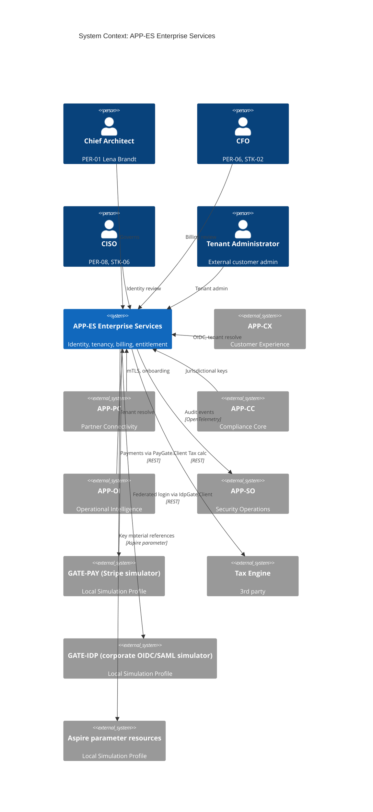
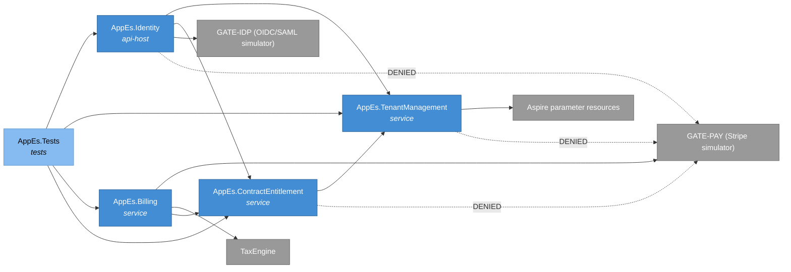
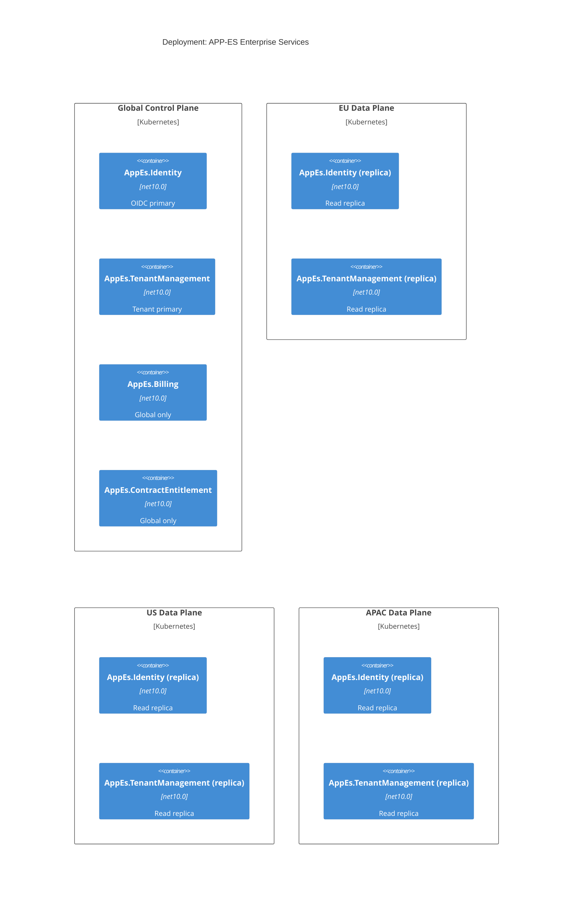
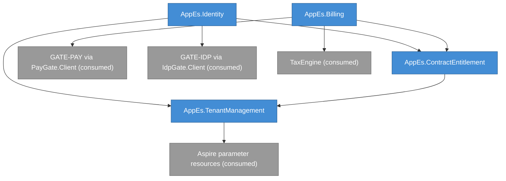
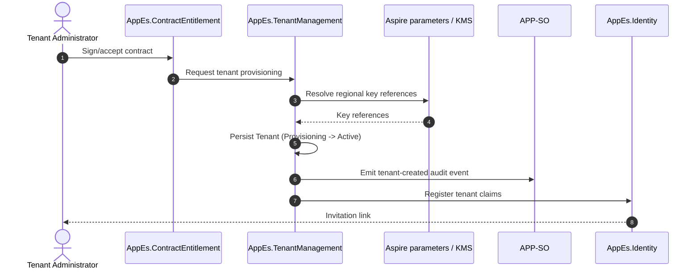
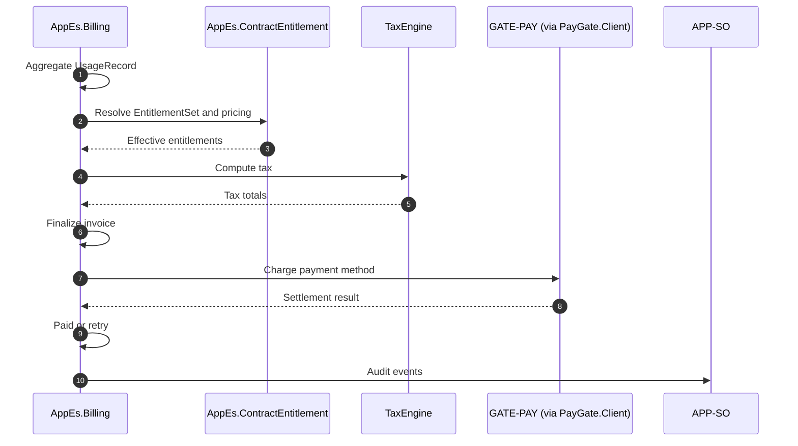

# APP-ES Enterprise Services -- System Specification

## Tracking

| Field | Value |
|---|---|
| slug | app-es-enterprise-services |
| itemType | SystemSpec |
| name | APP-ES Enterprise Services |
| version | 2 |
| specLangVersion | 0.1.0 |
| publishStatus | Draft |
| retentionPolicy | indefinite |
| freshnessSla | P180D |
| lastReviewed | 2026-04-18 |
| authors | [PER-01 Lena Brandt] |
| reviewers | [PER-04 Daniel Park, PER-06 Priya Raman, PER-08 Chioma Okafor, PER-11 Anja Petersen] |
| committer | PER-01 Lena Brandt |
| tags | [subsystem, platform-foundation, identity, billing, tenancy, app-es, local-simulation-first, aspire] |
| createdAt | 2026-04-17T00:00:00Z |
| updatedAt | 2026-04-18T00:00:00Z |
| Dependencies | global-corp.manifest.md, global-corp.architecture.spec.md, aspire-apphost.spec.md, service-defaults.spec.md |
| Profile | BTABOK |
| profileVersion | 0.1.0 |
| codlVersion | 0.2 |
| cadlVersion | 0.1 |

## Purpose and Scope

APP-ES Enterprise Services is the shared-platform foundation of the Global Corp. platform. It owns identity, tenancy, billing, and contract and entitlement management for every other application domain. It is owned by PER-01 Lena Brandt (Chief Architect, Zurich), with security review from PER-04 and PER-08, and financial review from PER-06. Approval sits with the Enterprise Architecture Review Board chaired by PER-11.

APP-ES exists because authentication, tenant isolation, subscription billing, and commercial entitlements are cross-cutting primitives. Exemplar Section 15.3 states plainly that Enterprise Services are shared platform primitives and are not buried inside product modules. Every customer-facing domain (APP-CX), every partner domain (APP-PC), and every operational domain (APP-OI, APP-TC, APP-CC, APP-SD, APP-DP, APP-SO) receives identity, tenant scope, and entitlement decisions from APP-ES. Commercial obligations described by PartnerContract (ENT-19) are mastered here.

Out of scope for APP-ES: canonical events (APP-EB, APP-TC), compliance evidence (APP-CC), operational intelligence (APP-OI), customer portals and notifications (APP-CX), partner protocol adapters (APP-PC), DPP assembly (APP-SD), data platform (APP-DP), and security operations telemetry (APP-SO). APP-ES is foundational and deliberately minimal: it exposes identity tokens, tenant descriptors, billing accounts, and entitlement queries. It does not hold domain data.

### Local Simulation Profile Note

APP-ES runs under the `GlobalCorp.AppHost` Aspire project in the Local Simulation Profile. The AppHost composes the APP-ES projects, the three regional PostgreSQL containers (`pg-eu`, `pg-us`, `pg-apac`), and the gate simulators that APP-ES depends on (`GATE-PAY`, `GATE-IDP`). Connection strings, health checks, and OpenTelemetry wiring flow from Aspire into each APP-ES project via `WithReference` and the shared `GlobalCorp.ServiceDefaults` library.

Per Constraint 2 (cloud-deployable code), the Cloud Production Profile is preserved as a configuration swap: the same code paths used in Local Simulation target real external endpoints (Stripe, corporate IdPs, cloud KMS) when environment configuration is changed. No rewrites are required to activate the Cloud Production Profile later; composition changes and configuration values differ, code does not.

## Context

```spec
person ChiefArchitect {
    description: "PER-01 Lena Brandt, owner of APP-ES and of the
                  enterprise architecture coherence remit.";
    @tag("internal", "architect", "PER-01", "STK-05");
}

person CFO {
    description: "PER-06 Priya Raman, STK-02. Reviews billing
                  configuration, pricing posture, and usage
                  metering outcomes.";
    @tag("internal", "executive", "STK-02");
}

person CISO {
    description: "PER-08 Chioma Okafor, STK-06. Reviews identity,
                  tenant isolation, and key management posture.";
    @tag("internal", "executive", "STK-06");
}

person ChiefArchitectSecurity {
    description: "PER-04 Daniel Park, Chief Architect of Security.
                  Co-owns identity design with PER-01.";
    @tag("internal", "architect", "PER-04");
}

person PlatformSreLead {
    description: "PER-20 Aleksandr Volkov, operates APP-ES as
                  part of the control-plane platform.";
    @tag("internal", "operator", "PER-20");
}

person TenantAdministrator {
    description: "External customer administrator who manages
                  users, entitlements, and billing contacts for
                  their tenant.";
    @tag("external", "customer-admin");
}

external system AppCx {
    description: "APP-CX Customer Experience. Calls APP-ES for
                  sign-in, tenant resolution, and webhook signing
                  key lookup.";
    technology: "OIDC, REST/HTTPS";
    @tag("internal-domain", "APP-CX");
}

external system AppPc {
    description: "APP-PC Partner Connectivity. Calls APP-ES for
                  partner authentication, certificate status, and
                  entitlement on onboarding.";
    technology: "mTLS, REST/HTTPS";
    @tag("internal-domain", "APP-PC");
}

external system AppCc {
    description: "APP-CC Compliance Core. Calls APP-ES to resolve
                  jurisdictional tenancy and to access regional
                  signing keys for evidence bundles.";
    technology: "REST/HTTPS";
    @tag("internal-domain", "APP-CC");
}

external system AppOi {
    description: "APP-OI Operational Intelligence. Calls APP-ES
                  for tenant scope when resolving exception
                  ownership.";
    technology: "REST/HTTPS";
    @tag("internal-domain", "APP-OI");
}

external system AppSo {
    description: "APP-SO Security and Operations. Consumes
                  APP-ES audit events through OpenTelemetry. In
                  the Local Simulation Profile APP-SO's
                  observability surface is the Aspire Dashboard;
                  a cloud OTLP collector and SIEM are Cloud
                  Production Profile concerns. APP-SO does not
                  mutate APP-ES state.";
    technology: "OpenTelemetry, REST/HTTPS";
    @tag("internal-domain", "APP-SO");
}

external system PaymentProcessor {
    description: "Third-party payment processor (Stripe) used by
                  billing for subscription charges and invoices.
                  Reached through GATE-PAY in the Local Simulation
                  Profile and through the real Stripe endpoint in
                  the Cloud Production Profile via configuration
                  swap (Constraint 2).";
    technology: "REST/HTTPS";
    @tag("external", "payment");
}

external system TaxEngine {
    description: "Third-party tax calculation engine used during
                  invoice finalization.";
    technology: "REST/HTTPS";
    @tag("external", "tax");
}

external system GatePay {
    description: "GATE-PAY Stripe simulator. Docker-hosted, Stub /
                  Record / Replay / FaultInject modes. Consumed by
                  AppEs.Billing in the Local Simulation Profile.";
    technology: "REST/HTTPS (PayGate.Client)";
    @tag("external", "gate", "GATE-PAY");
}

external system GateIdp {
    description: "GATE-IDP external OIDC and SAML simulator.
                  Docker-hosted, Stub / Record / Replay /
                  FaultInject modes. Used by AppEs.Identity to
                  stand in for customer corporate IdPs during
                  federated-login testing in the Local Simulation
                  Profile.";
    technology: "REST/HTTPS (IdpGate.Client)";
    @tag("external", "gate", "GATE-IDP");
}

external system AspireParameterResources {
    description: "Aspire parameter resources supplying key material
                  references and other secrets during Local
                  Simulation. Replaced by a cloud KMS or Key Vault
                  through configuration in the Cloud Production
                  Profile.";
    technology: "Aspire parameter resource";
    @tag("platform", "aspire");
}

TenantAdministrator -> AppEs.TenantManagement {
    description: "Manages tenant users, entitlements, and
                  webhook signing key lifecycle.";
    technology: "HTTPS";
}

ChiefArchitect -> AppEs {
    description: "Governs APP-ES design and approves structural
                  changes to tenant isolation.";
    technology: "HTTPS";
}

CFO -> AppEs.Billing {
    description: "Reviews subscription, usage, and invoice
                  reports.";
    technology: "HTTPS";
}

CISO -> AppEs.Identity {
    description: "Reviews identity posture, MFA enrollment, and
                  audit coverage.";
    technology: "HTTPS";
}

AppCx -> AppEs.Identity {
    description: "OIDC sign-in and token introspection for
                  customer users.";
    technology: "OIDC";
}

AppCx -> AppEs.TenantManagement {
    description: "Resolves tenant scope, region, and webhook
                  signing keys.";
    technology: "REST/HTTPS";
}

AppCx -> AppEs.ContractEntitlement {
    description: "Checks feature entitlements before rendering
                  UI elements.";
    technology: "REST/HTTPS";
}

AppPc -> AppEs.Identity {
    description: "Partner authentication via mTLS and OAuth
                  client-credentials.";
    technology: "mTLS, OAuth 2.1";
}

AppPc -> AppEs.ContractEntitlement {
    description: "Resolves partner certification status and
                  entitlements at onboarding (supports CTR-05).";
    technology: "REST/HTTPS";
}

AppCc -> AppEs.TenantManagement {
    description: "Resolves jurisdictional tenant descriptors and
                  regional signing key references.";
    technology: "REST/HTTPS";
}

AppOi -> AppEs.TenantManagement {
    description: "Resolves tenant ownership for exception
                  routing.";
    technology: "REST/HTTPS";
}

AppEs.Billing -> GatePay {
    description: "Charges subscriptions and records invoice
                  settlement through GATE-PAY in the Local
                  Simulation Profile. Configuration swap targets
                  the real Stripe endpoint in the Cloud
                  Production Profile.";
    technology: "REST/HTTPS (PayGate.Client)";
}

AppEs.Billing -> TaxEngine {
    description: "Computes invoice tax under jurisdictional
                  rules.";
    technology: "REST/HTTPS";
}

AppEs.Identity -> GateIdp {
    description: "Federates to simulated corporate OIDC and SAML
                  identity providers via GATE-IDP in the Local
                  Simulation Profile. Configuration swap targets
                  the real customer IdPs in the Cloud Production
                  Profile.";
    technology: "REST/HTTPS (IdpGate.Client)";
}

AppEs.TenantManagement -> AspireParameterResources {
    description: "Resolves tenant-scoped key material references
                  from Aspire parameter resources in the Local
                  Simulation Profile. In the Cloud Production
                  Profile, the same references resolve to regional
                  KMS instances through configuration.";
    technology: "Aspire parameter resource";
}

AppEs -> AppSo {
    description: "Emits identity and tenant audit events over
                  OpenTelemetry. In the Local Simulation Profile
                  these surface in the Aspire Dashboard through
                  APP-SO's collector.";
    technology: "OpenTelemetry/HTTPS";
}
```

Rendered system context:



## System Declaration

```spec
system AppEs {
    target: "net10.0";
    responsibility: "Shared platform foundation for identity,
                     tenancy, billing, and commercial contracts
                     and entitlements. Hosts OpenIddict in-process
                     as the platform OIDC server. Serves every
                     other application domain. Maintains the
                     tenant-to-region directory (gc_tenant ->
                     region) consumed by APP-EB, APP-TC, APP-CC,
                     and APP-DP for regional routing. Depends on
                     GATE-PAY for billing in the Local Simulation
                     Profile and on GATE-IDP for federated-login
                     testing. Holds no event, graph, compliance,
                     or partner-protocol data.";

    authored component AppEs.Identity {
        kind: "api-host";
        path: "src/AppEs.Identity";
        status: new;
        responsibility: "In-process OpenIddict OIDC server for
                         customers, partners, and internal
                         services. Runs inside the AppEs.Api
                         process (not a separate cloud IDP).
                         Configured with
                         AllowAuthorizationCodeFlow() and
                         RequireProofKeyForCodeExchange() for
                         Blazor WebAssembly standalone clients.
                         Registers standard scopes (openid,
                         profile, email) and Global Corp scopes
                         (gc.shipments.read, gc.shipments.write,
                         gc.compliance.export, gc.tenant.admin,
                         gc.partner.onboard, gc.dpp.publish,
                         gc.audit.access). Issues access and
                         refresh tokens carrying custom claims
                         gc_tenant and gc_role resolved at
                         issuance. Supports optional passkey
                         authentication per the 2026 OpenIddict
                         release line. Federates to external
                         corporate IdPs through IdpGate.Client in
                         the Local Simulation Profile and through
                         real OIDC/SAML connections in the Cloud
                         Production Profile via configuration.";
        contract {
            guarantees "Every issued token carries tenant, region,
                        subject, and entitlement-set claims
                        resolved at issuance.";
            guarantees "Token issuance is logged as an immutable
                        audit event consumed by APP-SO.";
            guarantees "MFA is required for interactive customer
                        administrator sessions and for all
                        internal operator sessions.";
        }

        rationale {
            context "Identity is the primary enforcement point
                     for tenant isolation and regional routing.
                     Leaving claim resolution to each consuming
                     domain produced drift and misrouted reads
                     in prior incidents. The Local Simulation
                     Profile also needs an identity provider that
                     runs on a developer workstation without a
                     cloud dependency (Constraint 1).";
            decision "AppEs.Identity hosts OpenIddict in-process
                      inside the AppEs.Api project. Authorization
                      Code Flow with PKCE is the only interactive
                      flow. gc_tenant and gc_role custom claims
                      plus the Global Corp scope set are resolved
                      at token issuance. Downstream domains
                      validate JWTs through
                      GlobalCorp.ServiceDefaults and enforce the
                      claims without re-resolving. Client
                      registrations are applied statically at
                      startup (open item 16.4, static-for-dev
                      option).";
            consequence "A single identity surface covers both
                         the Local Simulation Profile and the
                         Cloud Production Profile. Swapping to a
                         real customer IdP is a configuration
                         change (IdpGate.Client becomes a real
                         OIDC/SAML connection). Token renewal
                         propagates tenant and region changes
                         without per-domain code edits.";
        }

        authentication_pattern {
            reference "Global-Corp-Platform-Implementation-Brief.md
                       Section 7 (Authentication Pattern) and
                       Appendix B for the concrete OpenIddict
                       server setup sketch.";
            surface "AuthorizeEndpoint at connect/authorize,
                     TokenEndpoint at connect/token,
                     UserInfoEndpoint at connect/userinfo, all
                     served from the AppEs.Identity ASP.NET Core
                     host.";
            flow "AllowAuthorizationCodeFlow() +
                  RequireProofKeyForCodeExchange().";
            scopes "openid, profile, email, gc.shipments.read,
                    gc.shipments.write, gc.compliance.export,
                    gc.tenant.admin, gc.partner.onboard,
                    gc.dpp.publish, gc.audit.access.";
            claims "gc_tenant and gc_role are custom claims
                    minted at issuance by the EntitlementSet
                    resolver.";
            passkey "Optional; enabled through
                     OpenIddict EnablePasskeys() per the 2026
                     OpenIddict releases. Passkey support is a
                     stretch goal for v0.1 (open item 16.5).";
            client_registration "Static at application startup
                                 for the known Blazor WebAssembly
                                 portals (app-cx-portal and any
                                 additional tenant portals).
                                 Dynamic registration is deferred.";
        }
    }

    authored component AppEs.TenantManagement {
        kind: "service";
        path: "src/AppEs.TenantManagement";
        status: new;
        responsibility: "Masters Tenant records, tenant-user
                         membership, tenant region assignment,
                         and tenant-scoped signing and encryption
                         key references. Owns the tenant-to-region
                         directory (gc_tenant -> region) that
                         downstream subsystems (APP-EB, APP-TC,
                         APP-CC, APP-DP) consult to route reads
                         and writes to pg-eu, pg-us, or pg-apac.
                         Resolves key-material references through
                         Aspire parameter resources in the Local
                         Simulation Profile; the same references
                         resolve to cloud KMS instances in the
                         Cloud Production Profile via
                         configuration.";
        contract {
            guarantees "Every Tenant has exactly one assigned
                        region at any time. Region changes are
                        versioned and require CISO approval.";
            guarantees "Tenant-scoped key references are regional;
                        no key material is copied across regions
                        (INV-06).";
            guarantees "The tenant-to-region directory is
                        authoritative: downstream subsystems
                        treat AppEs.TenantManagement as the single
                        source of truth for gc_tenant -> region
                        resolution.";
            guarantees "Tenant deletion is soft and retains a
                        tombstone for audit retention; hard
                        delete requires a waiver with CISO and
                        Compliance approval.";
        }

        rationale {
            context "Tenant isolation is the single most
                     load-bearing invariant of the platform.
                     Region assignment must not drift silently,
                     and keys must not replicate across regions.
                     The Local Simulation Profile simulates three
                     regional data planes with pg-eu, pg-us, and
                     pg-apac containers, which need a consistent
                     source for tenant routing.";
            decision "Region is a first-class property of Tenant.
                      Key material references resolve through
                      Aspire parameter resources in dev and
                      through cloud KMS in production, with no
                      code-level difference. AppEs.TenantManagement
                      publishes the gc_tenant -> region directory
                      as a REST surface and as claim seed input
                      for AppEs.Identity.";
            consequence "Realizes ASR-03 at the platform root.
                         ASD-03 regional data planes are fed by a
                         tenant model that already understands
                         region. Cloud-KMS adoption becomes a
                         configuration change rather than a
                         rewrite (Constraint 2).";
        }
    }

    authored component AppEs.Billing {
        kind: "service";
        path: "src/AppEs.Billing";
        status: new;
        responsibility: "Subscription management, usage metering
                         aggregation, invoice generation, and
                         payment orchestration. Consumes usage
                         signals from other domains over a
                         metering API. Calls the external payment
                         processor through PayGate.Client: the
                         client targets GATE-PAY (the Stripe
                         simulator) in the Local Simulation
                         Profile and the real Stripe endpoint in
                         the Cloud Production Profile. The swap
                         is a configuration change per
                         Constraint 2; billing code does not
                         change between profiles. Tax totals are
                         computed through the tax-engine client.";
        contract {
            guarantees "Every BillingAccount belongs to exactly
                        one Organization (ENT-01) and references
                        one or more Tenant records.";
            guarantees "Usage events posted to the metering API
                        are idempotent by (tenant, meter, source,
                        externalId).";
            guarantees "Invoices are immutable once finalized;
                        adjustments create credit or debit notes
                        rather than editing past invoices.";
            guarantees "Payment orchestration goes through
                        PayGate.Client. The client respects the
                        GATE-PAY mode selector (Stub, Record,
                        Replay, FaultInject) so billing tests can
                        exercise retries, declined cards, and
                        gateway outages without touching a real
                        payment processor.";
        }

        rationale {
            context "Billing mutability is a classic source of
                     audit ambiguity. Editing historical invoices
                     even for minor corrections erodes trust with
                     the CFO organization and external auditors.
                     The Local Simulation Profile also requires
                     that billing run on a developer workstation
                     without a Stripe account (Constraint 1).";
            decision "Invoices are append-only. Credit and debit
                      notes are first-class records linked to
                      their source invoice. PayGate.Client is the
                      single payment-client abstraction; it is
                      registered in the DI container, and a
                      configuration flag chooses between the
                      GATE-PAY base URL and the real Stripe base
                      URL (Constraint 2).";
            consequence "CTR-based commercial reporting (supports
                         CAP-OUT-01 Outcome Measurement) stays
                         reconstructable from persisted records.
                         End-to-end billing tests run fully
                         inside Aspire without external
                         dependencies.";
        }
    }

    authored component AppEs.ContractEntitlement {
        kind: "service";
        path: "src/AppEs.ContractEntitlement";
        status: new;
        responsibility: "Masters PartnerContract (ENT-19) and
                         customer commercial contracts. Resolves
                         EntitlementSet for a tenant or partner
                         at a point in time. Feeds identity claim
                         resolution and partner onboarding
                         (CTR-05).";
        contract {
            guarantees "Every PartnerContract has an effective
                        date range and a versioned EntitlementSet.
                        Retroactive edits are rejected; new
                        versions supersede.";
            guarantees "Entitlement resolution is deterministic:
                        given (tenant|partner, timestamp) the
                        resolved EntitlementSet is stable.";
            guarantees "Partner certification status used by
                        CTR-05 PartnerOnboard is served only from
                        this component; no other domain masters
                        it.";
        }

        rationale {
            context "Commercial terms and technical entitlements
                     drift apart in systems that master them in
                     different domains. The result is features
                     turned on for tenants whose contracts do
                     not authorize them, or vice versa.";
            decision "One component masters both commercial
                      contract versioning and feature-level
                      entitlements. Identity reads from here.";
            consequence "Feature entitlement, partner
                         certification, and commercial contract
                         terms stay in lockstep.";
        }
    }

    authored component AppEs.Tests {
        kind: tests;
        path: "tests/AppEs.Tests";
        status: new;
        responsibility: "Unit and integration tests covering
                         identity token issuance, tenant region
                         assignment and key isolation, billing
                         idempotency and invoice immutability,
                         and entitlement resolution determinism.";
    }

    consumed component AspNetCore {
        source: nuget("Microsoft.AspNetCore.App");
        version: "10.*";
        responsibility: "Web host for identity, tenant, billing,
                         and entitlement APIs.";
        used_by: [AppEs.Identity, AppEs.TenantManagement, AppEs.Billing, AppEs.ContractEntitlement];
    }

    consumed component OpenIddict {
        source: nuget("OpenIddict.AspNetCore");
        version: "6.*";
        responsibility: "OAuth 2.1 / OIDC server primitives.
                         Hosted in-process by AppEs.Identity
                         (Authorization Code flow with PKCE,
                         static client registration at startup,
                         optional passkey support).";
        used_by: [AppEs.Identity];
    }

    consumed component GlobalCorp.ServiceDefaults {
        kind: library;
        source: project("GlobalCorp.ServiceDefaults");
        responsibility: "Cross-cutting defaults: OpenTelemetry,
                         resilience, service discovery, JWT
                         bearer validation, health checks.";
        used_by: [AppEs.Identity, AppEs.TenantManagement, AppEs.Billing, AppEs.ContractEntitlement];
    }

    consumed component PayGate.Client {
        kind: library;
        source: project("PayGate.Client");
        responsibility: "Stripe-compatible payment client.
                         Targets GATE-PAY in the Local Simulation
                         Profile and the real Stripe endpoint in
                         the Cloud Production Profile via
                         configuration (Constraint 2). Reused
                         from src/MCPServer/DotNet/Docs/Specs/
                         PayGate.spec.md.";
        used_by: [AppEs.Billing];
    }

    consumed component IdpGate.Client {
        kind: library;
        source: project("IdpGate.Client");
        responsibility: "Client for GATE-IDP, the external-IdP
                         simulator. Used by AppEs.Identity in the
                         Local Simulation Profile to exercise
                         federated OIDC and SAML flows for
                         customer organizations. The same client
                         surface targets real customer IdPs in
                         the Cloud Production Profile via
                         configuration.";
        used_by: [AppEs.Identity];
    }

    consumed component AspireParameterResource {
        kind: platform;
        source: aspire("parameter-resource");
        responsibility: "Supplies key-material references and
                         other secrets to AppEs.TenantManagement
                         in the Local Simulation Profile. The
                         same references resolve to cloud KMS in
                         the Cloud Production Profile via
                         configuration.";
        used_by: [AppEs.TenantManagement];
    }

    package_policy weakRef<PackagePolicy>(GlobalCorpPolicy) {
        rationale {
            context "The enterprise NuGet policy is authored in
                     Section 8 of global-corp.architecture.spec.md
                     and covers every Global Corp subsystem.
                     APP-ES does not redeclare the policy; it
                     inherits the allow and deny categories and
                     the require_rationale default.";
            decision "APP-ES adds no subsystem-local NuGet
                      allowances beyond the enterprise policy.
                      OpenIddict.* is already allowed under the
                      auth category; Npgsql is already allowed
                      under storage-drivers; Aspire.* and
                      OpenTelemetry.* are already allowed.";
            consequence "Any new NuGet that APP-ES needs must be
                         proposed against the enterprise policy
                         with a rationale block, not added
                         silently here.";
        }
    }
}
```

## Topology

```spec
topology Dependencies {
    allow AppEs.Identity -> AppEs.TenantManagement;
    allow AppEs.Identity -> AppEs.ContractEntitlement;
    allow AppEs.Identity -> GateIdp;
    allow AppEs.TenantManagement -> AspireParameterResources;
    allow AppEs.Billing -> GatePay;
    allow AppEs.Billing -> TaxEngine;
    allow AppEs.Billing -> AppEs.ContractEntitlement;
    allow AppEs.ContractEntitlement -> AppEs.TenantManagement;
    allow AppEs.Tests -> AppEs.Identity;
    allow AppEs.Tests -> AppEs.TenantManagement;
    allow AppEs.Tests -> AppEs.Billing;
    allow AppEs.Tests -> AppEs.ContractEntitlement;

    deny AppEs.* -> AppEb;
    deny AppEs.* -> AppTc;
    deny AppEs.* -> AppOi;
    deny AppEs.* -> AppCc;
    deny AppEs.* -> AppSd;
    deny AppEs.* -> AppDp;
    deny AppEs.Identity -> GatePay;
    deny AppEs.TenantManagement -> GatePay;
    deny AppEs.ContractEntitlement -> GatePay;

    invariant "enterprise services are foundational":
        AppEs.* does not depend on any product application domain;

    invariant "only billing calls payment gate":
        only AppEs.Billing references GatePay, TaxEngine;

    invariant "only identity calls idp gate":
        only AppEs.Identity references GateIdp;

    rationale {
        context "APP-ES must not depend on product-domain
                 applications. Any such dependency would invert
                 the platform: foundational primitives would hang
                 on downstream concerns.";
        decision "Deny all outbound edges from APP-ES into
                  product domains. APP-ES receives inbound calls
                  and emits audit events; it does not pull from
                  APP-EB, APP-TC, APP-OI, APP-CC, APP-SD, or
                  APP-DP.";
        consequence "APP-ES can be versioned, operated, and
                     recovered independently. Every product
                     domain has one unambiguous foundation to
                     build on.";
    }
}
```

Rendered topology:



## Data

```spec
entity Organization {
    id: string;
    legalName: string;
    jurisdiction: string;
    createdAt: string;
    status: string;

    invariant "id required": id != "";
    invariant "legal name required": legalName != "";
    invariant "jurisdiction recorded": jurisdiction != "";
    invariant "status known": status in ["Active", "Suspended", "Terminated"];

    rationale "canonical alignment" {
        context "Exemplar ENT-01 defines Organization as a legal
                 entity participating in shipments. APP-ES
                 masters the identity side of Organization;
                 shipment relationships live in APP-TC.";
        decision "Organization here is a commercial and
                  identity-bearing record only. Shipment graph
                  edges are not held in APP-ES.";
        consequence "APP-ES remains foundational. APP-TC remains
                     the master of operational relationships.";
    }
}

entity Tenant {
    id: string;
    organizationId: string;
    name: string;
    region: string;
    isolationLevel: string;
    encryptionKeyRef: string;
    signingKeyRef: string;
    status: string;
    createdAt: string;

    invariant "organization reference required": organizationId != "";
    invariant "region recorded": region in ["EU", "US", "APAC", "MEA", "LATAM"];
    invariant "isolation level known": isolationLevel in ["logical", "physical"];
    invariant "encryption key in region": encryptionKeyRef startsWith region;
    invariant "signing key in region": signingKeyRef startsWith region;
    invariant "status known": status in ["Provisioning", "Active", "Suspended", "Terminated"];
}

entity TenantUser {
    id: string;
    tenantId: string;
    subject: string;
    email: string;
    mfaEnrolled: boolean;
    rolesRef: string;
    status: string;

    invariant "tenant reference required": tenantId != "";
    invariant "subject required": subject != "";
    invariant "status known": status in ["Invited", "Active", "Disabled"];
}

entity EntitlementSet {
    id: string;
    version: int;
    features: string;
    effectiveFrom: string;
    effectiveTo: string?;

    invariant "features non-empty": features != "";
    invariant "version monotonic": version >= 1;
    invariant "range valid": effectiveTo == null or effectiveTo > effectiveFrom;
}

entity BillingAccount {
    id: string;
    organizationId: string;
    currency: string;
    billingContactEmail: string;
    paymentMethodRef: string?;
    status: string;

    invariant "organization reference required": organizationId != "";
    invariant "currency known": currency in ["USD", "EUR", "GBP", "JPY", "SGD", "CHF"];
    invariant "status known": status in ["Active", "PastDue", "Suspended", "Closed"];
}

entity UsageRecord {
    id: string;
    tenantId: string;
    meter: string;
    quantity: int;
    periodStart: string;
    periodEnd: string;
    externalId: string;

    invariant "tenant reference required": tenantId != "";
    invariant "non-negative quantity": quantity >= 0;
    invariant "period valid": periodEnd >= periodStart;
    invariant "external id required for idempotency": externalId != "";
}

entity Invoice {
    id: string;
    billingAccountId: string;
    currency: string;
    subtotal: int;
    tax: int;
    total: int;
    periodStart: string;
    periodEnd: string;
    status: string;
    finalizedAt: string?;

    invariant "billing account required": billingAccountId != "";
    invariant "status known": status in ["Draft", "Finalized", "Paid", "Void"];
    invariant "total consistent": total == subtotal + tax;
    invariant "finalized implies timestamp":
        status in ["Finalized", "Paid", "Void"] implies finalizedAt != null;

    rationale "immutability" {
        context "Finalized invoices are audit objects. Edits
                 after finalization are a common source of
                 dispute.";
        decision "Invoices transition through Draft then
                  Finalized then Paid or Void. No field on a
                  Finalized or later invoice is mutable except
                  the terminal status.";
        consequence "Corrections are expressed as CreditNote
                     records, not in-place edits.";
    }
}

entity CreditNote {
    id: string;
    invoiceId: string;
    amount: int;
    reason: string;
    issuedAt: string;

    invariant "invoice reference required": invoiceId != "";
    invariant "positive amount": amount > 0;
    invariant "reason required": reason != "";
}

entity PartnerContract {
    id: string;
    organizationId: string;
    effectiveFrom: string;
    effectiveTo: string?;
    certificationStatus: string;
    entitlementSetRef: string;
    mappingPackRef: string?;

    invariant "organization required": organizationId != "";
    invariant "certification status known":
        certificationStatus in ["Pending", "Certified", "Revoked", "Expired"];
    invariant "entitlement set reference required": entitlementSetRef != "";
}

consumed entity OrganizationCanonical {
    source: AppTc;
    canonical: ENT-01;
    access: read-only;
    responsibility: "APP-TC holds the operational view of
                     Organization. APP-ES masters the identity
                     and commercial view. Joins happen at the
                     manifest level, not by copy.";
}
```

## Contracts

```spec
contract EsIssueToken {
    requires credentials are valid for subject;
    requires subject is active;
    ensures token.tenantId != "";
    ensures token.region != "";
    guarantees "Issues an OAuth 2.1 access token carrying
                tenant, region, subject, and entitlement-set
                claims. Interactive customer-admin sessions
                require MFA. Partner tokens require a valid
                mTLS chain.";
}

contract EsResolveTenant {
    requires tenantId != "";
    ensures tenant.region != "";
    ensures tenant.status in ["Provisioning", "Active", "Suspended"];
    guarantees "Returns the Tenant record including region,
                isolation level, and key references. Returns 404
                for Terminated tenants regardless of internal
                tombstone retention.";
}

contract EsResolveEntitlement {
    requires subjectRef != "";
    requires timestamp != null;
    ensures response.entitlementSetId != "";
    guarantees "Returns the EntitlementSet effective for the
                subject at the given timestamp. Result is
                deterministic: repeated calls with the same
                (subjectRef, timestamp) return the same set.";
}

contract EsRecordUsage {
    requires tenant is Active;
    requires externalId != "";
    ensures record.id != "";
    guarantees "Appends a UsageRecord idempotently. A second
                call with the same (tenant, meter, source,
                externalId) returns the original record and does
                not create a duplicate.";
}

contract EsFinalizeInvoice {
    requires invoice.status == "Draft";
    requires periodEnd <= now;
    ensures invoice.status == "Finalized";
    ensures invoice.finalizedAt != null;
    guarantees "Finalizes a draft invoice. After finalization,
                no field mutates except transitions to Paid or
                Void. Corrections produce CreditNote records.";
}

contract EsIssueCreditNote {
    requires invoice.status in ["Finalized", "Paid"];
    requires amount > 0;
    ensures creditNote.id != "";
    guarantees "Issues a CreditNote linked to the specified
                invoice. The original invoice is not mutated.";
}

contract EsCertifyPartner {
    requires partnerContract.id != "";
    requires mappingPack is validated;
    ensures partnerContract.certificationStatus == "Certified";
    guarantees "Marks the PartnerContract certified. This
                contract realizes the APP-ES side of CTR-05
                PartnerOnboard.";
}

weakRef contract CTR-05-PartnerOnboard {
    description: "Canonical partner onboarding contract owned by
                  APP-PC. APP-ES supplies the certification and
                  entitlement side.";
}
```

## Invariants

```spec
invariant EsTenantRegionStable {
    scope: [AppEs.TenantManagement];
    rule: "A Tenant's region is assigned at provisioning and
           does not change silently. Region change requires a
           versioned transition with CISO approval.";
}

invariant EsKeyLocality {
    scope: [AppEs.TenantManagement];
    rule: "Tenant-scoped encryption and signing key references
           resolve to regionally scoped material: Aspire
           parameter resources in the Local Simulation Profile
           and cloud KMS in the Cloud Production Profile. No key
           material is replicated across regions. Realizes
           INV-06 for the platform foundation.";
    weakRef invariant: INV-06;
}

invariant EsInvoiceImmutability {
    scope: [AppEs.Billing];
    rule: "Finalized invoices are immutable except for terminal
           status transitions. Corrections flow through
           CreditNote records.";
}

invariant EsUsageIdempotency {
    scope: [AppEs.Billing];
    rule: "UsageRecord is idempotent by (tenant, meter, source,
           externalId). Double-posting does not inflate usage.";
}

invariant EsEntitlementDeterminism {
    scope: [AppEs.ContractEntitlement];
    rule: "Entitlement resolution at (subjectRef, timestamp) is
           deterministic. New contract versions supersede rather
           than rewrite.";
}

invariant EsAuditCoverage {
    scope: [AppEs.Identity, AppEs.TenantManagement, AppEs.Billing, AppEs.ContractEntitlement];
    rule: "Every state change emits an audit event consumed by
           APP-SO. Silent changes are prohibited.";
}
```

## Deployment

### Local Simulation Profile (primary)

```spec
deployment AppEsLocal {
    profile: "Local Simulation";
    orchestrator: "GlobalCorp.AppHost (Aspire 13.2.x)";

    node "Aspire AppHost" {
        technology: ".NET 10, Aspire 13.2.x";
        instance: "GlobalCorp.AppHost launches AppEs.Api, which
                   hosts AppEs.Identity, AppEs.TenantManagement,
                   AppEs.Billing, and AppEs.ContractEntitlement
                   in-process.";
        resolves: [pg-eu, pg-us, pg-apac, gate-pay, gate-idp,
                   AspireParameterResources];
        responsibility: "The AppHost resolves connection strings
                         for the three regional PostgreSQL
                         containers via WithReference, wires
                         PayGate.Client and IdpGate.Client to
                         their gate base URLs, and injects
                         OpenTelemetry configuration via
                         GlobalCorp.ServiceDefaults.";
    }

    rationale {
        context "Constraint 1 (local simulation first) and
                 Constraint 3 (Aspire for all .NET orchestration).
                 The developer runs dotnet run against
                 GlobalCorp.AppHost and gets a working APP-ES
                 stack with three regional PostgreSQL containers,
                 GATE-PAY, GATE-IDP, and in-process OpenIddict.";
        decision "APP-ES is a single Aspire project
                  (AppEs.Api) that hosts all four authored
                  components. Regional simulation is provided by
                  three PostgreSQL containers declared in the
                  AppHost. No separate regional deployment is
                  needed in dev.";
        consequence "APP-ES boots end-to-end on a developer
                     workstation without Kubernetes, cloud
                     accounts, or a real Stripe key. Cloud
                     Production Profile is a configuration swap
                     (Constraint 2).";
    }
}
```

### Cloud Production Profile (deferred)

The following multi-region Kubernetes topology is preserved as the intended long-term target. It is deferred. No Cloud Production Profile deployment is implemented in the current scope; this block documents the target composition that an Aspire publish to Azure, AWS, or GCP would produce when cloud activation is authorized.

```spec
deployment AppEsGlobal {
    profile: "Cloud Production (deferred)";
    node "Global Control Plane" {
        technology: "Kubernetes, net10.0";
        instance: AppEs.Identity;
        instance: AppEs.Billing;
        instance: AppEs.ContractEntitlement;
        responsibility: "Identity, billing, and contract and
                         entitlement run as the single
                         authoritative instance per exemplar
                         Section 18.3 mapping. Billing is global
                         because accounting boundaries do not
                         follow region.";
    }

    node "Global Control Plane (TenantManagement primary)" {
        technology: "Kubernetes, net10.0";
        instance: AppEs.TenantManagement;
        responsibility: "Masters Tenant records globally. Feeds
                         read replicas in regional planes.";
    }

    node "EU Data Plane" {
        technology: "Kubernetes, net10.0";
        instance: "AppEs.Identity (read replica)";
        instance: "AppEs.TenantManagement (read replica)";
    }

    node "US Data Plane" {
        technology: "Kubernetes, net10.0";
        instance: "AppEs.Identity (read replica)";
        instance: "AppEs.TenantManagement (read replica)";
    }

    node "APAC Data Plane" {
        technology: "Kubernetes, net10.0";
        instance: "AppEs.Identity (read replica)";
        instance: "AppEs.TenantManagement (read replica)";
    }

    rationale {
        context "Exemplar Section 18.3 explicitly places APP-ES
                 Identity primary on the control plane with read
                 replicas in each region, APP-ES Billing only on
                 the control plane, and leaves TenantManagement
                 and ContractEntitlement implicit.";
        decision "Identity and TenantManagement replicate reads
                  regionally for latency. Billing and
                  ContractEntitlement remain global-only because
                  their write throughput is low and their
                  accounting needs a single authoritative view.";
        consequence "Regional reads stay local. Tenant
                     provisioning and contract signing are global
                     actions; they are infrequent and tolerate
                     global control-plane latency.";
    }
}
```

Rendered deployment:



## Views

```spec
view container of AppEs ContainerView {
    include: all;
    autoLayout: left-right;
    description: "Internal structure of APP-ES: Identity, Tenant
                  Management, Billing, Contract and Entitlement,
                  and Tests. Also shows consumed external
                  systems (KMS, payment, tax).";
}

view dynamic of AppEs TenantProvisioningView {
    description: "Provisioning a new tenant from a signed
                  PartnerContract or customer contract through
                  to key allocation in the regional KMS.";
    @tag("dyn-es-01");
}

view dynamic of AppEs InvoiceFinalizationView {
    description: "Usage aggregation, tax calculation, invoice
                  finalization, and payment orchestration.";
    @tag("dyn-es-02");
}
```

Rendered internal view:



## Dynamics

### DYN-ES-01 Tenant provisioning

```spec
dynamic TenantProvisioning {
    1: TenantAdministrator -> AppEs.ContractEntitlement {
        description: "Signs or accepts a commercial contract
                      that authorizes tenant creation.";
        technology: "HTTPS";
    };
    2: AppEs.ContractEntitlement -> AppEs.TenantManagement {
        description: "Requests tenant provisioning with
                      resolved EntitlementSet and target
                      region.";
        technology: "REST/HTTPS";
    };
    3: AppEs.TenantManagement -> AspireParameterResources {
        description: "Resolves tenant-scoped encryption and
                      signing key references for the target
                      region. In the Local Simulation Profile
                      these come from Aspire parameter resources;
                      in the Cloud Production Profile the same
                      references resolve to cloud KMS instances
                      through configuration.";
        technology: "Aspire parameter resource (dev); KMS API (cloud)";
    };
    4: AppEs.TenantManagement -> AppEs.TenantManagement
        : "Persists Tenant record with region, keys, and
           EntitlementSet reference. Status transitions from
           Provisioning to Active.";
    5: AppEs.TenantManagement -> AppSo {
        description: "Emits tenant-created audit event.";
        technology: "OpenTelemetry/HTTPS";
    };
    6: AppEs.TenantManagement -> AppEs.Identity {
        description: "Notifies identity of the new tenant so
                      subsequent tokens carry its claims.";
        technology: "REST/HTTPS";
    };
    7: AppEs.Identity -> TenantAdministrator {
        description: "Returns an invitation link scoped to the
                      new tenant.";
        technology: "HTTPS";
    };
}
```

Rendered interaction sequence:



### DYN-ES-02 Invoice finalization

```spec
dynamic InvoiceFinalization {
    1: AppEs.Billing -> AppEs.Billing
        : "Aggregates UsageRecord rows for the billing period
           across all tenants in a billing account.";
    2: AppEs.Billing -> AppEs.ContractEntitlement {
        description: "Resolves the EntitlementSet and pricing
                      effective for each tenant during the
                      period.";
        technology: "REST/HTTPS";
    };
    3: AppEs.Billing -> TaxEngine {
        description: "Submits invoice line items for tax
                      calculation under the billing account's
                      jurisdictions.";
        technology: "REST/HTTPS";
    };
    4: AppEs.Billing -> AppEs.Billing
        : "Transitions invoice from Draft to Finalized, sets
           finalizedAt. No further edits allowed.";
    5: AppEs.Billing -> GatePay {
        description: "Charges the recorded payment method through
                      PayGate.Client. Targets GATE-PAY in the
                      Local Simulation Profile and the real
                      Stripe endpoint in the Cloud Production
                      Profile via configuration.";
        technology: "REST/HTTPS (PayGate.Client)";
    };
    6: AppEs.Billing -> AppEs.Billing
        : "Transitions invoice to Paid on successful settlement
           or leaves it Finalized pending retry.";
    7: AppEs.Billing -> AppSo {
        description: "Emits audit events for finalization and
                      settlement outcomes.";
        technology: "OpenTelemetry/HTTPS";
    };
}
```

Rendered interaction sequence:



## BTABOK-profile Traces

```spec
trace AsrCoverage {
    ASR-03 -> [AppEs.TenantManagement, AppEs.Identity];
    ASR-04 -> [AppEs.ContractEntitlement];
    ASR-09 -> [AppEs.TenantManagement, AppEs.ContractEntitlement];

    invariant "every listed ASR has at least one component":
        all sources have count(targets) >= 1;
}

trace AsdCoverage {
    ASD-03 -> [AppEs.TenantManagement, AppEs.Identity];
    ASD-07 -> [AppEs.ContractEntitlement];

    rationale "APP-ES realizes regional data planes (ASD-03) by
               anchoring region to Tenant and by isolating key
               material per region. It carries ASD-07 formal
               waiver process through contract and entitlement
               versioning discipline.";
}

trace PrincipleCoverage {
    P-03 -> [AppEs.Identity, AppEs.TenantManagement];
    P-08 -> [AppEs.ContractEntitlement];
    P-09 -> [AppEs.TenantManagement, AppEs.Identity, AppEs.Billing];
    P-10 -> [AppEs.Identity, AppEs.TenantManagement];
}

trace CapabilityCoverage {
    CAP-ENT-01 -> [AppEs.Identity, AppEs.TenantManagement, AppEs.Billing, AppEs.ContractEntitlement];
    CAP-TAS-01 -> [AppEs.Identity, AppEs.TenantManagement];
    CAP-PAR-01 -> [AppEs.ContractEntitlement];
    CAP-OUT-01 -> [AppEs.Billing];
}

trace EntityCoverage {
    Organization -> [AppEs.Identity, AppEs.TenantManagement, AppEs.Billing, AppEs.ContractEntitlement];
    Tenant -> [AppEs.TenantManagement, AppEs.Identity];
    TenantUser -> [AppEs.Identity, AppEs.TenantManagement];
    EntitlementSet -> [AppEs.ContractEntitlement, AppEs.Identity];
    BillingAccount -> [AppEs.Billing];
    UsageRecord -> [AppEs.Billing];
    Invoice -> [AppEs.Billing];
    CreditNote -> [AppEs.Billing];
    PartnerContract -> [AppEs.ContractEntitlement];
}

trace StakeholderCoverage {
    STK-02 -> [AppEs.Billing];
    STK-05 -> [AppEs.Identity, AppEs.TenantManagement, AppEs.Billing, AppEs.ContractEntitlement];
    STK-06 -> [AppEs.Identity, AppEs.TenantManagement];
}
```

## Cross-references

APP-ES Enterprise Services participates in the Global Corp. architecture through the following cross-collection references. Strong `ref<>` syntax is used when the target concept lives inside the APP-ES collection; `weakRef` is used when the target lives in the parent `global-corp.manifest.md`.

- ASRs: `weakRef<ASRCard>(ASR-03)`, `weakRef<ASRCard>(ASR-04)`, `weakRef<ASRCard>(ASR-09)`.
- ASDs: `weakRef<DecisionRecord>(ASD-03)`, `weakRef<DecisionRecord>(ASD-07)`.
- Principles: `weakRef<PrincipleCard>(P-03)`, `weakRef<PrincipleCard>(P-08)`, `weakRef<PrincipleCard>(P-09)`, `weakRef<PrincipleCard>(P-10)`.
- Capabilities: `weakRef<CapabilityCard>(CAP-ENT-01)`, `weakRef<CapabilityCard>(CAP-TAS-01)`, `weakRef<CapabilityCard>(CAP-PAR-01)`, `weakRef<CapabilityCard>(CAP-OUT-01)`.
- Viewpoints: `weakRef<ViewpointCard>(VP-07)`, `weakRef<ViewpointCard>(VP-08)`, `weakRef<ViewpointCard>(VP-09)`.
- Stakeholders: `weakRef<StakeholderCard>(STK-02)`, `weakRef<StakeholderCard>(STK-05)`, `weakRef<StakeholderCard>(STK-06)`.
- Canonical entities: `weakRef<EntityCard>(ENT-01)`, `weakRef<EntityCard>(ENT-19)`.
- Contracts: `weakRef<ContractCard>(CTR-05)`.
- Invariants: `weakRef<InvariantCard>(INV-05)`, `weakRef<InvariantCard>(INV-06)`.
- Waiver register: `weakRef<WaiverRecord>(WVR-02)` (cross-region metadata replication; intersects APP-ES TenantManagement decisions).
- Personas and ownership: committer `weakRef<PersonCard>(PER-01)`, reviewers `weakRef<PersonCard>(PER-04)`, `weakRef<PersonCard>(PER-06)`, `weakRef<PersonCard>(PER-08)`, `weakRef<PersonCard>(PER-11)`.

## Open Items

- Detailed rotation policy for tenant-scoped signing keys (to be finalized with PER-08 CISO).
- Federation shape for customer-managed identity providers (SAML and external OIDC), deferred to a feature spec under AppEs.Identity.
- Dunning and credit-hold state machine on BillingAccount (to be elaborated in an AppEs.Billing feature spec).
- Usage metering API versioning approach across product domains (requires joint spec with APP-TC and APP-OI owners).
