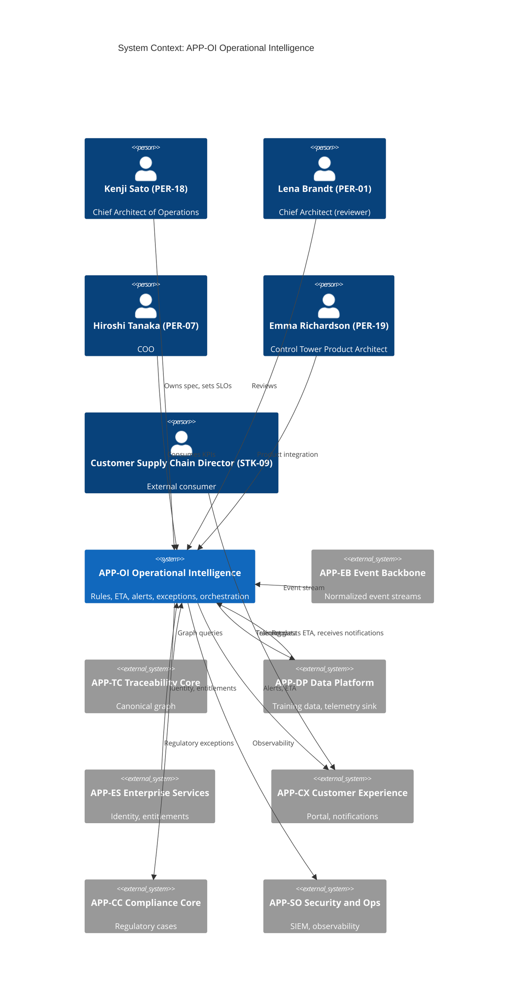
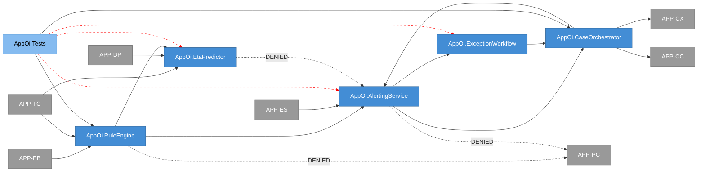
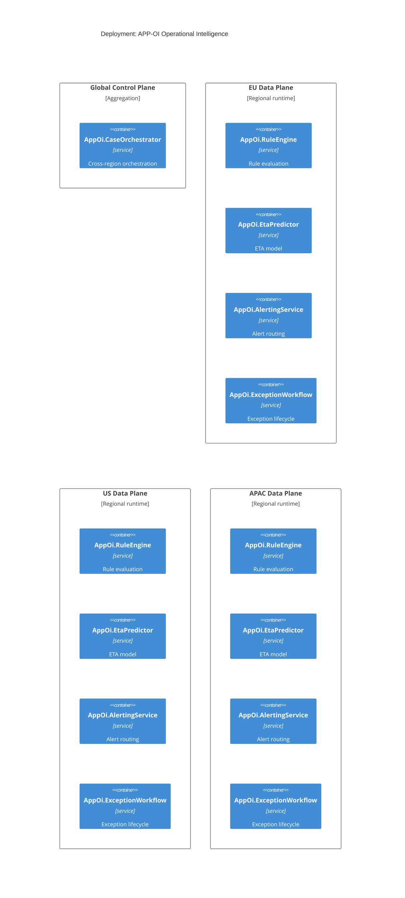
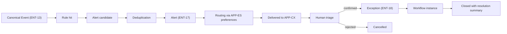
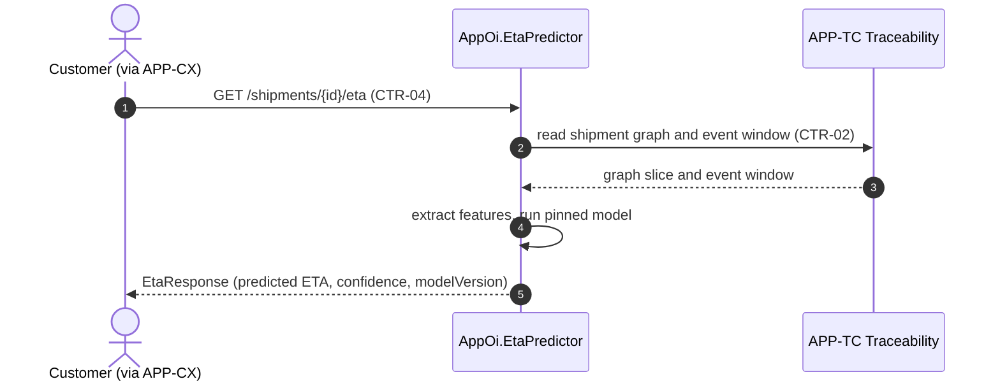
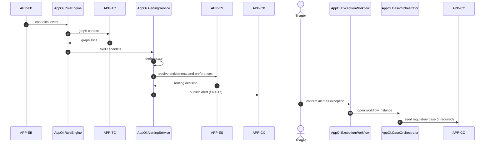

# APP-OI Operational Intelligence -- System Specification

## Tracking

| Field | Value |
|---|---|
| slug | app-oi-operational-intelligence |
| itemType | SystemSpec |
| name | APP-OI Operational Intelligence |
| version | 2 |
| specLangVersion | 0.1.0 |
| publishStatus | Draft |
| retentionPolicy | indefinite |
| freshnessSla | P180D |
| authors | [PER-18 Kenji Sato] |
| reviewers | [PER-01 Lena Brandt] |
| committer | PER-18 Kenji Sato |
| createdAt | 2026-04-17T00:00:00Z |
| updatedAt | 2026-04-18T00:00:00Z |
| Dependencies | global-corp.manifest.md, global-corp.architecture.spec.md, aspire-apphost.spec.md, service-defaults.spec.md |
| Profile | BTABOK |
| profileVersion | 0.1.0 |
| codlVersion | 0.2 |
| cadlVersion | 0.1 |
| tags | [local-simulation-first, aspire] |

## 1. Purpose and Scope

APP-OI Operational Intelligence is the runtime reasoning layer of the Global
Corp. platform. It consumes normalized events from APP-EB Event Backbone and
graph context from APP-TC Traceability Core, applies rule evaluation and
predictive ETA modeling, and emits alerts and exceptions that drive customer
notifications and operational response workflows.

The application is owned by PER-18 Kenji Sato, Chief Architect of Operations,
Singapore. Its primary BTABOK viewpoints are VP-06 Operational and VP-02
Capability. It implements principle P-02 (events are the source of operational
truth) and is the primary realization point for ASR-05 (high-severity
disruptions trigger actionable exceptions within 5 minutes median, 10 minutes
p95).

Scope includes:

- rule evaluation over canonical event streams,
- ETA prediction for shipments at any point in their lifecycle,
- alert generation and routing,
- exception lifecycle management with human confirmation,
- case orchestration across notifications, resolution workflows, and evidence
  linkage.

Out of scope:

- raw partner payload handling (owned by APP-PC),
- canonical graph curation (owned by APP-TC),
- compliance case assembly (owned by APP-CC),
- training-data curation and lakehouse queries (owned by APP-DP).

APP-OI runs under the Aspire AppHost in the Local Simulation Profile as described in `global-corp.architecture.spec.md` Section 11.1. All infrastructure dependencies (Redis Streams, regional PostgreSQL, APP-DP analytics marts) are composed as Aspire resources on the developer workstation. Cloud Production Profile deployment is preserved as a configuration change (Constraint 2); no subsystem code differs between profiles.

## 2. Context Register

```spec
person KenjiSato {
    slug: "per-18-kenji-sato";
    description: "Chief Architect of Operations, Singapore. Owner of APP-OI
                  and sponsor of EXP-03 Multimodal ETA.";
    @tag("architect", "owner");
}

person LenaBrandt {
    slug: "per-01-lena-brandt";
    description: "Chief Architect (enterprise), Zurich. Reviewer for APP-OI.";
    @tag("architect", "reviewer");
}

person HiroshiTanaka {
    slug: "per-07-hiroshi-tanaka";
    description: "COO, Singapore. Approver of ASR-05 and primary business
                  consumer of operational KPIs.";
    @tag("executive", "approver");
}

person EmmaRichardson {
    slug: "per-19-emma-richardson";
    description: "Product Architect, Control Tower, Atlanta. Primary
                  downstream product consumer of APP-OI alerts via APP-CX.";
    @tag("architect", "consumer");
}

person CustomerSupplyChainDirector {
    slug: "stk-09-customer-supply-chain-director";
    description: "External customer stakeholder. Receives ETA responses
                  and exception notifications surfaced through APP-CX.";
    @tag("external", "consumer");
}

external system AppEb {
    slug: "app-eb-event-backbone";
    description: "Event Backbone. Provides normalized event streams for
                  rule evaluation and ETA feature extraction.";
    technology: "event stream, CTR-01";
    @tag("internal", "upstream");
}

external system AppTc {
    slug: "app-tc-traceability-core";
    description: "Traceability Core. Provides canonical shipment and
                  product graph context consulted during rule evaluation
                  and ETA prediction.";
    technology: "graph query, CTR-02";
    @tag("internal", "upstream");
}

external system AppDp {
    slug: "app-dp-data-platform";
    description: "Data Platform. Supplies training data snapshots for the
                  ETA model and receives alert and exception telemetry for
                  historical analysis.";
    technology: "lakehouse, batch";
    @tag("internal", "upstream-downstream");
}

external system AppEs {
    slug: "app-es-enterprise-services";
    description: "Enterprise Services. Provides tenant identity,
                  entitlement checks, and notification routing preferences
                  consumed by APP-OI when raising alerts.";
    technology: "REST, OIDC";
    @tag("internal", "upstream");
}

external system AppCx {
    slug: "app-cx-customer-experience";
    description: "Customer Experience. Surfaces alerts and exception
                  status to the customer portal and calls CTR-04 ETAPredict
                  on demand.";
    technology: "REST/HTTPS";
    @tag("internal", "downstream");
}

external system AppCc {
    slug: "app-cc-compliance-core";
    description: "Compliance Core. Consumes confirmed exceptions that
                  carry regulatory reporting implications (recalls,
                  cold-chain breaches with jurisdictional duty to report).";
    technology: "event subscription";
    @tag("internal", "downstream");
}

external system AppSo {
    slug: "app-so-security-operations";
    description: "Security and Operations. Receives observability and
                  security telemetry from APP-OI components.";
    technology: "OpenTelemetry, STD-09";
    @tag("internal", "platform");
}

KenjiSato -> AppOi : "Owns specifications, sets operational SLOs, approves
                     model changes.";

LenaBrandt -> AppOi : "Reviews architectural changes for enterprise
                      coherence with P-02 and INV-03.";

HiroshiTanaka -> AppOi : "Consumes operational scorecards driven by
                         APP-OI alert and exception metrics.";

EmmaRichardson -> AppOi : "Integrates APP-OI alerts into the Control
                          Tower product experience through APP-CX.";

CustomerSupplyChainDirector -> AppCx : "Requests ETAs and receives
                                       exception notifications; APP-CX
                                       forwards ETA requests to APP-OI.";

AppEb -> AppOi {
    description: "Streams normalized Event (ENT-13) records to the rule
                  engine and feature stream for ETA prediction.";
    technology: "event stream";
}

AppTc -> AppOi {
    description: "Returns shipment and product graph slices and event
                  windows for rule evaluation and ETA feature extraction.";
    technology: "graph query, CTR-02";
}

AppDp -> AppOi {
    description: "Provides periodic training-data snapshots for ETA model
                  retraining.";
    technology: "batch, parquet";
}

AppEs -> AppOi {
    description: "Resolves tenant identity, entitlements, and notification
                  routing preferences before an alert is raised.";
    technology: "REST, OIDC";
}

AppOi -> AppCx {
    description: "Publishes alert and exception state and answers ETA
                  queries (CTR-04 ETAPredict).";
    technology: "REST, event subscription";
}

AppOi -> AppCc {
    description: "Publishes confirmed exceptions with regulatory
                  significance for compliance case assembly.";
    technology: "event subscription";
}

AppOi -> AppDp {
    description: "Emits alert, exception, and ETA outcome telemetry for
                  historical analysis and model retraining.";
    technology: "event stream";
}

AppOi -> AppSo {
    description: "Emits observability signals and security telemetry.";
    technology: "OpenTelemetry, STD-09";
}
```

Rendered system context:



## 3. System Declaration

```spec
system AppOi {
    slug: "app-oi-operational-intelligence";
    target: "global-corp runtime";
    responsibility: "Operational reasoning layer. Evaluates rules over
                     normalized events, predicts shipment ETAs, and
                     manages the alert and exception lifecycle that drives
                     customer notifications and operational response.";

    authored component AppOi.RuleEngine {
        kind: service;
        path: "services/app-oi/rule-engine";
        status: new;
        responsibility: "Event-driven rule evaluator. Subscribes to
                         canonical event streams and graph-context
                         deltas, evaluates declarative rules, and emits
                         alert candidates when rule conditions match.
                         Runs in-process; reads events from the Redis
                         Stream published by APP-EB via APP-TC's event
                         notification path. No external rule-engine
                         service and no JavaScript rule-engine binding
                         is used. An embedded C# rule library such as
                         RulesEngine.Net is acceptable because it is
                         C#-only and carries no JavaScript
                         dependency.";
        contract {
            guarantees "Every evaluated rule hit produces exactly one
                        alert candidate tagged with the causing event
                        IDs and the matching rule ID.";
            guarantees "Rule definitions are versioned. An event is
                        evaluated against the rule version active at
                        event receiptTime, not current wall time.";
            guarantees "Rule evaluation is idempotent with respect to
                        event replay from APP-EB.";
            guarantees "In Local Simulation Profile, event consumption
                        reads from the Redis Stream provided by the
                        `redis` Aspire container; no Kafka, no AWS
                        EventBridge, and no cloud message bus is
                        referenced.";
        }
    }

    authored component AppOi.EtaPredictor {
        kind: service;
        path: "services/app-oi/eta-predictor";
        status: new;
        responsibility: "ETA model runtime. Extracts features from
                         the shipment graph slice, recent event window,
                         and carrier consensus signals, then returns a
                         predicted ETA with a confidence score. In
                         Local Simulation Profile the model path is
                         ML.NET (package Microsoft.ML) loaded
                         in-process; training data is sourced from
                         APP-DP's analytics marts (MinIO columnar
                         files read through DuckDB). A documented
                         heuristic baseline is retained as a fallback
                         when the trained ML.NET model is unavailable
                         or when feature coverage is insufficient.";
        contract {
            guarantees "For any valid shipment ID, returns an ETA with
                        confidence in [0.0, 1.0] and a list of
                        contributing signals.";
            guarantees "Model versions are pinned per response. The
                        response carries the modelVersion used so
                        regression analysis can attribute drift.";
            guarantees "When features are insufficient, returns a
                        structured unavailable response rather than
                        fabricating an ETA.";
            guarantees "The trained model is loaded from an artifact
                        produced by an offline training pipeline that
                        consumes APP-DP analytics marts. Inference is
                        in-process and carries no runtime dependency
                        on a cloud model-serving endpoint.";
        }

        rationale {
            context "EXP-03 Multimodal ETA demonstrated that blending
                     carrier-reported ETAs with platform-observed
                     events reduces volatility more than any single
                     source. Constraint 1 (local simulation first)
                     requires the inference path to run on a
                     developer workstation without cloud
                     dependencies.";
            decision "EtaPredictor is a distinct component from the
                      rule engine so model lifecycle, versioning, and
                      GPU-optional hosting do not contaminate the
                      rule evaluator. ML.NET is selected as the
                      in-process inference framework; the heuristic
                      baseline covers cold-start and insufficient-
                      feature cases.";
            consequence "The rule engine may call the ETA predictor
                         as a feature source for ETA-breach rules,
                         but the predictor itself does not emit
                         alerts. Cloud Production Profile can swap
                         to a managed model endpoint via
                         configuration without changing caller code
                         (Constraint 2).";
        }
    }

    authored component AppOi.AlertingService {
        kind: service;
        path: "services/app-oi/alerting";
        status: new;
        responsibility: "Alert generation and routing. Owns the Alert
                         (ENT-17) entity lifecycle, deduplicates alert
                         candidates, resolves tenant notification
                         preferences via APP-ES, and publishes routed
                         alerts to APP-CX. Real-time push to APP-CX
                         clients is delivered over an in-process
                         SignalR Hub (Microsoft.AspNetCore.SignalR)
                         hosted inside this component. No 3rd-party
                         push service (Pusher, Ably, managed
                         SignalR service) is referenced in the Local
                         Simulation Profile.";
        contract {
            guarantees "Alert records carry causingEventIds,
                        matchingRuleId, severity, and tenantId.";
            guarantees "Duplicate alert candidates for the same
                        (ruleId, subjectId, windowHash) collapse to a
                        single Alert with an increment on
                        observationCount.";
            guarantees "Routing decisions respect tenant entitlements
                        and notification preferences resolved from
                        APP-ES at alert creation time.";
            guarantees "Routed alerts are pushed to subscribed APP-CX
                        clients over a SignalR Hub. Cloud Production
                        Profile can substitute a managed SignalR
                        backplane via configuration without code
                        change (Constraint 2).";
        }
    }

    authored component AppOi.ExceptionWorkflow {
        kind: service;
        path: "services/app-oi/exception-workflow";
        status: new;
        responsibility: "Exception lifecycle manager. Owns the
                         Exception (ENT-18) entity, tracks state
                         transitions from Open through Confirmed,
                         InResolution, and Closed, and records human
                         triage decisions with attributable identities.";
        contract {
            guarantees "An Exception is created only when a human
                        triager confirms an Alert; alerts alone never
                        create exceptions.";
            guarantees "Every state transition records actor
                        identity, timestamp, rationale, and the
                        prior state.";
            guarantees "Closed exceptions retain the full event chain
                        that supported triage for retrieval through
                        CTR-02.";
        }
    }

    authored component AppOi.CaseOrchestrator {
        kind: service;
        path: "services/app-oi/case-orchestrator";
        status: new;
        responsibility: "Orchestration across alerts, exceptions,
                         customer notifications, and resolution
                         workflows. Coordinates downstream effects such
                         as APP-CX notification dispatch and APP-CC
                         regulatory case seeding. Runs in-process.
                         Case and workflow state is persisted in the
                         appropriate regional PostgreSQL container
                         (pg-eu, pg-us, or pg-apac) via a dedicated
                         app-oi schema, colocated with the tenant's
                         regional data plane per INV-06.";
        contract {
            guarantees "Orchestration steps are expressed as
                        explicit workflow instances, not ad hoc
                        background jobs.";
            guarantees "A workflow instance records the triggering
                        Alert or Exception and terminates in a
                        Closed or Cancelled state.";
            guarantees "Regulatory routing to APP-CC is triggered
                        only by exceptions whose severity and
                        jurisdiction match configured rules.";
            guarantees "Workflow state writes go to the regional
                        PostgreSQL data plane matching the tenant's
                        region assignment resolved through APP-ES.";
        }
    }

    authored component AppOi.Tests {
        kind: tests;
        path: "tests/app-oi";
        status: new;
        responsibility: "Unit, integration, and contract tests for all
                         APP-OI components. Verifies rule evaluation
                         idempotence, ETA contract compliance,
                         exception lifecycle invariants, and
                         orchestration correctness.";
    }

    consumed component StdCanonicalEventSchema {
        source: standard("STD-10");
        version: "1.0";
        responsibility: "Canonical event schema used by AppEb feed
                         consumed by the rule engine and feature
                         extractor.";
        used_by: [AppOi.RuleEngine, AppOi.EtaPredictor];
    }

    consumed component StdOpenTelemetry {
        source: standard("STD-09");
        version: "current";
        responsibility: "Observability emission standard for all
                         APP-OI components.";
        used_by: [AppOi.RuleEngine, AppOi.EtaPredictor, AppOi.AlertingService,
                  AppOi.ExceptionWorkflow, AppOi.CaseOrchestrator];
    }

    consumed component GlobalCorp.ServiceDefaults {
        source: internal("service-defaults.spec.md");
        responsibility: "Shared Aspire service defaults: OpenTelemetry
                         wiring, health checks, resilience policies,
                         and standard configuration binding consumed
                         by every APP-OI project.";
        used_by: [AppOi.RuleEngine, AppOi.EtaPredictor, AppOi.AlertingService,
                  AppOi.ExceptionWorkflow, AppOi.CaseOrchestrator];
    }

    consumed component SignalRHub {
        source: nuget("Microsoft.AspNetCore.SignalR");
        responsibility: "Built-in ASP.NET Core real-time messaging
                         used by the alerting service to push alert
                         and exception state changes to APP-CX
                         clients. Hosted in-process in the Local
                         Simulation Profile.";
        used_by: [AppOi.AlertingService];
    }

    consumed component MlNet {
        source: nuget("Microsoft.ML");
        responsibility: "In-process machine-learning runtime used by
                         the ETA predictor to load trained ETA models
                         and run inference without a cloud model-
                         serving dependency. Training data is sourced
                         from APP-DP analytics marts.";
        used_by: [AppOi.EtaPredictor];
    }

    consumed component GlobalCorpPackagePolicy {
        source: weakRef<PackagePolicy>(GlobalCorpPolicy);
        responsibility: "Enterprise NuGet package policy (architecture
                         spec Section 8). APP-OI inherits the allow
                         and deny categories without subsystem-local
                         overrides. No 3rd-party charting NuGet, no
                         CSS-framework NuGet, and no JavaScript
                         rule-engine binding is consumed.";
        used_by: [AppOi.RuleEngine, AppOi.EtaPredictor, AppOi.AlertingService,
                  AppOi.ExceptionWorkflow, AppOi.CaseOrchestrator];

        rationale {
            context "Constraint 5 (zero 3rd-party JS) and Constraint
                     6 (SVG + CSS) are enforced at the enterprise
                     package-policy level. APP-OI is a backend
                     subsystem and does not require any charting or
                     CSS-framework NuGet.";
            decision "Reference the enterprise policy by weakRef and
                      declare no subsystem-local allowances.";
            consequence "Any future APP-OI NuGet that falls outside
                         the policy's allow categories requires an
                         explicit rationale block added to this
                         spec.";
        }
    }
}
```

## 4. Topology

```spec
topology AppOiDependencies {
    allow AppOi.RuleEngine -> AppOi.EtaPredictor;
    allow AppOi.RuleEngine -> AppOi.AlertingService;
    allow AppOi.AlertingService -> AppOi.ExceptionWorkflow;
    allow AppOi.AlertingService -> AppOi.CaseOrchestrator;
    allow AppOi.ExceptionWorkflow -> AppOi.CaseOrchestrator;
    allow AppOi.CaseOrchestrator -> AppOi.AlertingService;
    allow AppOi.Tests -> AppOi.RuleEngine;
    allow AppOi.Tests -> AppOi.EtaPredictor;
    allow AppOi.Tests -> AppOi.AlertingService;
    allow AppOi.Tests -> AppOi.ExceptionWorkflow;
    allow AppOi.Tests -> AppOi.CaseOrchestrator;

    allow AppOi.RuleEngine -> weakRef<AppEb>;
    allow AppOi.RuleEngine -> weakRef<AppTc>;
    allow AppOi.EtaPredictor -> weakRef<AppTc>;
    allow AppOi.EtaPredictor -> weakRef<AppDp>;
    allow AppOi.AlertingService -> weakRef<AppEs>;
    allow AppOi.AlertingService -> weakRef<AppCx>;
    allow AppOi.CaseOrchestrator -> weakRef<AppCx>;
    allow AppOi.CaseOrchestrator -> weakRef<AppCc>;

    deny AppOi.EtaPredictor -> AppOi.AlertingService;
    deny AppOi.EtaPredictor -> AppOi.ExceptionWorkflow;
    deny AppOi.RuleEngine -> weakRef<AppPc>;
    deny AppOi.AlertingService -> weakRef<AppPc>;
    deny AppOi.ExceptionWorkflow -> weakRef<AppPc>;

    invariant "no raw partner payload access":
        AppOi does not reference weakRef<AppPc>;

    invariant "predictor does not raise alerts":
        AppOi.EtaPredictor does not reference AppOi.AlertingService;

    rationale {
        context "Section 15.3 requires that Operational Intelligence
                 consume normalized events and graph context, not raw
                 partner payloads. The predictor is separated so that
                 model-lifecycle concerns do not blur with rule
                 evaluation.";
        decision "Deny direct dependencies from any APP-OI component
                  to APP-PC. Deny the predictor from reaching the
                  alerting or exception services so it remains a
                  feature source, not an alert source.";
        consequence "Every signal APP-OI acts on is traceable to a
                     canonical event or graph query, satisfying P-02
                     and supporting INV-03.";
    }
}
```

Rendered topology:



## 5. Data

### 5.1 Enums

```spec
enum AlertSeverity {
    Info: "Informational signal, no operational action required",
    Low: "Minor deviation; surface to dashboards only",
    Medium: "Meaningful deviation; notify operations and customer contact",
    High: "Service-affecting deviation; notify immediately, page on-call",
    Critical: "Severe disruption; page all stakeholders and seed regulatory case"
}

enum ExceptionState {
    Open: "Alert raised, no human triage yet",
    Confirmed: "Human triager confirmed the deviation as real",
    InResolution: "Resolution workflow is actively running",
    Closed: "Exception resolved; evidence retained",
    Cancelled: "Alert rejected during triage; retained for audit"
}

enum EtaConfidenceBand {
    High: "Confidence >= 0.8; present as primary ETA",
    Medium: "Confidence between 0.5 and 0.8; present with caveat",
    Low: "Confidence < 0.5; present as range, not point estimate",
    Unavailable: "Insufficient features; no ETA returned"
}

enum RuleStatus {
    Draft: "Authored but not evaluated against live events",
    Active: "Evaluated against all incoming events",
    Shadow: "Evaluated but alerts suppressed; used for backtesting",
    Retired: "No longer evaluated; retained for historical replay"
}
```

### 5.2 Entities

```spec
entity RuleDefinition {
    id: string;
    version: int @range(1..999999);
    status: RuleStatus @default(Draft);
    expression: string;
    severity: AlertSeverity @default(Medium);
    owner: ref<Person>;

    invariant "id required": id != "";
    invariant "expression required": expression != "";
    invariant "positive version": version >= 1;

    rationale "version" {
        context "Rule semantics change over time. An event replayed
                 from APP-EB must be evaluated against the rule
                 version that was active when the event occurred.";
        decision "RuleDefinition is immutable per version. Editing a
                  rule creates a new version; the old version stays
                  evaluable for replay.";
        consequence "Historical alerts are reproducible from event
                     replay, which is required for INV-03.";
    }
}

entity Alert {
    id: string;
    tenantId: string;
    subjectId: string;
    matchingRuleId: string;
    matchingRuleVersion: int;
    causingEventIds: string;
    severity: AlertSeverity;
    observationCount: int @range(1..99999) @default(1);
    createdAt: string;

    invariant "id required": id != "";
    invariant "tenant required": tenantId != "";
    invariant "subject required": subjectId != "";
    invariant "rule linkage": matchingRuleId != "";
    invariant "event chain present": causingEventIds != "";
    invariant "positive observation count": observationCount >= 1;

    rationale "causingEventIds" {
        context "INV-03 requires that no externally visible state
                 exists without a supporting event chain. Alerts
                 become externally visible via APP-CX.";
        decision "Alert persists the canonical event IDs that caused
                  rule evaluation to match.";
        consequence "Operators and customers can inspect the exact
                     event evidence that triggered an alert via
                     CTR-02 EvidenceRetrieval.";
    }
}

entity Exception {
    id: string;
    alertId: string;
    tenantId: string;
    state: ExceptionState @default(Open);
    confirmedBy: string?;
    confirmedAt: string?;
    closedAt: string?;
    resolutionSummary: string?;

    invariant "id required": id != "";
    invariant "alert linkage": alertId != "";
    invariant "tenant required": tenantId != "";
    invariant "confirmed fields paired":
        (state == Open) || (confirmedBy != "" && confirmedAt != "");
    invariant "closed has summary":
        (state != Closed) || (resolutionSummary != "");
}

entity WorkflowInstance {
    id: string;
    tenantId: string;
    triggerAlertId: string?;
    triggerExceptionId: string?;
    workflowType: string;
    state: ExceptionState @default(Open);
    startedAt: string;
    completedAt: string?;

    invariant "id required": id != "";
    invariant "tenant required": tenantId != "";
    invariant "trigger present":
        (triggerAlertId != "") || (triggerExceptionId != "");
    invariant "workflow type required": workflowType != "";
}

entity EtaResponse {
    shipmentId: string;
    predictedEta: string;
    confidence: int @range(0..100);
    confidenceBand: EtaConfidenceBand;
    modelVersion: string;
    contributingSignals: string;
    producedAt: string;

    invariant "shipment required": shipmentId != "";
    invariant "model version required": modelVersion != "";
    invariant "confidence in range": confidence >= 0;
}
```

### 5.3 Contracts

```spec
contract ETAPredict {
    slug: "ctr-04-eta-predict";
    requires shipmentId != "";
    requires ref<Shipment>(shipmentId) exists;
    ensures etaResponse.shipmentId == shipmentId;
    ensures etaResponse.confidence in [0, 100];
    ensures etaResponse.modelVersion != "";
    guarantees "Given a shipment, returns a predicted ETA with a
                confidence score in [0, 100] and a non-empty list of
                contributing signals, or a structured
                EtaConfidenceBand.Unavailable response when features
                are insufficient.";
    guarantees "The response carries the modelVersion actually used
                so drift and regression analysis can attribute
                predictions to a specific trained model.";
    guarantees "The response is produced without synchronous access
                to raw partner payloads; features are read through
                APP-TC and the canonical event store only.";
}

contract RaiseAlert {
    requires ruleId != "";
    requires subjectId != "";
    requires causingEventIds is not empty;
    ensures alert.id != "";
    ensures alert.matchingRuleId == ruleId;
    guarantees "Alert candidates collapse by (ruleId, subjectId,
                windowHash). Only the first candidate in a collapse
                window creates a new Alert; subsequent candidates
                increment observationCount.";
}

contract ConfirmException {
    requires alertId != "";
    requires triagerIdentity != "";
    ensures exception.alertId == alertId;
    ensures exception.state == Confirmed;
    ensures exception.confirmedBy == triagerIdentity;
    guarantees "An Exception is created only when a human triager
                confirms an alert. The triager identity is
                attributed to the exception record for audit.";
}

contract CloseException {
    requires exceptionId != "";
    requires resolutionSummary != "";
    requires exception.state in [Confirmed, InResolution];
    ensures exception.state == Closed;
    guarantees "Closed exceptions retain the full event chain that
                supported triage and resolution.";
}
```

### 5.4 Invariants

```spec
invariant INV_03_EventChainBacking {
    slug: "inv-03";
    scope: [AppOi.AlertingService, AppOi.ExceptionWorkflow];
    rule: "No externally visible alert or exception state exists
           without a supporting canonical event chain stored in the
           causingEventIds relation.";
    sharedWith: [ref<AppTc>];
    rationale {
        context "INV-03 is enforced jointly with APP-TC. APP-OI is
                 the point at which alert and exception records
                 become externally visible through APP-CX.";
        decision "Every Alert and every Exception carries a non-
                  empty causingEventIds link set.";
        consequence "Regulators and customers can reproduce any
                     externally visible state by replaying the
                     referenced events through APP-EB.";
    }
}

invariant AppOiRuleVersionPinning {
    slug: "app-oi-rule-version-pinning";
    scope: [AppOi.RuleEngine];
    rule: "An event is evaluated against the rule version that was
           active at event receiptTime, not current wall time. Alerts
           record matchingRuleVersion.";
}
```

## 6. Deployment

APP-OI is authored with two deployment profiles. Local Simulation Profile is primary and is the profile exercised by all development and integration tests. Cloud Production Profile is deferred; it is retained as documented target state only.

### 6.1 Local Simulation Profile (primary)

```spec
deployment AppOiLocalSimulation {
    slug: "app-oi-local-simulation";
    status: primary;
    profile: "Local Simulation";

    node "Developer Workstation" {
        technology: "Docker Desktop, .NET 10 SDK, Aspire 13.2 CLI";
        aspire_apphost: "GlobalCorp.AppHost";
        instance: AppOi.RuleEngine;
        instance: AppOi.EtaPredictor;
        instance: AppOi.AlertingService;
        instance: AppOi.ExceptionWorkflow;
        instance: AppOi.CaseOrchestrator;
        binds_to: "redis (Redis Streams), pg-eu, pg-us, pg-apac, app-eb, app-tc, app-dp, app-es";
        service_defaults: required;
        description: "All five APP-OI components run as a single
                      .NET project composed by the Aspire AppHost.
                      Regional separation is simulated by partition
                      and region tagging against the three
                      PostgreSQL containers. The SignalR Hub is
                      hosted in-process inside AppOi.AlertingService.
                      Event consumption reads from the Redis Stream
                      published by APP-EB.";
    }

    rationale {
        context "Constraint 1 (local simulation first) and Constraint
                 3 (Aspire orchestration) require every APP-OI
                 component to run under the Aspire AppHost on a
                 developer workstation. Regional data planes are
                 simulated by three PostgreSQL containers rather
                 than deployed per region.";
        decision "Local Simulation Profile collapses the multi-region
                  footprint into a single workstation-hosted project
                  with regional storage represented by three
                  PostgreSQL containers. Inference is in-process
                  (ML.NET); real-time push is in-process (SignalR).";
        consequence "A developer runs dotnet run against the AppHost
                     and exercises APP-OI end-to-end without cloud
                     dependencies. Cloud Production Profile swap is
                     configuration-only (Constraint 2).";
    }
}
```

### 6.2 Cloud Production Profile (deferred)

```spec
deployment AppOiRegional {
    slug: "app-oi-regional";
    status: deferred;
    profile: "Cloud Production";
    node "Global Control Plane" {
        technology: "aggregation layer";
        instance: AppOi.CaseOrchestrator;
        description: "Case orchestration aggregates across regions
                      for tenants with cross-region shipments.";
    }

    node "EU Data Plane" {
        technology: "regional runtime";
        instance: AppOi.RuleEngine;
        instance: AppOi.EtaPredictor;
        instance: AppOi.AlertingService;
        instance: AppOi.ExceptionWorkflow;
    }

    node "US Data Plane" {
        technology: "regional runtime";
        instance: AppOi.RuleEngine;
        instance: AppOi.EtaPredictor;
        instance: AppOi.AlertingService;
        instance: AppOi.ExceptionWorkflow;
    }

    node "APAC Data Plane" {
        technology: "regional runtime";
        instance: AppOi.RuleEngine;
        instance: AppOi.EtaPredictor;
        instance: AppOi.AlertingService;
        instance: AppOi.ExceptionWorkflow;
    }

    rationale {
        context "Per section 18.3, Operational Intelligence runs as
                 regional instances with aggregation on the global
                 control plane. Event feeds and graph queries stay
                 within the region to respect INV-06.";
        decision "Rule engine, predictor, alerting, and exception
                  workflow run per region. Only case orchestration
                  aggregates centrally, and only for cross-region
                  tenants.";
        consequence "Regional outages degrade ETA and alerting in
                     that region alone. Cross-region orchestration
                     fails over independently.";
    }
}
```

Rendered deployment:



## 7. Views

```spec
view systemContext of AppOi ContextView {
    slug: "v-app-oi-context";
    viewpoint: weakRef<VP_02_Capability>;
    include: all;
    autoLayout: top-down;
    description: "APP-OI system context showing upstream APP-EB,
                  APP-TC, APP-DP, APP-ES producers and downstream
                  APP-CX, APP-CC, APP-DP, APP-SO consumers.";
}

view container of AppOi ContainerView {
    slug: "v-app-oi-container";
    viewpoint: weakRef<VP_02_Capability>;
    include: all;
    autoLayout: left-right;
    description: "Internal topology: RuleEngine, EtaPredictor,
                  AlertingService, ExceptionWorkflow, and
                  CaseOrchestrator with allow and deny edges.";
}

view deployment of AppOiRegional DeploymentView {
    slug: "v-app-oi-deployment";
    viewpoint: weakRef<VP_08_Deployment>;
    include: all;
    autoLayout: top-down;
    description: "APP-OI regional footprint across EU, US, and APAC
                  data planes with case orchestration on the global
                  control plane.";
    @tag("regional");
}

view operational of AppOi AlertLifecycleView {
    slug: "v-app-oi-alert-lifecycle";
    viewpoint: weakRef<VP_06_Operational>;
    description: "Alert-to-exception lifecycle: event -> rule hit ->
                  alert candidate -> routed alert -> triage ->
                  exception -> workflow -> closure.";
}
```

Rendered alert lifecycle:



## 8. Dynamics

### 8.1 DYN-02 Customer requests ETA (APP-OI realization)

Realization of DYN-02 from the Global Corp. exemplar, section 20.2.

```spec
dynamic CustomerEtaRequest {
    slug: "dyn-02-customer-eta-request";
    1: CustomerPortal -> AppOi.EtaPredictor {
        description: "GET /shipments/{id}/eta via APP-CX, resolved
                      to CTR-04 ETAPredict.";
        technology: "REST/HTTPS";
    };
    2: AppOi.EtaPredictor -> AppTc {
        description: "Reads shipment graph slice and recent event
                      window via CTR-02 EvidenceRetrieval.";
        technology: "graph query";
    };
    3: AppOi.EtaPredictor -> AppOi.EtaPredictor
        : "Extracts features, runs ETA model at pinned version.";
    4: AppOi.EtaPredictor -> CustomerPortal {
        description: "Returns EtaResponse with predictedEta,
                      confidence, confidenceBand, modelVersion, and
                      contributing signals.";
        technology: "REST/HTTPS";
    };
}
```

Rendered sequence:



### 8.2 Rule-driven alert with exception confirmation

```spec
dynamic RuleDrivenAlert {
    slug: "dyn-app-oi-rule-alert";
    1: AppEb -> AppOi.RuleEngine {
        description: "Canonical event delivered on the regional
                      stream.";
        technology: "event stream";
    };
    2: AppOi.RuleEngine -> AppTc {
        description: "Reads graph context for subject of the event.";
        technology: "graph query";
    };
    3: AppOi.RuleEngine -> AppOi.AlertingService
        : "Emits alert candidate with causing event IDs and
           matching rule version.";
    4: AppOi.AlertingService -> AppOi.AlertingService
        : "Deduplicates by (ruleId, subjectId, windowHash).";
    5: AppOi.AlertingService -> AppEs {
        description: "Resolves tenant entitlements and notification
                      preferences.";
        technology: "REST, OIDC";
    };
    6: AppOi.AlertingService -> AppCx {
        description: "Publishes routed Alert (ENT-17).";
        technology: "event subscription";
    };
    7: Triager -> AppOi.ExceptionWorkflow {
        description: "Human triager confirms the alert as a real
                      deviation.";
        technology: "REST/HTTPS";
    };
    8: AppOi.ExceptionWorkflow -> AppOi.CaseOrchestrator
        : "Opens workflow instance tied to the new Exception
           (ENT-18).";
    9: AppOi.CaseOrchestrator -> AppCc {
        description: "Seeds regulatory case if severity and
                      jurisdiction require reporting.";
        technology: "event subscription";
    };
}
```

Rendered sequence:



### 8.3 Exception resolution and closure

```spec
dynamic ExceptionClosure {
    slug: "dyn-app-oi-exception-closure";
    1: Operator -> AppOi.ExceptionWorkflow {
        description: "Moves Exception from Confirmed to
                      InResolution.";
        technology: "REST/HTTPS";
    };
    2: AppOi.ExceptionWorkflow -> AppOi.CaseOrchestrator
        : "Advances workflow instance state.";
    3: Operator -> AppOi.ExceptionWorkflow {
        description: "Records resolution summary and closes the
                      exception.";
        technology: "REST/HTTPS";
    };
    4: AppOi.ExceptionWorkflow -> AppCx {
        description: "Publishes closure notification.";
        technology: "event subscription";
    };
    5: AppOi.ExceptionWorkflow -> AppDp {
        description: "Emits exception outcome telemetry for
                      historical analysis and model retraining.";
        technology: "event stream";
    };
}
```

## 9. BTABOK Traces

```spec
trace AppOiBtabokTraces {
    slug: "trace-app-oi-btabok";

    weakRef<ASR_05> -> [AppOi.RuleEngine, AppOi.AlertingService, AppOi.ExceptionWorkflow];
    weakRef<CTR_04> -> [AppOi.EtaPredictor];
    weakRef<ENT_17> -> [AppOi.AlertingService];
    weakRef<ENT_18> -> [AppOi.ExceptionWorkflow];
    weakRef<INV_03> -> [AppOi.AlertingService, AppOi.ExceptionWorkflow, ref<AppTc>];
    weakRef<P_02> -> [AppOi.RuleEngine, AppOi.EtaPredictor];
    weakRef<ASD_02> -> [AppOi.RuleEngine];
    weakRef<ASD_04> -> [AppOi.EtaPredictor, AppOi.AlertingService];
    weakRef<VP_06_Operational> -> [AppOi.AlertingService, AppOi.ExceptionWorkflow, AppOi.CaseOrchestrator];
    weakRef<VP_02_Capability> -> [AppOi.RuleEngine, AppOi.EtaPredictor];
    weakRef<STD_09_OpenTelemetry> -> [AppOi.RuleEngine, AppOi.EtaPredictor, AppOi.AlertingService, AppOi.ExceptionWorkflow, AppOi.CaseOrchestrator];
    weakRef<STD_10_CanonicalEventSchema> -> [AppOi.RuleEngine, AppOi.EtaPredictor];

    invariant "every authored component has at least one trace":
        all authored_components have count(incoming_traces) >= 1;
    invariant "ASR-05 is realized by the runtime alerting path":
        weakRef<ASR_05> targets contains AppOi.AlertingService;
}
```

## 10. Cross-References

- Manifest: weakRef<GlobalCorpManifest>
- Architecture spec: weakRef<GlobalCorpArchitectureSpec>
- Upstream systems: ref<AppEb>, ref<AppTc>, ref<AppDp>, ref<AppEs>
- Downstream systems: ref<AppCx>, ref<AppCc>, ref<AppDp>, ref<AppSo>
- Entities owned: ref<ENT_17_Alert>, ref<ENT_18_Exception>, ref<RuleDefinition>, ref<WorkflowInstance>, ref<EtaResponse>
- Contract owned: ref<CTR_04_ETAPredict>
- Invariants: ref<INV_03> (shared with APP-TC)
- ASRs realized: weakRef<ASR_05>
- ASDs depended on: weakRef<ASD_02>, weakRef<ASD_04>
- Principles implemented: weakRef<P_02>
- Standards consumed: weakRef<STD_09_OpenTelemetry>, weakRef<STD_10_CanonicalEventSchema>
- Dynamic realized: weakRef<DYN_02_CustomerRequestsEta>
- Experiment origin: weakRef<EXP_03_MultimodalEta>
- Business service realized: weakRef<BSVC_06_ExceptionIncident>
- Owner persona: ref<PER_18_KenjiSato>
- Reviewer persona: ref<PER_01_LenaBrandt>

## Open Items

None at this time.
