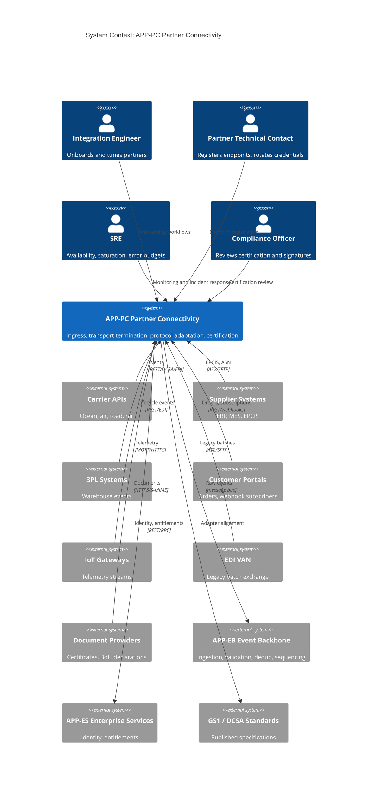
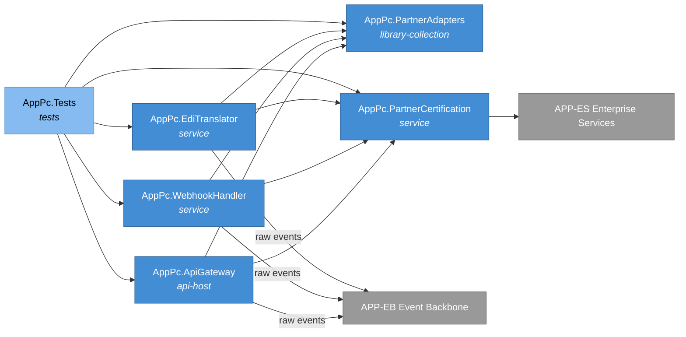
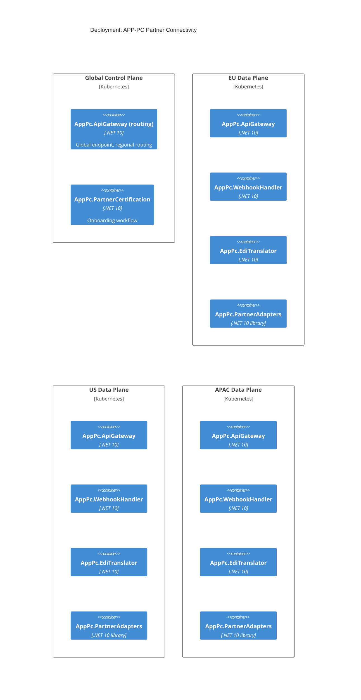
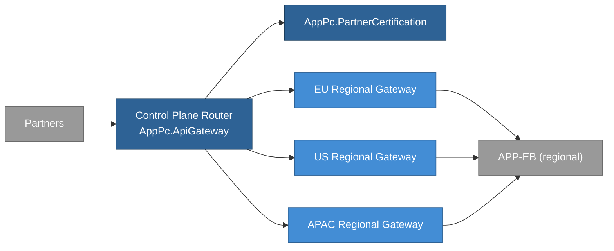
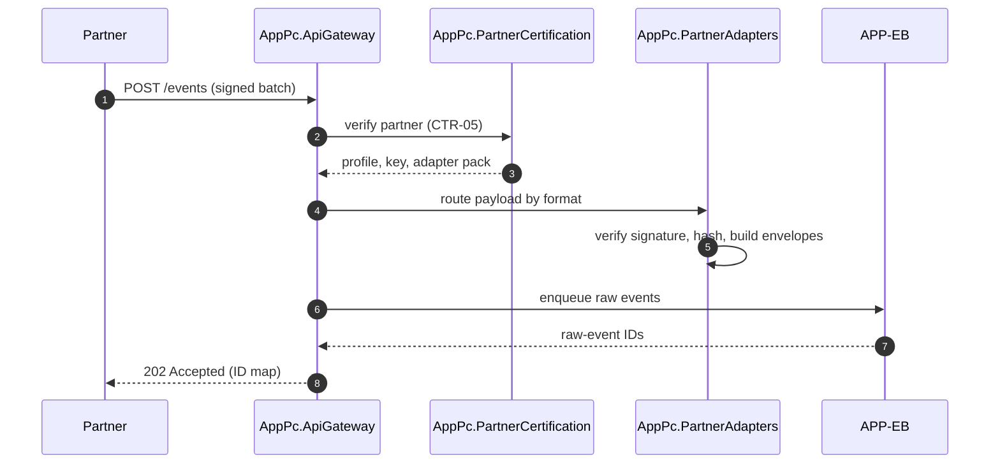

# APP-PC Partner Connectivity, System Specification

## Tracking

| Field | Value |
|---|---|
| slug | app-pc-partner-connectivity |
| itemType | SystemSpec |
| name | APP-PC Partner Connectivity |
| version | 2 |
| specLangVersion | 0.1.0 |
| publishStatus | Draft |
| retentionPolicy | indefinite |
| freshnessSla | P180D |
| authors | [PER-03 Maria Oliveira] |
| reviewers | [PER-01 Lena Brandt] |
| committer | PER-03 Maria Oliveira |
| tags | [ingestion, partner-connectivity, local-simulation-first, aspire] |
| createdAt | 2026-04-17T00:00:00Z |
| updatedAt | 2026-04-18T00:00:00Z |
| Dependencies | global-corp.manifest.md, global-corp.architecture.spec.md, aspire-apphost.spec.md, service-defaults.spec.md, carrier-gate.spec.md, wms-gate.spec.md, iot-gate.spec.md |
| Profile | BTABOK |
| profileVersion | 0.1.0 |
| codlVersion | 0.2 |
| cadlVersion | 0.1 |

## Purpose and Scope

APP-PC Partner Connectivity is the ingress boundary of the Global Corp.
supply-chain tracking platform. It owns every protocol and format that a
partner uses to reach the platform: REST and JSON APIs, webhooks, AS2 and
SFTP batch exchanges, EDI X12 and EDIFACT, GS1 EPCIS capture and query
flows, DCSA-compatible event APIs, IoT telemetry, and document ingestion
for certificates, bills of lading, declarations, and inspection artifacts.
The application terminates transport, authenticates the partner,
normalizes payloads into the platform's raw-event envelope, and hands the
result to APP-EB Event Backbone for canonical processing.

This application exists because partner protocols change faster than core
business semantics. Isolating partner-facing concerns from the canonical
event model lets the platform adopt new protocols, replace adapters, and
retire legacy exchanges without disturbing the traceability graph. The
decision to carve out this application is recorded as ASD-01 (adopt a
standards-first canonical model) and ASD-02 (separate ingestion from the
canonical core), and the design implements P-01 (standards before
custom). Capability coverage runs through CAP-PAR-01 Partner Onboarding
and Certification in the enterprise capability catalog.

Scope covers authentication and authorization of partner traffic,
transport termination, protocol adaptation, schema and signature
validation at the envelope level, and the onboarding and certification
workflow described in CTR-05 PartnerOnboard. Scope excludes canonical
event assembly, deduplication, and lineage computation; those sit in
APP-EB Event Backbone and APP-TC Traceability Core.

In the Local Simulation Profile, APP-PC runs as a set of .NET 10
projects composed under the Global Corp Aspire AppHost (see
`aspire-apphost.spec.md`). Every external partner system is replaced by
a container-hosted gate simulator: carrier APIs by CarrierGate, WMS
and 3PL platforms by WmsGate, and IoT telemetry sources by IotGate
paired with the shared Eclipse Mosquitto broker. APP-PC code calls the
typed gate clients (`CarrierGate.Client`, `WmsGate.Client`,
`IotGate.Client`) exactly the same way it would call a production
partner SDK, so no test-only code paths exist at the partner-adapter
boundary.

The Cloud Production Profile is preserved as a deferred target.
Adapter selection is configuration-driven through
`PartnerAdapterOptions`: in dev the configuration binds the gate
clients, in prod the same options select real DCSA, project44,
FourKites, AS2/SFTP, EPCIS REST, LoRaWAN gateway, and managed-MQTT
clients. Constraint 2 (cloud-deployable by configuration) is realized
without forking the codebase. Every authored component consumes
`GlobalCorp.ServiceDefaults` (see `service-defaults.spec.md`) for
OpenTelemetry wiring, resilience policies, service discovery, JWT
bearer validation, and health-check conventions.

## Context

```spec
person IntegrationEngineer {
    description: "Global Corp. integration engineer who onboards new
                  partners, writes mapping packs, and triages adapter
                  failures.";
    @tag("internal", "operations");
}

person PartnerTechnicalContact {
    description: "Engineer employed by a carrier, supplier, 3PL, or
                  customer who registers endpoints, manages credentials,
                  and resolves partner-side integration issues.";
    @tag("external", "partner");
}

person SRE {
    description: "Platform site reliability engineer responsible for
                  APP-PC availability, saturation, latency, and
                  partner-visible error budgets.";
    @tag("internal", "operations");
}

person ComplianceOfficer {
    description: "Reviews partner onboarding artifacts, certification
                  evidence, and signature policy to confirm audit
                  requirements are met.";
    @tag("internal", "compliance");
}

external system CarrierAPI {
    description: "Ocean, air, road, and rail carrier APIs. DCSA-compatible
                  where possible, bespoke REST or EDI otherwise.";
    technology: "REST/HTTPS, DCSA, EDI X12, EDIFACT";
    @tag("partner", "carrier");
}

external system SupplierSystem {
    description: "Supplier ERP and MES platforms that emit production,
                  lot, and shipment events. GS1 EPCIS preferred.";
    technology: "EPCIS XML, EPCIS JSON, AS2, SFTP";
    @tag("partner", "supplier");
}

external system ThreePLSystem {
    description: "Warehouse and 3PL platforms that emit receive, putaway,
                  pick, pack, and ship events.";
    technology: "REST/HTTPS, EDI, SFTP";
    @tag("partner", "3pl");
}

external system CustomerPortal {
    description: "Customer-side procurement and control-tower systems
                  that submit orders and subscribe to shipment events.";
    technology: "REST/HTTPS, webhooks";
    @tag("partner", "customer");
}

external system IoTGateway {
    description: "Partner or Global Corp. edge gateway that forwards
                  container telemetry for temperature, shock, humidity,
                  and GPS.";
    technology: "MQTT over TLS, HTTPS";
    @tag("partner", "iot");
}

external system EdiVAN {
    description: "Value-added network used by legacy logistics partners
                  for EDI exchange.";
    technology: "AS2, SFTP, EDI X12, EDIFACT";
    @tag("partner", "legacy");
}

external system DocumentProvider {
    description: "Third parties that submit certificates, bills of
                  lading, customs declarations, and inspection reports.";
    technology: "HTTPS upload, SFTP, S/MIME";
    @tag("partner", "document");
}

external system StandardsBody {
    description: "GS1 and DCSA standards sources. Adapter profiles align
                  to published specifications rather than bespoke shapes.";
    technology: "Specification documents";
    @tag("standards", "external");
}

IntegrationEngineer -> APP-PC : "Operates onboarding, certification,
                                 and adapter tuning workflows.";
PartnerTechnicalContact -> APP-PC : "Registers endpoints, rotates
                                     credentials, submits test traffic.";
SRE -> APP-PC : "Monitors health, manages capacity, drives incident
                 response.";
ComplianceOfficer -> APP-PC : "Reviews certification evidence and
                               signature policy.";

CarrierAPI -> APP-PC {
    description: "Submits booking confirmations, gate events, milestone
                  events, and ETA updates.";
    technology: "REST/HTTPS, DCSA, EDI";
}

SupplierSystem -> APP-PC {
    description: "Submits EPCIS capture documents and ASN exchanges.";
    technology: "EPCIS, AS2, SFTP";
}

ThreePLSystem -> APP-PC {
    description: "Submits warehouse lifecycle events and custody
                  handovers.";
    technology: "REST/HTTPS, EDI, SFTP";
}

CustomerPortal -> APP-PC {
    description: "Submits orders and consumes webhook notifications.";
    technology: "REST/HTTPS, webhooks";
}

IoTGateway -> APP-PC {
    description: "Streams sensor measurements for containers and
                  consignments.";
    technology: "MQTT over TLS, HTTPS";
}

EdiVAN -> APP-PC {
    description: "Delivers EDI batches from legacy partners.";
    technology: "AS2, SFTP";
}

DocumentProvider -> APP-PC {
    description: "Uploads signed documents for compliance cases and
                  shipment files.";
    technology: "HTTPS, S/MIME";
}

APP-PC -> APP-EB {
    description: "Forwards authenticated, validated raw events into the
                  backbone for canonical processing.";
    technology: "Internal transport, message bus";
}

APP-PC -> APP-ES {
    description: "Resolves partner identity, entitlements, and
                  certification profile.";
    technology: "Internal RPC, REST/HTTPS";
}

APP-PC -> StandardsBody : "Aligns adapter profiles to published
                           standards.";
```

Rendered system context:



## System Declaration

```spec
system APP-PC {
    target: "net10.0";
    responsibility: "Terminate every partner protocol the platform
                     supports, authenticate and authorize partner
                     traffic, validate envelope signatures and schemas,
                     and forward raw events to APP-EB. Own partner
                     onboarding, certification, and adapter lifecycle.
                     Implement P-01 standards-before-custom by making
                     standards-aligned adapters the default and bespoke
                     adapters the exception.";

    // Subsystem references (resolved by the Aspire AppHost in Local
    // Simulation Profile; resolved to real partner endpoints in Cloud
    // Production Profile via PartnerAdapterOptions configuration).
    subsystem references {
        uses GATE-CARRIER from "./global-corp.architecture.spec.md#section-3"
            rationale "Ocean, road, and air carrier APIs (DCSA, EDI
                       X12/EDIFACT 214, project44-style visibility) are
                       routed through CarrierGate in dev. Same client
                       interface in prod against real carrier gateways.";
        uses GATE-WMS from "./global-corp.architecture.spec.md#section-3"
            rationale "WMS, TMS, and 3PL platforms (EPCIS capture/query,
                       REST webhooks, AS2/SFTP exchanges) are routed
                       through WmsGate in dev. Same client interface in
                       prod against partner endpoints.";
        uses GATE-IOT from "./global-corp.architecture.spec.md#section-3"
            rationale "IoT telemetry (MQTT, HTTPS, LoRaWAN uplinks) is
                       routed through IotGate plus the shared mosquitto
                       broker in dev. Same client interface in prod
                       against real device networks and managed MQTT
                       brokers.";
    }

    authored component AppPc.ApiGateway {
        kind: "api-host";
        path: "src/AppPc.ApiGateway";
        status: new;
        responsibility: "Partner-facing REST and JSON API surface.
                         Terminates mTLS, enforces per-partner rate
                         limits, routes requests to protocol-specific
                         adapters, and returns synchronous
                         acknowledgements or rejection codes. Exposes
                         DCSA-compatible endpoints for ocean tracking
                         and a generic event-submission endpoint for
                         REST partners.";
        contract {
            guarantees "Every request is authenticated by mTLS client
                        certificate mapped to a PartnerContract record.";
            guarantees "Requests from uncertified partners are rejected
                        with PARTNER_NOT_CERTIFIED before any payload
                        parsing occurs.";
            guarantees "Synchronous acknowledgements carry the raw-event
                        ID and the platform receipt timestamp.";
            guarantees "DCSA endpoints conform to the DCSA Track and
                        Trace API profile declared in the adapter
                        catalog.";
        }
    }

    authored component AppPc.EdiTranslator {
        kind: service;
        path: "src/AppPc.EdiTranslator";
        status: new;
        responsibility: "Translate EDI X12 and EDIFACT batches into the
                         platform's raw-event envelope. Maintains a
                         versioned mapping pack per partner and per
                         transaction set. Emits one raw event per
                         logical transaction.";
        contract {
            guarantees "Every translated event carries the source
                        transaction set identifier and the mapping-pack
                        version in its provenance fields.";
            guarantees "Unknown transaction sets produce SCHEMA_UNKNOWN
                        rejections with the partner and set identifier
                        retained.";
            guarantees "Mapping packs are versioned; a mapping-pack
                        rollback does not rewrite previously forwarded
                        raw events.";
        }

        rationale {
            context "Legacy logistics partners submit EDI through VAN
                     providers. Canonical semantics cannot accept EDI
                     directly without losing traceability to the source
                     transaction set.";
            decision "EDI translation is its own component so that
                      mapping-pack changes are isolated from gateway
                      and adapter code.";
            consequence "Mapping packs can be hot-reloaded per partner
                         with audit trail, and the canonical model
                         never imports an EDI dependency.";
        }
    }

    authored component AppPc.WebhookHandler {
        kind: service;
        path: "src/AppPc.WebhookHandler";
        status: new;
        responsibility: "Inbound webhook receiver. Verifies HMAC or
                         signature headers per partner profile,
                         deduplicates retries by partner-supplied event
                         identifier, and forwards payloads to APP-EB.
                         Also manages outbound webhook subscriptions
                         that customer portals consume. In Local
                         Simulation Profile the ingress endpoint
                         accepts webhook callbacks from CarrierGate,
                         WmsGate, and IotGate simulators; in Cloud
                         Production Profile the same endpoint accepts
                         real partner webhooks. Signature verification
                         logic is identical across profiles. Key
                         material differs per profile: dev keys come
                         from Aspire parameter resources and are
                         shared with the gate simulators; prod keys
                         come from the enterprise secret store through
                         APP-ES.";
        contract {
            guarantees "Every inbound webhook is verified against the
                        partner's registered signing key before the
                        payload enters the raw-event queue.";
            guarantees "Duplicate deliveries from the same partner
                        identifier produce an idempotent 2xx response
                        without re-enqueueing.";
            guarantees "Outbound subscriptions are replayed with
                        exponential backoff when the subscriber is
                        unavailable, bounded by the subscription's
                        retention window.";
            guarantees "Signature verification uses the same algorithm
                        and header conventions in dev and prod; only
                        the key reference changes per profile.";
        }
    }

    authored component AppPc.PartnerAdapters {
        kind: "library-collection";
        path: "src/AppPc.PartnerAdapters";
        status: new;
        responsibility: "Set of protocol-specific adapters. In Local
                         Simulation Profile each adapter is backed by a
                         gate client: carrier adapters (OceanCarrier,
                         RoadCarrier, AirCarrier) call CarrierGate.Client
                         for DCSA, EDI X12 214, EDIFACT IFTSTA, and
                         project44-style traffic; warehouse adapters
                         (WmsAdapter, TmsAdapter, ThreePlAdapter) call
                         WmsGate.Client for EPCIS capture and query,
                         REST webhooks, and AS2/SFTP exchanges; the IoT
                         adapter (IotAdapter) calls IotGate.Client for
                         control-plane telemetry and subscribes to the
                         shared mosquitto broker for streaming MQTT
                         messages. In Cloud Production Profile the same
                         adapters bind to real partner SDKs selected by
                         PartnerAdapterOptions. Every adapter translates
                         its inbound format into the raw-event envelope
                         and records the partner, adapter name, and
                         profile version used for the translation.";
        contract {
            guarantees "Each adapter is independently versioned and
                        can be enabled or disabled per partner without
                        code changes to other adapters.";
            guarantees "Adapter output records adapterName and
                        adapterProfileVersion so APP-TC can reason
                        about lineage at the adapter boundary.";
            guarantees "A new adapter can be added without modifying
                        the canonical event model in APP-TC.";
            guarantees "Adapter selection (gate client vs. real partner
                        client) is resolved at composition time from
                        PartnerAdapterOptions; adapter call sites do
                        not branch at runtime.";
            guarantees "In Local Simulation Profile the MQTT ingestion
                        path subscribes to the shared mosquitto
                        container declared by the AppHost; the same
                        broker is used by IotGate as its publish
                        surface.";
        }

        rationale {
            context "Partner protocols proliferate. Coupling adapter
                     logic to the gateway would force gateway redeploy
                     on every adapter change. Local-first development
                     also requires that every outbound partner call be
                     servable from a container on the developer
                     machine.";
            decision "Adapters live in an adapter collection component.
                      The gateway and EDI translator depend on it by
                      contract. The gate clients
                      (CarrierGate.Client, WmsGate.Client,
                      IotGate.Client) are consumed as the default
                      binding in dev and replaced by real partner
                      clients in prod through PartnerAdapterOptions.
                      The MQTT connection points at the shared
                      mosquitto broker resource in dev.";
            consequence "New adapters ship as additive changes without
                         reopening the gateway or the backbone. The
                         same adapter code runs against gates locally
                         and against real partner endpoints in
                         production.";
        }
    }

    authored component AppPc.PartnerAdapterOptions {
        kind: "library";
        path: "src/AppPc.PartnerAdapterOptions";
        status: new;
        responsibility: "Configuration model that selects the binding
                         for each partner adapter. Each adapter slot
                         (CarrierOcean, CarrierRoad, CarrierAir, Wms,
                         Tms, ThreePl, IotControl, IotTelemetry, Edi,
                         Document) accepts a binding kind
                         (GateClient | RealPartnerClient) plus the
                         base URL, credential reference, and partner
                         profile identifier. Loaded from
                         IConfiguration and bound at AppHost composition
                         time.";
        contract {
            guarantees "In Local Simulation Profile the default binding
                        kind is GateClient for every adapter slot and
                        the base URLs resolve to the gate containers
                        declared in the AppHost.";
            guarantees "In Cloud Production Profile binding kinds are
                        RealPartnerClient and base URLs resolve to
                        partner endpoints.";
            guarantees "Missing or incomplete options produce a
                        PartnerAdapterOptionsInvalid startup error
                        rather than a silent fallback.";
        }

        rationale {
            context "Constraint 2 (cloud-deployable by configuration)
                     requires the dev-to-prod transition to happen at
                     composition, not in adapter code.";
            decision "PartnerAdapterOptions is the single switchboard.
                      AppHost composition reads it and registers the
                      correct client implementations.";
            consequence "Adapter call sites remain identical across
                         profiles; dev and prod share a single binary
                         surface.";
        }
    }

    authored component AppPc.PartnerCertification {
        kind: service;
        path: "src/AppPc.PartnerCertification";
        status: new;
        responsibility: "Onboarding workflow and certification profile
                         store. Implements CTR-05 PartnerOnboard: given
                         a partner profile, runs required conformance
                         tests, records evidence, and returns a
                         certification status plus the mapping pack
                         that the gateway and adapters should use.
                         Each certification profile supports a
                         SimulatorFixture mode during onboarding: a
                         new partner validates integration against the
                         matching gate (CarrierGate, WmsGate, or
                         IotGate) and its recorded fixture library
                         before the profile is switched to production
                         endpoints. SimulatorFixture is a transient
                         state held only during onboarding; a
                         production certification requires traffic
                         against a real partner endpoint.";
        contract {
            guarantees "A partner's certification status transitions
                        only through the documented workflow:
                        Registered, UnderTest, Certified, Suspended,
                        Retired.";
            guarantees "Certification evidence is retained for the
                        life of the partner contract plus the
                        jurisdiction retention window.";
            guarantees "A Suspended or Retired partner cannot submit
                        events; the gateway rejects traffic with
                        PARTNER_NOT_CERTIFIED.";
            guarantees "A partner in SimulatorFixture mode cannot
                        transition to Certified without at least one
                        conformance run against the real partner
                        endpoint recorded in the evidence pack.";
        }
    }

    authored component AppPc.Tests {
        kind: tests;
        path: "tests/AppPc.Tests";
        status: new;
        responsibility: "Unit and integration tests for gateway, EDI
                         translator, webhook handler, adapter
                         collection, and certification workflow.
                         Includes conformance harness that replays
                         recorded partner traffic against adapters.";
    }

    consumed component Microsoft.AspNetCore {
        source: nuget("Microsoft.AspNetCore.App");
        version: "10.*";
        responsibility: "HTTP host, TLS termination, routing, and mTLS
                         client certificate validation.";
        used_by: [AppPc.ApiGateway, AppPc.WebhookHandler];
    }

    consumed component GlobalCorp.ServiceDefaults {
        kind: library;
        source: project("../../src/GlobalCorp.ServiceDefaults");
        responsibility: "Shared ServiceDefaults library. Provides
                         OpenTelemetry wiring, resilience policies
                         (Polly-based retry and circuit breaker),
                         service discovery through Aspire, JWT bearer
                         validation against APP-ES.Identity, and the
                         standard health-check conventions. Referenced
                         by every HTTP-hosting authored component in
                         APP-PC.";
        used_by: [AppPc.ApiGateway, AppPc.EdiTranslator,
                  AppPc.WebhookHandler, AppPc.PartnerCertification];
    }

    consumed component Aspire.Hosting {
        kind: library;
        source: nuget("Aspire.Hosting");
        version: "13.2.*";
        responsibility: "Aspire resource model for AppHost composition,
                         connection-string binding, and health-check
                         wiring. Consumed indirectly via the AppHost
                         project; APP-PC components rely on Aspire to
                         receive gate-client base URLs, mosquitto
                         broker endpoints, and APP-ES bindings at
                         runtime.";
        used_by: [AppPc.ApiGateway, AppPc.WebhookHandler,
                  AppPc.PartnerAdapters, AppPc.PartnerAdapterOptions];
    }

    consumed component CarrierGate.Client {
        kind: library;
        source: project("../CarrierGate/src/CarrierGate.Client");
        responsibility: "Typed .NET client for the CarrierGate
                         simulator. Wraps the DCSA, EDI X12 214,
                         EDIFACT IFTSTA, and project44-style endpoints
                         that APP-PC's carrier adapters call. In Local
                         Simulation Profile the CarrierOcean,
                         CarrierRoad, and CarrierAir adapter slots
                         bind to CarrierGate.Client. In Cloud
                         Production Profile the slots bind to real
                         carrier clients selected by
                         PartnerAdapterOptions.";
        used_by: [AppPc.PartnerAdapters, AppPc.Tests];
    }

    consumed component WmsGate.Client {
        kind: library;
        source: project("../WmsGate/src/WmsGate.Client");
        responsibility: "Typed .NET client for the WmsGate simulator.
                         Wraps EPCIS capture and query, REST webhook
                         publication, and AS2/SFTP batch surfaces used
                         by APP-PC's warehouse and 3PL adapters. Local
                         Simulation Profile default binding for the
                         Wms, Tms, and ThreePl adapter slots.";
        used_by: [AppPc.PartnerAdapters, AppPc.Tests];
    }

    consumed component IotGate.Client {
        kind: library;
        source: project("../IotGate/src/IotGate.Client");
        responsibility: "Typed .NET client for the IotGate control
                         surface: scenario selection, mode switching,
                         fault injection, and request-log inspection.
                         Local Simulation Profile default binding for
                         the IotControl adapter slot. Streaming
                         telemetry does not flow through this client;
                         it arrives over MQTT through the shared
                         mosquitto broker.";
        used_by: [AppPc.PartnerAdapters, AppPc.Tests];
    }

    consumed component MQTTnet {
        kind: library;
        source: nuget("MQTTnet");
        version: "4.*";
        responsibility: "MQTT 3.1.1 and MQTT 5 client. In Local
                         Simulation Profile the IoT ingestion path
                         subscribes to the shared mosquitto container
                         declared in the AppHost (the same broker used
                         by IotGate). In Cloud Production Profile it
                         connects to managed MQTT brokers configured
                         through PartnerAdapterOptions.";
        used_by: [AppPc.PartnerAdapters];
    }

    consumed component OpenTelemetry {
        source: nuget("OpenTelemetry");
        version: "1.*";
        responsibility: "Distributed tracing, metrics, and logs for
                         gateway and adapters. Wired through
                         GlobalCorp.ServiceDefaults. Emits to the
                         Aspire Dashboard in dev and to APP-SO
                         collectors in prod.";
        used_by: [AppPc.ApiGateway, AppPc.EdiTranslator,
                  AppPc.WebhookHandler, AppPc.PartnerAdapters];
    }

    consumed component xunit {
        source: nuget("xunit");
        version: "2.*";
        responsibility: "Unit and integration testing framework.";
        used_by: [AppPc.Tests];
    }

    package_policy: weakRef<PackagePolicy>(GlobalCorpPolicy)
        from "./global-corp.architecture.spec.md#section-8"
        rationale "APP-PC inherits the enterprise package policy
                   without additions. Carrier, WMS, and IoT adapter
                   logic runs through gate clients in dev and through
                   partner-selected SDKs in prod. Any partner SDK
                   introduced in the prod binding must be reviewed
                   against the enterprise policy before it is
                   permitted.";
}
```

## Topology

```spec
topology Dependencies {
    allow AppPc.ApiGateway -> AppPc.PartnerAdapters;
    allow AppPc.ApiGateway -> AppPc.PartnerCertification;
    allow AppPc.ApiGateway -> AppPc.PartnerAdapterOptions;
    allow AppPc.WebhookHandler -> AppPc.PartnerAdapters;
    allow AppPc.WebhookHandler -> AppPc.PartnerCertification;
    allow AppPc.WebhookHandler -> AppPc.PartnerAdapterOptions;
    allow AppPc.EdiTranslator -> AppPc.PartnerAdapters;
    allow AppPc.EdiTranslator -> AppPc.PartnerCertification;
    allow AppPc.PartnerAdapters -> AppPc.PartnerAdapterOptions;
    allow AppPc.Tests -> AppPc.ApiGateway;
    allow AppPc.Tests -> AppPc.EdiTranslator;
    allow AppPc.Tests -> AppPc.WebhookHandler;
    allow AppPc.Tests -> AppPc.PartnerAdapters;
    allow AppPc.Tests -> AppPc.PartnerCertification;
    allow AppPc.Tests -> AppPc.PartnerAdapterOptions;

    deny AppPc.PartnerAdapters -> AppPc.ApiGateway;
    deny AppPc.PartnerAdapters -> AppPc.EdiTranslator;
    deny AppPc.PartnerAdapters -> AppPc.WebhookHandler;
    deny AppPc.PartnerCertification -> AppPc.ApiGateway;

    invariant "no canonical dependency":
        AppPc.* does not reference AppTc.* or AppEb.Canonical.*;

    invariant "no partner SDK in canonical":
        AppPc.PartnerAdapters contains no reference to canonical event
        assembly types.

    rationale {
        context "APP-PC must evolve with partner protocols without
                 forcing changes in APP-EB or APP-TC. Canonical
                 semantics must not leak into adapter code.";
        decision "Adapters depend only on the raw-event envelope and
                  the certification contract. Gateway, EDI, and webhook
                  surfaces depend on adapters, not the reverse. APP-TC
                  is never referenced from APP-PC.";
        consequence "Adapter changes ship independently of backbone
                     and core changes. Canonical model evolution does
                     not cascade into partner-facing code paths.";
    }
}
```

Rendered topology:



## Data

```spec
entity PartnerContract {
    id: string;
    organizationId: string;
    displayName: string;
    contractRef: string;
    technicalProfile: string;
    certificationStatus: CertificationStatus;
    signingKeyRef: string;
    adapterProfileVersion: string;
    onboardedAt: string;
    lastCertifiedAt: string?;
    suspendedAt: string?;

    invariant "id required": id != "";
    invariant "organization required": organizationId != "";
    invariant "signing key present when active":
        certificationStatus == Certified implies signingKeyRef != "";

    rationale "adapterProfileVersion" {
        context "Partners do not always upgrade adapter profiles in
                 lockstep with platform releases.";
        decision "PartnerContract carries the adapter profile version
                  pinned at certification time.";
        consequence "Adapter changes stage through recertification
                     rather than implicit version drift.";
    }

    // ENT-19 canonical reference
    weakRef canonical: ENT-19 PartnerContract;
}

entity RawEventEnvelope {
    id: string;
    partnerContractId: string;
    adapterName: string;
    adapterProfileVersion: string;
    receivedAt: string;
    sourceSystemId: string;
    payloadFormat: PayloadFormat;
    payload: string;
    payloadHash: string;
    signatureRef: string?;

    invariant "id required": id != "";
    invariant "partner required": partnerContractId != "";
    invariant "adapter identified":
        adapterName != "" and adapterProfileVersion != "";
    invariant "payload hash present": payloadHash != "";

    rationale {
        context "Raw events must flow to APP-EB with enough provenance
                 for lineage reconstruction later.";
        decision "The envelope records partner, adapter, adapter
                  version, format, payload, and payload hash at
                  ingress time.";
        consequence "APP-TC can compute INV-02 lineage completeness
                     without revisiting the partner.";
    }
}

entity CertificationRecord {
    id: string;
    partnerContractId: string;
    startedAt: string;
    completedAt: string?;
    outcome: CertificationOutcome;
    evidenceRef: string;
    approvedBy: string;

    invariant "id required": id != "";
    invariant "evidence recorded when completed":
        completedAt != null implies evidenceRef != "";
}

entity AdapterProfile {
    name: string;
    version: string;
    transport: string;
    standardRef: string?;
    schemaRef: string;
    status: AdapterProfileStatus;

    invariant "name required": name != "";
    invariant "version required": version != "";
    invariant "schema reference present": schemaRef != "";
}
```

```spec
enum CertificationStatus {
    Registered: "Partner is known but not yet tested",
    UnderTest: "Partner is running conformance tests",
    Certified: "Partner may submit production traffic",
    Suspended: "Partner submissions are blocked pending resolution",
    Retired: "Partner contract is closed"
}

enum CertificationOutcome {
    Pass: "Partner passed all required conformance tests",
    Fail: "Partner failed one or more required conformance tests",
    Waived: "Conformance exception granted under a waiver record"
}

enum PayloadFormat {
    RestJson: "REST JSON submission",
    EpcisXml: "GS1 EPCIS XML",
    EpcisJson: "GS1 EPCIS JSON",
    EdiX12: "ANSI X12 EDI",
    Edifact: "UN/EDIFACT EDI",
    DcsaJson: "DCSA event API JSON",
    MqttTelemetry: "IoT telemetry payload",
    DocumentBinary: "Binary document upload"
}

enum AdapterProfileStatus {
    Draft: "Profile is under development",
    Active: "Profile is available for partner certification",
    Deprecated: "Profile is being retired; new certifications blocked",
    Retired: "Profile is no longer available"
}
```

## Contracts

```spec
contract CTR-05-PartnerOnboard {
    // Implements Section 16.3 CTR-05 PartnerOnboard.
    requires partnerProfile.organizationId != "";
    requires partnerProfile.technicalProfile != "";
    ensures certificationRecord.id != "";
    ensures certificationRecord.outcome in [Pass, Fail, Waived];
    ensures partnerContract.certificationStatus in
            [Certified, Suspended] when certificationRecord.outcome == Pass;

    guarantees "Given a partner profile, runs the adapter-specific
                conformance suite, records evidence, and returns a
                CertificationRecord together with the AdapterProfile
                and mapping pack that the partner must use.";
    guarantees "A Pass outcome transitions the partner to Certified
                and issues a signing key reference through APP-ES.";
    guarantees "A Fail outcome leaves the partner at UnderTest and
                retains evidence for retry.";
    guarantees "A Waived outcome requires an existing WaiverRecord
                that references the failing conformance rule.";
}

contract SubmitRawEvent {
    requires request.partnerContractId != "";
    requires request.payload != "";
    requires partnerContract.certificationStatus == Certified;
    ensures rawEvent.id != "";
    ensures rawEvent.payloadHash != "";
    ensures rawEvent.adapterName != "";

    guarantees "The gateway, EDI translator, and webhook handler all
                produce the same RawEventEnvelope shape regardless of
                inbound protocol.";
    guarantees "A successful submission returns a synchronous 202
                Accepted with the raw-event identifier and the platform
                receipt timestamp.";
    guarantees "Signature failure returns SIGNATURE_INVALID before the
                payload enters the raw-event queue.";
    guarantees "Uncertified partners receive PARTNER_NOT_CERTIFIED
                regardless of payload shape.";
}

contract RegisterAdapterProfile {
    requires profile.name != "";
    requires profile.version != "";
    ensures adapterProfile.status == Draft;

    guarantees "A new adapter profile enters in Draft state. Only the
                profile owner can transition it to Active.";
    guarantees "Deprecated profiles block new certifications but do
                not disturb partners already certified under them.";
}

contract SubscribeOutboundWebhook {
    requires subscription.subscriberId != "";
    requires subscription.eventTypes.count > 0;
    ensures subscription.id != "";
    ensures subscription.status == Active;

    guarantees "Subscribers receive events for subscribed event types
                only; entitlement is checked through APP-ES before
                activation.";
    guarantees "Failed deliveries retry with exponential backoff
                bounded by the subscription's retention window.";
}
```

## Invariants

```spec
invariant INV-01-ingress {
    scope: [AppPc.ApiGateway, AppPc.WebhookHandler,
            AppPc.EdiTranslator, AppPc.PartnerAdapters];
    statement: "Every RawEventEnvelope handed to APP-EB carries the
                SHA-256 hash of the original partner payload. The hash
                is computed before any adapter transformation and
                preserved through the envelope lifecycle.";
    enforces: weakRef INV-01;
}

invariant INV-02-ingress {
    scope: [AppPc.PartnerAdapters];
    statement: "Every RawEventEnvelope carries enough source metadata
                (partnerContractId, adapterName, adapterProfileVersion,
                sourceSystemId) for APP-TC to compute a lineage
                pointer that resolves to at least one source evidence
                record.";
    enforces: weakRef INV-02;
}

invariant UncertifiedBlocked {
    scope: [AppPc.ApiGateway, AppPc.WebhookHandler,
            AppPc.EdiTranslator];
    statement: "No RawEventEnvelope is emitted for a partner whose
                certification status is not Certified at ingress time.";
}

invariant AdapterVersionPinned {
    scope: [AppPc.PartnerAdapters];
    statement: "Adapter profile version is read from the
                PartnerContract at envelope construction time, not from
                adapter runtime configuration.";
}
```

## Deployment

```spec
deployment LocalSimulation {
    // Primary deployment profile for 2026-04-18. Everything runs on a
    // single developer machine composed by the Global Corp Aspire
    // AppHost (see aspire-apphost.spec.md). Cloud multi-region
    // deployment is deferred.

    node "Developer Workstation" {
        technology: "Docker Desktop, .NET 10, Aspire 13.2 AppHost";

        node "Aspire AppHost Process" {
            technology: ".NET 10 DistributedApplication";
            responsibility: "Composes every APP-PC project, every gate
                             container, and the shared mosquitto
                             broker; wires connection strings and
                             health checks; renders the Aspire
                             Dashboard for telemetry.";
            instance: AppPc.ApiGateway;
            instance: AppPc.EdiTranslator;
            instance: AppPc.WebhookHandler;
            instance: AppPc.PartnerAdapters;
            instance: AppPc.PartnerAdapterOptions;
            instance: AppPc.PartnerCertification;
        }

        node "Gate Simulator Containers" {
            technology: "Docker containers managed by Aspire";
            responsibility: "CarrierGate, WmsGate, and IotGate
                             containers that APP-PC adapters call in
                             place of real partner systems. Each gate
                             runs in Stub, Record, Replay, or
                             FaultInject mode as configured at
                             startup.";
        }

        node "Shared Infrastructure Containers" {
            technology: "Docker containers managed by Aspire";
            responsibility: "eclipse-mosquitto:2-openssl as the shared
                             MQTT broker for IotGate and APP-PC's IoT
                             ingestion path; postgres:17-alpine
                             instances for regional data planes
                             consumed transitively through APP-ES.";
        }
    }

    rationale {
        context "Constraint 1 (local simulation first) requires that
                 APP-PC be fully exercisable against gate simulators on
                 a developer machine before any cloud activity.
                 Constraint 3 (.NET Aspire for all .NET orchestration)
                 pins the composition model. Constraint 7 (all external
                 subsystems in Docker locally) pins the partner
                 simulation approach.";
        decision "Every APP-PC component runs as an Aspire-hosted .NET
                  project in dev. Partner systems are replaced by
                  CarrierGate, WmsGate, and IotGate containers.
                  PartnerAdapterOptions.BindingKind = GateClient for
                  every adapter slot in dev.";
        consequence "APP-PC is verifiable end-to-end on one machine.
                     Traffic shapes match production because adapters
                     use real partner wire formats, not mocks.";
    }
}

deployment CloudProduction {
    // Deferred per 2026-04-18 implementation brief. Retained in this
    // spec as the intended long-term target and as documentation of
    // the multi-region shape the platform must preserve by
    // configuration (Constraint 2).

    node "Global Control Plane" {
        technology: "Managed Kubernetes, mTLS ingress";

        node "Partner Routing Layer" {
            technology: ".NET 10, ASP.NET";
            instance: AppPc.ApiGateway;
            responsibility: "Global DNS-fronted partner endpoint with
                             regional routing.";
        }

        node "Certification Workflow" {
            technology: ".NET 10";
            instance: AppPc.PartnerCertification;
        }
    }

    node "EU Data Plane" {
        technology: "Managed Kubernetes, regional TLS";

        node "EU Gateway Region" {
            technology: ".NET 10";
            instance: AppPc.ApiGateway;
            instance: AppPc.WebhookHandler;
            instance: AppPc.EdiTranslator;
            instance: AppPc.PartnerAdapters;
        }
    }

    node "US Data Plane" {
        technology: "Managed Kubernetes, regional TLS";

        node "US Gateway Region" {
            technology: ".NET 10";
            instance: AppPc.ApiGateway;
            instance: AppPc.WebhookHandler;
            instance: AppPc.EdiTranslator;
            instance: AppPc.PartnerAdapters;
        }
    }

    node "APAC Data Plane" {
        technology: "Managed Kubernetes, regional TLS";

        node "APAC Gateway Region" {
            technology: ".NET 10";
            instance: AppPc.ApiGateway;
            instance: AppPc.WebhookHandler;
            instance: AppPc.EdiTranslator;
            instance: AppPc.PartnerAdapters;
        }
    }

    rationale {
        context "Section 18 of the exemplar defines a global control
                 plane plus regional data planes. APP-PC participates
                 in both: routing and certification are global;
                 transport termination and adapter execution are
                 regional so that raw events land in the regional
                 Event Backbone that owns them. This profile is
                 deferred as of 2026-04-18; it is documented to confirm
                 that the Local Simulation Profile composition can be
                 promoted to cloud by configuration alone.";
        decision "AppPc.ApiGateway is deployed in the control plane
                  for partner-facing DNS and routing, and separately in
                  each data plane for local termination. Webhook
                  handler, EDI translator, and partner adapters run
                  only in data planes. AppPc.PartnerCertification runs
                  only in the control plane. PartnerAdapterOptions
                  switches every adapter slot to RealPartnerClient.";
        consequence "A partner submits to a single global hostname.
                     Regional termination keeps the payload in-region
                     before it becomes a raw event. Certification is
                     globally consistent. Source code is identical to
                     the Local Simulation Profile; only configuration
                     differs.";
    }
}
```

Rendered deployment:



## Views

```spec
view systemContext of APP-PC ContextView {
    include: all;
    autoLayout: top-down;
    description: "APP-PC with partner-side systems (carriers,
                  suppliers, 3PLs, customer portals, IoT gateways, EDI
                  VAN, document providers) and platform-side neighbors
                  (APP-EB, APP-ES, standards bodies).";
}

view container of APP-PC ContainerView {
    include: all;
    autoLayout: left-right;
    description: "Internal structure showing AppPc.ApiGateway,
                  AppPc.EdiTranslator, AppPc.WebhookHandler,
                  AppPc.PartnerAdapters, and AppPc.PartnerCertification
                  with their allowed dependencies.";
}

view deployment of LocalSimulation LocalSimulationDeploymentView {
    include: all;
    autoLayout: top-down;
    description: "Developer workstation running the Aspire AppHost:
                  every APP-PC project plus CarrierGate, WmsGate,
                  IotGate, and the shared mosquitto broker. Primary
                  deployment profile as of 2026-04-18.";
    @tag("dev", "local-simulation");
}

view deployment of CloudProduction ProductionDeploymentView {
    include: all;
    autoLayout: top-down;
    description: "Global control plane (routing, certification) with
                  regional data planes (termination, EDI, webhooks,
                  adapters). Deferred cloud profile retained for
                  configuration-parity reference.";
    @tag("prod", "deferred");
}

view dynamic PartnerBatchSubmission {
    include: [AppPc.ApiGateway, AppPc.PartnerCertification,
              AppPc.PartnerAdapters];
    autoLayout: left-right;
    description: "Partner submits an event batch; APP-PC verifies
                  certification, translates payload, and forwards raw
                  events to APP-EB. See DYN-01.";
}
```



## Dynamics

```spec
dynamic DYN-01-PartnerBatch {
    // Aligned with Section 20.1 DYN-01 Partner submits event batch.
    1: Partner -> AppPc.ApiGateway {
        description: "POST /events (signed batch).";
        technology: "REST/HTTPS, mTLS";
    };
    2: AppPc.ApiGateway -> AppPc.PartnerCertification {
        description: "Verify partner certificate and status (CTR-05).";
        technology: "Internal RPC";
    };
    3: AppPc.PartnerCertification -> AppPc.ApiGateway
        : "Return partner profile, signing key, adapter pack, pass/fail.";
    4: AppPc.ApiGateway -> AppPc.PartnerAdapters
        : "Route payload to adapter for the declared format.";
    5: AppPc.PartnerAdapters -> AppPc.PartnerAdapters
        : "Verify payload signature, compute payload hash, and build
           RawEventEnvelope records with adapter provenance.";
    6: AppPc.ApiGateway -> APP-EB {
        description: "Enqueue raw events with envelope metadata.";
        technology: "Internal message bus";
    };
    7: APP-EB -> AppPc.ApiGateway
        : "Return ingestion acknowledgements with raw-event IDs.";
    8: AppPc.ApiGateway -> Partner {
        description: "202 Accepted with per-event ID map or rejection
                      reasons.";
        technology: "REST/HTTPS";
    };
}

dynamic DYN-PC-01-Onboarding {
    1: IntegrationEngineer -> AppPc.PartnerCertification {
        description: "Create partner profile draft.";
        technology: "REST/HTTPS";
    };
    2: AppPc.PartnerCertification -> AppPc.PartnerCertification
        : "Run conformance suite for the declared adapter profile.";
    3: AppPc.PartnerCertification -> APP-ES {
        description: "Issue signing key reference.";
        technology: "Internal RPC";
    };
    4: AppPc.PartnerCertification -> AppPc.PartnerCertification
        : "Record CertificationRecord with outcome and evidence.";
    5: AppPc.PartnerCertification -> ComplianceOfficer {
        description: "Notify certification outcome with evidence pack.";
        technology: "Notification channel";
    };
    6: AppPc.PartnerCertification -> IntegrationEngineer
        : "Return certified partner contract or rejection.";
}
```

Rendered DYN-01 sequence:



## BTABOK traces

```spec
trace ASR-PC-Coverage {
    ref<ASRCard> ASR-01 -> [AppPc.ApiGateway, AppPc.PartnerAdapters];
    ref<ASRCard> ASR-04 -> [AppPc.PartnerCertification,
                            AppPc.PartnerAdapters, AppPc.EdiTranslator];
    ref<ASRCard> ASR-10 -> [AppPc.EdiTranslator, AppPc.PartnerAdapters];

    invariant "every listed ASR reaches at least one component":
        all sources have count(targets) >= 1;
}

trace ASD-PC-Coverage {
    ref<DecisionRecord> ASD-01 -> [AppPc.PartnerAdapters,
                                   AppPc.EdiTranslator];
    ref<DecisionRecord> ASD-02 -> [AppPc.ApiGateway,
                                   AppPc.PartnerAdapters];
}

trace Principle-PC-Coverage {
    ref<PrincipleCard> P-01 -> [AppPc.PartnerAdapters,
                                AppPc.PartnerCertification];
}

trace Contract-PC-Coverage {
    CTR-05-PartnerOnboard -> [AppPc.PartnerCertification];
    SubmitRawEvent -> [AppPc.ApiGateway, AppPc.WebhookHandler,
                       AppPc.EdiTranslator, AppPc.PartnerAdapters];
    RegisterAdapterProfile -> [AppPc.PartnerCertification];
    SubscribeOutboundWebhook -> [AppPc.WebhookHandler];
}

trace Capability-PC-Coverage {
    weakRef CAP-PAR-01 -> [AppPc.PartnerCertification,
                           AppPc.PartnerAdapters];
}
```

## Cross-references

This specification refines the APP-PC row in Section 15.1 of the Global
Corp. exemplar and realizes the Partner Connectivity node in the Section
15.2 logical application view. The Section 15.3 rationale item
"Partner Connectivity is isolated because partner protocols change
faster than core business semantics" is the governing design intent.

Upstream references resolved by this spec:

- ASR-01, ASR-04, and ASR-10 from Section 21 are traced to APP-PC
  components in the BTABOK traces block.
- ASD-01 and ASD-02 from Section 22 are the governing decisions. This
  spec is a downstream cascade of both.
- P-01 (Standards before custom) and P-02 (Events are the source of
  operational truth) are the governing principles.
- INV-01 and INV-02 from Section 16.4 are enforced at the ingress
  boundary.
- ENT-19 PartnerContract is the canonical target of the PartnerContract
  entity declared here; the weakRef is resolved in the Information
  Architecture spec.
- CTR-05 PartnerOnboard is implemented by CTR-05-PartnerOnboard above.

Downstream references this spec emits:

- RawEventEnvelope records are consumed by APP-EB Event Backbone.
- PartnerContract certification status is read by APP-EB for ingress
  admission checks.
- APP-ES Enterprise Services owns identity and entitlement resolution
  that APP-PC calls during certification and webhook subscription.

Section 20.1 DYN-01 Partner submits event batch is realized by
DYN-01-PartnerBatch in this spec. Section 20 retains the cross-system
view; this spec owns the APP-PC-internal steps.

## Open Items

- Adapter profile for EPCIS 2.0 JSON is pending ratification by the
  standards working group. Tracked as RSK-PC-01.
- Outbound webhook replay window is bounded at 7 days; confirmation
  from PER-19 Emma Richardson pending on whether customer-control-tower
  use cases require a longer window.
- IoT MQTT adapter authentication scheme is still under review between
  PER-03 Maria Oliveira and PER-04 Daniel Park.
