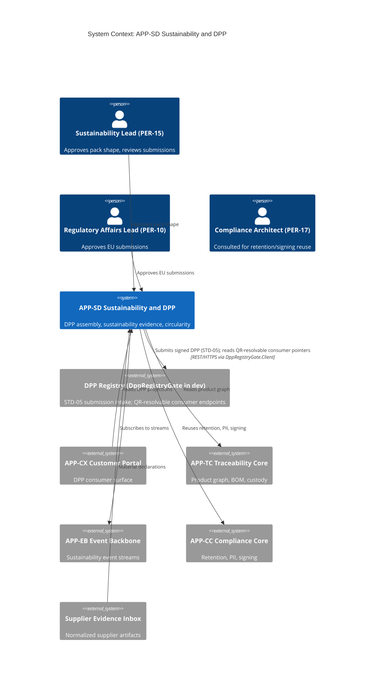
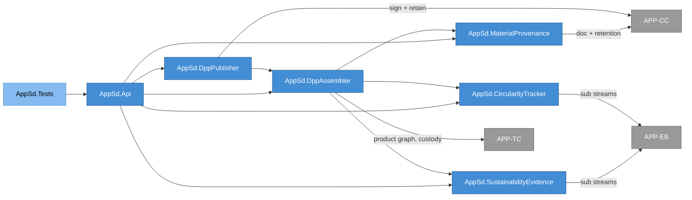
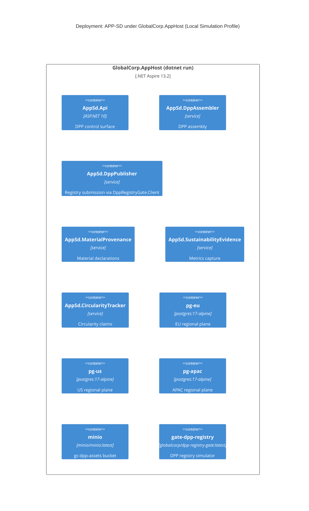
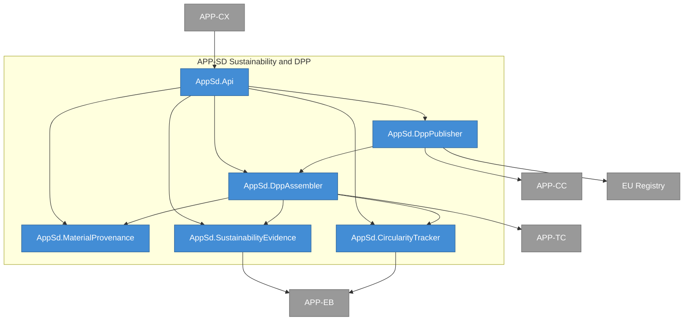
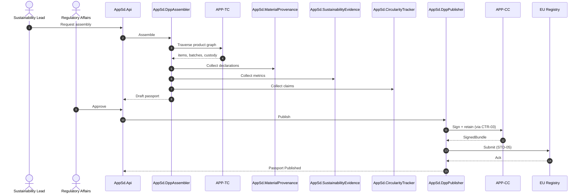
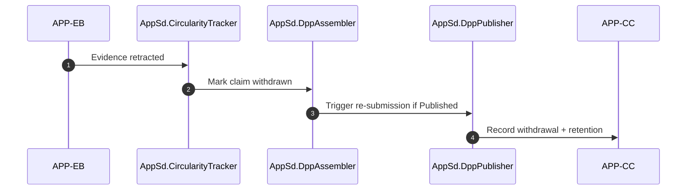

# APP-SD Sustainability and DPP -- System Specification

## Tracking

| Field | Value |
|---|---|
| slug | app-sd-sustainability-dpp |
| itemType | SystemSpec |
| name | APP-SD Sustainability and DPP |
| version | 2 |
| specLangVersion | 0.1.0 |
| publishStatus | Draft |
| retentionPolicy | indefinite |
| freshnessSla | P180D |
| authors | [PER-15 Marcus Weber] |
| reviewers | [PER-01 Lena Brandt] |
| committer | PER-17 Isabelle Laurent |
| tags | [subsystem, regulatory, dpp, sustainability, app-sd, local-simulation-first, aspire] |
| createdAt | 2026-04-17T00:00:00Z |
| updatedAt | 2026-04-18T00:00:00Z |
| Dependencies | global-corp.manifest.md, global-corp.architecture.spec.md, aspire-apphost.spec.md, service-defaults.spec.md, dpp-registry-gate.spec.md, app-cc.compliance-core.spec.md |
| Profile | BTABOK |
| profileVersion | 0.1.0 |
| codlVersion | 0.2 |
| cadlVersion | 0.1 |

## 1. Purpose and Scope

APP-SD Sustainability and DPP is the system that assembles, validates, and publishes Digital Product Passports under the EU Ecodesign for Sustainable Products Regulation (STD-05), alongside broader sustainability reporting artifacts such as carbon-footprint evidence, recycled-content declarations, and end-of-life circularity data. It is a sibling of APP-CC Compliance Core. Both enforce the separation mandated by ASD-05. Both preserve lineage to source evidence per P-04. They differ in regulatory regime: APP-CC covers audit and food-traceability regimes, APP-SD covers the DPP and sustainability regimes.

APP-SD is the productization outcome of EXP-02 DPP Orchestration for Electronics Category, which concluded with a proceed decision. The service uses the canonical product graph held in APP-TC as its authoritative source. It does not mint new product identities, nor does it duplicate the event graph.

The primary responsibilities of APP-SD are:

1. Assemble Digital Product Passports from the APP-TC product graph, bill-of-materials, custody records, and supplier-provided evidence.
2. Capture sustainability evidence, including carbon footprint figures and material declarations, with lineage back to source measurements.
3. Track circularity data: recycled content, end-of-life outcomes, reuse and repair signals.
4. Publish DPPs to EU registry endpoints under the STD-05 submission protocol.
5. Delegate retention, signing, and PII controls to APP-CC, preserving ASD-05 separation while avoiding duplicate compliance plumbing.

Out of scope for this system: general analytics reporting (APP-DP), recall orchestration and auditor-facing exports (APP-CC), operational ETA and exceptions (APP-OI), partner onboarding (APP-PC).

APP-SD runs under the Aspire AppHost in the Local Simulation Profile defined by `aspire-apphost.spec.md`. Every authored APP-SD project composes into the AppHost alongside the `dpp-registry-gate` container, regional PostgreSQL instances, MinIO object storage, and the sibling `app-cc` and `app-tc` services. The cloud-deploy path is preserved: target endpoints and credentials swap through configuration, and the code does not change between Local Simulation and Cloud Production Profiles.

## 2. Context

```spec
person SustainabilityLead {
    slug: "per-15-sustainability-lead";
    description: "PER-15 Marcus Weber, Head of Sustainability. Owns APP-SD,
                  approves the sustainability evidence schema, and reviews
                  DPP submissions before release.";
    @tag("internal", "sustainability");
}

person RegulatoryAffairsLead {
    slug: "per-10-regulatory-affairs";
    description: "PER-10 Yuki Nakamura. Approves DPP publication packs for
                  EU submission and acts as sponsor of the productized
                  EXP-02 outcome.";
    @tag("internal", "compliance");
}

person ComplianceArchitect {
    slug: "per-17-compliance-architect";
    description: "PER-17 Isabelle Laurent. Owns APP-CC. Consulted for
                  retention and signing plumbing that APP-SD reuses via
                  APP-CC contracts.";
    @tag("internal", "architect");
}

external system DppRegistry {
    slug: "ext-dpp-registry";
    description: "EU Digital Product Passport registry surface under
                  STD-05. In the Local Simulation Profile this resolves
                  to DppRegistryGate, a containerized simulator. In the
                  Cloud Production Profile it resolves to the live EU
                  registry endpoint. The switch is configuration-driven;
                  the APP-SD code path is identical in both profiles.";
    technology: "REST/HTTPS, signed artifacts, QR-resolvable consumer endpoints";
    @tag("regulator", "external", "gated");
}

external system CustomerPortal {
    slug: "app-cx-customer-portal";
    description: "APP-CX. Consumes DPPs for customer-facing product pages
                  and end-consumer scannable QR codes.";
    technology: "internal service";
    @tag("internal", "sibling-app");
}

external system TraceabilityCore {
    slug: "app-tc-traceability-core";
    description: "APP-TC. Authoritative source of product graph, BOM,
                  custody records (ENT-15), and item/lot linkage. APP-SD
                  reads from APP-TC and never writes back.";
    technology: "internal service";
    @tag("internal", "sibling-app");
}

external system EventBackbone {
    slug: "app-eb-event-backbone";
    description: "APP-EB. Delivers sustainability-relevant event streams:
                  recycled-content declarations, emissions telemetry, end-
                  of-life returns.";
    technology: "internal service";
    @tag("internal", "sibling-app");
}

external system ComplianceCore {
    slug: "app-cc-compliance-core";
    description: "APP-CC. Provides retention policy enforcement, PII
                  guard, and regional signing through CTR-03 and sibling
                  contracts. APP-SD calls APP-CC for these concerns.";
    technology: "internal service";
    @tag("internal", "sibling-app");
}

external system SupplierEvidenceInbox {
    slug: "ext-supplier-evidence";
    description: "Inbound channel for supplier-submitted material
                  declarations, certifications, and LCA data. Mediated by
                  APP-PC at the edge; normalized documents land here.";
    technology: "internal service";
    @tag("internal", "edge");
}

SustainabilityLead -> AppSd.DppAssembler : "Approves pack shape, reviews submissions.";
RegulatoryAffairsLead -> AppSd.DppPublisher : "Approves regulator submissions.";
AppSd.DppAssembler -> TraceabilityCore : "Reads product graph and custody chain.";
AppSd.DppAssembler -> EventBackbone : "Subscribes to sustainability event streams.";
AppSd.DppPublisher -> DppRegistry {
    description: "Submits signed DPP artifact under STD-05. In
                  Local Simulation Profile this call terminates at
                  DppRegistryGate; in Cloud Production Profile it
                  terminates at the live EU registry endpoint.";
    technology: "REST/HTTPS via DppRegistryGate.Client";
};
CustomerPortal -> AppSd.DppAssembler : "Reads published DPP projections.";
AppSd.DppPublisher -> ComplianceCore : "Reuses retention, PII, signing via APP-CC contracts.";
SupplierEvidenceInbox -> AppSd.MaterialProvenance : "Normalized material declarations and certifications.";
```

Rendered system context:



## 3. System Declaration

```spec
system AppSd {
    slug: "app-sd-sustainability-dpp";
    target: "net10.0";
    responsibility: "Digital Product Passport assembly, sustainability
                     evidence capture, material provenance, and
                     circularity reporting. Publishes DPPs to EU registry
                     endpoints under STD-05. Reuses APP-CC for retention,
                     PII, and signing per ASD-05.";

    authored component AppSd.DppAssembler {
        kind: service;
        path: "src/AppSd.DppAssembler";
        status: new;
        responsibility: "Composes a Digital Product Passport by traversing
                         the APP-TC product graph. Joins item/serial,
                         batch/lot, and product records with material
                         declarations, sustainability metrics, and
                         custody records. Produces a ProductPassport
                         read-projection keyed by product identity.";
        contract {
            guarantees "Assembly is deterministic for a given APP-TC
                        snapshot. Two runs over the same snapshot produce
                        byte-identical passports.";
            guarantees "Every field that contributes to the passport
                        carries a lineage pointer back to a source event
                        or document (P-04).";
            guarantees "Assembly never writes to APP-TC.";
        }
        rationale {
            context "EXP-02 concluded that a DPP assembly service using
                     the canonical product graph produces audit-ready DPPs
                     substantially faster than manual compilation. The
                     productization path required a dedicated assembler.";
            decision "AppSd.DppAssembler is the single authority for DPP
                      shape. Other consumers read its projections but do
                      not assemble their own DPPs.";
            consequence "Changes to the EU DPP schema land in this
                         component and flow out through the projection.
                         Consumers do not need to re-implement DPP logic.";
        }
    }

    authored component AppSd.MaterialProvenance {
        kind: service;
        path: "src/AppSd.MaterialProvenance";
        status: new;
        responsibility: "Tracks material-level provenance: bill of
                         materials, supplier chain, country of origin,
                         certifications. Normalizes supplier-submitted
                         declarations into MaterialDeclaration records.
                         Stores material declaration binary attachments
                         (spec sheets, certification PDFs) in the MinIO
                         bucket gc-dpp-assets per the APP-DP bucket
                         layout.";
        contract {
            guarantees "Every MaterialDeclaration links to an originating
                        Document (ENT-14) held by APP-CC and carries a
                        lineage pointer.";
            guarantees "Supplier chain depth is preserved. A tier-3
                        supplier declaration is not flattened into the
                        tier-1 relationship.";
            guarantees "Attachment payloads are written to the
                        gc-dpp-assets MinIO bucket; the MaterialDeclaration
                        record holds the object key, not the payload.";
        }
    }

    authored component AppSd.SustainabilityEvidence {
        kind: service;
        path: "src/AppSd.SustainabilityEvidence";
        status: new;
        responsibility: "Captures carbon footprint figures, recycled-
                         content percentages, and environmental evidence
                         per product, per batch, or per shipment. Holds
                         SustainabilityMetric records with unit,
                         methodology, and measurement window.";
        contract {
            guarantees "Every metric value carries a methodology reference
                        and a measurement window.";
            guarantees "Metrics are versioned. Updating a metric produces
                        a new version rather than overwriting.";
        }
    }

    authored component AppSd.CircularityTracker {
        kind: service;
        path: "src/AppSd.CircularityTracker";
        status: new;
        responsibility: "Tracks end-of-life outcomes, reuse and repair
                         events, and recycled-feedstock contributions.
                         Subscribes to APP-EB streams carrying take-back
                         and refurbishment signals. The conceptual
                         decomposition of circularity claims and their
                         supporting event chains is unchanged from
                         version 1; only the transport and storage
                         substrate is made explicit: event-stream
                         subscriptions resolve to Redis Streams in the
                         Local Simulation Profile, and claim state
                         lands in the regional PostgreSQL data plane.";
        contract {
            guarantees "Circularity claims reflected in a DPP are backed
                        by event chains in APP-TC with custody linkage.";
            guarantees "Claims that lose their supporting evidence are
                        automatically withdrawn from downstream
                        projections.";
        }
    }

    authored component AppSd.DppPublisher {
        kind: service;
        path: "src/AppSd.DppPublisher";
        status: new;
        responsibility: "Publishes signed DPP artifacts to the DPP
                         registry surface under STD-05. Calls the
                         registry through DppRegistryGate.Client in the
                         Local Simulation Profile and through the same
                         client against the live EU registry endpoint
                         in the Cloud Production Profile; the swap is
                         configuration-driven. Delegates the signing
                         step and the retention policy for the retained
                         submission record to APP-CC.";
        contract {
            guarantees "No DPP is published without a PER-10 approval
                        record attached.";
            guarantees "Signing is performed through APP-CC so that the
                        regional-key discipline enforced there applies
                        identically to DPP submissions.";
            guarantees "Failed publications are retried with backoff up
                        to a configured bound, then escalated to PER-15.";
            guarantees "All registry traffic flows through
                        DppRegistryGate.Client so that the Local
                        Simulation Profile and the Cloud Production
                        Profile share one code path and differ only in
                        the configured registry base URL and
                        credentials.";
        }
        rationale {
            context "GATE-DPP (dpp-registry-gate.spec.md) defines a
                     stub/record/replay/fault-inject registry simulator
                     used during local development and CI. Coupling
                     APP-SD directly to the live EU endpoint would make
                     local runs depend on EU network reachability and
                     would prevent fault-injection testing.";
            decision "AppSd.DppPublisher depends on DppRegistryGate.Client
                      rather than on a bespoke HTTP client pointed at
                      the EU endpoint. Configuration selects the base
                      URL and credentials per deployment profile.";
            consequence "The Local Simulation Profile runs end-to-end
                         DPP publication flows against the gate; Cloud
                         Production Profile uses the same code against
                         the live registry. CI coverage of registry
                         interactions is deterministic.";
        }
    }

    authored component AppSd.Api {
        kind: "api-host";
        path: "src/AppSd.Api";
        status: new;
        responsibility: "ASP.NET 10 minimal API for APP-SD. Hosts DPP read
                         endpoints for APP-CX, publication-control
                         endpoints for PER-10, and administrative
                         endpoints for pack and schema management.";
    }

    authored component AppSd.Tests {
        kind: tests;
        path: "tests/AppSd.Tests";
        status: new;
        responsibility: "Integration and unit tests. Includes fixtures
                         derived from the EXP-02 electronics category
                         dataset for regression of DPP shape.";
    }

    consumed component AppTcClient {
        source: internal("AppTc.Client");
        responsibility: "Client library for APP-TC. Used to traverse the
                         product graph and pull custody records.";
        used_by: [AppSd.DppAssembler, AppSd.MaterialProvenance,
                  AppSd.CircularityTracker];
    }

    consumed component AppCcClient {
        source: internal("AppCc.Client");
        responsibility: "Client library for APP-CC. Used to obtain
                         retention classes, PII filtering, and signing
                         for DPP submissions.";
        used_by: [AppSd.DppPublisher, AppSd.MaterialProvenance];
    }

    consumed component AppEbClient {
        source: internal("AppEb.Client");
        responsibility: "Client library for APP-EB. Used to subscribe to
                         sustainability and circularity event streams.";
        used_by: [AppSd.SustainabilityEvidence, AppSd.CircularityTracker];
    }

    consumed component DppRegistryGateClient {
        source: internal("DppRegistryGate.Client");
        responsibility: "Typed .NET client wrapping the DPP registry
                         HTTP surface defined by dpp-registry-gate.spec.md.
                         Issues submissions, polls acknowledgements, and
                         resolves QR-resolvable consumer pointers for
                         dev and testing flows. Configured in Local
                         Simulation Profile to target the
                         gate-dpp-registry container; configured in
                         Cloud Production Profile to target the live
                         EU registry endpoint.";
        used_by: [AppSd.DppPublisher];
    }

    consumed component GlobalCorp.ServiceDefaults {
        source: internal("GlobalCorp.ServiceDefaults");
        responsibility: "Shared OpenTelemetry, health check, resilience,
                         and service-discovery wiring contributed to
                         every APP-SD project per service-defaults.spec.md.";
        used_by: [AppSd.Api, AppSd.DppAssembler, AppSd.DppPublisher,
                  AppSd.MaterialProvenance, AppSd.SustainabilityEvidence,
                  AppSd.CircularityTracker];
    }

    consumed component MinioClient {
        source: nuget("Minio");
        responsibility: "S3-compatible client for the gc-dpp-assets
                         bucket in MinIO. Holds DPP binary attachments
                         (spec sheets, certification PDFs, bill-of-
                         materials exports) referenced by
                         ProductPassport material declarations.";
        used_by: [AppSd.MaterialProvenance, AppSd.DppAssembler];
    }

    consumed component PackagePolicy {
        source: weakRef<PackagePolicy>(GlobalCorpPolicy);
        responsibility: "Inherits the enterprise package policy from
                         global-corp.architecture.spec.md. APP-SD adds
                         no subsystem-local NuGet allowances. Rationale:
                         APP-SD has no UI surface of its own, so the
                         charting and CSS-framework denials do not apply
                         directly; storage, observability, testing,
                         platform, and Aspire allowances cover every
                         APP-SD dependency.";
    }
}
```

## 4. Topology

```spec
topology Dependencies {
    allow AppSd.Api -> AppSd.DppAssembler;
    allow AppSd.Api -> AppSd.DppPublisher;
    allow AppSd.Api -> AppSd.MaterialProvenance;
    allow AppSd.Api -> AppSd.SustainabilityEvidence;
    allow AppSd.Api -> AppSd.CircularityTracker;

    allow AppSd.DppAssembler -> AppSd.MaterialProvenance;
    allow AppSd.DppAssembler -> AppSd.SustainabilityEvidence;
    allow AppSd.DppAssembler -> AppSd.CircularityTracker;
    allow AppSd.DppPublisher -> AppSd.DppAssembler;

    deny AppSd.MaterialProvenance -> AppSd.DppAssembler;
    deny AppSd.SustainabilityEvidence -> AppSd.DppAssembler;
    deny AppSd.CircularityTracker -> AppSd.DppAssembler;
    deny AppSd.DppAssembler -> AppSd.DppPublisher;

    invariant "no direct signing in APP-SD":
        AppSd.* does not perform signing operations directly;
    invariant "no retention logic in APP-SD":
        AppSd.* does not implement retention policy locally;
    invariant "no analytics coupling":
        AppSd.* does not reference AppDp.*;

    rationale {
        context "ASD-05 Keep compliance services separate from general
                 analytics. Retention, PII, and signing must live in
                 APP-CC. APP-SD must not reimplement these concerns.";
        decision "Topology denies direct signing in APP-SD and requires
                  the AppCcClient mediation path. Analytics coupling is
                  denied to preserve DPP reproducibility.";
        consequence "APP-SD stays focused on DPP shape, sustainability
                     evidence, and publication. Retention and signing
                     changes propagate through APP-CC only.";
    }
}
```

Rendered topology:



## 5. Data

### 5.1 Enums

```spec
enum DppState {
    Draft: "DPP under assembly",
    ReadyForReview: "Assembly complete, awaiting PER-10 approval",
    Approved: "Approved for publication",
    Published: "Submitted to EU registry",
    Withdrawn: "Published DPP withdrawn due to evidence loss or update"
}

enum SustainabilityMetricKind {
    CarbonFootprint: "kg CO2e per functional unit",
    RecycledContent: "percent recycled material by mass",
    WaterUse: "liters per functional unit",
    EnergyUse: "kWh per functional unit",
    HazardousContent: "presence of declared hazardous substances"
}

enum MaterialCertification {
    None: "No certification claimed",
    FscChainOfCustody: "Forest Stewardship Council chain of custody",
    Rohs: "RoHS compliant declaration",
    Reach: "REACH compliance declaration",
    Iso14001: "ISO 14001 environmental management",
    RecycledContentVerified: "Independently verified recycled content"
}

enum CircularityOutcome {
    Reused: "Item reused through refurbishment",
    Repaired: "Item repaired and returned to service",
    RecycledMaterial: "End-of-life material recovered",
    Disposed: "Item disposed with no recovery",
    Unknown: "Outcome not yet determined"
}
```

### 5.2 Entities

```spec
entity ProductPassport {
    slug: "product-passport";
    id: PassportId;
    productRef: ref<Product>;
    state: DppState @default(Draft);
    assembledAt: UtcInstant;
    schemaVersion: string;
    sourceItems: list<ref<Item>>;
    sourceBatches: list<ref<Batch>>;
    custodyTrail: list<ref<CustodyRecord>>;
    materialDeclarations: list<ref<MaterialDeclaration>>;
    sustainabilityMetrics: list<ref<SustainabilityMetric>>;
    circularityClaims: list<CircularityClaim>;
    lineagePointers: list<ref<LineagePointer>>;
    publisherSubmissionRef: weakRef<DppSubmission>?;
    retentionClassRef: ref<RetentionClass>;
    approvedBy: ref<Person>?;
    approvedAt: UtcInstant?;

    invariant "product required": productRef != null;
    invariant "schema set": schemaVersion != "";
    invariant "approval before publish":
        state in [Approved, Published] implies approvedBy != null;
    invariant "retention resolved":
        retentionClassRef != null;
    invariant "lineage present":
        count(lineagePointers) > 0;

    rationale "lineagePointers" {
        context "P-04 requires every externally significant state to be
                 explainable from retained evidence. A DPP that can be
                 published to the EU registry is externally significant.";
        decision "ProductPassport carries an explicit list of lineage
                  pointers covering items, batches, metrics, and material
                  declarations.";
        consequence "Consumers can resolve any DPP field back to its
                     source event or document without round-tripping
                     through analytics.";
    }
}

entity SustainabilityMetric {
    slug: "sustainability-metric";
    id: MetricId;
    productRef: ref<Product>;
    kind: SustainabilityMetricKind;
    value: decimal;
    unit: string;
    methodology: string;
    measurementWindow: TimeRange;
    version: int @default(1);
    lineagePointer: ref<LineagePointer>;

    invariant "value in range":
        (kind == RecycledContent implies value >= 0 and value <= 100) and
        (kind != RecycledContent implies value >= 0);
    invariant "methodology required": methodology != "";
    invariant "window required": measurementWindow != null;
}

entity MaterialDeclaration {
    slug: "material-declaration";
    id: DeclarationId;
    productRef: ref<Product>;
    supplierRef: ref<Organization>;
    material: string;
    countryOfOrigin: string;
    certifications: list<MaterialCertification>;
    tierDepth: int;
    sourceDocumentRef: ref<Document>;
    lineagePointer: ref<LineagePointer>;

    invariant "material required": material != "";
    invariant "supplier required": supplierRef != null;
    invariant "tier positive": tierDepth >= 1;
    invariant "source document required": sourceDocumentRef != null;
}

entity DppSubmission {
    slug: "dpp-submission";
    id: SubmissionId;
    passportRef: ref<ProductPassport>;
    registryEndpoint: string;
    submittedAt: UtcInstant;
    signedBundleRef: ref<SignedBundle>;
    acknowledgementRef: string?;
    status: SubmissionStatus;

    invariant "signed bundle required": signedBundleRef != null;
    invariant "endpoint required": registryEndpoint != "";
}

entity CircularityClaim {
    slug: "circularity-claim";
    id: ClaimId;
    subjectRef: SubjectRef;
    outcome: CircularityOutcome;
    recordedAt: UtcInstant;
    evidenceEventRef: weakRef<Event>;

    invariant "evidence event required for non-Unknown":
        outcome != Unknown implies evidenceEventRef != null;
}

entity LineagePointer {
    slug: "lineage-pointer";
    id: LineageId;
    eventId: weakRef<Event>;
    documentRef: weakRef<Document>?;
    invariant "at least one source":
        eventId != null or documentRef != null;
}
```

### 5.3 Contracts

```spec
contract AssembleDpp {
    slug: "assemble-dpp";
    requires product.state == Active;
    requires count(product.items) >= 0;
    ensures passport.state == Draft;
    ensures count(passport.lineagePointers) > 0;
    guarantees "Produces a DPP from the current APP-TC snapshot. The
                result is deterministic for that snapshot. Lineage
                pointers cover every populated field.";
}

contract PublishDpp {
    slug: "publish-dpp";
    requires passport.state == Approved;
    requires passport.approvedBy != null;
    requires passport.retentionClassRef != null;
    ensures submission.status in [Accepted, Rejected];
    ensures submission.signedBundleRef != null;
    guarantees "Signing is performed through APP-CC. A retention record
                is created for the submission. On acceptance the passport
                transitions to Published. On rejection the passport
                remains Approved and an incident is raised to PER-15.";
}

contract ReadDpp {
    slug: "read-dpp";
    requires passport.state in [Published, Approved];
    ensures result.passport != null;
    guarantees "Returns the DPP projection for APP-CX or regulator
                readers. PII filtering is delegated to APP-CC PiiGuard
                before the projection is returned to any external
                consumer.";
}

contract ResolveConsumerDppPointer {
    slug: "resolve-consumer-dpp-pointer";
    requires pointer.qrToken != "";
    ensures result.passport != null or result.status == "NotFound";
    guarantees "Resolves a QR-encoded consumer DPP pointer through the
                DPP registry surface. In the Local Simulation Profile
                the lookup terminates at DppRegistryGate's QR-resolvable
                consumer endpoints, which allow dev and test workflows
                to exercise scannable consumer pages without the live EU
                registry. In the Cloud Production Profile the same
                lookup terminates at the live EU registry. The response
                shape is identical across profiles.";
}

contract RecordMaterialDeclaration {
    slug: "record-material-declaration";
    requires supplier != null;
    requires sourceDocument != null;
    ensures declaration.lineagePointer != null;
    guarantees "Stores a MaterialDeclaration linked to a Document in
                APP-CC. The document is retained under the jurisdiction
                pack governing the supplier's region.";
}
```

## 6. Deployment

APP-SD exposes two deployment profiles. The Local Simulation Profile is primary and fully exercised; the Cloud Production Profile is deferred and documented as the long-term target.

### 6.1 Local Simulation Profile (primary)

```spec
deployment LocalSimulationProfile {
    profile: "local-simulation";
    host: ref<AspireAppHost>("GlobalCorp.AppHost");

    node "GlobalCorp.AppHost (dotnet run)" {
        technology: ".NET Aspire 13.2, net10.0";

        instance: AppSd.Api;
        instance: AppSd.DppAssembler;
        instance: AppSd.DppPublisher;
        instance: AppSd.MaterialProvenance;
        instance: AppSd.SustainabilityEvidence;
        instance: AppSd.CircularityTracker;

        resource "pg-eu" {
            kind: "postgres-container";
            image: "postgres:17-alpine";
            responsibility: "Regional PostgreSQL data plane simulating
                             the EU region. Holds APP-SD passport state,
                             material declarations, sustainability
                             metrics, and circularity claims for EU
                             tenants.";
        }
        resource "pg-us" {
            kind: "postgres-container";
            image: "postgres:17-alpine";
            responsibility: "Regional PostgreSQL data plane simulating
                             the US region.";
        }
        resource "pg-apac" {
            kind: "postgres-container";
            image: "postgres:17-alpine";
            responsibility: "Regional PostgreSQL data plane simulating
                             the APAC region.";
        }
        resource "minio" {
            kind: "object-store-container";
            image: "minio/minio:latest";
            responsibility: "S3-compatible object storage. APP-SD uses
                             the gc-dpp-assets bucket for DPP binary
                             attachments per the APP-DP bucket layout.";
        }
        resource "gate-dpp-registry" {
            kind: "gate-container";
            image: "globalcorp/dpp-registry-gate:latest";
            responsibility: "DPP registry simulator defined by
                             dpp-registry-gate.spec.md. Terminates every
                             AppSd.DppPublisher submission, supports
                             stub/record/replay/fault-inject modes, and
                             exposes the QR-resolvable consumer
                             endpoints used for dev-time DPP lookups.";
        }
    }

    config "registry endpoint" {
        responsibility: "Aspire parameter resource or configuration key
                         DppRegistry:BaseUrl. Defaults to the Aspire
                         service URL for gate-dpp-registry in the Local
                         Simulation Profile.";
    }

    rationale {
        context "Rule 1 (local simulation first) and Rule 7 (all
                 external subsystems in Docker containers locally) in
                 the Global Corp Platform Implementation Brief. APP-SD
                 must run end-to-end on a developer workstation before
                 any cloud deployment.";
        decision "Every APP-SD component composes into GlobalCorp.AppHost.
                  Regional PostgreSQL containers, MinIO, and the DPP
                  registry gate are declared as AppHost resources.
                  APP-CC and APP-TC are consumed as sibling projects
                  under the same AppHost. No external network is
                  required for a full DPP assembly and publication run.";
        consequence "A dotnet run against GlobalCorp.AppHost starts APP-SD
                     alongside its dependencies. Registry submissions
                     terminate at the gate; regional key discipline is
                     preserved by configuration pointing APP-CC at the
                     pg-eu plane for EU-destined submissions.";
    }
}
```

### 6.2 Cloud Production Profile (deferred)

```spec
deployment CloudProductionProfile {
    profile: "cloud-production";
    status: deferred;

    node "Global Control Plane" {
        technology: "Kubernetes";
        node "DPP Schema Registry" {
            instance: AppSd.DppAssembler;
            responsibility: "Schema registry metadata only. Does not hold
                             passport content or source evidence.";
        }
    }

    node "EU Data Plane" {
        technology: "regional primary";
        instance: AppSd.Api;
        instance: AppSd.DppAssembler;
        instance: AppSd.DppPublisher;
        instance: AppSd.MaterialProvenance;
        instance: AppSd.SustainabilityEvidence;
        instance: AppSd.CircularityTracker;
        responsibility: "Primary DPP plane. EU registry submissions
                         originate here. Regional signing via APP-CC EU
                         plane.";
    }

    node "US Data Plane" {
        technology: "regional read/assembly";
        instance: AppSd.Api;
        instance: AppSd.DppAssembler;
        instance: AppSd.MaterialProvenance;
        instance: AppSd.SustainabilityEvidence;
        instance: AppSd.CircularityTracker;
        responsibility: "US-resident product lines assemble DPP locally.
                         EU-destined publication is routed through the EU
                         plane to preserve regional key discipline.";
    }

    node "APAC Data Plane" {
        technology: "regional read/assembly";
        instance: AppSd.Api;
        instance: AppSd.DppAssembler;
        instance: AppSd.MaterialProvenance;
        instance: AppSd.SustainabilityEvidence;
        instance: AppSd.CircularityTracker;
    }

    config "registry endpoint" {
        responsibility: "DppRegistry:BaseUrl points to the live EU DPP
                         registry. DppRegistryGate.Client is retained as
                         the typed client because its contract matches
                         the live registry surface; only base URL and
                         credentials differ.";
    }

    rationale {
        context "STD-05 submissions target EU endpoints and require EU
                 regional keys, which live in the EU APP-CC plane. APP-SD
                 must not duplicate signing infrastructure.";
        decision "DPP publication runs only from the EU plane. Other
                  regions assemble DPPs locally and route publication
                  through the EU plane via APP-CC.";
        consequence "Non-EU regions can build DPPs for their own product
                     lines without requiring EU-resident data, but
                     publication to the EU registry is centralized.
                     Cloud rollout is a configuration change from the
                     Local Simulation Profile, not a rewrite.";
    }
}
```

Rendered deployment (Local Simulation Profile):



## 7. Views

```spec
view systemContext of AppSd ContextView {
    slug: "app-sd-context-view";
    include: all;
    autoLayout: top-down;
    description: "APP-SD with internal persons (PER-15, PER-10, PER-17)
                  and external systems: EU registry, APP-CX, APP-TC,
                  APP-EB, APP-CC, supplier evidence inbox.";
}

view container of AppSd ContainerView {
    slug: "app-sd-container-view";
    include: all;
    autoLayout: left-right;
    description: "Internal structure: DppAssembler, DppPublisher,
                  MaterialProvenance, SustainabilityEvidence,
                  CircularityTracker, Api with allowed and denied
                  references.";
}

view deployment of RegionalDppPlane RegionalPlaneView {
    slug: "app-sd-regional-plane-view";
    include: all;
    autoLayout: top-down;
    description: "EU plane as primary with publisher. US and APAC planes
                  assemble locally. Publication centralized at EU plane.";
    @tag("deployment", "regional");
}

view dynamic of DppPublicationFlow DppPublicationView {
    slug: "app-sd-dpp-publication-view";
    include: all;
    autoLayout: top-down;
    description: "End-to-end publication of a DPP, including the hop
                  through APP-CC for signing and retention.";
    @tag("dynamic");
}
```

Rendered container view:



## 8. Dynamics

### 8.1 DPP assembly and publication

```spec
dynamic DppPublicationFlow {
    slug: "dpp-publication-flow";
    1: SustainabilityLead -> AppSd.Api {
        description: "Requests DPP assembly for a product.";
        technology: "REST/HTTPS";
    };
    2: AppSd.Api -> AppSd.DppAssembler
        : "Delegates assembly.";
    3: AppSd.DppAssembler -> TraceabilityCore
        : "Traverses product graph and custody records.";
    4: TraceabilityCore -> AppSd.DppAssembler
        : "Returns items, batches, custody trail, events.";
    5: AppSd.DppAssembler -> AppSd.MaterialProvenance
        : "Collects material declarations and certifications.";
    6: AppSd.DppAssembler -> AppSd.SustainabilityEvidence
        : "Collects versioned sustainability metrics.";
    7: AppSd.DppAssembler -> AppSd.CircularityTracker
        : "Collects circularity claims backed by custody events.";
    8: AppSd.DppAssembler -> AppSd.Api
        : "Returns ProductPassport in state Draft.";
    9: RegulatoryAffairsLead -> AppSd.Api {
        description: "Reviews and approves the passport.";
        technology: "REST/HTTPS";
    };
    10: AppSd.Api -> AppSd.DppPublisher
        : "Publishes approved passport.";
    11: AppSd.DppPublisher -> ComplianceCore
        : "Requests regional signing and retention registration via APP-CC
           CTR-03 plumbing.";
    12: ComplianceCore -> AppSd.DppPublisher
        : "Returns signed bundle reference.";
    13: AppSd.DppPublisher -> DppRegistry {
        description: "Submits signed DPP under STD-05. Call is issued
                      through DppRegistryGate.Client; target endpoint
                      resolves to DppRegistryGate in Local Simulation
                      Profile and to the live EU registry in Cloud
                      Production Profile.";
        technology: "REST/HTTPS via DppRegistryGate.Client";
    };
    14: DppRegistry -> AppSd.DppPublisher
        : "Acknowledgement.";
    15: AppSd.DppPublisher -> AppSd.Api
        : "Transitions passport to Published with submission reference.";
}
```

Rendered sequence:



### 8.2 Circularity claim withdrawal

```spec
dynamic CircularityClaimWithdrawal {
    slug: "circularity-withdrawal";
    1: EventBackbone -> AppSd.CircularityTracker
        : "Evidence event retracted upstream (for example, a refurbishment
           event invalidated).";
    2: AppSd.CircularityTracker -> AppSd.DppAssembler
        : "Marks claim withdrawn in any passport projection referencing it.";
    3: AppSd.DppAssembler -> AppSd.DppPublisher
        : "If passport is Published, triggers re-submission workflow.";
    4: AppSd.DppPublisher -> ComplianceCore
        : "Records withdrawal event with retention for the original
           submission.";
}
```

Rendered sequence:



## 9. BTABOK Traces

```spec
trace AsrTrace {
    slug: "app-sd-asr-trace";
    ref<ASRCard>("ASR-02") -> [AppSd.DppAssembler, AppSd.MaterialProvenance,
                               AppSd.SustainabilityEvidence,
                               AppSd.CircularityTracker];
    ref<ASRCard>("ASR-07") -> [AppSd.DppAssembler, AppSd.MaterialProvenance];

    invariant "every authored component traces to at least one ASR":
        all AppSd.* have count(inbound asr traces) >= 1;
}

trace AsdTrace {
    slug: "app-sd-asd-trace";
    ref<DecisionRecord>("ASD-04") -> [AppSd.DppAssembler,
                                      AppSd.MaterialProvenance,
                                      AppSd.SustainabilityEvidence];
    ref<DecisionRecord>("ASD-05") -> [AppSd.DppPublisher, AppSd.DppAssembler];
}

trace PrincipleTrace {
    slug: "app-sd-principle-trace";
    ref<PrincipleCard>("P-04") -> [AppSd.DppAssembler,
                                   AppSd.MaterialProvenance,
                                   AppSd.SustainabilityEvidence,
                                   AppSd.CircularityTracker,
                                   AppSd.DppPublisher];
}

trace StandardTrace {
    slug: "app-sd-standard-trace";
    ref<StandardCard>("STD-05") -> [AppSd.DppAssembler, AppSd.DppPublisher];
}

trace ExperimentTrace {
    slug: "app-sd-experiment-trace";
    ref<ExperimentCard>("EXP-02") -> [AppSd.DppAssembler, AppSd.DppPublisher];
}

trace ContractTrace {
    slug: "app-sd-contract-trace";
    ref<Contract>("AssembleDpp") -> [AppSd.DppAssembler, AppSd.Api];
    ref<Contract>("PublishDpp") -> [AppSd.DppPublisher, AppSd.Api];
    ref<Contract>("ReadDpp") -> [AppSd.DppAssembler, AppSd.Api];
    ref<Contract>("RecordMaterialDeclaration") -> [AppSd.MaterialProvenance];
}
```

## 10. Cross-references

- Manifest: weakRef<Manifest>("global-corp.manifest")
- Enterprise architecture spec: weakRef<SystemSpec>("global-corp.architecture.spec")
- Platform specs:
  - weakRef<SystemSpec>("aspire-apphost") for AppHost composition
  - weakRef<SystemSpec>("service-defaults") for shared telemetry and resilience defaults
- Gate specs:
  - ref<SystemSpec>("dpp-registry-gate") for DPP registry simulator and QR-resolvable consumer endpoints (GATE-DPP)
- Sibling specs:
  - ref<SystemSpec>("app-cc-compliance-core") for retention, PII, and signing reuse
  - weakRef<SystemSpec>("app-tc-traceability-core") for product graph and custody
  - weakRef<SystemSpec>("app-eb-event-backbone") for sustainability event streams
  - weakRef<SystemSpec>("app-cx-customer-experience") for DPP consumer surface
  - weakRef<SystemSpec>("app-pc-partner-connectivity") for supplier ingestion
  - weakRef<SystemSpec>("app-dp-data-platform") for MinIO bucket layout including gc-dpp-assets
- Canonical entities referenced: ref<Entity>("ENT-10 Item"),
  ref<Entity>("ENT-11 Batch"), ref<Entity>("ENT-12 Product"),
  ref<Entity>("ENT-14 Document"), ref<Entity>("ENT-15 CustodyRecord"),
  ref<Entity>("ENT-13 Event")
- ASRs: ref<ASRCard>("ASR-02"), ref<ASRCard>("ASR-07")
- ASDs: ref<DecisionRecord>("ASD-04"), ref<DecisionRecord>("ASD-05")
- Principles: ref<PrincipleCard>("P-04")
- Standards: ref<StandardCard>("STD-05 EU Ecodesign SPR / DPP")
- Experiments: ref<ExperimentCard>("EXP-02 DPP Orchestration for Electronics")
- Dynamic: weakRef<Dynamic>("DYN-03 Compliance evidence export") for the shared
  signing path via APP-CC

## 11. Open Items

- Confirm final EU registry submission protocol and authentication scheme at the time STD-05 enters enforcement.
- Define the DPP schema versioning cadence relative to category rollouts beyond electronics (EXP-02 outcome was scoped to electronics).
- Decide whether material-declaration ingestion will stay behind APP-PC or gain a direct supplier self-service surface hosted by APP-SD under APP-ES identity.
