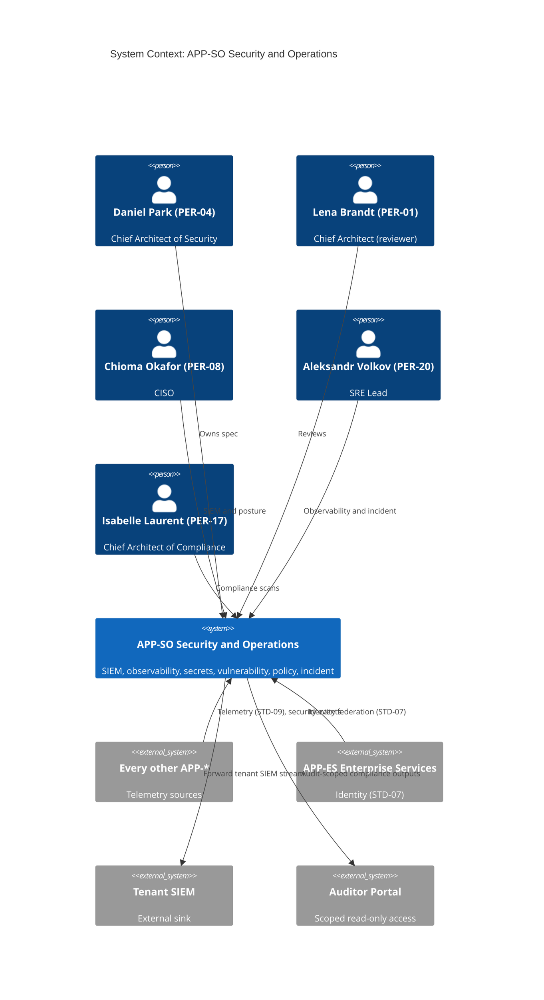
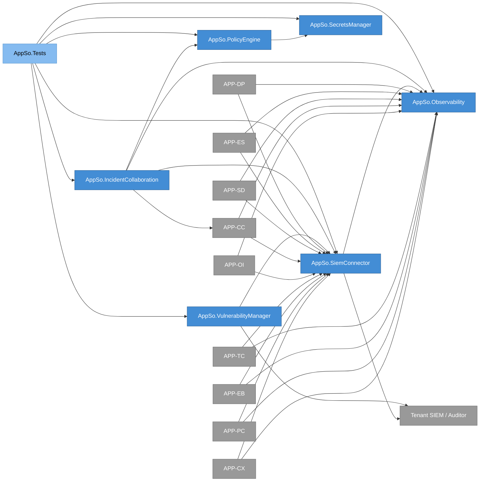
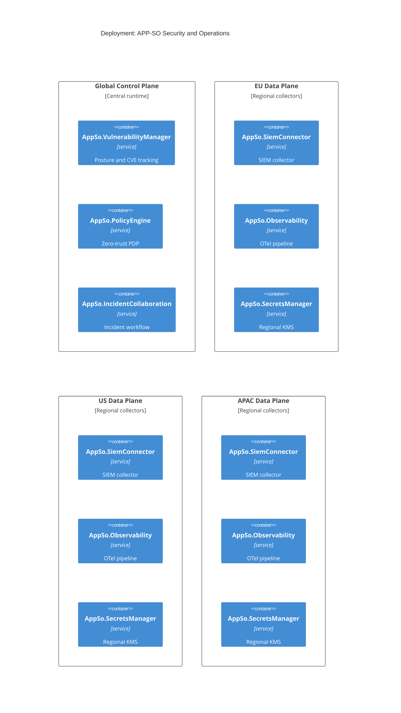
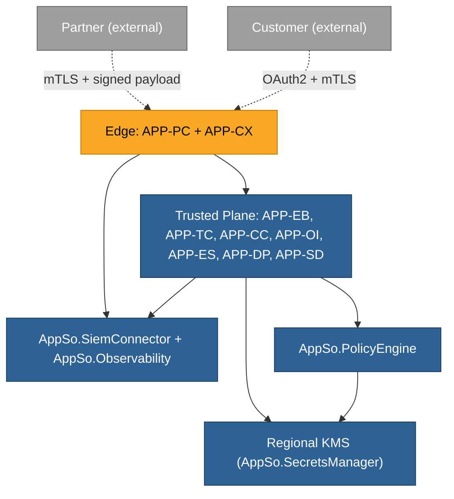
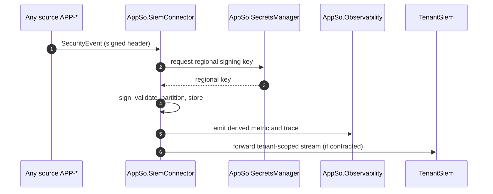
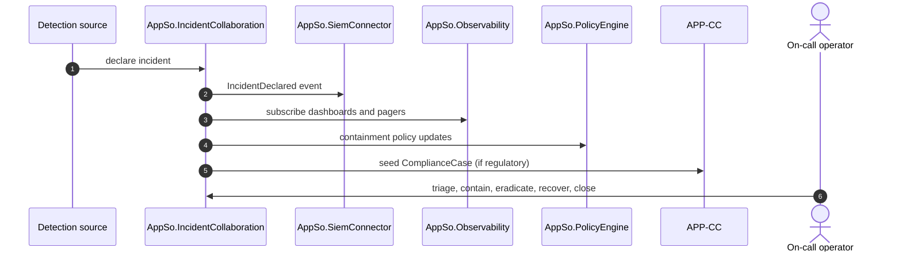

# APP-SO Security and Operations -- System Specification

## Tracking

| Field | Value |
|---|---|
| slug | app-so-security-operations |
| itemType | SystemSpec |
| name | APP-SO Security and Operations |
| version | 2 |
| specLangVersion | 0.1.0 |
| publishStatus | Draft |
| retentionPolicy | indefinite |
| freshnessSla | P180D |
| authors | [PER-04 Daniel Park] |
| reviewers | [PER-01 Lena Brandt] |
| committer | PER-04 Daniel Park |
| tags | [subsystem, platform-foundation, security, observability, app-so, local-simulation-first, aspire] |
| createdAt | 2026-04-17T00:00:00Z |
| updatedAt | 2026-04-18T00:00:00Z |
| Dependencies | global-corp.manifest.md, global-corp.architecture.spec.md, aspire-apphost.spec.md, service-defaults.spec.md |
| Profile | BTABOK |
| profileVersion | 0.1.0 |
| codlVersion | 0.2 |
| cadlVersion | 0.1 |

## 1. Purpose and Scope

APP-SO Security and Operations is the cross-cutting security, observability,
and operational-posture layer of the Global Corp. platform. It aggregates
security events into tenant-isolated SIEM streams, hosts centralized
observability for metrics, traces, and logs, manages regional secrets and
keys, tracks vulnerability and third-party posture, provides the zero-trust
policy decision point, and runs security incident collaboration.

The application is owned by PER-04 Daniel Park, Chief Architect of Security,
Singapore. Its primary BTABOK viewpoints are VP-07 Security and VP-08
Deployment. It implements principle P-10 (security includes the supply chain)
and supports ASR-02 (evidence integrity) and ASR-03 (regional data-residency
enforcement).

Every other application streams observability and security telemetry to
APP-SO; APP-SO is consumed by CISO (PER-08), SRE (PER-20), and audit teams.
APP-SO realizes BSVC-06 Exception and Incident Collaboration for security
incidents specifically, complementing APP-OI which owns operational
exceptions.

Scope includes:

- SIEM aggregation with tenant-isolated streams,
- centralized OpenTelemetry collection for metrics, traces, and logs,
- regional secrets and key management,
- vulnerability scanning and third-party posture tracking,
- zero-trust policy decision point,
- security incident workflow and collaboration,
- continuous compliance scanning support.

Out of scope:

- operational exception lifecycle (owned by APP-OI),
- regulatory compliance case assembly (owned by APP-CC),
- canonical event ingestion (owned by APP-EB),
- customer-visible service dashboards (owned by APP-CX).

### Local Simulation Profile Note

APP-SO runs under the `GlobalCorp.AppHost` Aspire project in the Local Simulation Profile. The AppHost launches AppSo.Api (which hosts SiemConnector, Observability, SecretsManager, VulnerabilityManager, PolicyEngine, and IncidentCollaboration in-process) and wires it to the Aspire Dashboard for observability and to Aspire parameter resources for secrets. Every other subsystem emits OpenTelemetry traces, metrics, and logs to the Aspire Dashboard via `GlobalCorp.ServiceDefaults`; APP-SO reads from the same stream rather than running a separate SIEM cluster in dev.

Per Constraint 2 (cloud-deployable code), the Cloud Production Profile is preserved as a configuration swap: the OpenTelemetry exporter points at a cloud OTLP collector, Aspire parameter resources resolve to a cloud KMS or Key Vault, and a production SIEM consumes the archived event stream. No rewrites are required to activate those destinations later; composition changes and configuration values differ, code does not.

## 2. Context Register

```spec
person DanielPark {
    slug: "per-04-daniel-park";
    description: "Chief Architect of Security, Singapore. Owner of
                  APP-SO and accountable for security architecture
                  controls across the platform.";
    @tag("architect", "owner");
}

person LenaBrandt {
    slug: "per-01-lena-brandt";
    description: "Chief Architect (enterprise), Zurich. Reviewer for
                  APP-SO.";
    @tag("architect", "reviewer");
}

person ChiomaOkafor {
    slug: "per-08-chioma-okafor";
    description: "CISO, Johannesburg. Primary executive consumer of
                  APP-SO alerts, dashboards, and posture reports.";
    @tag("executive", "consumer");
}

person AleksandrVolkov {
    slug: "per-20-aleksandr-volkov";
    description: "Platform SRE Lead, Zurich. Primary SRE consumer of
                  APP-SO observability and incident workflow.";
    @tag("sre", "consumer");
}

person IsabelleLaurent {
    slug: "per-17-isabelle-laurent";
    description: "Chief Architect of Compliance, Rotterdam. Consumer
                  of continuous compliance scan outputs.";
    @tag("architect", "consumer");
}

external system AppCx {
    slug: "app-cx-customer-experience";
    description: "Customer Experience. Emits observability and
                  security telemetry to APP-SO.";
    technology: "OpenTelemetry, STD-09";
    @tag("internal", "telemetry-source");
}

external system AppPc {
    slug: "app-pc-partner-connectivity";
    description: "Partner Connectivity. Emits observability and
                  security telemetry; consumer of mTLS profile
                  STD-08 and regional keys from APP-SO.";
    technology: "OpenTelemetry, mTLS, STD-08";
    @tag("internal", "telemetry-source");
}

external system AppEb {
    slug: "app-eb-event-backbone";
    description: "Event Backbone. Emits observability and security
                  telemetry.";
    technology: "OpenTelemetry, STD-09";
    @tag("internal", "telemetry-source");
}

external system AppTc {
    slug: "app-tc-traceability-core";
    description: "Traceability Core. Emits observability and
                  security telemetry.";
    technology: "OpenTelemetry, STD-09";
    @tag("internal", "telemetry-source");
}

external system AppOi {
    slug: "app-oi-operational-intelligence";
    description: "Operational Intelligence. Emits observability and
                  security telemetry.";
    technology: "OpenTelemetry, STD-09";
    @tag("internal", "telemetry-source");
}

external system AppCc {
    slug: "app-cc-compliance-core";
    description: "Compliance Core. Emits telemetry and consults
                  APP-SO for signing keys used in CTR-03.";
    technology: "OpenTelemetry, KMS";
    @tag("internal", "telemetry-source");
}

external system AppSd {
    slug: "app-sd-sustainability-dpp";
    description: "Sustainability and DPP. Emits observability and
                  security telemetry.";
    technology: "OpenTelemetry, STD-09";
    @tag("internal", "telemetry-source");
}

external system AppEs {
    slug: "app-es-enterprise-services";
    description: "Enterprise Services. Provides identity federation
                  for CISO and SRE consumer access to APP-SO.";
    technology: "OAuth/OIDC, STD-07";
    @tag("internal", "identity");
}

external system AppDp {
    slug: "app-dp-data-platform";
    description: "Data Platform. Emits telemetry and receives
                  security event archives for long-term retention.";
    technology: "OpenTelemetry, archival";
    @tag("internal", "telemetry-source");
}

external system TenantSiem {
    slug: "tenant-siem";
    description: "Per-tenant external SIEM destination, where the
                  tenant contract requires a SIEM forward. Cloud
                  Production Profile concern; in the Local
                  Simulation Profile the forward target is
                  substituted with an in-repo capture fixture
                  for test assertions.";
    technology: "syslog, HTTPS, S3";
    @tag("external", "sink", "cloud-production-profile");
}

external system AuditorPortal {
    slug: "auditor-portal";
    description: "External auditor read-only access to continuous
                  compliance scan outputs scoped to an audit.";
    technology: "HTTPS, OIDC";
    @tag("external", "consumer");
}

DanielPark -> AppSo : "Owns specification and security architecture
                      controls.";
LenaBrandt -> AppSo : "Reviews for enterprise architectural
                      coherence.";
ChiomaOkafor -> AppSo : "Consumes SIEM dashboards, posture reports,
                        and incident workflow.";
AleksandrVolkov -> AppSo : "Consumes observability dashboards, runs
                           incident response.";
IsabelleLaurent -> AppSo : "Consumes continuous compliance scan
                           outputs.";

AppCx -> AppSo : "Telemetry (STD-09)";
AppPc -> AppSo : "Telemetry (STD-09), uses mTLS profile (STD-08)";
AppEb -> AppSo : "Telemetry (STD-09)";
AppTc -> AppSo : "Telemetry (STD-09)";
AppOi -> AppSo : "Telemetry (STD-09)";
AppCc -> AppSo : "Telemetry; consults regional KMS for signing";
AppSd -> AppSo : "Telemetry (STD-09)";
AppDp -> AppSo : "Telemetry; archival destination for SIEM";

AppSo -> TenantSiem : "Forwards tenant-scoped security events when
                      contract requires it.";
AppSo -> AuditorPortal : "Publishes audit-scoped continuous
                         compliance scan outputs.";
AppEs -> AppSo : "Identity federation for CISO, SRE, and audit
                 access.";
```

Rendered system context:



## 3. System Declaration

```spec
system AppSo {
    slug: "app-so-security-operations";
    target: "net10.0";
    responsibility: "Cross-cutting security, observability, and
                     operational-posture layer. In the Local
                     Simulation Profile, APP-SO aggregates
                     security events into tenant-isolated event
                     streams, reads OpenTelemetry traces,
                     metrics, and logs from the Aspire Dashboard,
                     resolves secrets and key-material references
                     from Aspire parameter resources, tracks
                     vulnerability and third-party posture,
                     evaluates zero-trust policy decisions
                     in-process, and coordinates security
                     incident response. The Cloud Production
                     Profile targets a cloud OTLP collector, a
                     production SIEM, and a cloud KMS for the
                     same component surface via configuration
                     (Constraint 2).";

    authored component AppSo.SiemConnector {
        kind: service;
        path: "services/app-so/siem-connector";
        status: new;
        responsibility: "Aggregates security events from every other
                         app into tenant-isolated event streams. In
                         the Local Simulation Profile the streams
                         are persisted locally (PostgreSQL-backed)
                         and also surface on the Aspire Dashboard
                         through OpenTelemetry log exporters. In the
                         Cloud Production Profile, the same
                         component feeds an external SIEM via the
                         cloud OTLP collector and forwards
                         tenant-scoped streams to external tenant
                         SIEM destinations when a tenant contract
                         requires it.";
        contract {
            guarantees "Security events are partitioned by tenantId;
                        a tenant's events never mingle with another
                        tenant's stream.";
            guarantees "Every ingested security event retains its
                        source app, regional origin, and signed
                        timestamp.";
            guarantees "Forward destinations are resolved from
                        PartnerContract at ingestion time, not at
                        forward time, so contract changes propagate
                        predictably.";
            guarantees "In the Local Simulation Profile, every
                        event is visible through the Aspire
                        Dashboard logs surface by tenantId filter,
                        so a developer can inspect a tenant's
                        stream without a separate SIEM console.";
        }
    }

    authored component AppSo.Observability {
        kind: service;
        path: "services/app-so/observability";
        status: new;
        responsibility: "Configures and consumes the platform's
                         OpenTelemetry pipeline. In the Local
                         Simulation Profile the Aspire Dashboard is
                         the primary observability surface: every
                         APP-* project exports traces, metrics, and
                         logs through GlobalCorp.ServiceDefaults
                         (which configures the OTLP exporter), and
                         AppSo.Observability provides conventions,
                         dashboards, and query helpers on top of
                         that stream. No standalone SIEM cluster,
                         Prometheus cluster, or Grafana cluster is
                         assumed in dev. In the Cloud Production
                         Profile, the same OpenTelemetry instruments
                         export to a cloud OTLP collector and on to
                         the production observability stack via
                         configuration (Constraint 2).";
        contract {
            guarantees "All ingested telemetry conforms to STD-09
                        OpenTelemetry semantic conventions after
                        normalization.";
            guarantees "Trace correlation identifiers are preserved
                        end-to-end so a customer-visible request can
                        be reconstructed across apps.";
            guarantees "Log volume is rate-limited per tenant and per
                        source app with explicit drop telemetry when
                        limits are exceeded.";
            guarantees "In the Local Simulation Profile, the Aspire
                        Dashboard renders traces, metrics, and logs
                        without requiring any external 3rd-party
                        dashboard. Dashboards authored by AppSo live
                        as Aspire Dashboard resource views or as
                        Razor components in the shared UI library.";
        }

        rationale {
            context "Constraints 1 (local simulation first) and 3
                     (Aspire for all .NET orchestration) make the
                     Aspire Dashboard the natural primary
                     observability surface. A production-grade
                     SIEM, Prometheus, and Grafana cluster is
                     deferred and becomes a Cloud Production
                     Profile concern.";
            decision "OpenTelemetry.* is the instrumentation layer,
                      configured centrally by
                      GlobalCorp.ServiceDefaults. The OTLP exporter
                      targets the Aspire Dashboard in dev and a
                      cloud OTLP collector in production. Dashboards
                      authored by APP-SO are either Aspire
                      Dashboard resource views or Razor components
                      built from the authored chart primitives in
                      AppCx.UI.Charts (Constraint 6).";
            consequence "Every APP-* project emits the same shape
                         of telemetry in both profiles. Switching
                         from dev to cloud is a configuration
                         change on the OTLP exporter endpoint; no
                         APP-* code changes.";
        }
    }

    authored component AppSo.SecretsManager {
        kind: service;
        path: "services/app-so/secrets-manager";
        status: new;
        responsibility: "Region-aware secrets and key-material
                         management. In the Local Simulation
                         Profile, SecretsManager resolves secrets
                         and signing-key references from Aspire
                         parameter resources declared by
                         GlobalCorp.AppHost (one parameter set per
                         region). In the Cloud Production Profile,
                         the same references resolve to regional
                         cloud KMS or Key Vault instances via
                         configuration. Serves signing-key
                         references used by CTR-03 evidence
                         signing and by mTLS profile STD-08.";
        contract {
            guarantees "Keys never cross regional boundaries;
                        cross-region services obtain region-local
                        key references, not replicated keys.";
            guarantees "Secrets are issued with an expiry and
                        rotation policy; no perpetual secrets.";
            guarantees "Key usage is logged as a security event with
                        workload identity, purpose, and region.";
            guarantees "In dev, Aspire parameter resources are the
                        single source for key-material references;
                        no developer workstation holds real KMS
                        credentials.";
        }

        rationale {
            context "INV-06 requires PII not replicate outside
                     region unless a waiver authorizes it; keys
                     protect that boundary. The Local Simulation
                     Profile also requires that the platform boots
                     on a developer workstation without cloud KMS
                     credentials (Constraint 1).";
            decision "SecretsManager reads key-material references
                      from Aspire parameter resources in dev. Per
                      Constraint 2 the same references resolve to
                      regional cloud KMS in production via
                      configuration. Control-plane components
                      obtain keys through the SecretsManager
                      API, which wraps the resolver.";
            consequence "A regional compromise does not endanger
                         another region's key material in either
                         profile. Cloud KMS adoption becomes a
                         configuration change, not a rewrite.";
        }
    }

    authored component AppSo.VulnerabilityManager {
        kind: service;
        path: "services/app-so/vulnerability-manager";
        status: new;
        responsibility: "Tracks CVEs, patch posture, SBOM ingestion,
                         and third-party risk scoring for every
                         partner and for internal software supply
                         chain. Feeds partner onboarding reviews and
                         continuous compliance scanning.";
        contract {
            guarantees "Every internal deployable carries an SBOM on
                        record; a deployable without an SBOM is
                        flagged and blocked from production.";
            guarantees "Third-party risk scores are updated at least
                        weekly and exposed through the CISO
                        dashboard.";
            guarantees "CVE severity maps to a remediation SLA
                        configured per severity tier.";
        }
    }

    authored component AppSo.PolicyEngine {
        kind: service;
        path: "services/app-so/policy-engine";
        status: new;
        responsibility: "Zero-trust policy decision point. Runs
                         in-process within AppSo.Api. Evaluates
                         workload identity, request context, and
                         tenant entitlements for every cross-service
                         call, and returns allow or deny decisions
                         with reasons. Policy rules are stored
                         alongside APP-SO's data (PostgreSQL-backed
                         in the Local Simulation Profile), not in a
                         separate OPA or policy-as-a-service
                         cluster. Authorization policies exposed to
                         other subsystems are served through the
                         standard JWT bearer validation pipeline
                         configured by GlobalCorp.ServiceDefaults:
                         each APP-* project validates AppEs.Identity
                         -issued JWTs locally and then calls
                         PolicyEngine only for contextual decisions
                         beyond scope and claim checks.";
        contract {
            guarantees "Every policy decision carries a decisionId
                        that can be retrieved for audit.";
            guarantees "Decisions are expressed in a versioned policy
                        language; a decision records the policy
                        version that produced it.";
            guarantees "Policy evaluation is low-latency; p95 under
                        20ms under normal load.";
            guarantees "Subsystems that only need scope or claim
                        checks rely on the JWT bearer validation
                        pipeline from GlobalCorp.ServiceDefaults
                        and do not call PolicyEngine at all.";
        }

        rationale {
            context "Constraint 1 (local simulation first) makes a
                     separate policy-as-a-service cluster
                     undesirable in dev. The JWT bearer validation
                     pipeline in GlobalCorp.ServiceDefaults already
                     covers the common allow/deny cases (scope and
                     claim checks) for every APP-*, leaving
                     PolicyEngine for contextual decisions.";
            decision "PolicyEngine is in-process, backed by rules
                      stored alongside APP-SO's data. Policy
                      authoring is a REST surface on AppSo.Api.
                      Subsystems use GlobalCorp.ServiceDefaults for
                      JWT validation and call PolicyEngine only
                      when the decision depends on request context
                      beyond the token.";
            consequence "The Local Simulation Profile boots without
                         an external policy service. The Cloud
                         Production Profile can graduate
                         PolicyEngine into a standalone service
                         through an Aspire project split with no
                         consumer code changes.";
        }
    }

    authored component AppSo.IncidentCollaboration {
        kind: service;
        path: "services/app-so/incident-collaboration";
        status: new;
        responsibility: "Security incident workflow. Coordinates
                         triage, investigation, containment, and
                         post-incident review across CISO, SRE, and
                         app owners. Realizes BSVC-06 for security
                         incidents.";
        contract {
            guarantees "Every incident records detection source,
                        declared severity, on-call identities, and a
                        timeline of actions.";
            guarantees "Incidents with regulatory implications seed a
                        ComplianceCase handle in APP-CC.";
            guarantees "Post-incident reviews are mandatory for
                        High and Critical severities and are linked
                        to the originating incident.";
        }
    }

    authored component AppSo.Tests {
        kind: tests;
        path: "tests/app-so";
        status: new;
        responsibility: "Unit, integration, and contract tests for
                         all APP-SO components. Verifies tenant
                         isolation on SIEM streams, regional key
                         boundary, policy decision correctness, and
                         incident workflow state machine.";
    }

    consumed component StdIso28000 {
        source: standard("STD-03");
        version: "2022";
        responsibility: "Supply chain security management standard
                         that frames APP-SO's operational security
                         posture.";
        used_by: [AppSo.VulnerabilityManager, AppSo.IncidentCollaboration];
    }

    consumed component StdNistCsf {
        source: standard("STD-04");
        version: "2.0";
        responsibility: "Cybersecurity framework covering identify,
                         protect, detect, respond, recover functions
                         that APP-SO realizes.";
        used_by: [AppSo.SiemConnector, AppSo.VulnerabilityManager,
                  AppSo.PolicyEngine, AppSo.IncidentCollaboration];
    }

    consumed component StdOauthOidc {
        source: standard("STD-07");
        version: "current";
        responsibility: "OAuth 2.1 / OIDC for human and federated
                         access to APP-SO consoles.";
        used_by: [AppSo.Observability, AppSo.IncidentCollaboration,
                  AppSo.VulnerabilityManager];
    }

    consumed component StdMtls {
        source: standard("STD-08");
        version: "internal profile v1.2";
        responsibility: "mTLS with certificate pinning profile for
                         service-to-service and partner calls.";
        used_by: [AppSo.SecretsManager, AppSo.PolicyEngine];
    }

    consumed component StdOpenTelemetry {
        source: standard("STD-09");
        version: "current";
        responsibility: "Observability standard used by the
                         collector pipeline.";
        used_by: [AppSo.Observability, AppSo.SiemConnector];
    }

    consumed component GlobalCorp.ServiceDefaults {
        kind: library;
        source: project("GlobalCorp.ServiceDefaults");
        responsibility: "Cross-cutting defaults: OpenTelemetry,
                         resilience, service discovery, JWT
                         bearer validation, health checks.";
        used_by: [AppSo.SiemConnector, AppSo.Observability,
                  AppSo.SecretsManager, AppSo.VulnerabilityManager,
                  AppSo.PolicyEngine, AppSo.IncidentCollaboration];
    }

    consumed component OpenTelemetrySdk {
        kind: library;
        source: nuget("OpenTelemetry.*");
        responsibility: "OpenTelemetry instrumentation, SDK, and
                         OTLP exporter. Exports to the Aspire
                         Dashboard in the Local Simulation Profile
                         and to a cloud OTLP collector in the Cloud
                         Production Profile via configuration.";
        used_by: [AppSo.Observability, AppSo.SiemConnector];
    }

    consumed component AspireParameterResource {
        kind: platform;
        source: aspire("parameter-resource");
        responsibility: "Supplies regional key-material references
                         and other secrets to AppSo.SecretsManager
                         in the Local Simulation Profile. The same
                         references resolve to a cloud KMS or Key
                         Vault in the Cloud Production Profile via
                         configuration (Constraint 2).";
        used_by: [AppSo.SecretsManager];
    }

    consumed component AspireDashboard {
        kind: platform;
        source: aspire("dashboard");
        responsibility: "Primary observability surface in the
                         Local Simulation Profile. Renders traces,
                         metrics, and logs exported by every APP-*
                         project through
                         GlobalCorp.ServiceDefaults. No standalone
                         SIEM, Prometheus, or Grafana cluster is
                         assumed in dev.";
        used_by: [AppSo.Observability, AppSo.SiemConnector];
    }

    package_policy weakRef<PackagePolicy>(GlobalCorpPolicy) {
        rationale {
            context "The enterprise NuGet policy is authored in
                     Section 8 of global-corp.architecture.spec.md
                     and covers every Global Corp subsystem.
                     APP-SO does not redeclare the policy; it
                     inherits the allow and deny categories and
                     the require_rationale default.";
            decision "APP-SO adds no subsystem-local NuGet
                      allowances beyond the enterprise policy.
                      OpenTelemetry.* is already allowed under the
                      observability category; Aspire.* is allowed
                      under the aspire category; Npgsql and
                      storage drivers are allowed under
                      storage-drivers.";
            consequence "Any new NuGet that APP-SO needs must be
                         proposed against the enterprise policy
                         with a rationale block, not added
                         silently here.";
        }
    }
}
```

## 4. Topology

```spec
topology AppSoDependencies {
    allow AppSo.SiemConnector -> AppSo.Observability;
    allow AppSo.IncidentCollaboration -> AppSo.SiemConnector;
    allow AppSo.IncidentCollaboration -> AppSo.Observability;
    allow AppSo.VulnerabilityManager -> AppSo.SiemConnector;
    allow AppSo.PolicyEngine -> AppSo.SecretsManager;
    allow AppSo.IncidentCollaboration -> AppSo.PolicyEngine;

    allow AppSo.Tests -> AppSo.SiemConnector;
    allow AppSo.Tests -> AppSo.Observability;
    allow AppSo.Tests -> AppSo.SecretsManager;
    allow AppSo.Tests -> AppSo.VulnerabilityManager;
    allow AppSo.Tests -> AppSo.PolicyEngine;
    allow AppSo.Tests -> AppSo.IncidentCollaboration;

    allow AppSo.SiemConnector -> weakRef<AppCx>;
    allow AppSo.SiemConnector -> weakRef<AppPc>;
    allow AppSo.SiemConnector -> weakRef<AppEb>;
    allow AppSo.SiemConnector -> weakRef<AppTc>;
    allow AppSo.SiemConnector -> weakRef<AppOi>;
    allow AppSo.SiemConnector -> weakRef<AppCc>;
    allow AppSo.SiemConnector -> weakRef<AppSd>;
    allow AppSo.SiemConnector -> weakRef<AppEs>;
    allow AppSo.SiemConnector -> weakRef<AppDp>;
    allow AppSo.SiemConnector -> weakRef<TenantSiem>;

    allow AppSo.Observability -> weakRef<AppCx>;
    allow AppSo.Observability -> weakRef<AppPc>;
    allow AppSo.Observability -> weakRef<AppEb>;
    allow AppSo.Observability -> weakRef<AppTc>;
    allow AppSo.Observability -> weakRef<AppOi>;
    allow AppSo.Observability -> weakRef<AppCc>;
    allow AppSo.Observability -> weakRef<AppSd>;
    allow AppSo.Observability -> weakRef<AppEs>;
    allow AppSo.Observability -> weakRef<AppDp>;

    allow AppSo.IncidentCollaboration -> weakRef<AppCc>;
    allow AppSo.VulnerabilityManager -> weakRef<AuditorPortal>;

    deny weakRef<TenantSiem> -> AppSo.SiemConnector;
    deny weakRef<AppDp> -> AppSo.SecretsManager;

    invariant "regional key boundary":
        AppSo.SecretsManager does not permit cross_region_key_export;
    invariant "tenant isolation":
        AppSo.SiemConnector partitions streams by ref<Tenant>;
    invariant "policy decisions are explainable":
        AppSo.PolicyEngine produces decisionId for every decision;

    rationale {
        context "APP-SO is a cross-cutting platform concern. Every
                 other app pushes telemetry inward; APP-SO pushes
                 dashboards, policy decisions, and incident signals
                 outward to operator personas.";
        decision "All app-to-APP-SO edges are explicit allows. The
                  regional key boundary is encoded as a topology
                  invariant. Policy decisions carry a stable
                  decisionId.";
        consequence "A missing allow edge from a new app is a
                     topology violation, not a silent gap. Regional
                     compromises cannot exfiltrate keys by design.";
    }
}
```

Rendered topology:



## 5. Data

### 5.1 Enums

```spec
enum SecurityEventKind {
    AuthnSuccess: "Successful authentication event",
    AuthnFailure: "Failed authentication attempt",
    AuthzDenied: "Authorization denied by policy engine",
    KeyUsage: "Signing or decryption key usage event",
    SecretRotation: "Secret or key rotation event",
    PolicyDecision: "Zero-trust policy decision event",
    IncidentDeclared: "Security incident declared by operator or detection",
    VulnerabilityObserved: "CVE observation on an internal or third-party asset"
}

enum IncidentSeverity {
    Low: "Minor incident, no customer impact expected",
    Medium: "Contained incident, potential internal impact",
    High: "Customer-facing impact or potential data exposure",
    Critical: "Confirmed data exposure, multi-tenant impact, or regulatory duty"
}

enum IncidentState {
    Declared: "Incident declared; triage pending",
    Triaged: "Scope and severity confirmed",
    Contained: "Active spread is stopped",
    Eradicated: "Root cause removed",
    Recovered: "Service fully restored",
    Closed: "Post-incident review complete"
}

enum PolicyDecisionOutcome {
    Allow: "Request permitted",
    Deny: "Request blocked with reason",
    AllowWithCondition: "Request permitted with additional obligations"
}

enum RemediationSlaTier {
    Critical: "Remediate within 72 hours",
    High: "Remediate within 14 days",
    Medium: "Remediate within 30 days",
    Low: "Remediate at next release train"
}
```

### 5.2 Entities

```spec
entity SecurityEvent {
    id: string;
    tenantId: string;
    sourceApp: string;
    region: string;
    kind: SecurityEventKind;
    occurredAt: string;
    receivedAt: string;
    workloadIdentity: string?;
    signature: string;

    invariant "id required": id != "";
    invariant "tenant required": tenantId != "";
    invariant "source app required": sourceApp != "";
    invariant "region required": region != "";
    invariant "signed": signature != "";

    rationale "signature" {
        context "Section 19.2 requires immutable evidence logs for
                 externally significant events and supports ASR-02.";
        decision "Every SecurityEvent is signed at ingestion with a
                  regional key before being written to the SIEM
                  stream.";
        consequence "Tampering with a stored event invalidates the
                     signature and is detectable on retrieval.";
    }
}

entity IncidentCase {
    id: string;
    declaredAt: string;
    detectionSource: string;
    severity: IncidentSeverity;
    state: IncidentState @default(Declared);
    onCallIdentities: string;
    complianceCaseRef: string?;
    closedAt: string?;
    postIncidentReviewRef: string?;

    invariant "id required": id != "";
    invariant "detection source required": detectionSource != "";
    invariant "on-call recorded": onCallIdentities != "";
    invariant "closure requires review for high severities":
        (state != Closed) || (severity in [Low, Medium]) || (postIncidentReviewRef != "");
}

entity PolicyDecision {
    decisionId: string;
    policyVersion: string;
    subjectWorkloadIdentity: string;
    resource: string;
    action: string;
    outcome: PolicyDecisionOutcome;
    reason: string;
    decidedAt: string;

    invariant "decision id required": decisionId != "";
    invariant "policy version required": policyVersion != "";
    invariant "subject required": subjectWorkloadIdentity != "";
    invariant "resource required": resource != "";
    invariant "action required": action != "";
}

entity VulnerabilityRecord {
    id: string;
    cveId: string;
    affectedAsset: string;
    severityTier: RemediationSlaTier;
    observedAt: string;
    remediatedAt: string?;
    sbomReference: string?;

    invariant "id required": id != "";
    invariant "cve required": cveId != "";
    invariant "asset required": affectedAsset != "";
}

entity KeyMaterial {
    id: string;
    region: string;
    purpose: string;
    issuedAt: string;
    expiresAt: string;
    rotatedFrom: string?;

    invariant "id required": id != "";
    invariant "region required": region != "";
    invariant "expiry required": expiresAt != "";
    invariant "purpose required": purpose != "";
}

entity ThirdPartyRiskScore {
    partnerId: string;
    score: int @range(0..100);
    tier: RemediationSlaTier;
    updatedAt: string;
    lastReviewRef: string?;

    invariant "partner required": partnerId != "";
    invariant "score in range": score >= 0;
}
```

### 5.3 Contracts

```spec
contract IngestSecurityEvent {
    requires event.tenantId != "";
    requires event.sourceApp != "";
    requires event.region != "";
    ensures event.signature != "";
    ensures event.receivedAt != "";
    guarantees "Security events are persisted to the tenant stream
                for (tenantId, region), signed with the regional key
                at ingestion.";
    guarantees "Forwarding to TenantSiem, if contracted, occurs
                after successful local persistence.";
}

contract EvaluatePolicy {
    requires request.subjectWorkloadIdentity != "";
    requires request.resource != "";
    requires request.action != "";
    ensures decision.decisionId != "";
    ensures decision.outcome in [Allow, Deny, AllowWithCondition];
    ensures decision.policyVersion != "";
    guarantees "Every decision is retrievable by decisionId for
                audit. A deny carries a human-readable reason.";
    guarantees "Evaluation latency under normal load is p95 under
                20ms.";
}

contract IssueWorkloadKey {
    requires workloadIdentity != "";
    requires purpose != "";
    requires region != "";
    ensures key.region == region;
    ensures key.expiresAt > key.issuedAt;
    guarantees "Keys are regional; no cross-region key is issued by
                this contract.";
    guarantees "Issuance emits a KeyUsage security event linked to
                the issued key id.";
}

contract DeclareIncident {
    requires detectionSource != "";
    requires onCallIdentities is not empty;
    ensures incident.id != "";
    ensures incident.state == Declared;
    guarantees "A declared incident with severity High or Critical
                pages the on-call roster and, if regulatory
                implications are present, seeds a ComplianceCase
                handle in APP-CC.";
}

contract ReportPosture {
    requires scope in [Platform, Tenant, Partner];
    ensures report.generatedAt != "";
    guarantees "A posture report summarizes vulnerability, third-
                party risk, and compliance scan results scoped as
                requested. Tenant-scoped reports never expose other
                tenants.";
}
```

### 5.4 Invariants

```spec
invariant AppSoTenantIsolation {
    slug: "app-so-tenant-isolation";
    scope: [AppSo.SiemConnector];
    rule: "Security event streams are partitioned by tenantId. No
           query returns events from another tenant's partition.";
    rationale {
        context "Section 19.1 requires tenant isolation. A shared
                 SIEM that leaks across tenants would violate ASR-02
                 and ASR-03.";
        decision "Tenant partitions are enforced at storage and
                  query time with the tenantId on the access token
                  as the partition selector.";
        consequence "A bug in a single tenant's consumer cannot
                     expose another tenant's security events.";
    }
}

invariant AppSoRegionalKeyBoundary {
    slug: "app-so-regional-key-boundary";
    scope: [AppSo.SecretsManager];
    rule: "Keys are scoped to a single region and never exported
           across regional boundaries. Cross-region workloads use
           region-local key copies established at provision time
           with independent material.";
    relatedTo: [weakRef<INV_06>];
}

invariant AppSoEvidenceSignatureIntegrity {
    slug: "app-so-evidence-signature-integrity";
    scope: [AppSo.SiemConnector];
    rule: "Every ingested SecurityEvent carries a non-empty
           signature. Events with missing or invalid signatures are
           routed to a quarantine partition and flagged as a
           detection-source incident.";
    relatedTo: [weakRef<ASR_02>];
}
```

## 6. Deployment

### 6.1 Local Simulation Profile (primary)

```spec
deployment AppSoLocal {
    slug: "app-so-local";
    profile: "Local Simulation";
    orchestrator: "GlobalCorp.AppHost (Aspire 13.2.x)";

    node "Aspire AppHost" {
        technology: ".NET 10, Aspire 13.2.x";
        instance: "GlobalCorp.AppHost launches AppSo.Api, which
                   hosts SiemConnector, Observability,
                   SecretsManager, VulnerabilityManager,
                   PolicyEngine, and IncidentCollaboration
                   in-process.";
        resolves: [AspireDashboard, AspireParameterResource,
                   pg-eu, pg-us, pg-apac];
        responsibility: "Every APP-* project exports OpenTelemetry
                         traces, metrics, and logs to the Aspire
                         Dashboard via GlobalCorp.ServiceDefaults.
                         AppSo.Observability reads and curates
                         that stream. AppSo.SecretsManager
                         resolves secrets via Aspire parameter
                         resources. AppSo.SiemConnector persists
                         the tenant-partitioned event streams to
                         the regional PostgreSQL containers
                         declared in the AppHost.";
    }

    rationale {
        context "Constraint 1 (local simulation first) and
                 Constraint 3 (Aspire for all .NET orchestration).
                 The developer runs dotnet run against
                 GlobalCorp.AppHost and gets a working APP-SO
                 stack, including the Aspire Dashboard as the
                 observability surface and Aspire parameter
                 resources as the secrets source. No separate
                 SIEM cluster, Prometheus cluster, Grafana
                 cluster, or Vault server runs in dev.";
        decision "APP-SO is a single Aspire project (AppSo.Api)
                  that hosts all six authored components.
                  Regional simulation is provided by the three
                  PostgreSQL containers declared in the AppHost.";
        consequence "APP-SO boots end-to-end on a developer
                     workstation without external security or
                     observability services. Cloud Production
                     Profile is a configuration swap
                     (Constraint 2).";
    }
}
```

### 6.2 Cloud Production Profile (deferred)

The following multi-region Kubernetes topology is preserved as the intended long-term target. It is deferred. No Cloud Production Profile deployment is implemented in the current scope; this block documents the target composition that an Aspire publish to Azure, AWS, or GCP would produce when cloud activation is authorized. Notable deferred concerns: a production SIEM cluster (consuming the archived event stream), a cloud OTLP collector (replacing the Aspire Dashboard as the OTLP target), and a regional cloud KMS or Key Vault (replacing the Aspire parameter resources).

```spec
deployment AppSoRegional {
    slug: "app-so-regional";
    profile: "Cloud Production (deferred)";
    node "Global Control Plane" {
        technology: "central runtime";
        instance: AppSo.VulnerabilityManager;
        instance: AppSo.PolicyEngine;
        instance: AppSo.IncidentCollaboration;
        description: "Vulnerability tracking, policy authoring, and
                      incident collaboration are centralized so
                      posture and response are unified globally.";
    }

    node "EU Data Plane" {
        technology: "regional collector";
        instance: AppSo.SiemConnector;
        instance: AppSo.Observability;
        instance: AppSo.SecretsManager;
    }

    node "US Data Plane" {
        technology: "regional collector";
        instance: AppSo.SiemConnector;
        instance: AppSo.Observability;
        instance: AppSo.SecretsManager;
    }

    node "APAC Data Plane" {
        technology: "regional collector";
        instance: AppSo.SiemConnector;
        instance: AppSo.Observability;
        instance: AppSo.SecretsManager;
    }

    rationale {
        context "Section 18.3 places SIEM and policy on the global
                 control plane with collectors regionally. Secrets
                 management is regional per section 19.2.";
        decision "SIEM collectors and observability pipelines run
                  per region. Keys are per region. Vulnerability
                  tracking, policy authoring, and incident
                  collaboration aggregate globally for unified
                  posture and response.";
        consequence "Security events stay regionally resident until
                     an explicit tenant-contracted forward. A
                     regional outage degrades that region's
                     collector without dragging down global
                     posture.";
    }
}
```

Rendered deployment:



## 7. Views

```spec
view systemContext of AppSo ContextView {
    slug: "v-app-so-context";
    viewpoint: weakRef<VP_07_Security>;
    include: all;
    autoLayout: top-down;
    description: "APP-SO as the sink of security and observability
                  telemetry from every other app and the source of
                  dashboards and decisions to CISO and SRE teams.";
}

view container of AppSo ContainerView {
    slug: "v-app-so-container";
    viewpoint: weakRef<VP_07_Security>;
    include: all;
    autoLayout: left-right;
    description: "Internal topology: SiemConnector, Observability,
                  SecretsManager, VulnerabilityManager, PolicyEngine,
                  IncidentCollaboration.";
}

view deployment of AppSoRegional DeploymentView {
    slug: "v-app-so-deployment";
    viewpoint: weakRef<VP_08_Deployment>;
    include: all;
    autoLayout: top-down;
    description: "APP-SO deployment: central posture and incident
                  services on the global control plane, regional
                  SIEM, observability, and key management per data
                  plane.";
    @tag("regional");
}

view trustBoundary of AppSo TrustBoundaryView {
    slug: "v-app-so-trust-boundary";
    viewpoint: weakRef<VP_07_Security>;
    description: "Trust boundaries realized by APP-SO: edge vs
                  trusted plane, regional KMS, and SIEM aggregation
                  per section 28.7.";
}
```

Rendered trust boundary:



## 8. Dynamics

### 8.1 Security event ingestion and forward

```spec
dynamic IngestAndForwardSecurityEvent {
    slug: "dyn-app-so-ingest-forward";
    1: AnySourceApp -> AppSo.SiemConnector {
        description: "Emits a SecurityEvent over the regional
                      collector endpoint (STD-09 + signed header).";
        technology: "HTTPS";
    };
    2: AppSo.SiemConnector -> AppSo.SecretsManager {
        description: "Fetches regional signing key for ingestion
                      signature.";
        technology: "internal RPC";
    };
    3: AppSo.SiemConnector -> AppSo.SiemConnector
        : "Signs, validates schema, writes to tenant-partitioned
           regional store.";
    4: AppSo.SiemConnector -> AppSo.Observability
        : "Emits derived metric and trace for the ingestion event.";
    5: AppSo.SiemConnector -> TenantSiem {
        description: "If the tenant contract includes a SIEM
                      forward, forwards the tenant-scoped stream.";
        technology: "syslog / HTTPS";
    };
}
```

Rendered sequence:



### 8.2 Zero-trust policy decision

```spec
dynamic ZeroTrustPolicyDecision {
    slug: "dyn-app-so-policy-decision";
    1: CallingWorkload -> AppSo.PolicyEngine {
        description: "Requests an authorization decision for a
                      resource and action.";
        technology: "internal RPC";
    };
    2: AppSo.PolicyEngine -> AppSo.SecretsManager {
        description: "Validates workload identity certificate.";
        technology: "mTLS, STD-08";
    };
    3: AppSo.PolicyEngine -> AppSo.PolicyEngine
        : "Evaluates versioned policy with request context and
           tenant entitlements.";
    4: AppSo.PolicyEngine -> AppSo.SiemConnector
        : "Emits PolicyDecision as a SecurityEvent with decisionId
           and outcome reason.";
    5: AppSo.PolicyEngine -> CallingWorkload {
        description: "Returns Allow, Deny, or AllowWithCondition
                      with the decisionId.";
        technology: "internal RPC";
    };
}
```

### 8.3 Security incident declaration and response

```spec
dynamic SecurityIncidentResponse {
    slug: "dyn-app-so-incident-response";
    1: Detection -> AppSo.IncidentCollaboration {
        description: "Detection source (SIEM, SRE, CISO, external
                      report) declares an incident.";
        technology: "REST/HTTPS";
    };
    2: AppSo.IncidentCollaboration -> AppSo.SiemConnector
        : "Records IncidentDeclared security event and links to
           detection evidence.";
    3: AppSo.IncidentCollaboration -> AppSo.Observability
        : "Subscribes dashboards and on-call pagers to the
           incident channel.";
    4: AppSo.IncidentCollaboration -> AppSo.PolicyEngine {
        description: "Requests containment policy updates where
                      applicable.";
        technology: "internal RPC";
    };
    5: AppSo.IncidentCollaboration -> AppCc {
        description: "Seeds a ComplianceCase handle for regulatory
                      implications.";
        technology: "event subscription";
    };
    6: OnCall -> AppSo.IncidentCollaboration {
        description: "Records triage, containment, eradication,
                      recovery, and closure with post-incident
                      review.";
        technology: "REST/HTTPS";
    };
}
```

Rendered sequence:



### 8.4 Vulnerability observation and remediation SLA

```spec
dynamic VulnerabilityObservation {
    slug: "dyn-app-so-vulnerability";
    1: ScannerOrSbom -> AppSo.VulnerabilityManager {
        description: "Delivers a CVE observation or updated SBOM.";
        technology: "scheduled scan, SBOM push";
    };
    2: AppSo.VulnerabilityManager -> AppSo.VulnerabilityManager
        : "Maps CVE severity to RemediationSlaTier and records
           VulnerabilityRecord.";
    3: AppSo.VulnerabilityManager -> AppSo.SiemConnector
        : "Emits VulnerabilityObserved security event.";
    4: AppSo.VulnerabilityManager -> AppSo.IncidentCollaboration {
        description: "If severity is Critical, auto-declares an
                      incident.";
        technology: "internal RPC";
    };
}
```

## 9. BTABOK Traces

```spec
trace AppSoBtabokTraces {
    slug: "trace-app-so-btabok";

    weakRef<ASR_02> -> [AppSo.SiemConnector, AppSo.SecretsManager];
    weakRef<ASR_03> -> [AppSo.SiemConnector, AppSo.SecretsManager, AppSo.Observability];
    weakRef<P_10> -> [AppSo.VulnerabilityManager, AppSo.IncidentCollaboration, AppSo.PolicyEngine];
    weakRef<ASD_03> -> [AppSo.SecretsManager, AppSo.SiemConnector, AppSo.Observability];
    weakRef<INV_06> -> [AppSo.SecretsManager];
    weakRef<BSVC_06> -> [AppSo.IncidentCollaboration];

    weakRef<STD_03_Iso28000> -> [AppSo.VulnerabilityManager, AppSo.IncidentCollaboration];
    weakRef<STD_04_NistCsf> -> [AppSo.SiemConnector, AppSo.VulnerabilityManager, AppSo.PolicyEngine, AppSo.IncidentCollaboration];
    weakRef<STD_07_OAuthOidc> -> [AppSo.Observability, AppSo.VulnerabilityManager, AppSo.IncidentCollaboration];
    weakRef<STD_08_Mtls> -> [AppSo.SecretsManager, AppSo.PolicyEngine];
    weakRef<STD_09_OpenTelemetry> -> [AppSo.Observability, AppSo.SiemConnector];

    weakRef<VP_07_Security> -> [AppSo.SiemConnector, AppSo.SecretsManager, AppSo.PolicyEngine, AppSo.IncidentCollaboration];
    weakRef<VP_08_Deployment> -> [AppSo.SiemConnector, AppSo.Observability, AppSo.SecretsManager];

    invariant "every authored component has at least one trace":
        all authored_components have count(incoming_traces) >= 1;
    invariant "every declared standard links to a component":
        all declared_standards have count(targets) >= 1;
}
```

## 10. Cross-References

- Manifest: weakRef<GlobalCorpManifest>
- Architecture spec: weakRef<GlobalCorpArchitectureSpec>
- Telemetry sources: ref<AppCx>, ref<AppPc>, ref<AppEb>, ref<AppTc>, ref<AppOi>, ref<AppCc>, ref<AppSd>, ref<AppEs>, ref<AppDp>
- Identity federation: ref<AppEs>
- Downstream consumers: weakRef<AppCc> (incident-to-compliance seeding), weakRef<TenantSiem>, weakRef<AuditorPortal>
- Entities owned: ref<SecurityEvent>, ref<IncidentCase>, ref<PolicyDecision>, ref<VulnerabilityRecord>, ref<KeyMaterial>, ref<ThirdPartyRiskScore>
- ASRs supported: weakRef<ASR_02>, weakRef<ASR_03>
- ASDs depended on: weakRef<ASD_03>
- Principles implemented: weakRef<P_10>
- Standards consumed: weakRef<STD_03_Iso28000>, weakRef<STD_04_NistCsf>, weakRef<STD_07_OAuthOidc>, weakRef<STD_08_Mtls>, weakRef<STD_09_OpenTelemetry>
- Invariants shared: weakRef<INV_06> (regional PII and key boundary, shared with APP-CC and APP-DP)
- Business service realized: weakRef<BSVC_06_ExceptionIncident> (security incident specialization)
- View linkage: weakRef<V_07_SecurityView_TrustBoundaries>
- Owner persona: ref<PER_04_DanielPark>
- Reviewer persona: ref<PER_01_LenaBrandt>

## Open Items

None at this time.
