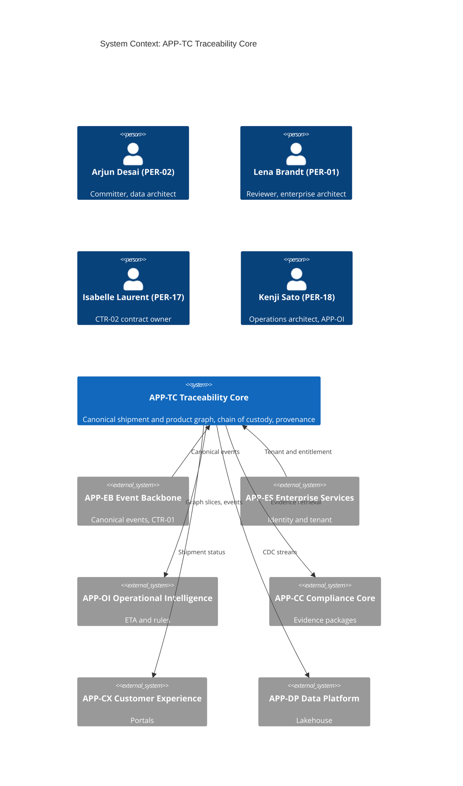
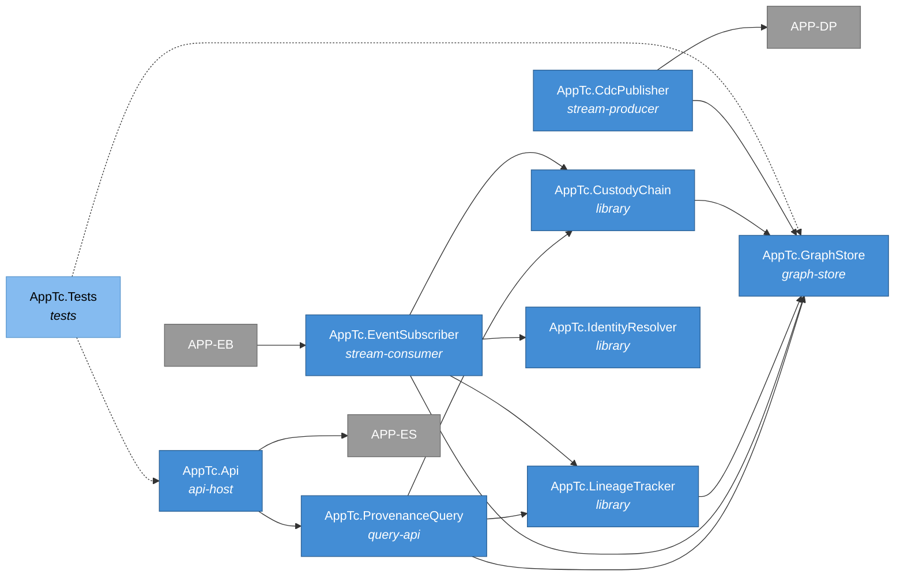
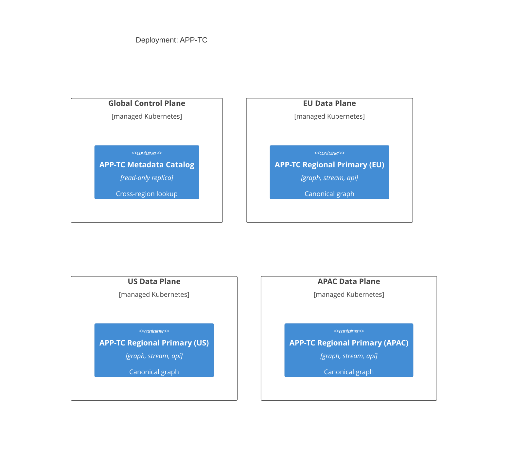
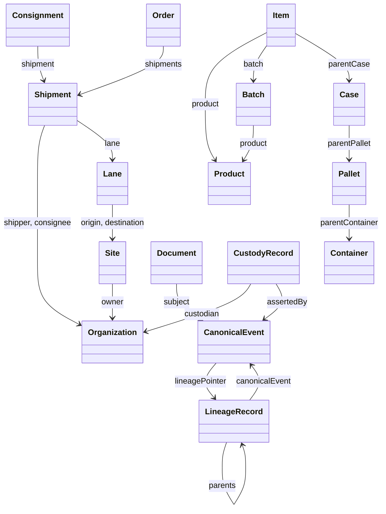
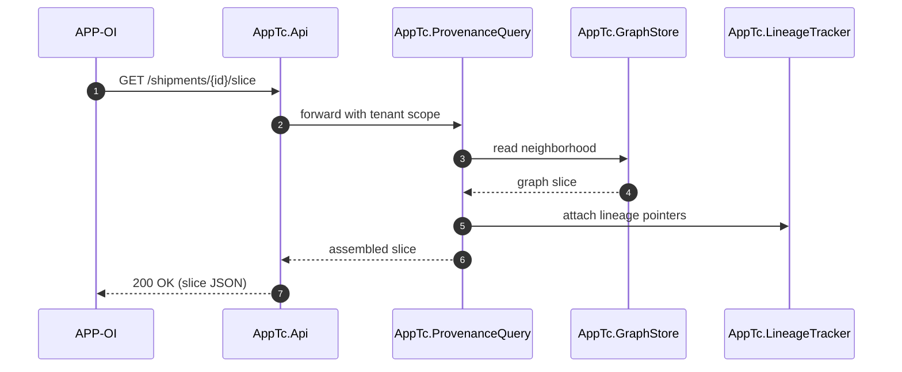
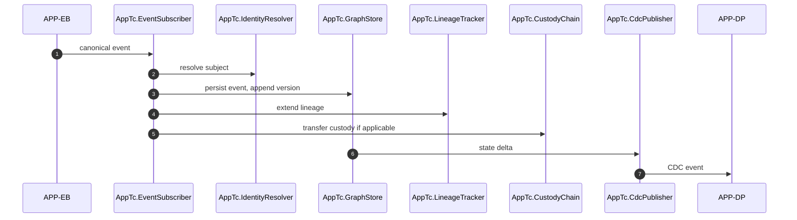
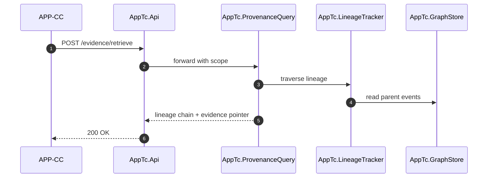

# APP-TC Traceability Core -- System Specification

## Tracking

| Field | Value |
|---|---|
| slug | app-tc-traceability-core |
| itemType | SystemSpec |
| name | APP-TC Traceability Core |
| version | 2 |
| specLangVersion | 0.1.0 |
| publishStatus | Draft |
| retentionPolicy | indefinite |
| freshnessSla | P180D |
| authors | [PER-02 Arjun Desai] |
| reviewers | [PER-01 Lena Brandt] |
| committer | PER-02 Arjun Desai |
| createdAt | 2026-04-17T00:00:00Z |
| updatedAt | 2026-04-18T00:00:00Z |
| Dependencies | global-corp.manifest.md, global-corp.architecture.spec.md, aspire-apphost.spec.md, service-defaults.spec.md |
| Profile | BTABOK |
| profileVersion | 0.1.0 |
| codlVersion | 0.2 |
| cadlVersion | 0.1 |
| tags | [local-simulation-first, aspire] |

This specification describes APP-TC Traceability Core, the canonical
shipment and product graph service for Global Corp. APP-TC owns the
enterprise's master view of what goods exist, how they are packaged and
moved, who held them, and what evidence supports each observation. It
consumes canonical events from APP-EB Event Backbone and never sees raw
partner payloads. It exposes the canonical graph for read to APP-OI
Operational Intelligence, APP-CC Compliance Core, APP-CX Customer
Experience, and APP-DP Data Platform.

APP-TC is the data-owned application designated by PER-02 Arjun Desai.
It enforces invariants INV-01 through INV-04, exposes contract CTR-02
EvidenceRetrieval, and realizes ASD-04 by treating lineage as a
first-class data object rather than as a derived computation.

APP-TC runs under the Aspire AppHost in the Local Simulation Profile.
The canonical graph is persisted in a PostgreSQL 17 container with the
Apache AGE extension (resource `pg-graph` declared in Section 9 of
`global-corp.architecture.spec.md`). The subsystem preserves a
cloud-deploy path via configuration: the same project binds to a
managed PostgreSQL instance with AGE enabled in the Cloud Production
Profile without code changes.

## 1. Purpose and Scope

APP-TC exists because canonical identity and canonical custody are
enterprise assets. Partner connectivity, ingestion elasticity, analytics
retention, and customer-facing presentation all have different change
rates and different failure modes. If the canonical graph is embedded in
any of them, it inherits their churn.

**In scope:**

- Canonical identity resolution for organizations, sites, shipments,
  consignments, orders, transport units, products, batches, items, and
  serials.
- First-class lineage records that chain canonical events back to
  source evidence and to the partner events that produced them.
- Chain-of-custody records for shipments, containers, pallets, cases,
  and items across the handling lifecycle.
- Provenance query over the graph, answering questions like "what is
  the full custody and evidence chain behind this shipment state".
- Enforcement of INV-01 payload hash retention (shared with APP-EB),
  INV-02 lineage completeness, INV-03 no externally visible state
  without a supporting event chain, and INV-04 identifier mastering
  discipline.

**Out of scope:**

- Raw partner payload validation and deduplication (APP-EB).
- ETA prediction and rule evaluation (APP-OI).
- Evidence package assembly and signing (APP-CC).
- Warehouse-oriented denormalization and long-term analytics retention
  (APP-DP).
- Identity and tenant management (APP-ES).

## 2. Context

```spec
person Arjun_Desai {
    slug: "per-02";
    description: "Chief Architect of Data, VP Data Platform. Committer
                  for APP-TC. Owns the canonical graph and lineage
                  discipline. Based in Singapore.";
    @tag("internal", "architect", "data");
}

person Lena_Brandt {
    slug: "per-01";
    description: "Chief Architect, enterprise. Reviewer for APP-TC and
                  chair of the enterprise architecture review board's
                  data-owned applications track.";
    @tag("internal", "architect", "enterprise");
}

person Isabelle_Laurent {
    slug: "per-17";
    description: "Chief Architect of Compliance. Contract owner for
                  CTR-02 EvidenceRetrieval and a primary consumer of
                  APP-TC through APP-CC.";
    @tag("internal", "architect", "compliance");
}

person Kenji_Sato {
    slug: "per-18";
    description: "Chief Architect of Operations. Consumes the canonical
                  graph through APP-OI for ETA and exception work.";
    @tag("internal", "architect", "operations");
}

external system APP_EB {
    slug: "app-eb";
    description: "Event Backbone. Accepts raw partner payloads,
                  validates and deduplicates them, and emits canonical
                  events. APP-TC subscribes to those canonical events
                  and never sees the raw partner payloads.";
    technology: "event stream, CTR-01";
    @tag("internal", "upstream");
}

external system APP_ES {
    slug: "app-es";
    description: "Enterprise Services. Owns identity, tenant, and
                  entitlement. APP-TC consults APP-ES for tenant scoping
                  on all reads and writes.";
    technology: "REST, internal";
    @tag("internal", "platform");
}

external system APP_OI {
    slug: "app-oi";
    description: "Operational Intelligence. Reads shipment graph slices
                  and event windows from APP-TC to drive ETA and rule
                  evaluation.";
    technology: "REST, internal";
    @tag("internal", "downstream");
}

external system APP_CC {
    slug: "app-cc";
    description: "Compliance Core. Reads canonical events and lineage
                  from APP-TC through CTR-02 EvidenceRetrieval to
                  assemble compliance evidence packages.";
    technology: "REST, internal";
    @tag("internal", "downstream");
}

external system APP_CX {
    slug: "app-cx";
    description: "Customer Experience. Reads shipment graph slices to
                  present status to customer portals, honoring INV-03.";
    technology: "REST, internal";
    @tag("internal", "downstream");
}

external system APP_DP {
    slug: "app-dp";
    description: "Data Platform. Consumes traceability snapshots and
                  change-data streams from APP-TC for the lakehouse,
                  reporting marts, and training data.";
    technology: "CDC stream, internal";
    @tag("internal", "downstream");
}

APP_EB -> APP_TC {
    description: "Streams canonical events (ENT-13) after ingestion,
                  validation, and deduplication. APP-TC resolves
                  canonical identity and maintains lineage pointers
                  back to the partner evidence retained at APP-EB.";
    technology: "event stream, CTR-01";
}

APP_ES -> APP_TC {
    description: "Provides tenant identity and entitlement checks for
                  every read and write against the canonical graph.";
    technology: "REST, internal";
}

APP_TC -> APP_OI : "Serves shipment graph slices and event windows for
                    ETA prediction and rule evaluation.";

APP_TC -> APP_CC : "Serves canonical events and lineage chains through
                    CTR-02 EvidenceRetrieval for compliance packages.";

APP_TC -> APP_CX : "Serves shipment graph slices for customer portal
                    display, subject to INV-03.";

APP_TC -> APP_DP : "Streams traceability snapshots and change-data for
                    analytical projection and model training.";
```

Rendered system context:



## 3. System Declaration

```spec
system APP_TC {
    slug: "app-tc-traceability-core";
    target: "regional data plane, three primary regions (EU, US, APAC)";
    responsibility: "Maintain the canonical shipment and product graph,
                     canonical identity, first-class lineage, and chain
                     of custody. Serve graph reads and provenance
                     queries to operational, compliance, customer, and
                     analytics consumers. Enforce INV-01 through INV-04
                     and expose CTR-02 EvidenceRetrieval.";

    authored component AppTc.GraphStore {
        kind: "graph-store";
        path: "src/AppTc.GraphStore";
        status: new;
        responsibility: "Persists the canonical graph on PostgreSQL 17
                         with the Apache AGE extension. Holds nodes for
                         ENT-01 Organization, ENT-02 Site, ENT-03 Lane,
                         ENT-04 Shipment, ENT-05 Consignment, ENT-06
                         Order, ENT-07 Container, ENT-08 Pallet,
                         ENT-09 Case, ENT-10 Item, ENT-11 Batch,
                         ENT-12 Product; and edges (Contains, PartOf,
                         ChainOfCustody, HasEvent, LineageOf) with
                         temporal validity. Connects through the Npgsql
                         driver to the `pg-graph` resource declared by
                         the Aspire AppHost.";
        contract {
            guarantees "Every node and edge has a stable canonical ID
                        and a valid-from / valid-to pair so that
                        temporal queries return the graph state at any
                        point in retention.";
            guarantees "Identifier mastering follows INV-04: product,
                        asset, shipment, and facility identifiers are
                        stored independently and joined through graph
                        relationships only; no polymorphic identifier
                        columns.";
            guarantees "Writes are idempotent keyed by canonical event
                        ID (ENT-13.id) so that re-delivered events
                        from APP-EB do not corrupt graph state.";
            guarantees "Schema (AGE graph, labels, indexes) is
                        provisioned at APP-TC startup by a migration
                        runner that is idempotent across container
                        first-boot and subsequent restarts.";
        }

        rationale {
            context "The traceability graph is the central enterprise
                     asset. It must support ad hoc provenance queries,
                     temporal reads, and tenant scoping without
                     leaking cross-tenant state. The enterprise
                     constraint (Section 14.3 of the Implementation
                     Brief) is a local-simulation-first stack with a
                     preserved cloud-deploy path.";
            decision "Use PostgreSQL 17 with the Apache AGE extension
                      as the canonical graph store. AGE layers an
                      openCypher query surface onto PostgreSQL, which
                      gives us graph traversals and relational SQL in
                      one engine. The Aspire AppHost declares the
                      container as `pg-graph` with image
                      `apache/age:latest` per Section 9 of the
                      architecture spec. The connection driver is
                      Npgsql.";
            consequence "The GraphStore defines its own query surface
                         on top of AGE. APP-OI, APP-CC, and APP-CX
                         consume that surface rather than reaching
                         into storage. The same project binds to a
                         managed PostgreSQL-with-AGE deployment in the
                         Cloud Production Profile without code
                         changes.";
        }
    }

    authored component AppTc.IdentityResolver {
        kind: library;
        path: "src/AppTc.IdentityResolver";
        status: new;
        responsibility: "Resolves partner-specific identifiers to
                         canonical IDs for all mastered entity types.
                         Maintains the identifier federation table
                         linking partner identifier spaces to the
                         canonical space, with provenance on every
                         link.";
        contract {
            guarantees "For every canonical entity, the resolver retains
                        the full history of partner identifiers that
                        have ever mapped to it, with the partner
                        source, timestamp, and event ID that introduced
                        the mapping.";
            guarantees "Identifier collisions across partners are
                        detected and raised as ambiguous-identity
                        diagnostics rather than silently merged.";
            used_by: [AppTc.GraphStore, AppTc.LineageTracker];
        }
    }

    authored component AppTc.LineageTracker {
        kind: library;
        path: "src/AppTc.LineageTracker";
        status: new;
        responsibility: "Maintains first-class lineage records per
                         ASD-04. Every canonical event carries a
                         lineage pointer that resolves to at least one
                         source evidence record retained by APP-EB.
                         Derived events (aggregations, transformations)
                         carry lineage back to all contributing
                         canonical events.";
        contract {
            guarantees "INV-02 holds: every canonical event has a
                        lineage pointer that resolves to at least one
                        source evidence record.";
            guarantees "Lineage chains are acyclic and terminate at a
                        partner source evidence record; cycles are
                        detected on write and raised as errors.";
            guarantees "Lineage traversal is bounded: a provenance
                        query returns the full chain within a
                        configured depth limit or returns a
                        truncation marker that identifies the cut
                        point.";
        }
    }

    authored component AppTc.CustodyChain {
        kind: library;
        path: "src/AppTc.CustodyChain";
        status: new;
        responsibility: "Maintains ENT-15 CustodyRecord instances for
                         shipments, containers, pallets, cases, and
                         items. Records who physically or logically
                         held each subject at each point in time, with
                         the canonical event that asserted the
                         transfer.";
        contract {
            guarantees "Custody chains are contiguous in time: for any
                        interval within the retention window, either
                        exactly one custodian holds the subject or a
                        gap is explicitly recorded with a reason code.";
            guarantees "Every custody transfer references the canonical
                        event (ENT-13) that asserted it, so that the
                        transfer can be explained from retained
                        evidence (ASR-02).";
        }
    }

    authored component AppTc.ProvenanceQuery {
        kind: "query-api";
        path: "src/AppTc.ProvenanceQuery";
        status: new;
        responsibility: "Exposes the read surface for provenance
                         queries, graph slicing, and evidence retrieval.
                         Implements CTR-02 EvidenceRetrieval and the
                         shipment-slice reads consumed by APP-OI,
                         APP-CX, and APP-CC. Queries are issued as
                         openCypher (the query surface Apache AGE
                         provides on PostgreSQL); gremlin-style
                         traversals are also accepted and translated
                         to openCypher internally.";
        contract {
            guarantees "CTR-02 holds: given an event, the API returns
                        the source payload pointer and the full lineage
                        chain.";
            guarantees "Shipment-slice reads return the canonical graph
                        neighborhood around a shipment, bounded by a
                        configurable depth, with temporal filters.";
            guarantees "All reads are tenant-scoped via APP-ES; no
                        cross-tenant data is ever returned.";
        }
    }

    authored component AppTc.EventSubscriber {
        kind: "stream-consumer";
        path: "src/AppTc.EventSubscriber";
        status: new;
        responsibility: "Subscribes to the canonical event stream from
                         APP-EB. For each canonical event, invokes the
                         IdentityResolver, updates the GraphStore,
                         records lineage, and updates custody chains as
                         required by the event's businessStep.";
        contract {
            guarantees "Exactly-once application of canonical events to
                        graph state, keyed by ENT-13.id.";
            guarantees "Ordering is preserved within a subject: events
                        for the same subjectId are applied in receivedAt
                        order.";
        }
    }

    authored component AppTc.Api {
        kind: "api-host";
        path: "src/AppTc.Api";
        status: new;
        responsibility: "ASP.NET API host for CTR-02 EvidenceRetrieval,
                         shipment-slice reads, and administrative
                         endpoints. Owns authentication against APP-ES,
                         request logging, and rate limiting.";
        contract {
            guarantees "All endpoints require a tenant-scoped token
                        issued by APP-ES and reject unscoped requests
                        with 401.";
            guarantees "Request and response bodies carry correlation
                        IDs that link back to the calling consumer's
                        trace.";
        }
    }

    authored component AppTc.CdcPublisher {
        kind: "stream-producer";
        path: "src/AppTc.CdcPublisher";
        status: new;
        responsibility: "Publishes change-data streams for the canonical
                         graph to APP-DP. Emits node-version and edge
                         events with lineage references so that APP-DP
                         can reconstruct temporal projections.";
        contract {
            guarantees "Every graph-state change produces exactly one
                        CDC event; re-publication is idempotent.";
            guarantees "CDC events carry region-of-origin so that
                        APP-DP can honor INV-06 on replication.";
        }
    }

    authored component AppTc.Tests {
        kind: tests;
        path: "tests/AppTc.Tests";
        status: new;
        responsibility: "Unit, integration, and provenance-query
                         contract tests. Verifies INV-01 through INV-04,
                         CTR-02, temporal correctness of graph reads,
                         and tenant isolation.";
    }

    consumed component EventStreamClient {
        source: internal("APP-EB canonical event stream SDK");
        version: "1.*";
        responsibility: "Client SDK for subscribing to canonical events
                         emitted by APP-EB.";
        used_by: [AppTc.EventSubscriber];
    }

    consumed component TenantClient {
        source: internal("APP-ES tenant and identity SDK");
        version: "1.*";
        responsibility: "Tenant scoping, token verification, and
                         entitlement checks.";
        used_by: [AppTc.Api, AppTc.ProvenanceQuery];
    }

    consumed component GlobalCorp.ServiceDefaults {
        source: internal("service-defaults.spec.md");
        version: "1.*";
        responsibility: "Shared OpenTelemetry, health-check, resilience,
                         and configuration conventions applied to every
                         APP-TC ASP.NET host. Wired from the Aspire
                         AppHost through the standard ServiceDefaults
                         extension method.";
        used_by: [AppTc.Api, AppTc.EventSubscriber, AppTc.CdcPublisher];
    }

    consumed component Npgsql {
        source: nuget("Npgsql");
        version: "8.*";
        responsibility: "PostgreSQL ADO.NET driver used by the
                         GraphStore to connect to the `pg-graph`
                         resource. Carries openCypher queries to the
                         Apache AGE extension through standard
                         parameterized SQL.";
        used_by: [AppTc.GraphStore];
    }

    package_policy_ref: weakRef<PackagePolicy>(GlobalCorpPolicy);
    rationale "package policy reference" {
        context "Section 8 of `global-corp.architecture.spec.md`
                 declares the enterprise NuGet package policy. Every
                 subsystem inherits that policy rather than restating
                 its deny and allow lists.";
        decision "APP-TC references GlobalCorpPolicy by `weakRef` and
                  adds no subsystem-local package allowances. Npgsql
                  is covered by the `storage-drivers` allow category.
                  No 3rd-party charting or CSS-framework NuGet is
                  introduced here.";
        consequence "Any future NuGet outside the allowed categories
                     will require a per-package rationale block in
                     this spec.";
    }
}
```

## 4. Topology

```spec
topology Dependencies {
    allow AppTc.Api -> AppTc.ProvenanceQuery;
    allow AppTc.ProvenanceQuery -> AppTc.GraphStore;
    allow AppTc.ProvenanceQuery -> AppTc.LineageTracker;
    allow AppTc.ProvenanceQuery -> AppTc.CustodyChain;
    allow AppTc.EventSubscriber -> AppTc.IdentityResolver;
    allow AppTc.EventSubscriber -> AppTc.GraphStore;
    allow AppTc.EventSubscriber -> AppTc.LineageTracker;
    allow AppTc.EventSubscriber -> AppTc.CustodyChain;
    allow AppTc.LineageTracker -> AppTc.GraphStore;
    allow AppTc.CustodyChain -> AppTc.GraphStore;
    allow AppTc.CdcPublisher -> AppTc.GraphStore;
    allow AppTc.Tests -> AppTc.Api;
    allow AppTc.Tests -> AppTc.GraphStore;
    allow AppTc.Tests -> AppTc.LineageTracker;
    allow AppTc.Tests -> AppTc.CustodyChain;
    allow AppTc.Tests -> AppTc.IdentityResolver;

    deny AppTc.GraphStore -> AppTc.Api;
    deny AppTc.GraphStore -> AppTc.EventSubscriber;
    deny AppTc.IdentityResolver -> AppTc.GraphStore;
    deny AppTc.LineageTracker -> AppTc.IdentityResolver;
    deny AppTc.CustodyChain -> AppTc.LineageTracker;

    invariant "no raw payload access":
        AppTc.* does not reference APP-PC or partner payload types;
    invariant "store is passive":
        AppTc.GraphStore has no outbound dependencies to peer
        AppTc components;
    invariant "query is read-only":
        AppTc.ProvenanceQuery does not invoke mutating operations on
        AppTc.GraphStore, AppTc.LineageTracker, or AppTc.CustodyChain;

    rationale {
        context "APP-TC is the canonical graph owner. The graph store
                 must stay passive; it is written by the subscriber and
                 read by the query API. Any path that would let a
                 query mutate state or let the store call back into
                 business components would collapse the separation
                 between ingestion and canonical maintenance that
                 ASD-02 establishes.";
        decision "Enforce a strict flow: subscriber writes, query
                  reads, store persists. Lineage and custody are thin
                  libraries layered above the store.";
        consequence "Topology diagnostics catch any dependency that
                     reverses or shortcuts this flow.";
    }
}
```

Rendered topology:



## 5. Data

The canonical entity definitions below are the authoritative declaration
for APP-TC. Entity IDs (ENT-01 through ENT-15) follow the enterprise
object catalog in Section 16 of the Global Corp exemplar.

```spec
enum SubjectKind {
    Organization: "Legal entity",
    Site: "Physical location",
    Lane: "Origin-destination corridor",
    Shipment: "Planned movement",
    Consignment: "Cargo unit tied to a shipment",
    Order: "Commercial order",
    Container: "Transport unit",
    Pallet: "Aggregation unit below container",
    Case: "Packing unit below pallet",
    Item: "Serialized product instance",
    Batch: "Manufacturing batch",
    Product: "Product specification"
}

enum AggregationRelationship {
    Contains: "Parent contains child as aggregation",
    Moves: "Transport unit moves cargo subject",
    Supersedes: "New version supersedes prior version",
    PartOf: "Cargo subject is part of consignment",
    Holds: "Custodian holds subject"
}

enum CustodyTransferReason {
    Handoff: "Normal custody transfer",
    Inspection: "Temporary transfer for inspection",
    Storage: "Transfer to storage custody",
    Return: "Return to prior custodian",
    Gap: "Explicitly recorded gap with reason"
}

entity Organization {
    slug: "ent-01-organization";
    id: CanonicalId;
    legalName: shortText;
    type: shortText @default("partner");
    primaryCountry: shortText;
    validFrom: UtcInstant;
    validTo: UtcInstant?;

    invariant "id required": id != "";
    invariant "legal name required": legalName != "";
    invariant "temporal validity": validTo == null || validTo > validFrom;
}

entity Site {
    slug: "ent-02-site";
    id: CanonicalId;
    owner: ref<Organization>;
    locationCode: shortText;
    country: shortText;
    validFrom: UtcInstant;
    validTo: UtcInstant?;

    invariant "id required": id != "";
    invariant "owner required": owner != null;
}

entity Lane {
    slug: "ent-03-lane";
    id: CanonicalId;
    origin: ref<Site>;
    destination: ref<Site>;
    mode: shortText;
    preferredCarriers: list<weakRef>;

    invariant "endpoints distinct": origin != destination;
}

entity Shipment {
    slug: "ent-04-shipment";
    id: CanonicalId;
    shipper: ref<Organization>;
    consignee: ref<Organization>;
    lane: ref<Lane>;
    carrierContract: ref<PartnerContract>;
    plannedDeparture: UtcInstant;
    plannedArrival: UtcInstant;
    status: shortText;
    validFrom: UtcInstant;
    validTo: UtcInstant?;

    invariant "id required": id != "";
    invariant "parties distinct": shipper != consignee;
    invariant "planned window ordered": plannedArrival >= plannedDeparture;

    rationale "status" {
        context "Shipment status is externally visible and drives
                 customer portal display and ETA computation.";
        decision "Status is a projection computed from the canonical
                  event chain associated with the shipment. It is
                  never written directly; INV-03 forbids status that
                  is not backed by events.";
        consequence "Writes to Shipment.status come only from the
                     EventSubscriber and carry a lineage pointer to the
                     event that asserted the transition.";
    }
}

entity Consignment {
    slug: "ent-05-consignment";
    id: CanonicalId;
    shipment: ref<Shipment>;
    consignor: ref<Organization>;
    consignee: ref<Organization>;
    goodsDescription: text;
    grossWeightKg: int @range(1..10000000);

    invariant "shipment required": shipment != null;
    invariant "positive weight": grossWeightKg > 0;
}

entity Order {
    slug: "ent-06-order";
    id: CanonicalId;
    buyer: ref<Organization>;
    seller: ref<Organization>;
    shipments: list<ref<Shipment>> cardinality(1..*);

    invariant "at least one shipment":
        count(shipments) >= 1;
}

entity Container {
    slug: "ent-07-container";
    id: CanonicalId;
    containerNumber: shortText;
    isoType: shortText;
    currentCustodian: ref<Organization>?;

    invariant "id required": id != "";
    invariant "container number required": containerNumber != "";
}

entity Pallet {
    slug: "ent-08-pallet";
    id: CanonicalId;
    parentContainer: ref<Container>?;
    palletIdentifier: shortText;

    invariant "id required": id != "";
}

entity Case {
    slug: "ent-09-case";
    id: CanonicalId;
    parentPallet: ref<Pallet>?;
    caseIdentifier: shortText;
}

entity Item {
    slug: "ent-10-item";
    id: CanonicalId;
    serialNumber: shortText;
    product: ref<Product>;
    batch: ref<Batch>?;
    parentCase: ref<Case>?;

    invariant "product required": product != null;
    invariant "serial required": serialNumber != "";
}

entity Batch {
    slug: "ent-11-batch";
    id: CanonicalId;
    product: ref<Product>;
    batchCode: shortText;
    manufacturedAt: UtcInstant;

    invariant "product required": product != null;
    invariant "batch code required": batchCode != "";
}

entity Product {
    slug: "ent-12-product";
    id: CanonicalId;
    gtin: shortText;
    category: shortText;
    attributes: text;

    invariant "id required": id != "";
    invariant "gtin required": gtin != "";

    rationale "mastering" {
        context "Product identity is mastered separately from shipment
                 identity per INV-04. The same product may appear in
                 thousands of shipments and batches.";
        decision "Product has its own canonical ID and is referenced
                  from Item and Batch through graph edges only. No
                  denormalized product fields live on Item or
                  Shipment.";
        consequence "Analytics and compliance queries traverse from
                     Item to Product through an explicit edge; there
                     is no polymorphic identifier column.";
    }
}

entity CanonicalEvent {
    slug: "ent-13-event";
    id: CanonicalId;
    subjectId: ref<AnyCanonicalSubject>;
    eventType: shortText;
    businessStep: shortText;
    timestamp: UtcInstant;
    receivedAt: UtcInstant;
    sourceEvidenceRef: ExternalEvidenceUri;
    payloadHash: Sha256Hash;
    lineagePointer: ref<LineageRecord>;
    confidenceScore: decimal @range(0.0..1.0);

    invariant "id required": id != "";
    invariant "evidence ref required (INV-01)":
        sourceEvidenceRef != null;
    invariant "payload hash required (INV-01)":
        payloadHash != null;
    invariant "lineage required (INV-02)":
        lineagePointer != null;
    invariant "timestamp not future":
        timestamp <= receivedAt + P5M;

    rationale "why canonical here" {
        context "APP-EB produces canonical events and hands them off to
                 APP-TC. APP-TC owns the persisted, queryable
                 representation once the event is associated with
                 canonical subjects and lineage.";
        decision "Persist the canonical event inside APP-TC with the
                  subject resolved, the lineage pointer established,
                  and the payload hash recorded. Source evidence itself
                  remains at APP-EB and is pointed to, not copied.";
        consequence "APP-TC and APP-EB share responsibility for
                     INV-01. APP-EB retains the payload and the hash;
                     APP-TC retains the hash on the canonical event
                     and a pointer to the retained payload.";
    }
}

entity Document {
    slug: "ent-14-document";
    id: CanonicalId;
    subject: ref<AnyCanonicalSubject>;
    documentType: shortText;
    uri: ExternalEvidenceUri;
    issuedAt: UtcInstant;

    invariant "uri required": uri != null;
    invariant "subject required": subject != null;
}

entity CustodyRecord {
    slug: "ent-15-custody-record";
    id: CanonicalId;
    subject: ref<AnyCanonicalSubject>;
    custodian: ref<Organization>;
    fromTime: UtcInstant;
    toTime: UtcInstant?;
    assertedBy: ref<CanonicalEvent>;
    transferReason: CustodyTransferReason @default(Handoff);

    invariant "subject required": subject != null;
    invariant "custodian required": custodian != null;
    invariant "asserted by event": assertedBy != null;
    invariant "interval ordered": toTime == null || toTime > fromTime;
}

entity LineageRecord {
    slug: "lineage-record";
    id: CanonicalId;
    canonicalEvent: ref<CanonicalEvent>;
    sourceEvidenceRefs: list<ExternalEvidenceUri> cardinality(1..*);
    parentLineageRefs: list<ref<LineageRecord>> cardinality(0..*);
    derivationKind: shortText;

    invariant "at least one source (INV-02)":
        count(sourceEvidenceRefs) >= 1;
    invariant "acyclic":
        canonicalEvent not in transitive_closure(parentLineageRefs);
}
```

### Contracts

```spec
contract CTR_02_EvidenceRetrieval {
    slug: "ctr-02-evidence-retrieval";
    requires canonicalEvent.id != "";
    requires requesting tenant has entitlement for the event's subject;
    ensures response.sourceEvidenceRef != null;
    ensures response.lineageChain resolves to at least one source
            evidence record;
    guarantees "Given a canonical event ID, returns the source evidence
                pointer (retained by APP-EB), the payload hash, and the
                lineage chain back to the partner events that produced
                it. Tenant-scoped; cross-tenant retrieval is
                denied.";
    @owner("PER-17 Isabelle Laurent");
    @implements("ASR-02", "ASR-06");
}
```

### Invariants enforced by APP-TC

```spec
invariant INV_01_PayloadHashRetention {
    slug: "inv-01-payload-hash-retention";
    scope: [CanonicalEvent, LineageRecord];
    rule: "Every canonical event retains the SHA-256 hash of its
           original partner payload. APP-TC stores the hash on the
           CanonicalEvent entity. APP-EB retains the payload itself;
           the sourceEvidenceRef resolves to that retained payload.";
    @shared_with("APP-EB");
    @owner("PER-02");
}

invariant INV_02_LineageCompleteness {
    slug: "inv-02-lineage-completeness";
    scope: [CanonicalEvent, LineageRecord];
    rule: "Every canonical event has a lineagePointer that resolves to
           at least one source evidence record. Derived events chain
           back to the canonical events from which they were derived.
           Cycles are rejected on write.";
    @owner("PER-02");
}

invariant INV_03_StateBackedByEvents {
    slug: "inv-03-state-backed-by-events";
    scope: [Shipment, Consignment, Item, CustodyRecord];
    rule: "No externally visible shipment or cargo state exists without
           a supporting event chain. Status transitions are produced by
           the EventSubscriber and carry a lineage pointer to the
           CanonicalEvent that asserted them.";
    @owner("PER-18");
}

invariant INV_04_IdentifierMastering {
    slug: "inv-04-identifier-mastering";
    scope: [Organization, Site, Shipment, Container, Product, Item,
            Batch];
    rule: "Product, asset, shipment, and facility identifiers are
           mastered independently. Joins across mastered entity types
           go through graph edges in AppTc.GraphStore only. No
           polymorphic identifier columns exist.";
    @owner("PER-02");
}
```

### Graph Schema (Apache AGE)

The canonical graph is materialized inside a single Apache AGE graph
(default name `gc_traceability`) on the `pg-graph` PostgreSQL 17
container. The following labels make up the schema. Schema
provisioning happens at APP-TC startup through a migration runner
that calls `CREATE GRAPH`, then `CREATE VLABEL` and `CREATE ELABEL`
for each label below. The runner is idempotent: second and subsequent
runs detect existing labels and skip them.

Node (vertex) labels:

- `Organization` (ENT-01)
- `Site` (ENT-02)
- `Lane` (ENT-03)
- `Shipment` (ENT-04)
- `Container` (ENT-07)
- `Pallet` (ENT-08)
- `Case` (ENT-09)
- `Item` (ENT-10)
- `Batch` (ENT-11)
- `Product` (ENT-12)
- `CustodyRecord` (ENT-15)
- `LineageRecord`
- `Event` (ENT-13 CanonicalEvent)

Edge (relationship) labels:

- `ChainOfCustody` from `CustodyRecord` to `Organization` (custodian)
  and from `CustodyRecord` to any canonical subject (`Shipment`,
  `Container`, `Pallet`, `Case`, `Item`)
- `Contains` from aggregation parents to children
  (`Container`->`Pallet`, `Pallet`->`Case`, `Case`->`Item`)
- `PartOf` from `Shipment` to `Lane`, and from `Item` to `Batch`
- `HasEvent` from any canonical subject to `Event`
- `LineageOf` from `LineageRecord` to `Event` and from `LineageRecord`
  to parent `LineageRecord` instances

Indexes on `id`, `tenantId`, and `validFrom` are created alongside
each label. Tenant scoping is enforced at the query layer.

### Query API examples

The two representative flows below illustrate the openCypher surface
exposed through `AppTc.ProvenanceQuery`.

Resolve the custody chain for shipment `X`:

```cypher
MATCH (s:Shipment {id: $shipmentId})<-[:ChainOfCustody]-(c:CustodyRecord)
  -[:ChainOfCustody]->(o:Organization)
WHERE c.validFrom <= $atInstant
  AND (c.validTo IS NULL OR c.validTo > $atInstant)
RETURN c.id AS custodyRecordId,
       o.legalName AS custodian,
       c.fromTime AS fromTime,
       c.toTime AS toTime,
       c.transferReason AS reason
ORDER BY c.fromTime ASC;
```

Return the lineage chain for event `Y`:

```cypher
MATCH (e:Event {id: $eventId})<-[:LineageOf]-(l:LineageRecord)
OPTIONAL MATCH (l)-[:LineageOf*1..$depth]->(parent:LineageRecord)
RETURN l.id AS rootLineageId,
       collect(parent.id) AS ancestorLineageIds,
       l.sourceEvidenceRefs AS sourceEvidenceRefs,
       l.derivationKind AS derivationKind;
```

Both queries are parameterized, tenant-scoped by the API layer, and
bounded by a configurable depth limit so that traversal cost remains
predictable.

## 6. Deployment

APP-TC declares two deployment profiles. The Local Simulation Profile
is the primary development and validation target; the Cloud Production
Profile is deferred.

### 6.1 Local Simulation Profile (primary)

```spec
deployment LocalSimulation {
    slug: "app-tc-local-simulation";
    description: "APP-TC runs as an Aspire-orchestrated .NET project
                  under the Global Corp AppHost. It connects to the
                  `pg-graph` PostgreSQL 17 + Apache AGE container via
                  Aspire `WithReference`, to the APP-EB canonical
                  event stream via `WithReference(appEb)`, and to
                  APP-ES via the tenant client. Schema (AGE graph,
                  labels, indexes) is provisioned on container
                  first-boot by the migration runner inside APP-TC.";

    node "Aspire AppHost" {
        technology: "Aspire 13.2 host, .NET 10";

        node "app-tc project" {
            technology: "ASP.NET API host, .NET 10";
            instance: AppTc.Api;
            instance: AppTc.ProvenanceQuery;
            instance: AppTc.EventSubscriber;
            instance: AppTc.CdcPublisher;
            instance: AppTc.IdentityResolver;
            instance: AppTc.LineageTracker;
            instance: AppTc.CustodyChain;
            responsibility: "Single project hosts the API, subscriber,
                             CDC publisher, and the lineage and custody
                             libraries. ServiceDefaults wires telemetry,
                             health checks, and resilience. The project
                             uses Npgsql to connect to `pg-graph` on the
                             connection string injected by Aspire.";
        }

        node "pg-graph container" {
            technology: "apache/age:latest (PostgreSQL 17 + Apache AGE)";
            instance: AppTc.GraphStore;
            responsibility: "Canonical graph persistence and openCypher
                             query surface. The `gc_traceability` AGE
                             graph is created on first-boot by the
                             migration runner hosted in the app-tc
                             project. The container volume `pg-graph-data`
                             preserves graph state across AppHost
                             restarts.";
        }
    }

    rationale {
        context "Section 14.3 of the Implementation Brief specifies a
                 local-simulation-first stack. Constraint 2 requires
                 that every subsystem preserve a cloud-deploy path via
                 configuration.";
        decision "Run APP-TC as a single Aspire project bound to the
                  enterprise `pg-graph` container. Schema provisioning
                  is in-process and idempotent. The same project binds
                  to a managed PostgreSQL-with-AGE in the Cloud
                  Production Profile; only connection strings differ.";
        consequence "The developer-machine loop is `aspire run` with
                     no cloud prerequisites. Regional distribution is
                     deferred to the Cloud Production Profile.";
    }
}
```

### 6.2 Cloud Production Profile (deferred)

The regional-primary deployment described below is the intended Cloud
Production Profile shape. It is deferred pending the Phase 2c roadmap
per the Implementation Brief; only connection-string and resource
targets differ from the Local Simulation Profile above.

```spec
deployment Regional {
    slug: "app-tc-regional";
    description: "APP-TC runs as a regional primary in each of the
                  three primary data planes (EU, US, APAC), with
                  metadata-only presence in the global control plane.
                  Section 18.3 of the Global Corp exemplar is the
                  authoritative component-to-node instance mapping.";

    node "Global Control Plane" {
        technology: "managed Kubernetes, shared services";

        node "APP-TC Metadata Catalog" {
            technology: "read-only replica";
            instance: AppTc.ProvenanceQuery;
            responsibility: "Serves cross-region lookups that are
                             necessary for evidence retrieval paths
                             traversing multiple regions. Honors
                             INV-06.";
        }
    }

    node "EU Data Plane" {
        technology: "managed Kubernetes, region-local storage";

        node "APP-TC Regional Primary (EU)" {
            technology: "graph database, stream consumers, API host";
            instance: AppTc.GraphStore;
            instance: AppTc.EventSubscriber;
            instance: AppTc.ProvenanceQuery;
            instance: AppTc.Api;
            instance: AppTc.CdcPublisher;
            instance: AppTc.LineageTracker;
            instance: AppTc.CustodyChain;
            instance: AppTc.IdentityResolver;
        }
    }

    node "US Data Plane" {
        technology: "managed Kubernetes, region-local storage";

        node "APP-TC Regional Primary (US)" {
            technology: "graph database, stream consumers, API host";
            instance: AppTc.GraphStore;
            instance: AppTc.EventSubscriber;
            instance: AppTc.ProvenanceQuery;
            instance: AppTc.Api;
            instance: AppTc.CdcPublisher;
            instance: AppTc.LineageTracker;
            instance: AppTc.CustodyChain;
            instance: AppTc.IdentityResolver;
        }
    }

    node "APAC Data Plane" {
        technology: "managed Kubernetes, region-local storage";

        node "APP-TC Regional Primary (APAC)" {
            technology: "graph database, stream consumers, API host";
            instance: AppTc.GraphStore;
            instance: AppTc.EventSubscriber;
            instance: AppTc.ProvenanceQuery;
            instance: AppTc.Api;
            instance: AppTc.CdcPublisher;
            instance: AppTc.LineageTracker;
            instance: AppTc.CustodyChain;
            instance: AppTc.IdentityResolver;
        }
    }

    rationale {
        context "ASD-03 mandates regional data planes with a global
                 control plane. The traceability graph must remain
                 regional for INV-05 and INV-06; only metadata
                 sufficient for cross-region lookup is replicated
                 globally.";
        decision "Regional primary per plane, with metadata catalog at
                  the control plane. No cross-region graph
                  replication.";
        consequence "Cross-region evidence retrieval traverses the
                     metadata catalog to locate the regional primary,
                     then retrieves from that region. Latency cost is
                     accepted as a regulatory necessity.";
    }
}
```

Rendered deployment:



## 7. Views

```spec
view systemContext of APP_TC ContextView {
    slug: "app-tc-context-view";
    include: all;
    autoLayout: top-down;
    description: "APP-TC with its human stakeholders and the peer
                  applications that produce or consume its canonical
                  graph.";
}

view container of APP_TC ContainerView {
    slug: "app-tc-container-view";
    include: all;
    autoLayout: left-right;
    description: "Internal structure: GraphStore, IdentityResolver,
                  LineageTracker, CustodyChain, EventSubscriber,
                  ProvenanceQuery, CdcPublisher, and Api.";
}

view dataModel of APP_TC DataModelView {
    slug: "app-tc-data-model-view";
    include: [Organization, Site, Lane, Shipment, Consignment, Order,
              Container, Pallet, Case, Item, Batch, Product,
              CanonicalEvent, Document, CustodyRecord, LineageRecord];
    autoLayout: top-down;
    description: "Canonical entity graph. Covers ENT-01 through ENT-15
                  as maintained by APP-TC.";
}

view deployment of Regional RegionalDeploymentView {
    slug: "app-tc-regional-deployment-view";
    include: all;
    autoLayout: top-down;
    description: "Regional primaries in EU, US, and APAC with the
                  control-plane metadata catalog.";
    @tag("regional");
}
```

Rendered canonical data model:



## 8. Dynamics

### 8.1 DYN-02 Customer requests ETA (APP-TC role)

APP-OI reads shipment graph slices and event windows from APP-TC to
drive ETA prediction. This dynamic corresponds to Section 20.2 of the
Global Corp exemplar and is shown here from APP-TC's vantage point.

```spec
dynamic CustomerRequestsEta_AppTcRole {
    slug: "dyn-02-app-tc-role";
    1: APP_OI -> AppTc.Api {
        description: "GET /shipments/{id}/slice?depth=2&window=P24H
                      with a tenant-scoped token.";
        technology: "REST, internal";
    };
    2: AppTc.Api -> AppTc.ProvenanceQuery
        : "Validates tenant entitlement via APP-ES, forwards to
           ProvenanceQuery with the tenant scope applied.";
    3: AppTc.ProvenanceQuery -> AppTc.GraphStore
        : "Reads the shipment node and its neighborhood to the
           configured depth, bounded by the temporal window.";
    4: AppTc.GraphStore -> AppTc.ProvenanceQuery
        : "Returns the graph slice (nodes, edges, valid-from/valid-to).";
    5: AppTc.ProvenanceQuery -> AppTc.LineageTracker
        : "Attaches lineage pointers for the canonical events in the
           window so that APP-OI can cite evidence in its output.";
    6: AppTc.ProvenanceQuery -> AppTc.Api
        : "Returns the assembled slice payload.";
    7: AppTc.Api -> APP_OI {
        description: "Returns 200 OK with the shipment-slice JSON.";
        technology: "REST, internal";
    };
}
```

Rendered:



### 8.2 Canonical event application

```spec
dynamic ApplyCanonicalEvent {
    slug: "app-tc-apply-event";
    1: APP_EB -> AppTc.EventSubscriber {
        description: "Delivers a canonical event (ENT-13) with
                      subjectId, payloadHash, and sourceEvidenceRef.";
        technology: "event stream";
    };
    2: AppTc.EventSubscriber -> AppTc.IdentityResolver
        : "Resolves the partner-scoped subject identifier to a
           canonical subject ID.";
    3: AppTc.EventSubscriber -> AppTc.GraphStore
        : "Persists the canonical event, appending to the subject's
           version chain. Keyed by ENT-13.id for idempotency.";
    4: AppTc.EventSubscriber -> AppTc.LineageTracker
        : "Creates or extends the LineageRecord linking the event to
           its source evidence and to any parent canonical events.";
    5: AppTc.EventSubscriber -> AppTc.CustodyChain
        : "If the event's businessStep implies a custody transfer,
           writes a CustodyRecord with assertedBy set to the event.";
    6: AppTc.CdcPublisher -> APP_DP {
        description: "Publishes the resulting graph-state delta to
                      APP-DP for analytical projection.";
        technology: "CDC stream";
    };
}
```

Rendered:



### 8.3 Evidence retrieval (CTR-02)

```spec
dynamic EvidenceRetrieval {
    slug: "app-tc-ctr-02";
    1: APP_CC -> AppTc.Api {
        description: "POST /evidence/retrieve with canonicalEventId
                      under a compliance tenant scope.";
        technology: "REST, internal";
    };
    2: AppTc.Api -> AppTc.ProvenanceQuery
        : "Validates entitlement, forwards the request.";
    3: AppTc.ProvenanceQuery -> AppTc.LineageTracker
        : "Traverses lineage to the source evidence records.";
    4: AppTc.LineageTracker -> AppTc.GraphStore
        : "Reads parent canonical events and their lineage records.";
    5: AppTc.ProvenanceQuery -> AppTc.Api
        : "Returns the lineage chain plus the source evidence
           pointer back to APP-EB's retained payload.";
    6: AppTc.Api -> APP_CC {
        description: "Returns 200 OK with the evidence chain.";
        technology: "REST, internal";
    };
}
```

Rendered:



## 9. BTABOK Traces

```spec
trace AsrCoverage {
    slug: "app-tc-asr-coverage";
    ASR_01_EventNormalization -> [AppTc.EventSubscriber,
                                  AppTc.IdentityResolver,
                                  AppTc.LineageTracker];
    ASR_02_ExplainableState  -> [AppTc.LineageTracker,
                                  AppTc.CustodyChain,
                                  AppTc.ProvenanceQuery];
    ASR_07_Traceability      -> [AppTc.GraphStore,
                                  AppTc.CustodyChain,
                                  AppTc.ProvenanceQuery];

    invariant "every linked asr has at least one component":
        all sources have count(targets) >= 1;
}

trace AsdCoverage {
    slug: "app-tc-asd-coverage";
    ASD_01_StandardsFirstCanonical -> [AppTc.GraphStore,
                                        AppTc.IdentityResolver];
    ASD_02_SeparateIngestionFromCore -> [AppTc.EventSubscriber,
                                          AppTc.GraphStore];
    ASD_04_LineageFirstClass -> [AppTc.LineageTracker,
                                  AppTc.ProvenanceQuery];
}

trace PrincipleCoverage {
    slug: "app-tc-principle-coverage";
    P_02_EventsAreSourceOfTruth -> [AppTc.EventSubscriber,
                                     AppTc.GraphStore];
    P_03_CanonicalIdentityFederatedEvidence -> [AppTc.IdentityResolver,
                                                 AppTc.LineageTracker];
    P_04_TrustRequiresLineage -> [AppTc.LineageTracker,
                                   AppTc.ProvenanceQuery,
                                   AppTc.CustodyChain];
}

trace InvariantCoverage {
    slug: "app-tc-invariant-coverage";
    INV_01_PayloadHashRetention -> [AppTc.LineageTracker,
                                     AppTc.GraphStore];
    INV_02_LineageCompleteness  -> [AppTc.LineageTracker];
    INV_03_StateBackedByEvents  -> [AppTc.EventSubscriber,
                                     AppTc.GraphStore];
    INV_04_IdentifierMastering  -> [AppTc.IdentityResolver,
                                     AppTc.GraphStore];
}

trace ContractCoverage {
    slug: "app-tc-contract-coverage";
    CTR_02_EvidenceRetrieval -> [AppTc.Api,
                                  AppTc.ProvenanceQuery,
                                  AppTc.LineageTracker];
}

trace EntityResponsibility {
    slug: "app-tc-entity-responsibility";
    Organization    -> [AppTc.GraphStore, AppTc.IdentityResolver];
    Site            -> [AppTc.GraphStore, AppTc.IdentityResolver];
    Lane            -> [AppTc.GraphStore];
    Shipment        -> [AppTc.GraphStore, AppTc.EventSubscriber];
    Consignment     -> [AppTc.GraphStore];
    Order           -> [AppTc.GraphStore];
    Container       -> [AppTc.GraphStore, AppTc.CustodyChain];
    Pallet          -> [AppTc.GraphStore, AppTc.CustodyChain];
    Case            -> [AppTc.GraphStore, AppTc.CustodyChain];
    Item            -> [AppTc.GraphStore, AppTc.CustodyChain];
    Batch           -> [AppTc.GraphStore];
    Product         -> [AppTc.GraphStore, AppTc.IdentityResolver];
    CanonicalEvent  -> [AppTc.EventSubscriber, AppTc.GraphStore,
                         AppTc.LineageTracker];
    Document        -> [AppTc.GraphStore];
    CustodyRecord   -> [AppTc.CustodyChain, AppTc.GraphStore];
    LineageRecord   -> [AppTc.LineageTracker, AppTc.GraphStore];
}
```

## 10. Cross-references

APP-TC sits inside the broader Global Corp architecture. The following
cross-references locate it within the enterprise spec set.

- **Application catalog.** Section 15.1 of the Global Corp exemplar
  lists APP-TC as domain Traceability Core, owner PER-02 Arjun Desai.
  Section 15.3 records the rationale for separating APP-EB from APP-TC.
- **Canonical entities.** Section 16.1 of the exemplar is the
  enterprise catalog for ENT-01 through ENT-19. This specification
  declares ENT-01 through ENT-15 as APP-TC responsibilities. ENT-16
  ComplianceCase, ENT-17 Alert, ENT-18 Exception, and ENT-19
  PartnerContract are referenced via `weakRef` and owned by APP-CC,
  APP-OI, and APP-PC respectively.
- **Contracts.** CTR-02 EvidenceRetrieval is exposed here. CTR-01
  EventIngestion is owned by APP-EB and consumed by APP-TC through the
  canonical event stream.
- **Invariants.** INV-01 is shared with APP-EB. INV-02, INV-03, and
  INV-04 are enforced in APP-TC. INV-05 and INV-06 are owned by APP-CC
  and APP-DP; APP-TC honors them through regional deployment and
  tenant-scoped reads.
- **Decisions.** ASD-01, ASD-02, and ASD-04 directly shape APP-TC.
  ASD-03 shapes APP-TC's regional deployment.
- **Principles.** P-02, P-03, P-04 are primary drivers. P-09 (global
  consistency, regional compliance) shapes the deployment posture.
- **Dynamics.** DYN-01 (partner submits event batch), DYN-02 (customer
  requests ETA), and DYN-03 (compliance evidence export) in Section 20
  of the exemplar all traverse APP-TC.
- **ASR linkage.** ASR-01, ASR-02, ASR-07 are the primary drivers.
  ASR-06 is served through CTR-02.

## 11. Open Items

- Finalize the depth and temporal-window defaults for shipment-slice
  reads in collaboration with APP-OI.
- Confirm the CDC event schema with APP-DP; pending the data-platform
  spec approval.
- Confirm cross-region metadata catalog contents with PER-17 under
  INV-06 and the waiver posture in WVR-02.
