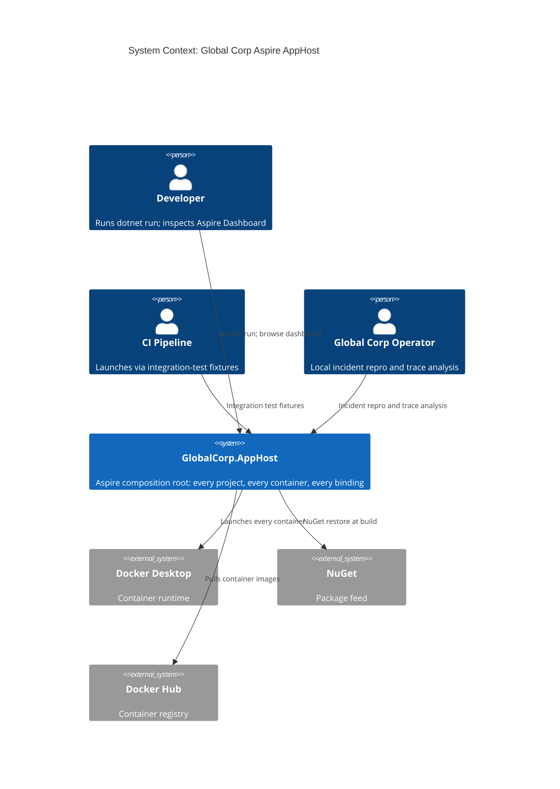

# Global Corp Aspire AppHost -- System Specification

## Tracking

| Field | Value |
|---|---|
| slug | aspire-apphost |
| itemType | SystemSpec |
| name | Global Corp Aspire AppHost |
| shortDescription | Aspire AppHost composition that launches every project, every container, and every gate simulator in the Global Corp Local Simulation Profile |
| version | 1 |
| specLangVersion | 0.1.0 |
| publishStatus | Draft |
| retentionPolicy | indefinite |
| freshnessSla | P90D |
| lastReviewed | 2026-04-18 |
| authors | [PER-01 Lena Brandt] |
| reviewers | [PER-11 Anja Petersen] |
| committer | PER-01 Lena Brandt |
| tags | [platform, aspire, apphost, local-simulation-first] |
| createdAt | 2026-04-18T00:00:00Z |
| updatedAt | 2026-04-18T00:00:00Z |
| Dependencies | global-corp.architecture.spec.md, service-defaults.spec.md |
| State | Draft |
| Reviewed | |
| Approved | |
| Executed | |
| Verified | |

This specification describes the `GlobalCorp.AppHost` project, the single entry point for the Global Corp Platform Local Simulation Profile. The AppHost is a .NET 10 console project referencing .NET Aspire 13.2. It declares every subsystem project, every infrastructure container, every gate simulator container, and every connection binding between them. Running `dotnet run --project GlobalCorp.AppHost` launches the full platform and opens the Aspire Dashboard.

The AppHost implements Governing Constraint 3 (.NET Aspire for all .NET orchestration) from the enterprise architecture spec. It is the composition root that realizes Constraints 1 (local-first), 2 (cloud-deployable by configuration), and 7 (external subsystems in Docker containers locally).

## Context

```spec
person Developer {
    description: "A Global Corp platform engineer running the full
                  platform locally against gate simulators for feature
                  development, integration testing, and debugging.";
    @tag("internal", "primary-user");
}

person CIPipeline {
    description: "Automated CI runner that launches the AppHost in
                  a Docker-in-Docker or Testcontainers context to
                  execute end-to-end integration tests.";
    @tag("automation", "ci");
}

person GlobalCorpOperator {
    description: "A Global Corp SRE inspecting the Aspire Dashboard
                  for trace, log, and metric analysis during a local
                  repro of a production incident.";
    @tag("internal", "operator");
}

external system DockerDesktop {
    description: "The container runtime that Aspire uses to launch
                  every container declared by the AppHost. Required
                  on every developer workstation.";
    technology: "Docker Desktop (Linux containers)";
    @tag("external", "runtime");
}

external system NuGet {
    description: "Package feed supplying the Aspire NuGets, .NET
                  platform NuGets, and every approved package per
                  the Global Corp enterprise Package Policy.";
    technology: "NuGet v3 HTTPS feed";
    @tag("external", "package-feed");
}

external system DockerHub {
    description: "Container registry supplying the infrastructure
                  images (postgres:17-alpine, redis:7-alpine,
                  minio/minio, eclipse-mosquitto, apache/age).";
    technology: "OCI registry over HTTPS";
    @tag("external", "registry");
}

Developer -> AspireAppHost : "Launches via dotnet run and inspects resources through the Aspire Dashboard.";

CIPipeline -> AspireAppHost : "Launches as part of end-to-end integration test fixtures.";

GlobalCorpOperator -> AspireAppHost : "Runs local repros, inspects traces and logs via the Aspire Dashboard.";

AspireAppHost -> DockerDesktop {
    description: "Creates, starts, and stops every container declared by the composition.";
    technology: "Docker Engine API";
}

AspireAppHost -> NuGet : "Restores NuGet packages at build time.";
AspireAppHost -> DockerHub : "Pulls container images on first launch.";
```

Rendered system context:



## System Declaration

```spec
system AspireAppHost {
    target: "net10.0";
    aspire_version: "13.2.x";
    responsibility: "Single Aspire composition root that launches the
                     full Global Corp Platform on a developer
                     workstation. Declares 11 subsystem projects, 7
                     infrastructure containers, and 10 external gate
                     simulator containers. Wires connection strings,
                     health checks, and telemetry between them. Opens
                     the Aspire Dashboard for observability.";

    authored component GlobalCorp.AppHost {
        kind: "aspire-apphost";
        path: "src/GlobalCorp.AppHost";
        status: new;
        responsibility: "Aspire AppHost console project. Hosts the
                         DistributedApplication builder, declares
                         every resource, and runs the Aspire host
                         loop.";
        contract {
            guarantees "Every subsystem project declared in the
                        architecture spec Section 9 is registered
                        via builder.AddProject<T>.";
            guarantees "Every infrastructure container (pg-eu, pg-us,
                        pg-apac, pg-graph, redis, minio, mosquitto)
                        is registered with a named volume for
                        persistent state across AppHost restarts.";
            guarantees "Every gate simulator container (gate-pay,
                        gate-send, gate-carrier, gate-wms, gate-iot,
                        gate-idp, gate-customs, gate-dpp-registry,
                        gate-fsma, gate-audit) is registered and
                        health-checked before dependent projects
                        start.";
            guarantees "Each project WithReference declaration produces
                        environment variables and connection strings
                        in the consumed project; no manual wiring is
                        required in subsystem code.";
            guarantees "The Aspire Dashboard is exposed on a local
                        port announced at startup.";
        }
    }

    authored component GlobalCorp.AppHost.Tests {
        kind: tests;
        path: "tests/GlobalCorp.AppHost.Tests";
        status: new;
        responsibility: "End-to-end smoke tests using
                         Aspire.Hosting.Testing. Launches the AppHost
                         in-process, waits for every resource to
                         reach a healthy state, probes a minimal
                         happy-path flow across every tier, and
                         shuts down.";
        contract {
            guarantees "Every declared resource reaches a healthy
                        state within the configured startup timeout.";
            guarantees "A synthetic carrier event submitted to app-pc
                        propagates through app-eb to app-tc within
                        the smoke test's budget.";
            guarantees "The Aspire Dashboard responds on its declared
                        port within the smoke test's budget.";
        }
    }

    consumed component Aspire.Hosting {
        source: nuget("Aspire.Hosting");
        version: "13.2.*";
        responsibility: "Core Aspire hosting primitives:
                         DistributedApplication, builder, resource
                         model, connection binding.";
        used_by: [GlobalCorp.AppHost];
    }

    consumed component Aspire.Hosting.AppHost {
        source: nuget("Aspire.Hosting.AppHost");
        version: "13.2.*";
        responsibility: "AppHost-specific tooling (MSBuild integration,
                         launch settings, dashboard embedding).";
        used_by: [GlobalCorp.AppHost];
    }

    consumed component Aspire.Hosting.PostgreSQL {
        source: nuget("Aspire.Hosting.PostgreSQL");
        version: "13.2.*";
        responsibility: "Typed helpers for PostgreSQL containers with
                         health checks and connection-string binding.";
        used_by: [GlobalCorp.AppHost];
    }

    consumed component Aspire.Hosting.Redis {
        source: nuget("Aspire.Hosting.Redis");
        version: "13.2.*";
        responsibility: "Typed helpers for Redis (Streams and cache)
                         containers.";
        used_by: [GlobalCorp.AppHost];
    }

    consumed component Aspire.Hosting.Testing {
        source: nuget("Aspire.Hosting.Testing");
        version: "13.2.*";
        responsibility: "In-process launch of the AppHost for
                         end-to-end smoke tests.";
        used_by: [GlobalCorp.AppHost.Tests];
    }

    consumed component xunit {
        source: nuget("xunit.v3");
        version: "1.*";
        responsibility: "Test framework.";
        used_by: [GlobalCorp.AppHost.Tests];
    }
}
```

## Data Specification

### Enums

```spec
enum GateMode {
    Stub:        "Returns canned responses",
    Record:      "Proxies to the real external and records request/response pairs",
    Replay:      "Returns previously recorded responses for matching requests",
    FaultInject: "Returns configurable failures (4xx, 5xx, timeouts, malformed bodies)"
}

enum Tier {
    Tier0_Foundation:   "app-es, app-so",
    Tier1_Ingestion:    "app-pc, app-eb",
    Tier2_Data:         "app-tc, app-dp",
    Tier3_Consumption:  "app-oi, app-cx-api, app-cx-portal, app-cc",
    Tier4_Regulatory:   "app-sd"
}

enum ContainerKind {
    Infrastructure: "Shared infrastructure (databases, brokers, object storage)",
    Gate:           "External system simulator following the PayGate pattern"
}
```

### Entities

```spec
entity ResourceDeclaration {
    name: string;
    kind: string;       // "project", "container", "connection-string"
    dependencies: string?;
    volume: string?;
    image: string?;

    invariant "name required": name != "";
    invariant "kind required": kind != "";
    invariant "unique name": name is unique within the AppHost composition;
}

entity HealthCheck {
    resourceName: string;
    endpoint: string;
    timeoutSeconds: int @range(1..300) @default(30);

    invariant "positive timeout": timeoutSeconds > 0;
}

entity ConnectionBinding {
    consumer: string;
    producer: string;
    environmentVariableName: string;

    invariant "consumer required": consumer != "";
    invariant "producer required": producer != "";
    invariant "env var required": environmentVariableName != "";
}

entity GateConfiguration {
    gateName: string;
    defaultMode: GateMode @default(Stub);
    managementPort: int @range(1024..65535);

    invariant "gate known": gateName in [
        "gate-pay", "gate-send", "gate-carrier", "gate-wms",
        "gate-iot", "gate-idp", "gate-customs", "gate-dpp-registry",
        "gate-fsma", "gate-audit"
    ];
}
```

## Contracts

```spec
contract LaunchComposition {
    requires Docker Desktop is running;
    requires every Aspire.Hosting.* NuGet is restored;
    ensures every infrastructure container reaches healthy state;
    ensures every gate container reaches healthy state;
    ensures every subsystem project reaches healthy state after its
            dependencies are healthy;
    ensures Aspire Dashboard is reachable on its declared port;
    guarantees "Launch failures surface in the Aspire Dashboard with
                resource-level error details. Dependent resources
                do not start until their prerequisites are healthy.";
}

contract SwitchGateMode {
    requires gate in [gate-pay, gate-send, gate-carrier, gate-wms,
                      gate-iot, gate-idp, gate-customs, gate-dpp-registry,
                      gate-fsma, gate-audit];
    requires mode in [Stub, Record, Replay, FaultInject];
    ensures gate's active mode equals mode;
    guarantees "Mode switching calls the gate's management endpoint.
                No restart is required. The mode change is reflected
                in the gate's next response.";
}

contract InspectGateLog {
    requires gate is running;
    ensures response contains request/response pairs since the last
            clear call;
    guarantees "Test assertions can verify subsystem behavior by
                inspecting gate logs. Logs are in-memory and reset
                on container restart.";
}
```

## Topology

```spec
topology Dependencies {
    allow AppHost -> every infrastructure container;
    allow AppHost -> every gate container;
    allow AppHost -> every subsystem project;

    allow subsystem project -> infrastructure container when declared via WithReference;
    allow subsystem project -> gate container when declared via WithReference;
    allow subsystem project -> subsystem project when declared via WithReference;

    deny infrastructure container -> subsystem project;
    deny gate container -> subsystem project
        except as REST responses to subsystem-initiated calls;

    invariant "health ordering":
        a subsystem project must not start serving requests before its
        declared WithReference dependencies are healthy;
}
```

## Phases

```spec
phase AppHostCompile {
    produces: [GlobalCorp.AppHost];
    gate BuildAppHost {
        command: "dotnet build src/GlobalCorp.AppHost";
        expects: "zero errors";
    }
}

phase ContainerImagesPresent {
    requires: AppHostCompile;
    gate VerifyInfrastructureImages {
        command: "docker image inspect postgres:17-alpine redis:7-alpine minio/minio:latest eclipse-mosquitto:2-openssl apache/age:latest";
        expects: "exit_code == 0";
    }
    gate VerifyGateImages {
        command: "docker image inspect globalcorp/paygate:latest globalcorp/sendgate:latest globalcorp/carrier-gate:latest globalcorp/wms-gate:latest globalcorp/iot-gate:latest globalcorp/idp-gate:latest globalcorp/customs-gate:latest globalcorp/dpp-registry-gate:latest globalcorp/fsma-gate:latest globalcorp/audit-gate:latest";
        expects: "exit_code == 0";
        rationale "Gate images are built by their respective gate
                   spec pipelines. The AppHost expects them to be
                   present in the local Docker image cache.";
    }
}

phase LocalLaunch {
    requires: ContainerImagesPresent;
    gate AppHostStartup {
        command: "dotnet run --project src/GlobalCorp.AppHost --no-build -- --wait-for-healthy";
        expects: "every resource reaches healthy state; dashboard port announced";
    }
}

phase Testing {
    requires: LocalLaunch;
    gate SmokeTests {
        command: "dotnet test tests/GlobalCorp.AppHost.Tests";
        expects: "all tests pass", fail == 0;
    }
}
```

## Traces

```spec
trace ResourceDeclaration -> [GlobalCorp.AppHost];
trace HealthCheck -> [GlobalCorp.AppHost];
trace ConnectionBinding -> [GlobalCorp.AppHost];
trace GateConfiguration -> [GlobalCorp.AppHost];

trace LaunchComposition -> [GlobalCorp.AppHost];
trace SwitchGateMode -> [GlobalCorp.AppHost.Tests];
trace InspectGateLog -> [GlobalCorp.AppHost.Tests];
```

## System-Level Constraints

```spec
constraint SingleCompositionRoot {
    scope: [GlobalCorp.AppHost];
    rule: "The AppHost is the single Aspire composition root for the
           Local Simulation Profile. No subsystem project may host
           its own DistributedApplication.";
    rationale "Constraint 3 requires Aspire-based orchestration.
               A single composition root makes resource discovery,
               health propagation, and telemetry routing
               deterministic.";
}

constraint CloudDeployableByConfiguration {
    scope: [GlobalCorp.AppHost];
    rule: "Every container reference and every external endpoint is
           declared such that swapping the image tag or base URL via
           configuration activates the Cloud Production Profile.
           No code change is required.";
    rationale "Constraint 2. When cloud deployment is approved, the
               AppHost's container declarations become Aspire.Azure.*
               or Aspire.AWS.* resource declarations. Subsystem code
               is unchanged.";
}

constraint PersistentVolumesForInfra {
    scope: [GlobalCorp.AppHost];
    rule: "Each PostgreSQL, MinIO, and Mosquitto container declares a
           named Docker volume for persistent state. Gate containers
           keep in-memory state only and do not declare volumes.";
    rationale "Developer experience: data survives AppHost restarts
               for infrastructure containers. Gates intentionally
               reset on restart to give tests a clean slate.";
}

constraint GateModeDefaultsToStub {
    scope: [GlobalCorp.AppHost];
    rule: "Every gate starts in Stub mode unless an environment
           variable overrides. Tests that need Record, Replay, or
           FaultInject must configure the mode explicitly via the
           gate's management API.";
    rationale "Stub is the fastest and most deterministic default.
               Tests needing other modes opt in explicitly.";
}
```

## Package Policy

The AppHost inherits the enterprise `weakRef<PackagePolicy>(GlobalCorpPolicy)` declared in `global-corp.architecture.spec.md` Section 8. No subsystem-local allowances are required beyond the `aspire` and `testing` allow categories.

## Platform Realization

```spec
dotnet solution GlobalCorp {
    format: slnx;
    startup: GlobalCorp.AppHost;

    folder "src/platform" {
        projects: [GlobalCorp.AppHost, GlobalCorp.ServiceDefaults];
    }

    folder "tests/platform" {
        projects: [GlobalCorp.AppHost.Tests];
    }

    rationale "The AppHost and ServiceDefaults are peer cross-cutting
               projects under src/platform. Subsystem solutions live
               under src/apps and reference GlobalCorp.ServiceDefaults
               from there. The AppHost references every subsystem
               project by project reference or, for portal-style
               Blazor WASM projects, by PublishProfile.";
}
```

## Deployment

```spec
deployment LocalSimulation {
    node "Developer Workstation" {
        technology: "Docker Desktop, .NET 10 SDK, Aspire 13.2";

        process "dotnet run --project GlobalCorp.AppHost" {
            kind: "aspire-host";
            launches: "11 subsystem projects, 7 infrastructure
                       containers, 10 gate containers, 1 Aspire
                       Dashboard";
        }
    }

    rationale "Single-command launch. No external dependencies beyond
               Docker Desktop and the .NET 10 SDK. Image pull on
               first run; subsequent runs reuse cached images and
               named volumes.";
}

deployment CloudProduction {
    status: deferred;
    rationale "Constraint 2. When activated, the AppHost swaps its
               local container declarations for cloud equivalents
               via Aspire.Azure.* or Aspire.AWS.* integrations.
               Subsystem code is unchanged.";
}
```

## Views

```spec
view systemContext of AspireAppHost ContextView {
    include: all;
    autoLayout: top-down;
    description: "AppHost with its users (Developer, CI Pipeline,
                  Operator) and the Docker Desktop, NuGet, and
                  Docker Hub externals it depends on.";
}

view container of AspireAppHost ContainerView {
    include: all;
    autoLayout: left-right;
    description: "AppHost composition: subsystem projects,
                  infrastructure containers, gate simulators, and
                  their dependency edges.";
}
```

## Dynamic Scenarios

### Cold launch

```spec
dynamic ColdLaunch {
    1: Developer -> AspireAppHost : "dotnet run --project GlobalCorp.AppHost";
    2: AspireAppHost -> DockerDesktop : "Pull missing container images from Docker Hub.";
    3: AspireAppHost -> DockerDesktop : "Create named volumes for pg-eu, pg-us, pg-apac, pg-graph, minio, mosquitto.";
    4: AspireAppHost -> DockerDesktop : "Start infrastructure containers; wait for health.";
    5: AspireAppHost -> DockerDesktop : "Start gate containers; wait for health.";
    6: AspireAppHost -> AspireAppHost : "Launch Tier 0 projects (app-es, app-so); wait for health.";
    7: AspireAppHost -> AspireAppHost : "Launch Tier 1 projects (app-pc, app-eb); wait for health.";
    8: AspireAppHost -> AspireAppHost : "Launch Tier 2 projects (app-tc, app-dp); wait for health.";
    9: AspireAppHost -> AspireAppHost : "Launch Tier 3 projects (app-oi, app-cx-api, app-cx-portal, app-cc); wait for health.";
    10: AspireAppHost -> AspireAppHost : "Launch Tier 4 project (app-sd); wait for health.";
    11: AspireAppHost -> Developer : "Announce Aspire Dashboard URL in console output.";
}
```

```mermaid
sequenceDiagram
    autonumber
    actor dev as Developer
    participant host as AspireAppHost
    participant docker as Docker Desktop

    dev->>host: dotnet run
    host->>docker: Pull images (infra + gates)
    host->>docker: Create named volumes
    host->>docker: Start infrastructure containers; wait healthy
    host->>docker: Start gate containers; wait healthy
    host->>host: Launch Tier 0 projects (app-es, app-so)
    host->>host: Launch Tier 1 projects (app-pc, app-eb)
    host->>host: Launch Tier 2 projects (app-tc, app-dp)
    host->>host: Launch Tier 3 projects (app-oi, app-cx-*, app-cc)
    host->>host: Launch Tier 4 project (app-sd)
    host-->>dev: Announce Aspire Dashboard URL
```

### Gate mode switch during a test

```spec
dynamic SwitchGateMode {
    1: GlobalCorp.AppHost.Tests -> gate-carrier : "PUT /admin/mode with body { mode: FaultInject }";
    2: gate-carrier -> gate-carrier : "Switch active mode atomically.";
    3: gate-carrier -> GlobalCorp.AppHost.Tests : "200 OK, currentMode: FaultInject.";
    4: GlobalCorp.AppHost.Tests -> app-pc : "Submit a test shipment event.";
    5: app-pc -> gate-carrier : "Relay call (configured to carrier).";
    6: gate-carrier -> app-pc : "503 Service Unavailable per FaultConfig.";
    7: app-pc -> GlobalCorp.AppHost.Tests : "Retry exhausted response.";
    8: GlobalCorp.AppHost.Tests -> GlobalCorp.AppHost.Tests : "Assert retry behavior and telemetry.";
}
```

## Open Items

- **AppHost image publishing strategy**: The Aspire 13.2 `apphost publish` command produces a manifest for cloud deployment. Decide whether to publish the manifest during Local Simulation validation or only at Cloud Production activation.
- **Dashboard authentication**: Aspire 13.2 allows dashboard authentication. Local Simulation keeps it open on localhost; multi-developer scenarios (shared dev box) may want OIDC integration with `app-es`.
- **Gate image source of truth**: Each gate's spec authors its Dockerfile. Coordination: either a shared `tools/build-gate-images.ps1` script or each gate solution publishes its image to a local OCI registry. The shared script is simpler; the local registry is closer to production shape.
- **Multi-host dev scenarios**: When two developers collaborate on a shared dev machine, port collisions are possible. Aspire 13.2's isolated environments feature addresses this; the pattern needs documenting once a team adopts it.
