# AuditGate -- System Specification

## Tracking

| Field | Value |
|---|---|
| slug | audit-gate |
| itemType | SystemSpec |
| name | AuditGate |
| shortDescription | Test harness that mimics third-party audit and compliance review platforms (SOC 2, ISO 27001, ISO 28000, ESG assurance) for APP-CC Compliance Core |
| version | 1 |
| specLangVersion | 0.1.0 |
| publishStatus | Draft |
| retentionPolicy | indefinite |
| freshnessSla | P90D |
| lastReviewed | 2026-04-18 |
| authors | [PER-01 Lena Brandt] |
| reviewers | [PER-17 Isabelle Laurent] |
| committer | PER-01 Lena Brandt |
| tags | [gate, simulator, audit, compliance, app-cc, soc2, iso27001, iso28000, esg] |
| createdAt | 2026-04-18T00:00:00Z |
| updatedAt | 2026-04-18T00:00:00Z |
| Dependencies | global-corp.architecture.spec.md |
| State | Draft |
| Reviewed | |
| Approved | |
| Executed | |
| Verified | |

This specification describes AuditGate, a test harness that mimics the REST surface of third-party audit and compliance review platforms used for SOC 2 Type I and Type II attestations, ISO 27001 certification, ISO 28000 supply-chain security certification, and ESG assurance engagements. APP-CC Compliance Core points to AuditGate instead of the real auditor platforms when running in test, development, and Aspire AppHost local profiles. AuditGate supports four behavior modes: returning preconfigured stubs, recording live auditor traffic, replaying recorded responses, and injecting configurable faults.

AuditGate is an HTTP-level proxy and stub built as an ASP.NET 10 minimal API. It exposes the same REST endpoints that APP-CC calls on the real auditor platforms for evidence bundle submission, engagement creation, finding exchange, report retrieval, and certificate issuance. No production code in APP-CC changes between real and simulated auditor targets; only the base URL differs.

The gate follows the PayGate and SendGate pattern used across the Global Corp Platform gate simulator family. It ships as a Docker image, `globalcorp/audit-gate:latest`, and is consumed by `GlobalCorp.AppHost` as the `gate-audit` container resource. A typed .NET client library, `AuditGate.Client`, wraps both the auditor-compatible endpoints and the gate management endpoints so that APP-CC test projects can configure behavior mode and inspect request logs without raw HTTP calls.

## Context

```spec
person Developer {
    description: "A developer running APP-CC integration tests or
                  working locally against the audit platform stub
                  instead of a live auditor service.";
    @tag("internal", "test");
}

person CIPipeline {
    description: "Automated CI/CD pipeline that runs APP-CC
                  integration tests against AuditGate to validate
                  evidence submission and finding response flows
                  without touching real auditor platforms.";
    @tag("automation", "test");
}

person ComplianceOfficer {
    description: "A compliance officer dry-running an engagement
                  walkthrough (SOC 2, ISO 27001, ISO 28000, ESG)
                  against AuditGate before the real auditor kickoff.";
    @tag("internal", "compliance");
}

external system ThirdPartyAuditPlatform {
    description: "Live third-party audit and compliance review
                  platform operated by an auditor or certification
                  body. AuditGate proxies to this platform in Record
                  mode and mimics its REST surface in all other
                  modes.";
    technology: "REST/HTTPS";
    @tag("auditor", "external");
}

external system "APP-CC Compliance Core" {
    description: "The Global Corp subsystem that normally calls the
                  auditor platform. In test and local simulation it
                  calls AuditGate at the same REST endpoints.";
    technology: "REST/HTTPS";
    @tag("consumer", "global-corp");
}

external system "GlobalCorp.AppHost" {
    description: "The Aspire AppHost that starts AuditGate as the
                  gate-audit container and wires APP-CC references
                  to it in the Local Simulation Profile.";
    technology: ".NET Aspire 13.2";
    @tag("orchestrator", "global-corp");
}

Developer -> AuditGate : "Configures behavior mode and inspects request logs.";

CIPipeline -> AuditGate : "Runs automated audit engagement integration tests.";

ComplianceOfficer -> AuditGate : "Dry-runs engagement walkthroughs per framework.";

"APP-CC Compliance Core" -> AuditGate {
    description: "Submits evidence bundles, opens engagements,
                  posts finding responses, retrieves audit reports,
                  and requests certificate issuance. In Local
                  Simulation Profile the base URL points at
                  AuditGate.";
    technology: "REST/HTTPS";
}

"GlobalCorp.AppHost" -> AuditGate {
    description: "Starts the gate-audit container and exposes it
                  as a service reference to APP-CC.";
    technology: ".NET Aspire 13.2";
}

AuditGate -> ThirdPartyAuditPlatform {
    description: "Proxies requests to the real auditor platform in
                  Record mode only.";
    technology: "REST/HTTPS";
}
```

Rendered system context:

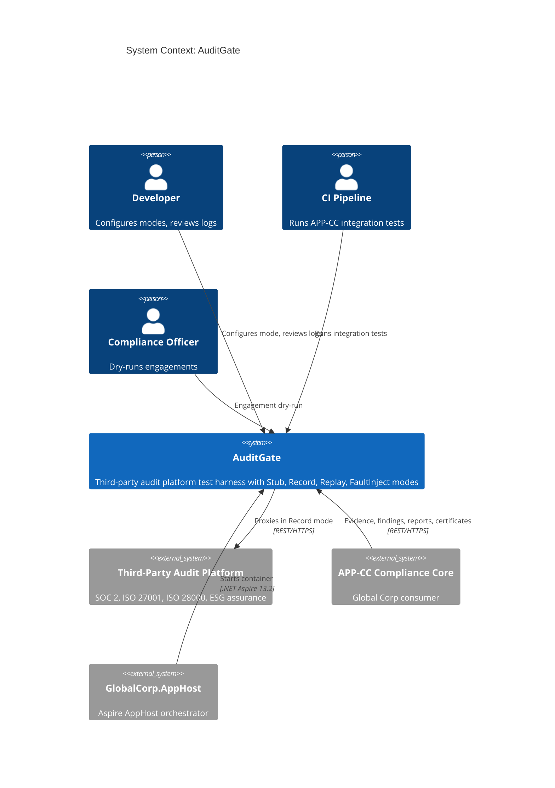

## System Declaration

```spec
system AuditGate {
    target: "net10.0";
    responsibility: "HTTP-level test harness that mimics third-party
                     audit and compliance review platforms used for
                     SOC 2, ISO 27001, ISO 28000, and ESG assurance
                     engagements. Supports four behavior modes: Stub,
                     Record, Replay, FaultInject. Allows APP-CC to
                     validate its evidence submission, engagement
                     lifecycle, finding response, report retrieval,
                     and certificate issuance flows without calling
                     live auditor platforms.";

    authored component AuditGate.Server {
        kind: "api-host";
        path: "src/AuditGate.Server";
        status: new;
        responsibility: "ASP.NET 10 minimal API that exposes
                         auditor-compatible REST endpoints for
                         evidence bundle submission, engagement
                         creation, finding submission and response,
                         report retrieval, and certificate
                         issuance. Routes incoming requests through
                         the active behavior mode and applies
                         framework-specific evidence expectations.";
        contract {
            guarantees "Exposes POST /audit/v1/evidence,
                        POST /audit/v1/engagements,
                        POST /audit/v1/findings,
                        POST /audit/v1/findings/{id}/response,
                        GET /audit/v1/reports/{engagementId}, and
                        POST /audit/v1/certificates matching the
                        auditor platform request and response
                        shapes.";
            guarantees "Behavior mode is switchable at runtime via
                        the management endpoint without restarting
                        the server.";
            guarantees "Framework-specific evidence expectations
                        are applied in Stub mode: SOC 2 requires
                        trust-services-criteria coverage, ISO 27001
                        requires Annex A control mapping, ISO 28000
                        requires supply-chain security controls,
                        ESG assurance requires sustainability KPI
                        references.";
            guarantees "All incoming requests and outgoing responses
                        are captured in an in-memory log accessible
                        via the management API.";
        }
    }

    authored component AuditGate.Client {
        kind: library;
        path: "src/AuditGate.Client";
        status: new;
        responsibility: "A typed .NET client library that matches
                         auditor platform client shapes. APP-CC can
                         swap its production auditor client for
                         AuditGate.Client through dependency
                         injection without changing calling code.";
        contract {
            guarantees "Public API surface mirrors the auditor
                        platform methods used by APP-CC:
                        SubmitEvidence, CreateEngagement,
                        SubmitFinding, RespondToFinding, GetReport,
                        IssueCertificate.";
            guarantees "Targets AuditGate.Server by default. The
                        base URL is configurable via the Aspire
                        service reference or an environment
                        variable.";
            guarantees "Exposes management methods: ConfigureMode
                        and GetRequestLog, for test and inspection
                        use.";
        }

        rationale {
            context "APP-CC calls third-party audit platforms
                     through a typed client. Swapping the base URL
                     alone is insufficient because test code also
                     needs mode configuration and log inspection
                     methods.";
            decision "A dedicated client library wraps both the
                      auditor-compatible endpoints and the AuditGate
                      management endpoints in a single package.";
            consequence "APP-CC test projects reference
                         AuditGate.Client and register it in DI.
                         Production code continues to use the real
                         auditor platform clients.";
        }
    }

    authored component AuditGate.Tests {
        kind: tests;
        path: "tests/AuditGate.Tests";
        status: new;
        responsibility: "Integration and unit tests for
                         AuditGate.Server and AuditGate.Client.
                         Verifies each behavior mode, request
                         logging, fault injection, framework-
                         specific evidence expectations, and client
                         parity with the auditor platform shape.";
    }

    consumed component xunit {
        source: nuget("xunit");
        version: "2.*";
        responsibility: "Unit and integration testing framework.";
        used_by: [AuditGate.Tests];
    }

    consumed component TestHost {
        source: nuget("Microsoft.AspNetCore.Mvc.Testing");
        version: "10.*";
        responsibility: "In-process test server for integration
                         testing ASP.NET minimal API endpoints.";
        used_by: [AuditGate.Tests];
    }

    consumed component SystemNetHttpJson {
        source: nuget("System.Net.Http.Json");
        version: "10.*";
        responsibility: "Strongly-typed JSON helpers for HTTP client
                         calls to AuditGate.Server from
                         AuditGate.Client.";
        used_by: [AuditGate.Client];
    }
}
```

## Data Specification

### Enums

```spec
enum BehaviorMode {
    Stub: "Returns preconfigured static responses for all endpoints",
    Record: "Proxies requests to a live auditor platform and records request and response",
    Replay: "Returns previously recorded responses matched by request signature",
    FaultInject: "Returns configurable error responses to test failure handling"
}

enum AuditFramework {
    Soc2_TypeI: "SOC 2 Type I: design of controls at a point in time",
    Soc2_TypeII: "SOC 2 Type II: operating effectiveness of controls over a period",
    Iso27001: "ISO/IEC 27001 information security management certification",
    Iso28000: "ISO 28000 supply-chain security management certification",
    EsgAssurance: "ESG assurance engagement over sustainability and governance disclosures",
    Generic: "Fallback framework when no specialization applies"
}

enum FindingSeverity {
    Low: "Observation with limited impact; corrective action recommended",
    Medium: "Deficiency that should be remediated before next review",
    High: "Significant deficiency that materially affects the engagement",
    Critical: "Pervasive deficiency blocking the engagement or certificate issuance"
}

enum FindingStatus {
    Open: "Finding raised by the auditor, awaiting customer response",
    Responded: "Customer has submitted a response, awaiting auditor review",
    Resolved: "Auditor accepts the response and closes the finding",
    Waived: "Finding is waived with documented rationale"
}

enum EngagementState {
    Scoping: "Engagement created, scope being defined",
    InProgress: "Fieldwork underway, evidence exchange active",
    FindingsIssued: "Findings have been raised and are in response cycle",
    Concluded: "Engagement closed and report issued"
}
```

### Entities

The data model captures both the auditor-compatible domain objects and the internal recording and configuration state.

```spec
entity AuditEngagement {
    engagementId: string;
    framework: AuditFramework @default(Generic);
    scope: string;
    auditorOrg: string;
    startedAt: string;
    state: EngagementState @default(Scoping);

    invariant "engagement id required": engagementId != "";
    invariant "scope required": scope != "";
    invariant "auditor org required": auditorOrg != "";

    rationale "framework" {
        context "Different frameworks drive different evidence
                 expectations and different report structures.
                 The engagement carries the framework so every
                 subsequent call is resolved in context.";
        decision "framework is a first-class field on
                  AuditEngagement. It cannot change after the
                  engagement is created.";
        consequence "APP-CC test fixtures pick a framework at
                     engagement creation and the gate applies
                     matching evidence rules throughout.";
    }
}

entity EvidenceBundle {
    bundleId: string;
    manifest: string;
    sha256: string;
    signedBy: string;
    submittedAt: string;
    engagementId: string?;

    invariant "bundle id required": bundleId != "";
    invariant "manifest required": manifest != "";
    invariant "sha256 required": sha256 != "";
    invariant "signed by required": signedBy != "";
}

entity AuditFinding {
    id: string;
    severity: FindingSeverity @default(Low);
    status: FindingStatus @default(Open);
    title: string;
    description: string;
    response: string?;
    engagementId: string;

    invariant "id required": id != "";
    invariant "title required": title != "";
    invariant "engagement reference": engagementId != "";
}

entity AuditReport {
    engagementId: string;
    framework: AuditFramework;
    issuedAt: string;
    summary: string;
    findingsCount: int @range(0..9999);
    opinion: string;

    invariant "engagement reference": engagementId != "";
    invariant "summary required": summary != "";
    invariant "opinion required": opinion != "";
    invariant "non-negative count": findingsCount >= 0;
}

entity AuditCertificate {
    certificateId: string;
    engagementId: string;
    framework: AuditFramework;
    issuedAt: string;
    validUntil: string;
    signedArtifactUri: string;

    invariant "certificate id required": certificateId != "";
    invariant "engagement reference": engagementId != "";
    invariant "signed artifact required": signedArtifactUri != "";
}

entity AuditGateRequest {
    id: string;
    timestamp: string;
    method: string;
    path: string;
    body: string?;
    headers: string?;

    invariant "id required": id != "";
    invariant "path required": path != "";
}

entity AuditGateResponse {
    id: string;
    requestId: string;
    statusCode: int @range(100..599);
    body: string?;
    latencyMs: int;

    invariant "id required": id != "";
    invariant "request reference": requestId != "";
    invariant "valid status code": statusCode >= 100;
}

entity FaultConfig {
    statusCode: int @range(400..599) @default(500);
    errorType: string @default("audit_error");
    errorMessage: string @default("Simulated AuditGate fault");
    delayMs: int @range(0..30000) @default(0);
    appliesToFramework: AuditFramework?;

    invariant "error status code": statusCode >= 400;
    invariant "non-negative delay": delayMs >= 0;

    rationale "appliesToFramework" {
        context "Some failure scenarios are framework-specific (for
                 example, the auditor rejects an ISO 27001 evidence
                 bundle missing Annex A mapping). Tests need to
                 target fault injection by framework.";
        decision "FaultConfig includes an optional framework
                  filter. When set, the fault applies only to
                  requests whose engagement framework matches.";
        consequence "APP-CC can verify framework-aware error
                     handling without reconfiguring the gate
                     between calls.";
    }
}
```

## Contracts

### Auditor-Compatible Endpoints

These contracts define the API surface that mirrors third-party audit platform REST endpoints.

```spec
contract SubmitEvidence {
    requires bundle.manifest != "";
    requires bundle.sha256 != "";
    requires bundle.signedBy != "";
    ensures accepted.bundleId != "";
    ensures accepted.submittedAt != "";
    guarantees "In Stub mode, returns a synthetic EvidenceBundle
                receipt with a generated bundleId, subject to
                framework-specific manifest checks. In Record mode,
                proxies to the real auditor platform and records
                both request and response. In Replay mode, returns
                the recorded response matching the request
                signature. In FaultInject mode, returns the
                configured error response after the configured
                delay.";
}

contract CreateEngagement {
    requires engagement.scope != "";
    requires engagement.auditorOrg != "";
    requires engagement.framework in [Soc2_TypeI, Soc2_TypeII,
                                      Iso27001, Iso28000,
                                      EsgAssurance, Generic];
    ensures created.engagementId != "";
    ensures created.state == Scoping;
    guarantees "Creates an AuditEngagement and returns its id and
                scoping state. Mode behavior follows the same
                pattern as SubmitEvidence.";
}

contract SubmitFinding {
    requires finding.engagementId != "";
    requires finding.title != "";
    requires finding.severity in [Low, Medium, High, Critical];
    ensures raised.id != "";
    ensures raised.status == Open;
    guarantees "Registers an auditor-raised observation against an
                engagement. Mode behavior follows the same pattern
                as SubmitEvidence.";
}

contract RespondToFinding {
    requires findingId != "";
    requires response != "";
    ensures updated.status in [Responded, Resolved];
    guarantees "Attaches the customer response to the finding and
                advances its status. In Stub mode, the gate moves
                status from Open to Responded. In Record and Replay
                modes the recorded or proxied response applies.";
}

contract GetReport {
    requires engagementId != "";
    ensures report.engagementId == engagementId;
    ensures report.opinion != "";
    guarantees "Returns an AuditReport for the engagement. In Stub
                mode, generates a synthetic report whose shape
                matches the engagement framework. Mode behavior
                follows the same pattern as SubmitEvidence.";
}

contract IssueCertificate {
    requires engagementId != "";
    requires framework in [Soc2_TypeI, Soc2_TypeII, Iso27001,
                           Iso28000, EsgAssurance, Generic];
    ensures certificate.certificateId != "";
    ensures certificate.signedArtifactUri != "";
    guarantees "Returns a signed certificate object for the
                engagement. In Stub mode, the signature is a
                deterministic synthetic value that passes shape
                checks but is not a real trust anchor. In Record
                and Replay modes the real or recorded certificate
                is returned.";
}
```

### Management Endpoints

These contracts define the AuditGate-specific configuration and inspection API.

```spec
contract ConfigureMode {
    requires mode in [Stub, Record, Replay, FaultInject];
    ensures activeMode == mode;
    guarantees "Switches the server behavior mode at runtime. When
                switching to FaultInject, an optional FaultConfig
                payload configures the error response and optional
                framework filter. When switching to Record, live
                auditor platform credentials and base URL must be
                provided.";
}

contract GetRequestLog {
    ensures count(entries) >= 0;
    guarantees "Returns all captured AuditGateRequest and
                AuditGateResponse pairs in chronological order.
                Supports optional filtering by path, framework,
                engagementId, and time range. Log entries persist
                for the lifetime of the server process.";
}
```

## Topology

```spec
topology Dependencies {
    allow AuditGate.Server -> AuditGate.Client;
    allow AuditGate.Tests -> AuditGate.Server;
    allow AuditGate.Tests -> AuditGate.Client;

    deny AuditGate.Client -> AuditGate.Tests;
    deny AuditGate.Server -> AuditGate.Tests;

    invariant "server has no Global Corp subsystem dependency":
        AuditGate.Server does not reference any "APP-*" subsystem;

    invariant "client has no Global Corp subsystem dependency":
        AuditGate.Client does not reference any "APP-*" subsystem;

    rationale {
        context "AuditGate is a standalone test harness. It must
                 not depend on APP-CC or any other Global Corp
                 subsystem so it can be reused by other projects
                 that integrate with third-party audit platforms.";
        decision "AuditGate.Server exposes auditor-compatible REST
                  endpoints. APP-CC points its auditor client base
                  URL at AuditGate in test and Local Simulation
                  profiles. No compile-time dependency exists
                  between the two systems.";
        consequence "AuditGate can be versioned and released
                     independently. Other projects can adopt it by
                     configuring their auditor client base URL to
                     point at AuditGate.";
    }
}
```

Rendered topology:

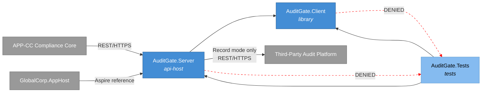

## Phases

```spec
phase ServerCore {
    produces: [AuditGate.Server, AuditGate.Client];

    gate ServerCompile {
        command: "dotnet build src/AuditGate.Server";
        expects: "zero errors";
    }

    gate ClientCompile {
        command: "dotnet build src/AuditGate.Client";
        expects: "zero errors";
    }

    gate HealthCheck {
        command: "curl -f http://localhost:5217/health";
        expects: "exit_code == 0";
    }
}

phase Testing {
    requires: ServerCore;
    produces: [AuditGate.Tests];

    gate UnitTests {
        command: "dotnet test tests/AuditGate.Tests --filter Category=Unit";
        expects: "all tests pass", pass >= 10;
    }

    gate IntegrationTests {
        command: "dotnet test tests/AuditGate.Tests --filter Category=Integration";
        expects: "all tests pass", pass >= 8;
    }

    gate ModeTests {
        command: "dotnet test tests/AuditGate.Tests --filter Category=Mode";
        expects: "all tests pass", pass >= 4;
        rationale "One test per behavior mode confirms that mode
                   switching and mode-specific response logic work
                   correctly.";
    }

    gate FrameworkTests {
        command: "dotnet test tests/AuditGate.Tests --filter Category=Framework";
        expects: "all tests pass", pass >= 5;
        rationale "One test per framework (SOC 2 Type I, SOC 2
                   Type II, ISO 27001, ISO 28000, ESG assurance)
                   confirms that framework-specific evidence and
                   report expectations all apply in Stub mode.";
    }
}

phase Integration {
    requires: Testing;

    gate FullBuild {
        command: "dotnet build AuditGate.slnx";
        expects: "zero errors";
    }

    gate AllTests {
        command: "dotnet test AuditGate.slnx";
        expects: "all tests pass", fail == 0;
    }

    gate ImageBuild {
        command: "docker build -t globalcorp/audit-gate:latest src/AuditGate.Server";
        expects: "image built successfully";
    }

    rationale "Final gate confirms the complete solution builds,
               all tests pass, and the container image is available
               for consumption by GlobalCorp.AppHost before the spec
               can advance to Verified.";
}
```

Rendered phase ordering:

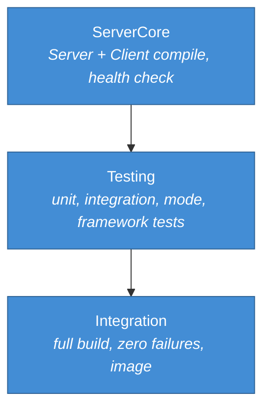

## Traces

```spec
trace AuditFlow {
    SubmitEvidence -> [AuditGate.Server, AuditGate.Client];
    CreateEngagement -> [AuditGate.Server, AuditGate.Client];
    SubmitFinding -> [AuditGate.Server, AuditGate.Client];
    RespondToFinding -> [AuditGate.Server, AuditGate.Client];
    GetReport -> [AuditGate.Server, AuditGate.Client];
    IssueCertificate -> [AuditGate.Server, AuditGate.Client];
    ConfigureMode -> [AuditGate.Server, AuditGate.Client];
    GetRequestLog -> [AuditGate.Server, AuditGate.Client];

    invariant "full coverage":
        all sources have count(targets) >= 1;
    invariant "server always involved":
        all sources have targets contains AuditGate.Server;
}

trace DataModel {
    AuditEngagement -> [AuditGate.Server, AuditGate.Client];
    EvidenceBundle -> [AuditGate.Server, AuditGate.Client];
    AuditFinding -> [AuditGate.Server, AuditGate.Client];
    AuditReport -> [AuditGate.Server, AuditGate.Client];
    AuditCertificate -> [AuditGate.Server, AuditGate.Client];
    AuditGateRequest -> [AuditGate.Server];
    AuditGateResponse -> [AuditGate.Server];
    FaultConfig -> [AuditGate.Server, AuditGate.Client];
    BehaviorMode -> [AuditGate.Server, AuditGate.Client];
    AuditFramework -> [AuditGate.Server, AuditGate.Client];
    FindingSeverity -> [AuditGate.Server, AuditGate.Client];
    FindingStatus -> [AuditGate.Server, AuditGate.Client];
    EngagementState -> [AuditGate.Server, AuditGate.Client];
}
```

## System-Level Constraints

```spec
constraint NoGlobalCorpSubsystemDependency {
    scope: [AuditGate.Server, AuditGate.Client];
    rule: "No references to any APP-* subsystem namespace or
           assembly. AuditGate communicates with Global Corp
           subsystems only at the HTTP boundary.";

    rationale {
        context "AuditGate must remain a general-purpose audit
                 platform test harness, reusable by any project
                 that integrates with third-party auditors across
                 SOC 2, ISO 27001, ISO 28000, and ESG assurance
                 regimes.";
        decision "No compile-time coupling to APP-CC or any other
                  subsystem. The contract is the auditor REST
                  shape, not any application type.";
        consequence "AuditGate can be extracted to a separate
                     repository and published as an independent
                     tool.";
    }
}

constraint NullableEnabled {
    scope: all authored components;
    rule: "Nullable reference types are enabled in every project
           file. No suppression operators (!) outside of test setup
           code.";
}

constraint InMemoryOnly {
    scope: [AuditGate.Server];
    rule: "All state (request logs, recorded responses, stored
           engagements, evidence bundles, findings, certificates,
           fault config) is held in memory. No database, no file
           system persistence. State resets when the server process
           restarts.";

    rationale {
        context "AuditGate is a test-time tool, not a production
                 service. Persistent state would add complexity
                 without benefit.";
        decision "In-memory collections with no external storage
                  dependencies.";
        consequence "Each test run starts with a clean state.
                     Long-running recording sessions should export
                     logs before stopping the server.";
    }
}

constraint ShapeParity {
    scope: [AuditGate.Server];
    rule: "Request and response JSON shapes for every
           /audit/v1/* endpoint match the documented auditor
           platform API surface for the corresponding framework.
           Field names use the platform's published casing.";

    rationale "Shape parity ensures that APP-CC works identically
               against AuditGate and real auditor platforms without
               conditional logic or adapter layers.";
}

constraint TestNaming {
    scope: [AuditGate.Tests];
    rule: "Test methods follow MethodName_Scenario_ExpectedResult
           naming. Test classes mirror the source class name with a
           Tests suffix.";
}
```

## Package Policy

AuditGate inherits the enterprise package policy defined in [global-corp.architecture.spec.md](./global-corp.architecture.spec.md) Section 8.

```spec
package_policy AuditGatePolicy {
    inherits: weakRef<PackagePolicy>(GlobalCorpPolicy);

    rationale "AuditGate is an authored .NET project collection
               under the Global Corp umbrella. It picks up the
               enterprise NuGet allowlists and denylists from
               GlobalCorpPolicy without redeclaring them. Any gate-
               specific package additions would be added here with
               rationale; none are required at this time.";
}
```

## Platform Realization

```spec
dotnet solution AuditGate {
    format: slnx;
    startup: AuditGate.Server;

    folder "src" {
        projects: [AuditGate.Server, AuditGate.Client];
    }

    folder "tests" {
        projects: [AuditGate.Tests];
    }

    rationale {
        context "AuditGate is a small, focused solution with two
                 source projects and one test project, matching
                 the PayGate and SendGate shape.";
        decision "AuditGate.Server is the startup project. It
                  serves the auditor-compatible endpoints and the
                  management API on a single configurable port.";
        consequence "Running dotnet run from the Server project
                     starts the test harness. The default port is
                     5217. The Aspire AppHost overrides the port
                     via service binding when running under the
                     Local Simulation Profile.";
    }
}
```

Rendered solution structure:

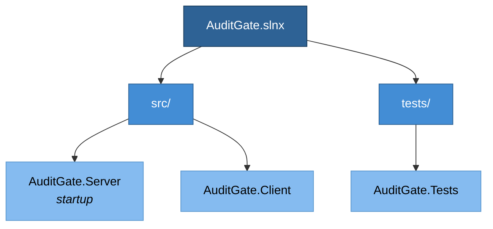

## Deployment

```spec
deployment Development {
    node "Developer Workstation" {
        technology: "Docker Desktop";

        node "AuditGate Container" {
            technology: ".NET 10 SDK";
            image: "globalcorp/audit-gate:latest";
            instance: AuditGate.Server;
            port: 5217;
        }
    }

    rationale "AuditGate runs as a Docker container on the
               developer workstation. GlobalCorp.AppHost declares
               it as the gate-audit container resource and wires
               APP-CC's auditor client base URL to point at
               http://audit-gate:5217.";
}

deployment AspireLocalSimulation {
    node "Aspire AppHost" {
        technology: ".NET Aspire 13.2";

        node "gate-audit Container" {
            technology: ".NET 10 SDK, Docker";
            image: "globalcorp/audit-gate:latest";
            instance: AuditGate.Server;
            port: 5217;
        }
    }

    rationale {
        context "The Global Corp Platform Local Simulation Profile
                 is driven by GlobalCorp.AppHost. It starts every
                 gate simulator, including AuditGate, as a
                 container resource before starting the APP-*
                 projects.";
        decision "AuditGate is declared as the gate-audit resource.
                  APP-CC receives the service reference via
                  WithReference; the base URL is injected as an
                  environment variable.";
        consequence "Running dotnet run --project GlobalCorp.AppHost
                     brings up AuditGate alongside the other nine
                     gate simulators and the platform subsystems.";
    }
}

deployment CI {
    node "GitHub Actions Runner" {
        technology: "ubuntu-latest";

        node "gate-audit Service Container" {
            technology: ".NET 10 SDK, Docker";
            image: "globalcorp/audit-gate:latest";
            instance: AuditGate.Server;
            port: 5217;
        }
    }

    rationale {
        context "Integration tests in CI need a running AuditGate
                 instance to validate APP-CC evidence and finding
                 flows.";
        decision "AuditGate runs as a service container in GitHub
                  Actions. The APP-CC test step sets its auditor
                  base URL to the service container's address.";
        consequence "CI tests exercise the same code paths as
                     production without requiring auditor
                     credentials or network access to real auditor
                     platforms.";
    }
}
```

Rendered deployment:

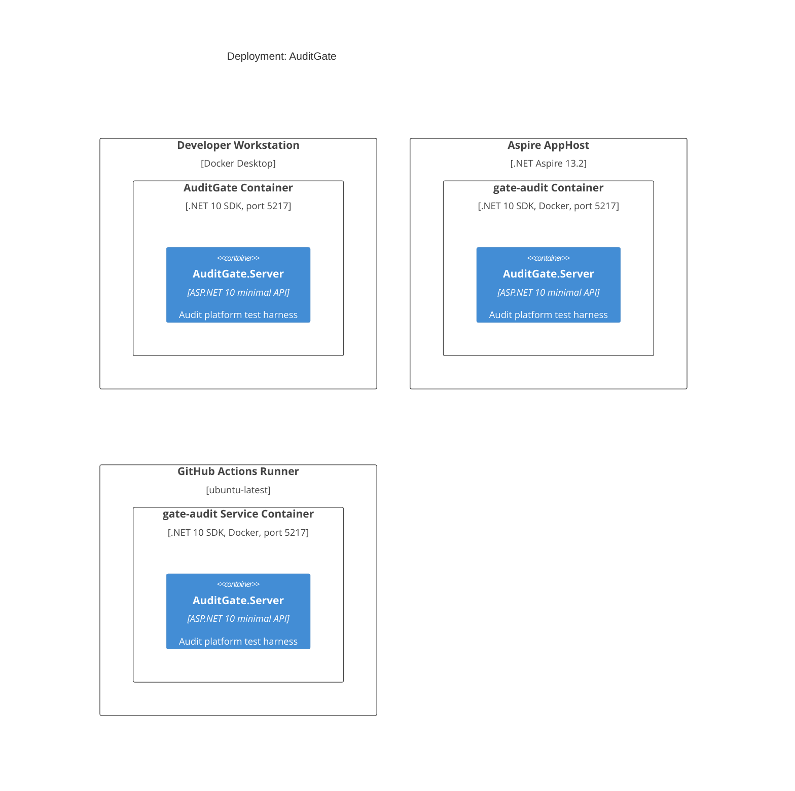

## Views

```spec
view systemContext of AuditGate ContextView {
    include: all;
    autoLayout: top-down;
    description: "AuditGate with its users (Developer, CI Pipeline,
                  Compliance Officer) and external systems (Third-
                  Party Audit Platform, APP-CC,
                  GlobalCorp.AppHost).";
}

view container of AuditGate ContainerView {
    include: all;
    autoLayout: left-right;
    description: "Internal structure showing AuditGate.Server,
                  AuditGate.Client, and AuditGate.Tests with their
                  dependencies.";
}

view deployment of Development DevelopmentDeploymentView {
    include: all;
    autoLayout: top-down;
    description: "Developer workstation running AuditGate as a
                  Docker container alongside other Global Corp
                  services.";
    @tag("dev");
}

view deployment of AspireLocalSimulation AspireDeploymentView {
    include: all;
    autoLayout: top-down;
    description: "Aspire AppHost composition with gate-audit
                  declared as a container resource.";
    @tag("aspire");
}

view deployment of CI CIDeploymentView {
    include: all;
    autoLayout: top-down;
    description: "GitHub Actions runner with AuditGate as a service
                  container for automated APP-CC integration tests.";
    @tag("ci");
}
```

## Dynamic Scenarios

### Stub Mode: Evidence Bundle Submission

APP-CC calls AuditGate in Stub mode during APP-CC integration tests. AuditGate returns a preconfigured acceptance receipt without contacting a real auditor platform.

```spec
dynamic StubSubmitEvidence {
    1: Developer -> AuditGate.Server {
        description: "Configures AuditGate to Stub mode via
                      management API.";
        technology: "REST/HTTPS";
    };
    2: "APP-CC Compliance Core" -> AuditGate.Server {
        description: "POST /audit/v1/evidence with a signed ZIP
                      and manifest for an ISO 27001 engagement.";
        technology: "REST/HTTPS";
    };
    3: AuditGate.Server -> AuditGate.Server
        : "Runs framework-specific manifest check; confirms the
           bundle references Annex A controls.";
    4: AuditGate.Server -> AuditGate.Server
        : "Generates synthetic EvidenceBundle receipt with a
           generated bundleId and timestamp.";
    5: AuditGate.Server -> AuditGate.Server
        : "Logs request and response to in-memory request log.";
    6: AuditGate.Server -> "APP-CC Compliance Core" {
        description: "Returns auditor-shaped JSON with the receipt.";
        technology: "REST/HTTPS";
    };
}
```

Rendered interaction sequence:

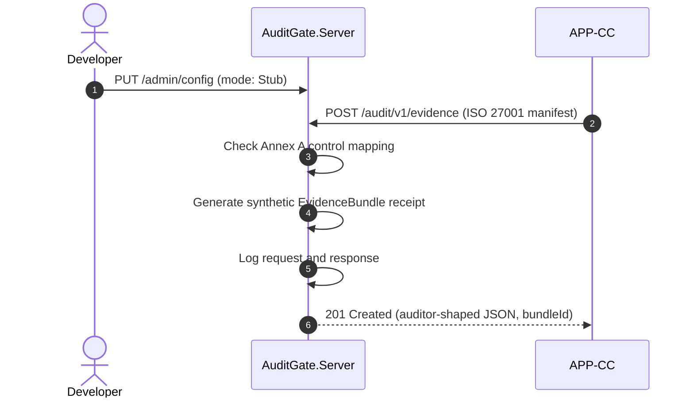

### Record Mode: Engagement Creation

AuditGate proxies an engagement creation call to a live auditor platform and records both the request and response for later replay.

```spec
dynamic RecordCreateEngagement {
    1: Developer -> AuditGate.Server {
        description: "Configures AuditGate to Record mode with live
                      auditor credentials and base URL.";
        technology: "REST/HTTPS";
    };
    2: "APP-CC Compliance Core" -> AuditGate.Server {
        description: "POST /audit/v1/engagements with scope,
                      auditorOrg, and framework Soc2_TypeII.";
        technology: "REST/HTTPS";
    };
    3: AuditGate.Server -> ThirdPartyAuditPlatform {
        description: "Forwards the request to the live auditor
                      platform with real credentials.";
        technology: "REST/HTTPS";
    };
    4: ThirdPartyAuditPlatform -> AuditGate.Server
        : "Returns the canonical engagement response.";
    5: AuditGate.Server -> AuditGate.Server
        : "Records request and response pair keyed by request
           signature and framework.";
    6: AuditGate.Server -> "APP-CC Compliance Core" {
        description: "Returns the real auditor response unmodified.";
        technology: "REST/HTTPS";
    };
}
```

Rendered interaction sequence:

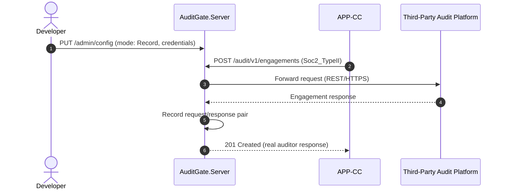

### Replay Mode: Finding Response

AuditGate returns a previously recorded auditor response to a customer finding response, matched by request signature. No network call to the auditor platform occurs.

```spec
dynamic ReplayRespondToFinding {
    1: Developer -> AuditGate.Server {
        description: "Configures AuditGate to Replay mode.";
        technology: "REST/HTTPS";
    };
    2: "APP-CC Compliance Core" -> AuditGate.Server {
        description: "POST /audit/v1/findings/{id}/response with
                      a previously recorded response body.";
        technology: "REST/HTTPS";
    };
    3: AuditGate.Server -> AuditGate.Server
        : "Matches request signature against recorded entries.";
    4: AuditGate.Server -> AuditGate.Server
        : "Logs replay request and the matched response.";
    5: AuditGate.Server -> "APP-CC Compliance Core" {
        description: "Returns the matched recorded auditor reply.";
        technology: "REST/HTTPS";
    };
}
```

Rendered interaction sequence:

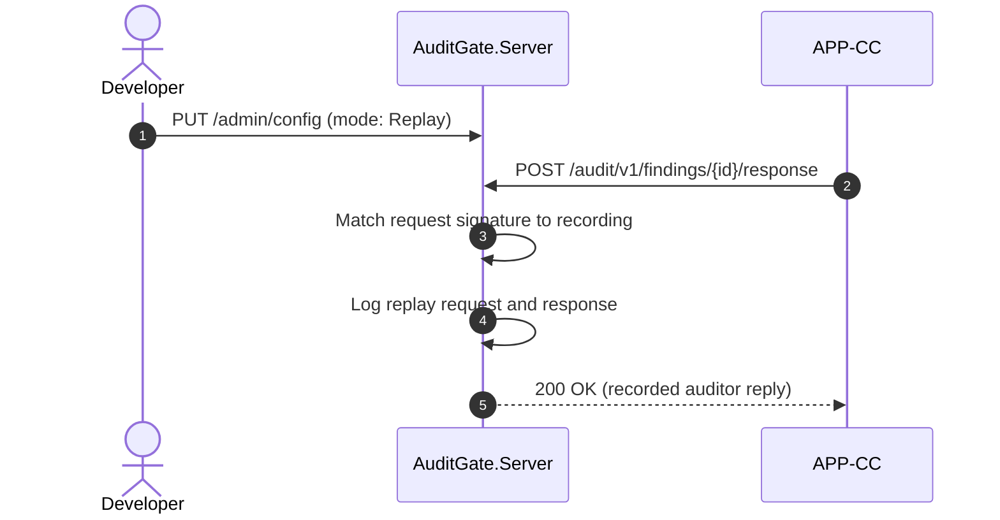

### FaultInject Mode: Framework-Specific Evidence Rejection

AuditGate returns a configurable error response scoped to the ISO 28000 framework, to test APP-CC failure handling when supply-chain security evidence is malformed.

```spec
dynamic FaultInjectIso28000EvidenceRejection {
    1: Developer -> AuditGate.Server {
        description: "Configures AuditGate to FaultInject mode
                      with a FaultConfig specifying 422,
                      invalid_supply_chain_evidence, 1500ms delay,
                      and framework filter Iso28000.";
        technology: "REST/HTTPS";
    };
    2: "APP-CC Compliance Core" -> AuditGate.Server {
        description: "POST /audit/v1/evidence for an ISO 28000
                      engagement with a manifest missing supply-
                      chain security control references.";
        technology: "REST/HTTPS";
    };
    3: AuditGate.Server -> AuditGate.Server
        : "Resolves the engagement framework to Iso28000 and
           matches the FaultConfig filter.";
    4: AuditGate.Server -> AuditGate.Server
        : "Waits for the configured delay (1500ms).";
    5: AuditGate.Server -> AuditGate.Server
        : "Logs the request and the fault response.";
    6: AuditGate.Server -> "APP-CC Compliance Core" {
        description: "Returns 422 with auditor-shaped error body
                      containing invalid_supply_chain_evidence
                      error type.";
        technology: "REST/HTTPS";
    };
}
```

Rendered interaction sequence:

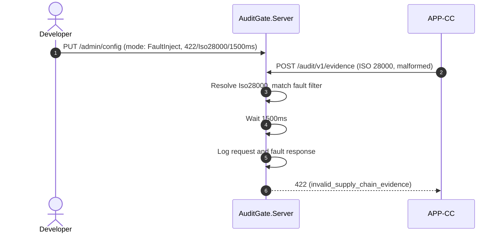

### Stub Mode: Certificate Issuance

A compliance officer walks through ESG assurance certificate issuance against the stub gate.

```spec
dynamic StubIssueCertificate {
    1: ComplianceOfficer -> AuditGate.Server {
        description: "POST /audit/v1/certificates with
                      engagementId and framework EsgAssurance.";
        technology: "REST/HTTPS";
    };
    2: AuditGate.Server -> AuditGate.Server
        : "Generates synthetic AuditCertificate with a
           deterministic certificateId and signedArtifactUri
           shaped for ESG assurance.";
    3: AuditGate.Server -> AuditGate.Server
        : "Logs request and response.";
    4: AuditGate.Server -> ComplianceOfficer {
        description: "Returns auditor-shaped JSON with the
                      synthetic certificate.";
        technology: "REST/HTTPS";
    };
}
```

Rendered interaction sequence:

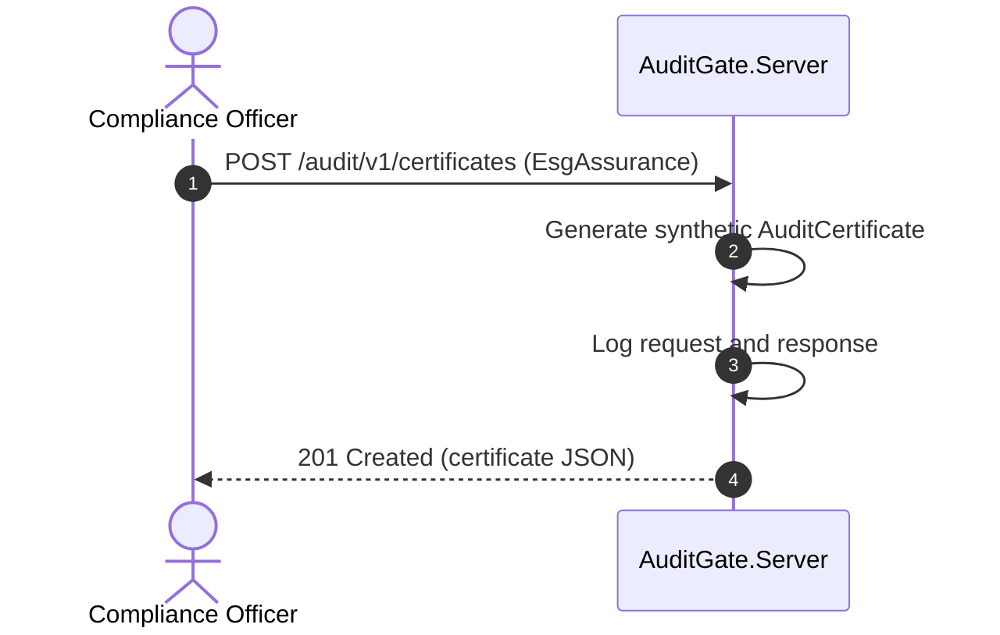

### Stub Mode: Report Retrieval

APP-CC retrieves a synthetic audit report for an engagement it has walked through end to end.

```spec
dynamic StubGetReport {
    1: "APP-CC Compliance Core" -> AuditGate.Server {
        description: "GET /audit/v1/reports/{engagementId} for a
                      concluded ISO 27001 engagement.";
        technology: "REST/HTTPS";
    };
    2: AuditGate.Server -> AuditGate.Server
        : "Assembles synthetic AuditReport whose shape matches
           the engagement framework.";
    3: AuditGate.Server -> AuditGate.Server
        : "Logs request and response.";
    4: AuditGate.Server -> "APP-CC Compliance Core" {
        description: "Returns auditor-shaped JSON with the
                      synthetic report.";
        technology: "REST/HTTPS";
    };
}
```

Rendered interaction sequence:

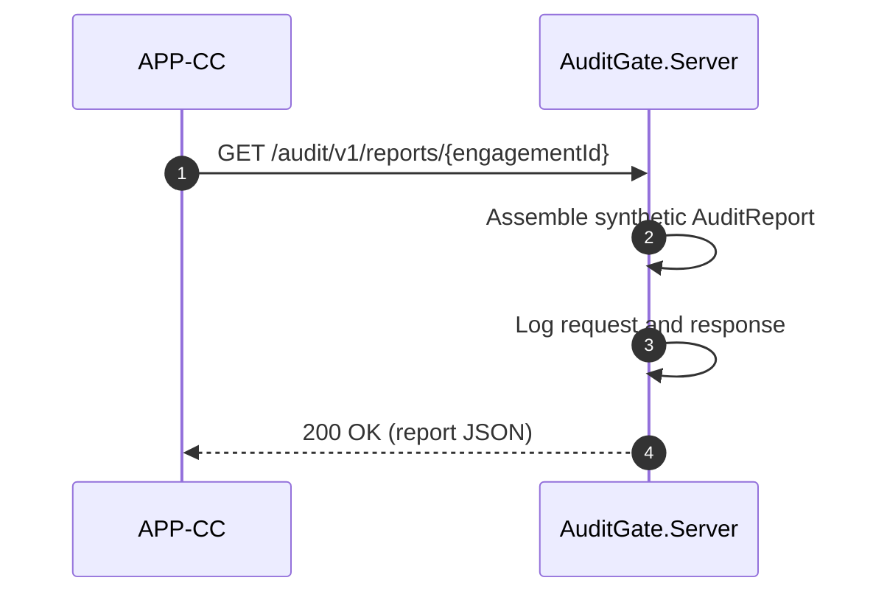

### Request Log Inspection

A developer or test assertion retrieves the captured request log to verify that APP-CC made the expected calls across an engagement lifecycle.

```spec
dynamic InspectRequestLog {
    1: Developer -> AuditGate.Server {
        description: "GET /admin/requests to retrieve the request
                      log, optionally filtered by framework,
                      engagementId, or path.";
        technology: "REST/HTTPS";
    };
    2: AuditGate.Server -> AuditGate.Server
        : "Collects all AuditGateRequest and AuditGateResponse
           pairs matching the filter.";
    3: AuditGate.Server -> Developer {
        description: "Returns JSON array of request and response
                      log entries.";
        technology: "REST/HTTPS";
    };
}
```

Rendered interaction sequence:

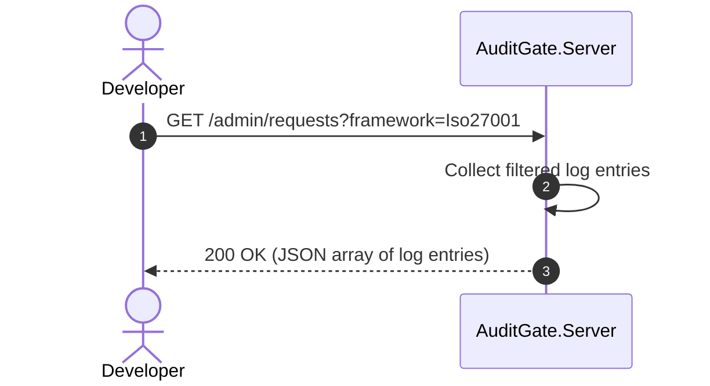

## Open Items

- Confirm the exact report shape for SOC 2 Type II engagements once a reference auditor platform is selected for Record mode capture; Stub mode currently produces a generic synthetic shape that will need alignment.
- Decide whether certificate signatures returned in Stub mode should embed a visible `synthetic=true` marker to prevent accidental promotion to production flows, or whether this responsibility belongs entirely to APP-CC.
- Determine whether finding lifecycle transitions (Open to Responded to Resolved) should be modeled as a state machine invariant in the gate or left entirely to the caller.
- Align the ESG assurance report structure with the assurance framework ultimately adopted by APP-CC (ISSB, GRI, or a combination); Stub mode picks a neutral shape for now.
- Confirm the delivery model for long-running engagements: the gate currently treats every call as synchronous, while some real auditor platforms use an async ticket/callback pattern that may need a future extension.
