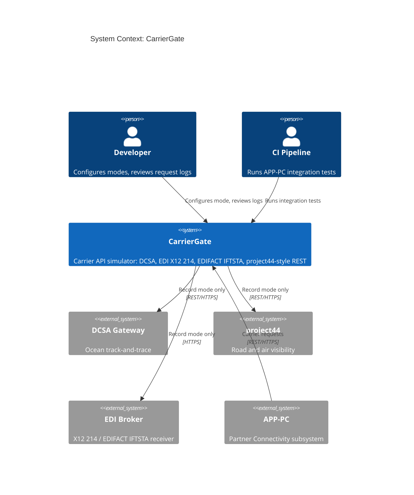
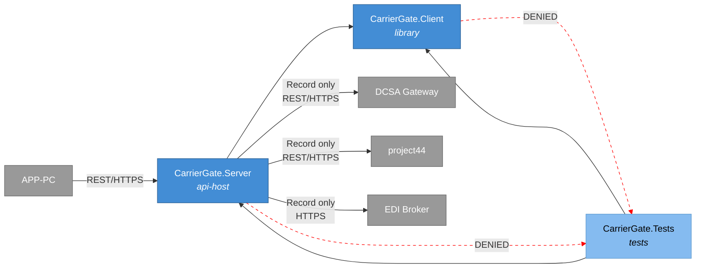
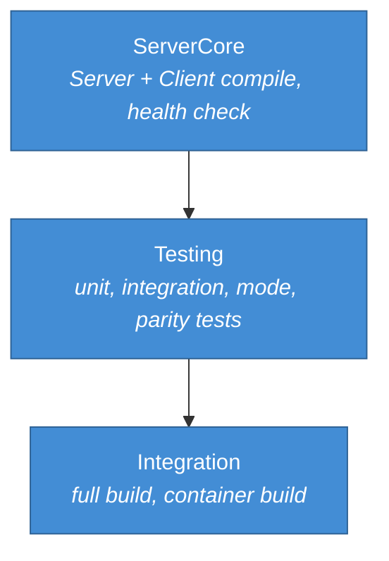
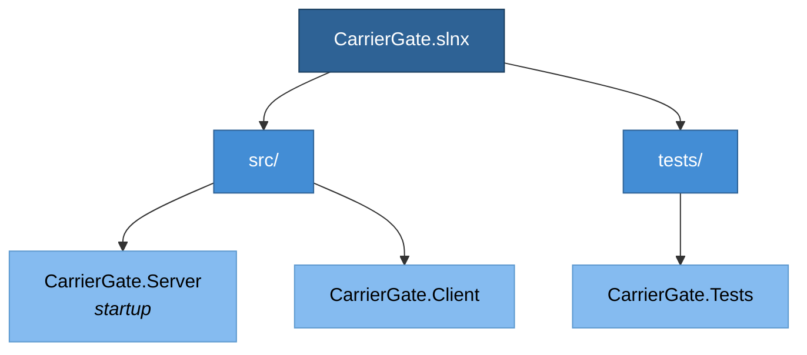
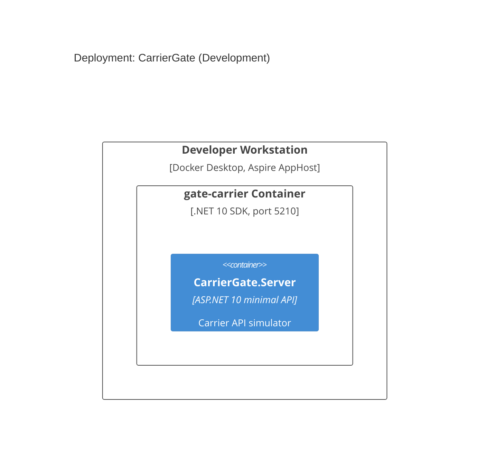
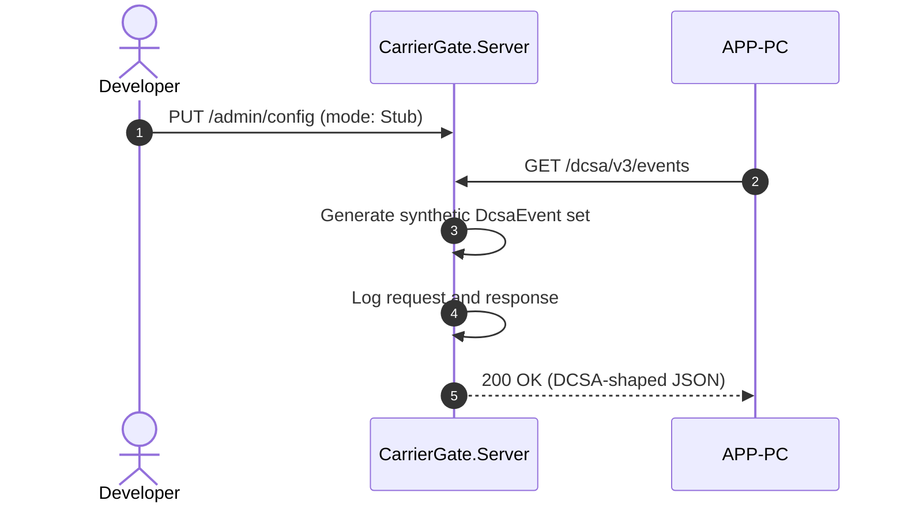
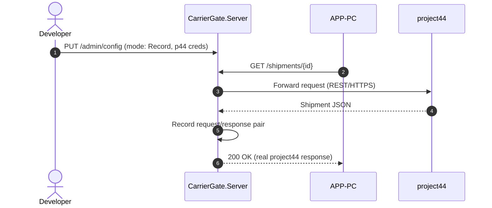
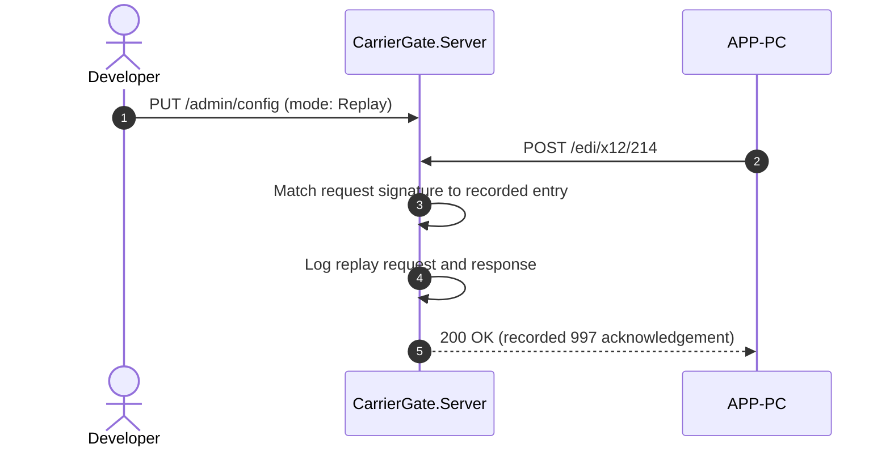
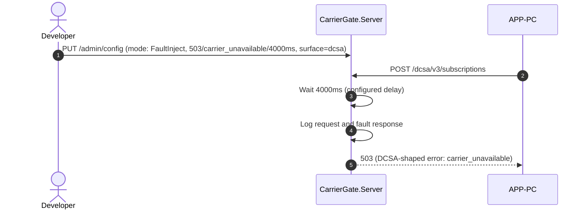
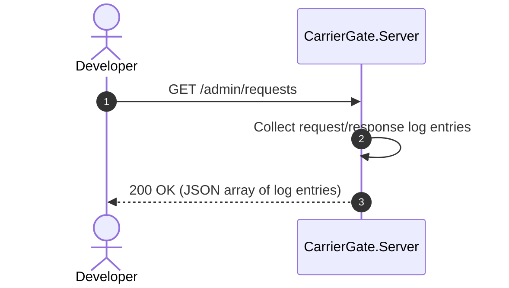

# CarrierGate -- System Specification

## Tracking

| Field | Value |
|---|---|
| slug | carrier-gate |
| itemType | SystemSpec |
| name | CarrierGate |
| shortDescription | Local simulator that mimics ocean, road, and air carrier APIs (DCSA, EDI X12 214, EDIFACT IFTSTA, project44-style REST) for APP-PC development and test. |
| version | 1 |
| specLangVersion | 0.1.0 |
| publishStatus | Draft |
| retentionPolicy | indefinite |
| freshnessSla | P90D |
| lastReviewed | 2026-04-18 |
| authors | [PER-01 Lena Brandt] |
| reviewers | [PER-03 Maria Oliveira] |
| committer | PER-01 Lena Brandt |
| tags | [gate-simulator, carrier, dcsa, edi, project44, local-dev] |
| createdAt | 2026-04-18T00:00:00Z |
| updatedAt | 2026-04-18T00:00:00Z |
| Dependencies | [global-corp.architecture.spec.md](./global-corp.architecture.spec.md) |
| State | Draft |
| Reviewed | |
| Approved | |
| Executed | |
| Verified | |

CarrierGate is a local simulator for ocean, road, and air carrier APIs. It
follows the same pattern as PayGate: an ASP.NET 10 minimal API server plus a
typed .NET client library, four behavior modes (Stub, Record, Replay,
FaultInject), and an in-memory request log. CarrierGate mimics the REST and
EDI traffic that real carriers expose to a freight forwarder.

APP-PC (Partner Connectivity) calls CarrierGate in place of the real carrier
gateways when running in the Local Simulation Profile. The same APP-PC code
that talks to Maersk, DHL, or project44 in production hits CarrierGate on a
local port instead, so the integration code path is exercised without touching
real carrier systems.

CarrierGate ships as a Docker container image, `globalcorp/carrier-gate:latest`,
and the Global Corp Aspire AppHost runs it alongside the other Local
Simulation Profile services. This spec mirrors the PayGate reference and adds
carrier-specific contract and data surface.

## Context

```spec
person Developer {
    description: "A Global Corp developer building or debugging APP-PC locally
                  against a carrier simulator instead of real carrier gateways.";
    @tag("internal", "dev", "test");
}

person CIPipeline {
    description: "Automated CI pipeline that runs APP-PC integration tests
                  against CarrierGate without calling real carriers.";
    @tag("automation", "test");
}

external system Dcsa {
    description: "DCSA Track-and-Trace v3 REST service published by ocean
                  carriers. CarrierGate mimics this surface in all modes and
                  proxies to a live DCSA endpoint in Record mode.";
    technology: "REST/HTTPS";
    @tag("carrier", "ocean", "external");
}

external system ProjectFourtyFour {
    description: "project44 REST visibility platform for road and air
                  shipments. CarrierGate mimics the shipment and milestone
                  endpoints used by APP-PC.";
    technology: "REST/HTTPS";
    @tag("carrier", "road", "air", "external");
}

external system EdiBroker {
    description: "Generic HTTPS endpoint that accepts EDI X12 214 and EDIFACT
                  IFTSTA payloads from carriers. CarrierGate mimics this EDI
                  receiver to exercise APP-PC's EDI parsing path.";
    technology: "HTTPS, EDI X12, EDIFACT";
    @tag("carrier", "edi", "external");
}

external system APP-PC {
    description: "Global Corp Partner Connectivity subsystem. In the Local
                  Simulation Profile, APP-PC points its carrier client base
                  URLs at CarrierGate.";
    technology: "REST/HTTPS";
    @tag("consumer", "internal");
}

Developer -> CarrierGate : "Configures behavior mode and inspects request logs.";

CIPipeline -> CarrierGate : "Runs APP-PC integration tests against the simulator.";

APP-PC -> CarrierGate {
    description: "Sends DCSA, EDI, and project44-style requests to CarrierGate
                  instead of real carrier gateways.";
    technology: "REST/HTTPS";
}

CarrierGate -> Dcsa {
    description: "Proxies requests to a live DCSA endpoint in Record mode only.";
    technology: "REST/HTTPS";
}

CarrierGate -> ProjectFourtyFour {
    description: "Proxies requests to project44 in Record mode only.";
    technology: "REST/HTTPS";
}

CarrierGate -> EdiBroker {
    description: "Proxies EDI payloads to a live broker in Record mode only.";
    technology: "HTTPS";
}
```

Rendered system context:



## System Declaration

```spec
system CarrierGate {
    target: "net10.0";
    responsibility: "HTTP-level test harness that mimics ocean, road, and air
                     carrier API surfaces (DCSA v3, EDI X12 214, EDIFACT
                     IFTSTA, project44-style REST). Supports four behavior
                     modes: Stub, Record, Replay, FaultInject. Lets APP-PC
                     validate carrier integrations without calling real
                     carriers.";

    authored component CarrierGate.Server {
        kind: "api-host";
        path: "src/CarrierGate.Server";
        status: new;
        responsibility: "ASP.NET 10 minimal API that exposes DCSA v3 REST
                         endpoints, project44-style visibility endpoints, and
                         EDI X12 214 / EDIFACT IFTSTA receiver endpoints.
                         Routes each request through the active behavior mode
                         and returns the appropriate response shape.";
        contract {
            guarantees "Exposes GET /dcsa/v3/events,
                        POST /dcsa/v3/subscriptions,
                        GET /shipments/{id},
                        GET /shipments/{id}/milestones,
                        POST /edi/x12/214, and
                        POST /edi/edifact/iftsta with request and response
                        shapes matching the published carrier surfaces.";
            guarantees "Behavior mode is switchable at runtime via the
                        management endpoint without restarting the server.";
            guarantees "All requests and responses are captured in an
                        in-memory log accessible via GET /admin/requests.";
            guarantees "Default listen port is 5210 and is overridable by the
                        ASPNETCORE_URLS environment variable.";
        }
    }

    authored component CarrierGate.Client {
        kind: library;
        path: "src/CarrierGate.Client";
        status: new;
        responsibility: "Typed .NET client that wraps the CarrierGate HTTP
                         surface. APP-PC registers CarrierGate.Client in the
                         Local Simulation Profile in place of its real
                         carrier clients.";
        contract {
            guarantees "Exposes DcsaClient, ProjectFourtyFourClient, and
                        EdiClient types whose public methods match the
                        carrier surface APP-PC consumes in production.";
            guarantees "Exposes a CarrierGateAdminClient type for mode
                        configuration and request log inspection.";
            guarantees "Targets CarrierGate.Server by default on
                        http://localhost:5210 and is configurable.";
        }

        rationale {
            context "APP-PC talks to several distinct carrier surfaces. A
                     single typed client keeps local test wiring minimal and
                     keeps mode and log inspection out of production
                     carrier-client code.";
            decision "Ship one client assembly with three surface-specific
                      clients plus an admin client.";
            consequence "APP-PC test projects add one package reference and
                         one DI registration per surface.";
        }
    }

    authored component CarrierGate.Tests {
        kind: tests;
        path: "tests/CarrierGate.Tests";
        status: new;
        responsibility: "Unit and integration tests for CarrierGate.Server and
                         CarrierGate.Client. Verifies each behavior mode,
                         request logging, fault injection, and surface parity
                         with DCSA v3, project44, and the EDI payloads.";
    }

    consumed component AspireHosting {
        source: nuget("Aspire.Hosting");
        version: "10.*";
        responsibility: "Aspire integration types used by the AppHost to
                         declare the CarrierGate container resource.";
        used_by: [CarrierGate.Server];
    }

    consumed component AspNetCore {
        source: nuget("Microsoft.AspNetCore.App");
        version: "10.*";
        responsibility: "ASP.NET 10 minimal API framework.";
        used_by: [CarrierGate.Server];
    }

    consumed component HttpJson {
        source: nuget("System.Net.Http.Json");
        version: "10.*";
        responsibility: "Typed HTTP JSON helpers for CarrierGate.Client.";
        used_by: [CarrierGate.Client];
    }

    consumed component xunit {
        source: nuget("xunit");
        version: "2.*";
        responsibility: "Unit and integration testing framework.";
        used_by: [CarrierGate.Tests];
    }

    consumed component TestHost {
        source: nuget("Microsoft.AspNetCore.Mvc.Testing");
        version: "10.*";
        responsibility: "In-process test server for CarrierGate.Server
                         integration tests.";
        used_by: [CarrierGate.Tests];
    }
}
```

## Data Specification

### Enums

```spec
enum BehaviorMode {
    Stub: "Returns preconfigured static responses for all endpoints",
    Record: "Proxies requests to a real carrier surface and records request and response",
    Replay: "Returns previously recorded responses matched by request signature",
    FaultInject: "Returns configurable error responses to test failure handling"
}

enum MilestoneType {
    GateOut: "Container or unit left the origin gate",
    GateIn: "Container or unit arrived at the destination gate",
    VesselLoaded: "Container loaded onto ocean vessel",
    VesselDeparted: "Vessel departed port of loading",
    VesselArrived: "Vessel arrived at port of discharge",
    Discharged: "Container discharged from vessel",
    OutForDelivery: "Shipment handed to last-mile carrier",
    Delivered: "Shipment delivered to consignee"
}

enum CarrierMode {
    Ocean: "Ocean freight via DCSA or EDI",
    Road: "Road freight via project44 or EDI",
    Air: "Air freight via project44 or EDI"
}
```

### Entities

The data model captures carrier-compatible payloads plus the internal
recording and configuration state. Field names follow the conventions of the
real surfaces they mimic (camelCase for DCSA and project44, EDI segment
strings for X12 and EDIFACT).

```spec
entity DcsaEvent {
    eventId: string;
    eventType: string @default("SHIPMENT");
    eventDateTime: string;
    eventClassifierCode: string @default("ACT");
    transportCallReference: string?;
    equipmentReference: string?;
    documentReferences: string?;

    invariant "eventId required": eventId != "";
    invariant "eventDateTime required": eventDateTime != "";

    rationale "eventId" {
        context "DCSA v3 requires a stable UUID for every event so clients
                 can deduplicate on retry.";
        decision "eventId is a string, generated by CarrierGate in Stub mode
                  and preserved verbatim in Record and Replay modes.";
        consequence "APP-PC dedupe logic can be exercised against synthetic
                     and recorded data with identical semantics.";
    }
}

entity ProjectFourtyFourShipment {
    shipmentId: string;
    mode: CarrierMode;
    originCode: string;
    destinationCode: string;
    carrierScac: string?;
    status: string @default("IN_TRANSIT");
    milestones: string?;

    invariant "shipmentId required": shipmentId != "";
    invariant "origin required": originCode != "";
    invariant "destination required": destinationCode != "";
}

entity EdiX12_214_Message {
    interchangeControlNumber: string;
    groupControlNumber: string;
    transactionSetControlNumber: string;
    shipmentIdentificationNumber: string;
    statusCode: string;
    statusDateTime: string;
    rawSegments: string;

    invariant "interchange id required": interchangeControlNumber != "";
    invariant "transaction id required": transactionSetControlNumber != "";
    invariant "raw segments non-empty": rawSegments != "";

    rationale "rawSegments" {
        context "APP-PC's EDI parser reads the raw segment string. The
                 simulator must preserve delimiters and segment order.";
        decision "Store the raw segment body alongside the parsed control
                  numbers so Record mode retains the on-the-wire bytes.";
        consequence "Replay mode hands back the exact bytes recorded, which
                     keeps the parser test path honest.";
    }
}

entity CarrierMilestone {
    milestoneId: string;
    shipmentId: string;
    type: MilestoneType;
    occurredAt: string;
    location: string?;
    notes: string?;

    invariant "milestoneId required": milestoneId != "";
    invariant "shipmentId required": shipmentId != "";
    invariant "occurredAt required": occurredAt != "";
}

entity CarrierGateRequest {
    id: string;
    timestamp: string;
    method: string;
    path: string;
    carrierSurface: string;
    body: string?;
    headers: string?;

    invariant "id required": id != "";
    invariant "path required": path != "";
    invariant "surface required": carrierSurface != "";
}

entity CarrierGateResponse {
    id: string;
    requestId: string;
    statusCode: int @range(100..599);
    body: string?;
    latencyMs: int;

    invariant "id required": id != "";
    invariant "request reference": requestId != "";
    invariant "valid status code": statusCode >= 100;
}

entity FaultConfig {
    statusCode: int @range(400..599) @default(500);
    errorType: string @default("carrier_error");
    errorMessage: string @default("Simulated CarrierGate fault");
    delayMs: int @range(0..30000) @default(0);
    appliesToSurface: string?;

    invariant "error status code": statusCode >= 400;
    invariant "non-negative delay": delayMs >= 0;

    rationale "appliesToSurface" {
        context "CarrierGate mimics several surfaces. A failure test may
                 target only the DCSA endpoints while leaving project44
                 healthy.";
        decision "FaultConfig carries an optional surface selector. If null,
                  the fault applies to every surface.";
        consequence "APP-PC can test partial-outage behavior without having
                     to spin up multiple CarrierGate instances.";
    }
}
```

## Contracts

### DCSA v3 Endpoints

```spec
contract GetDcsaEvents {
    requires query.limit > 0;
    ensures count(events) >= 0;
    guarantees "Returns a list of DcsaEvent records matching the query
                filters. In Stub mode, returns a deterministic synthetic
                set. In Record mode, proxies to the configured DCSA base
                URL and records both request and response. In Replay mode,
                returns the recorded response matching the request
                signature. In FaultInject mode, returns the configured
                fault.";
}

contract CreateDcsaSubscription {
    requires callbackUrl != "";
    ensures subscription.id != "";
    guarantees "Registers a subscription and, in Stub and Replay modes,
                emits synthetic callback deliveries on a short timer. In
                Record mode, forwards the subscription request to the real
                DCSA endpoint. In FaultInject mode, returns the configured
                fault.";
}
```

### project44-Style Endpoints

```spec
contract GetShipment {
    requires shipmentId != "";
    ensures shipment.shipmentId == shipmentId;
    guarantees "Returns a ProjectFourtyFourShipment matching the given id.
                Mode behavior follows the same pattern as the DCSA
                endpoints.";
}

contract GetShipmentMilestones {
    requires shipmentId != "";
    ensures count(milestones) >= 0;
    guarantees "Returns the milestone timeline for the given shipment.
                Milestones use the MilestoneType enum. Mode behavior
                follows the shared pattern.";
}
```

### EDI Endpoints

```spec
contract PostX12_214 {
    requires body != "";
    requires contentType == "application/EDI-X12";
    ensures response.statusCode in [200, 202];
    guarantees "Accepts an EDI X12 214 payload over HTTPS. In Stub and
                Replay modes, parses control numbers and returns a 997
                functional acknowledgement. In Record mode, forwards the
                raw body to the configured EDI broker. In FaultInject
                mode, returns the configured fault, including optional
                999 rejection envelopes.";
}

contract PostIftsta {
    requires body != "";
    requires contentType == "application/EDIFACT";
    ensures response.statusCode in [200, 202];
    guarantees "Accepts an EDIFACT IFTSTA payload. In Stub and Replay
                modes, returns a CONTRL acknowledgement. Record and
                FaultInject behavior mirrors PostX12_214.";
}
```

### Management Endpoints

```spec
contract ConfigureMode {
    requires mode in [Stub, Record, Replay, FaultInject];
    ensures activeMode == mode;
    guarantees "Switches the server behavior mode at runtime. When
                switching to FaultInject, an optional FaultConfig payload
                configures the error response. When switching to Record,
                per-surface base URLs and credentials must be provided.";
}

contract GetRequestLog {
    ensures count(entries) >= 0;
    guarantees "Returns all captured CarrierGateRequest and
                CarrierGateResponse pairs in chronological order. Supports
                optional filtering by surface, path, and time range. Log
                entries persist for the lifetime of the server process.";
}
```

## Topology

```spec
topology Dependencies {
    allow CarrierGate.Server -> CarrierGate.Client;
    allow CarrierGate.Tests -> CarrierGate.Server;
    allow CarrierGate.Tests -> CarrierGate.Client;

    deny CarrierGate.Client -> CarrierGate.Tests;
    deny CarrierGate.Server -> CarrierGate.Tests;

    invariant "no consumer coupling":
        CarrierGate.Server does not reference APP-PC;
    invariant "client has no consumer coupling":
        CarrierGate.Client does not reference APP-PC;

    rationale {
        context "CarrierGate is a reusable carrier simulator. It must not
                 depend on APP-PC or any other Global Corp subsystem so it
                 can be versioned and shipped independently.";
        decision "CarrierGate.Server exposes carrier-shaped REST endpoints.
                  APP-PC points its carrier clients at CarrierGate in the
                  Local Simulation Profile. No compile-time dependency
                  exists in either direction.";
        consequence "CarrierGate can be extracted to a separate repository
                     or reused by non-Global-Corp projects that integrate
                     with DCSA, project44, or EDI carriers.";
    }
}
```

Rendered topology:



## Phases

```spec
phase ServerCore {
    produces: [CarrierGate.Server, CarrierGate.Client];

    gate ServerCompile {
        command: "dotnet build src/CarrierGate.Server";
        expects: "zero errors";
    }

    gate ClientCompile {
        command: "dotnet build src/CarrierGate.Client";
        expects: "zero errors";
    }

    gate HealthCheck {
        command: "curl -f http://localhost:5210/health";
        expects: "exit_code == 0";
    }
}

phase Testing {
    requires: ServerCore;
    produces: [CarrierGate.Tests];

    gate UnitTests {
        command: "dotnet test tests/CarrierGate.Tests --filter Category=Unit";
        expects: "all tests pass", pass >= 12;
    }

    gate IntegrationTests {
        command: "dotnet test tests/CarrierGate.Tests --filter Category=Integration";
        expects: "all tests pass", pass >= 10;
    }

    gate ModeTests {
        command: "dotnet test tests/CarrierGate.Tests --filter Category=Mode";
        expects: "all tests pass", pass >= 4;
        rationale "One test per behavior mode confirms mode switching and
                   mode-specific response logic across every surface.";
    }

    gate SurfaceParityTests {
        command: "dotnet test tests/CarrierGate.Tests --filter Category=Parity";
        expects: "all tests pass", pass >= 6;
        rationale "Confirms that DCSA, project44, and EDI payloads match
                   the published real-surface shapes.";
    }
}

phase Integration {
    requires: Testing;

    gate FullBuild {
        command: "dotnet build CarrierGate.slnx";
        expects: "zero errors";
    }

    gate AllTests {
        command: "dotnet test CarrierGate.slnx";
        expects: "all tests pass", fail == 0;
    }

    gate ContainerBuild {
        command: "docker build -t globalcorp/carrier-gate:latest .";
        expects: "exit_code == 0";
    }

    rationale "Final gates confirm that the full solution builds, all tests
               pass, and the container image builds cleanly before the spec
               can advance to Verified.";
}
```

Rendered phase ordering:



## Traces

```spec
trace CarrierFlow {
    GetDcsaEvents -> [CarrierGate.Server, CarrierGate.Client];
    CreateDcsaSubscription -> [CarrierGate.Server, CarrierGate.Client];
    GetShipment -> [CarrierGate.Server, CarrierGate.Client];
    GetShipmentMilestones -> [CarrierGate.Server, CarrierGate.Client];
    PostX12_214 -> [CarrierGate.Server, CarrierGate.Client];
    PostIftsta -> [CarrierGate.Server, CarrierGate.Client];
    ConfigureMode -> [CarrierGate.Server, CarrierGate.Client];
    GetRequestLog -> [CarrierGate.Server, CarrierGate.Client];

    invariant "full coverage":
        all sources have count(targets) >= 1;
    invariant "server always involved":
        all sources have targets contains CarrierGate.Server;
}

trace DataModel {
    DcsaEvent -> [CarrierGate.Server, CarrierGate.Client];
    ProjectFourtyFourShipment -> [CarrierGate.Server, CarrierGate.Client];
    EdiX12_214_Message -> [CarrierGate.Server, CarrierGate.Client];
    CarrierMilestone -> [CarrierGate.Server, CarrierGate.Client];
    CarrierGateRequest -> [CarrierGate.Server];
    CarrierGateResponse -> [CarrierGate.Server];
    FaultConfig -> [CarrierGate.Server, CarrierGate.Client];
    BehaviorMode -> [CarrierGate.Server, CarrierGate.Client];
    MilestoneType -> [CarrierGate.Server, CarrierGate.Client];
    CarrierMode -> [CarrierGate.Server, CarrierGate.Client];
}
```

## System-Level Constraints

```spec
constraint NoGlobalCorpSubsystemDependency {
    scope: [CarrierGate.Server, CarrierGate.Client];
    rule: "No references to any Global Corp subsystem namespace or assembly.
           The only contract with APP-PC is the HTTP surface.";

    rationale {
        context "CarrierGate must remain a general-purpose carrier simulator,
                 reusable by projects outside Global Corp and across future
                 subsystems.";
        decision "No compile-time coupling to APP-PC or other Global Corp
                  components. The contract is the carrier REST and EDI
                  surface.";
        consequence "CarrierGate can ship as an OCI image without any
                     Global Corp code dependencies.";
    }
}

constraint NullableEnabled {
    scope: all authored components;
    rule: "Nullable reference types are enabled in every project file. No
           null-forgiving operators (!) outside of test setup helpers.";
}

constraint InMemoryOnly {
    scope: [CarrierGate.Server];
    rule: "All state (request logs, recorded responses, subscriptions,
           fault config) is held in memory. No database and no file-system
           persistence. State resets when the server process restarts.";

    rationale {
        context "CarrierGate is a test-time tool that runs per developer and
                 per CI job. Persistent state would add operational weight
                 without benefit.";
        decision "Use in-memory collections with no external storage.";
        consequence "Long recording sessions should export logs before the
                     container stops. Each container start begins empty.";
    }
}

constraint ShapeParity {
    scope: [CarrierGate.Server];
    rule: "DCSA JSON shapes match DCSA v3. project44-style JSON shapes
           match the documented project44 shipment and milestone schemas.
           X12 214 and EDIFACT IFTSTA payloads match their respective
           implementation guides.";

    rationale "Shape parity lets APP-PC run identical code against
               CarrierGate and real carriers, without adapter layers or
               conditional logic.";
}

constraint TestNaming {
    scope: [CarrierGate.Tests];
    rule: "Test methods follow MethodName_Scenario_ExpectedResult naming.
           Test classes mirror the source class name with a Tests suffix.";
}
```

## Package Policy

```spec
package_policy CarrierGatePolicy {
    inherit: weakRef<PackagePolicy>(GlobalCorpPolicy)
        from "./global-corp.architecture.spec.md#section-8";

    allow category("carrier-parsing")
        includes ["indice.Edifact", "OopFactory.X12"]
        rationale "CarrierGate generates and parses EDI payloads. The two
                   allowed libraries are small, permissively licensed, and
                   strictly format-level, not carrier-specific.";

    deny category("carrier-sdks")
        includes ["Maersk.*", "Dhl.*", "Project44.*"]
        rationale "CarrierGate mimics carriers at the wire level and must
                   control the raw HTTP and EDI shapes. Using a real carrier
                   SDK would hide the surface under test.";

    default: inherit;

    rationale {
        context "CarrierGate inherits the Global Corp package policy to keep
                 supply-chain controls uniform across the platform.";
        decision "Inherit the full GlobalCorpPolicy. Add only the EDI
                  parsing allow list and the carrier-SDK deny list unique
                  to this spec.";
        consequence "Any package outside the inherited allow set and outside
                     the two additions above requires a rationale in a
                     subsequent revision of this spec.";
    }
}
```

## Platform Realization

```spec
dotnet solution CarrierGate {
    format: slnx;
    startup: CarrierGate.Server;

    folder "src" {
        projects: [CarrierGate.Server, CarrierGate.Client];
    }

    folder "tests" {
        projects: [CarrierGate.Tests];
    }

    rationale {
        context "CarrierGate is a focused solution with two source projects
                 and one test project.";
        decision "CarrierGate.Server is the startup project and serves both
                  the carrier-compatible surface and the management API on
                  one configurable port.";
        consequence "Running dotnet run from the Server project starts the
                     simulator. The default port is 5210.";
    }
}
```

Rendered solution structure:



## Deployment

```spec
deployment Development {
    node "Developer Workstation" {
        technology: "Docker Desktop, Aspire AppHost";

        node "gate-carrier Container" {
            technology: ".NET 10 SDK, globalcorp/carrier-gate:latest";
            instance: CarrierGate.Server;
            port: 5210;
            container_name: "gate-carrier";
        }
    }

    rationale "CarrierGate runs as the gate-carrier container, orchestrated
               by the Global Corp Aspire AppHost. The AppHost passes the
               carrier base URL into APP-PC via environment variables so the
               same APP-PC code reaches CarrierGate in the Local Simulation
               Profile and the real carriers in other profiles.";
}
```

Rendered deployment:



## Views

```spec
view systemContext of CarrierGate ContextView {
    include: all;
    autoLayout: top-down;
    description: "CarrierGate with its users (Developer, CI Pipeline) and
                  external systems (DCSA, project44, EDI broker, APP-PC).";
}

view container of CarrierGate ContainerView {
    include: all;
    autoLayout: left-right;
    description: "Internal structure showing CarrierGate.Server,
                  CarrierGate.Client, and CarrierGate.Tests with their
                  dependencies.";
}

view deployment of Development DevelopmentDeploymentView {
    include: all;
    autoLayout: top-down;
    description: "Developer workstation running CarrierGate as the
                  gate-carrier container under the Aspire AppHost.";
    @tag("dev", "local-simulation");
}
```

## Dynamic Scenarios

### Stub Mode: DCSA Events

APP-PC queries the DCSA events endpoint in Stub mode during a local
development session. CarrierGate returns a deterministic synthetic list
without contacting any real DCSA gateway.

```spec
dynamic StubMode {
    1: Developer -> CarrierGate.Server {
        description: "Configures CarrierGate to Stub mode via management API.";
        technology: "REST/HTTPS";
    };
    2: APP-PC -> CarrierGate.Server {
        description: "GET /dcsa/v3/events with shipment and window filters.";
        technology: "REST/HTTPS";
    };
    3: CarrierGate.Server -> CarrierGate.Server
        : "Generates a deterministic set of synthetic DcsaEvent records.";
    4: CarrierGate.Server -> CarrierGate.Server
        : "Logs request and response to the in-memory request log.";
    5: CarrierGate.Server -> APP-PC {
        description: "Returns DCSA-shaped JSON with the synthetic events.";
        technology: "REST/HTTPS";
    };
}
```

Rendered interaction sequence:



### Record Mode: project44 Shipment Lookup

CarrierGate proxies the request to a real project44 endpoint and records
both request and response for later replay.

```spec
dynamic RecordMode {
    1: Developer -> CarrierGate.Server {
        description: "Configures CarrierGate to Record mode with project44
                      base URL and credentials.";
        technology: "REST/HTTPS";
    };
    2: APP-PC -> CarrierGate.Server {
        description: "GET /shipments/{id} with a road shipment id.";
        technology: "REST/HTTPS";
    };
    3: CarrierGate.Server -> ProjectFourtyFour {
        description: "Forwards the request to project44 using the configured
                      credentials.";
        technology: "REST/HTTPS";
    };
    4: ProjectFourtyFour -> CarrierGate.Server
        : "Returns ProjectFourtyFourShipment JSON.";
    5: CarrierGate.Server -> CarrierGate.Server
        : "Records request/response pair keyed by method, path, and body
           signature.";
    6: CarrierGate.Server -> APP-PC {
        description: "Returns the real project44 response unmodified.";
        technology: "REST/HTTPS";
    };
}
```

Rendered interaction sequence:



### Replay Mode: EDI X12 214 Submission

CarrierGate returns a previously recorded 997 acknowledgement matched by
the request signature. No network call leaves the container.

```spec
dynamic ReplayMode {
    1: Developer -> CarrierGate.Server {
        description: "Configures CarrierGate to Replay mode.";
        technology: "REST/HTTPS";
    };
    2: APP-PC -> CarrierGate.Server {
        description: "POST /edi/x12/214 with the raw X12 214 body.";
        technology: "HTTPS";
    };
    3: CarrierGate.Server -> CarrierGate.Server
        : "Normalizes the payload, computes the request signature, and looks
           up the matching recorded response.";
    4: CarrierGate.Server -> CarrierGate.Server
        : "Logs the replay request and the matched response.";
    5: CarrierGate.Server -> APP-PC {
        description: "Returns the matched recorded 997 acknowledgement.";
        technology: "HTTPS";
    };
}
```

Rendered interaction sequence:



### FaultInject Mode: DCSA Subscription Failure

CarrierGate returns a configurable error on the subscription endpoint to
exercise APP-PC's retry and back-off paths.

```spec
dynamic FaultInjectMode {
    1: Developer -> CarrierGate.Server {
        description: "Configures CarrierGate to FaultInject mode with a
                      FaultConfig of 503, carrier_unavailable, 4000ms delay,
                      applied to the dcsa surface only.";
        technology: "REST/HTTPS";
    };
    2: APP-PC -> CarrierGate.Server {
        description: "POST /dcsa/v3/subscriptions with a callback URL.";
        technology: "REST/HTTPS";
    };
    3: CarrierGate.Server -> CarrierGate.Server
        : "Waits for the configured delay (4000ms).";
    4: CarrierGate.Server -> CarrierGate.Server
        : "Logs the request and the fault response.";
    5: CarrierGate.Server -> APP-PC {
        description: "Returns 503 with a DCSA-shaped error body of type
                      carrier_unavailable.";
        technology: "REST/HTTPS";
    };
}
```

Rendered interaction sequence:



### Request Log Inspection

A developer or an APP-PC test assertion retrieves the captured request log
to verify that APP-PC issued the expected carrier calls.

```spec
dynamic InspectRequestLog {
    1: Developer -> CarrierGate.Server {
        description: "GET /admin/requests to retrieve the request log.";
        technology: "REST/HTTPS";
    };
    2: CarrierGate.Server -> CarrierGate.Server
        : "Collects all CarrierGateRequest and CarrierGateResponse pairs.";
    3: CarrierGate.Server -> Developer {
        description: "Returns a JSON array of log entries.";
        technology: "REST/HTTPS";
    };
}
```

Rendered interaction sequence:



## Open Items

1. Confirm the EDI parsing libraries (indice.Edifact, OopFactory.X12) meet
   the Global Corp legal review before the spec moves to Approved.
2. Decide whether Record mode should support per-surface credential rotation
   without a full mode reconfigure. Current draft requires a full reconfigure.
3. Define the exact signature algorithm used in Replay mode for EDI bodies
   (currently sketched as method + path + normalized body hash). A follow-up
   decision is needed on whether to normalize control numbers out of the
   hash input.
4. Confirm the default set of synthetic shipments in Stub mode with Maria
   Oliveira (PER-03) so APP-PC's local fixtures stay stable across releases.
