# CustomsGate -- System Specification

## Tracking

| Field | Value |
|---|---|
| slug | customs-gate |
| itemType | SystemSpec |
| name | CustomsGate |
| shortDescription | National customs declaration and clearance test harness consumed by APP-CC. Mimics EU ICS2, US ACE/AES, UK CDS, and generic customs portals. |
| version | 1 |
| specLangVersion | 0.1.0 |
| publishStatus | Draft |
| retentionPolicy | indefinite |
| freshnessSla | P90D |
| lastReviewed | 2026-04-18 |
| authors | [PER-01 Lena Brandt] |
| reviewers | [PER-17 Isabelle Laurent] |
| committer | PER-01 Lena Brandt |
| tags | [gate, simulator, customs, ics2, ace, cds, app-cc] |
| createdAt | 2026-04-18T00:00:00Z |
| updatedAt | 2026-04-18T00:00:00Z |
| Dependencies | [global-corp.architecture.spec.md](global-corp.architecture.spec.md) |
| State | Draft |
| Reviewed | |
| Approved | |
| Executed | |
| Verified | |

This specification describes CustomsGate, a test harness that mimics national
customs declaration and clearance systems used by the Global Corp Cross-border
Compliance subsystem (APP-CC). CustomsGate inherits the PayGate pattern: it is
an HTTP-level simulator built as an ASP.NET 10 minimal API, and it supports
four behavior modes (Stub, Record, Replay, FaultInject), an in-memory request
log, a Docker image, and a typed .NET client library.

CustomsGate mimics the REST surfaces of several regulator systems: the EU
Import Control System 2 (ICS2), the US Automated Commercial Environment and
Automated Export System (ACE/AES), the UK Customs Declaration Service (CDS),
and a generic customs portal shape that tests use when no specific regulator
is being modelled. APP-CC points at CustomsGate instead of any live regulator
system in test and development environments, so the compliance code paths can
be exercised end-to-end without requiring regulator sandbox credentials or
network access to national customs infrastructure.

The gate is consumed by APP-CC through its Aspire AppHost. The AppHost starts
the CustomsGate container alongside APP-CC's other dependencies and wires
APP-CC's typed customs client to the gate's base URL. This matches the
deployment pattern already established by PayGate and SendGate.

## Context

```spec
person Developer {
    description: "A developer running APP-CC integration tests or working
                  locally against a customs stub instead of live national
                  customs systems.";
    @tag("internal", "test");
}

person CIPipeline {
    description: "Automated CI/CD pipeline that runs APP-CC integration
                  tests against CustomsGate to validate cross-border
                  compliance flows without touching real regulator
                  sandboxes.";
    @tag("automation", "test");
}

external system EuIcs2 {
    description: "EU Import Control System 2. CustomsGate proxies to the
                  ICS2 trader interface in Record mode and mimics its
                  REST surface in all other modes.";
    technology: "REST/HTTPS";
    @tag("customs", "external", "regulator");
}

external system UsAce {
    description: "US Automated Commercial Environment (and AES for
                  exports). CustomsGate mimics its declaration and
                  clearance endpoints.";
    technology: "REST/HTTPS";
    @tag("customs", "external", "regulator");
}

external system UkCds {
    description: "UK Customs Declaration Service. CustomsGate mimics its
                  declaration and clearance endpoints.";
    technology: "REST/HTTPS";
    @tag("customs", "external", "regulator");
}

external system AppCc {
    description: "The Global Corp Cross-border Compliance subsystem that
                  normally calls national customs systems. In test
                  configuration it calls CustomsGate at the same REST
                  endpoints through a typed client.";
    technology: "REST/HTTPS";
    @tag("consumer", "external", "global-corp");
}

Developer -> CustomsGate : "Configures behavior mode and inspects request logs.";

CIPipeline -> CustomsGate : "Runs automated cross-border compliance tests.";

AppCc -> CustomsGate {
    description: "Sends entry summary, house bill, export, status, and
                  callback requests to CustomsGate instead of live
                  regulator systems.";
    technology: "REST/HTTPS";
}

CustomsGate -> EuIcs2 {
    description: "Proxies requests to real ICS2 sandbox in Record mode only
                  when the authority selector is eu-ics2.";
    technology: "REST/HTTPS";
}

CustomsGate -> UsAce {
    description: "Proxies requests to real ACE/AES sandbox in Record mode
                  only when the authority selector is us-ace.";
    technology: "REST/HTTPS";
}

CustomsGate -> UkCds {
    description: "Proxies requests to real CDS sandbox in Record mode only
                  when the authority selector is uk-cds.";
    technology: "REST/HTTPS";
}
```

Rendered system context:

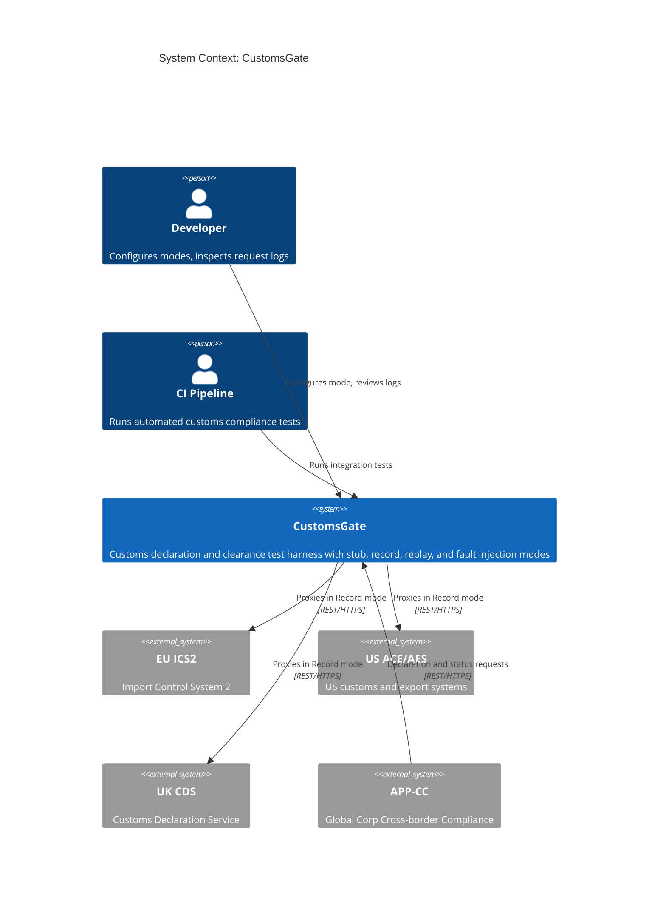

## System Declaration

```spec
system CustomsGate {
    target: "net10.0";
    responsibility: "HTTP-level test harness that mimics national customs
                     declaration and clearance systems (EU ICS2, US ACE/AES,
                     UK CDS, generic portal). Supports four behavior modes:
                     Stub, Record, Replay, and FaultInject. Allows APP-CC
                     to validate cross-border compliance flows without
                     calling real regulator systems.";

    authored component CustomsGate.Server {
        kind: "api-host";
        path: "src/CustomsGate.Server";
        status: new;
        responsibility: "ASP.NET 10 minimal API that exposes customs-compatible
                         REST endpoints for entry summary declarations, house
                         bills of lading, export declarations, clearance status
                         queries, and regulator callbacks. Routes incoming
                         requests through the active behavior mode and the
                         active authority selector.";
        contract {
            guarantees "Exposes POST /customs/entry-summary, POST
                        /customs/house-bill, POST /customs/export-declaration,
                        GET /customs/status/{mrn}, and POST /customs/callback
                        with request and response shapes that match the
                        selected authority's public surface.";
            guarantees "Behavior mode and authority selector are switchable
                        at runtime via the management API without restarting
                        the server.";
            guarantees "All incoming requests and outgoing responses are
                        captured in an in-memory log accessible via the
                        management API.";
            guarantees "Entry summary submissions return a synthetic MRN
                        (Movement Reference Number) in Stub and Replay modes,
                        and proxy-returned MRNs in Record mode.";
        }
    }

    authored component CustomsGate.Client {
        kind: library;
        path: "src/CustomsGate.Client";
        status: new;
        responsibility: "A typed .NET client library that matches the
                         customs client shape used by APP-CC. APP-CC can
                         swap its live customs client for CustomsGate.Client
                         through dependency injection without changing
                         calling code.";
        contract {
            guarantees "Public API surface mirrors the customs client
                        methods used by APP-CC: SubmitEntrySummary,
                        SubmitHouseBill, SubmitExportDeclaration,
                        GetClearanceStatus, PostCallback.";
            guarantees "Targets CustomsGate.Server by default. The base URL
                        and authority selector are configurable through
                        options.";
        }

        rationale {
            context "APP-CC calls customs systems through a typed client
                     abstraction. Swapping the base URL alone is
                     insufficient because test code also needs mode
                     configuration, authority selection, and log
                     inspection methods.";
            decision "A dedicated client library wraps both the customs-
                      compatible endpoints and the CustomsGate management
                      endpoints in a single package.";
            consequence "APP-CC test projects reference CustomsGate.Client
                         and register it in DI. Production code continues
                         to use the live customs client.";
        }
    }

    authored component CustomsGate.Tests {
        kind: tests;
        path: "tests/CustomsGate.Tests";
        status: new;
        responsibility: "Integration and unit tests for CustomsGate.Server
                         and CustomsGate.Client. Verifies each behavior
                         mode, authority selector, request logging, fault
                         injection, and client parity with APP-CC's
                         expected customs surface.";
    }

    consumed component xunit {
        source: nuget("xunit");
        version: "2.*";
        responsibility: "Unit and integration testing framework.";
        used_by: [CustomsGate.Tests];
    }

    consumed component TestHost {
        source: nuget("Microsoft.AspNetCore.Mvc.Testing");
        version: "10.*";
        responsibility: "In-process test server for integration testing
                         ASP.NET minimal API endpoints.";
        used_by: [CustomsGate.Tests];
    }

    consumed component SystemNetHttpJson {
        source: nuget("System.Net.Http.Json");
        version: "10.*";
        responsibility: "Typed JSON serialization over HttpClient for the
                         client library.";
        used_by: [CustomsGate.Client];
    }
}
```

## Data Specification

### Enums

```spec
enum BehaviorMode {
    Stub: "Returns preconfigured static responses for all endpoints",
    Record: "Proxies requests to a real regulator sandbox and records both request and response",
    Replay: "Returns previously recorded responses matched by request signature",
    FaultInject: "Returns configurable error responses to test failure handling"
}

enum CustomsAuthority {
    EuIcs2: "European Union Import Control System 2",
    UsAce: "United States Automated Commercial Environment (and AES for exports)",
    UkCds: "United Kingdom Customs Declaration Service",
    Generic: "Generic customs portal shape used when no specific regulator is being modelled"
}

enum ClearanceStage {
    Accepted: "Declaration received and accepted for processing",
    UnderReview: "Declaration is under regulator review, no terminal decision yet",
    Cleared: "Goods are cleared and may move",
    Held: "Goods are held pending additional action by the trader",
    Rejected: "Declaration was rejected and must be resubmitted"
}

enum DeclarationType {
    EntrySummary: "Pre-arrival entry summary declaration",
    HouseBill: "House bill of lading submission",
    Export: "Export declaration"
}
```

### Entities

The data model captures both the customs-compatible domain objects and the
internal recording and configuration state.

```spec
entity EntrySummaryDeclaration {
    id: string;
    authority: CustomsAuthority;
    traderId: string;
    consignmentRef: string;
    goodsDescription: string;
    grossMassKg: int @range(1..99999999);
    itemCount: int @range(1..9999);
    originCountry: string;
    destinationCountry: string;
    arrivalDate: string;

    invariant "id required": id != "";
    invariant "trader id required": traderId != "";
    invariant "consignment ref required": consignmentRef != "";
    invariant "positive mass": grossMassKg > 0;
    invariant "positive items": itemCount > 0;
    invariant "origin required": originCountry != "";
    invariant "destination required": destinationCountry != "";

    rationale "authority" {
        context "Different regulators require different declaration field
                 shapes. ICS2 uses EORI numbers, ACE uses filer codes,
                 CDS uses GB EORI. The authority selector determines
                 which shape the simulator accepts and returns.";
        decision "The declaration entity carries the authority explicitly
                  so each submission can be routed to the authority-specific
                  response generator.";
        consequence "Tests can submit the same logical declaration under
                     different authorities to verify that APP-CC handles
                     each regulator's quirks correctly.";
    }
}

entity HouseBillOfLading {
    id: string;
    authority: CustomsAuthority;
    masterBillRef: string;
    houseBillNumber: string;
    shipper: string;
    consignee: string;
    portOfLoading: string;
    portOfDischarge: string;
    containerCount: int @range(1..9999);

    invariant "id required": id != "";
    invariant "master bill required": masterBillRef != "";
    invariant "house bill required": houseBillNumber != "";
    invariant "shipper required": shipper != "";
    invariant "consignee required": consignee != "";
    invariant "positive containers": containerCount > 0;
}

entity ExportDeclaration {
    id: string;
    authority: CustomsAuthority;
    exporterId: string;
    commodityCode: string;
    invoiceValue: int @range(1..99999999999);
    invoiceCurrency: string @default("usd");
    destinationCountry: string;
    incoterm: string;

    invariant "id required": id != "";
    invariant "exporter id required": exporterId != "";
    invariant "commodity code required": commodityCode != "";
    invariant "positive invoice value": invoiceValue > 0;
    invariant "currency required": invoiceCurrency != "";
    invariant "destination required": destinationCountry != "";
    invariant "incoterm required": incoterm != "";

    rationale "invoiceValue" {
        context "Customs invoice values are reported in the smallest unit
                 of the declared currency to avoid floating-point drift
                 during duty calculations.";
        decision "Invoice value is an integer in minor currency units,
                  matching the convention used by PayGate for Stripe.";
        consequence "Callers must convert decimal invoice amounts to minor
                     units before calling CustomsGate, matching real
                     regulator submission behavior.";
    }
}

entity ClearanceStatus {
    mrn: string;
    stage: ClearanceStage;
    authority: CustomsAuthority;
    reasonCode: string?;
    lastUpdated: string;

    invariant "mrn required": mrn != "";
    invariant "last updated required": lastUpdated != "";
}

entity CustomsCallback {
    id: string;
    mrn: string;
    authority: CustomsAuthority;
    signature: string;
    payload: string;
    receivedAt: string;

    invariant "id required": id != "";
    invariant "mrn required": mrn != "";
    invariant "signature required": signature != "";
    invariant "payload required": payload != "";
    invariant "received at required": receivedAt != "";

    rationale "signature" {
        context "National customs systems sign their callback payloads so
                 that traders can verify authenticity. APP-CC validates
                 those signatures on receipt.";
        decision "CustomsCallback carries a signature field that the
                  simulator populates with a synthetic but well-formed
                  value in Stub and Replay modes.";
        consequence "APP-CC signature verification code runs against the
                     simulated callbacks in the same shape as against
                     real regulator callbacks.";
    }
}

entity CustomsGateRequest {
    id: string;
    timestamp: string;
    method: string;
    path: string;
    authority: CustomsAuthority;
    declarationType: DeclarationType?;
    body: string?;
    headers: string?;

    invariant "id required": id != "";
    invariant "path required": path != "";
}

entity CustomsGateResponse {
    id: string;
    requestId: string;
    statusCode: int @range(100..599);
    body: string?;
    latencyMs: int;

    invariant "id required": id != "";
    invariant "request reference": requestId != "";
    invariant "valid status code": statusCode >= 100;
}

entity FaultConfig {
    statusCode: int @range(400..599) @default(500);
    errorCode: string @default("customs_error");
    errorMessage: string @default("Simulated CustomsGate fault");
    delayMs: int @range(0..30000) @default(0);

    invariant "error status code": statusCode >= 400;
    invariant "non-negative delay": delayMs >= 0;

    rationale "delayMs" {
        context "Testing timeout handling requires the ability to simulate
                 slow responses from national customs systems, which are
                 known for multi-second latencies during peak hours.";
        decision "FaultConfig includes a configurable delay in milliseconds
                 applied before returning the error.";
        consequence "APP-CC timeout and retry logic can be validated by
                     setting delayMs to values above the client timeout
                     threshold.";
    }
}
```

## Contracts

### Customs-Compatible Endpoints

These contracts define the API surface that mirrors national customs
systems. The authority selector governs the exact field naming and
error code set, but the contract guarantees hold across all authorities.

```spec
contract SubmitEntrySummary {
    requires declaration.traderId != "";
    requires declaration.consignmentRef != "";
    requires declaration.grossMassKg > 0;
    ensures response.mrn != "";
    ensures response.stage == Accepted;
    guarantees "In Stub mode, returns a synthetic MRN with a generated ID
                and stage Accepted. In Record mode, proxies to the real
                regulator sandbox matching the authority selector and
                records both request and response. In Replay mode, returns
                the recorded response matching the request signature. In
                FaultInject mode, returns the configured error response
                after the configured delay.";
}

contract SubmitHouseBill {
    requires houseBill.masterBillRef != "";
    requires houseBill.houseBillNumber != "";
    requires houseBill.containerCount > 0;
    ensures response.clearanceToken != "";
    guarantees "Creates a house bill of lading submission tied to the
                given master bill reference. Returns a clearance token
                that APP-CC can present on subsequent calls. Mode
                behavior follows the same pattern as SubmitEntrySummary.";
}

contract SubmitExportDeclaration {
    requires declaration.exporterId != "";
    requires declaration.commodityCode != "";
    requires declaration.invoiceValue > 0;
    ensures response.customsReference != "";
    guarantees "Creates an export declaration submission. Returns a customs
                reference that APP-CC uses to track the export. Mode
                behavior follows the same pattern as SubmitEntrySummary.";
}

contract GetClearanceStatus {
    requires mrn != "";
    ensures status.mrn == mrn;
    ensures status.stage in [Accepted, UnderReview, Cleared, Held, Rejected];
    guarantees "Returns the current clearance status for a previously
                submitted declaration. In Stub mode, advances the stage
                on each call according to a deterministic progression.
                In Replay mode, returns the recorded status for the
                matching MRN. In FaultInject mode, returns the configured
                fault.";
}

contract PostCallback {
    requires callback.mrn != "";
    requires callback.signature != "";
    requires callback.payload != "";
    ensures response.accepted == true;
    guarantees "Accepts a signed-evidence callback from a simulated
                regulator. In Stub mode, always accepts. In Record mode,
                the gate records inbound callbacks for later inspection.
                In Replay mode, the gate can push synthetic callbacks
                to a configured APP-CC endpoint on request.";
}
```

### Management Endpoints

These contracts define the CustomsGate-specific configuration and
inspection API.

```spec
contract ConfigureMode {
    requires mode in [Stub, Record, Replay, FaultInject];
    requires authority in [EuIcs2, UsAce, UkCds, Generic];
    ensures activeMode == mode;
    ensures activeAuthority == authority;
    guarantees "Switches the server behavior mode and authority selector
                at runtime. When switching to FaultInject, an optional
                FaultConfig payload configures the error response. When
                switching to Record, regulator sandbox credentials must
                be provided alongside the authority selector.";
}

contract GetRequestLog {
    ensures count(entries) >= 0;
    guarantees "Returns all captured CustomsGateRequest and
                CustomsGateResponse pairs in chronological order. Supports
                optional filtering by path, authority, declaration type,
                and time range. Log entries persist for the lifetime of
                the server process.";
}
```

## Topology

```spec
topology Dependencies {
    allow CustomsGate.Server -> CustomsGate.Client;
    allow CustomsGate.Tests -> CustomsGate.Server;
    allow CustomsGate.Tests -> CustomsGate.Client;

    deny CustomsGate.Client -> CustomsGate.Tests;
    deny CustomsGate.Server -> CustomsGate.Tests;

    invariant "server has no Global Corp subsystem dependency":
        CustomsGate.Server does not reference AppCc
        and does not reference any other Global Corp subsystem assembly;

    rationale {
        context "CustomsGate is a standalone test harness. It must not
                 depend on APP-CC or any other Global Corp subsystem so
                 it can be reused, versioned, and released independently.";
        decision "CustomsGate.Server exposes customs-compatible REST
                  endpoints. APP-CC points to CustomsGate's URL in test
                  configuration. No compile-time dependency exists
                  between the two systems.";
        consequence "CustomsGate can be versioned and released
                     independently. Other projects that integrate with
                     national customs systems can adopt it by configuring
                     their customs client base URL and authority selector
                     to point at CustomsGate.";
    }
}
```

Rendered topology:

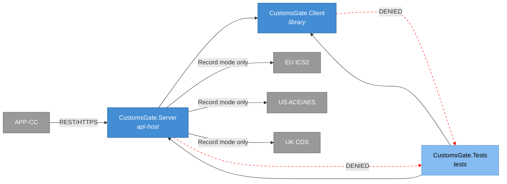

## Phases

```spec
phase ServerCore {
    produces: [CustomsGate.Server, CustomsGate.Client];

    gate ServerCompile {
        command: "dotnet build src/CustomsGate.Server";
        expects: "zero errors";
    }

    gate ClientCompile {
        command: "dotnet build src/CustomsGate.Client";
        expects: "zero errors";
    }

    gate HealthCheck {
        command: "curl -f http://localhost:5214/health";
        expects: "exit_code == 0";
    }
}

phase Testing {
    requires: ServerCore;
    produces: [CustomsGate.Tests];

    gate UnitTests {
        command: "dotnet test tests/CustomsGate.Tests --filter Category=Unit";
        expects: "all tests pass", pass >= 12;
    }

    gate IntegrationTests {
        command: "dotnet test tests/CustomsGate.Tests --filter Category=Integration";
        expects: "all tests pass", pass >= 10;
    }

    gate ModeTests {
        command: "dotnet test tests/CustomsGate.Tests --filter Category=Mode";
        expects: "all tests pass", pass >= 4;
        rationale "One test per behavior mode confirms that mode switching
                   and mode-specific response logic work correctly across
                   all four authority selectors.";
    }

    gate AuthorityTests {
        command: "dotnet test tests/CustomsGate.Tests --filter Category=Authority";
        expects: "all tests pass", pass >= 4;
        rationale "One test per authority selector confirms that the
                   authority-specific response generators produce field
                   shapes matching the target regulator.";
    }
}

phase Integration {
    requires: Testing;

    gate FullBuild {
        command: "dotnet build CustomsGate.slnx";
        expects: "zero errors";
    }

    gate AllTests {
        command: "dotnet test CustomsGate.slnx";
        expects: "all tests pass", fail == 0;
    }

    rationale "Final gate confirms the complete solution builds and all
               tests pass before the spec can advance to Verified.";
}
```

Rendered phase ordering:

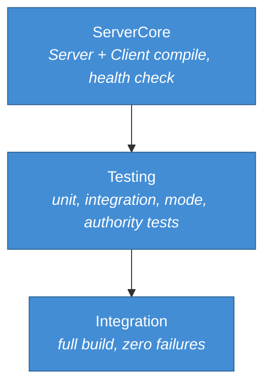

## Traces

```spec
trace CustomsFlow {
    SubmitEntrySummary -> [CustomsGate.Server, CustomsGate.Client];
    SubmitHouseBill -> [CustomsGate.Server, CustomsGate.Client];
    SubmitExportDeclaration -> [CustomsGate.Server, CustomsGate.Client];
    GetClearanceStatus -> [CustomsGate.Server, CustomsGate.Client];
    PostCallback -> [CustomsGate.Server, CustomsGate.Client];
    ConfigureMode -> [CustomsGate.Server, CustomsGate.Client];
    GetRequestLog -> [CustomsGate.Server, CustomsGate.Client];

    invariant "full coverage":
        all sources have count(targets) >= 1;
    invariant "server always involved":
        all sources have targets contains CustomsGate.Server;
}

trace DataModel {
    EntrySummaryDeclaration -> [CustomsGate.Server, CustomsGate.Client];
    HouseBillOfLading -> [CustomsGate.Server, CustomsGate.Client];
    ExportDeclaration -> [CustomsGate.Server, CustomsGate.Client];
    ClearanceStatus -> [CustomsGate.Server, CustomsGate.Client];
    CustomsCallback -> [CustomsGate.Server, CustomsGate.Client];
    CustomsGateRequest -> [CustomsGate.Server];
    CustomsGateResponse -> [CustomsGate.Server];
    FaultConfig -> [CustomsGate.Server, CustomsGate.Client];
    BehaviorMode -> [CustomsGate.Server, CustomsGate.Client];
    CustomsAuthority -> [CustomsGate.Server, CustomsGate.Client];
    ClearanceStage -> [CustomsGate.Server, CustomsGate.Client];
    DeclarationType -> [CustomsGate.Server, CustomsGate.Client];
}
```

## System-Level Constraints

```spec
constraint NoGlobalCorpSubsystemDependency {
    scope: [CustomsGate.Server, CustomsGate.Client];
    rule: "No references to any Global Corp subsystem namespace or
           assembly (APP-CC, APP-FX, APP-SCM, and so on). CustomsGate
           communicates with APP-CC only at the HTTP boundary.";

    rationale {
        context "CustomsGate must remain a general-purpose customs test
                 harness, reusable by any Global Corp subsystem or
                 unrelated project that integrates with national customs
                 systems.";
        decision "No compile-time coupling to Global Corp subsystems. The
                  contract is the authority-specific REST API shape, not
                  any application type.";
        consequence "CustomsGate can be extracted to a separate repository
                     and published as an independent tool.";
    }
}

constraint NullableEnabled {
    scope: all authored components;
    rule: "Nullable reference types are enabled in every project file.
           No suppression operators (!) outside of test setup code.";
}

constraint InMemoryOnly {
    scope: [CustomsGate.Server];
    rule: "All state (request logs, recorded responses, fault config,
           active authority) is held in memory. No database, no file
           system persistence. State resets when the server process
           restarts.";

    rationale {
        context "CustomsGate is a test-time tool, not a production
                 service. Persistent state would add complexity without
                 benefit and would risk leaking cross-test data.";
        decision "In-memory collections with no external storage
                  dependencies.";
        consequence "Each test run starts with a clean state. Long-running
                     recording sessions should export logs via the
                     management API before stopping the server.";
    }
}

constraint ShapeParity {
    scope: [CustomsGate.Server];
    rule: "Request and response JSON shapes for each authority selector
           must match the documented public surface of the corresponding
           national customs system. Field naming follows each regulator's
           convention: ICS2 uses camelCase, ACE/AES uses snake_case,
           CDS uses kebab-case in URL segments and camelCase in bodies.";

    rationale "Shape parity ensures that APP-CC code works identically
               against CustomsGate and real regulators without conditional
               logic or adapter layers.";
}

constraint TestNaming {
    scope: [CustomsGate.Tests];
    rule: "Test methods follow MethodName_Scenario_ExpectedResult naming.
           Test classes mirror the source class name with a Tests suffix.";
}
```

## Package Policy

CustomsGate inherits the package policy from the Global Corp platform
architecture specification.

```spec
package_policy CustomsGatePolicy {
    inherit weakRef<PackagePolicy>(GlobalCorpPolicy)
        from "global-corp.architecture.spec.md" section 8;
}
```

See [global-corp.architecture.spec.md](global-corp.architecture.spec.md)
Section 8 for the inherited package rules. No gate-specific overrides are
declared.

## Platform Realization

```spec
dotnet solution CustomsGate {
    format: slnx;
    startup: CustomsGate.Server;

    folder "src" {
        projects: [CustomsGate.Server, CustomsGate.Client];
    }

    folder "tests" {
        projects: [CustomsGate.Tests];
    }

    rationale {
        context "CustomsGate is a small, focused solution with two source
                 projects and one test project, mirroring the PayGate
                 and SendGate layouts.";
        decision "CustomsGate.Server is the startup project. It serves the
                  customs-compatible endpoints and the management API on a
                  single configurable port.";
        consequence "Running dotnet run from the Server project starts the
                     test harness. The default port is 5214.";
    }
}
```

Rendered solution structure:

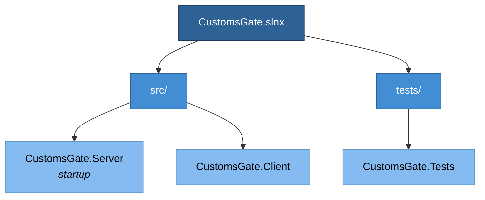

## Deployment

```spec
deployment Development {
    node "Developer Workstation" {
        technology: "Docker Desktop via Aspire AppHost";

        node "CustomsGate Container" {
            technology: ".NET 10 SDK";
            image: "globalcorp/customs-gate:latest";
            instance: CustomsGate.Server;
            port: 5214;
        }
    }

    rationale "CustomsGate runs as a Docker container on the developer
               workstation, started by APP-CC's Aspire AppHost alongside
               PayGate, SendGate, FsmaGate, PostgreSQL, and other APP-CC
               dependencies. APP-CC's customs client base URL environment
               variable points to http://customs-gate:5214.";
}

deployment CI {
    node "GitHub Actions Runner" {
        technology: "ubuntu-latest";

        node "CustomsGate Service Container" {
            technology: ".NET 10 SDK, Docker";
            image: "globalcorp/customs-gate:latest";
            instance: CustomsGate.Server;
            port: 5214;
        }
    }

    rationale {
        context "APP-CC integration tests in CI need a running
                 CustomsGate instance to validate cross-border compliance
                 flows without regulator sandbox credentials.";
        decision "CustomsGate runs as a service container in GitHub
                  Actions, started by the APP-CC Aspire AppHost. The
                  APP-CC test step sets the customs base URL to the
                  service container's address.";
        consequence "CI tests exercise the same code paths as production
                     without requiring regulator credentials or network
                     access to national customs systems.";
    }
}
```

Rendered deployment:

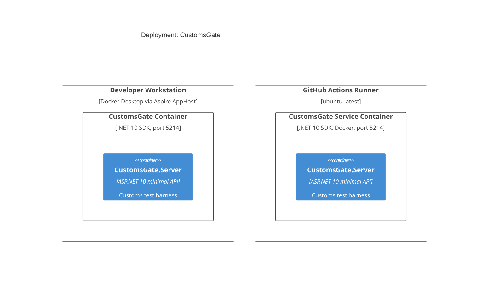

## Views

```spec
view systemContext of CustomsGate ContextView {
    include: all;
    autoLayout: top-down;
    description: "CustomsGate with its users (Developer, CI Pipeline) and
                  external systems (EU ICS2, US ACE/AES, UK CDS, APP-CC).";
}

view container of CustomsGate ContainerView {
    include: all;
    autoLayout: left-right;
    description: "Internal structure showing CustomsGate.Server,
                  CustomsGate.Client, and CustomsGate.Tests with their
                  dependencies.";
}

view deployment of Development DevelopmentDeploymentView {
    include: all;
    autoLayout: top-down;
    description: "Developer workstation running CustomsGate as a Docker
                  container under the APP-CC Aspire AppHost.";
    @tag("dev");
}

view deployment of CI CIDeploymentView {
    include: all;
    autoLayout: top-down;
    description: "GitHub Actions runner with CustomsGate as a service
                  container for automated integration tests.";
    @tag("ci");
}
```

## Dynamic Scenarios

### Stub Mode: Entry Summary Submission

APP-CC submits an entry summary declaration through CustomsGate in Stub
mode during unit-level integration tests. CustomsGate returns a
preconfigured response with a synthetic MRN without contacting any
regulator.

```spec
dynamic StubEntrySummary {
    1: Developer -> CustomsGate.Server {
        description: "Configures CustomsGate to Stub mode with authority
                      selector eu-ics2 via management API.";
        technology: "REST/HTTPS";
    };
    2: AppCc -> CustomsGate.Server {
        description: "POST /customs/entry-summary with trader, consignment,
                      and goods fields.";
        technology: "REST/HTTPS";
    };
    3: CustomsGate.Server -> CustomsGate.Server
        : "Generates synthetic MRN and builds ICS2-shaped response with
           stage Accepted.";
    4: CustomsGate.Server -> CustomsGate.Server
        : "Logs request and response to in-memory request log.";
    5: CustomsGate.Server -> AppCc {
        description: "Returns ICS2-shaped JSON with MRN and Accepted stage.";
        technology: "REST/HTTPS";
    };
}
```

Rendered interaction sequence:

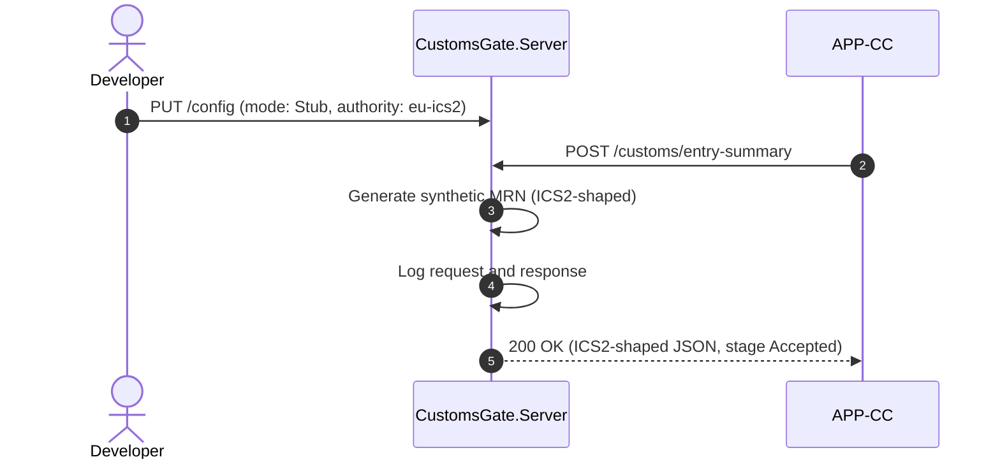

### Record Mode: Export Declaration

CustomsGate proxies the export declaration request to a real ACE/AES
sandbox and records both the request and response for later replay.

```spec
dynamic RecordExportDeclaration {
    1: Developer -> CustomsGate.Server {
        description: "Configures CustomsGate to Record mode with authority
                      us-ace and ACE/AES sandbox credentials.";
        technology: "REST/HTTPS";
    };
    2: AppCc -> CustomsGate.Server {
        description: "POST /customs/export-declaration with exporter,
                      commodity code, and invoice value.";
        technology: "REST/HTTPS";
    };
    3: CustomsGate.Server -> UsAce {
        description: "Forwards the request to the ACE/AES sandbox with real
                      credentials.";
        technology: "REST/HTTPS";
    };
    4: UsAce -> CustomsGate.Server
        : "Returns export declaration response with customs reference.";
    5: CustomsGate.Server -> CustomsGate.Server
        : "Records request and response pair keyed by request signature.";
    6: CustomsGate.Server -> AppCc {
        description: "Returns the real ACE/AES response unmodified.";
        technology: "REST/HTTPS";
    };
}
```

Rendered interaction sequence:

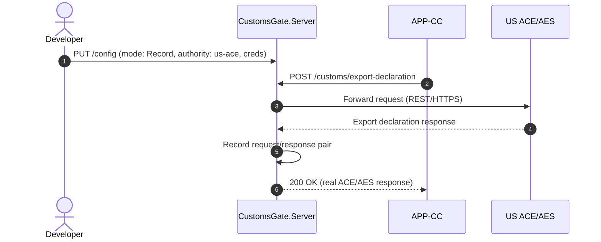

### Replay Mode: Clearance Status Query

CustomsGate returns a previously recorded clearance status response matched
by request signature. No network call to any regulator occurs.

```spec
dynamic ReplayClearanceStatus {
    1: Developer -> CustomsGate.Server {
        description: "Configures CustomsGate to Replay mode with authority
                      uk-cds.";
        technology: "REST/HTTPS";
    };
    2: AppCc -> CustomsGate.Server {
        description: "GET /customs/status/{mrn} for a previously submitted
                      declaration MRN.";
        technology: "REST/HTTPS";
    };
    3: CustomsGate.Server -> CustomsGate.Server
        : "Matches request signature against recorded CDS status entries.";
    4: CustomsGate.Server -> CustomsGate.Server
        : "Logs replay request and the matched response.";
    5: CustomsGate.Server -> AppCc {
        description: "Returns the matched recorded response with
                      ClearanceStatus (e.g. stage Cleared).";
        technology: "REST/HTTPS";
    };
}
```

Rendered interaction sequence:

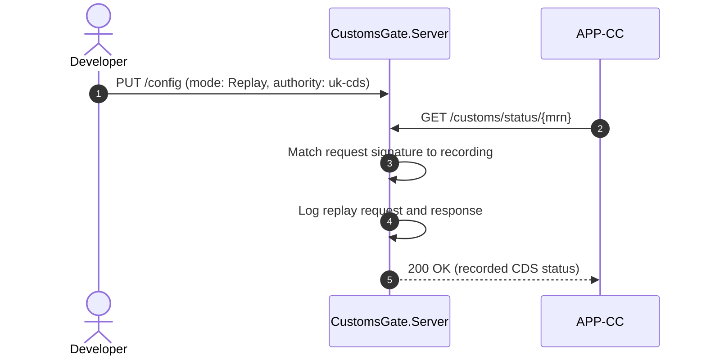

### FaultInject Mode: Declaration Rejected

CustomsGate returns a configurable error response to test APP-CC's failure
handling when a regulator rejects a declaration.

```spec
dynamic FaultInjectDeclaration {
    1: Developer -> CustomsGate.Server {
        description: "Configures CustomsGate to FaultInject mode with a
                      FaultConfig specifying 422, declaration_rejected,
                      and 1500ms delay, under authority eu-ics2.";
        technology: "REST/HTTPS";
    };
    2: AppCc -> CustomsGate.Server {
        description: "POST /customs/entry-summary with trader, consignment,
                      and goods fields.";
        technology: "REST/HTTPS";
    };
    3: CustomsGate.Server -> CustomsGate.Server
        : "Waits for the configured delay (1500ms).";
    4: CustomsGate.Server -> CustomsGate.Server
        : "Logs the request and the fault response.";
    5: CustomsGate.Server -> AppCc {
        description: "Returns 422 with ICS2-shaped error body containing
                      declaration_rejected error code.";
        technology: "REST/HTTPS";
    };
}
```

Rendered interaction sequence:

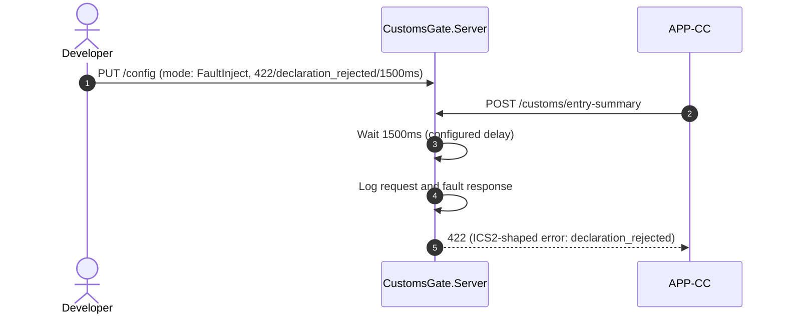

### Stub Mode: House Bill Submission

APP-CC submits a house bill of lading through CustomsGate in Stub mode,
exercising the consolidation path for ocean freight.

```spec
dynamic StubHouseBill {
    1: AppCc -> CustomsGate.Server {
        description: "POST /customs/house-bill with master bill reference,
                      shipper, consignee, and container count.";
        technology: "REST/HTTPS";
    };
    2: CustomsGate.Server -> CustomsGate.Server
        : "Generates synthetic clearance token under the active authority.";
    3: CustomsGate.Server -> CustomsGate.Server
        : "Logs request and response.";
    4: CustomsGate.Server -> AppCc {
        description: "Returns authority-shaped JSON with the clearance
                      token.";
        technology: "REST/HTTPS";
    };
}
```

Rendered interaction sequence:

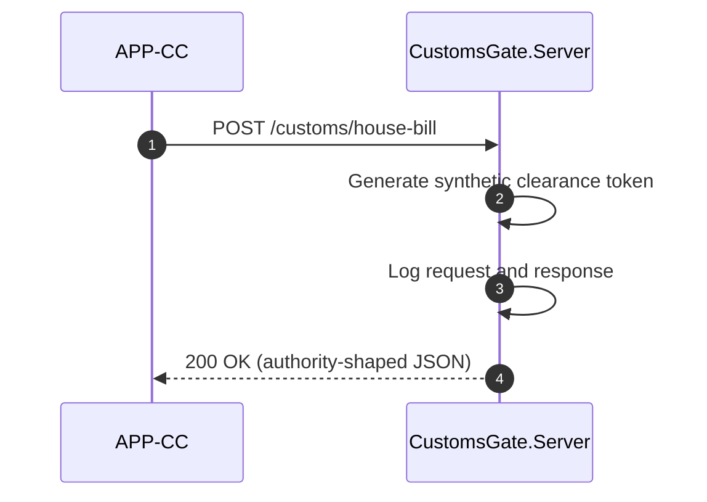

### Signed Callback Inbox

A simulated regulator posts a signed-evidence callback to CustomsGate,
which APP-CC then retrieves or which CustomsGate forwards to APP-CC
depending on the configured replay endpoint.

```spec
dynamic SignedCallbackInbox {
    1: Developer -> CustomsGate.Server {
        description: "POST /customs/callback with a signed payload,
                      impersonating a regulator.";
        technology: "REST/HTTPS";
    };
    2: CustomsGate.Server -> CustomsGate.Server
        : "Validates payload shape and records the callback keyed by MRN.";
    3: AppCc -> CustomsGate.Server {
        description: "GET /admin/requests?path=/customs/callback to retrieve
                      the recorded callback for assertion.";
        technology: "REST/HTTPS";
    };
    4: CustomsGate.Server -> AppCc {
        description: "Returns the captured callback with signature and
                      payload for APP-CC to verify.";
        technology: "REST/HTTPS";
    };
}
```

Rendered interaction sequence:

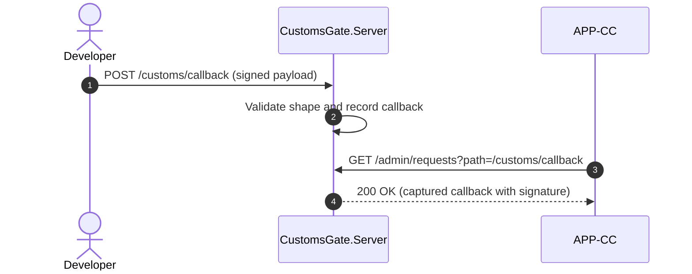

## Open Items

1. Confirm whether CustomsGate should support a fifth authority selector
   for Canada (CBSA CARM) in a follow-up version.
2. Decide whether the signed-callback inbox should expose a push endpoint
   that CustomsGate calls on APP-CC during Replay mode, or whether APP-CC
   should continue to poll via GetRequestLog.
3. Agree on the synthetic MRN format per authority (ICS2 LRN vs MRN, ACE
   filer-code prefixed reference, CDS MRN). Current draft uses an
   authority-prefixed GUID for simplicity.
4. Capture the expected fault catalogue per authority so FaultInject
   tests can cover regulator-specific error codes beyond the generic
   declaration_rejected case.
