# DppRegistryGate -- System Specification

## Tracking

| Field | Value |
|---|---|
| slug | dpp-registry-gate |
| itemType | SystemSpec |
| name | DppRegistryGate |
| shortDescription | Test harness that mimics the EU Digital Product Passport registry for APP-SD Sustainability and DPP |
| version | 1 |
| specLangVersion | 0.1.0 |
| publishStatus | Draft |
| retentionPolicy | indefinite |
| freshnessSla | P90D |
| lastReviewed | 2026-04-18 |
| authors | [PER-01 Lena Brandt] |
| reviewers | [PER-15 Marcus Weber] |
| committer | PER-01 Lena Brandt |
| tags | [gate, simulator, dpp, registry, app-sd, eu-spr, ecodesign] |
| createdAt | 2026-04-18T00:00:00Z |
| updatedAt | 2026-04-18T00:00:00Z |
| Dependencies | global-corp.architecture.spec.md |
| State | Draft |
| Reviewed | |
| Approved | |
| Executed | |
| Verified | |

This specification describes DppRegistryGate, a test harness that mimics the EU Digital Product Passport registry surface defined under the EU Ecodesign for Sustainable Products Regulation (SPR). APP-SD Sustainability and DPP points to DppRegistryGate instead of the live registry when running in test, development, and Aspire AppHost local profiles. DppRegistryGate supports four behavior modes: returning preconfigured stubs, recording live registry traffic, replaying recorded responses, and injecting configurable faults.

DppRegistryGate is an HTTP-level proxy and stub built as an ASP.NET 10 minimal API. It exposes the same REST endpoints that APP-SD calls on the real registry, plus the consumer-app-style QR-resolvable endpoints that public scanners would hit. No production code in APP-SD changes between real and simulated registry targets; only the base URL differs.

The gate follows the PayGate and SendGate pattern used across the Global Corp Platform gate simulator family. It ships as a Docker image, `globalcorp/dpp-registry-gate:latest`, and is consumed by `GlobalCorp.AppHost` as the `gate-dpp-registry` container resource. A typed .NET client library, `DppRegistryGate.Client`, wraps both the registry-compatible endpoints and the gate management endpoints so that APP-SD test projects can configure behavior mode and inspect request logs without raw HTTP calls.

## Context

```spec
person Developer {
    description: "A developer running APP-SD integration tests or
                  working locally against the DPP registry stub
                  instead of the live EU registry.";
    @tag("internal", "test");
}

person CIPipeline {
    description: "Automated CI/CD pipeline that runs APP-SD
                  integration tests against DppRegistryGate to
                  validate DPP submission flows without touching
                  the real EU registry.";
    @tag("automation", "test");
}

person ComplianceTester {
    description: "A compliance engineer verifying category-specific
                  validation quirks (Electronics RoHS/WEEE, Battery
                  carbon footprint, Textile fiber composition) before
                  submitting against the production registry.";
    @tag("internal", "compliance");
}

external system EuDppRegistry {
    description: "Live EU Digital Product Passport registry operated
                  under SPR. DppRegistryGate proxies to this registry
                  in Record mode and mimics its REST surface in all
                  other modes.";
    technology: "REST/HTTPS";
    @tag("registry", "external", "eu");
}

external system "APP-SD Sustainability and DPP" {
    description: "The Global Corp subsystem that normally calls the EU
                  DPP registry. In test and local simulation it calls
                  DppRegistryGate at the same REST endpoints.";
    technology: "REST/HTTPS";
    @tag("consumer", "global-corp");
}

external system "GlobalCorp.AppHost" {
    description: "The Aspire AppHost that starts DppRegistryGate as
                  the gate-dpp-registry container and wires APP-SD
                  references to it in the Local Simulation Profile.";
    technology: ".NET Aspire 13.2";
    @tag("orchestrator", "global-corp");
}

Developer -> DppRegistryGate : "Configures behavior mode and inspects request logs.";

CIPipeline -> DppRegistryGate : "Runs automated DPP submission integration tests.";

ComplianceTester -> DppRegistryGate : "Exercises category-specific validation quirks.";

"APP-SD Sustainability and DPP" -> DppRegistryGate {
    description: "Submits DPP packages, retrieves and updates passports,
                  searches the registry, and registers acknowledgment
                  callbacks. In Local Simulation Profile the base URL
                  points at DppRegistryGate.";
    technology: "REST/HTTPS";
}

"GlobalCorp.AppHost" -> DppRegistryGate {
    description: "Starts the gate-dpp-registry container and exposes
                  it as a service reference to APP-SD.";
    technology: ".NET Aspire 13.2";
}

DppRegistryGate -> EuDppRegistry {
    description: "Proxies requests to the real EU DPP registry in
                  Record mode only.";
    technology: "REST/HTTPS";
}
```

Rendered system context:

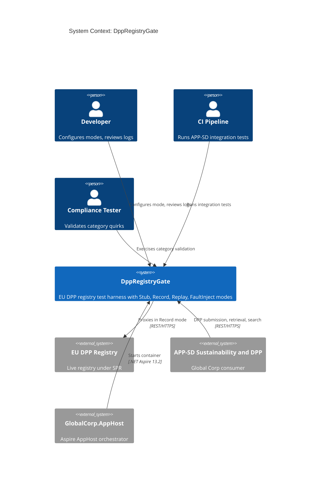

## System Declaration

```spec
system DppRegistryGate {
    target: "net10.0";
    responsibility: "HTTP-level test harness that mimics the EU Digital
                     Product Passport registry REST surface defined
                     under SPR. Supports four behavior modes: Stub,
                     Record, Replay, FaultInject. Allows APP-SD to
                     validate its DPP submission, retrieval, update,
                     search, and QR-resolution flows without calling
                     the live EU registry.";

    authored component DppRegistryGate.Server {
        kind: "api-host";
        path: "src/DppRegistryGate.Server";
        status: new;
        responsibility: "ASP.NET 10 minimal API that exposes DPP
                         registry-compatible REST endpoints for
                         passport submission, retrieval, update,
                         search, callback registration, and
                         QR-resolvable consumer lookups. Routes
                         incoming requests through the active
                         behavior mode and returns category-aware
                         responses.";
        contract {
            guarantees "Exposes POST /dpp/v1/passports,
                        GET /dpp/v1/passports/{registryUri},
                        PUT /dpp/v1/passports/{registryUri},
                        GET /dpp/v1/search,
                        POST /dpp/v1/callbacks, and
                        GET /passports/{qrHash} matching the EU DPP
                        registry request and response shapes.";
            guarantees "Behavior mode is switchable at runtime via
                        the management endpoint without restarting
                        the server.";
            guarantees "Category-specific validation quirks are
                        applied in Stub mode: Electronics requires
                        RoHS and WEEE fields, Battery requires
                        carbon footprint, Textile requires fiber
                        composition.";
            guarantees "All incoming requests and outgoing responses
                        are captured in an in-memory log accessible
                        via the management API.";
        }
    }

    authored component DppRegistryGate.Client {
        kind: library;
        path: "src/DppRegistryGate.Client";
        status: new;
        responsibility: "A typed .NET client library that matches the
                         EU DPP registry client shape. APP-SD can swap
                         its production registry client for
                         DppRegistryGate.Client through dependency
                         injection without changing calling code.";
        contract {
            guarantees "Public API surface mirrors the EU DPP registry
                        methods used by APP-SD: SubmitPassport,
                        GetPassport, UpdatePassport, SearchRegistry,
                        RegisterCallback, ResolveQr.";
            guarantees "Targets DppRegistryGate.Server by default. The
                        base URL is configurable via the Aspire service
                        reference or an environment variable.";
            guarantees "Exposes management methods: ConfigureMode and
                        GetRequestLog, for test and inspection use.";
        }

        rationale {
            context "APP-SD calls the EU DPP registry through a typed
                     client. Swapping the base URL alone is insufficient
                     because test code also needs mode configuration
                     and log inspection methods.";
            decision "A dedicated client library wraps both the
                      registry-compatible endpoints and the
                      DppRegistryGate management endpoints in a single
                      package.";
            consequence "APP-SD test projects reference
                         DppRegistryGate.Client and register it in DI.
                         Production code continues to use the real EU
                         registry client.";
        }
    }

    authored component DppRegistryGate.Tests {
        kind: tests;
        path: "tests/DppRegistryGate.Tests";
        status: new;
        responsibility: "Integration and unit tests for
                         DppRegistryGate.Server and
                         DppRegistryGate.Client. Verifies each
                         behavior mode, request logging, fault
                         injection, category-specific validation
                         quirks, and client parity with the EU
                         registry shape.";
    }

    consumed component xunit {
        source: nuget("xunit");
        version: "2.*";
        responsibility: "Unit and integration testing framework.";
        used_by: [DppRegistryGate.Tests];
    }

    consumed component TestHost {
        source: nuget("Microsoft.AspNetCore.Mvc.Testing");
        version: "10.*";
        responsibility: "In-process test server for integration
                         testing ASP.NET minimal API endpoints.";
        used_by: [DppRegistryGate.Tests];
    }

    consumed component SystemNetHttpJson {
        source: nuget("System.Net.Http.Json");
        version: "10.*";
        responsibility: "Strongly-typed JSON helpers for HTTP client
                         calls to DppRegistryGate.Server from
                         DppRegistryGate.Client.";
        used_by: [DppRegistryGate.Client];
    }
}
```

## Data Specification

### Enums

```spec
enum BehaviorMode {
    Stub: "Returns preconfigured static responses for all endpoints",
    Record: "Proxies requests to the live EU DPP registry and records request and response",
    Replay: "Returns previously recorded responses matched by request signature",
    FaultInject: "Returns configurable error responses to test failure handling"
}

enum ProductCategory {
    Electronics: "Electronic and electrical equipment; requires RoHS and WEEE fields",
    Battery: "Batteries under the Battery Regulation; requires carbon footprint fields",
    Textile: "Textile articles; requires fiber composition",
    Furniture: "Furniture products; requires wood origin and surface treatment declarations",
    Apparel: "Apparel; inherits textile expectations with size and care labeling",
    Generic: "Fallback category when no specialization applies"
}

enum SubmissionState {
    Accepted: "Registry accepted the package but validation has not yet completed",
    Validated: "Registry validated the package and assigned a persistent URI",
    Rejected: "Registry rejected the package with one or more errors",
    Superseded: "The passport has been replaced by a newer version"
}

enum ValidationSeverity {
    Warning: "Non-blocking observation that should be reviewed before re-submission",
    Error: "Blocking issue that caused or would cause rejection"
}
```

### Entities

The data model captures both the registry-compatible domain objects and the internal recording and configuration state.

```spec
entity DppSubmission {
    registryUri: string;
    version: int @range(1..9999);
    packageHash: string;
    signedBy: string;
    submittedAt: string;
    category: ProductCategory @default(Generic);
    state: SubmissionState @default(Accepted);

    invariant "registry uri required": registryUri != "";
    invariant "positive version": version > 0;
    invariant "package hash required": packageHash != "";
    invariant "signed by required": signedBy != "";

    rationale "registryUri" {
        context "The EU DPP registry returns a persistent URI that
                 survives passport amendments. Consumer-app QR codes
                 resolve to this URI, not to a submission ID.";
        decision "registryUri is the primary key of the passport
                  record. Updates produce a new version under the
                  same registryUri.";
        consequence "APP-SD stores registryUri alongside the product
                     in APP-TC and uses it for all subsequent reads
                     and amendments.";
    }
}

entity DppPackage {
    product: string;
    materials: string;
    declarations: string;
    evidenceBundleUri: string?;
    category: ProductCategory @default(Generic);

    invariant "product required": product != "";
    invariant "materials required": materials != "";
    invariant "declarations required": declarations != "";
}

entity DppSearchResult {
    registryUri: string;
    gtin: string?;
    brand: string?;
    category: ProductCategory;
    summary: string;

    invariant "registry uri required": registryUri != "";
}

entity DppCallback {
    callbackId: string;
    url: string;
    registeredAt: string;
    registryUriFilter: string?;
    categoryFilter: ProductCategory?;

    invariant "callback id required": callbackId != "";
    invariant "url required": url != "";
}

entity RegistryQuery {
    q: string?;
    gtin: string?;
    brand: string?;
    material: string?;
    category: ProductCategory?;
    pageSize: int @range(1..100) @default(20);

    invariant "page size positive": pageSize >= 1;
}

entity DppRegistryGateRequest {
    id: string;
    timestamp: string;
    method: string;
    path: string;
    body: string?;
    headers: string?;

    invariant "id required": id != "";
    invariant "path required": path != "";
}

entity DppRegistryGateResponse {
    id: string;
    requestId: string;
    statusCode: int @range(100..599);
    body: string?;
    latencyMs: int;

    invariant "id required": id != "";
    invariant "request reference": requestId != "";
    invariant "valid status code": statusCode >= 100;
}

entity FaultConfig {
    statusCode: int @range(400..599) @default(500);
    errorType: string @default("registry_error");
    errorMessage: string @default("Simulated DppRegistryGate fault");
    delayMs: int @range(0..30000) @default(0);
    appliesToCategory: ProductCategory?;

    invariant "error status code": statusCode >= 400;
    invariant "non-negative delay": delayMs >= 0;

    rationale "appliesToCategory" {
        context "Some failure scenarios are category-specific (for
                 example, the registry returns 422 only for Battery
                 submissions missing carbon footprint). Tests need to
                 target fault injection by category.";
        decision "FaultConfig includes an optional category filter.
                  When set, the fault applies only to requests whose
                  detected category matches.";
        consequence "APP-SD can verify category-aware error handling
                     without reconfiguring the gate between calls.";
    }
}
```

## Contracts

### Registry-Compatible Endpoints

These contracts define the API surface that mirrors the EU DPP registry REST endpoints.

```spec
contract SubmitPassport {
    requires package.product != "";
    requires package.materials != "";
    requires package.declarations != "";
    requires signature != "";
    ensures submission.registryUri != "";
    ensures submission.version == 1;
    ensures submission.state in [Accepted, Validated, Rejected];
    guarantees "In Stub mode, returns a synthetic DppSubmission with
                a generated registryUri, version 1, and Validated
                state, subject to category-specific field checks.
                In Record mode, proxies to the EU registry and
                records both request and response. In Replay mode,
                returns the recorded response matching the request
                signature. In FaultInject mode, returns the
                configured error response after the configured
                delay.";
}

contract GetPassport {
    requires registryUri != "";
    ensures passport.registryUri == registryUri;
    ensures passport.version >= 1;
    guarantees "Returns the current DppSubmission and DppPackage
                for the requested registryUri. In Stub mode, returns
                a synthetic record that matches the requested URI
                when recognized, otherwise 404. Mode behavior
                follows the same pattern as SubmitPassport.";
}

contract UpdatePassport {
    requires registryUri != "";
    requires package.declarations != "";
    ensures updated.registryUri == registryUri;
    ensures updated.version > previous.version;
    ensures previous.state == Superseded;
    guarantees "Amendments preserve the registryUri and increment
                the version. The prior version is marked Superseded.
                Mode behavior follows the same pattern as
                SubmitPassport.";
}

contract SearchRegistry {
    requires query.pageSize >= 1;
    ensures count(results) <= query.pageSize;
    guarantees "Returns DppSearchResult entries matching the query.
                In Stub mode, returns a deterministic set seeded
                by query terms. In Record and Replay modes, the
                same request produces the same result set.";
}

contract RegisterCallback {
    requires callback.url != "";
    ensures callback.callbackId != "";
    ensures callback.registeredAt != "";
    guarantees "Persists the callback registration for the lifetime
                of the server process. In Stub mode, the gate does
                not actually invoke the callback. In Record mode,
                the registration is proxied to the real registry.";
}

contract ResolveQr {
    requires qrHash != "";
    ensures resolved.registryUri != "";
    guarantees "Resolves a consumer-facing QR hash to the current
                registryUri and returns a minimal public view of
                the passport. Mode behavior follows the same
                pattern as GetPassport.";
}
```

### Management Endpoints

These contracts define the DppRegistryGate-specific configuration and inspection API.

```spec
contract ConfigureMode {
    requires mode in [Stub, Record, Replay, FaultInject];
    ensures activeMode == mode;
    guarantees "Switches the server behavior mode at runtime. When
                switching to FaultInject, an optional FaultConfig
                payload configures the error response and optional
                category filter. When switching to Record, EU DPP
                registry credentials and base URL must be provided.";
}

contract GetRequestLog {
    ensures count(entries) >= 0;
    guarantees "Returns all captured DppRegistryGateRequest and
                DppRegistryGateResponse pairs in chronological
                order. Supports optional filtering by path, category,
                and time range. Log entries persist for the lifetime
                of the server process.";
}
```

## Topology

```spec
topology Dependencies {
    allow DppRegistryGate.Server -> DppRegistryGate.Client;
    allow DppRegistryGate.Tests -> DppRegistryGate.Server;
    allow DppRegistryGate.Tests -> DppRegistryGate.Client;

    deny DppRegistryGate.Client -> DppRegistryGate.Tests;
    deny DppRegistryGate.Server -> DppRegistryGate.Tests;

    invariant "server has no Global Corp subsystem dependency":
        DppRegistryGate.Server does not reference any "APP-*" subsystem;

    invariant "client has no Global Corp subsystem dependency":
        DppRegistryGate.Client does not reference any "APP-*" subsystem;

    rationale {
        context "DppRegistryGate is a standalone test harness. It
                 must not depend on APP-SD or any other Global Corp
                 subsystem so it can be reused by other projects
                 that integrate with the EU DPP registry.";
        decision "DppRegistryGate.Server exposes registry-compatible
                  REST endpoints. APP-SD points its registry client
                  base URL at DppRegistryGate in test and Local
                  Simulation profiles. No compile-time dependency
                  exists between the two systems.";
        consequence "DppRegistryGate can be versioned and released
                     independently. Other projects can adopt it by
                     configuring their registry client base URL to
                     point at DppRegistryGate.";
    }
}
```

Rendered topology:

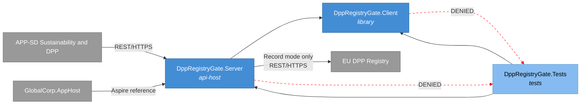

## Phases

```spec
phase ServerCore {
    produces: [DppRegistryGate.Server, DppRegistryGate.Client];

    gate ServerCompile {
        command: "dotnet build src/DppRegistryGate.Server";
        expects: "zero errors";
    }

    gate ClientCompile {
        command: "dotnet build src/DppRegistryGate.Client";
        expects: "zero errors";
    }

    gate HealthCheck {
        command: "curl -f http://localhost:5216/health";
        expects: "exit_code == 0";
    }
}

phase Testing {
    requires: ServerCore;
    produces: [DppRegistryGate.Tests];

    gate UnitTests {
        command: "dotnet test tests/DppRegistryGate.Tests --filter Category=Unit";
        expects: "all tests pass", pass >= 10;
    }

    gate IntegrationTests {
        command: "dotnet test tests/DppRegistryGate.Tests --filter Category=Integration";
        expects: "all tests pass", pass >= 8;
    }

    gate ModeTests {
        command: "dotnet test tests/DppRegistryGate.Tests --filter Category=Mode";
        expects: "all tests pass", pass >= 4;
        rationale "One test per behavior mode confirms that mode
                   switching and mode-specific response logic work
                   correctly.";
    }

    gate CategoryTests {
        command: "dotnet test tests/DppRegistryGate.Tests --filter Category=CategoryValidation";
        expects: "all tests pass", pass >= 5;
        rationale "One test per product category confirms that
                   Electronics RoHS/WEEE, Battery carbon footprint,
                   Textile fiber composition, Furniture, and Apparel
                   validation quirks all apply in Stub mode.";
    }
}

phase Integration {
    requires: Testing;

    gate FullBuild {
        command: "dotnet build DppRegistryGate.slnx";
        expects: "zero errors";
    }

    gate AllTests {
        command: "dotnet test DppRegistryGate.slnx";
        expects: "all tests pass", fail == 0;
    }

    gate ImageBuild {
        command: "docker build -t globalcorp/dpp-registry-gate:latest src/DppRegistryGate.Server";
        expects: "image built successfully";
    }

    rationale "Final gate confirms the complete solution builds,
               all tests pass, and the container image is available
               for consumption by GlobalCorp.AppHost before the spec
               can advance to Verified.";
}
```

Rendered phase ordering:

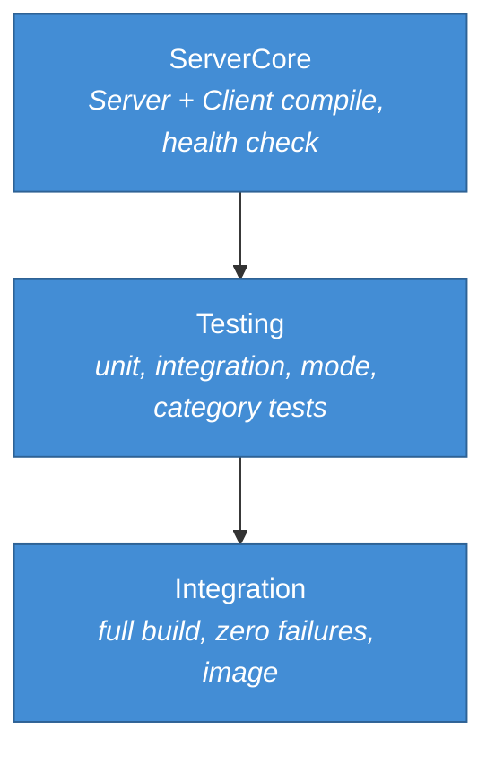

## Traces

```spec
trace RegistryFlow {
    SubmitPassport -> [DppRegistryGate.Server, DppRegistryGate.Client];
    GetPassport -> [DppRegistryGate.Server, DppRegistryGate.Client];
    UpdatePassport -> [DppRegistryGate.Server, DppRegistryGate.Client];
    SearchRegistry -> [DppRegistryGate.Server, DppRegistryGate.Client];
    RegisterCallback -> [DppRegistryGate.Server, DppRegistryGate.Client];
    ResolveQr -> [DppRegistryGate.Server, DppRegistryGate.Client];
    ConfigureMode -> [DppRegistryGate.Server, DppRegistryGate.Client];
    GetRequestLog -> [DppRegistryGate.Server, DppRegistryGate.Client];

    invariant "full coverage":
        all sources have count(targets) >= 1;
    invariant "server always involved":
        all sources have targets contains DppRegistryGate.Server;
}

trace DataModel {
    DppSubmission -> [DppRegistryGate.Server, DppRegistryGate.Client];
    DppPackage -> [DppRegistryGate.Server, DppRegistryGate.Client];
    DppSearchResult -> [DppRegistryGate.Server, DppRegistryGate.Client];
    DppCallback -> [DppRegistryGate.Server, DppRegistryGate.Client];
    RegistryQuery -> [DppRegistryGate.Server, DppRegistryGate.Client];
    DppRegistryGateRequest -> [DppRegistryGate.Server];
    DppRegistryGateResponse -> [DppRegistryGate.Server];
    FaultConfig -> [DppRegistryGate.Server, DppRegistryGate.Client];
    BehaviorMode -> [DppRegistryGate.Server, DppRegistryGate.Client];
    ProductCategory -> [DppRegistryGate.Server, DppRegistryGate.Client];
    SubmissionState -> [DppRegistryGate.Server, DppRegistryGate.Client];
    ValidationSeverity -> [DppRegistryGate.Server, DppRegistryGate.Client];
}
```

## System-Level Constraints

```spec
constraint NoGlobalCorpSubsystemDependency {
    scope: [DppRegistryGate.Server, DppRegistryGate.Client];
    rule: "No references to any APP-* subsystem namespace or
           assembly. DppRegistryGate communicates with Global Corp
           subsystems only at the HTTP boundary.";

    rationale {
        context "DppRegistryGate must remain a general-purpose EU
                 DPP registry test harness, reusable by any project
                 that integrates with the registry under SPR.";
        decision "No compile-time coupling to APP-SD or any other
                  subsystem. The contract is the registry REST shape,
                  not any application type.";
        consequence "DppRegistryGate can be extracted to a separate
                     repository and published as an independent tool.";
    }
}

constraint NullableEnabled {
    scope: all authored components;
    rule: "Nullable reference types are enabled in every project
           file. No suppression operators (!) outside of test setup
           code.";
}

constraint InMemoryOnly {
    scope: [DppRegistryGate.Server];
    rule: "All state (request logs, recorded responses, stored
           passports, registered callbacks, fault config) is held
           in memory. No database, no file system persistence.
           State resets when the server process restarts.";

    rationale {
        context "DppRegistryGate is a test-time tool, not a
                 production service. Persistent state would add
                 complexity without benefit.";
        decision "In-memory collections with no external storage
                  dependencies.";
        consequence "Each test run starts with a clean state.
                     Long-running recording sessions should export
                     logs before stopping the server.";
    }
}

constraint ShapeParity {
    scope: [DppRegistryGate.Server];
    rule: "Request and response JSON shapes for every
           /dpp/v1/* endpoint and for /passports/{qrHash} match the
           EU DPP registry documented API surface under SPR. Field
           names use the registry's published casing.";

    rationale "Shape parity ensures that APP-SD works identically
               against DppRegistryGate and the real registry without
               conditional logic or adapter layers.";
}

constraint TestNaming {
    scope: [DppRegistryGate.Tests];
    rule: "Test methods follow MethodName_Scenario_ExpectedResult
           naming. Test classes mirror the source class name with a
           Tests suffix.";
}
```

## Package Policy

DppRegistryGate inherits the enterprise package policy defined in [global-corp.architecture.spec.md](./global-corp.architecture.spec.md) Section 8.

```spec
package_policy DppRegistryGatePolicy {
    inherits: weakRef<PackagePolicy>(GlobalCorpPolicy);

    rationale "DppRegistryGate is an authored .NET project collection
               under the Global Corp umbrella. It picks up the
               enterprise NuGet allowlists and denylists from
               GlobalCorpPolicy without redeclaring them. Any gate-
               specific package additions would be added here with
               rationale; none are required at this time.";
}
```

## Platform Realization

```spec
dotnet solution DppRegistryGate {
    format: slnx;
    startup: DppRegistryGate.Server;

    folder "src" {
        projects: [DppRegistryGate.Server, DppRegistryGate.Client];
    }

    folder "tests" {
        projects: [DppRegistryGate.Tests];
    }

    rationale {
        context "DppRegistryGate is a small, focused solution with
                 two source projects and one test project, matching
                 the PayGate and SendGate shape.";
        decision "DppRegistryGate.Server is the startup project. It
                  serves the registry-compatible endpoints and the
                  management API on a single configurable port.";
        consequence "Running dotnet run from the Server project
                     starts the test harness. The default port is
                     5216. The Aspire AppHost overrides the port via
                     service binding when running under the Local
                     Simulation Profile.";
    }
}
```

Rendered solution structure:

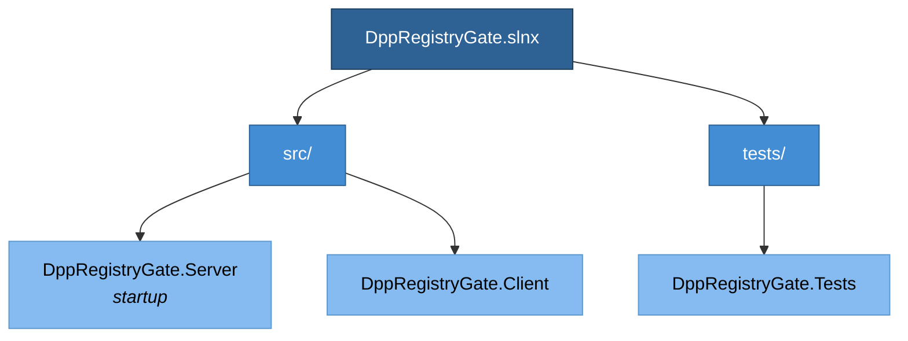

## Deployment

```spec
deployment Development {
    node "Developer Workstation" {
        technology: "Docker Desktop";

        node "DppRegistryGate Container" {
            technology: ".NET 10 SDK";
            image: "globalcorp/dpp-registry-gate:latest";
            instance: DppRegistryGate.Server;
            port: 5216;
        }
    }

    rationale "DppRegistryGate runs as a Docker container on the
               developer workstation. GlobalCorp.AppHost declares
               it as the gate-dpp-registry container resource and
               wires APP-SD's registry client base URL to point at
               http://dpp-registry-gate:5216.";
}

deployment AspireLocalSimulation {
    node "Aspire AppHost" {
        technology: ".NET Aspire 13.2";

        node "gate-dpp-registry Container" {
            technology: ".NET 10 SDK, Docker";
            image: "globalcorp/dpp-registry-gate:latest";
            instance: DppRegistryGate.Server;
            port: 5216;
        }
    }

    rationale {
        context "The Global Corp Platform Local Simulation Profile
                 is driven by GlobalCorp.AppHost. It starts every
                 gate simulator, including DppRegistryGate, as a
                 container resource before starting the APP-*
                 projects.";
        decision "DppRegistryGate is declared as the
                  gate-dpp-registry resource. APP-SD receives the
                  service reference via WithReference; the base URL
                  is injected as an environment variable.";
        consequence "Running dotnet run --project GlobalCorp.AppHost
                     brings up DppRegistryGate alongside the other
                     nine gate simulators and the platform
                     subsystems.";
    }
}

deployment CI {
    node "GitHub Actions Runner" {
        technology: "ubuntu-latest";

        node "gate-dpp-registry Service Container" {
            technology: ".NET 10 SDK, Docker";
            image: "globalcorp/dpp-registry-gate:latest";
            instance: DppRegistryGate.Server;
            port: 5216;
        }
    }

    rationale {
        context "Integration tests in CI need a running
                 DppRegistryGate instance to validate APP-SD DPP
                 submission flows.";
        decision "DppRegistryGate runs as a service container in
                  GitHub Actions. The APP-SD test step sets its
                  registry base URL to the service container's
                  address.";
        consequence "CI tests exercise the same code paths as
                     production without requiring EU DPP registry
                     credentials or network access to the registry.";
    }
}
```

Rendered deployment:

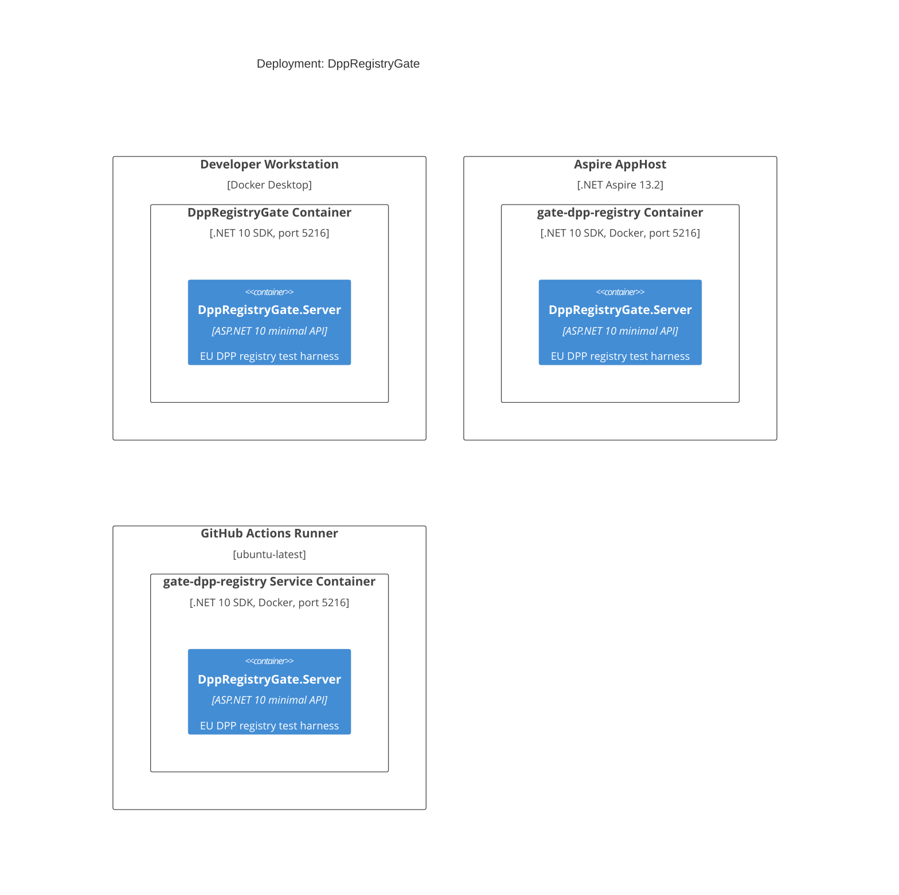

## Views

```spec
view systemContext of DppRegistryGate ContextView {
    include: all;
    autoLayout: top-down;
    description: "DppRegistryGate with its users (Developer, CI
                  Pipeline, Compliance Tester) and external systems
                  (EU DPP Registry, APP-SD, GlobalCorp.AppHost).";
}

view container of DppRegistryGate ContainerView {
    include: all;
    autoLayout: left-right;
    description: "Internal structure showing DppRegistryGate.Server,
                  DppRegistryGate.Client, and DppRegistryGate.Tests
                  with their dependencies.";
}

view deployment of Development DevelopmentDeploymentView {
    include: all;
    autoLayout: top-down;
    description: "Developer workstation running DppRegistryGate as
                  a Docker container alongside other Global Corp
                  services.";
    @tag("dev");
}

view deployment of AspireLocalSimulation AspireDeploymentView {
    include: all;
    autoLayout: top-down;
    description: "Aspire AppHost composition with gate-dpp-registry
                  declared as a container resource.";
    @tag("aspire");
}

view deployment of CI CIDeploymentView {
    include: all;
    autoLayout: top-down;
    description: "GitHub Actions runner with DppRegistryGate as a
                  service container for automated APP-SD integration
                  tests.";
    @tag("ci");
}
```

## Dynamic Scenarios

### Stub Mode: Passport Submission

APP-SD calls DppRegistryGate in Stub mode during APP-SD integration tests. DppRegistryGate returns a preconfigured Validated submission without contacting the EU DPP registry.

```spec
dynamic StubSubmitPassport {
    1: Developer -> DppRegistryGate.Server {
        description: "Configures DppRegistryGate to Stub mode via
                      management API.";
        technology: "REST/HTTPS";
    };
    2: "APP-SD Sustainability and DPP" -> DppRegistryGate.Server {
        description: "POST /dpp/v1/passports with a signed DPP
                      package for an Electronics product.";
        technology: "REST/HTTPS";
    };
    3: DppRegistryGate.Server -> DppRegistryGate.Server
        : "Runs category-specific validation; confirms RoHS and
           WEEE fields are present for Electronics.";
    4: DppRegistryGate.Server -> DppRegistryGate.Server
        : "Generates synthetic DppSubmission with a unique
           registryUri, version 1, state Validated.";
    5: DppRegistryGate.Server -> DppRegistryGate.Server
        : "Logs request and response to in-memory request log.";
    6: DppRegistryGate.Server -> "APP-SD Sustainability and DPP" {
        description: "Returns registry-shaped JSON with the
                      synthetic submission and persistent URI.";
        technology: "REST/HTTPS";
    };
}
```

Rendered interaction sequence:

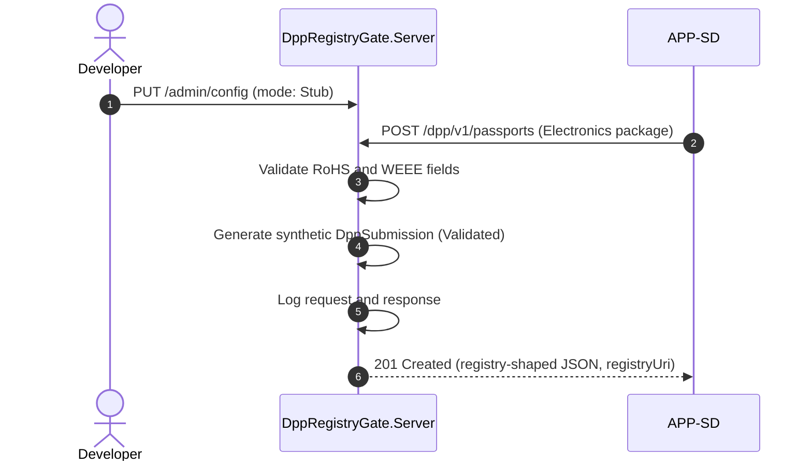

### Record Mode: Passport Submission

DppRegistryGate proxies the request to the real EU DPP registry and records both the request and response for later replay.

```spec
dynamic RecordSubmitPassport {
    1: Developer -> DppRegistryGate.Server {
        description: "Configures DppRegistryGate to Record mode
                      with EU DPP registry credentials and base
                      URL.";
        technology: "REST/HTTPS";
    };
    2: "APP-SD Sustainability and DPP" -> DppRegistryGate.Server {
        description: "POST /dpp/v1/passports with a signed DPP
                      package for a Battery product.";
        technology: "REST/HTTPS";
    };
    3: DppRegistryGate.Server -> EuDppRegistry {
        description: "Forwards the request to the live EU DPP
                      registry with real credentials.";
        technology: "REST/HTTPS";
    };
    4: EuDppRegistry -> DppRegistryGate.Server
        : "Returns the canonical submission response.";
    5: DppRegistryGate.Server -> DppRegistryGate.Server
        : "Records request and response pair keyed by request
           signature and category.";
    6: DppRegistryGate.Server -> "APP-SD Sustainability and DPP" {
        description: "Returns the real registry response
                      unmodified.";
        technology: "REST/HTTPS";
    };
}
```

Rendered interaction sequence:

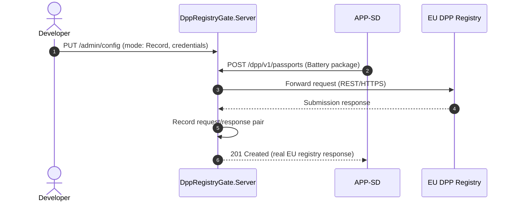

### Replay Mode: Passport Retrieval

DppRegistryGate returns a previously recorded response matched by request signature. No network call to the EU registry occurs.

```spec
dynamic ReplayGetPassport {
    1: Developer -> DppRegistryGate.Server {
        description: "Configures DppRegistryGate to Replay mode.";
        technology: "REST/HTTPS";
    };
    2: "APP-SD Sustainability and DPP" -> DppRegistryGate.Server {
        description: "GET /dpp/v1/passports/{registryUri} for a
                      previously recorded passport.";
        technology: "REST/HTTPS";
    };
    3: DppRegistryGate.Server -> DppRegistryGate.Server
        : "Matches request signature against recorded entries.";
    4: DppRegistryGate.Server -> DppRegistryGate.Server
        : "Logs replay request and the matched response.";
    5: DppRegistryGate.Server -> "APP-SD Sustainability and DPP" {
        description: "Returns the matched recorded passport
                      response.";
        technology: "REST/HTTPS";
    };
}
```

Rendered interaction sequence:

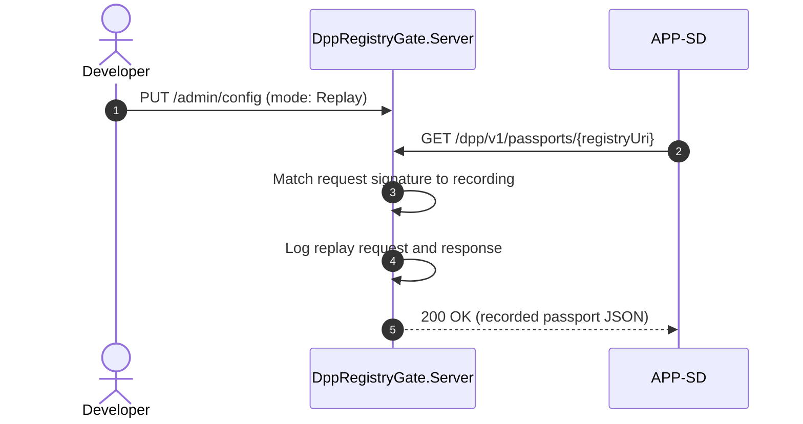

### FaultInject Mode: Category-Specific Validation Failure

DppRegistryGate returns a configurable error response scoped to the Battery category, to test APP-SD failure handling when a submission lacks the carbon footprint field.

```spec
dynamic FaultInjectBatteryCarbonFootprint {
    1: Developer -> DppRegistryGate.Server {
        description: "Configures DppRegistryGate to FaultInject
                      mode with a FaultConfig specifying 422,
                      missing_carbon_footprint, 1000ms delay, and
                      category filter Battery.";
        technology: "REST/HTTPS";
    };
    2: "APP-SD Sustainability and DPP" -> DppRegistryGate.Server {
        description: "POST /dpp/v1/passports with a Battery package
                      that omits the carbon footprint field.";
        technology: "REST/HTTPS";
    };
    3: DppRegistryGate.Server -> DppRegistryGate.Server
        : "Detects category as Battery and matches the
           FaultConfig filter.";
    4: DppRegistryGate.Server -> DppRegistryGate.Server
        : "Waits for the configured delay (1000ms).";
    5: DppRegistryGate.Server -> DppRegistryGate.Server
        : "Logs the request and the fault response.";
    6: DppRegistryGate.Server -> "APP-SD Sustainability and DPP" {
        description: "Returns 422 with registry-shaped error body
                      containing missing_carbon_footprint error
                      type and Error severity.";
        technology: "REST/HTTPS";
    };
}
```

Rendered interaction sequence:

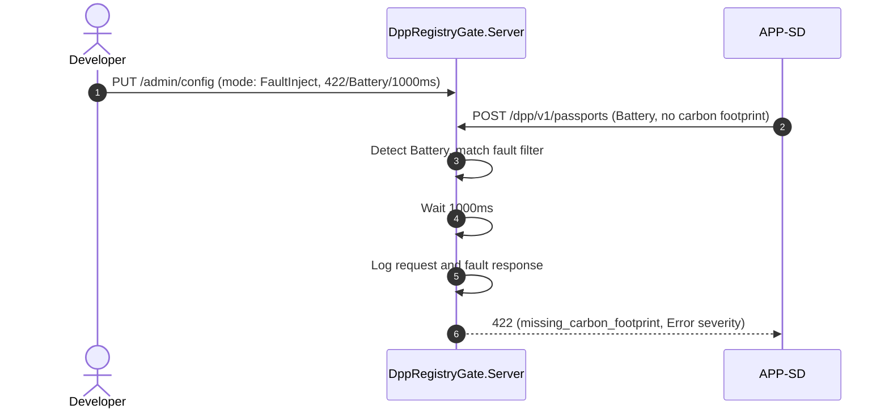

### Stub Mode: Registry Search

A developer or test issues a search query against the stub registry to exercise APP-SD search paths.

```spec
dynamic StubSearchRegistry {
    1: "APP-SD Sustainability and DPP" -> DppRegistryGate.Server {
        description: "GET /dpp/v1/search?q=jacket&category=Textile.";
        technology: "REST/HTTPS";
    };
    2: DppRegistryGate.Server -> DppRegistryGate.Server
        : "Generates a deterministic DppSearchResult set seeded by
           query terms and category.";
    3: DppRegistryGate.Server -> DppRegistryGate.Server
        : "Logs request and response.";
    4: DppRegistryGate.Server -> "APP-SD Sustainability and DPP" {
        description: "Returns registry-shaped JSON array of search
                      results.";
        technology: "REST/HTTPS";
    };
}
```

Rendered interaction sequence:

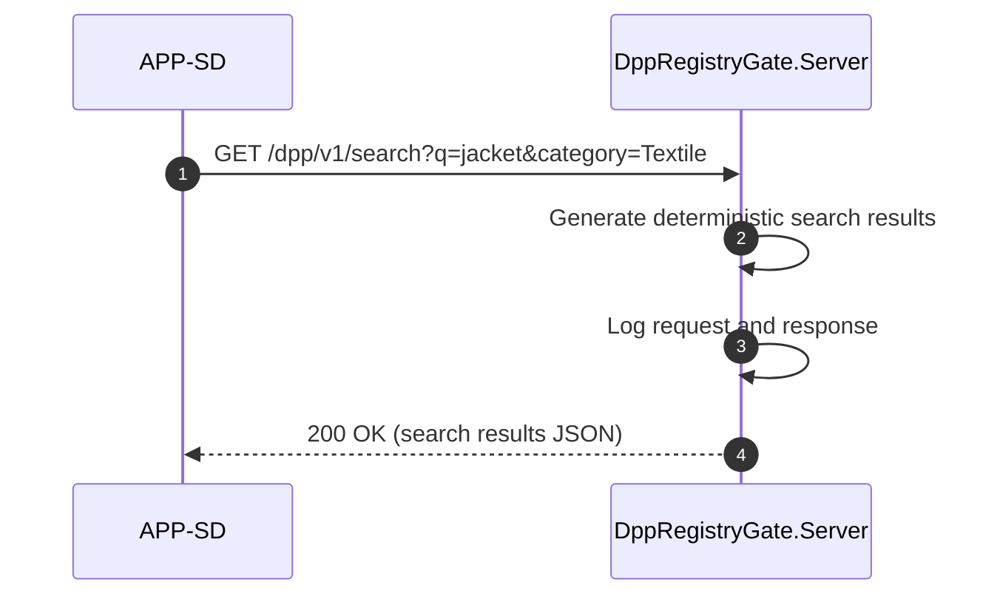

### Stub Mode: QR Resolution

A consumer-app-style client resolves a QR hash to a passport view, exercising the public lookup path.

```spec
dynamic StubResolveQr {
    1: Developer -> DppRegistryGate.Server {
        description: "GET /passports/{qrHash} for a stub QR code.";
        technology: "REST/HTTPS";
    };
    2: DppRegistryGate.Server -> DppRegistryGate.Server
        : "Resolves qrHash to a stored registryUri, falling back
           to a synthetic passport in Stub mode.";
    3: DppRegistryGate.Server -> DppRegistryGate.Server
        : "Logs request and response.";
    4: DppRegistryGate.Server -> Developer {
        description: "Returns minimal public passport view.";
        technology: "REST/HTTPS";
    };
}
```

Rendered interaction sequence:

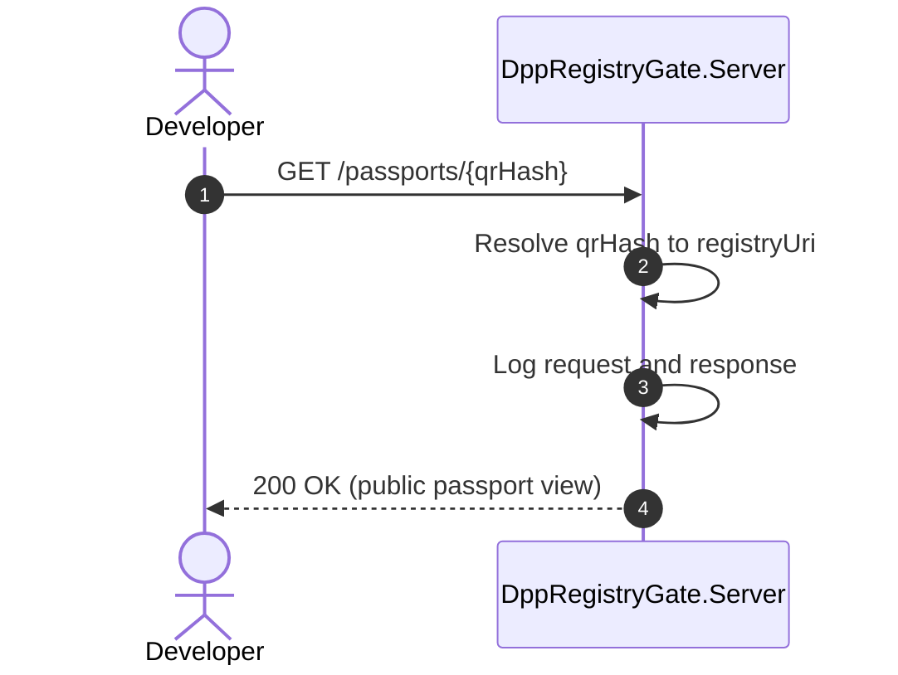

### Request Log Inspection

A developer or test assertion retrieves the captured request log to verify that APP-SD made the expected calls.

```spec
dynamic InspectRequestLog {
    1: Developer -> DppRegistryGate.Server {
        description: "GET /admin/requests to retrieve the request
                      log, optionally filtered by category or path.";
        technology: "REST/HTTPS";
    };
    2: DppRegistryGate.Server -> DppRegistryGate.Server
        : "Collects all DppRegistryGateRequest and
           DppRegistryGateResponse pairs matching the filter.";
    3: DppRegistryGate.Server -> Developer {
        description: "Returns JSON array of request and response
                      log entries.";
        technology: "REST/HTTPS";
    };
}
```

Rendered interaction sequence:

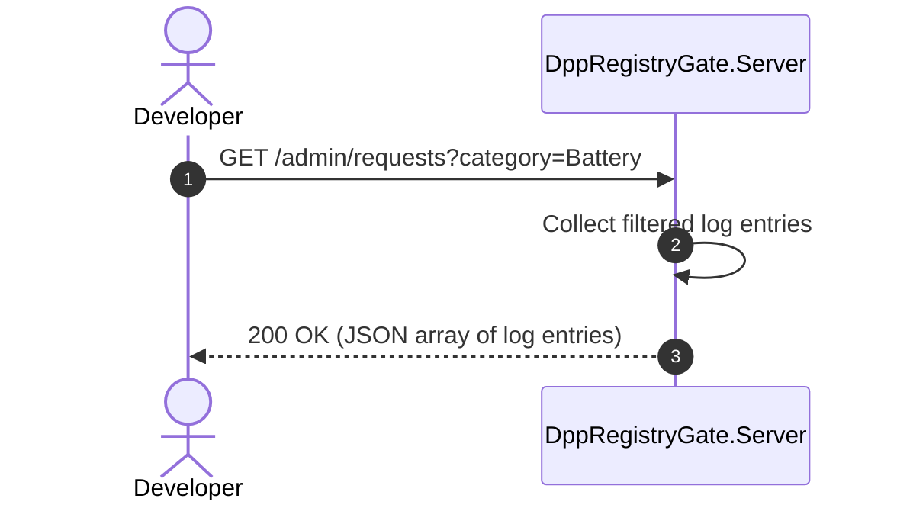

## Open Items

- Confirm the exact EU DPP registry URI scheme for persistent registryUri values; Stub mode currently uses a `urn:dpp:` prefix that needs alignment when Record mode captures the first live response.
- Decide whether category-specific validation quirks run in Replay mode, or whether Replay always returns the recorded status regardless of current validation rules. The current decision favors replaying recorded status unchanged.
- Determine whether acknowledgment callbacks should be invoked by the gate in Stub mode (currently they are registered but never called), or whether a new `Invoke` admin action should trigger them on demand for callback tests.
- Align the QR hash generation algorithm in Stub mode with the production scheme once the SPR specification is finalized.
- Confirm the search result ranking used in Stub mode does not mislead consumers of the gate into assuming the production registry uses the same ordering.
