# FsmaGate -- System Specification

## Tracking

| Field | Value |
|---|---|
| slug | fsma-gate |
| itemType | SystemSpec |
| name | FsmaGate |
| shortDescription | FDA FSMA 204 reporting portal test harness consumed by APP-CC. Mimics Critical Tracking Event, Key Data Element, traceability lot, recall, and receipt endpoints. |
| version | 1 |
| specLangVersion | 0.1.0 |
| publishStatus | Draft |
| retentionPolicy | indefinite |
| freshnessSla | P90D |
| lastReviewed | 2026-04-18 |
| authors | [PER-01 Lena Brandt] |
| reviewers | [PER-17 Isabelle Laurent] |
| committer | PER-01 Lena Brandt |
| tags | [gate, simulator, fsma, fda, traceability, recall, app-cc] |
| createdAt | 2026-04-18T00:00:00Z |
| updatedAt | 2026-04-18T00:00:00Z |
| Dependencies | [global-corp.architecture.spec.md](global-corp.architecture.spec.md) |
| State | Draft |
| Reviewed | |
| Approved | |
| Executed | |
| Verified | |

This specification describes FsmaGate, a test harness that mimics the FDA
Food Safety Modernization Act section 204 (FSMA 204) reporting portal used
by the Global Corp Cross-border Compliance subsystem (APP-CC). FsmaGate
inherits the PayGate pattern: it is an HTTP-level simulator built as an
ASP.NET 10 minimal API, and it supports four behavior modes (Stub, Record,
Replay, FaultInject), an in-memory request log, a Docker image, and a
typed .NET client library.

FsmaGate mimics the REST surface that APP-CC uses to report Critical
Tracking Events (CTEs), Key Data Elements (KDEs), traceability lot codes,
and recall notices for covered foods on the FDA Food Traceability List.
APP-CC points at FsmaGate instead of the live FSMA reporting portal in
test and development environments, so the traceability and recall code
paths can be exercised end-to-end without requiring FDA portal
credentials or network access to FDA infrastructure.

The gate is consumed by APP-CC through its Aspire AppHost. The AppHost
starts the FsmaGate container alongside APP-CC's other dependencies
(PayGate, SendGate, CustomsGate, PostgreSQL) and wires APP-CC's typed
FSMA client to the gate's base URL. This matches the deployment pattern
already established by PayGate and SendGate.

## Context

```spec
person Developer {
    description: "A developer running APP-CC integration tests or working
                  locally against an FSMA stub instead of the live FDA
                  reporting portal.";
    @tag("internal", "test");
}

person CIPipeline {
    description: "Automated CI/CD pipeline that runs APP-CC integration
                  tests against FsmaGate to validate FSMA 204 traceability
                  flows without touching the real FDA portal.";
    @tag("automation", "test");
}

external system FdaFsmaPortal {
    description: "FDA FSMA 204 reporting portal. FsmaGate proxies to the
                  portal in Record mode and mimics its REST surface in
                  all other modes.";
    technology: "REST/HTTPS";
    @tag("traceability", "external", "regulator");
}

external system AppCc {
    description: "The Global Corp Cross-border Compliance subsystem that
                  normally calls the FDA FSMA 204 reporting portal. In
                  test configuration it calls FsmaGate at the same REST
                  endpoints through a typed client.";
    technology: "REST/HTTPS";
    @tag("consumer", "external", "global-corp");
}

Developer -> FsmaGate : "Configures behavior mode and inspects request logs.";

CIPipeline -> FsmaGate : "Runs automated traceability and recall tests.";

AppCc -> FsmaGate {
    description: "Sends CTE, KDE, TLC, recall, receipt, and bulk
                  submission requests to FsmaGate instead of the live
                  FDA portal.";
    technology: "REST/HTTPS";
}

FsmaGate -> FdaFsmaPortal {
    description: "Proxies requests to the real FDA portal in Record mode
                  only.";
    technology: "REST/HTTPS";
}
```

Rendered system context:

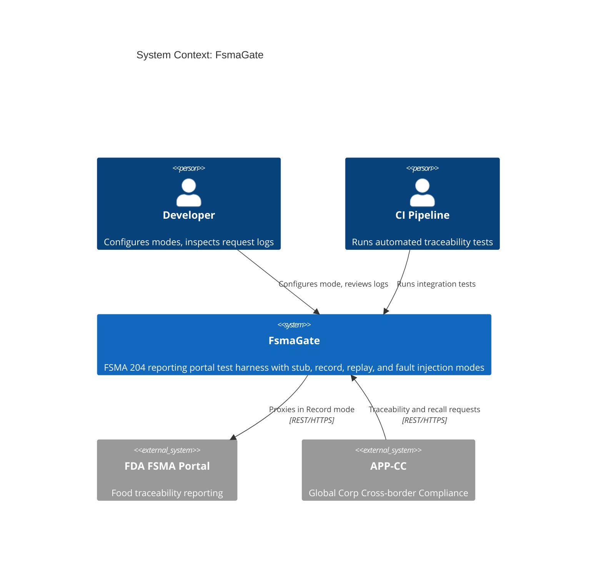

## System Declaration

```spec
system FsmaGate {
    target: "net10.0";
    responsibility: "HTTP-level test harness that mimics the FDA FSMA 204
                     reporting portal surface. Supports four behavior modes:
                     Stub, Record, Replay, and FaultInject. Allows APP-CC
                     to validate traceability and recall flows without
                     calling the real FDA portal.";

    authored component FsmaGate.Server {
        kind: "api-host";
        path: "src/FsmaGate.Server";
        status: new;
        responsibility: "ASP.NET 10 minimal API that exposes FSMA-compatible
                         REST endpoints for Critical Tracking Events, Key
                         Data Elements, traceability lot codes, recalls,
                         receipt queries, and bulk submissions. Routes
                         incoming requests through the active behavior mode
                         and captures inbound evidence bundles.";
        contract {
            guarantees "Exposes POST /fsma/cte, POST /fsma/kde, POST
                        /fsma/tlc, POST /fsma/recall, GET
                        /fsma/receipts/{submissionId}, and POST /fsma/bulk
                        with request and response shapes that match the
                        FDA FSMA 204 public surface.";
            guarantees "Behavior mode is switchable at runtime via the
                        management API without restarting the server.";
            guarantees "All incoming requests and outgoing responses are
                        captured in an in-memory log accessible via the
                        management API.";
            guarantees "CTE and KDE submissions validate shape-level
                        cross-references (a KDE must reference a known
                        TLC in Stub mode) and return FSMA-specific
                        errors when references are missing.";
        }
    }

    authored component FsmaGate.Client {
        kind: library;
        path: "src/FsmaGate.Client";
        status: new;
        responsibility: "A typed .NET client library that matches the FSMA
                         client shape used by APP-CC. APP-CC can swap its
                         live FSMA client for FsmaGate.Client through
                         dependency injection without changing calling
                         code.";
        contract {
            guarantees "Public API surface mirrors the FSMA client methods
                        used by APP-CC: SubmitCte, SubmitKde, RegisterTlc,
                        SubmitRecall, GetReceipt, SubmitBulk.";
            guarantees "Targets FsmaGate.Server by default. The base URL
                        is configurable through options.";
        }

        rationale {
            context "APP-CC calls the FDA FSMA portal through a typed
                     client abstraction. Swapping the base URL alone is
                     insufficient because test code also needs mode
                     configuration, bulk-submission helpers, and log
                     inspection methods.";
            decision "A dedicated client library wraps both the FSMA-
                      compatible endpoints and the FsmaGate management
                      endpoints in a single package.";
            consequence "APP-CC test projects reference FsmaGate.Client
                         and register it in DI. Production code
                         continues to use the live FSMA client.";
        }
    }

    authored component FsmaGate.Tests {
        kind: tests;
        path: "tests/FsmaGate.Tests";
        status: new;
        responsibility: "Integration and unit tests for FsmaGate.Server
                         and FsmaGate.Client. Verifies each behavior mode,
                         request logging, fault injection, FSMA-specific
                         validation errors, and client parity with APP-CC's
                         expected FSMA surface.";
    }

    consumed component xunit {
        source: nuget("xunit");
        version: "2.*";
        responsibility: "Unit and integration testing framework.";
        used_by: [FsmaGate.Tests];
    }

    consumed component TestHost {
        source: nuget("Microsoft.AspNetCore.Mvc.Testing");
        version: "10.*";
        responsibility: "In-process test server for integration testing
                         ASP.NET minimal API endpoints.";
        used_by: [FsmaGate.Tests];
    }

    consumed component SystemNetHttpJson {
        source: nuget("System.Net.Http.Json");
        version: "10.*";
        responsibility: "Typed JSON serialization over HttpClient for the
                         client library.";
        used_by: [FsmaGate.Client];
    }

    consumed component SystemIoCompression {
        source: nuget("System.IO.Compression");
        version: "10.*";
        responsibility: "ZIP archive handling for the bulk submission
                         endpoint and evidence bundle ingestion.";
        used_by: [FsmaGate.Server];
    }
}
```

## Data Specification

### Enums

```spec
enum BehaviorMode {
    Stub: "Returns preconfigured static responses for all endpoints",
    Record: "Proxies requests to the real FDA FSMA portal and records both request and response",
    Replay: "Returns previously recorded responses matched by request signature",
    FaultInject: "Returns configurable error responses to test failure handling"
}

enum CteType {
    Harvesting: "Harvesting event for a covered food",
    Cooling: "Cooling event applied to harvested produce",
    InitialPacking: "Initial packing event for raw agricultural commodities",
    Shipping: "Shipping event moving product between trading partners",
    Receiving: "Receiving event at a downstream trading partner location",
    Transformation: "Transformation event that produces a new traceability lot"
}

enum RecallClass {
    Class_I: "Reasonable probability that use of the product will cause serious adverse health consequences or death",
    Class_II: "Use of the product may cause temporary or medically reversible adverse health consequences",
    Class_III: "Use of the product is not likely to cause adverse health consequences"
}

enum SubmissionKind {
    Cte: "Critical Tracking Event submission",
    Kde: "Key Data Element submission",
    Tlc: "Traceability Lot Code registration",
    Recall: "Recall notice submission",
    Bulk: "Bulk submission containing multiple records"
}
```

### Entities

The data model captures both the FSMA-compatible domain objects and the
internal recording and configuration state.

```spec
entity CriticalTrackingEvent {
    id: string;
    cteType: CteType;
    tlc: string;
    shippingDate: string?;
    receivingDate: string?;
    quantity: int @range(1..99999999);
    unit: string;
    commodity: string;
    locations: string;

    invariant "id required": id != "";
    invariant "tlc required": tlc != "";
    invariant "positive quantity": quantity > 0;
    invariant "unit required": unit != "";
    invariant "commodity required": commodity != "";
    invariant "locations required": locations != "";

    rationale "shippingDate and receivingDate" {
        context "Different CTE types require different date fields. A
                 Shipping event needs a shippingDate; a Receiving event
                 needs a receivingDate. Transformation events may need
                 neither.";
        decision "Both date fields are optional at the entity level. The
                  simulator validates presence rules per CteType in Stub
                  mode.";
        consequence "Tests can submit malformed CTEs (for example a
                     Shipping CTE missing its shippingDate) and assert
                     that FsmaGate returns the corresponding FSMA error.";
    }
}

entity KeyDataElement {
    id: string;
    tlc: string;
    kdeName: string;
    kdeValue: string;
    recordedAt: string;

    invariant "id required": id != "";
    invariant "tlc reference": tlc != "";
    invariant "kde name required": kdeName != "";
    invariant "kde value required": kdeValue != "";
    invariant "recorded at required": recordedAt != "";
}

entity TraceabilityLotCode {
    tlc: string;
    assignedBy: string;
    commodity: string;
    firstReceiverLocation: string;
    assignedAt: string;

    invariant "tlc required": tlc != "";
    invariant "assigned by required": assignedBy != "";
    invariant "commodity required": commodity != "";
    invariant "first receiver location required": firstReceiverLocation != "";
    invariant "assigned at required": assignedAt != "";

    rationale "firstReceiverLocation" {
        context "FSMA 204 requires the first receiver to assign the TLC
                 for most commodities. Tracking the first receiver
                 location lets downstream trading partners verify
                 lot provenance.";
        decision "TraceabilityLotCode carries firstReceiverLocation as a
                  required field.";
        consequence "APP-CC code that looks up first receiver locations
                     works identically against FsmaGate and the real FDA
                     portal.";
    }
}

entity Recall {
    id: string;
    classification: RecallClass;
    productsAffected: string;
    distributionDates: string;
    reason: string;
    recallInitiator: string;

    invariant "id required": id != "";
    invariant "products affected required": productsAffected != "";
    invariant "distribution dates required": distributionDates != "";
    invariant "reason required": reason != "";
    invariant "recall initiator required": recallInitiator != "";
}

entity BulkSubmission {
    id: string;
    contentHash: string;
    recordCount: int @range(1..99999);
    submittedAt: string;
    bundleKind: string;

    invariant "id required": id != "";
    invariant "content hash required": contentHash != "";
    invariant "positive record count": recordCount > 0;
    invariant "submitted at required": submittedAt != "";
    invariant "bundle kind required": bundleKind != "";

    rationale "bundleKind" {
        context "The bulk endpoint accepts either a ZIP archive of
                 individual records or a signed evidence bundle that
                 Global Corp uses for tamper-evident traceability
                 exports. The simulator must distinguish the two.";
        decision "BulkSubmission carries a bundleKind string whose
                  allowed values are 'zip' and 'signed-evidence'.";
        consequence "Tests can verify that APP-CC sends the correct
                     bundle kind for each submission scenario.";
    }
}

entity FsmaReceipt {
    submissionId: string;
    kind: SubmissionKind;
    accepted: bool;
    issuedAt: string;
    errors: string?;

    invariant "submission id required": submissionId != "";
    invariant "issued at required": issuedAt != "";
}

entity FsmaGateRequest {
    id: string;
    timestamp: string;
    method: string;
    path: string;
    submissionKind: SubmissionKind?;
    body: string?;
    headers: string?;

    invariant "id required": id != "";
    invariant "path required": path != "";
}

entity FsmaGateResponse {
    id: string;
    requestId: string;
    statusCode: int @range(100..599);
    body: string?;
    latencyMs: int;

    invariant "id required": id != "";
    invariant "request reference": requestId != "";
    invariant "valid status code": statusCode >= 100;
}

entity FaultConfig {
    statusCode: int @range(400..599) @default(500);
    errorCode: string @default("fsma_error");
    errorMessage: string @default("Simulated FsmaGate fault");
    delayMs: int @range(0..30000) @default(0);

    invariant "error status code": statusCode >= 400;
    invariant "non-negative delay": delayMs >= 0;

    rationale "delayMs" {
        context "Testing timeout handling requires the ability to simulate
                 slow responses from the FDA FSMA portal, which can be
                 slow during peak reporting periods.";
        decision "FaultConfig includes a configurable delay in
                 milliseconds applied before returning the error.";
        consequence "APP-CC timeout and retry logic can be validated by
                     setting delayMs to values above the client timeout
                     threshold.";
    }
}
```

## Contracts

### FSMA-Compatible Endpoints

These contracts define the API surface that mirrors the FDA FSMA 204
reporting portal.

```spec
contract SubmitCte {
    requires cte.tlc != "";
    requires cte.quantity > 0;
    requires cte.commodity != "";
    ensures receipt.submissionId != "";
    ensures receipt.kind == Cte;
    guarantees "In Stub mode, returns a synthetic receipt and validates
                that a CTE references a registered TLC. If the TLC is
                unknown the gate returns an FSMA missing_tlc error. In
                Record mode, proxies to the real FDA portal and records
                both request and response. In Replay mode, returns the
                recorded response matching the request signature. In
                FaultInject mode, returns the configured error response
                after the configured delay.";
}

contract SubmitKde {
    requires kde.tlc != "";
    requires kde.kdeName != "";
    requires kde.kdeValue != "";
    requires kde.recordedAt != "";
    ensures receipt.submissionId != "";
    ensures receipt.kind == Kde;
    guarantees "Validates that a KDE references a registered TLC and that
                its recordedAt timestamp is not older than a configurable
                staleness threshold. If the timestamp is stale, the gate
                returns an FSMA stale_kde error. Mode behavior follows
                the same pattern as SubmitCte.";
}

contract RegisterTlc {
    requires tlc.tlc != "";
    requires tlc.assignedBy != "";
    requires tlc.commodity != "";
    requires tlc.firstReceiverLocation != "";
    ensures receipt.submissionId != "";
    ensures receipt.kind == Tlc;
    guarantees "Registers a traceability lot code. In Stub and Replay
                modes the gate rejects duplicate TLC assignments by the
                same firstReceiverLocation with an FSMA mismatched_lot
                error. Mode behavior otherwise follows the same pattern
                as SubmitCte.";
}

contract SubmitRecall {
    requires recall.productsAffected != "";
    requires recall.distributionDates != "";
    requires recall.reason != "";
    requires recall.classification in [Class_I, Class_II, Class_III];
    ensures receipt.submissionId != "";
    ensures receipt.kind == Recall;
    guarantees "Submits a recall notice with classification I, II, or III.
                The receipt carries the classification in its body so
                APP-CC can correlate downstream recall communication.
                Mode behavior follows the same pattern as SubmitCte.";
}

contract GetReceipt {
    requires submissionId != "";
    ensures receipt.submissionId == submissionId;
    guarantees "Returns the receipt for a previous submission. In Stub
                mode, the gate retrieves receipts from its in-memory
                store. In Replay mode, it returns the recorded receipt
                for the matching submission identifier. In FaultInject
                mode, it returns the configured fault.";
}

contract SubmitBulk {
    requires bundle.bundleKind in ["zip", "signed-evidence"];
    requires bundle.recordCount > 0;
    ensures receipt.submissionId != "";
    ensures receipt.kind == Bulk;
    guarantees "Accepts a ZIP archive or a signed evidence bundle
                containing multiple CTE, KDE, TLC, or recall records.
                The gate computes a content hash, stores the bundle in
                memory, and returns a single receipt covering the entire
                submission. Individual record errors are reported in the
                receipt's errors field.";
}
```

### Management Endpoints

These contracts define the FsmaGate-specific configuration and inspection
API.

```spec
contract ConfigureMode {
    requires mode in [Stub, Record, Replay, FaultInject];
    ensures activeMode == mode;
    guarantees "Switches the server behavior mode at runtime. When
                switching to FaultInject, an optional FaultConfig payload
                configures the error response. When switching to Record,
                FDA portal credentials must be provided.";
}

contract GetRequestLog {
    ensures count(entries) >= 0;
    guarantees "Returns all captured FsmaGateRequest and FsmaGateResponse
                pairs in chronological order. Supports optional filtering
                by path, submission kind, and time range. Log entries
                persist for the lifetime of the server process.";
}
```

## Topology

```spec
topology Dependencies {
    allow FsmaGate.Server -> FsmaGate.Client;
    allow FsmaGate.Tests -> FsmaGate.Server;
    allow FsmaGate.Tests -> FsmaGate.Client;

    deny FsmaGate.Client -> FsmaGate.Tests;
    deny FsmaGate.Server -> FsmaGate.Tests;

    invariant "server has no Global Corp subsystem dependency":
        FsmaGate.Server does not reference AppCc
        and does not reference any other Global Corp subsystem assembly;

    rationale {
        context "FsmaGate is a standalone test harness. It must not
                 depend on APP-CC or any other Global Corp subsystem so
                 it can be reused, versioned, and released independently.";
        decision "FsmaGate.Server exposes FSMA-compatible REST endpoints.
                  APP-CC points to FsmaGate's URL in test configuration.
                  No compile-time dependency exists between the two
                  systems.";
        consequence "FsmaGate can be versioned and released independently.
                     Other projects that integrate with the FDA FSMA 204
                     portal can adopt it by configuring their FSMA client
                     base URL to point at FsmaGate.";
    }
}
```

Rendered topology:

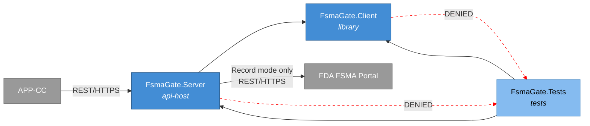

## Phases

```spec
phase ServerCore {
    produces: [FsmaGate.Server, FsmaGate.Client];

    gate ServerCompile {
        command: "dotnet build src/FsmaGate.Server";
        expects: "zero errors";
    }

    gate ClientCompile {
        command: "dotnet build src/FsmaGate.Client";
        expects: "zero errors";
    }

    gate HealthCheck {
        command: "curl -f http://localhost:5215/health";
        expects: "exit_code == 0";
    }
}

phase Testing {
    requires: ServerCore;
    produces: [FsmaGate.Tests];

    gate UnitTests {
        command: "dotnet test tests/FsmaGate.Tests --filter Category=Unit";
        expects: "all tests pass", pass >= 12;
    }

    gate IntegrationTests {
        command: "dotnet test tests/FsmaGate.Tests --filter Category=Integration";
        expects: "all tests pass", pass >= 10;
    }

    gate ModeTests {
        command: "dotnet test tests/FsmaGate.Tests --filter Category=Mode";
        expects: "all tests pass", pass >= 4;
        rationale "One test per behavior mode confirms that mode
                   switching and mode-specific response logic work
                   correctly across CTE, KDE, TLC, recall, and bulk
                   submission flows.";
    }

    gate FsmaValidationTests {
        command: "dotnet test tests/FsmaGate.Tests --filter Category=Validation";
        expects: "all tests pass", pass >= 3;
        rationale "Missing TLC, mismatched lot, and stale KDE timestamp
                   errors are first-class FSMA scenarios and deserve
                   their own gate.";
    }
}

phase Integration {
    requires: Testing;

    gate FullBuild {
        command: "dotnet build FsmaGate.slnx";
        expects: "zero errors";
    }

    gate AllTests {
        command: "dotnet test FsmaGate.slnx";
        expects: "all tests pass", fail == 0;
    }

    rationale "Final gate confirms the complete solution builds and all
               tests pass before the spec can advance to Verified.";
}
```

Rendered phase ordering:

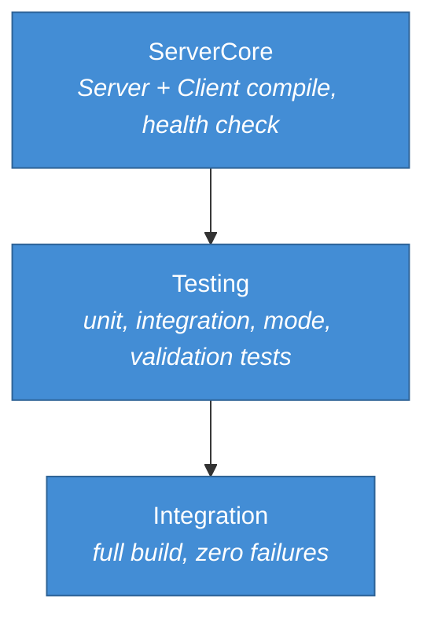

## Traces

```spec
trace FsmaFlow {
    SubmitCte -> [FsmaGate.Server, FsmaGate.Client];
    SubmitKde -> [FsmaGate.Server, FsmaGate.Client];
    RegisterTlc -> [FsmaGate.Server, FsmaGate.Client];
    SubmitRecall -> [FsmaGate.Server, FsmaGate.Client];
    GetReceipt -> [FsmaGate.Server, FsmaGate.Client];
    SubmitBulk -> [FsmaGate.Server, FsmaGate.Client];
    ConfigureMode -> [FsmaGate.Server, FsmaGate.Client];
    GetRequestLog -> [FsmaGate.Server, FsmaGate.Client];

    invariant "full coverage":
        all sources have count(targets) >= 1;
    invariant "server always involved":
        all sources have targets contains FsmaGate.Server;
}

trace DataModel {
    CriticalTrackingEvent -> [FsmaGate.Server, FsmaGate.Client];
    KeyDataElement -> [FsmaGate.Server, FsmaGate.Client];
    TraceabilityLotCode -> [FsmaGate.Server, FsmaGate.Client];
    Recall -> [FsmaGate.Server, FsmaGate.Client];
    BulkSubmission -> [FsmaGate.Server, FsmaGate.Client];
    FsmaReceipt -> [FsmaGate.Server, FsmaGate.Client];
    FsmaGateRequest -> [FsmaGate.Server];
    FsmaGateResponse -> [FsmaGate.Server];
    FaultConfig -> [FsmaGate.Server, FsmaGate.Client];
    BehaviorMode -> [FsmaGate.Server, FsmaGate.Client];
    CteType -> [FsmaGate.Server, FsmaGate.Client];
    RecallClass -> [FsmaGate.Server, FsmaGate.Client];
    SubmissionKind -> [FsmaGate.Server, FsmaGate.Client];
}
```

## System-Level Constraints

```spec
constraint NoGlobalCorpSubsystemDependency {
    scope: [FsmaGate.Server, FsmaGate.Client];
    rule: "No references to any Global Corp subsystem namespace or
           assembly (APP-CC, APP-FX, APP-SCM, and so on). FsmaGate
           communicates with APP-CC only at the HTTP boundary.";

    rationale {
        context "FsmaGate must remain a general-purpose FSMA test
                 harness, reusable by any Global Corp subsystem or
                 unrelated project that integrates with the FDA FSMA
                 204 portal.";
        decision "No compile-time coupling to Global Corp subsystems.
                  The contract is the FSMA REST API shape, not any
                  application type.";
        consequence "FsmaGate can be extracted to a separate repository
                     and published as an independent tool.";
    }
}

constraint NullableEnabled {
    scope: all authored components;
    rule: "Nullable reference types are enabled in every project file.
           No suppression operators (!) outside of test setup code.";
}

constraint InMemoryOnly {
    scope: [FsmaGate.Server];
    rule: "All state (request logs, recorded responses, fault config,
           registered TLCs, captured bulk bundles) is held in memory.
           No database, no file system persistence. State resets when
           the server process restarts.";

    rationale {
        context "FsmaGate is a test-time tool, not a production service.
                 Persistent state would add complexity without benefit
                 and would risk leaking cross-test data.";
        decision "In-memory collections with no external storage
                  dependencies. ZIP bundles are parsed in memory and
                  retained as byte arrays for the process lifetime.";
        consequence "Each test run starts with a clean state. Long-
                     running recording sessions should export logs via
                     the management API before stopping the server.";
    }
}

constraint ShapeParity {
    scope: [FsmaGate.Server];
    rule: "Request and response JSON shapes for the FSMA endpoints must
           match the FDA FSMA 204 portal's documented public surface.
           Field naming follows the FDA convention (camelCase). Error
           bodies carry an errorCode and errorMessage pair matching the
           FDA's published error catalogue.";

    rationale "Shape parity ensures that APP-CC code works identically
               against FsmaGate and the real FDA portal without
               conditional logic or adapter layers.";
}

constraint TestNaming {
    scope: [FsmaGate.Tests];
    rule: "Test methods follow MethodName_Scenario_ExpectedResult naming.
           Test classes mirror the source class name with a Tests suffix.";
}
```

## Package Policy

FsmaGate inherits the package policy from the Global Corp platform
architecture specification.

```spec
package_policy FsmaGatePolicy {
    inherit weakRef<PackagePolicy>(GlobalCorpPolicy)
        from "global-corp.architecture.spec.md" section 8;
}
```

See [global-corp.architecture.spec.md](global-corp.architecture.spec.md)
Section 8 for the inherited package rules. No gate-specific overrides are
declared.

## Platform Realization

```spec
dotnet solution FsmaGate {
    format: slnx;
    startup: FsmaGate.Server;

    folder "src" {
        projects: [FsmaGate.Server, FsmaGate.Client];
    }

    folder "tests" {
        projects: [FsmaGate.Tests];
    }

    rationale {
        context "FsmaGate is a small, focused solution with two source
                 projects and one test project, mirroring the PayGate
                 and SendGate layouts.";
        decision "FsmaGate.Server is the startup project. It serves the
                  FSMA-compatible endpoints and the management API on a
                  single configurable port.";
        consequence "Running dotnet run from the Server project starts the
                     test harness. The default port is 5215.";
    }
}
```

Rendered solution structure:

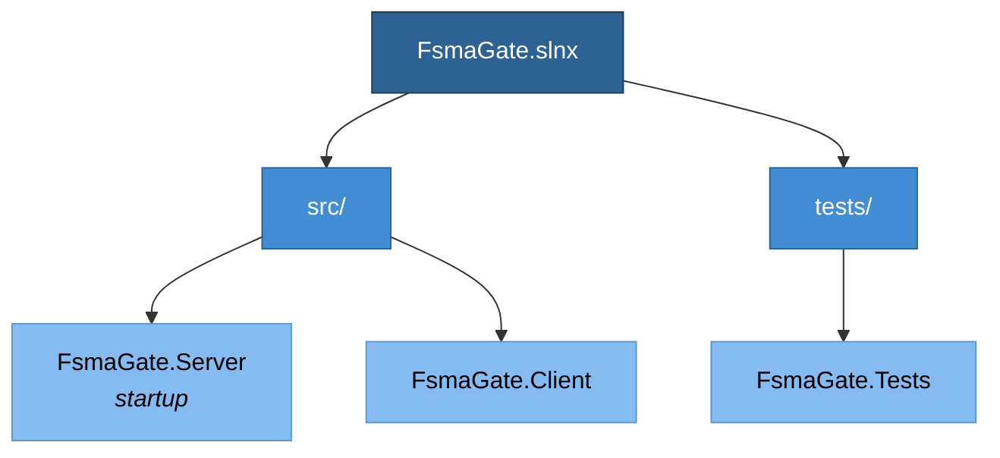

## Deployment

```spec
deployment Development {
    node "Developer Workstation" {
        technology: "Docker Desktop via Aspire AppHost";

        node "FsmaGate Container" {
            technology: ".NET 10 SDK";
            image: "globalcorp/fsma-gate:latest";
            instance: FsmaGate.Server;
            port: 5215;
        }
    }

    rationale "FsmaGate runs as a Docker container on the developer
               workstation, started by APP-CC's Aspire AppHost alongside
               PayGate, SendGate, CustomsGate, PostgreSQL, and other
               APP-CC dependencies. APP-CC's FSMA client base URL
               environment variable points to http://fsma-gate:5215.";
}

deployment CI {
    node "GitHub Actions Runner" {
        technology: "ubuntu-latest";

        node "FsmaGate Service Container" {
            technology: ".NET 10 SDK, Docker";
            image: "globalcorp/fsma-gate:latest";
            instance: FsmaGate.Server;
            port: 5215;
        }
    }

    rationale {
        context "APP-CC integration tests in CI need a running FsmaGate
                 instance to validate traceability and recall flows
                 without FDA portal credentials.";
        decision "FsmaGate runs as a service container in GitHub Actions,
                  started by the APP-CC Aspire AppHost. The APP-CC test
                  step sets the FSMA base URL to the service container's
                  address.";
        consequence "CI tests exercise the same code paths as production
                     without requiring FDA portal credentials or network
                     access to FDA servers.";
    }
}
```

Rendered deployment:

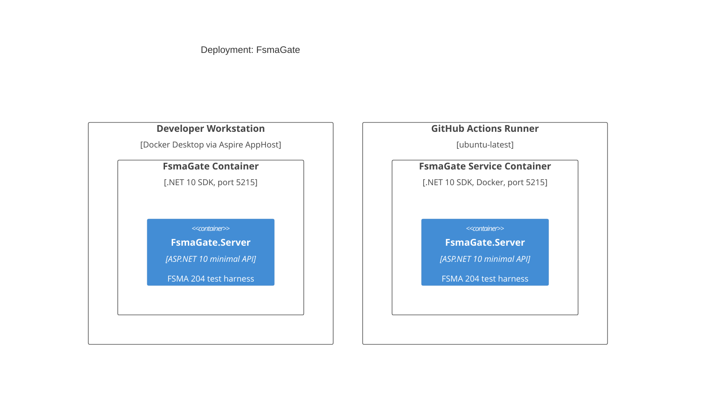

## Views

```spec
view systemContext of FsmaGate ContextView {
    include: all;
    autoLayout: top-down;
    description: "FsmaGate with its users (Developer, CI Pipeline) and
                  external systems (FDA FSMA Portal, APP-CC).";
}

view container of FsmaGate ContainerView {
    include: all;
    autoLayout: left-right;
    description: "Internal structure showing FsmaGate.Server,
                  FsmaGate.Client, and FsmaGate.Tests with their
                  dependencies.";
}

view deployment of Development DevelopmentDeploymentView {
    include: all;
    autoLayout: top-down;
    description: "Developer workstation running FsmaGate as a Docker
                  container under the APP-CC Aspire AppHost.";
    @tag("dev");
}

view deployment of CI CIDeploymentView {
    include: all;
    autoLayout: top-down;
    description: "GitHub Actions runner with FsmaGate as a service
                  container for automated integration tests.";
    @tag("ci");
}
```

## Dynamic Scenarios

### Stub Mode: CTE Submission

APP-CC submits a shipping Critical Tracking Event through FsmaGate in
Stub mode during unit-level integration tests. FsmaGate validates the
TLC reference, returns a synthetic receipt, and records the request
without contacting the FDA portal.

```spec
dynamic StubCteSubmission {
    1: Developer -> FsmaGate.Server {
        description: "Configures FsmaGate to Stub mode via management
                      API.";
        technology: "REST/HTTPS";
    };
    2: AppCc -> FsmaGate.Server {
        description: "POST /fsma/tlc to register the traceability lot
                      code referenced by the upcoming CTE.";
        technology: "REST/HTTPS";
    };
    3: AppCc -> FsmaGate.Server {
        description: "POST /fsma/cte with a Shipping CTE referencing the
                      registered TLC.";
        technology: "REST/HTTPS";
    };
    4: FsmaGate.Server -> FsmaGate.Server
        : "Validates the TLC reference against the in-memory registry
           and generates a synthetic receipt.";
    5: FsmaGate.Server -> FsmaGate.Server
        : "Logs request and response to in-memory request log.";
    6: FsmaGate.Server -> AppCc {
        description: "Returns FSMA-shaped JSON with the receipt.";
        technology: "REST/HTTPS";
    };
}
```

Rendered interaction sequence:

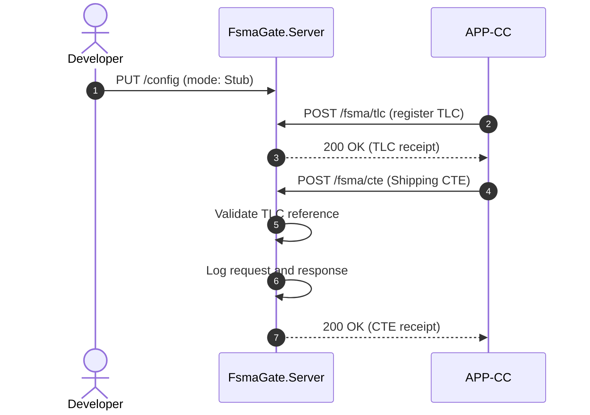

### Record Mode: Recall Submission

FsmaGate proxies a Class II recall submission to the real FDA FSMA portal
and records both the request and response for later replay.

```spec
dynamic RecordRecallSubmission {
    1: Developer -> FsmaGate.Server {
        description: "Configures FsmaGate to Record mode with FDA portal
                      credentials.";
        technology: "REST/HTTPS";
    };
    2: AppCc -> FsmaGate.Server {
        description: "POST /fsma/recall with classification Class_II,
                      affected products, distribution dates, and reason.";
        technology: "REST/HTTPS";
    };
    3: FsmaGate.Server -> FdaFsmaPortal {
        description: "Forwards the request to the FDA FSMA portal with
                      real credentials.";
        technology: "REST/HTTPS";
    };
    4: FdaFsmaPortal -> FsmaGate.Server
        : "Returns recall receipt.";
    5: FsmaGate.Server -> FsmaGate.Server
        : "Records request and response pair keyed by request signature.";
    6: FsmaGate.Server -> AppCc {
        description: "Returns the real FDA FSMA portal response
                      unmodified.";
        technology: "REST/HTTPS";
    };
}
```

Rendered interaction sequence:

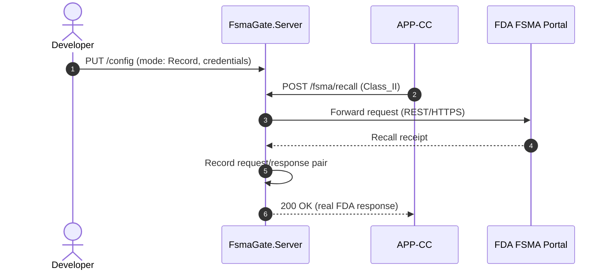

### Replay Mode: Receipt Query

FsmaGate returns a previously recorded receipt matched by submission
identifier. No network call to the FDA portal occurs.

```spec
dynamic ReplayReceiptQuery {
    1: Developer -> FsmaGate.Server {
        description: "Configures FsmaGate to Replay mode.";
        technology: "REST/HTTPS";
    };
    2: AppCc -> FsmaGate.Server {
        description: "GET /fsma/receipts/{submissionId} for a previously
                      recorded submission.";
        technology: "REST/HTTPS";
    };
    3: FsmaGate.Server -> FsmaGate.Server
        : "Matches submission identifier against recorded receipt entries.";
    4: FsmaGate.Server -> FsmaGate.Server
        : "Logs replay request and the matched response.";
    5: FsmaGate.Server -> AppCc {
        description: "Returns the matched recorded FsmaReceipt.";
        technology: "REST/HTTPS";
    };
}
```

Rendered interaction sequence:

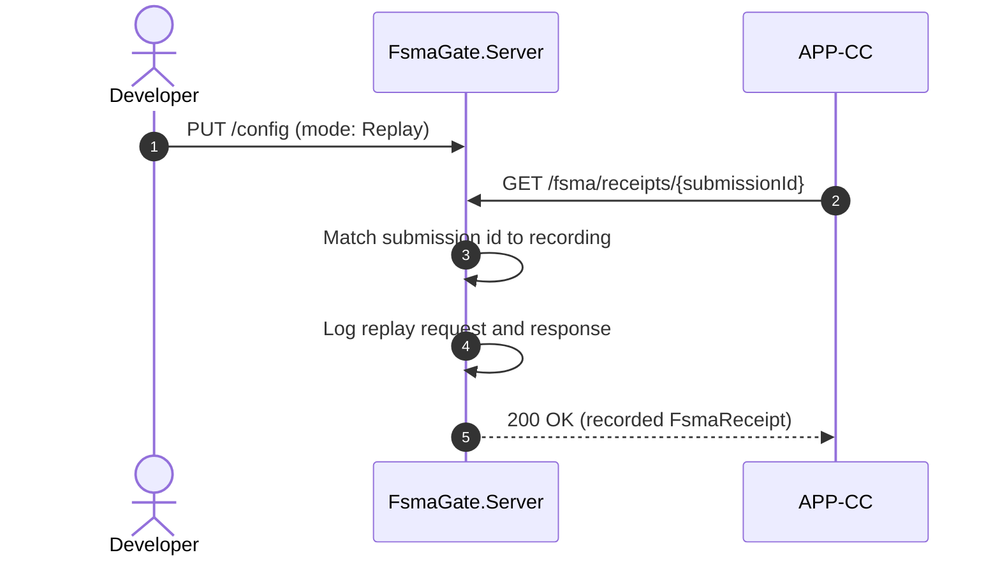

### FaultInject Mode: Missing TLC Error

FsmaGate returns a configurable FSMA-specific error response to test
APP-CC's failure handling when a KDE references a TLC that has not been
registered.

```spec
dynamic FaultInjectMissingTlc {
    1: Developer -> FsmaGate.Server {
        description: "Configures FsmaGate to FaultInject mode with a
                      FaultConfig specifying 422, missing_tlc, and 1000ms
                      delay.";
        technology: "REST/HTTPS";
    };
    2: AppCc -> FsmaGate.Server {
        description: "POST /fsma/kde referencing a TLC that is not
                      registered.";
        technology: "REST/HTTPS";
    };
    3: FsmaGate.Server -> FsmaGate.Server
        : "Waits for the configured delay (1000ms).";
    4: FsmaGate.Server -> FsmaGate.Server
        : "Logs the request and the fault response.";
    5: FsmaGate.Server -> AppCc {
        description: "Returns 422 with FSMA-shaped error body containing
                      missing_tlc error code.";
        technology: "REST/HTTPS";
    };
}
```

Rendered interaction sequence:

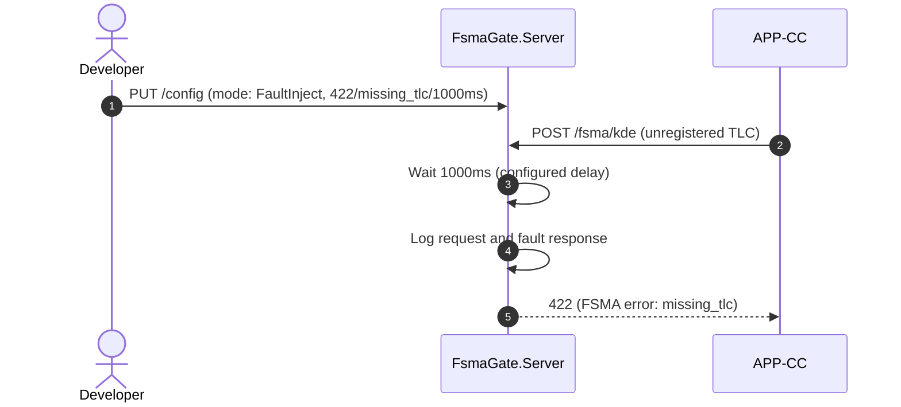

### Stub Mode: Bulk Signed-Evidence Submission

APP-CC submits a signed evidence bundle containing multiple CTE and KDE
records through FsmaGate in Stub mode.

```spec
dynamic StubBulkSubmission {
    1: AppCc -> FsmaGate.Server {
        description: "POST /fsma/bulk with a signed-evidence bundle and
                      bundleKind 'signed-evidence'.";
        technology: "REST/HTTPS";
    };
    2: FsmaGate.Server -> FsmaGate.Server
        : "Parses the bundle in memory, computes its content hash, and
           counts records.";
    3: FsmaGate.Server -> FsmaGate.Server
        : "Stores the bundle summary in memory keyed by content hash and
           generates a synthetic submission identifier.";
    4: FsmaGate.Server -> FsmaGate.Server
        : "Logs request and response.";
    5: FsmaGate.Server -> AppCc {
        description: "Returns FSMA-shaped JSON with the bulk submission
                      receipt.";
        technology: "REST/HTTPS";
    };
}
```

Rendered interaction sequence:

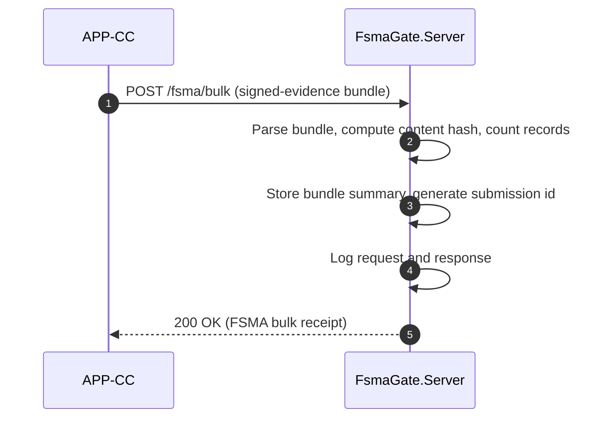

### Mismatched Lot And Stale KDE Validation

APP-CC exercises FSMA-specific validation paths by submitting a duplicate
TLC and a KDE with an out-of-window timestamp. FsmaGate returns the
mismatched_lot and stale_kde errors respectively.

```spec
dynamic FsmaValidationErrors {
    1: Developer -> FsmaGate.Server {
        description: "Configures FsmaGate to Stub mode.";
        technology: "REST/HTTPS";
    };
    2: AppCc -> FsmaGate.Server {
        description: "POST /fsma/tlc registering TLC lot-42 with
                      firstReceiverLocation 'dc-east'.";
        technology: "REST/HTTPS";
    };
    3: FsmaGate.Server -> AppCc
        : "Returns TLC receipt.";
    4: AppCc -> FsmaGate.Server {
        description: "POST /fsma/tlc registering TLC lot-42 again with
                      firstReceiverLocation 'dc-west'.";
        technology: "REST/HTTPS";
    };
    5: FsmaGate.Server -> AppCc
        : "Returns 422 with mismatched_lot error.";
    6: AppCc -> FsmaGate.Server {
        description: "POST /fsma/kde with a recordedAt timestamp older
                      than the staleness threshold.";
        technology: "REST/HTTPS";
    };
    7: FsmaGate.Server -> AppCc
        : "Returns 422 with stale_kde error.";
}
```

Rendered interaction sequence:

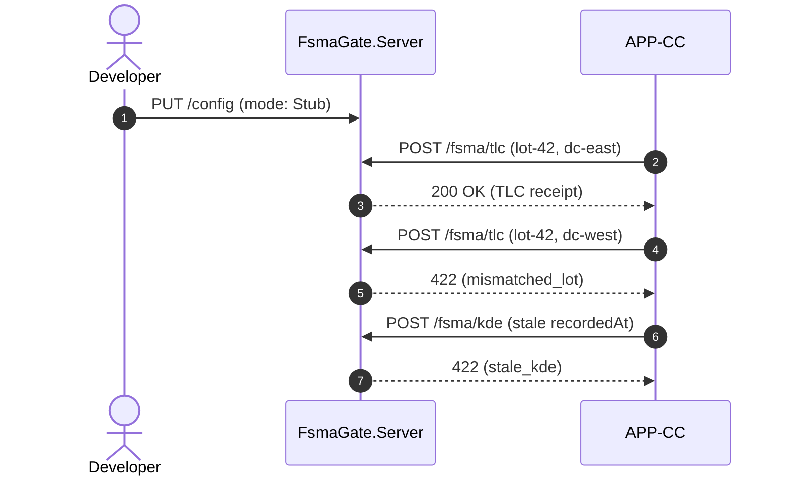

## Open Items

1. Confirm the staleness threshold default for KDE timestamps. Current
   draft assumes 24 hours; APP-CC may need a longer window for offline
   harvesting scenarios.
2. Decide whether FsmaGate should validate signed evidence bundle
   signatures in Stub mode, or only parse shape and defer signature
   verification to APP-CC.
3. Agree on the synthetic submission identifier format. Current draft
   uses a GUID; the real FDA portal uses a segmented identifier.
4. Capture the full FSMA error catalogue so FaultInject tests can cover
   regulator-specific error codes beyond missing_tlc, mismatched_lot,
   and stale_kde.
5. Determine whether the bulk endpoint should stream ZIP archives for
   very large evidence bundles, or whether the current in-memory model
   is sufficient for test workloads.
