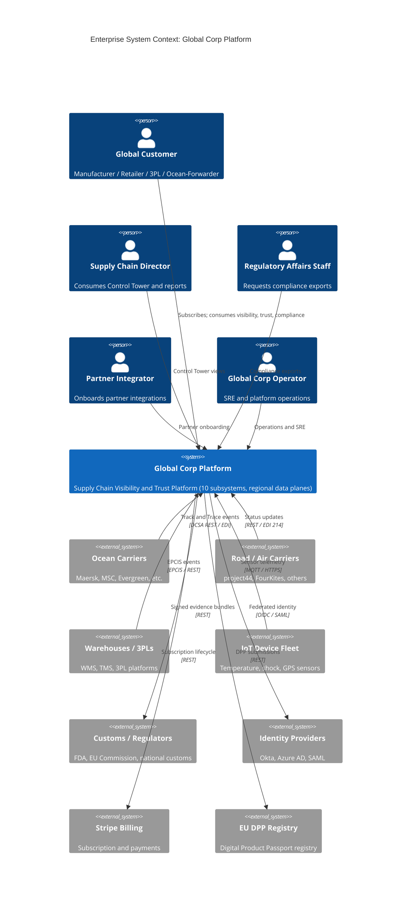
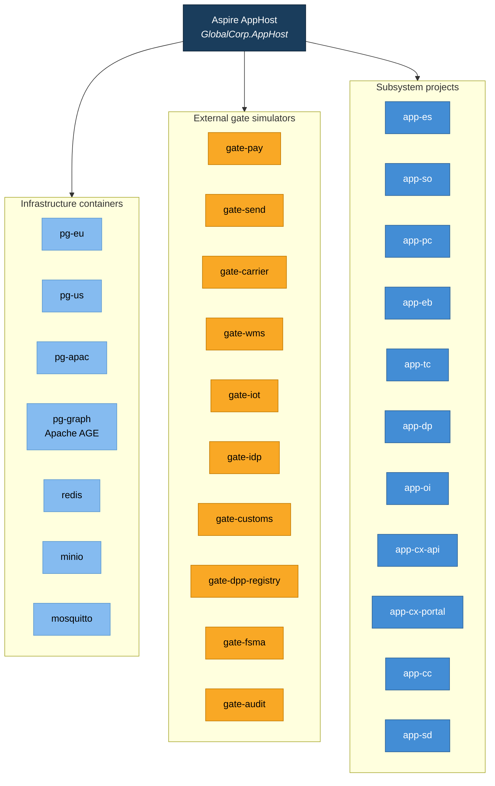
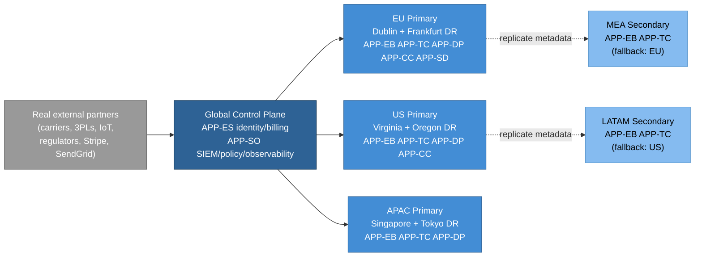
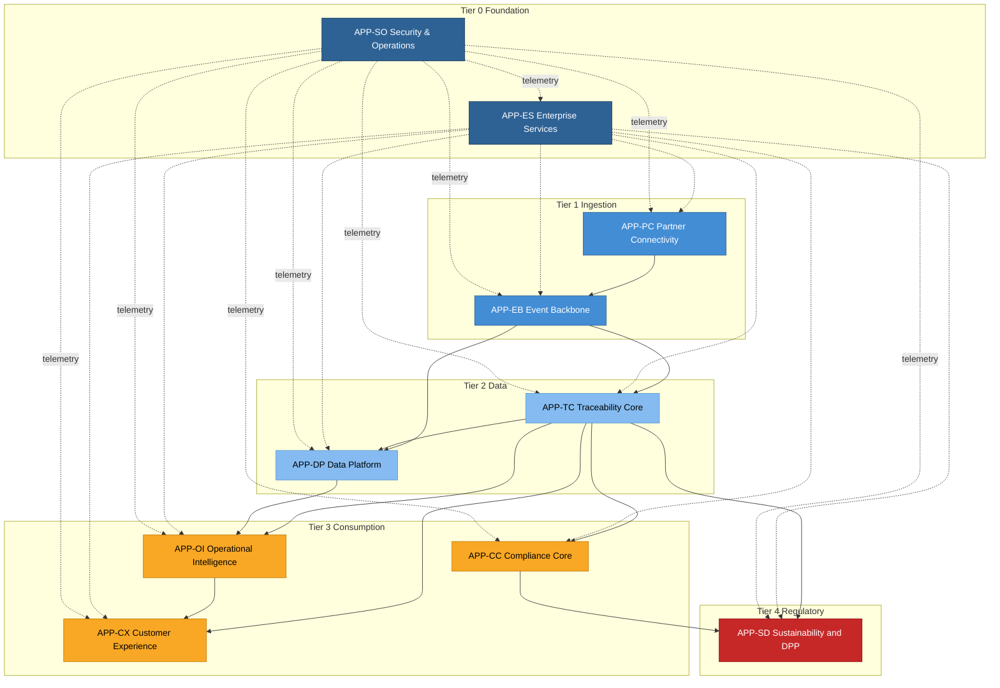
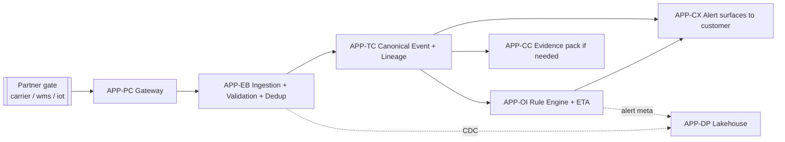
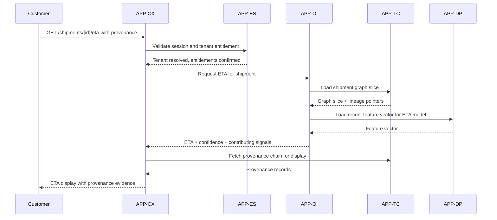
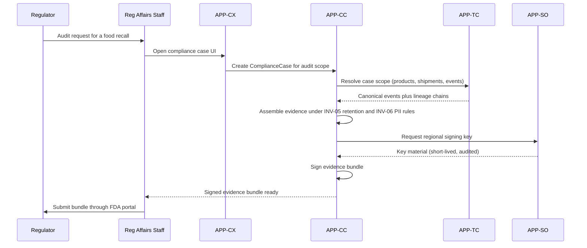

# Global Corp Platform -- Enterprise Base System Specification

## Tracking

| Field | Value |
|---|---|
| slug | global-corp-architecture |
| itemType | SystemSpec |
| name | Global Corp Platform Enterprise Architecture |
| shortDescription | Enterprise base system specification for the Global Corp Supply Chain Visibility and Trust Platform, local-simulation-first with Aspire orchestration and Docker-based external gate simulators |
| version | 2 |
| specLangVersion | 0.1.0 |
| publishStatus | Draft |
| retentionPolicy | indefinite |
| freshnessSla | P90D |
| lastReviewed | 2026-04-18 |
| authors | [PER-01 Lena Brandt] |
| reviewers | [PER-11 Anja Petersen, PER-05 Sven Lindqvist] |
| committer | PER-01 Lena Brandt |
| tags | [enterprise-architecture, base-spec, btabok-profile, supply-chain, local-simulation-first, aspire] |
| createdAt | 2026-04-18T00:00:00Z |
| updatedAt | 2026-04-18T00:00:00Z |
| Dependencies | global-corp.manifest.md, aspire-apphost.spec.md, service-defaults.spec.md |
| State | Draft |
| Reviewed | |
| Approved | |
| Executed | |
| Verified | |

This specification is inherited from the Profile declaration in [global-corp.manifest.md](global-corp.manifest.md): Profile BTABOK v0.1.0, CoDL v0.2, CaDL v0.1. Per D-11 Option A, profile declaration is manifest-level only; this spec does not re-declare the profile.

## 1. Purpose and Scope

This document is the **enterprise base system spec** for Global Corp, the fictional multinational supply chain visibility and trust platform described in the Global Corp Exemplar. It is the root authored spec that binds the 10 subsystem specs (APP-CX through APP-SO), the 2 cross-cutting platform specs (AppHost, ServiceDefaults), and the 10 gate simulator specs (PayGate, SendGate, CarrierGate, WmsGate, IotGate, IdpGate, CustomsGate, DppRegistryGate, FsmaGate, AuditGate) into a coherent enterprise architecture.

**In scope of this base spec:**
- Enterprise-level stakeholder context (who uses the platform, who consumes its outputs, who regulates it)
- Subsystem composition and enterprise-wide topology (which subsystems are permitted to communicate)
- Enterprise-wide data invariants that span subsystems
- Enterprise package policy governing NuGet allowance and denial across every authored project
- Aspire AppHost composition identifying every project, container, and gate
- Enterprise deployment profiles: Local Simulation (primary) and Cloud Production (deferred)
- Enterprise phases (how the platform is built, tested, and deployed as a whole)
- Gate simulator inventory covering every external integration point
- BTABOK trace rollup (enterprise-level mapping of ASRs, ASDs, principles, stakeholders to subsystems)
- Enterprise views rendering the cross-subsystem architecture

**Out of scope of this base spec** (lives in subsystem specs):
- Subsystem-internal components, contracts, data entities
- Subsystem-level validators and tests
- Subsystem-specific deployment configurations

This spec is a **SystemSpec** CoDL concept instance. It references the 10 subsystem specs, 2 cross-cutting platform specs, and 10 gate specs by weakRef (each is a separate SystemSpec instance in the same collection or the shared samples collection for the reused gates). It references BTABOK concepts (ASRCard, DecisionRecord, PrincipleCard, StakeholderCard, etc.) that will be authored in Phase 2c enterprise-level specs; those references are weakRef until those specs are authored.

### 1.1 Governing Constraints

The platform obeys seven non-negotiable architectural constraints. Every subsystem, gate, and authored project complies with every rule.

1. **Local simulation first, cloud optional later.** The system runs end-to-end on a developer workstation via Docker Desktop before any cloud deployment. Cloud deployment is deferred, not required.
2. **Cloud-deployable code.** Despite local-first posture, code uses abstractions so cloud deployment becomes a configuration change, not a rewrite. Aspire's resource model accommodates this directly.
3. **.NET Aspire for all .NET orchestration.** Every .NET project is composed under the Aspire AppHost. Every external container is declared in the AppHost. Connection strings, URLs, health checks, and telemetry flow through Aspire's dependency-injection and resource binding.
4. **Blazor WebAssembly + Razor Libraries for all UI.** All UI is Blazor WebAssembly in standalone mode. Reusable UI components live in Razor Class Libraries that the WebAssembly hosts consume.
5. **Zero 3rd-party JavaScript.** No Chart.js, D3, Leaflet, MermaidJS, or similar libraries in shipped UI. Built-in browser APIs via JSInterop (clipboard, localStorage, geolocation) are permitted. 3rd-party library JavaScript is not.
6. **SVG + CSS for all diagrams and charts.** Every chart, map, diagram, and visualization is authored as SVG markup plus CSS styling. Pattern reference is the FStar.UI chart library in the blazor-harness sample.
7. **All external subsystems in Docker containers locally.** Every external system Global Corp integrates with has a local Docker container simulator that follows the PayGate pattern (Stub, Record, Replay, FaultInject behavior modes). The Aspire AppHost pulls and composes these containers for local development.

### 1.2 Approved Local Simulation Stack

The platform uses these specific technology choices. Subsystem specs declare consumed components at these exact names.

| Concern | Technology | Form |
|---|---|---|
| Runtime | .NET 10 LTS | SDK and runtime |
| Orchestration | .NET Aspire 13.2.x | NuGet + AppHost project |
| Event broker (streams) | Redis Streams | `redis:7-alpine` container |
| Event store and regional data planes | PostgreSQL 17 | `postgres:17-alpine` x 3 regional instances |
| Graph store | PostgreSQL 17 + Apache AGE | `apache/age` container |
| Object storage (lakehouse) | MinIO | `minio/minio:latest` container |
| Analytics engine | DuckDB embedded | `DuckDB.NET.Data.Full` NuGet, in-process |
| Cache | Redis | Shared with event broker |
| MQTT broker | Eclipse Mosquitto | `eclipse-mosquitto:2-openssl` container |
| Identity provider | OpenIddict | In-process, hosted by APP-ES.Identity |
| Observability | Aspire Dashboard | Built into Aspire 13.2 |
| Secrets (dev) | Aspire parameter resources | Aspire-native |
| UI framework | Blazor WebAssembly standalone | Per-subsystem portal projects |
| UI components | Razor Class Libraries with authored CSS | Shared via `AppCx.UI`, `AppCx.UI.Charts` |
| Charting | Authored SVG + CSS primitives | 15 components in `AppCx.UI.Charts` |

## 2. Context

### 2.1 Persons (enterprise-level)

```spec
person GlobalCustomer {
    description: "A manufacturer, retailer, 3PL, or ocean-forwarder who subscribes to
                  the Global Corp Platform for end-to-end supply chain visibility and
                  trust across their shipments, containers, pallets, and products.";
    @tag("external", "subscriber", "revenue-generating");
}

person SupplyChainDirector {
    description: "A senior operations role at a customer organization. Consumes
                  Control Tower views, exception alerts, ETA reports, and quarterly
                  business reviews. Decides whether to renew the Global Corp
                  subscription based on delivered outcomes.";
    @tag("external", "customer-decision-maker");
}

person RegulatoryAffairsStaff {
    description: "A customer employee responsible for producing compliance evidence
                  for regulators (FDA FSMA 204, EU DPP, customs authorities).
                  Consumes audit packages exported via APP-CC.";
    @tag("external", "customer-compliance");
}

person PartnerIntegrator {
    description: "A technical staff member at a carrier, 3PL, EDI provider, or
                  IoT device provider who configures the partner integration with
                  Global Corp. Uses APP-PC onboarding and certification tooling.";
    @tag("external", "partner-technical");
}

person RegulatorAuditor {
    description: "An auditor working for a regulatory body (FDA, EU Commission,
                  national customs authority) who requests compliance evidence
                  packages from Global Corp customers during audits or incident
                  investigations.";
    @tag("external", "regulator");
}

person GlobalCorpOperator {
    description: "A Global Corp SRE, customer success engineer, or platform
                  operator who runs and maintains the platform from the inside.
                  Consumes internal observability dashboards via APP-SO.";
    @tag("internal", "operator");
}
```

### 2.2 External systems

```spec
external system OceanCarrierNetwork {
    description: "The aggregate of major ocean shipping lines (Maersk, MSC,
                  CMA CGM, Evergreen, COSCO, HMM, ONE, Hapag-Lloyd, Yang Ming,
                  ZIM) that expose DCSA-compatible Track and Trace APIs or
                  legacy EDI feeds for shipment milestones.";
    technology: "DCSA REST/HTTPS, EDI X12/EDIFACT";
    @tag("partner", "ocean");
}

external system RoadAirCarrierNetwork {
    description: "Road and air carriers integrating via REST/JSON APIs, EDI 214
                  status updates, and industry-specific visibility platforms
                  (project44, FourKites). These feed shipment milestones to
                  APP-PC.";
    technology: "REST/JSON, EDI 214, webhooks";
    @tag("partner", "road-air");
}

external system WarehouseAndThreePLSystems {
    description: "Warehouse management systems (WMS), transportation management
                  systems (TMS), and 3PL operational platforms that emit
                  inventory and handoff events via EPCIS, REST APIs, or SFTP
                  batch exchanges.";
    technology: "EPCIS, REST/JSON, AS2/SFTP";
    @tag("partner", "warehouse-3pl");
}

external system IoTDeviceFleet {
    description: "IoT sensors attached to containers, pallets, and individual
                  cartons streaming temperature, shock, humidity, GPS, and
                  tilt data. Ingested via APP-PC telemetry endpoints.";
    technology: "MQTT, HTTPS, LoRaWAN gateway APIs";
    @tag("partner", "iot");
}

external system CustomsAndRegulatorSystems {
    description: "Government systems that Global Corp customers must report
                  traceability events to. FSMA 204 CTEs, EU DPP registry,
                  national customs declaration systems. Global Corp produces
                  signed evidence packages consumed by these systems.";
    technology: "REST/JSON, SOAP, signed evidence bundles";
    @tag("external", "regulator");
}

external system IdentityProviders {
    description: "Customer and partner identity providers (Okta, Azure AD,
                  Auth0, corporate SAML). APP-ES federates authentication with
                  these for OAuth 2.1 / OIDC flows.";
    technology: "OAuth 2.1, OIDC, SAML";
    @tag("external", "identity");
}

external system StripeBilling {
    description: "Payment and subscription management. APP-ES.Billing calls
                  Stripe for subscription lifecycle, invoicing, and payment
                  processing.";
    technology: "REST/HTTPS";
    @tag("external", "payment");
}

external system EUDigitalProductPassportRegistry {
    description: "EU-operated registry that receives product passport
                  submissions under the Ecodesign for Sustainable Products
                  Regulation. APP-SD publishes here.";
    technology: "REST/JSON, signed submissions";
    @tag("external", "regulator");
}

external system FdaFsmaReportingPortal {
    description: "FDA food-traceability reporting portal where covered-food
                  customers submit CTEs and KDEs. APP-CC produces the evidence
                  packs that customers then submit.";
    technology: "REST/JSON, exportable bundles";
    @tag("external", "regulator");
}

external system AuditorReviewTools {
    description: "Third-party audit and compliance review platforms that
                  accept signed evidence bundles and produce audit reports
                  for certification purposes (SOC 2, ISO 27001, ISO 28000).";
    technology: "REST/JSON, signed evidence ingest";
    @tag("external", "auditor");
}
```

### 2.3 Enterprise relationships

```spec
GlobalCustomer -> GlobalCorpPlatform {
    description: "Subscribes to visibility, trust, compliance, decision support,
                  and partner interoperability services.";
    technology: "REST/HTTPS via APP-CX";
}

SupplyChainDirector -> GlobalCorpPlatform : "Consumes Control Tower views, alerts, and reports.";

RegulatoryAffairsStaff -> GlobalCorpPlatform {
    description: "Requests compliance evidence exports; configures retention
                  and jurisdiction packs.";
    technology: "REST/HTTPS via APP-CC through APP-CX";
}

PartnerIntegrator -> GlobalCorpPlatform {
    description: "Onboards partner integrations, registers certification
                  profiles, inspects webhook delivery logs.";
    technology: "REST/HTTPS via APP-PC";
}

RegulatorAuditor -> CustomsAndRegulatorSystems {
    description: "Requests audit packages through government systems, which
                  customers produce using Global Corp evidence exports.";
    technology: "Out of band; not a direct Global Corp flow.";
}

GlobalCorpOperator -> GlobalCorpPlatform : "Runs SRE workflows, configures tenants, responds to incidents.";

OceanCarrierNetwork -> GlobalCorpPlatform : "Sends shipment milestone events through APP-PC.";
RoadAirCarrierNetwork -> GlobalCorpPlatform : "Sends status updates through APP-PC.";
WarehouseAndThreePLSystems -> GlobalCorpPlatform : "Sends EPCIS events through APP-PC.";
IoTDeviceFleet -> GlobalCorpPlatform : "Streams sensor telemetry through APP-PC.";

GlobalCorpPlatform -> CustomsAndRegulatorSystems : "Produces signed evidence bundles through APP-CC.";
GlobalCorpPlatform -> EUDigitalProductPassportRegistry : "Publishes DPP submissions through APP-SD.";
GlobalCorpPlatform -> FdaFsmaReportingPortal : "Customers submit APP-CC-generated bundles.";
GlobalCorpPlatform -> AuditorReviewTools : "Exports signed evidence bundles on request.";

GlobalCorpPlatform -> IdentityProviders : "Federates customer and partner identity.";
GlobalCorpPlatform -> StripeBilling : "Manages subscription lifecycle and invoicing.";
```

### 2.4 Rendered enterprise context



## 3. Enterprise System Declaration

```spec
system GlobalCorpPlatform {
    target: "net10.0";
    responsibility: "Multi-regional, multi-tenant supply chain visibility and
                     trust platform. Normalizes multi-party logistics events
                     across modes and regions into a canonical traceability
                     graph with auditable lineage. Exposes visibility APIs,
                     control-tower portals, compliance evidence exports,
                     sustainability and DPP publication, and operational
                     intelligence (ETAs, exceptions, alerts) to global
                     manufacturers, retailers, 3PLs, and regulators.";

    subsystem APP-CX {
        source: "app-cx.customer-experience.spec.md";
        responsibility: "Customer-facing portals, dashboards, case management,
                         notifications. Owned by PER-19 Emma Richardson.";
    }

    subsystem APP-ES {
        source: "app-es.enterprise-services.spec.md";
        responsibility: "Identity, tenant management, billing, contract and
                         entitlement management. Owned by PER-01 Lena Brandt.";
    }

    subsystem APP-PC {
        source: "app-pc.partner-connectivity.spec.md";
        responsibility: "Partner-facing API gateway, EDI translation, webhook
                         handling, partner adapters. Owned by PER-03 Maria
                         Oliveira.";
    }

    subsystem APP-EB {
        source: "app-eb.event-backbone.spec.md";
        responsibility: "Event ingestion, validation, deduplication,
                         sequencing, replay. Owned by PER-02 Arjun Desai.";
    }

    subsystem APP-TC {
        source: "app-tc.traceability-core.spec.md";
        responsibility: "Canonical shipment and product graph, chain-of-custody,
                         first-class lineage. Owned by PER-02 Arjun Desai.";
    }

    subsystem APP-DP {
        source: "app-dp.data-platform.spec.md";
        responsibility: "Lakehouse, reporting marts, training data pipelines,
                         historical archives, retention-policy enforcement.
                         Owned by PER-02 Arjun Desai.";
    }

    subsystem APP-OI {
        source: "app-oi.operational-intelligence.spec.md";
        responsibility: "ETA models, rule engine, alerting, exception
                         workflow, case orchestration. Owned by PER-18 Kenji
                         Sato.";
    }

    subsystem APP-CC {
        source: "app-cc.compliance-core.spec.md";
        responsibility: "Recall workflows, audit packages, retention policies,
                         jurisdiction packs, signed evidence export. Owned by
                         PER-17 Isabelle Laurent.";
    }

    subsystem APP-SD {
        source: "app-sd.sustainability-dpp.spec.md";
        responsibility: "EU Digital Product Passport assembly and publication,
                         material provenance, sustainability evidence,
                         circularity tracking. Owned by PER-15 Marcus Weber.";
    }

    subsystem APP-SO {
        source: "app-so.security-operations.spec.md";
        responsibility: "SIEM integration, observability, secrets management,
                         vulnerability tracking, zero-trust policy decisions,
                         incident collaboration. Owned by PER-04 Daniel Park.";
    }

    // Cross-cutting platform subsystems (Aspire orchestration substrate)

    subsystem PLT-HOST {
        source: "aspire-apphost.spec.md";
        responsibility: "Aspire AppHost composition. Declares every project,
                         every container, every connection binding, and every
                         health check for the Local Simulation Profile.
                         Owned by PER-01 Lena Brandt.";
    }

    subsystem PLT-DEFAULTS {
        source: "service-defaults.spec.md";
        responsibility: "Shared ServiceDefaults library. Standardizes
                         OpenTelemetry wiring, resilience policies, service
                         discovery, JWT bearer validation, and health-check
                         conventions. Referenced by every .NET project.
                         Owned by PER-01 Lena Brandt.";
    }

    // External system simulator gates (Docker container images,
    // composed by PLT-HOST, following the PayGate Stub/Record/Replay/
    // FaultInject pattern)

    subsystem GATE-PAY {
        source: "../../src/MCPServer/DotNet/Docs/Specs/PayGate.spec.md";
        responsibility: "Mimics Stripe REST surface. Consumed by
                         APP-ES.Billing in Local Simulation Profile.
                         Reused verbatim from the existing SpecChat sample.";
    }

    subsystem GATE-SEND {
        source: "../../src/MCPServer/DotNet/Docs/Specs/SendGate.spec.md";
        responsibility: "Mimics SendGrid mail/send API. Consumed by
                         APP-CX.NotificationEngine in Local Simulation
                         Profile. Reused verbatim from the existing
                         SpecChat sample.";
    }

    subsystem GATE-CARRIER {
        source: "carrier-gate.spec.md";
        responsibility: "Mimics ocean, road, and air carrier APIs (DCSA
                         Track-and-Trace, EDI X12/EDIFACT 214, project44-
                         style visibility). Consumed by APP-PC.";
    }

    subsystem GATE-WMS {
        source: "wms-gate.spec.md";
        responsibility: "Mimics WMS, TMS, and 3PL platforms including EPCIS
                         event capture/query, REST webhooks, and AS2/SFTP
                         batch exchanges. Consumed by APP-PC.";
    }

    subsystem GATE-IOT {
        source: "iot-gate.spec.md";
        responsibility: "Mimics IoT device telemetry. Bundles Mosquitto MQTT
                         broker plus a telemetry simulator producing
                         temperature, shock, humidity, and GPS streams.
                         Scriptable scenarios (normal, cold-chain excursion,
                         tamper). Consumed by APP-PC.";
    }

    subsystem GATE-IDP {
        source: "idp-gate.spec.md";
        responsibility: "Mimics external OIDC identity providers (Okta,
                         Azure AD, Auth0, corporate SAML) for federated
                         login tests. Returns test user tokens. Consumed
                         by APP-ES.Identity federation path.";
    }

    subsystem GATE-CUSTOMS {
        source: "customs-gate.spec.md";
        responsibility: "Mimics national customs declaration and clearance
                         systems. Consumed by APP-CC evidence-export
                         workflows.";
    }

    subsystem GATE-DPP {
        source: "dpp-registry-gate.spec.md";
        responsibility: "Mimics the EU Digital Product Passport registry.
                         Accepts DPP submissions, returns registry URIs.
                         Consumed by APP-SD.";
    }

    subsystem GATE-FSMA {
        source: "fsma-gate.spec.md";
        responsibility: "Mimics the FDA FSMA reporting portal. Accepts
                         Critical Tracking Event (CTE) and Key Data Element
                         (KDE) submissions. Consumed by APP-CC.";
    }

    subsystem GATE-AUDIT {
        source: "audit-gate.spec.md";
        responsibility: "Mimics third-party audit and compliance review
                         platforms. Accepts signed evidence bundles and
                         produces synthetic audit reports. Consumed by
                         APP-CC.";
    }
}
```

Each `subsystem` is a weakRef<SystemSpec> to a peer spec in this collection or, for the reused GATE-PAY and GATE-SEND, to their existing SpecChat sample specs. The subsystem spec files carry the authoritative component-level detail. This base spec references them without duplicating their internal declarations.

## 4. Enterprise Topology

```spec
// Tier 0 subsystems (foundational; consumed by most other subsystems)
topology allow: GlobalCorpPlatform.APP-ES -> every subsystem "Identity, tenant, entitlement resolution.";
topology allow: every subsystem -> GlobalCorpPlatform.APP-SO "Telemetry, security events, observability.";

// Ingestion pipeline
topology allow: GlobalCorpPlatform.APP-PC -> GlobalCorpPlatform.APP-EB "Raw partner events.";
topology deny:  GlobalCorpPlatform.APP-PC -> GlobalCorpPlatform.APP-TC "Partner payloads must traverse the Event Backbone for normalization; direct bypass would violate INV-01 payload hash retention and INV-02 lineage completeness.";

// Canonical data flow
topology allow: GlobalCorpPlatform.APP-EB -> GlobalCorpPlatform.APP-TC "Canonical events promoted to the traceability graph.";
topology allow: GlobalCorpPlatform.APP-EB -> GlobalCorpPlatform.APP-DP "Raw event streams via CDC for analytics and archive.";
topology allow: GlobalCorpPlatform.APP-TC -> GlobalCorpPlatform.APP-DP "Traceability snapshots for analytics.";

// Consumption
topology allow: GlobalCorpPlatform.APP-TC -> GlobalCorpPlatform.APP-OI "Graph context for ETA models and rule evaluation.";
topology allow: GlobalCorpPlatform.APP-TC -> GlobalCorpPlatform.APP-CC "Traceability evidence for compliance packages.";
topology allow: GlobalCorpPlatform.APP-TC -> GlobalCorpPlatform.APP-SD "Product graph traversal for DPP assembly.";
topology allow: GlobalCorpPlatform.APP-TC -> GlobalCorpPlatform.APP-CX "Traceability graph slices for customer views.";

// Intelligence to customer
topology allow: GlobalCorpPlatform.APP-OI -> GlobalCorpPlatform.APP-CX "Alerts and exceptions surfaced to customer.";
topology allow: GlobalCorpPlatform.APP-DP -> GlobalCorpPlatform.APP-OI "Training data and historical features for ETA models.";

// Compliance and regulatory
topology allow: GlobalCorpPlatform.APP-CC -> GlobalCorpPlatform.APP-SD "Signed evidence coordination for DPP submissions.";
topology allow: GlobalCorpPlatform.APP-CC -> GlobalCorpPlatform.APP-SO "Regional signing keys from Secrets Manager.";

// Hard forbidden paths
topology deny: GlobalCorpPlatform.APP-CX -> GlobalCorpPlatform.APP-PC "Customer-facing layer must not call partner adapters directly; flows go through APP-OI or APP-TC for auditability.";
topology deny: GlobalCorpPlatform.APP-CC -> GlobalCorpPlatform.APP-OI "Compliance must not depend on operational-intelligence heuristics; INV-03 requires evidence-backed state, not inferred state.";
topology deny: GlobalCorpPlatform.APP-DP -> GlobalCorpPlatform.APP-CC "Data Platform is read-only with respect to Compliance Core; compliance retention obligations (INV-05) require APP-CC to own its own retention policy engine, not inherit from analytics.";
topology deny: GlobalCorpPlatform.APP-SD -> GlobalCorpPlatform.APP-DP "Sustainability must not consume analytics-layer approximations; DPP evidence must trace to canonical traceability.";

// Subsystem-to-gate allowances (external integration points)
// Each allow represents a subsystem reaching an external boundary.
// In Local Simulation Profile, the gate simulator terminates the edge.
// In Cloud Production Profile, the real external terminates the edge.
topology allow: GlobalCorpPlatform.APP-ES -> GlobalCorpPlatform.GATE-PAY     "Billing to payment processor.";
topology allow: GlobalCorpPlatform.APP-ES -> GlobalCorpPlatform.GATE-IDP     "Identity federation to external OIDC / SAML providers.";
topology allow: GlobalCorpPlatform.APP-CX -> GlobalCorpPlatform.GATE-SEND    "Customer notifications to email delivery.";
topology allow: GlobalCorpPlatform.APP-PC -> GlobalCorpPlatform.GATE-CARRIER "Carrier track-and-trace and EDI flows.";
topology allow: GlobalCorpPlatform.APP-PC -> GlobalCorpPlatform.GATE-WMS     "Warehouse and 3PL EPCIS and batch-file exchanges.";
topology allow: GlobalCorpPlatform.APP-PC -> GlobalCorpPlatform.GATE-IOT     "IoT telemetry ingestion.";
topology allow: GlobalCorpPlatform.APP-CC -> GlobalCorpPlatform.GATE-CUSTOMS "Customs declaration submissions.";
topology allow: GlobalCorpPlatform.APP-CC -> GlobalCorpPlatform.GATE-FSMA    "FDA FSMA 204 submissions.";
topology allow: GlobalCorpPlatform.APP-CC -> GlobalCorpPlatform.GATE-AUDIT   "Signed evidence bundles to audit platforms.";
topology allow: GlobalCorpPlatform.APP-SD -> GlobalCorpPlatform.GATE-DPP     "EU Digital Product Passport publications.";

// Gate topology invariants
invariant GatesAreTerminalEdges:
    forall gate g in [GATE-PAY, GATE-SEND, GATE-CARRIER, GATE-WMS, GATE-IOT,
                      GATE-IDP, GATE-CUSTOMS, GATE-DPP, GATE-FSMA, GATE-AUDIT]:
        g has no outgoing edges into any GlobalCorpPlatform subsystem
        except as REST responses to subsystem-initiated requests;
    rationale: "Gates simulate external systems. External systems do not
                initiate calls into Global Corp subsystems except via
                subsystem-initiated outbound connections (webhooks, long
                polling) or subsystem-exposed endpoints for callbacks.
                Treat gates as terminal edges in the topology graph.";

invariant ExternalIntegrationsThroughGates:
    forall flow f in LocalSimulationProfile:
        f.target is external implies f.target is a gate simulator;
    rationale: "Constraint 7 requires every external integration in the
                Local Simulation Profile to terminate at a gate container.
                No subsystem may open a socket to a non-gate external
                endpoint in dev. Cloud Production Profile swaps the gate
                base URL for the real external's URL via configuration
                (Constraint 2).";

// Enterprise topology invariants
invariant PartnerPayloadsAlwaysThroughEventBackbone:
    forall flow f: f.source == APP-PC and f.target in {APP-TC, APP-OI, APP-CC, APP-SD}
        implies f goes through APP-EB;

invariant ComplianceIndependentFromIntelligence:
    no path exists from APP-OI to APP-CC;

invariant SecurityOmnipresent:
    forall subsystem s: exists flow s -> APP-SO for telemetry;
```

## 5. Enterprise Data Model

The enterprise canonical data model is the set of entities that span subsystem boundaries. Each entity's authoritative definition lives in its owning subsystem spec; this section lists them with owner and cross-subsystem visibility notes.

```spec
// Core canonical entities (authoritative in APP-TC)
entity Organization          { owner: APP-TC; readers: [APP-ES, APP-CX, APP-CC, APP-OI]; /* ENT-01 */ }
entity Site                  { owner: APP-TC; readers: [APP-OI, APP-CX, APP-CC];          /* ENT-02 */ }
entity Lane                  { owner: APP-TC; readers: [APP-OI, APP-DP];                  /* ENT-03 */ }
entity Shipment              { owner: APP-TC; readers: [APP-OI, APP-CX, APP-CC, APP-DP];  /* ENT-04 */ }
entity Consignment           { owner: APP-TC; readers: [APP-OI, APP-CC];                  /* ENT-05 */ }
entity Order                 { owner: APP-TC; readers: [APP-CX, APP-OI];                  /* ENT-06 */ }
entity Container             { owner: APP-TC; readers: [APP-OI, APP-CX, APP-SD];          /* ENT-07 */ }
entity Pallet                { owner: APP-TC; readers: [APP-OI, APP-SD];                  /* ENT-08 */ }
entity Case                  { owner: APP-TC; readers: [APP-SD, APP-CC];                  /* ENT-09 */ }
entity Item                  { owner: APP-TC; readers: [APP-SD, APP-CC];                  /* ENT-10 */ }
entity Batch                 { owner: APP-TC; readers: [APP-CC];                          /* ENT-11 */ }
entity Product               { owner: APP-TC; readers: [APP-SD, APP-CX, APP-CC];          /* ENT-12 */ }
entity CustodyRecord         { owner: APP-TC; readers: [APP-CC, APP-SD, APP-OI];          /* ENT-15 */ }
entity LineageRecord         { owner: APP-TC; readers: [APP-CC, APP-SD, APP-DP];          /* implements ASD-04 */ }

// Event canonical (authoritative in APP-EB)
entity CanonicalEvent        { owner: APP-EB; readers: [APP-TC, APP-DP, APP-OI];          /* ENT-13 */ }

// Compliance entities
entity Document              { owner: APP-CC; readers: [APP-TC, APP-SD];                  /* ENT-14 */ }
entity ComplianceCase        { owner: APP-CC; readers: [APP-CX, APP-OI];                  /* ENT-16 */ }

// Operational
entity Alert                 { owner: APP-OI; readers: [APP-CX, APP-CC];                  /* ENT-17 */ }
entity Exception             { owner: APP-OI; readers: [APP-CX, APP-CC];                  /* ENT-18 */ }

// Partner commercial
entity PartnerContract       { owner: APP-PC; readers: [APP-ES, APP-OI];                  /* ENT-19 */ }
```

The ENT-XX comments cross-reference the canonical entity catalog in the Global-Corp-Exemplar narrative.

## 6. Enterprise Contracts

The following contracts cross subsystem boundaries. Each contract's authoritative declaration lives in the subsystem that owns its producing side.

```spec
contract CTR-01-EventIngestion {
    producer: APP-EB;
    consumers: [APP-PC];
    purpose: "Accept raw partner events and return a canonical event or a rejection.";
    see: "app-eb.event-backbone.spec.md";
}

contract CTR-02-EvidenceRetrieval {
    producer: APP-TC;
    consumers: [APP-CC, APP-SD];
    purpose: "Given an event, return the source payload and lineage chain.";
    see: "app-tc.traceability-core.spec.md";
}

contract CTR-03-ComplianceExport {
    producer: APP-CC;
    consumers: [APP-CX, external: CustomsAndRegulatorSystems];
    purpose: "Given a compliance case, produce a signed evidence package.";
    see: "app-cc.compliance-core.spec.md";
}

contract CTR-04-ETAPredict {
    producer: APP-OI;
    consumers: [APP-CX];
    purpose: "Given a shipment, return predicted ETA with confidence.";
    see: "app-oi.operational-intelligence.spec.md";
}

contract CTR-05-PartnerOnboard {
    producer: APP-PC;
    consumers: [APP-ES];
    purpose: "Given a partner profile, return a certification status and mapping pack.";
    see: "app-pc.partner-connectivity.spec.md";
}
```

## 7. Enterprise Invariants

```spec
// Core data integrity invariants
invariant INV-01-PayloadHashRetention:
    forall canonical_event e: exists stored payload hash h where h == sha256(e.original_partner_payload);
    enforcedBy: [APP-EB, APP-TC];
    rationale: "Every canonical event retains the SHA-256 hash of its original partner payload so evidence chains can be proven untampered. See ASD-04.";

invariant INV-02-LineageCompleteness:
    forall canonical_event e: e.lineagePointer resolves to at least one source evidence record;
    enforcedBy: [APP-EB, APP-TC];
    rationale: "Every canonical event has a lineage pointer that resolves to at least one source evidence record. Implements ASD-04 lineage as first-class.";

invariant INV-03-EvidenceBackedState:
    forall externally-visible shipment state s: exists event chain c where c produces s;
    enforcedBy: [APP-TC, APP-OI];
    rationale: "No externally visible shipment state exists without a supporting event chain. Prevents inferred or speculative state from reaching customers or regulators.";

invariant INV-04-IdentifierMastering:
    product, asset, shipment, facility identifiers are mastered independently and joined through graph relationships only;
    enforcedBy: [APP-TC];
    rationale: "Prevents identifier collisions and preserves canonical identity federation.";

invariant INV-05-RegionalRetention:
    forall concept instance i: retention policy is applied per jurisdiction at write time, not at read time;
    enforcedBy: [APP-CC, APP-DP];
    rationale: "Jurisdiction-specific retention is enforced when data is written so read-time mistakes cannot leak data beyond its permitted retention window.";

invariant INV-06-PiiRegional:
    forall PII field: not replicated outside region of origin unless a regional waiver authorizes the replication;
    enforcedBy: [APP-CC, APP-DP, APP-EB];
    rationale: "PII minimization and regional control. WVR-02 is the only active waiver authorizing cross-region metadata replication for EU DPP index queries.";
```

## 8. Package Policy

The enterprise-level NuGet package policy governs every authored .NET project in the collection. Each subsystem spec references this policy by `weakRef<PackagePolicy>(GlobalCorpPolicy)` and may add subsystem-local allowances only with rationale.

```spec
package_policy GlobalCorpPolicy {
    source: nuget("https://api.nuget.org/v3/index.json");

    deny category("charting")
        includes ["Plotly.Blazor", "ChartJs.Blazor", "Radzen.Blazor",
                  "ApexCharts", "Syncfusion.*", "Telerik.*",
                  "DevExpress.*", "MudBlazor.Charts"];
    rationale "deny category(charting)" {
        context "Constraint 5 (zero 3rd-party JS) and Constraint 6
                 (SVG + CSS for diagrams and charts). Every chart
                 ships as an authored Razor component with an SVG
                 body.";
        decision "All charting libraries are denied at the enterprise
                  level. The authored chart primitive library
                  (AppCx.UI.Charts) is the single source of chart
                  components.";
        consequence "Subsystem UI projects import AppCx.UI.Charts and
                     compose charts by reference. No runtime 3rd-party
                     charting library is permitted.";
    }

    deny category("css-framework")
        includes ["Bootstrap", "Tailwind.*", "MudBlazor",
                  "Radzen.Blazor", "AntDesign"];
    rationale "deny category(css-framework)" {
        context "Razor Class Libraries bundle their own authored CSS
                 per Constraint 4 and Constraint 6.";
        decision "CSS frameworks are denied at the enterprise level.
                  Each Razor Library ships its own wwwroot/css/<Name>.css.";
        consequence "Consistent styling across subsystems comes from
                     the shared AppCx.UI library, not from a 3rd-party
                     framework.";
    }

    deny category("js-wrapper-libraries")
        includes ["Blazored.Modal", "Blazored.Toast",
                  "Blazored.Typeahead", "Blazor.Leaflet.*"];
    rationale "deny category(js-wrapper-libraries)" {
        context "Even Blazor-prefixed NuGets often wrap 3rd-party
                 JavaScript libraries. Per Constraint 5 these are
                 not permitted.";
        decision "Review each NuGet in this category on a case-by-
                  case basis; default posture is deny. Permitted
                  JSInterop targets are limited to built-in browser
                  APIs (clipboard, localStorage, geolocation).";
        consequence "Authored Razor components replace 3rd-party
                     modals, toasts, typeaheads, and map widgets.";
    }

    allow category("platform")
        includes ["Microsoft.AspNetCore.*", "Microsoft.Extensions.*",
                  "Microsoft.JSInterop", "System.*",
                  "Microsoft.Identity.*"];

    allow category("aspire")
        includes ["Aspire.*", "Aspire.Hosting.*", "Aspire.Microsoft.*",
                  "Aspire.Azure.*", "Aspire.StackExchange.*"];
    rationale "allow category(aspire)" {
        context "Constraint 3 (.NET Aspire for all .NET orchestration).
                 Aspire's resource model is the enterprise
                 composition substrate.";
        decision "All Aspire.* NuGets are allowed. The platform
                  targets Aspire 13.2.x (patch-tolerant within the
                  13.2 minor).";
        consequence "Subsystem specs that need additional Aspire
                     integrations (for example Aspire.Azure.Storage.Blobs
                     when cloud is activated later) do not require
                     additional rationale.";
    }

    allow category("auth")
        includes ["OpenIddict.*", "Microsoft.IdentityModel.*"];

    allow category("storage-drivers")
        includes ["Npgsql*", "StackExchange.Redis",
                  "Minio", "DuckDB.NET.Data.Full",
                  "MQTTnet*"];

    allow category("testing")
        includes ["xunit*", "bunit*", "Microsoft.NET.Test.Sdk",
                  "Moq", "NSubstitute", "coverlet.collector",
                  "Testcontainers*"];

    allow category("observability")
        includes ["OpenTelemetry.*"];

    default: require_rationale;

    rationale {
        context "Constraints 1 through 7 require a lean, auditable
                 package surface. Charting libraries, CSS frameworks,
                 and JavaScript wrappers violate Constraints 4, 5,
                 and 6. Aspire, platform, auth, storage, testing,
                 and observability packages are the approved
                 building blocks.";
        decision "Seven allow categories cover the normal build.
                  Three deny categories prevent the most common
                  violations. Anything outside these categories
                  requires a per-NuGet rationale block in the
                  consuming subsystem spec.";
        consequence "Subsystem authors who need a new NuGet outside
                     the allowed categories must document the context,
                     decision, and consequence before the package is
                     accepted into the collection.";
    }
}
```

## 9. Aspire Composition

The Aspire AppHost is the single entry point for the Local Simulation Profile. It declares every project, every container, and every connection binding. The authoritative spec for the AppHost lives in `aspire-apphost.spec.md`; this section summarizes the enterprise-level composition for cross-subsystem readers.

### 9.1 Composition tiers

```spec
aspire_composition GlobalCorpLocalProfile {
    target: "net10.0";
    aspire_version: "13.2.x";

    // Regional PostgreSQL data planes (Constraint 7)
    container pg-eu    { image: "postgres:17-alpine"; volume: "pg-eu-data"; }
    container pg-us    { image: "postgres:17-alpine"; volume: "pg-us-data"; }
    container pg-apac  { image: "postgres:17-alpine"; volume: "pg-apac-data"; }

    // Graph-extension-enabled PostgreSQL for APP-TC
    container pg-graph { image: "apache/age:latest"; volume: "pg-graph-data"; }

    // Shared infrastructure
    container redis      { image: "redis:7-alpine"; }
    container minio      { image: "minio/minio:latest"; }
    container mosquitto  { image: "eclipse-mosquitto:2-openssl"; }

    // External simulator gates (Constraint 7)
    container gate-pay           { image: "globalcorp/paygate:latest";          spec: GATE-PAY; }
    container gate-send          { image: "globalcorp/sendgate:latest";         spec: GATE-SEND; }
    container gate-carrier       { image: "globalcorp/carrier-gate:latest";     spec: GATE-CARRIER; }
    container gate-wms           { image: "globalcorp/wms-gate:latest";         spec: GATE-WMS; }
    container gate-iot           { image: "globalcorp/iot-gate:latest";         spec: GATE-IOT;         requires: mosquitto; }
    container gate-idp           { image: "globalcorp/idp-gate:latest";         spec: GATE-IDP; }
    container gate-customs       { image: "globalcorp/customs-gate:latest";     spec: GATE-CUSTOMS; }
    container gate-dpp-registry  { image: "globalcorp/dpp-registry-gate:latest"; spec: GATE-DPP; }
    container gate-fsma          { image: "globalcorp/fsma-gate:latest";        spec: GATE-FSMA; }
    container gate-audit         { image: "globalcorp/audit-gate:latest";       spec: GATE-AUDIT; }

    // Tier 0: Foundation subsystems
    project app-es {
        spec: APP-ES;
        references: [pg-eu, pg-us, pg-apac, gate-pay, gate-idp];
        service_defaults: required;
    }
    project app-so {
        spec: APP-SO;
        service_defaults: required;
    }

    // Tier 1: Ingestion
    project app-pc {
        spec: APP-PC;
        references: [app-es, redis, gate-carrier, gate-wms, gate-iot];
        service_defaults: required;
    }
    project app-eb {
        spec: APP-EB;
        references: [redis, pg-eu, pg-us, pg-apac, app-es];
        service_defaults: required;
    }

    // Tier 2: Data
    project app-tc {
        spec: APP-TC;
        references: [pg-graph, app-eb, app-es];
        service_defaults: required;
    }
    project app-dp {
        spec: APP-DP;
        references: [minio, app-eb, app-tc];
        service_defaults: required;
        // DuckDB is embedded in-process via NuGet; no container reference.
    }

    // Tier 3: Consumption
    project app-oi {
        spec: APP-OI;
        references: [app-eb, app-tc, app-dp, app-es];
        service_defaults: required;
    }
    project app-cx-api {
        spec: APP-CX (api-host);
        references: [app-oi, app-tc, app-es, gate-send];
        service_defaults: required;
    }
    project app-cx-portal {
        spec: APP-CX (wasm-host);
        references: [app-cx-api, app-es];
        kind: blazor-wasm-standalone;
    }
    project app-cc {
        spec: APP-CC;
        references: [app-tc, app-eb, app-so, app-es,
                     gate-customs, gate-fsma, gate-audit];
        service_defaults: required;
    }

    // Tier 4: Regulatory
    project app-sd {
        spec: APP-SD;
        references: [app-tc, app-cc, app-eb, gate-dpp-registry];
        service_defaults: required;
    }
}
```

### 9.2 AppHost responsibilities

- **Project registration**: every subsystem project declared via `builder.AddProject<T>(name)` with references to its dependencies.
- **Container registration**: every container declared via `builder.AddContainer(name, image)` or a typed helper like `builder.AddPostgres(name)`.
- **Connection binding**: dependencies declared via `WithReference(target)` produce environment variables and connection strings that Aspire wires into the consuming project at startup.
- **Health checks**: each project opts into Aspire's standard health-check conventions through the ServiceDefaults library (see `service-defaults.spec.md`).
- **Telemetry**: every project emits OpenTelemetry traces, metrics, and logs to the Aspire Dashboard by default.
- **Mode configuration**: each gate container accepts a runtime mode selector (Stub, Record, Replay, FaultInject). The AppHost provides default mode per environment.

### 9.3 AppHost composition view



## 10. Gate Inventory

Every external integration point routes through a gate simulator in the Local Simulation Profile (Constraint 7). Each gate follows the PayGate pattern: ASP.NET minimal API server mimicking the real external's REST surface, a typed .NET client library, four behavior modes (Stub, Record, Replay, FaultInject), in-memory request/response log, packaged as a Docker image.

### 10.1 Gate catalog

| Gate | Mimics | Consumed by | Behavior modes | Source |
|---|---|---|---|---|
| `GATE-PAY` | Stripe payment intents and refunds | APP-ES.Billing | Stub, Record, Replay, FaultInject | Reused from `src/MCPServer/DotNet/Docs/Specs/PayGate.spec.md` |
| `GATE-SEND` | SendGrid mail/send API | APP-CX.NotificationEngine | Stub, Record, Replay, FaultInject | Reused from `src/MCPServer/DotNet/Docs/Specs/SendGate.spec.md` |
| `GATE-CARRIER` | Ocean (DCSA T&T, EDI X12/EDIFACT 214), road/air (project44, FourKites) carrier APIs | APP-PC | Stub, Record, Replay, FaultInject | `carrier-gate.spec.md` |
| `GATE-WMS` | WMS, TMS, 3PL platforms (EPCIS, REST webhooks, AS2/SFTP) | APP-PC | Stub, Record, Replay, FaultInject | `wms-gate.spec.md` |
| `GATE-IOT` | IoT telemetry (Mosquitto MQTT broker + scriptable scenarios for temperature, shock, humidity, GPS) | APP-PC | Stub, Record, Replay, FaultInject | `iot-gate.spec.md` |
| `GATE-IDP` | External OIDC providers (Okta, Azure AD, corporate SAML) for federated login tests | APP-ES.Identity | Stub, Record, Replay, FaultInject | `idp-gate.spec.md` |
| `GATE-CUSTOMS` | National customs declaration and clearance systems | APP-CC | Stub, Record, Replay, FaultInject | `customs-gate.spec.md` |
| `GATE-DPP` | EU Digital Product Passport registry | APP-SD | Stub, Record, Replay, FaultInject | `dpp-registry-gate.spec.md` |
| `GATE-FSMA` | FDA FSMA reporting portal | APP-CC | Stub, Record, Replay, FaultInject | `fsma-gate.spec.md` |
| `GATE-AUDIT` | Third-party audit and compliance review platforms | APP-CC | Stub, Record, Replay, FaultInject | `audit-gate.spec.md` |

### 10.2 Gate contract shape

Every gate specification obeys this common contract surface.

```spec
contract GateSurface {
    requires gate in [GATE-PAY, GATE-SEND, GATE-CARRIER, GATE-WMS,
                      GATE-IOT, GATE-IDP, GATE-CUSTOMS, GATE-DPP,
                      GATE-FSMA, GATE-AUDIT];
    guarantees "Exposes REST endpoints matching the real external's
                request and response shapes.";
    guarantees "Supports runtime switching between Stub, Record,
                Replay, and FaultInject without process restart.";
    guarantees "Retains every request and response in an in-memory
                log accessible via a management endpoint for test
                assertions and post-run inspection.";
    guarantees "Ships as a Docker image consumable by the Aspire
                AppHost.";
    guarantees "No compile-time dependency on any Global Corp
                subsystem. Consumed through REST/HTTPS only.";
}
```

### 10.3 Cloud-deploy path

Per Constraint 2, gates in Local Simulation Profile swap for real external endpoints in Cloud Production Profile via configuration. Each subsystem's API client accepts a base URL that defaults to the gate's Aspire-resolved hostname in dev and to the real external's production URL in cloud. No code changes are required to switch profiles; only environment configuration differs.

## 11. Deployment

The platform is authored with two deployment profiles: **Local Simulation** (primary and required for all development and validation) and **Cloud Production** (deferred; documented as target state, not implemented).

### 11.1 Local Simulation Profile (primary)

Everything runs on a single developer workstation via Docker Desktop and the Aspire AppHost.

```spec
deployment LocalSimulationProfile {
    status: primary;
    tenant_strategy: "Logical multi-tenancy simulated across three
                      regional PostgreSQL containers (pg-eu, pg-us,
                      pg-apac). Tenant-to-region mapping maintained
                      in APP-ES.";

    node "Developer Workstation" {
        technology: "Docker Desktop, .NET 10 SDK, Aspire 13.2 CLI";

        aspire_apphost "GlobalCorp.AppHost" {
            spec: PLT-HOST;
            responsibility: "Single entry point that launches every
                             container and project in the Local
                             Simulation Profile. Exposes the Aspire
                             Dashboard for observability.";
            launch_command: "dotnet run --project GlobalCorp.AppHost";
        }

        infrastructure_containers: [
            pg-eu, pg-us, pg-apac, pg-graph,
            redis, minio, mosquitto
        ];

        gate_containers: [
            gate-pay, gate-send, gate-carrier, gate-wms, gate-iot,
            gate-idp, gate-customs, gate-dpp-registry, gate-fsma,
            gate-audit
        ];

        subsystem_projects: [
            app-es, app-so,
            app-pc, app-eb,
            app-tc, app-dp,
            app-oi, app-cx-api, app-cx-portal, app-cc,
            app-sd
        ];

        observability {
            technology: "Aspire Dashboard (built-in)";
            traces: OpenTelemetry;
            metrics: OpenTelemetry;
            logs: OpenTelemetry;
            retention: ephemeral;
        }

        identity {
            technology: "OpenIddict in-process, hosted by app-es";
            flow: "OAuth 2.1 Authorization Code with PKCE";
            passkey_support: optional;
        }

        secrets {
            technology: "Aspire parameter resources";
            rotation: none;
            rationale: "Dev profile relies on Aspire's native parameter
                        mechanism. Production-grade secret management
                        is a Cloud Production Profile concern.";
        }
    }

    rationale "LocalSimulationProfile as primary" {
        context "Constraint 1 (local simulation first) requires every
                 subsystem and every external integration to run on a
                 developer workstation without cloud dependencies.";
        decision "The Aspire AppHost composes every project and every
                  gate container. Regional data planes are simulated
                  via three PostgreSQL containers. The Aspire Dashboard
                  is the observability surface.";
        consequence "A developer runs dotnet run against the AppHost
                     project and gets the full platform end-to-end.
                     Integration tests use the same composition.
                     Cloud deployment becomes a configuration change
                     (Constraint 2), not a rewrite.";
    }
}
```

#### 11.1.1 Local Simulation Profile view

```mermaid
flowchart TB
    classDef host fill:#1A3D5C,stroke:#0B1F32,color:#fff
    classDef tier0 fill:#2E6295,stroke:#1A3D5C,color:#fff
    classDef tier1 fill:#438DD5,stroke:#2E6295,color:#fff
    classDef tier2 fill:#85BBF0,stroke:#5D99CF,color:#000
    classDef tier3 fill:#F9A825,stroke:#C17900,color:#000
    classDef tier4 fill:#C62828,stroke:#8E0000,color:#fff
    classDef infra fill:#BDBDBD,stroke:#757575,color:#000
    classDef gate fill:#FFCC80,stroke:#E08E00,color:#000

    HOST["Aspire AppHost<br/>Dashboard on localhost"]:::host

    subgraph T0 [Tier 0 Foundation]
        ES[app-es + OpenIddict]:::tier0
        SO[app-so]:::tier0
    end

    subgraph T1 [Tier 1 Ingestion]
        PC[app-pc]:::tier1
        EB[app-eb]:::tier1
    end

    subgraph T2 [Tier 2 Data]
        TC[app-tc]:::tier2
        DP[app-dp]:::tier2
    end

    subgraph T3 [Tier 3 Consumption]
        OI[app-oi]:::tier3
        CXAPI[app-cx-api]:::tier3
        CXP[app-cx-portal<br/>Blazor WASM]:::tier3
        CC[app-cc]:::tier3
    end

    subgraph T4 [Tier 4 Regulatory]
        SD[app-sd]:::tier4
    end

    subgraph INFRA [Infrastructure]
        PGE[pg-eu]:::infra
        PGU[pg-us]:::infra
        PGA[pg-apac]:::infra
        PGG[pg-graph]:::infra
        REDIS[redis]:::infra
        MINIO[minio]:::infra
        MQTT[mosquitto]:::infra
    end

    subgraph GATES [Gate simulators]
        GP[gate-pay]:::gate
        GS[gate-send]:::gate
        GC[gate-carrier]:::gate
        GW[gate-wms]:::gate
        GI[gate-iot]:::gate
        GIDP[gate-idp]:::gate
        GCUST[gate-customs]:::gate
        GDPP[gate-dpp-registry]:::gate
        GFSMA[gate-fsma]:::gate
        GAUDIT[gate-audit]:::gate
    end

    HOST --> T0
    HOST --> T1
    HOST --> T2
    HOST --> T3
    HOST --> T4
    HOST --> INFRA
    HOST --> GATES

    PC --> GC & GW & GI
    EB --> REDIS & PGE & PGU & PGA
    ES --> GP & GIDP & PGE & PGU & PGA
    TC --> PGG
    DP --> MINIO
    CXAPI --> GS
    CC --> GCUST & GFSMA & GAUDIT
    SD --> GDPP
```



### 11.2 Cloud Production Profile (deferred)

The original multi-region cloud architecture from the Global Corp exemplar. Deferred per Constraint 1. Documented here as intended long-term target state, not implemented in this collection. Aspire AppHost composition swaps gate containers for real external endpoints and PostgreSQL containers for managed cloud databases via configuration (Constraint 2).

```spec
deployment CloudProductionProfile {
    status: deferred;
    tenant_strategy: "Logical multi-tenancy with tenant-isolated
                      encryption scopes. Tenant region is immutable
                      after assignment per INV-06.";

    region EU {
        role: "Primary region for EU customers; jurisdiction for
               GDPR-adjacent retention.";
        primary_zones: [eu-west-1-Dublin, eu-central-1-Frankfurt];
        hosts_data_plane_for: [APP-EB, APP-TC, APP-DP, APP-CC, APP-SD];
    }

    region US {
        role: "Primary region for Americas customers; jurisdiction for
               FSMA 204 and US state privacy regimes.";
        primary_zones: [us-east-1-Virginia, us-west-2-Oregon];
        hosts_data_plane_for: [APP-EB, APP-TC, APP-DP, APP-CC];
    }

    region APAC {
        role: "Primary region for APAC customers; jurisdiction for
               local data-residency requirements.";
        primary_zones: [ap-southeast-1-Singapore, ap-northeast-1-Tokyo];
        hosts_data_plane_for: [APP-EB, APP-TC, APP-DP];
    }

    region MEA {
        role: "Secondary region for Middle East and Africa.";
        hosts_data_plane_for: [APP-EB, APP-TC];
        fallback_to: EU;
    }

    region LATAM {
        role: "Secondary region for Latin America.";
        hosts_data_plane_for: [APP-EB, APP-TC];
        fallback_to: US;
    }

    control_plane {
        location: "Multi-region active-active across EU, US, APAC primaries.";
        hosts: [APP-ES.Identity (primary), APP-ES.Billing (primary),
                APP-SO.PolicyEngine, APP-SO.SiemAggregation,
                APP-SO.Observability];
    }

    data_plane {
        per_region: [APP-EB, APP-TC, APP-PC, APP-CC, APP-SD, APP-OI, APP-DP];
        placement_rule: "Regional primary with regional DR. Cross-region
                         replication of metadata only, per INV-06 (with
                         WVR-02 exception for EU DPP index).";
    }

    tenant_encryption {
        key_management: "Regional KMS per data plane; customer-specific key wraps.";
        rotation: "Annual rotation; incident-triggered rotation via APP-SO.SecretsManager.";
    }

    external_integrations {
        gate_swap_rule: "Each gate simulator is replaced by the real
                         external's production endpoint via
                         configuration. The API client interface and
                         the Aspire resource binding are unchanged.";
        targets: {
            GATE-PAY:           "api.stripe.com";
            GATE-SEND:          "api.sendgrid.com";
            GATE-CARRIER:       "partner-specific DCSA, project44, FourKites endpoints";
            GATE-WMS:           "partner-specific WMS, TMS, 3PL endpoints";
            GATE-IOT:           "managed MQTT brokers (for example, AWS IoT, Azure IoT Hub)";
            GATE-IDP:           "customer OIDC and SAML providers";
            GATE-CUSTOMS:       "national customs systems";
            GATE-DPP:           "EU DPP registry";
            GATE-FSMA:          "FDA FSMA portal";
            GATE-AUDIT:         "third-party audit platforms";
        };
    }

    rationale "CloudProductionProfile as deferred" {
        context "Constraint 1 sets Local Simulation as primary; cloud
                 deployment is deferred.";
        decision "Record the intended cloud topology so subsystem
                  architects preserve the regional, multi-tenant,
                  signing-key, and data-residency shape while
                  authoring.";
        consequence "When cloud activation is approved, the Aspire
                     AppHost swaps container resources for cloud
                     equivalents (Aspire.Azure.*, Aspire.AWS.*) and
                     gate base URLs for real external endpoints. No
                     subsystem code changes are required.";
    }
}
```

#### 11.2.1 Cloud Production Profile view



## 12. Enterprise Phases

```spec
phase Foundation {
    goal: "Core platform substrate deployable in one region.";
    required_subsystems: [APP-ES, APP-SO, APP-EB, APP-TC, APP-PC];
    gate: {
        require: "All Tier 0 and Tier 1 subsystem specs reach Executed state.";
        require: "Regional deployment in one primary region (EU or US) passes integration smoke tests.";
        require: "INV-01 and INV-02 verified against synthetic event flow.";
    }
}

phase OperationalExcellence {
    goal: "Operational intelligence and customer-facing visibility live in at least two primary regions.";
    depends_on: Foundation;
    required_subsystems: [APP-DP, APP-OI, APP-CX];
    gate: {
        require: "Tier 2 and Tier 3 subsystem specs reach Executed state.";
        require: "At least two primary regions operational.";
        require: "APP-OI ETA predictions meet the ASR-05 latency thresholds in staging.";
        require: "APP-CX customer portal ready for first customer onboarding.";
    }
}

phase RegulatoryReadiness {
    goal: "Compliance and sustainability subsystems live; platform is audit-ready.";
    depends_on: OperationalExcellence;
    required_subsystems: [APP-CC, APP-SD];
    gate: {
        require: "APP-CC can produce FSMA 204-compliant evidence packages.";
        require: "APP-SD can publish EU DPP submissions.";
        require: "All three primary regions operational.";
        require: "Signed evidence verification passes for a synthetic customer audit.";
    }
}

phase GlobalRollout {
    goal: "Secondary regions (MEA, LATAM) operational; all subsystems at target availability.";
    depends_on: RegulatoryReadiness;
    gate: {
        require: "MEA and LATAM secondary regions operational with EU and US fallback configured.";
        require: "Outcome scorecard metrics (MET-BZ, MET-AR, MET-OP) within target ranges.";
        require: "EARB review of the full deployment approves GA readiness.";
    }
}
```

## 13. Enterprise Views

The enterprise views below are rendered inline in this base spec for immediate readability. When `global-corp.views.spec.md` (the CaDL view gallery) is authored in Phase 2c, each view here becomes a CaDL canvas definition and this section points to it.

### 13.1 Platform dependency view



### 13.2 Data flow view: partner event to customer exception

In the Local Simulation Profile, the partner producing the event is a gate simulator (`gate-carrier`, `gate-wms`, or `gate-iot`) rather than a live partner system. The flow is otherwise identical.



## 14. Enterprise Dynamics

Each cross-subsystem sequence below applies to both deployment profiles. In Local Simulation Profile, every external boundary terminates at a gate simulator; in Cloud Production Profile, those same boundaries terminate at real external endpoints (Constraint 2).

### 14.1 Cross-subsystem sequence: customer requests ETA with provenance



### 14.2 Cross-subsystem sequence: FSMA 204 compliance export

In the Local Simulation Profile, the regulator portal is `gate-fsma`; customs submissions route to `gate-customs`; audit submissions route to `gate-audit`.



### 14.3 Cross-subsystem sequence: DPP publication

In the Local Simulation Profile, the EU DPP registry endpoint is `gate-dpp-registry`.

```mermaid
sequenceDiagram
    participant EuDpp as EU DPP Registry
    participant CustomerPortal as Customer (via APP-CX)
    participant CX as APP-CX
    participant SD as APP-SD
    participant TC as APP-TC
    participant CC as APP-CC

    CustomerPortal->>CX: Request DPP for product batch
    CX->>SD: AssembleDpp(productId, batchId)
    SD->>TC: Traverse product graph (materials, custody, events)
    TC-->>SD: Product graph + provenance
    SD->>CC: Request signed evidence bundle for materials declaration
    CC->>TC: Resolve compliance scope
    TC-->>CC: Events + lineage
    CC->>CC: Sign bundle
    CC-->>SD: Signed bundle
    SD->>SD: Compose DPP (passport + material decls + evidence bundle)
    SD->>EuDpp: PublishDpp(passport)
    EuDpp-->>SD: Acknowledgment (registry URI)
    SD-->>CX: DPP published; registry URI returned
    CX-->>CustomerPortal: Display DPP and registry URL
```

## 15. BTABOK Traces (Enterprise Rollup)

This section is the enterprise-level mapping of BTABOK concepts to the subsystems that implement them. The authoritative concept records live in planned Phase 2c specs; references use `weakRef` until those specs are authored.

### 15.1 ASR-to-subsystem traces

```spec
trace weakRef<ASRCard>(ASR-01) -> [APP-PC, APP-EB, APP-TC]    "Multi-party event ingestion with auditable lineage.";
trace weakRef<ASRCard>(ASR-02) -> [APP-TC, APP-CC, APP-SD]    "Every externally visible state explainable from evidence.";
trace weakRef<ASRCard>(ASR-03) -> [APP-CC, APP-DP, APP-SO]    "Regional data residency.";
trace weakRef<ASRCard>(ASR-04) -> [APP-PC]                    "Partner onboarding without core rewrites.";
trace weakRef<ASRCard>(ASR-05) -> [APP-OI, APP-EB]            "High-severity disruptions in 5 min median.";
trace weakRef<ASRCard>(ASR-06) -> [APP-CC, APP-TC]            "Compliance evidence reproducible in 4h p95.";
trace weakRef<ASRCard>(ASR-07) -> [APP-TC, APP-SD]            "Both shipment-level and product-level traceability.";
trace weakRef<ASRCard>(ASR-08) -> weakRef<SpecCollection>(global-corp-waivers)  "Governance exceptions explicit, time-bounded, reviewable.";
trace weakRef<ASRCard>(ASR-09) -> weakRef<SpecCollection>(global-corp)          "Repository artifacts useful, owned, and current.";
trace weakRef<ASRCard>(ASR-10) -> [APP-PC]                    "Legacy protocol transitions with backward compatibility.";
```

### 15.2 ASD-to-subsystem traces

```spec
trace weakRef<DecisionRecord>(ASD-01) -> [APP-PC, APP-EB, APP-TC] "Standards-first canonical model. ASD scope: enterprise.";
trace weakRef<DecisionRecord>(ASD-02) -> [APP-EB, APP-TC]         "Separate ingestion from canonical core.";
trace weakRef<DecisionRecord>(ASD-03) -> deployment               "Regional data planes. ASD scope: enterprise.";
trace weakRef<DecisionRecord>(ASD-04) -> [APP-TC, APP-EB]         "Lineage as first-class data object.";
trace weakRef<DecisionRecord>(ASD-05) -> [APP-CC, APP-DP]         "Compliance separate from general analytics.";
trace weakRef<DecisionRecord>(ASD-06) -> weakRef<SpecCollection>(global-corp) "Curated repository with ownership.";
trace weakRef<DecisionRecord>(ASD-07) -> weakRef<SpecCollection>(global-corp-waivers) "Formal waiver process.";
trace weakRef<DecisionRecord>(ASD-08) -> weakRef<SpecCollection>(global-corp) "BTABOK-style lightweight deliverables.";
```

### 15.3 Principle-to-subsystem traces

```spec
trace weakRef<PrincipleCard>(P-01) -> [APP-PC]                           "Standards before custom.";
trace weakRef<PrincipleCard>(P-02) -> [APP-EB, APP-TC, APP-OI]           "Events are the source of operational truth.";
trace weakRef<PrincipleCard>(P-03) -> [APP-TC]                           "Canonical identity, federated evidence.";
trace weakRef<PrincipleCard>(P-04) -> [APP-TC, APP-CC, APP-SD]           "Trust requires lineage.";
trace weakRef<PrincipleCard>(P-05) -> views                              "Views must serve stakeholders.";
trace weakRef<PrincipleCard>(P-06) -> weakRef<SpecCollection>(global-corp) "Deliverables stay lightweight.";
trace weakRef<PrincipleCard>(P-07) -> weakRef<SpecCollection>(global-corp) "Repository is first for architects.";
trace weakRef<PrincipleCard>(P-08) -> weakRef<SpecCollection>(global-corp-governance) "Governance should guide, not suffocate.";
trace weakRef<PrincipleCard>(P-09) -> deployment                         "Global consistency, regional compliance.";
trace weakRef<PrincipleCard>(P-10) -> [APP-SO, APP-CC]                   "Security includes the supply chain.";
```

### 15.4 Stakeholder-to-viewpoint traces

```spec
trace weakRef<StakeholderCard>(STK-01 CEO)           -> [VP-01 Strategic, VP-10 Outcome];
trace weakRef<StakeholderCard>(STK-02 CFO)           -> [VP-02 Capability, VP-10 Outcome];
trace weakRef<StakeholderCard>(STK-03 COO)           -> [VP-06 Operational, VP-08 Deployment];
trace weakRef<StakeholderCard>(STK-04 CPO)           -> [VP-02 Capability, VP-04 Information];
trace weakRef<StakeholderCard>(STK-05 ChiefArch)     -> every viewpoint;
trace weakRef<StakeholderCard>(STK-06 CISO)          -> [VP-07 Security, VP-09 Governance];
trace weakRef<StakeholderCard>(STK-07 RegionalOps)   -> [VP-06 Operational, VP-08 Deployment];
trace weakRef<StakeholderCard>(STK-08 PartnerInt)    -> [VP-05 Integration];
trace weakRef<StakeholderCard>(STK-09 CustSCD)       -> [VP-06 Operational, VP-02 Capability];
trace weakRef<StakeholderCard>(STK-10 RegAffairs)    -> [VP-04 Information, VP-07 Security];
trace weakRef<StakeholderCard>(STK-11 Sustainability) -> [VP-04 Information, VP-02 Capability];
trace weakRef<StakeholderCard>(STK-12 EARB)          -> [VP-09 Governance, VP-04 Information];
```

### 15.5 Capability-to-subsystem traces

```spec
trace weakRef<CapabilityCard>(CAP-COM-01 Commercial)              -> [APP-ES, APP-CX];
trace weakRef<CapabilityCard>(CAP-CDL-01 Customer Delivery)       -> [APP-CX, APP-ES];
trace weakRef<CapabilityCard>(CAP-PAR-01 Partner Interoperability) -> [APP-PC];
trace weakRef<CapabilityCard>(CAP-TRC-01 Traceability Operations) -> [APP-EB, APP-TC];
trace weakRef<CapabilityCard>(CAP-CTR-01 Control Tower)           -> [APP-OI, APP-CX];
trace weakRef<CapabilityCard>(CAP-CPS-01 Compliance and Sustainability) -> [APP-CC, APP-SD];
trace weakRef<CapabilityCard>(CAP-DAI-01 Data and Intelligence)   -> [APP-DP, APP-OI];
trace weakRef<CapabilityCard>(CAP-TAS-01 Trust and Security)      -> [APP-SO, APP-ES];
trace weakRef<CapabilityCard>(CAP-ENT-01 Enterprise Management)   -> [APP-ES];
trace weakRef<CapabilityCard>(CAP-REP-01 Repository Discipline)   -> weakRef<SpecCollection>(global-corp);
trace weakRef<CapabilityCard>(CAP-GOV-01 Governance and Waiver)   -> weakRef<SpecCollection>(global-corp-governance);
trace weakRef<CapabilityCard>(CAP-OUT-01 Outcome Measurement)     -> weakRef<SpecCollection>(global-corp-outcome-scorecard);
```

### 15.6 Standards-to-subsystem traces

```spec
trace weakRef<StandardCard>(STD-01 GS1 EPCIS 2.0)                 -> [APP-PC, APP-EB];
trace weakRef<StandardCard>(STD-02 DCSA Track and Trace)          -> [APP-PC];
trace weakRef<StandardCard>(STD-03 ISO 28000:2022)                -> [APP-SO];
trace weakRef<StandardCard>(STD-04 NIST CSF 2.0)                  -> [APP-SO, APP-CC];
trace weakRef<StandardCard>(STD-05 EU Ecodesign SPR)              -> [APP-SD, APP-CC];
trace weakRef<StandardCard>(STD-06 FDA FSMA 204)                  -> [APP-CC];
trace weakRef<StandardCard>(STD-07 OAuth 2.1 / OIDC)              -> [APP-ES];
trace weakRef<StandardCard>(STD-08 mTLS profile v1.2)             -> [APP-SO, APP-ES];
trace weakRef<StandardCard>(STD-09 OpenTelemetry)                 -> [APP-SO];
trace weakRef<StandardCard>(STD-10 Canonical Event Schema v1.0)   -> [APP-EB, APP-TC];
```

## 16. Business Services Realization

The enterprise business services declared in the exemplar Section 14.2 map to subsystems as follows:

```spec
businessService weakRef<BSVC>(BSVC-01 Visibility API and control-tower portal) -> [APP-CX, APP-OI, APP-TC];
businessService weakRef<BSVC>(BSVC-02 Partner onboarding and certification)    -> [APP-PC, APP-ES];
businessService weakRef<BSVC>(BSVC-03 Compliance evidence export)              -> [APP-CC];
businessService weakRef<BSVC>(BSVC-04 Product traceability graph service)      -> [APP-TC];
businessService weakRef<BSVC>(BSVC-05 Sustainability and DPP readiness)        -> [APP-SD];
businessService weakRef<BSVC>(BSVC-06 Exception and incident collaboration)    -> [APP-OI, APP-CX, APP-SO];
businessService weakRef<BSVC>(BSVC-07 Analytics and executive scorecard)       -> [APP-DP, APP-CX];
```

## 17. Cross-References

### 17.1 Parent and sibling specs in this collection

- Parent manifest: [global-corp.manifest.md](global-corp.manifest.md)
- 10 subsystem specs (peers): app-cx, app-es, app-pc, app-eb, app-tc, app-dp, app-oi, app-cc, app-sd, app-so
- 2 cross-cutting platform specs (peers): [aspire-apphost.spec.md](aspire-apphost.spec.md), [service-defaults.spec.md](service-defaults.spec.md)
- 8 new gate specs (peers): [carrier-gate.spec.md](carrier-gate.spec.md), [wms-gate.spec.md](wms-gate.spec.md), [iot-gate.spec.md](iot-gate.spec.md), [idp-gate.spec.md](idp-gate.spec.md), [customs-gate.spec.md](customs-gate.spec.md), [dpp-registry-gate.spec.md](dpp-registry-gate.spec.md), [fsma-gate.spec.md](fsma-gate.spec.md), [audit-gate.spec.md](audit-gate.spec.md)

### 17.2 Reused gate specs (from SpecChat samples)

- [PayGate.spec.md](../../src/MCPServer/DotNet/Docs/Specs/PayGate.spec.md) (mimics Stripe)
- [SendGate.spec.md](../../src/MCPServer/DotNet/Docs/Specs/SendGate.spec.md) (mimics SendGrid)

### 17.3 Planned sibling specs (Phase 2c)

These specs are referenced throughout this base spec via weakRef and will be authored in Phase 2c:

- global-corp.stakeholders.spec.md (STK-01..STK-12)
- global-corp.asrs.spec.md (ASR-01..ASR-10)
- global-corp.decisions.spec.md (ASD-01..ASD-08)
- global-corp.governance.spec.md (ETSC, EARB, DDC, RAF, RSG)
- global-corp.waivers.spec.md (WVR-01..WVR-03)
- global-corp.roadmap.spec.md (T1..T3 + Target)
- global-corp.viewpoints.spec.md (VP-01..VP-10)
- global-corp.views.spec.md (V-01..V-10)
- global-corp.standards.spec.md (STD-01..STD-10)
- global-corp.outcome-scorecard.spec.md (MET-BZ, MET-AR, MET-OP)

### 17.4 Implementation guidance

- Platform implementation brief: [Global-Corp-Platform-Implementation-Brief.md](../Global-Corp-Platform-Implementation-Brief.md)
- Blazor WASM + SVG chart pattern reference: [blazor-harness.spec.md](../../Delivery/spec-chat/samples/blazor-harness.spec.md)
- Gate simulator pattern reference: [PayGate.spec.md](../../src/MCPServer/DotNet/Docs/Specs/PayGate.spec.md)

### 17.5 External design references

- Narrative description: [Global-Corp-Exemplar.md](../Global-Corp-Exemplar.md)
- Language design: [SpecLang-Design.md](../SpecLang-Design.md)
- Versioning policy: [SpecChat-Versioning-Policy.md](../SpecChat-Versioning-Policy.md)
- Settled decisions: [SpecChat-Design-Decisions-Record.md](../SpecChat-Design-Decisions-Record.md)
- Implementation plan: [SpecChat-BTABOK-Implementation-Plan.md](../SpecChat-BTABOK-Implementation-Plan.md)

## 18. Open Items

- **Phase 2c completion**: 10 enterprise-level BTABOK concept specs (stakeholders, ASRs, decisions, governance, waivers, roadmap, viewpoints, views, standards, outcome scorecard) need authoring to promote the weakRef traces in Section 15 to strong `ref<T>` references.
- **Subsystem contract alignment**: Each subsystem declares its own contract surface. A future contract-drift audit can compare this base spec's Section 6 claims against each subsystem's authoritative contract declarations.
- **Deployment phase-gate automation**: Section 12 phase gates are declarative; when implementation reaches Phase 4, these gates should be backed by automated checks (validator runs, integration smoke tests, AppHost smoke runs against the Local Simulation Profile).
- **View library promotion**: When `global-corp.views.spec.md` is authored in Phase 2c, the Mermaid diagrams in Section 13 of this spec should be replaced with `weakRef<CanvasDefinition>` pointers and the CaDL renderer should produce the rendered output from the view gallery.
- **Cross-profile subsystem possibility**: At present all 10 subsystems use the BTABOK profile. In the future, if a subsystem is migrated to the TheStandard profile or authored as a Core-profile artifact, cross-profile references will use `weakRef` per D-07 Option B.
- **Apache AGE image pinning**: Section 9 declares `apache/age:latest`. A pinned version matching the PostgreSQL 17 base image line reduces drift. Decide between `apache/age:pg17-latest` or a custom Dockerfile layering AGE onto `postgres:17-alpine`.
- **Redis Streams topology**: Local Simulation uses a single Redis container. Production shape (cluster or Sentinel) is a Cloud Production Profile concern and is not prescribed here.
- **MinIO bucket policy**: Initial bucket set should cover `gc-events-eu`, `gc-events-us`, `gc-events-apac`, `gc-compliance-bundles`, `gc-dpp-assets`, `gc-analytics-marts`. The `aspire-apphost.spec.md` is the authoritative declaration point.
- **OpenIddict client registration strategy**: Static-at-startup for Local Simulation; dynamic client registration for partner-tenant self-onboarding is deferred.
- **Passkey support scope**: OpenIddict supports passkeys as of its 2026 releases. Customer portal (APP-CX) adoption is a stretch goal, not baseline.
- **Aspire dashboard retention**: Local Simulation treats dashboard telemetry as ephemeral by default. Explicit export (trace bundle) is available when a developer wants to share a repro.
- **Testing container strategy**: Unit and integration tests use Testcontainers; end-to-end AppHost tests use `Aspire.Hosting.Testing`. The approach is declared in each subsystem spec's phases section.
