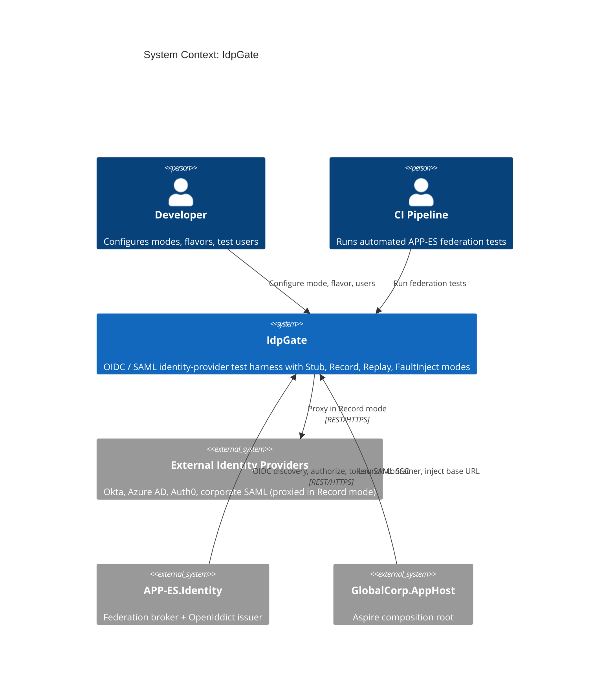
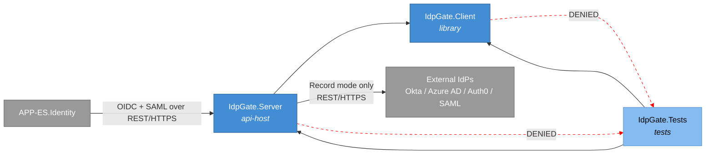
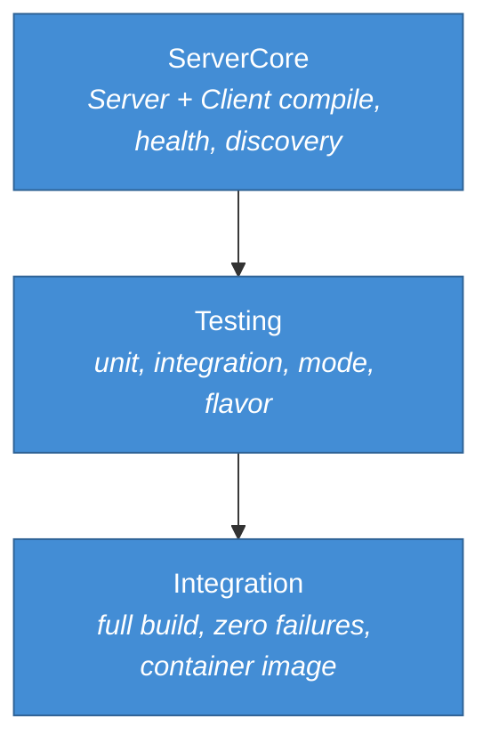
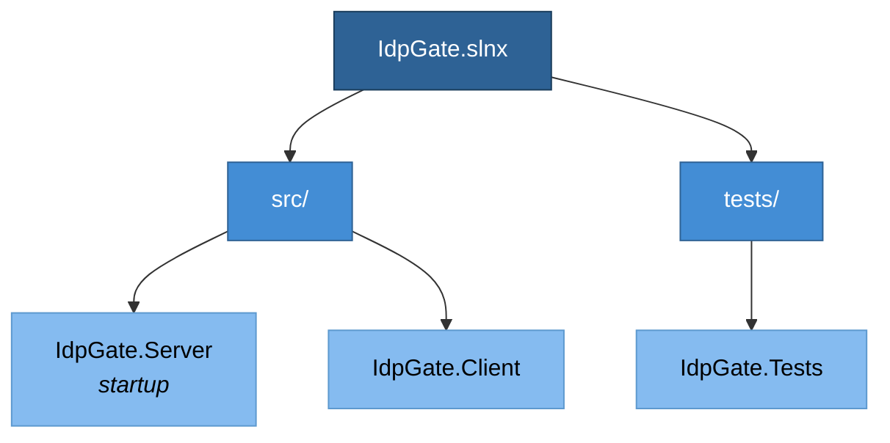
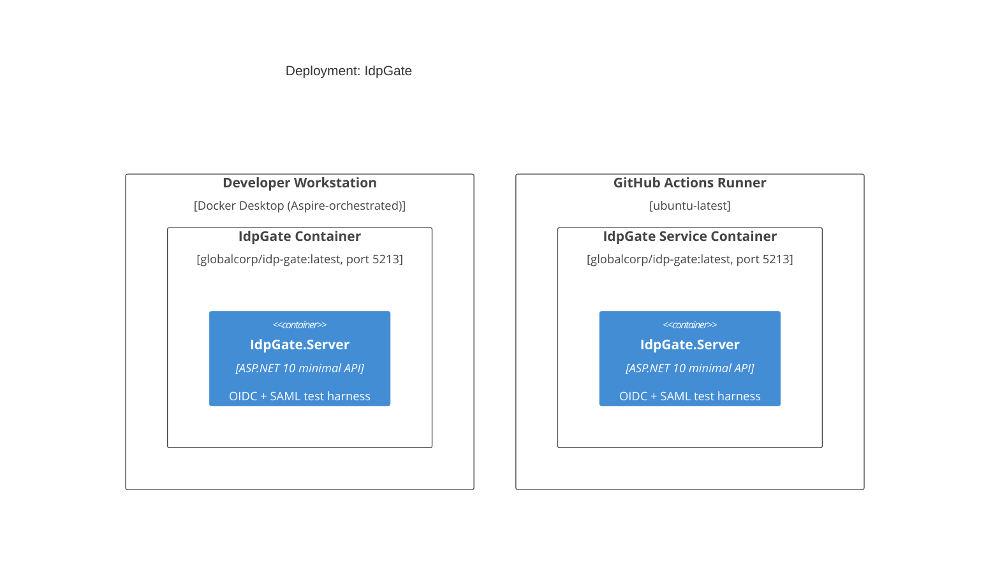
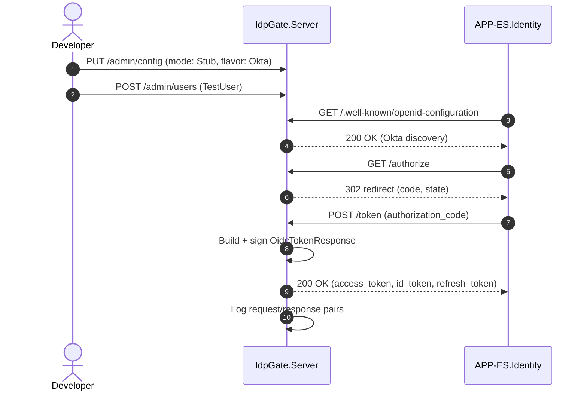
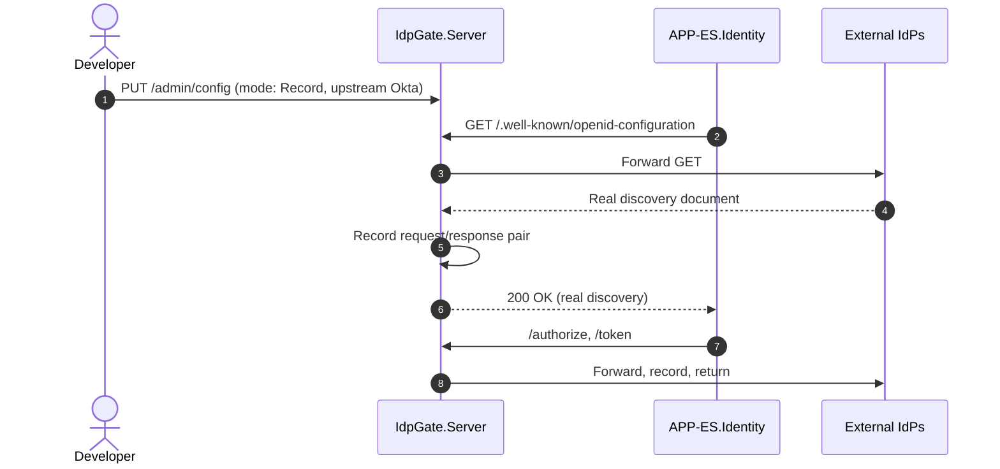
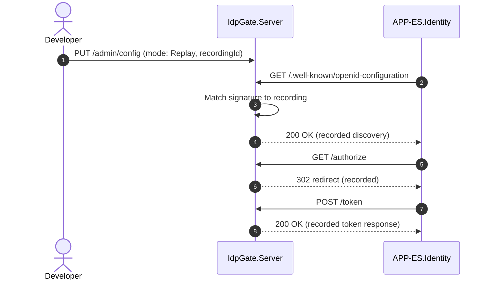
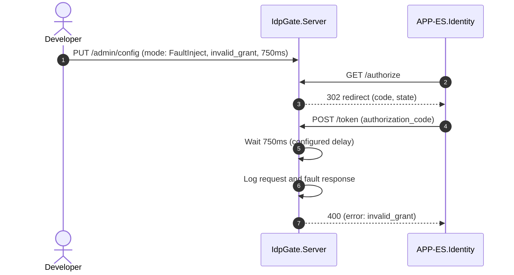

# IdpGate -- System Specification

## Tracking

| Field | Value |
|---|---|
| slug | idp-gate |
| itemType | SystemSpec |
| name | IdpGate |
| shortDescription | Test harness that mimics external OIDC and SAML identity providers (Okta, Azure AD, Auth0, corporate SAML) for Global Corp Enterprise Services (APP-ES) federated-login testing |
| version | 1 |
| specLangVersion | 0.1.0 |
| publishStatus | Draft |
| retentionPolicy | indefinite |
| freshnessSla | P90D |
| lastReviewed | 2026-04-18 |
| authors | [PER-01 Lena Brandt] |
| reviewers | [PER-11 Anja Petersen] |
| committer | PER-01 Lena Brandt |
| tags | [gate, simulator, idp, oidc, saml, federation, local-simulation-first] |
| createdAt | 2026-04-18T00:00:00Z |
| updatedAt | 2026-04-18T00:00:00Z |
| Dependencies | [global-corp.architecture.spec.md](./global-corp.architecture.spec.md), [app-es.enterprise-services.spec.md](./app-es.enterprise-services.spec.md), [aspire-apphost.spec.md](./aspire-apphost.spec.md) |
| State | Draft |
| Reviewed | |
| Approved | |
| Executed | |
| Verified | |

This specification describes IdpGate, a test harness that mimics external OIDC and SAML identity providers consumed by the Global Corp Enterprise Services subsystem (APP-ES.Identity). IdpGate follows the same Stub, Record, Replay, and FaultInject behavior-mode pattern as the `PayGate` and `SendGate` sample gates. It exposes the endpoints that APP-ES.Identity calls during federated login: OIDC discovery, authorization, token issuance, SAML single sign-on, and a test-user directory.

IdpGate is an ASP.NET 10 minimal API server paired with a typed .NET client library, `IdpGate.Client`. The client wraps the management API so test projects can register test users, switch provider flavors, configure faults, and inspect the request log. The container image `globalcorp/idp-gate:latest` is orchestrated by the Global Corp Aspire AppHost.

IdpGate is consumed by APP-ES.Identity during local development and CI integration tests of federation flows. It is a test-time component only. It never runs in staging or production. APP-ES.Identity points its federation-provider URLs at IdpGate by configuration. Tokens that IdpGate issues are signed with a test-only key and are not valid against the real APP-ES.Identity OpenIddict issuer.

## Context

```spec
person Developer {
    description: "A Global Corp platform engineer developing or
                  debugging APP-ES.Identity federation flows against
                  a deterministic provider instead of real Okta,
                  Azure AD, Auth0, or corporate SAML tenants.";
    @tag("internal", "test");
}

person CIPipeline {
    description: "Automated CI/CD pipeline that runs APP-ES
                  federation integration tests against IdpGate to
                  validate OIDC and SAML flows without third-party
                  provider accounts.";
    @tag("automation", "test");
}

external system ExternalIdentityProviders {
    description: "Real-world identity providers that APP-ES.Identity
                  federates with: Okta, Azure AD, Auth0, and corporate
                  SAML 2.0 deployments. IdpGate mimics their protocol
                  surfaces in all modes except Record.";
    technology: "OIDC / OAuth 2.1 / SAML 2.0";
    @tag("identity", "external");
}

external system APP-ES.Identity {
    description: "Global Corp Enterprise Services identity component.
                  Hosts OpenIddict as its own token issuer and acts
                  as a federation broker for external providers. In
                  test configuration the external-provider endpoints
                  resolve to IdpGate.";
    technology: "REST/HTTPS, OIDC, SAML";
    @tag("consumer", "internal");
}

external system GlobalCorpAppHost {
    description: "The Global Corp Aspire AppHost that declares
                  IdpGate as a container resource and wires
                  APP-ES.Identity to it via connection bindings and
                  environment variables.";
    technology: ".NET Aspire 13.2 DistributedApplication";
    @tag("orchestrator", "internal");
}

Developer -> IdpGate.Server : "Configures mode, provider flavor, test users, inspects log.";

CIPipeline -> IdpGate.Server : "Runs automated APP-ES federation tests.";

APP-ES.Identity -> IdpGate.Server {
    description: "Performs OIDC discovery, authorization, token
                  exchange, and SAML SSO against IdpGate in place of
                  real external providers.";
    technology: "REST/HTTPS, OIDC, SAML";
}

IdpGate.Server -> ExternalIdentityProviders {
    description: "Proxies to a real external provider in Record mode
                  only.";
    technology: "REST/HTTPS, OIDC, SAML";
}

GlobalCorpAppHost -> IdpGate.Server : "Launches the container and injects the federation base URL into APP-ES.Identity.";
```

Rendered system context:



## System Declaration

```spec
system IdpGate {
    target: "net10.0";
    responsibility: "Test harness that mimics the external OIDC and
                     SAML identity providers consumed by
                     APP-ES.Identity. Issues synthetic OIDC discovery
                     documents, authorization redirects, access and
                     ID tokens, and SAML responses with configurable
                     claims. Supports four behavior modes: Stub,
                     Record, Replay, FaultInject. Enables APP-ES
                     federated-login integration testing without
                     third-party provider tenants.";

    authored component IdpGate.Server {
        kind: "api-host";
        path: "src/IdpGate.Server";
        status: new;
        responsibility: "ASP.NET 10 minimal API that exposes the
                         OIDC discovery, authorize, and token
                         endpoints, the SAML SSO endpoint, the
                         user-directory admin endpoints, and the
                         management endpoints. Routes every incoming
                         request through the active behavior mode.
                         Signs issued tokens with a test-only key.";
        contract {
            guarantees "Exposes GET /.well-known/openid-configuration,
                        GET /authorize, POST /token, POST /saml/sso,
                        POST /admin/users, and GET /admin/users/{id}
                        with request and response shapes matching the
                        active ProviderFlavor.";
            guarantees "Behavior mode is switchable at runtime via the
                        management API without restarting the
                        container.";
            guarantees "Provider flavor is switchable at runtime. The
                        discovery document, token format, and SAML
                        attribute names reflect the active flavor
                        (Okta, AzureAd, Auth0, SamlCorp, Generic).";
            guarantees "Every incoming request and outgoing response
                        is captured in an in-memory log accessible
                        via the management API.";
            guarantees "Issued access_token, id_token, and
                        refresh_token values are signed with a
                        test-only asymmetric key. They are NOT valid
                        against the real APP-ES.Identity OpenIddict
                        issuer.";
        }
    }

    authored component IdpGate.Client {
        kind: library;
        path: "src/IdpGate.Client";
        status: new;
        responsibility: "A .NET client library that wraps the IdpGate
                         management API. APP-ES test projects use it
                         to configure behavior modes, switch provider
                         flavors, seed test users, configure faults,
                         and inspect the request log. Not used by
                         APP-ES production code.";
        contract {
            guarantees "Public API surface exposes ConfigureMode,
                        SetProviderFlavor, AddTestUser, GetTestUser,
                        GetRequestLog, and ConfigureFault methods.";
            guarantees "Targets IdpGate.Server by default. The base
                        URL is configurable for Aspire-injected
                        endpoints.";
            guarantees "Serializes TestUser, FederationProviderProfile,
                        and FaultConfig records to JSON matching the
                        server's accepted shapes.";
        }

        rationale {
            context "APP-ES federation tests need programmatic access
                     to user seeding and mode switching. Driving the
                     management API via raw HttpClient in every test
                     would duplicate DTO and routing logic.";
            decision "A dedicated typed client library provides a
                      single place for management-API DTOs and
                      routing. Test projects reference it and register
                      it in DI.";
            consequence "APP-ES.Tests depends on IdpGate.Client.
                         APP-ES.Identity production code does not
                         reference IdpGate.Client. It only sees the
                         public OIDC and SAML endpoints, which are
                         identical in shape to real providers under
                         the active ProviderFlavor.";
        }
    }

    authored component IdpGate.Tests {
        kind: tests;
        path: "tests/IdpGate.Tests";
        status: new;
        responsibility: "Integration and unit tests for IdpGate.Server
                         and IdpGate.Client. Verifies each behavior
                         mode, each provider flavor, token signing,
                         SAML response signing, user directory CRUD,
                         fault injection, and client parity with the
                         management API surface.";
    }

    consumed component xunit {
        source: nuget("xunit");
        version: "2.*";
        responsibility: "Unit and integration testing framework.";
        used_by: [IdpGate.Tests];
    }

    consumed component TestHost {
        source: nuget("Microsoft.AspNetCore.Mvc.Testing");
        version: "10.*";
        responsibility: "In-process test server for ASP.NET minimal
                         API integration testing.";
        used_by: [IdpGate.Tests];
    }

    consumed component IdentityModel {
        source: nuget("IdentityModel");
        version: "7.*";
        responsibility: "OIDC discovery document construction and
                         token-request parsing helpers used by
                         IdpGate.Server.";
        used_by: [IdpGate.Server];
    }

    consumed component JsonWebToken {
        source: nuget("Microsoft.IdentityModel.JsonWebTokens");
        version: "8.*";
        responsibility: "JWT signing and serialization for synthetic
                         access and ID tokens.";
        used_by: [IdpGate.Server];
    }
}
```

## Data Specification

### Enums

```spec
enum BehaviorMode {
    Stub: "Returns preconfigured synthetic discovery, authorization, token, and SAML responses",
    Record: "Proxies requests to a configured upstream identity provider and records request/response pairs",
    Replay: "Returns previously recorded responses matched by request signature",
    FaultInject: "Returns configurable error responses (invalid_grant, consent_required, SAML status errors) after a configurable delay"
}

enum ProviderFlavor {
    Okta: "Okta-style discovery, tokens, and claim names",
    AzureAd: "Azure AD v2.0 style discovery, tokens, and claim names",
    Auth0: "Auth0-style discovery and token shape including custom namespaced claims",
    SamlCorp: "Corporate SAML 2.0 IdP profile with signed assertions",
    Generic: "Generic OIDC / SAML defaults with no vendor quirks"
}

enum FederationProtocol {
    Oidc: "OpenID Connect 1.0 / OAuth 2.1 authorization code + PKCE",
    Saml: "SAML 2.0 Web Browser SSO profile (HTTP-POST binding)"
}
```

### Entities

The data model captures the provider-compatible response payloads, the seeded test-user directory, and the internal recording and configuration state.

```spec
entity TestUser {
    sub: string;
    email: string;
    tenantId: string;
    displayName: string?;
    claims: string;

    invariant "sub required": sub != "";
    invariant "email required": email != "";
    invariant "tenant required": tenantId != "";
    invariant "claims json object": claims != "";

    rationale "sub" {
        context "OIDC-issued tokens carry a sub claim that uniquely
                 identifies the end user within the issuer. APP-ES
                 maps sub to its internal user after a successful
                 federation exchange.";
        decision "sub is a required test-user field. The admin
                  endpoint rejects creation requests that omit it.";
        consequence "Tests choose stable sub values so that
                     downstream APP-ES assertions can reference the
                     same synthetic identity across runs.";
    }
}

entity OidcTokenResponse {
    access_token: string;
    id_token: string;
    refresh_token: string?;
    token_type: string @default("Bearer");
    expires_in: int @range(1..86400);
    scope: string?;

    invariant "access token required": access_token != "";
    invariant "id token required": id_token != "";
    invariant "positive expiry": expires_in > 0;
}

entity SamlResponse {
    responseId: string;
    inResponseTo: string?;
    issuer: string;
    subjectSub: string;
    samlResponseXml: string;
    signature: string;

    invariant "response id required": responseId != "";
    invariant "issuer required": issuer != "";
    invariant "subject required": subjectSub != "";
    invariant "xml required": samlResponseXml != "";
    invariant "signature required": signature != "";
}

entity FederationProviderProfile {
    id: string;
    flavor: ProviderFlavor @default(Generic);
    protocol: FederationProtocol @default(Oidc);
    issuer: string;
    signingKeyId: string;
    claimNaming: string;
    quirks: string?;

    invariant "id required": id != "";
    invariant "issuer required": issuer != "";
    invariant "signing key required": signingKeyId != "";

    rationale "quirks" {
        context "Each real provider has small deviations from the
                 spec: Azure AD adds tid, upn, and oid claims; Auth0
                 adds namespaced custom claims; Okta emits groups
                 as an array of strings.";
        decision "quirks is a JSON blob of flavor-specific toggles.
                  The server honors them when constructing responses
                  for the active flavor.";
        consequence "Tests can target flavor-specific quirks without
                     extending the enum.";
    }
}

entity IdpGateRequest {
    id: string;
    timestamp: string;
    method: string;
    path: string;
    flavor: ProviderFlavor;
    body: string?;
    query: string?;
    headers: string?;

    invariant "id required": id != "";
    invariant "path required": path != "";
}

entity IdpGateResponse {
    id: string;
    requestId: string;
    statusCode: int @range(100..599);
    body: string?;
    latencyMs: int;

    invariant "id required": id != "";
    invariant "request reference": requestId != "";
    invariant "valid status code": statusCode >= 100;
}

entity FaultConfig {
    statusCode: int @range(400..599) @default(400);
    errorType: string @default("invalid_grant");
    errorDescription: string @default("Simulated IdpGate fault");
    delayMs: int @range(0..30000) @default(0);
    corruptSignature: bool @default(false);

    invariant "error status code": statusCode >= 400;
    invariant "non-negative delay": delayMs >= 0;

    rationale "corruptSignature" {
        context "APP-ES must reject tokens and SAML responses with
                 tampered signatures. FaultInject mode needs an
                 explicit toggle that emits a well-formed payload
                 whose signature does not validate.";
        decision "corruptSignature is a boolean. When true, issued
                  JWTs and SAML responses carry an altered signature
                  byte.";
        consequence "APP-ES signature-validation code can be
                     exercised independently of HTTP-level faults.";
    }
}
```

## Contracts

### Provider-Compatible Endpoints

These contracts define the endpoints whose request and response shapes APP-ES.Identity consumes as if they were real external providers. The active ProviderFlavor selects the exact payload shape.

```spec
contract OidcDiscovery {
    requires activeProtocol == Oidc;
    ensures response.statusCode == 200;
    ensures response.body contains "issuer";
    ensures response.body contains "jwks_uri";
    ensures response.body contains "authorization_endpoint";
    ensures response.body contains "token_endpoint";
    guarantees "Returns a synthetic OIDC discovery document
                (.well-known/openid-configuration) whose shape
                matches the active ProviderFlavor. Issuer, endpoints,
                supported scopes, and supported response types reflect
                the flavor's documented metadata.";
}

contract Authorize {
    requires activeProtocol == Oidc;
    requires request.query contains "client_id";
    requires request.query contains "redirect_uri";
    requires request.query contains "response_type";
    ensures response.statusCode == 302;
    ensures response.headers contains "Location";
    guarantees "Returns a 302 redirect to the request's redirect_uri
                with a synthetic authorization code and the original
                state parameter. In Stub mode the code is a
                deterministic function of the active scenario. In
                Record mode the request is proxied to the configured
                upstream provider. In FaultInject mode a consent
                or login error is returned instead.";
}

contract TokenExchange {
    requires activeProtocol == Oidc;
    requires request.body contains "grant_type";
    ensures response.statusCode in [200, 400, 401];
    ensures response.body contains "access_token" OR response.body contains "error";
    guarantees "Returns a synthetic OidcTokenResponse for a valid
                grant_type exchange. access_token and id_token are
                JWTs signed with the test-only key. Claims reflect
                the matched TestUser and the active
                FederationProviderProfile. In FaultInject mode
                returns the configured error (invalid_grant,
                invalid_client, access_denied, etc).";
}

contract SamlSso {
    requires activeProtocol == Saml;
    requires request.body contains "SAMLRequest";
    ensures response.statusCode in [200, 302];
    ensures response.body contains "SAMLResponse" OR response.body contains "Location";
    guarantees "Handles a SAML 2.0 AuthnRequest on the HTTP-POST
                binding. Returns a signed SAMLResponse whose Subject
                NameID maps to a matched TestUser. The Issuer and
                attribute names reflect the active SamlCorp profile.
                In FaultInject mode returns a StatusResponse with a
                SAML failure code.";
}
```

### Management Endpoints

These contracts define the IdpGate-specific configuration, test-user directory, and inspection API.

```spec
contract ConfigureMode {
    requires mode in [Stub, Record, Replay, FaultInject];
    ensures activeMode == mode;
    guarantees "Switches the server behavior mode at runtime. When
                switching to FaultInject, an optional FaultConfig
                payload configures the error response. When switching
                to Record, the upstream provider base URL and client
                credentials must be provided.";
}

contract SetProviderFlavor {
    requires flavor in [Okta, AzureAd, Auth0, SamlCorp, Generic];
    ensures activeFlavor == flavor;
    guarantees "Switches the provider flavor at runtime. Subsequent
                discovery, token, and SAML responses reflect the new
                flavor's shape and claim names. Previously issued
                tokens remain valid for their expiry window under
                the flavor that issued them.";
}

contract AddTestUser {
    requires user.sub != "";
    requires user.email != "";
    requires user.tenantId != "";
    ensures directory contains user.sub;
    guarantees "Creates or replaces a TestUser in the in-memory
                directory. Subsequent Authorize and TokenExchange
                requests can resolve this sub to build synthetic
                tokens with the user's claims. Safe to call multiple
                times with the same sub; later calls overwrite.";
}

contract GetTestUser {
    requires sub != "";
    ensures response.statusCode in [200, 404];
    guarantees "Returns the TestUser for the given sub, or 404 if
                no user is registered. Does not expose any
                internally generated state beyond what was supplied
                via AddTestUser.";
}

contract GetRequestLog {
    ensures count(entries) >= 0;
    guarantees "Returns all captured IdpGateRequest and
                IdpGateResponse pairs in chronological order.
                Supports optional filtering by path, flavor, and
                time range. Entries persist for the lifetime of the
                server process.";
}
```

## Topology

```spec
topology Dependencies {
    allow IdpGate.Server -> IdpGate.Client;
    allow IdpGate.Tests -> IdpGate.Server;
    allow IdpGate.Tests -> IdpGate.Client;

    deny IdpGate.Client -> IdpGate.Tests;
    deny IdpGate.Server -> IdpGate.Tests;

    invariant "server has no Global Corp subsystem dependency":
        IdpGate.Server does not reference APP-ES;
    invariant "client has no Global Corp subsystem dependency":
        IdpGate.Client does not reference APP-ES;

    rationale {
        context "IdpGate is a standalone test harness. It must not
                 depend on APP-ES or any other Global Corp subsystem
                 so it can be reused by any project that federates
                 with external OIDC or SAML providers.";
        decision "The contract between IdpGate and APP-ES.Identity
                  is the protocol-wire shape: OIDC discovery, token
                  request and response, SAML AuthnRequest and
                  Response. No compile-time dependency exists
                  between the two systems.";
        consequence "IdpGate can be versioned and released
                     independently. Other subsystems or projects can
                     adopt it by configuring their federation URLs
                     to point at IdpGate.";
    }
}
```

Rendered topology:



## Phases

```spec
phase ServerCore {
    produces: [IdpGate.Server, IdpGate.Client];

    gate ServerCompile {
        command: "dotnet build src/IdpGate.Server";
        expects: "zero errors";
    }

    gate ClientCompile {
        command: "dotnet build src/IdpGate.Client";
        expects: "zero errors";
    }

    gate HealthCheck {
        command: "curl -f http://localhost:5213/health";
        expects: "exit_code == 0";
    }

    gate DiscoveryReady {
        command: "curl -f http://localhost:5213/.well-known/openid-configuration";
        expects: "exit_code == 0";
        rationale "A valid discovery document is a prerequisite for
                   any APP-ES federation test. The gate confirms the
                   document renders for the default flavor.";
    }
}

phase Testing {
    requires: ServerCore;
    produces: [IdpGate.Tests];

    gate UnitTests {
        command: "dotnet test tests/IdpGate.Tests --filter Category=Unit";
        expects: "all tests pass", pass >= 12;
    }

    gate IntegrationTests {
        command: "dotnet test tests/IdpGate.Tests --filter Category=Integration";
        expects: "all tests pass", pass >= 10;
    }

    gate ModeTests {
        command: "dotnet test tests/IdpGate.Tests --filter Category=Mode";
        expects: "all tests pass", pass >= 4;
        rationale "One test per behavior mode confirms that mode
                   switching and mode-specific routing work correctly
                   for OIDC and SAML flows.";
    }

    gate FlavorTests {
        command: "dotnet test tests/IdpGate.Tests --filter Category=Flavor";
        expects: "all tests pass", pass >= 5;
        rationale "One test per ProviderFlavor value confirms that
                   flavor-specific quirks surface correctly in
                   discovery, token, and SAML responses.";
    }
}

phase Integration {
    requires: Testing;

    gate FullBuild {
        command: "dotnet build IdpGate.slnx";
        expects: "zero errors";
    }

    gate AllTests {
        command: "dotnet test IdpGate.slnx";
        expects: "all tests pass", fail == 0;
    }

    gate ContainerImage {
        command: "docker build -t globalcorp/idp-gate:latest src/IdpGate.Server";
        expects: "exit_code == 0";
    }

    rationale "Final gate confirms the solution builds, every test
               passes, and the container image is publishable before
               the spec can advance to Verified.";
}
```

Rendered phase ordering:



## Traces

```spec
trace FederationFlow {
    OidcDiscovery -> [IdpGate.Server, IdpGate.Client];
    Authorize -> [IdpGate.Server, IdpGate.Client];
    TokenExchange -> [IdpGate.Server, IdpGate.Client];
    SamlSso -> [IdpGate.Server, IdpGate.Client];
    ConfigureMode -> [IdpGate.Server, IdpGate.Client];
    SetProviderFlavor -> [IdpGate.Server, IdpGate.Client];
    AddTestUser -> [IdpGate.Server, IdpGate.Client];
    GetTestUser -> [IdpGate.Server, IdpGate.Client];
    GetRequestLog -> [IdpGate.Server, IdpGate.Client];

    invariant "full coverage":
        all sources have count(targets) >= 1;
    invariant "server always involved":
        all sources have targets contains IdpGate.Server;
}

trace DataModel {
    TestUser -> [IdpGate.Server, IdpGate.Client];
    OidcTokenResponse -> [IdpGate.Server, IdpGate.Client];
    SamlResponse -> [IdpGate.Server, IdpGate.Client];
    FederationProviderProfile -> [IdpGate.Server, IdpGate.Client];
    IdpGateRequest -> [IdpGate.Server];
    IdpGateResponse -> [IdpGate.Server];
    FaultConfig -> [IdpGate.Server, IdpGate.Client];
    BehaviorMode -> [IdpGate.Server, IdpGate.Client];
    ProviderFlavor -> [IdpGate.Server, IdpGate.Client];
    FederationProtocol -> [IdpGate.Server, IdpGate.Client];
}
```

## System-Level Constraints

```spec
constraint NoGlobalCorpSubsystemDependency {
    scope: [IdpGate.Server, IdpGate.Client];
    rule: "No references to any Global Corp subsystem namespace or
           assembly (APP-ES, APP-SO, or any other app-*). IdpGate
           communicates with APP-ES.Identity only at the HTTP,
           OIDC, and SAML boundaries.";

    rationale {
        context "IdpGate must remain a general-purpose OIDC/SAML
                 test harness, reusable by any project that
                 federates with external identity providers.";
        decision "No compile-time coupling to Global Corp subsystem
                  contracts. The contract is the protocol-wire
                  shape.";
        consequence "IdpGate can be extracted to a separate
                     repository and published as an independent
                     tool. Adoption requires only federation URL
                     configuration.";
    }
}

constraint NullableEnabled {
    scope: all authored components;
    rule: "Nullable reference types are enabled in every project
           file. No suppression operators (!) outside of test setup
           code.";
}

constraint InMemoryOnly {
    scope: [IdpGate.Server];
    rule: "All state (test-user directory, request logs, recorded
           responses, active mode, active flavor, fault config, and
           the test signing key's issued-token ledger) is held in
           memory. No database, no file system persistence. State
           resets when the server process restarts. Test users may
           be seeded from embedded resources at startup; runtime
           additions are in memory only.";

    rationale {
        context "IdpGate is a test-time tool, not a production
                 service. Persistent state would add complexity
                 without benefit.";
        decision "In-memory collections with no external storage
                  dependencies.";
        consequence "Each test run starts with a clean directory and
                     clean log. Long-running recording sessions
                     should export via GetRequestLog before
                     stopping the server.";
    }
}

constraint ShapeParity {
    scope: [IdpGate.Server];
    rule: "Request and response shapes for /.well-known/openid-
           configuration, /authorize, /token, and /saml/sso must
           match the shapes documented by the active ProviderFlavor.
           JSON field names use the exact casing emitted by each
           real provider (snake_case for OIDC endpoints, flavor-
           specific casing for claim names).";

    rationale "Shape parity ensures that APP-ES.Identity federation
               code runs identically against IdpGate and real
               providers without conditional logic or adapter
               layers.";
}

constraint IsolatedTestSigner {
    scope: [IdpGate.Server];
    rule: "IdpGate signs issued OIDC tokens and SAML responses with
           its own test-only asymmetric key. The key is ephemeral or
           loaded from an IdpGate-scoped configuration source. It is
           distinct from, and not trusted by, the real
           APP-ES.Identity OpenIddict issuer. APP-ES.Identity
           bearer-token validation against its own issuer continues
           to use the OpenIddict keys declared in the APP-ES
           spec.";

    rationale {
        context "IdpGate exists to exercise APP-ES.Identity's
                 federation broker path: accept an external
                 provider's token, validate it against the external
                 provider's JWKS, then mint an APP-ES.Identity
                 token for the internal session.";
        decision "IdpGate-issued tokens are only valid for the
                  external-provider side of that flow. They are
                  explicitly not valid against APP-ES's own issuer.";
        consequence "APP-ES.Tests that need an APP-ES-issued bearer
                     token obtain it from APP-ES.Identity itself
                     after completing the federation flow through
                     IdpGate. No shortcut path uses IdpGate-issued
                     tokens as APP-ES bearer tokens.";
    }
}

constraint TestNaming {
    scope: [IdpGate.Tests];
    rule: "Test methods follow MethodName_Scenario_ExpectedResult
           naming. Test classes mirror the source class name with a
           Tests suffix.";
}
```

## Package Policy

IdpGate inherits the enterprise `weakRef<PackagePolicy>(GlobalCorpPolicy)` declared in [`global-corp.architecture.spec.md`](./global-corp.architecture.spec.md) Section 8. No subsystem-local allowances beyond the IdentityModel and Microsoft.IdentityModel.JsonWebTokens packages declared in System Declaration are required. Both packages fall under the enterprise policy's `identity` category and require no extra rationale.

## Platform Realization

```spec
dotnet solution IdpGate {
    format: slnx;
    startup: IdpGate.Server;

    folder "src" {
        projects: [IdpGate.Server, IdpGate.Client];
    }

    folder "tests" {
        projects: [IdpGate.Tests];
    }

    rationale {
        context "IdpGate is a small, focused gate solution with two
                 source projects and one test project, matching the
                 structure of PayGate and SendGate.";
        decision "IdpGate.Server is the startup project. It serves
                  the OIDC, SAML, admin, and management endpoints
                  on a single configurable port.";
        consequence "Running dotnet run from the Server project
                     starts the harness. The default HTTP port is
                     5213.";
    }
}
```

Rendered solution structure:



## Deployment

```spec
deployment Development {
    node "Developer Workstation" {
        technology: "Docker Desktop";

        node "IdpGate Container" {
            technology: ".NET 10 SDK";
            instance: IdpGate.Server;
            port: 5213;
            image: "globalcorp/idp-gate:latest";
            environment: {
                "IDPGATE__DefaultFlavor": "Generic",
                "IDPGATE__DefaultMode": "Stub",
                "IDPGATE__SigningKeySource": "ephemeral"
            };
        }
    }

    rationale "IdpGate runs as a Docker container on the developer
               workstation, orchestrated by the Global Corp Aspire
               AppHost. The AppHost injects the IdpGate base URL into
               APP-ES.Identity's federation provider configuration.";
}

deployment CI {
    node "GitHub Actions Runner" {
        technology: "ubuntu-latest";

        node "IdpGate Service Container" {
            technology: ".NET 10 SDK, Docker";
            instance: IdpGate.Server;
            port: 5213;
            image: "globalcorp/idp-gate:latest";
        }
    }

    rationale {
        context "APP-ES federation integration tests in CI need a
                 running IdpGate to validate OIDC and SAML flows.";
        decision "IdpGate runs as a service container in GitHub
                  Actions. The APP-ES test step reads the IdpGate
                  base URL from the Aspire-style environment
                  variables.";
        consequence "CI tests exercise the same federation code
                     paths as production APP-ES without requiring
                     Okta, Azure AD, Auth0, or SAML tenant access.";
    }
}
```

Rendered deployment:



## Views

```spec
view systemContext of IdpGate ContextView {
    include: all;
    autoLayout: top-down;
    description: "IdpGate with its users (Developer, CI Pipeline)
                  and external systems (External Identity Providers,
                  APP-ES.Identity, GlobalCorp.AppHost).";
}

view container of IdpGate ContainerView {
    include: all;
    autoLayout: left-right;
    description: "Internal structure showing IdpGate.Server,
                  IdpGate.Client, IdpGate.Tests, and their consumed
                  identity-model dependencies.";
}

view deployment of Development DevelopmentDeploymentView {
    include: all;
    autoLayout: top-down;
    description: "Developer workstation running IdpGate as a Docker
                  container under Aspire orchestration.";
    @tag("dev");
}

view deployment of CI CIDeploymentView {
    include: all;
    autoLayout: top-down;
    description: "GitHub Actions runner with IdpGate as a service
                  container for APP-ES federation integration tests.";
    @tag("ci");
}
```

## Dynamic Scenarios

### Stub Mode: OIDC Authorization Code + Token Exchange

A developer configures IdpGate in Stub mode with the Okta flavor, seeds a test user, and APP-ES.Identity performs a federated-login flow. IdpGate returns a synthetic discovery document, a redirect with a synthetic code, and a JWT-bearing token response.

```spec
dynamic StubMode {
    1: Developer -> IdpGate.Server {
        description: "PUT /admin/config with BehaviorMode=Stub and
                      flavor=Okta.";
        technology: "REST/HTTPS";
    };
    2: Developer -> IdpGate.Server {
        description: "POST /admin/users with a TestUser (sub, email,
                      tenantId, claims).";
        technology: "REST/HTTPS";
    };
    3: APP-ES.Identity -> IdpGate.Server {
        description: "GET /.well-known/openid-configuration.";
        technology: "REST/HTTPS";
    };
    4: IdpGate.Server -> APP-ES.Identity {
        description: "Returns an Okta-flavored discovery document.";
        technology: "REST/HTTPS";
    };
    5: APP-ES.Identity -> IdpGate.Server {
        description: "GET /authorize?client_id=...&redirect_uri=...&response_type=code&state=...";
        technology: "REST/HTTPS";
    };
    6: IdpGate.Server -> APP-ES.Identity {
        description: "302 redirect to redirect_uri with a synthetic
                      code and the original state.";
        technology: "REST/HTTPS";
    };
    7: APP-ES.Identity -> IdpGate.Server {
        description: "POST /token with grant_type=authorization_code
                      and the received code.";
        technology: "REST/HTTPS";
    };
    8: IdpGate.Server -> IdpGate.Server
        : "Builds an OidcTokenResponse; signs access_token and
           id_token with the test-only key; applies Okta-flavored
           claim names.";
    9: IdpGate.Server -> APP-ES.Identity {
        description: "200 OK with the OidcTokenResponse JSON.";
        technology: "REST/HTTPS";
    };
    10: IdpGate.Server -> IdpGate.Server
        : "Logs all request/response pairs to the in-memory log.";
}
```

Rendered interaction sequence:



### Record Mode: Capturing a Real Okta Tenant

A developer points IdpGate at a real Okta tenant and exercises APP-ES.Identity. IdpGate proxies every request, passes the real tenant's responses back unchanged, and records the pairs for later replay.

```spec
dynamic RecordMode {
    1: Developer -> IdpGate.Server {
        description: "PUT /admin/config with BehaviorMode=Record and
                      upstream issuer URL + client credentials for a
                      real Okta tenant.";
        technology: "REST/HTTPS";
    };
    2: APP-ES.Identity -> IdpGate.Server {
        description: "GET /.well-known/openid-configuration.";
        technology: "REST/HTTPS";
    };
    3: IdpGate.Server -> ExternalIdentityProviders {
        description: "Forwards the GET to the real Okta tenant.";
        technology: "REST/HTTPS";
    };
    4: ExternalIdentityProviders -> IdpGate.Server
        : "Returns the real discovery document.";
    5: IdpGate.Server -> IdpGate.Server
        : "Records the request/response pair keyed by path and query.";
    6: IdpGate.Server -> APP-ES.Identity {
        description: "Returns the upstream discovery document
                      unmodified.";
        technology: "REST/HTTPS";
    };
    7: APP-ES.Identity -> IdpGate.Server {
        description: "Subsequent /authorize and /token calls.";
        technology: "REST/HTTPS";
    };
    8: IdpGate.Server -> ExternalIdentityProviders
        : "Forwards; records; returns unmodified.";
}
```

Rendered interaction sequence:



### Replay Mode: Deterministic Federation Playback

APP-ES integration tests run against a previously recorded Okta or Azure AD session. IdpGate returns the recorded responses for matching requests and emits nothing for unmatched ones.

```spec
dynamic ReplayMode {
    1: Developer -> IdpGate.Server {
        description: "PUT /admin/config with BehaviorMode=Replay and
                      the recording identifier.";
        technology: "REST/HTTPS";
    };
    2: APP-ES.Identity -> IdpGate.Server {
        description: "GET /.well-known/openid-configuration.";
        technology: "REST/HTTPS";
    };
    3: IdpGate.Server -> IdpGate.Server
        : "Matches the request signature against the recording.";
    4: IdpGate.Server -> APP-ES.Identity {
        description: "Returns the recorded discovery document.";
        technology: "REST/HTTPS";
    };
    5: APP-ES.Identity -> IdpGate.Server {
        description: "GET /authorize with matching client_id and
                      redirect_uri.";
        technology: "REST/HTTPS";
    };
    6: IdpGate.Server -> APP-ES.Identity {
        description: "Returns the recorded 302 redirect (code,
                      state).";
        technology: "REST/HTTPS";
    };
    7: APP-ES.Identity -> IdpGate.Server {
        description: "POST /token with the replayed code.";
        technology: "REST/HTTPS";
    };
    8: IdpGate.Server -> APP-ES.Identity {
        description: "Returns the recorded token response.";
        technology: "REST/HTTPS";
    };
}
```

Rendered interaction sequence:



### FaultInject Mode: invalid_grant on Token Exchange

A developer configures IdpGate to return an invalid_grant error on /token with a 750ms delay. APP-ES.Identity must surface a federation failure to the caller and not mint an internal session.

```spec
dynamic FaultInjectMode {
    1: Developer -> IdpGate.Server {
        description: "PUT /admin/config with BehaviorMode=FaultInject
                      and FaultConfig specifying statusCode=400,
                      errorType=invalid_grant, delayMs=750.";
        technology: "REST/HTTPS";
    };
    2: APP-ES.Identity -> IdpGate.Server {
        description: "GET /authorize completes normally and returns a
                      302 with a synthetic code.";
        technology: "REST/HTTPS";
    };
    3: APP-ES.Identity -> IdpGate.Server {
        description: "POST /token with grant_type=authorization_code.";
        technology: "REST/HTTPS";
    };
    4: IdpGate.Server -> IdpGate.Server
        : "Waits for the configured delay (750ms).";
    5: IdpGate.Server -> IdpGate.Server
        : "Logs the request and the fault response.";
    6: IdpGate.Server -> APP-ES.Identity {
        description: "Returns 400 with the OIDC error body
                      {\"error\":\"invalid_grant\",\"error_description\":...}.";
        technology: "REST/HTTPS";
    };
}
```

Rendered interaction sequence:



## Open Items

- The concrete list of flavor-specific quirks tracked in `FederationProviderProfile.quirks` is not yet fixed. The initial set covers Azure AD's tid/upn/oid, Auth0 namespaced custom claims, and Okta's groups-as-array behavior. A follow-up review with APP-ES.Identity owners will finalize the quirk catalog before advancing the spec to Approved.
- Replay-mode matching semantics for `/authorize` requests are sensitive to the state parameter. The v1 implementation will match on client_id, redirect_uri, and scope, and treat state as opaque pass-through. If APP-ES federation tests require state-sensitive matching, a later revision will add it as an opt-in replay setting.
- SAML attribute-name mapping per ProviderFlavor is deferred to the SamlCorp profile only in v1. Additional SAML flavors (ADFS, Shibboleth) are out of scope until an APP-ES consumer requires them.
- The signing-key lifecycle (ephemeral vs seeded) is controlled by `IDPGATE__SigningKeySource`. A deterministic seeded mode simplifies Replay-mode assertions over signed JWTs but weakens the InMemoryOnly posture. Whether to default it on is an open question for the APP-ES testing working group.
