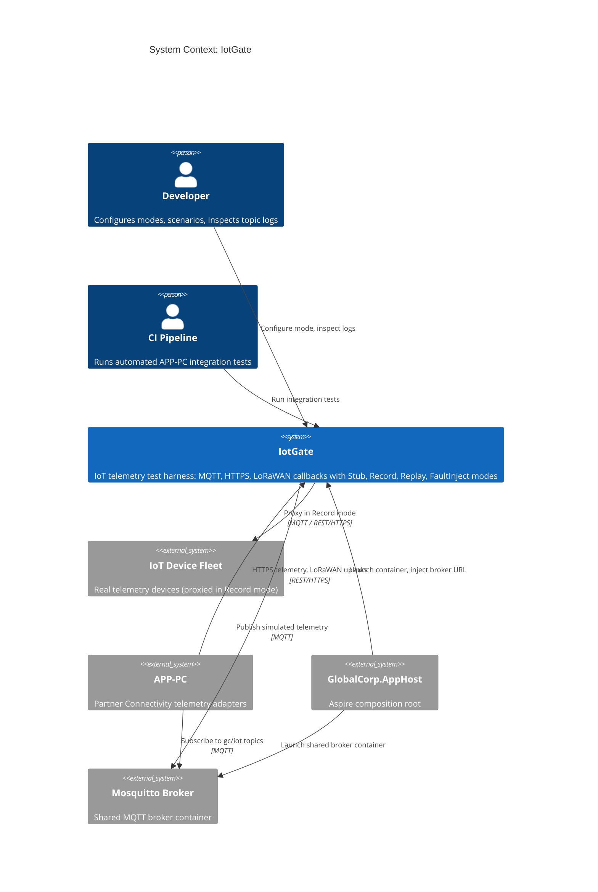
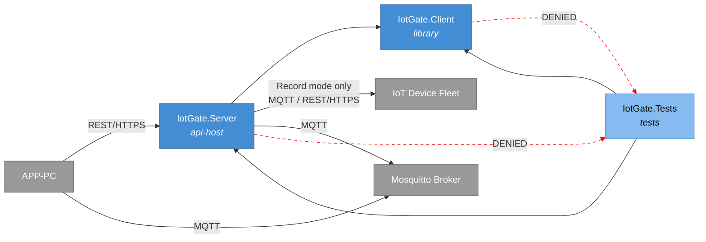
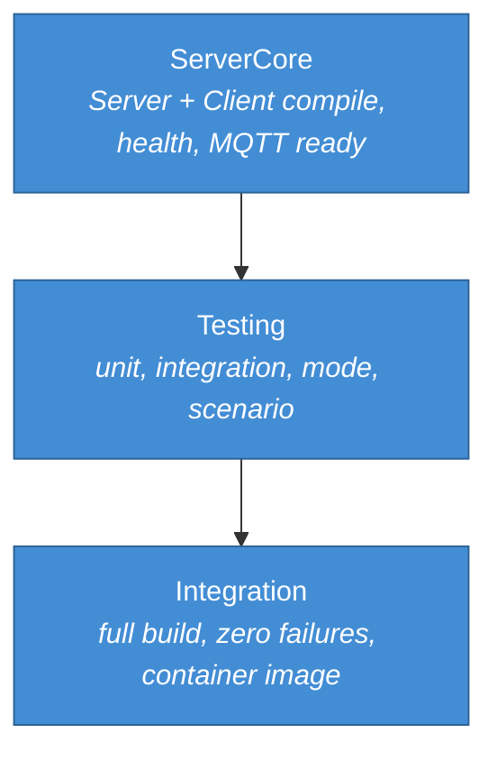
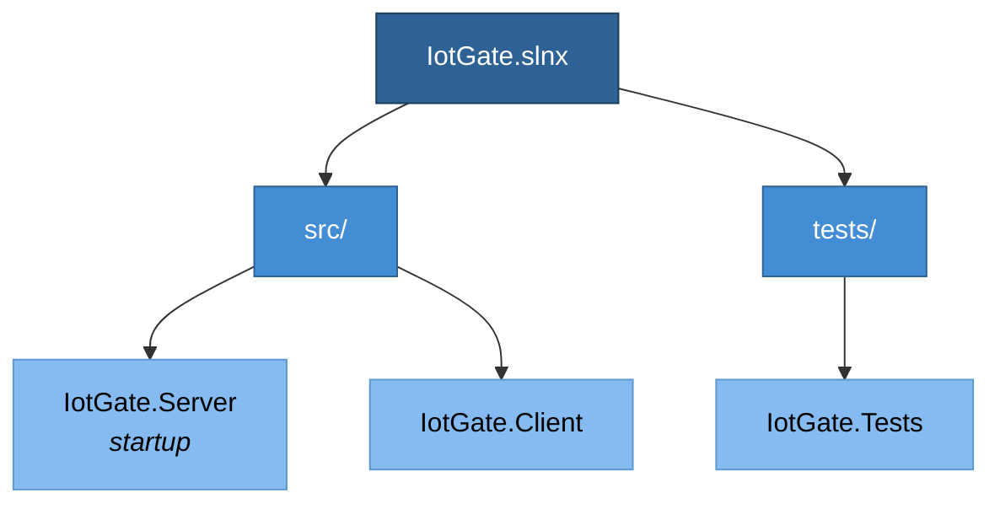
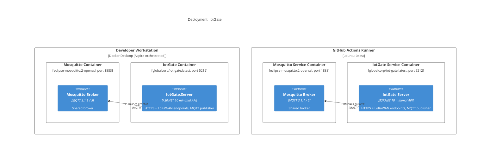
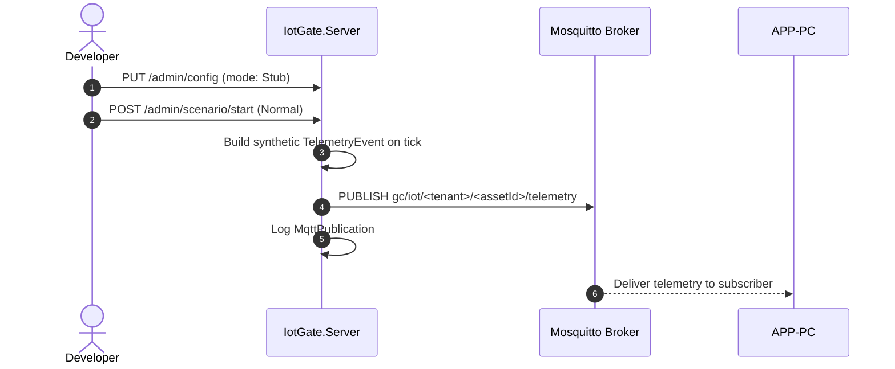
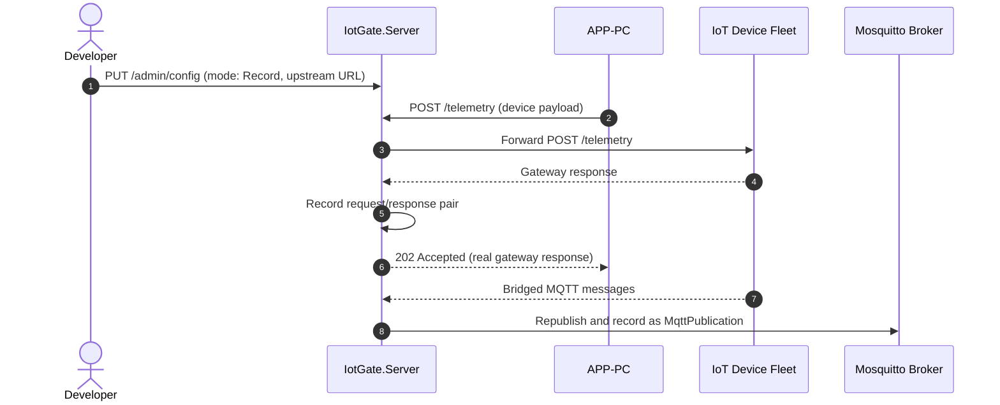
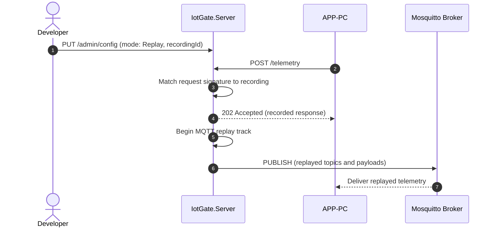
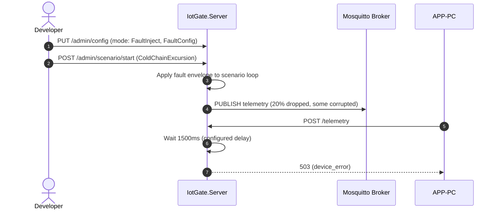

# IotGate -- System Specification

## Tracking

| Field | Value |
|---|---|
| slug | iot-gate |
| itemType | SystemSpec |
| name | IotGate |
| shortDescription | Test harness that mimics IoT device telemetry sources (MQTT, HTTPS, LoRaWAN callbacks) for Global Corp Partner Connectivity (APP-PC) integration testing |
| version | 1 |
| specLangVersion | 0.1.0 |
| publishStatus | Draft |
| retentionPolicy | indefinite |
| freshnessSla | P90D |
| lastReviewed | 2026-04-18 |
| authors | [PER-01 Lena Brandt] |
| reviewers | [PER-03 Maria Oliveira] |
| committer | PER-01 Lena Brandt |
| tags | [gate, simulator, iot, mqtt, lorawan, local-simulation-first] |
| createdAt | 2026-04-18T00:00:00Z |
| updatedAt | 2026-04-18T00:00:00Z |
| Dependencies | [global-corp.architecture.spec.md](./global-corp.architecture.spec.md), [app-pc.partner-connectivity.spec.md](./app-pc.partner-connectivity.spec.md), [aspire-apphost.spec.md](./aspire-apphost.spec.md) |
| State | Draft |
| Reviewed | |
| Approved | |
| Executed | |
| Verified | |

This specification describes IotGate, a test harness that mimics the IoT device telemetry sources consumed by the Global Corp Partner Connectivity subsystem (APP-PC). IotGate follows the same Stub, Record, Replay, and FaultInject behavior-mode pattern as the `PayGate` and `SendGate` sample gates. It exposes an MQTT broker, an HTTPS telemetry ingestion endpoint, and a LoRaWAN gateway callback endpoint, so APP-PC adapters can be exercised end-to-end without physical devices or third-party cloud IoT services.

IotGate bundles an Eclipse Mosquitto broker alongside an ASP.NET 10 minimal API server that drives the broker and serves the HTTPS endpoints. A typed .NET client library, `IotGate.Client`, wraps the management API so test projects can configure scenarios, inject events, and inspect the MQTT topic log from C# code. The container image `globalcorp/iot-gate:latest` is orchestrated by the Global Corp Aspire AppHost alongside the shared `mosquitto` broker resource.

IotGate is consumed by APP-PC telemetry adapters during local development and CI integration tests. It is a test-time component only. It never runs in staging or production. APP-PC routes its device-ingestion base URL and MQTT broker address to the IotGate-backed endpoints by configuration.

## Context

```spec
person Developer {
    description: "A Global Corp platform engineer developing or debugging
                  APP-PC telemetry adapters against a deterministic
                  IoT source instead of real devices.";
    @tag("internal", "test");
}

person CIPipeline {
    description: "Automated CI/CD pipeline that runs APP-PC integration
                  tests against IotGate to validate MQTT, HTTPS, and
                  LoRaWAN ingestion paths without device hardware.";
    @tag("automation", "test");
}

external system IoTDeviceFleet {
    description: "Real-world fleet of telemetry-producing devices:
                  refrigerated container sensors, pallet shock sensors,
                  GPS trackers, and LoRaWAN asset tags. IotGate mimics
                  their protocol surfaces in all modes except Record.";
    technology: "MQTT 3.1.1 / MQTT 5 / HTTPS / LoRaWAN uplink callbacks";
    @tag("iot", "external");
}

external system APP-PC {
    description: "Global Corp Partner Connectivity subsystem. Consumes
                  telemetry from MQTT, HTTPS, and LoRaWAN endpoints. In
                  test configuration it points at IotGate at the same
                  protocol endpoints.";
    technology: "MQTT, REST/HTTPS";
    @tag("consumer", "internal");
}

external system GlobalCorpAppHost {
    description: "The Global Corp Aspire AppHost that declares IotGate
                  and the shared mosquitto broker as container resources
                  and wires APP-PC to them via connection bindings.";
    technology: ".NET Aspire 13.2 DistributedApplication";
    @tag("orchestrator", "internal");
}

external system MosquittoBroker {
    description: "The shared eclipse-mosquitto:2-openssl container
                  declared by the AppHost. IotGate.Server publishes
                  simulated telemetry to it. APP-PC subscribes to the
                  same broker to receive telemetry.";
    technology: "MQTT 3.1.1 / MQTT 5";
    @tag("infrastructure", "shared");
}

Developer -> IotGate.Server : "Configures mode and scenario, inspects topic log.";

CIPipeline -> IotGate.Server : "Runs automated APP-PC integration tests.";

APP-PC -> IotGate.Server {
    description: "Receives HTTPS telemetry and LoRaWAN uplinks directly.";
    technology: "REST/HTTPS";
}

APP-PC -> MosquittoBroker {
    description: "Subscribes to gc/iot/# topics for MQTT telemetry.";
    technology: "MQTT";
}

IotGate.Server -> MosquittoBroker {
    description: "Publishes simulated telemetry messages to configured topics.";
    technology: "MQTT";
}

IotGate.Server -> IoTDeviceFleet {
    description: "Proxies to real device gateways in Record mode only.";
    technology: "MQTT / REST/HTTPS";
}

GlobalCorpAppHost -> IotGate.Server : "Launches the container and injects the broker connection string.";
GlobalCorpAppHost -> MosquittoBroker : "Declares and launches the shared broker container.";
```

Rendered system context:



## System Declaration

```spec
system IotGate {
    target: "net10.0";
    responsibility: "Test harness that mimics the IoT device telemetry
                     sources consumed by APP-PC. Drives a shared
                     Mosquitto broker with simulated MQTT telemetry,
                     accepts HTTPS device ingestion, and handles
                     LoRaWAN gateway uplink callbacks. Supports four
                     behavior modes: Stub, Record, Replay, FaultInject.
                     Enables APP-PC integration testing without device
                     hardware or third-party cloud IoT services.";

    authored component IotGate.Server {
        kind: "api-host";
        path: "src/IotGate.Server";
        status: new;
        responsibility: "ASP.NET 10 minimal API that exposes the HTTPS
                         ingestion endpoint, the LoRaWAN uplink callback
                         endpoint, and the management endpoints. Owns
                         an MQTT client that publishes simulated
                         telemetry to the shared Mosquitto broker.
                         Routes every incoming request through the
                         active behavior mode.";
        contract {
            guarantees "Exposes POST /telemetry and POST /lorawan/uplink
                        matching the request and response shapes that
                        APP-PC adapters expect from real device
                        gateways.";
            guarantees "Publishes MQTT messages to gc/iot/<tenant>/<assetId>/telemetry
                        and gc/iot/<tenant>/<assetId>/status topics when
                        driven by a running scenario or manual
                        InjectEvent call.";
            guarantees "Behavior mode is switchable at runtime via the
                        management API without restarting the container.";
            guarantees "Every incoming HTTPS request, every outgoing
                        HTTPS response, and every MQTT publication is
                        captured in an in-memory log accessible via the
                        management API.";
            guarantees "Scenarios start and stop deterministically. A
                        running scenario emits its event sequence at
                        the configured cadence until stopped or until
                        a non-loop scenario completes.";
        }
    }

    authored component IotGate.Client {
        kind: library;
        path: "src/IotGate.Client";
        status: new;
        responsibility: "A .NET client library that wraps the IotGate
                         management API. APP-PC test projects use it
                         to configure behavior modes, start and stop
                         scenarios, inject single events, and inspect
                         the MQTT and HTTPS log. Not used by APP-PC
                         production code.";
        contract {
            guarantees "Public API surface exposes ConfigureMode,
                        StartScenario, StopScenario, InjectEvent,
                        GetRequestLog, and GetMqttLog methods.";
            guarantees "Targets IotGate.Server by default. The base URL
                        is configurable for Aspire-injected endpoints.";
            guarantees "Serializes scenario definitions and fault
                        configs to JSON that matches the server's
                        accepted shapes.";
        }

        rationale {
            context "Test code needs programmatic access to the gate's
                     scenario, mode, and log surfaces. Calling the
                     management API directly with HttpClient in every
                     test would duplicate serialization and routing
                     logic.";
            decision "A dedicated typed client library provides a
                      single place for management-API DTOs and
                      routing. Test projects reference it and register
                      it in DI.";
            consequence "APP-PC.Tests depends on IotGate.Client.
                         APP-PC production projects do not reference
                         IotGate.Client; they only see the Mosquitto
                         broker and the HTTPS/LoRaWAN endpoints, which
                         are identical in shape to real devices.";
        }
    }

    authored component IotGate.Tests {
        kind: tests;
        path: "tests/IotGate.Tests";
        status: new;
        responsibility: "Integration and unit tests for IotGate.Server
                         and IotGate.Client. Verifies each behavior
                         mode, each scenario, the MQTT publication
                         log, the HTTPS request log, LoRaWAN callback
                         handling, fault injection, and client parity
                         with the management API surface.";
    }

    consumed component xunit {
        source: nuget("xunit");
        version: "2.*";
        responsibility: "Unit and integration testing framework.";
        used_by: [IotGate.Tests];
    }

    consumed component TestHost {
        source: nuget("Microsoft.AspNetCore.Mvc.Testing");
        version: "10.*";
        responsibility: "In-process test server for ASP.NET minimal
                         API integration testing.";
        used_by: [IotGate.Tests];
    }

    consumed component MQTTnet {
        source: nuget("MQTTnet");
        version: "4.*";
        responsibility: "MQTT client library used by IotGate.Server to
                         publish simulated telemetry to the shared
                         Mosquitto broker.";
        used_by: [IotGate.Server];
    }

    consumed component MQTTnet.Extensions.ManagedClient {
        source: nuget("MQTTnet.Extensions.ManagedClient");
        version: "4.*";
        responsibility: "Managed MQTT client with reconnect and queue
                         semantics appropriate for a long-running
                         scenario loop.";
        used_by: [IotGate.Server];
    }
}
```

## Data Specification

### Enums

```spec
enum BehaviorMode {
    Stub: "Returns preconfigured synthetic telemetry for all endpoints and publishes scripted MQTT messages",
    Record: "Proxies ingestion requests to a configured upstream device gateway and records all inbound MQTT traffic",
    Replay: "Returns previously recorded HTTPS responses and replays previously recorded MQTT publications matched by asset and topic",
    FaultInject: "Returns configurable error responses to HTTPS and LoRaWAN calls and emits malformed or delayed MQTT messages per the active FaultConfig"
}

enum TelemetryKind {
    Temperature: "Ambient or product temperature reading in degrees Celsius",
    Shock: "Accelerometer peak-g reading indicating handling impact",
    Humidity: "Relative humidity percentage reading",
    Gps: "Latitude and longitude position fix",
    Battery: "Device battery percentage"
}

enum Scenario {
    Normal: "Stable cold-chain telemetry: in-range temperature, low shock, valid GPS track",
    ColdChainExcursion: "Temperature gradually crosses the configured upper threshold and stays above it",
    TamperSpike: "Accelerometer burst above the shock threshold followed by a GPS jump",
    GpsSpoof: "GPS coordinates jump between inconsistent positions inconsistent with physical motion",
    PowerLoss: "Battery drains rapidly and the device stops publishing after the drain completes"
}
```

### Entities

The data model captures the device-compatible telemetry payloads and the internal recording and configuration state.

```spec
entity TelemetryEvent {
    assetId: string;
    tenantId: string;
    kind: TelemetryKind;
    temperature: double?;
    shock: double?;
    humidity: double?;
    gpsLat: double?;
    gpsLong: double?;
    battery: int? @range(0..100);
    timestamp: string;

    invariant "asset required": assetId != "";
    invariant "tenant required": tenantId != "";
    invariant "timestamp required": timestamp != "";
    invariant "gps paired": (gpsLat == null) == (gpsLong == null);

    rationale "kind" {
        context "APP-PC treats every telemetry message as typed by its
                 kind. A single event payload carries one kind at a
                 time to match the MQTT publication model used by the
                 production devices.";
        decision "TelemetryKind is a required discriminator. Only the
                  fields relevant to the kind are populated in any
                  given event instance.";
        consequence "Serializers drop null fields when publishing to
                     MQTT, matching the wire format produced by real
                     devices.";
    }
}

entity MqttPublication {
    id: string;
    topic: string;
    payload: string;
    qos: int @range(0..2) @default(1);
    retain: bool @default(false);
    timestamp: string;

    invariant "id required": id != "";
    invariant "topic required": topic != "";
    invariant "payload required": payload != "";
    invariant "valid qos": qos >= 0 && qos <= 2;
}

entity LoRaUplink {
    devEui: string;
    fPort: int @range(1..255);
    payloadB64: string;
    rssi: int;
    snr: double;
    timestamp: string;

    invariant "devEui required": devEui != "";
    invariant "payload required": payloadB64 != "";
    invariant "valid port": fPort >= 1 && fPort <= 255;
}

entity ScenarioDefinition {
    id: string;
    name: string;
    scenario: Scenario @default(Normal);
    events: string;
    loopMode: bool @default(true);
    tickMs: int @range(10..3600000) @default(1000);

    invariant "id required": id != "";
    invariant "name required": name != "";
    invariant "events required": events != "";
    invariant "positive tick": tickMs > 0;

    rationale "loopMode" {
        context "Some scenarios (Normal, ColdChainExcursion slow
                 ramps) are most useful as continuous background
                 telemetry. Others (TamperSpike) are one-shot events.";
        decision "loopMode controls whether the scenario restarts at
                  the first event after the last event is emitted.";
        consequence "Tests choose loop vs one-shot behavior per
                     scenario. StopScenario always terminates the
                     current run.";
    }
}

entity IotGateRequest {
    id: string;
    timestamp: string;
    channel: string;
    method: string;
    path: string;
    body: string?;
    headers: string?;

    invariant "id required": id != "";
    invariant "channel required": channel != "";
    invariant "path required": path != "";
}

entity IotGateResponse {
    id: string;
    requestId: string;
    statusCode: int @range(100..599);
    body: string?;
    latencyMs: int;

    invariant "id required": id != "";
    invariant "request reference": requestId != "";
    invariant "valid status code": statusCode >= 100;
}

entity FaultConfig {
    statusCode: int @range(400..599) @default(500);
    errorType: string @default("device_error");
    errorMessage: string @default("Simulated IotGate fault");
    delayMs: int @range(0..30000) @default(0);
    corruptMqtt: bool @default(false);
    dropMqttPercent: int @range(0..100) @default(0);

    invariant "error status code": statusCode >= 400;
    invariant "non-negative delay": delayMs >= 0;
    invariant "drop percent in range": dropMqttPercent >= 0 && dropMqttPercent <= 100;

    rationale "corruptMqtt" {
        context "APP-PC must handle malformed MQTT payloads from
                 misbehaving devices. FaultInject mode needs an
                 explicit toggle that emits schema-invalid payloads
                 on the MQTT channel.";
        decision "corruptMqtt is a boolean toggle. When true, the
                  scenario loop emits payloads that fail schema
                  validation.";
        consequence "APP-PC schema-validation logic can be exercised
                     independently of HTTPS fault injection.";
    }
}
```

## Contracts

### Device-Compatible Endpoints

These contracts define the endpoints whose request and response shapes APP-PC adapters consume as if they were real device gateways.

```spec
contract PublishTelemetry {
    requires assetId != "";
    requires tenantId != "";
    ensures publication.id != "";
    ensures publication.topic matches "gc/iot/<tenantId>/<assetId>/telemetry";
    guarantees "Publishes a TelemetryEvent as an MQTT message on the
                tenant-scoped topic. In Stub mode the payload is
                generated by the active scenario or by an explicit
                InjectEvent call. In Record mode the IotGate broker
                forwards real device traffic to the shared Mosquitto
                broker and records the raw payload. In Replay mode
                previously recorded payloads are republished in
                original order. In FaultInject mode corruptMqtt and
                dropMqttPercent alter publication behavior.";
}

contract IngestHttpsTelemetry {
    requires request.body != "";
    requires request.contentType == "application/json";
    ensures response.statusCode in [200, 202];
    ensures response.body contains assetId;
    guarantees "Accepts a TelemetryEvent JSON payload on POST
                /telemetry, matching the shape that HTTPS-native
                devices send. In Stub mode it always returns 202
                Accepted with a synthetic ingestionId. In Record
                mode it proxies to the configured upstream device
                gateway. In Replay mode it returns the recorded
                response matched by device identity. In FaultInject
                mode it returns the configured fault after the
                configured delay.";
}

contract IngestLoRaUplink {
    requires uplink.devEui != "";
    requires uplink.payloadB64 != "";
    ensures response.statusCode in [200, 202];
    guarantees "Accepts a LoRaWAN Network Server uplink callback on
                POST /lorawan/uplink. The request shape matches the
                common LNS REST callback body used by major gateway
                vendors. Mode behavior follows the same pattern as
                IngestHttpsTelemetry.";
}
```

### Management Endpoints

These contracts define the IotGate-specific configuration and inspection API.

```spec
contract ConfigureMode {
    requires mode in [Stub, Record, Replay, FaultInject];
    ensures activeMode == mode;
    guarantees "Switches the server behavior mode at runtime. When
                switching to FaultInject, an optional FaultConfig
                payload configures the error response, MQTT corruption,
                and drop-rate behavior. When switching to Record, an
                upstream device-gateway base URL must be provided.";
}

contract StartScenario {
    requires scenario.id != "";
    requires scenario.events != "";
    ensures activeScenario.id == scenario.id;
    guarantees "Begins emitting the scenario's event sequence at
                tickMs cadence. If loopMode is true the sequence
                restarts on completion. Only one scenario runs at a
                time; starting a new one stops the previous.";
}

contract StopScenario {
    ensures activeScenario == null;
    guarantees "Stops the currently running scenario. Does not clear
                the MQTT or request log. Safe to call when no
                scenario is running.";
}

contract InjectEvent {
    requires event.assetId != "";
    requires event.tenantId != "";
    ensures publication.topic matches "gc/iot/<tenantId>/<assetId>/telemetry";
    guarantees "Publishes a single TelemetryEvent out of band from any
                running scenario. Useful for precise fault scenarios
                in tests. Respects the active BehaviorMode for all
                downstream effects.";
}

contract GetRequestLog {
    ensures count(entries) >= 0;
    guarantees "Returns all captured IotGateRequest and
                IotGateResponse pairs for HTTPS and LoRaWAN channels
                in chronological order. Supports optional filtering
                by channel and time range. Entries persist for the
                lifetime of the server process.";
}

contract GetMqttLog {
    ensures count(publications) >= 0;
    guarantees "Returns all captured MqttPublication entries in
                chronological order. Supports optional filtering by
                topic glob, asset, and tenant. Entries persist for
                the lifetime of the server process.";
}
```

## Topology

```spec
topology Dependencies {
    allow IotGate.Server -> IotGate.Client;
    allow IotGate.Tests -> IotGate.Server;
    allow IotGate.Tests -> IotGate.Client;

    deny IotGate.Client -> IotGate.Tests;
    deny IotGate.Server -> IotGate.Tests;

    invariant "server has no Global Corp subsystem dependency":
        IotGate.Server does not reference APP-PC;
    invariant "client has no Global Corp subsystem dependency":
        IotGate.Client does not reference APP-PC;

    rationale {
        context "IotGate is a standalone test harness. It must not
                 depend on APP-PC or any other Global Corp subsystem
                 so it can be reused by any project that needs MQTT,
                 HTTPS, or LoRaWAN telemetry simulation.";
        decision "The contract between IotGate and APP-PC is the
                  device-wire shape: MQTT topics, HTTPS payloads,
                  LoRaWAN callback bodies. No compile-time
                  dependency exists between the two systems.";
        consequence "IotGate can be versioned and released
                     independently of APP-PC. Other subsystems or
                     projects can adopt it by configuring their
                     device-ingestion endpoints to point at
                     IotGate.";
    }
}
```

Rendered topology:



## Phases

```spec
phase ServerCore {
    produces: [IotGate.Server, IotGate.Client];

    gate ServerCompile {
        command: "dotnet build src/IotGate.Server";
        expects: "zero errors";
    }

    gate ClientCompile {
        command: "dotnet build src/IotGate.Client";
        expects: "zero errors";
    }

    gate HealthCheck {
        command: "curl -f http://localhost:5212/health";
        expects: "exit_code == 0";
    }

    gate MqttReady {
        command: "curl -f http://localhost:5212/admin/mqtt/status";
        expects: "exit_code == 0";
        rationale "The server must confirm connectivity to the
                   configured Mosquitto broker before APP-PC integration
                   tests can subscribe and expect messages.";
    }
}

phase Testing {
    requires: ServerCore;
    produces: [IotGate.Tests];

    gate UnitTests {
        command: "dotnet test tests/IotGate.Tests --filter Category=Unit";
        expects: "all tests pass", pass >= 12;
    }

    gate IntegrationTests {
        command: "dotnet test tests/IotGate.Tests --filter Category=Integration";
        expects: "all tests pass", pass >= 10;
    }

    gate ModeTests {
        command: "dotnet test tests/IotGate.Tests --filter Category=Mode";
        expects: "all tests pass", pass >= 4;
        rationale "One test per behavior mode confirms that mode
                   switching and mode-specific routing work correctly
                   across HTTPS, MQTT, and LoRaWAN channels.";
    }

    gate ScenarioTests {
        command: "dotnet test tests/IotGate.Tests --filter Category=Scenario";
        expects: "all tests pass", pass >= 5;
        rationale "One test per Scenario enum value confirms the
                   scripted event sequences produce the expected
                   MQTT publication pattern.";
    }
}

phase Integration {
    requires: Testing;

    gate FullBuild {
        command: "dotnet build IotGate.slnx";
        expects: "zero errors";
    }

    gate AllTests {
        command: "dotnet test IotGate.slnx";
        expects: "all tests pass", fail == 0;
    }

    gate ContainerImage {
        command: "docker build -t globalcorp/iot-gate:latest src/IotGate.Server";
        expects: "exit_code == 0";
    }

    rationale "Final gate confirms the solution builds, every test
               passes, and the container image is publishable before
               the spec can advance to Verified.";
}
```

Rendered phase ordering:



## Traces

```spec
trace TelemetryFlow {
    PublishTelemetry -> [IotGate.Server, IotGate.Client];
    IngestHttpsTelemetry -> [IotGate.Server, IotGate.Client];
    IngestLoRaUplink -> [IotGate.Server, IotGate.Client];
    ConfigureMode -> [IotGate.Server, IotGate.Client];
    StartScenario -> [IotGate.Server, IotGate.Client];
    StopScenario -> [IotGate.Server, IotGate.Client];
    InjectEvent -> [IotGate.Server, IotGate.Client];
    GetRequestLog -> [IotGate.Server, IotGate.Client];
    GetMqttLog -> [IotGate.Server, IotGate.Client];

    invariant "full coverage":
        all sources have count(targets) >= 1;
    invariant "server always involved":
        all sources have targets contains IotGate.Server;
}

trace DataModel {
    TelemetryEvent -> [IotGate.Server, IotGate.Client];
    MqttPublication -> [IotGate.Server, IotGate.Client];
    LoRaUplink -> [IotGate.Server, IotGate.Client];
    ScenarioDefinition -> [IotGate.Server, IotGate.Client];
    IotGateRequest -> [IotGate.Server];
    IotGateResponse -> [IotGate.Server];
    FaultConfig -> [IotGate.Server, IotGate.Client];
    BehaviorMode -> [IotGate.Server, IotGate.Client];
    TelemetryKind -> [IotGate.Server, IotGate.Client];
    Scenario -> [IotGate.Server, IotGate.Client];
}
```

## System-Level Constraints

```spec
constraint NoGlobalCorpSubsystemDependency {
    scope: [IotGate.Server, IotGate.Client];
    rule: "No references to any Global Corp subsystem namespace or
           assembly (APP-PC, APP-EB, APP-TC, or any other app-*).
           IotGate communicates with APP-PC only at the MQTT, HTTPS,
           and LoRaWAN boundaries.";

    rationale {
        context "IotGate must remain a general-purpose IoT-device
                 test harness, reusable by any project that needs
                 simulated telemetry.";
        decision "No compile-time coupling to Global Corp subsystem
                  contracts. The contract is the device-wire shape.";
        consequence "IotGate can be extracted to a separate
                     repository and published as an independent
                     tool. Adoption requires only endpoint
                     configuration.";
    }
}

constraint NullableEnabled {
    scope: all authored components;
    rule: "Nullable reference types are enabled in every project
           file. No suppression operators (!) outside of test setup
           code.";
}

constraint InMemoryOnly {
    scope: [IotGate.Server];
    rule: "All state (HTTPS request logs, MQTT publication logs,
           recorded responses, active scenario, fault config) is
           held in memory. No database, no file system persistence.
           State resets when the server process restarts. Scenario
           definitions may be seeded from embedded resources at
           startup; runtime edits are in memory only.";

    rationale {
        context "IotGate is a test-time tool, not a production
                 service. Persistent state would add complexity
                 without benefit.";
        decision "In-memory collections with no external storage
                  dependencies.";
        consequence "Each test run starts with a clean state.
                     Long-running recording sessions should export
                     logs via GetRequestLog and GetMqttLog before
                     stopping the server.";
    }
}

constraint ShapeParity {
    scope: [IotGate.Server];
    rule: "Request and response JSON shapes for POST /telemetry and
           POST /lorawan/uplink must match the payload shapes that
           APP-PC expects from the production device gateways.
           Field names use the casing documented by the respective
           gateway vendors (snake_case for LoRaWAN callbacks,
           camelCase for internal telemetry). MQTT topic structure
           uses the documented gc/iot/<tenant>/<assetId>/<kind>
           layout.";

    rationale "Shape parity ensures that APP-PC adapter code runs
               identically against IotGate and real devices without
               conditional logic or adapter layers.";
}

constraint TestNaming {
    scope: [IotGate.Tests];
    rule: "Test methods follow MethodName_Scenario_ExpectedResult
           naming. Test classes mirror the source class name with a
           Tests suffix.";
}
```

## Package Policy

IotGate inherits the enterprise `weakRef<PackagePolicy>(GlobalCorpPolicy)` declared in [`global-corp.architecture.spec.md`](./global-corp.architecture.spec.md) Section 8. No subsystem-local allowances beyond the MQTTnet packages declared in System Declaration are required. The MQTTnet packages fall under the enterprise policy's `messaging` category and require no extra rationale.

## Platform Realization

```spec
dotnet solution IotGate {
    format: slnx;
    startup: IotGate.Server;

    folder "src" {
        projects: [IotGate.Server, IotGate.Client];
    }

    folder "tests" {
        projects: [IotGate.Tests];
    }

    rationale {
        context "IotGate is a small, focused gate solution with two
                 source projects and one test project, matching the
                 structure of PayGate and SendGate.";
        decision "IotGate.Server is the startup project. It serves
                  the HTTPS and LoRaWAN endpoints, drives the MQTT
                  client, and exposes the management API on a single
                  configurable port.";
        consequence "Running dotnet run from the Server project
                     starts the harness. The default HTTP port is
                     5212; MQTT traffic is published to the shared
                     Mosquitto broker at the configured address.";
    }
}
```

Rendered solution structure:



## Deployment

```spec
deployment Development {
    node "Developer Workstation" {
        technology: "Docker Desktop";

        node "Mosquitto Container" {
            technology: "eclipse-mosquitto:2-openssl";
            instance: MosquittoBroker;
            port: 1883;
            notes: "Shared broker container declared by the Aspire
                    AppHost. IotGate publishes to it; APP-PC
                    subscribes to it.";
        }

        node "IotGate Container" {
            technology: ".NET 10 SDK";
            instance: IotGate.Server;
            port: 5212;
            image: "globalcorp/iot-gate:latest";
            depends_on: [MosquittoBroker];
            environment: {
                "IOTGATE__Mqtt__BrokerHost": "mosquitto",
                "IOTGATE__Mqtt__BrokerPort": "1883"
            };
        }
    }

    rationale "IotGate runs as a Docker container on the developer
               workstation, orchestrated by the Global Corp Aspire
               AppHost. The AppHost also launches the shared
               Mosquitto broker container and injects its address
               into IotGate via environment variables. APP-PC reads
               the same broker address via Aspire connection
               bindings.";
}

deployment CI {
    node "GitHub Actions Runner" {
        technology: "ubuntu-latest";

        node "Mosquitto Service Container" {
            technology: "eclipse-mosquitto:2-openssl";
            instance: MosquittoBroker;
            port: 1883;
        }

        node "IotGate Service Container" {
            technology: ".NET 10 SDK, Docker";
            instance: IotGate.Server;
            port: 5212;
            image: "globalcorp/iot-gate:latest";
            depends_on: [MosquittoBroker];
        }
    }

    rationale {
        context "APP-PC integration tests in CI need a running
                 IotGate and a Mosquitto broker to validate MQTT,
                 HTTPS, and LoRaWAN paths.";
        decision "Both IotGate and Mosquitto run as service
                  containers in GitHub Actions. The APP-PC test
                  step reads IotGate and broker addresses from the
                  Aspire-style environment variables.";
        consequence "CI tests exercise the same code paths as
                     production APP-PC without requiring real
                     devices or third-party cloud IoT access.";
    }
}
```

Rendered deployment:



## Views

```spec
view systemContext of IotGate ContextView {
    include: all;
    autoLayout: top-down;
    description: "IotGate with its users (Developer, CI Pipeline)
                  and external systems (IoT Device Fleet, APP-PC,
                  Mosquitto broker, GlobalCorp.AppHost).";
}

view container of IotGate ContainerView {
    include: all;
    autoLayout: left-right;
    description: "Internal structure showing IotGate.Server,
                  IotGate.Client, IotGate.Tests, their consumed
                  MQTTnet dependencies, and the bound Mosquitto
                  broker.";
}

view deployment of Development DevelopmentDeploymentView {
    include: all;
    autoLayout: top-down;
    description: "Developer workstation running IotGate alongside
                  the Mosquitto broker container under Aspire
                  orchestration.";
    @tag("dev");
}

view deployment of CI CIDeploymentView {
    include: all;
    autoLayout: top-down;
    description: "GitHub Actions runner with IotGate and Mosquitto
                  service containers for APP-PC integration tests.";
    @tag("ci");
}
```

## Dynamic Scenarios

### Stub Mode: Normal Cold-Chain Telemetry

A developer configures IotGate in Stub mode and starts the Normal scenario. IotGate publishes stable in-range temperature, shock, humidity, and GPS telemetry on the tenant topic while APP-PC subscribes and ingests.

```spec
dynamic StubMode {
    1: Developer -> IotGate.Server {
        description: "PUT /admin/config with BehaviorMode=Stub.";
        technology: "REST/HTTPS";
    };
    2: Developer -> IotGate.Server {
        description: "POST /admin/scenario/start with scenario=Normal.";
        technology: "REST/HTTPS";
    };
    3: IotGate.Server -> IotGate.Server
        : "Begins scenario tick loop. Each tick constructs a synthetic
           TelemetryEvent for the configured asset set.";
    4: IotGate.Server -> MosquittoBroker {
        description: "Publishes TelemetryEvent JSON on gc/iot/<tenant>/<assetId>/telemetry.";
        technology: "MQTT";
    };
    5: IotGate.Server -> IotGate.Server
        : "Logs MqttPublication to in-memory MQTT log.";
    6: APP-PC -> MosquittoBroker {
        description: "Subscribed to gc/iot/#; receives telemetry.";
        technology: "MQTT";
    };
}
```

Rendered interaction sequence:



### Record Mode: Capturing Live Device Traffic

A developer points IotGate at a real upstream device gateway and exercises APP-PC. IotGate proxies the HTTPS traffic and bridges the upstream MQTT stream to the shared broker, recording both channels for later replay.

```spec
dynamic RecordMode {
    1: Developer -> IotGate.Server {
        description: "PUT /admin/config with BehaviorMode=Record and
                      the upstream device-gateway base URL plus MQTT
                      bridge credentials.";
        technology: "REST/HTTPS";
    };
    2: APP-PC -> IotGate.Server {
        description: "POST /telemetry with device payload.";
        technology: "REST/HTTPS";
    };
    3: IotGate.Server -> IoTDeviceFleet {
        description: "Forwards the POST to the upstream device gateway.";
        technology: "REST/HTTPS";
    };
    4: IoTDeviceFleet -> IotGate.Server
        : "Returns the real gateway response.";
    5: IotGate.Server -> IotGate.Server
        : "Records the IotGateRequest and IotGateResponse pair keyed by
           device identity and topic.";
    6: IotGate.Server -> APP-PC {
        description: "Returns the upstream response unmodified.";
        technology: "REST/HTTPS";
    };
    7: IoTDeviceFleet -> IotGate.Server
        : "Bridged MQTT messages from upstream.";
    8: IotGate.Server -> MosquittoBroker {
        description: "Republishes the bridged MQTT message and records it.";
        technology: "MQTT";
    };
}
```

Rendered interaction sequence:



### Replay Mode: Deterministic Playback

APP-PC integration tests run against a previously recorded session. IotGate replays HTTPS responses and MQTT publications in their original order and timing without any upstream network calls.

```spec
dynamic ReplayMode {
    1: Developer -> IotGate.Server {
        description: "PUT /admin/config with BehaviorMode=Replay and
                      the recording identifier.";
        technology: "REST/HTTPS";
    };
    2: APP-PC -> IotGate.Server {
        description: "POST /telemetry with a request matching a
                      recorded entry.";
        technology: "REST/HTTPS";
    };
    3: IotGate.Server -> IotGate.Server
        : "Matches the request signature against recorded entries.";
    4: IotGate.Server -> APP-PC {
        description: "Returns the recorded response.";
        technology: "REST/HTTPS";
    };
    5: IotGate.Server -> IotGate.Server
        : "Begins replaying the MQTT publication track from the
           recording in original order at original cadence.";
    6: IotGate.Server -> MosquittoBroker {
        description: "Publishes each recorded MqttPublication on its
                      original topic.";
        technology: "MQTT";
    };
    7: MosquittoBroker -> APP-PC {
        description: "Delivers replayed telemetry to the subscriber.";
        technology: "MQTT";
    };
}
```

Rendered interaction sequence:



### FaultInject Mode: Cold-Chain Excursion With Malformed Payloads

A developer runs the ColdChainExcursion scenario with a FaultConfig that also corrupts 20% of MQTT publications and delays HTTPS responses. APP-PC must continue to ingest valid messages, quarantine corrupt ones, and tolerate the HTTPS latency.

```spec
dynamic FaultInjectMode {
    1: Developer -> IotGate.Server {
        description: "PUT /admin/config with BehaviorMode=FaultInject
                      and FaultConfig specifying 503, delayMs=1500,
                      corruptMqtt=true, dropMqttPercent=20.";
        technology: "REST/HTTPS";
    };
    2: Developer -> IotGate.Server {
        description: "POST /admin/scenario/start with
                      scenario=ColdChainExcursion.";
        technology: "REST/HTTPS";
    };
    3: IotGate.Server -> IotGate.Server
        : "Begins scenario tick loop with fault envelope applied to
           both channels.";
    4: IotGate.Server -> MosquittoBroker {
        description: "Publishes TelemetryEvent per tick. 20% of
                      publications are suppressed; of the remaining,
                      a subset carry corrupted payloads.";
        technology: "MQTT";
    };
    5: APP-PC -> IotGate.Server {
        description: "POST /telemetry from a legacy HTTPS device.";
        technology: "REST/HTTPS";
    };
    6: IotGate.Server -> IotGate.Server
        : "Waits for delayMs (1500ms) before returning.";
    7: IotGate.Server -> APP-PC {
        description: "Returns 503 with the configured error body.";
        technology: "REST/HTTPS";
    };
}
```

Rendered interaction sequence:



## Open Items

- The concrete wire format for LoRaWAN uplink callbacks varies by Network Server vendor (ChirpStack, The Things Stack, Actility). The initial `POST /lorawan/uplink` shape will follow the ChirpStack v4 HTTP integration body. A follow-up decision will determine whether additional vendor profiles ship in v1 or in a later minor release.
- Device-profile payload decoders (PR2, CayenneLPP, vendor-specific) are out of scope for v1. The server treats `payloadB64` as opaque in Stub and Record modes and ships a CayenneLPP decoder as a non-default FaultInject add-on only.
- Whether IotGate should expose a secondary MQTT listener of its own (in addition to using the shared `mosquitto` container) is deferred. Present deployment uses the shared broker exclusively. A private listener would only be added if AppHost-level isolation between gates becomes a requirement.
- Long-running Record sessions exceeding available memory are not supported in v1 because of the InMemoryOnly constraint. A future rolling-export hook to object storage is noted for a later revision.
