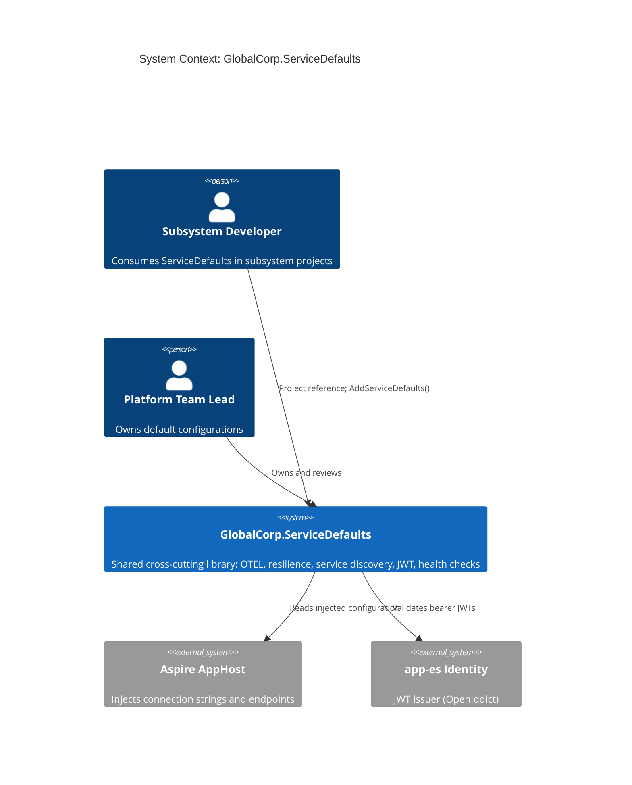

# Global Corp ServiceDefaults -- System Specification

## Tracking

| Field | Value |
|---|---|
| slug | service-defaults |
| itemType | SystemSpec |
| name | Global Corp ServiceDefaults |
| shortDescription | Shared cross-cutting library referenced by every Global Corp .NET project; standardizes OpenTelemetry wiring, resilience policies, service discovery, JWT bearer validation, and health-check conventions |
| version | 1 |
| specLangVersion | 0.1.0 |
| publishStatus | Draft |
| retentionPolicy | indefinite |
| freshnessSla | P90D |
| lastReviewed | 2026-04-18 |
| authors | [PER-01 Lena Brandt] |
| reviewers | [PER-11 Anja Petersen] |
| committer | PER-01 Lena Brandt |
| tags | [platform, aspire, observability, resilience, auth, local-simulation-first] |
| createdAt | 2026-04-18T00:00:00Z |
| updatedAt | 2026-04-18T00:00:00Z |
| Dependencies | global-corp.architecture.spec.md |
| State | Draft |
| Reviewed | |
| Approved | |
| Executed | |
| Verified | |

This specification describes `GlobalCorp.ServiceDefaults`, the shared .NET library every subsystem project references. It standardizes the cross-cutting concerns that each project would otherwise duplicate: OpenTelemetry tracing/metrics/logging, HTTP resilience policies, service discovery, JWT bearer authentication against `app-es`, and health-check conventions. Subsystem specs declare `consumed component GlobalCorp.ServiceDefaults` and call `builder.AddServiceDefaults()` in their Program.cs.

The library follows the pattern established by the default Aspire template's `ServiceDefaults` project, with Global Corp-specific extensions: JWT authority configuration bound to `app-es`, standard scope-to-policy mapping, and an ingress/egress authentication pipeline that matches the OpenIddict token shape.

## Context

```spec
person SubsystemDeveloper {
    description: "A platform engineer authoring or maintaining one of
                  the 11 Global Corp subsystem projects (app-es,
                  app-so, app-pc, app-eb, app-tc, app-dp, app-oi,
                  app-cx-api, app-cx-portal, app-cc, app-sd).";
    @tag("internal", "primary-user");
}

person PlatformTeamLead {
    description: "The PER-01 platform team lead who owns the
                  enterprise cross-cutting concerns and reviews
                  changes to the shared ServiceDefaults library.";
    @tag("internal", "owner");
}

external system AspireAppHost {
    description: "The AppHost composition root that resolves
                  connection strings, service discovery entries,
                  and OpenTelemetry export endpoints at runtime
                  and passes them to each project via configuration.";
    technology: ".NET Aspire 13.2 host";
    @tag("internal", "peer-spec");
}

external system AppEsIdentity {
    description: "The OpenIddict-based identity server hosted by
                  app-es. ServiceDefaults configures JWT bearer
                  validation against this authority.";
    technology: "OpenIddict on ASP.NET Core";
    @tag("internal", "peer-subsystem");
}

SubsystemDeveloper -> ServiceDefaults : "References the NuGet or project reference; calls builder.AddServiceDefaults().";

PlatformTeamLead -> ServiceDefaults : "Owns the default configurations; reviews changes.";

ServiceDefaults -> AspireAppHost : "Reads configuration injected by the AppHost (connection strings, OTEL endpoints, service-discovery entries).";

ServiceDefaults -> AppEsIdentity : "Validates bearer JWTs issued by app-es per standard scopes.";
```

Rendered system context:



## System Declaration

```spec
system ServiceDefaults {
    target: "net10.0";
    responsibility: "Standardize cross-cutting wiring for every
                     Global Corp .NET project. Apply consistent
                     OpenTelemetry, resilience, service discovery,
                     JWT bearer validation, and health-check
                     configuration through a single extension
                     method on the WebApplicationBuilder.";

    authored component GlobalCorp.ServiceDefaults {
        kind: library;
        path: "src/GlobalCorp.ServiceDefaults";
        status: new;
        responsibility: "Razor-compatible .NET library exposing
                         AddServiceDefaults(), MapDefaultEndpoints(),
                         AddGlobalCorpAuthentication(), and
                         AddGlobalCorpAuthorization() extension
                         methods.";
        contract {
            guarantees "AddServiceDefaults() wires OpenTelemetry
                        traces, metrics, and logs to the Aspire
                        Dashboard via OTLP exporter.";
            guarantees "AddServiceDefaults() configures HTTP client
                        resilience: retry with exponential backoff
                        plus jitter, circuit breaker, and timeout
                        policies applied to every named HttpClient.";
            guarantees "AddServiceDefaults() enables service
                        discovery so project references are resolved
                        via the Aspire resource model at runtime.";
            guarantees "AddGlobalCorpAuthentication() registers the
                        JWT bearer handler pointing at app-es
                        authority and expects the standard Global
                        Corp claim shape (gc_tenant, gc_role, scope).";
            guarantees "AddGlobalCorpAuthorization() registers the
                        eight standard scope policies: ShipmentsRead,
                        ShipmentsWrite, ComplianceExport, TenantAdmin,
                        PartnerOnboard, DppPublish, AuditAccess,
                        Internal.";
            guarantees "MapDefaultEndpoints() exposes /health,
                        /alive, and /metrics endpoints required by
                        the Aspire AppHost health model.";
        }
    }

    authored component GlobalCorp.ServiceDefaults.Tests {
        kind: tests;
        path: "tests/GlobalCorp.ServiceDefaults.Tests";
        status: new;
        responsibility: "Unit and integration tests for the extension
                         methods. Verifies that AddServiceDefaults
                         registers the expected services in the DI
                         container, that resilience policies apply to
                         outbound HttpClient calls, that JWT
                         validation rejects malformed tokens, and
                         that the standard scope policies accept or
                         deny as declared.";
    }

    consumed component Microsoft.Extensions.ServiceDiscovery {
        source: nuget("Microsoft.Extensions.ServiceDiscovery");
        version: "10.*";
        responsibility: "Aspire-integrated service discovery primitives.";
        used_by: [GlobalCorp.ServiceDefaults];
    }

    consumed component Microsoft.Extensions.Http.Resilience {
        source: nuget("Microsoft.Extensions.Http.Resilience");
        version: "10.*";
        responsibility: "Built-in HTTP client resilience pipeline.";
        used_by: [GlobalCorp.ServiceDefaults];
    }

    consumed component OpenTelemetry.Extensions.Hosting {
        source: nuget("OpenTelemetry.Extensions.Hosting");
        version: "1.*";
        responsibility: "Hosting-integration for OpenTelemetry SDK.";
        used_by: [GlobalCorp.ServiceDefaults];
    }

    consumed component OpenTelemetry.Exporter.OpenTelemetryProtocol {
        source: nuget("OpenTelemetry.Exporter.OpenTelemetryProtocol");
        version: "1.*";
        responsibility: "OTLP exporter targeting the Aspire Dashboard.";
        used_by: [GlobalCorp.ServiceDefaults];
    }

    consumed component OpenTelemetry.Instrumentation.AspNetCore {
        source: nuget("OpenTelemetry.Instrumentation.AspNetCore");
        version: "1.*";
        responsibility: "Auto-instrumentation for inbound ASP.NET Core requests.";
        used_by: [GlobalCorp.ServiceDefaults];
    }

    consumed component OpenTelemetry.Instrumentation.Http {
        source: nuget("OpenTelemetry.Instrumentation.Http");
        version: "1.*";
        responsibility: "Auto-instrumentation for outbound HttpClient calls.";
        used_by: [GlobalCorp.ServiceDefaults];
    }

    consumed component Microsoft.AspNetCore.Authentication.JwtBearer {
        source: nuget("Microsoft.AspNetCore.Authentication.JwtBearer");
        version: "10.*";
        responsibility: "JWT bearer authentication handler.";
        used_by: [GlobalCorp.ServiceDefaults];
    }

    consumed component Microsoft.Extensions.Diagnostics.HealthChecks {
        source: nuget("Microsoft.Extensions.Diagnostics.HealthChecks");
        version: "10.*";
        responsibility: "Health-check infrastructure.";
        used_by: [GlobalCorp.ServiceDefaults];
    }
}
```

## Data Specification

### Enums

```spec
enum StandardScope {
    ShipmentsRead:     "gc.shipments.read",
    ShipmentsWrite:    "gc.shipments.write",
    ComplianceExport:  "gc.compliance.export",
    TenantAdmin:       "gc.tenant.admin",
    PartnerOnboard:    "gc.partner.onboard",
    DppPublish:        "gc.dpp.publish",
    AuditAccess:       "gc.audit.access",
    Internal:          "gc.internal"
}

enum ResiliencePolicyKind {
    RetryExponentialBackoff: "Up to 3 retries with exponential backoff plus jitter",
    CircuitBreaker:          "5 consecutive failures opens the breaker for 30 seconds",
    Timeout:                 "30 second default per attempt",
    Bulkhead:                "Maximum 100 concurrent requests per named client"
}

enum HealthState {
    Healthy:   "Resource is serving requests normally",
    Degraded:  "Resource is serving but with known issues",
    Unhealthy: "Resource is not serving; dependents should not route traffic"
}
```

### Entities

```spec
entity AuthenticationConfiguration {
    authority: string;                 // The app-es identity base URL
    audience: string @default("gc.api");
    requireHttpsMetadata: bool @default(true);
    clockSkewSeconds: int @range(0..120) @default(30);

    invariant "authority required": authority != "";
    invariant "audience required": audience != "";
}

entity ScopePolicy {
    name: string;                      // For example "ShipmentsRead"
    requiredScope: string;             // For example "gc.shipments.read"
    rationale: string?;

    invariant "name required": name != "";
    invariant "scope required": requiredScope != "";
}

entity ResiliencePolicyConfiguration {
    clientName: string;
    kind: ResiliencePolicyKind;
    parameter: string?;                // serialized policy-specific params

    invariant "client required": clientName != "";
}

entity HealthCheckRegistration {
    name: string;
    tag: string?;                      // readiness or liveness
    timeoutSeconds: int @range(1..60) @default(5);

    invariant "name required": name != "";
}
```

## Contracts

```spec
contract AddServiceDefaults {
    requires builder is a WebApplicationBuilder;
    ensures OpenTelemetry tracing, metrics, and logging are registered;
    ensures HTTP client resilience is applied to every named client;
    ensures service discovery is enabled;
    ensures default health checks are registered;
    guarantees "A single call in Program.cs replaces ~50 lines of
                per-project boilerplate. Return value is the same
                WebApplicationBuilder for fluent chaining.";
}

contract AddGlobalCorpAuthentication {
    requires builder is a WebApplicationBuilder;
    requires configuration contains AppEs:Authority;
    ensures JwtBearer is registered as default authentication scheme;
    ensures tokens are validated against app-es issuer, the gc.api
            audience, and the standard clock-skew tolerance;
    guarantees "Incoming requests with a valid bearer token populate
                HttpContext.User with standard claims: sub, gc_tenant,
                gc_role, scope.";
}

contract AddGlobalCorpAuthorization {
    requires builder is a WebApplicationBuilder;
    ensures each StandardScope is registered as a named policy;
    guarantees "Subsystem controllers or minimal-api endpoints can
                apply [Authorize(Policy = 'ShipmentsRead')] and
                similar without redeclaring the scope check.";
}

contract MapDefaultEndpoints {
    requires app is a WebApplication;
    ensures /health returns 200 when all registered health checks
            are Healthy;
    ensures /alive returns 200 when the process is running;
    ensures /metrics exposes OpenTelemetry metrics in OTLP format;
    guarantees "These endpoints match the Aspire AppHost's health
                polling expectations. Dependent projects observe
                health transitions through Aspire's resource model.";
}
```

## Topology

```spec
topology Dependencies {
    allow every subsystem project -> GlobalCorp.ServiceDefaults;
    allow GlobalCorp.ServiceDefaults -> platform NuGets only;

    deny GlobalCorp.ServiceDefaults -> any subsystem project;
    deny GlobalCorp.ServiceDefaults -> any gate client;

    invariant "no reverse dependencies":
        ServiceDefaults must remain subsystem-agnostic; it may not
        reference app-es, app-so, or any other subsystem project by
        project reference or NuGet dependency;
    rationale: "Breaking this rule would create circular dependencies.
                The library configures authentication against app-es
                but does so through configuration values injected at
                runtime, not through compile-time references.";
}
```

## Phases

```spec
phase Compile {
    produces: [GlobalCorp.ServiceDefaults];
    gate LibraryBuild {
        command: "dotnet build src/GlobalCorp.ServiceDefaults";
        expects: "zero errors, zero warnings";
    }
}

phase Testing {
    requires: Compile;
    produces: [GlobalCorp.ServiceDefaults.Tests];
    gate UnitTests {
        command: "dotnet test tests/GlobalCorp.ServiceDefaults.Tests --filter Category=Unit";
        expects: "all tests pass", pass >= 15;
    }
    gate IntegrationTests {
        command: "dotnet test tests/GlobalCorp.ServiceDefaults.Tests --filter Category=Integration";
        expects: "all tests pass", pass >= 5;
        rationale "Integration tests launch a minimal API with
                   AddServiceDefaults, validate JWT acceptance and
                   rejection, and verify that health endpoints report
                   expected states.";
    }
}

phase PublishPackage {
    requires: Testing;
    gate LocalPack {
        command: "dotnet pack src/GlobalCorp.ServiceDefaults -c Release -o artifacts";
        expects: "GlobalCorp.ServiceDefaults.*.nupkg present";
    }
    rationale "Local pack proves the library can be consumed as a
               NuGet by subsystem solutions that do not share the
               platform solution. Package publishing to a feed is
               a Cloud Production Profile concern.";
}
```

## Traces

```spec
trace AuthenticationConfiguration -> [GlobalCorp.ServiceDefaults];
trace ScopePolicy -> [GlobalCorp.ServiceDefaults];
trace ResiliencePolicyConfiguration -> [GlobalCorp.ServiceDefaults];
trace HealthCheckRegistration -> [GlobalCorp.ServiceDefaults];

trace AddServiceDefaults -> [GlobalCorp.ServiceDefaults];
trace AddGlobalCorpAuthentication -> [GlobalCorp.ServiceDefaults];
trace AddGlobalCorpAuthorization -> [GlobalCorp.ServiceDefaults];
trace MapDefaultEndpoints -> [GlobalCorp.ServiceDefaults];
```

## System-Level Constraints

```spec
constraint SubsystemAgnostic {
    scope: [GlobalCorp.ServiceDefaults];
    rule: "The library depends only on platform NuGets listed in the
           System Declaration. No subsystem project reference. No
           gate client reference.";
    rationale "Otherwise the dependency graph becomes circular.
               Subsystem-specific concerns belong in the owning
               subsystem.";
}

constraint StandardScopeCatalogIsClosed {
    scope: [GlobalCorp.ServiceDefaults];
    rule: "The eight StandardScope values are the authoritative
           catalog. Subsystems that need a new scope must amend this
           spec first, then add the policy registration.";
    rationale "Prevents per-subsystem drift in authorization semantics.
               A reviewer sees every standard scope in one place.";
}

constraint OtelExporterTargetsAspireDashboard {
    scope: [GlobalCorp.ServiceDefaults];
    rule: "In Local Simulation Profile the OTLP exporter targets the
           endpoint injected by the Aspire AppHost. In Cloud
           Production Profile, it targets the configured collector.
           The code path is identical; the endpoint is configuration.";
    rationale "Constraint 2 (cloud-deployable by configuration).
               Changing the telemetry backend is an environment-
               variable change, not a code change.";
}

constraint NullableEnabled {
    scope: all authored components;
    rule: "Nullable reference types are enabled. No suppression
           operators (!) outside test setup code.";
}
```

## Package Policy

ServiceDefaults inherits the enterprise `weakRef<PackagePolicy>(GlobalCorpPolicy)` declared in `global-corp.architecture.spec.md` Section 8. No subsystem-local allowances are required.

## Platform Realization

```spec
dotnet project GlobalCorp.ServiceDefaults {
    format: csproj;
    target: "net10.0";
    output_kind: "library";

    packable: true;
    package_id: "GlobalCorp.ServiceDefaults";
    package_version: "1.0.0";
    package_description: "Shared Global Corp cross-cutting defaults:
                          OpenTelemetry, resilience, service
                          discovery, JWT bearer authentication,
                          health checks.";
}

dotnet project GlobalCorp.ServiceDefaults.Tests {
    format: csproj;
    target: "net10.0";
    output_kind: "test";
    project_references: [GlobalCorp.ServiceDefaults];
}
```

## Deployment

ServiceDefaults is a library consumed by other projects, not a hosted service. It has no standalone deployment. Its behavior is exercised wherever the consuming subsystem is deployed (Local Simulation or Cloud Production).

## Views

```spec
view systemContext of ServiceDefaults ContextView {
    include: all;
    autoLayout: top-down;
    description: "ServiceDefaults as consumed by subsystem developers
                  and the platform lead, with Aspire AppHost and
                  app-es Identity as external dependencies.";
}

view container of ServiceDefaults ContainerView {
    include: all;
    autoLayout: left-right;
    description: "Internal structure of the library and its test
                  project.";
}
```

## Dynamic Scenarios

### Subsystem program startup

```spec
dynamic SubsystemStartup {
    1: subsystem project -> WebApplicationBuilder : "builder.AddServiceDefaults();";
    2: GlobalCorp.ServiceDefaults -> OpenTelemetry : "Register tracer, meter, logger providers with OTLP exporter.";
    3: GlobalCorp.ServiceDefaults -> IHttpClientFactory : "Apply resilience handlers to every registered named client.";
    4: GlobalCorp.ServiceDefaults -> IServiceDiscovery : "Enable Aspire-driven resolution for cross-project HTTP clients.";
    5: GlobalCorp.ServiceDefaults -> IHealthChecksBuilder : "Register default liveness and readiness checks.";
    6: subsystem project -> WebApplicationBuilder : "builder.AddGlobalCorpAuthentication(); builder.AddGlobalCorpAuthorization();";
    7: GlobalCorp.ServiceDefaults -> JwtBearerHandler : "Configure against AppEs:Authority and gc.api audience.";
    8: GlobalCorp.ServiceDefaults -> AuthorizationOptions : "Register eight standard scope policies.";
    9: subsystem project -> WebApplication : "app.MapDefaultEndpoints();";
    10: GlobalCorp.ServiceDefaults -> WebApplication : "Map /health, /alive, /metrics endpoints.";
}
```

### JWT validation pipeline

```spec
dynamic ValidateToken {
    1: client -> subsystem api : "GET /shipments/{id} with Authorization: Bearer <jwt>";
    2: JwtBearerHandler -> app-es Identity : "Fetch jwks if not cached.";
    3: app-es Identity -> JwtBearerHandler : "Return signing keys.";
    4: JwtBearerHandler -> JwtBearerHandler : "Validate issuer, audience, signature, expiry.";
    5: JwtBearerHandler -> HttpContext : "Populate User claims (sub, gc_tenant, gc_role, scope).";
    6: Authorization middleware -> HttpContext : "Check required scope matches the endpoint's policy.";
    7: endpoint handler -> client : "Return resource or 403 depending on scope outcome.";
}
```

## Open Items

- **OTLP exporter endpoint override**: In cloud deployments that do not use the Aspire collector, the library must accept an alternate endpoint via configuration. The implementation-facing question is whether the override is per-subsystem or enterprise-wide. Recommended: enterprise-wide via a `GlobalCorp:Otel:Endpoint` configuration key.
- **Passkey-aware authentication**: OpenIddict's passkey flow differs from the standard code flow at the client side (Blazor WASM portal). ServiceDefaults's authentication wiring is server-side and already covers bearer-token validation regardless of how the token was issued; no change required here. The client-side work lives in the portal spec.
- **Circuit-breaker sensitivity per client**: The default policy applies a 5-failure/30-second breaker uniformly. Some outbound clients (for example the gate-customs client) may need different thresholds. Decide whether per-client overrides are declared in the consuming subsystem's spec or in ServiceDefaults itself.
- **Scope-catalog versioning**: Adding a new StandardScope is a breaking change for any subsystem that caches policy configurations. The SpecChat Versioning Policy applies: bump the library's package version and surface the addition in a change log.
