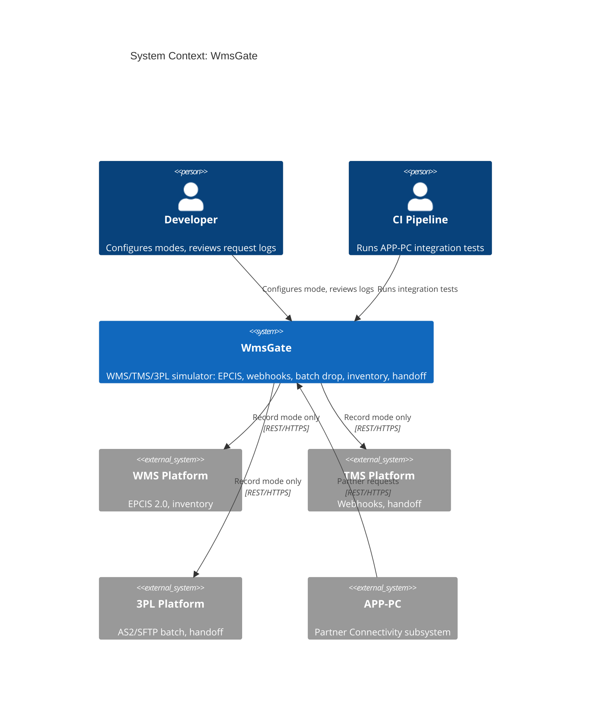
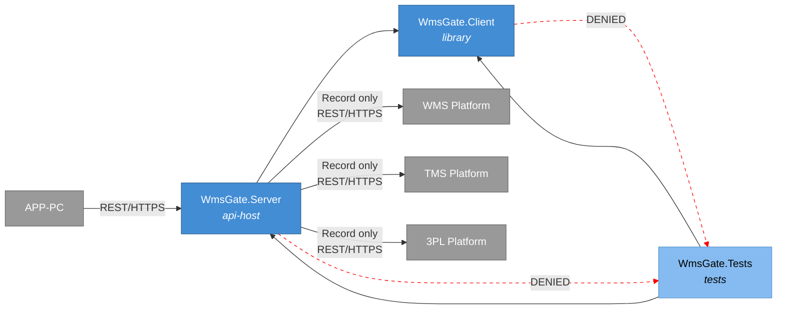
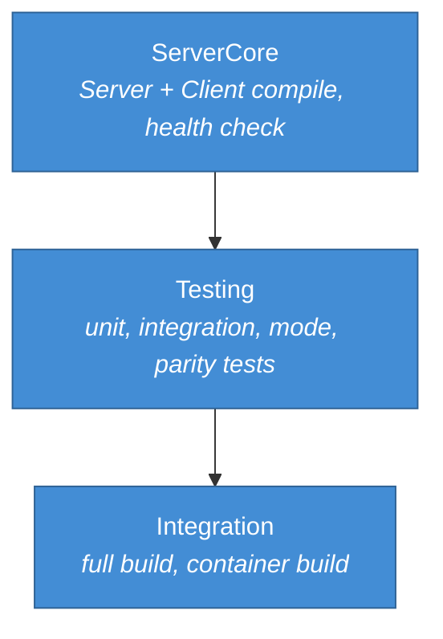
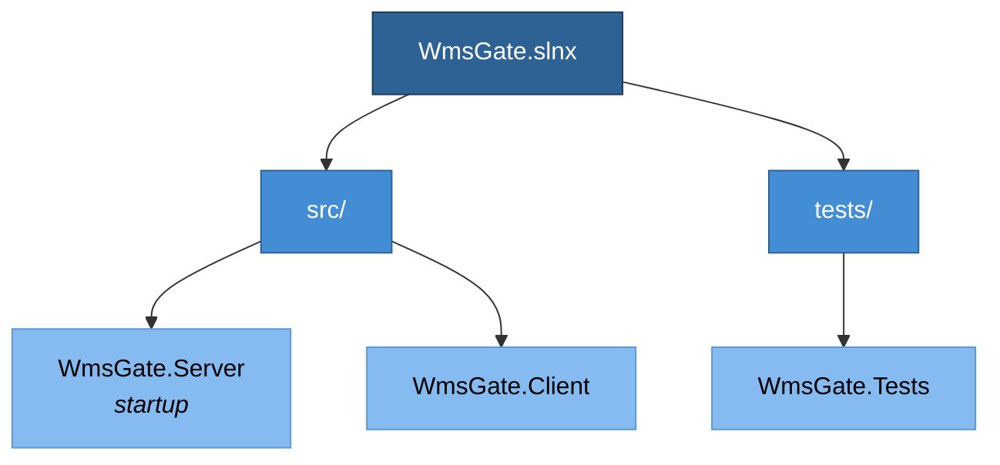
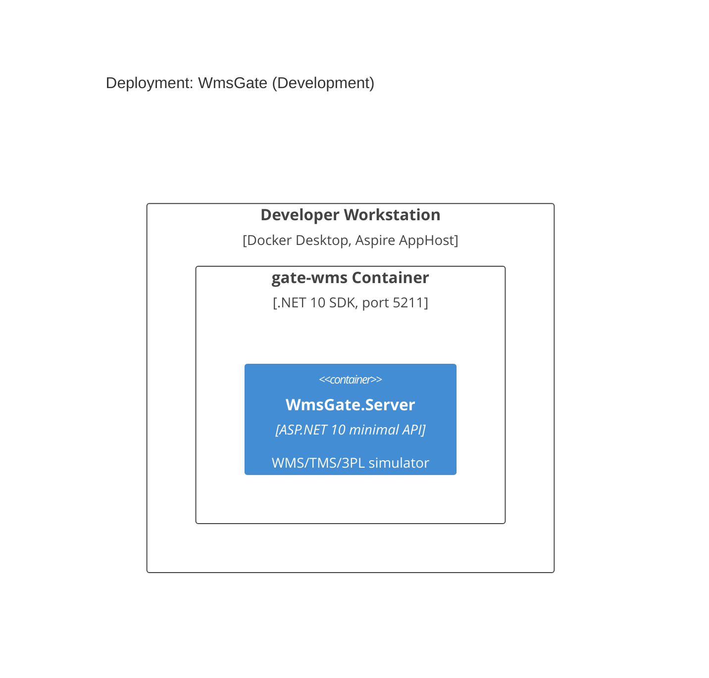
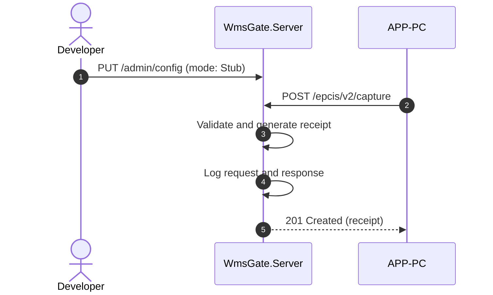
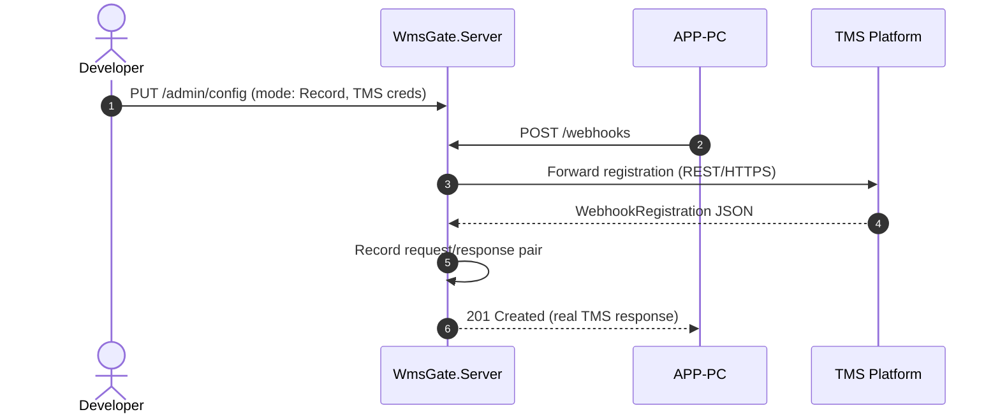
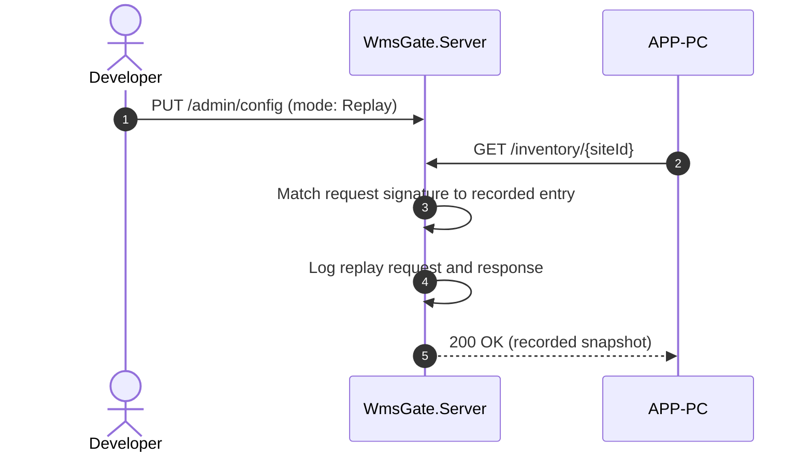
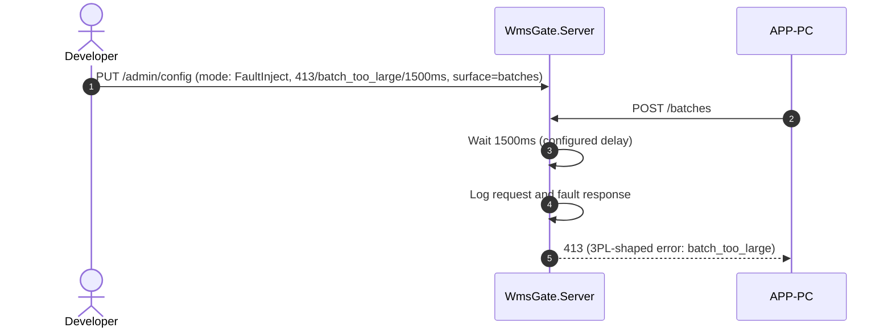
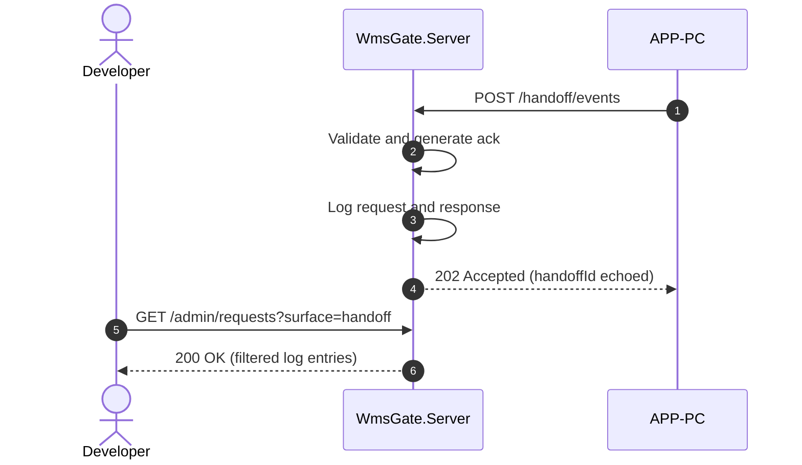

# WmsGate -- System Specification

## Tracking

| Field | Value |
|---|---|
| slug | wms-gate |
| itemType | SystemSpec |
| name | WmsGate |
| shortDescription | Local simulator that mimics WMS, TMS, and 3PL platform surfaces (EPCIS 2.0, webhooks, AS2/SFTP batch, inventory snapshots, handoff events) for APP-PC development and test. |
| version | 1 |
| specLangVersion | 0.1.0 |
| publishStatus | Draft |
| retentionPolicy | indefinite |
| freshnessSla | P90D |
| lastReviewed | 2026-04-18 |
| authors | [PER-01 Lena Brandt] |
| reviewers | [PER-03 Maria Oliveira] |
| committer | PER-01 Lena Brandt |
| tags | [gate-simulator, wms, tms, 3pl, epcis, local-dev] |
| createdAt | 2026-04-18T00:00:00Z |
| updatedAt | 2026-04-18T00:00:00Z |
| Dependencies | [global-corp.architecture.spec.md](./global-corp.architecture.spec.md) |
| State | Draft |
| Reviewed | |
| Approved | |
| Executed | |
| Verified | |

WmsGate is a local simulator for warehouse management, transportation
management, and 3PL platform APIs. It follows the same pattern as PayGate:
an ASP.NET 10 minimal API server plus a typed .NET client library, four
behavior modes (Stub, Record, Replay, FaultInject), and an in-memory
request log.

APP-PC (Partner Connectivity) calls WmsGate in place of real WMS, TMS, and
3PL platforms when running in the Local Simulation Profile. The same
APP-PC code that talks to Manhattan, Blue Yonder, or a 3PL partner in
production hits WmsGate on a local port instead, so the integration code
path is exercised without touching real partner systems.

WmsGate ships as a Docker container image, `globalcorp/wms-gate:latest`,
and the Global Corp Aspire AppHost runs it alongside the other Local
Simulation Profile services. This spec mirrors the PayGate reference and
adds WMS-specific contract and data surface.

## Context

```spec
person Developer {
    description: "A Global Corp developer building or debugging APP-PC
                  locally against a warehouse and 3PL simulator instead of
                  real partner systems.";
    @tag("internal", "dev", "test");
}

person CIPipeline {
    description: "Automated CI pipeline that runs APP-PC integration tests
                  against WmsGate without calling real WMS, TMS, or 3PL
                  platforms.";
    @tag("automation", "test");
}

external system WmsPlatform {
    description: "Third-party warehouse management platform exposing EPCIS
                  2.0 capture and query endpoints plus an inventory API.
                  WmsGate mimics this surface in all modes and proxies to a
                  live endpoint in Record mode.";
    technology: "REST/HTTPS, EPCIS 2.0";
    @tag("wms", "external");
}

external system TmsPlatform {
    description: "Transportation management platform exposing webhook
                  registration and shipment handoff events. WmsGate mimics
                  the webhook and handoff surface used by APP-PC.";
    technology: "REST/HTTPS";
    @tag("tms", "external");
}

external system ThreePlPlatform {
    description: "Third-party logistics platform that accepts AS2 and SFTP
                  batch file drops plus REST event pushes. WmsGate mimics
                  the batch submission endpoint and the handoff event
                  surface.";
    technology: "REST/HTTPS, AS2, SFTP";
    @tag("3pl", "external");
}

external system APP-PC {
    description: "Global Corp Partner Connectivity subsystem. In the Local
                  Simulation Profile, APP-PC points its WMS, TMS, and 3PL
                  client base URLs at WmsGate.";
    technology: "REST/HTTPS";
    @tag("consumer", "internal");
}

Developer -> WmsGate : "Configures behavior mode and inspects request logs.";

CIPipeline -> WmsGate : "Runs APP-PC integration tests against the simulator.";

APP-PC -> WmsGate {
    description: "Sends EPCIS, webhook, batch, inventory, and handoff
                  requests to WmsGate instead of real partner platforms.";
    technology: "REST/HTTPS";
}

WmsGate -> WmsPlatform {
    description: "Proxies requests to a live WMS endpoint in Record mode only.";
    technology: "REST/HTTPS";
}

WmsGate -> TmsPlatform {
    description: "Proxies webhook traffic to a live TMS in Record mode only.";
    technology: "REST/HTTPS";
}

WmsGate -> ThreePlPlatform {
    description: "Proxies batch and event traffic to a live 3PL in Record
                  mode only.";
    technology: "REST/HTTPS";
}
```

Rendered system context:



## System Declaration

```spec
system WmsGate {
    target: "net10.0";
    responsibility: "HTTP-level test harness that mimics WMS, TMS, and 3PL
                     platform surfaces (EPCIS 2.0 capture and query,
                     webhook registration, AS2/SFTP batch drop via REST,
                     inventory snapshots, shipment handoff events).
                     Supports four behavior modes: Stub, Record, Replay,
                     FaultInject. Lets APP-PC validate partner integrations
                     without calling real platforms.";

    authored component WmsGate.Server {
        kind: "api-host";
        path: "src/WmsGate.Server";
        status: new;
        responsibility: "ASP.NET 10 minimal API that exposes EPCIS 2.0
                         capture and query endpoints, webhook registration
                         endpoints, a batch drop endpoint, an inventory
                         snapshot endpoint, and a handoff event push
                         endpoint. Routes each request through the active
                         behavior mode and returns the appropriate response
                         shape.";
        contract {
            guarantees "Exposes POST /epcis/v2/capture,
                        GET /epcis/v2/query,
                        POST /webhooks,
                        DELETE /webhooks/{id},
                        POST /batches,
                        GET /inventory/{siteId}, and
                        POST /handoff/events with request and response
                        shapes matching the published partner surfaces.";
            guarantees "Behavior mode is switchable at runtime via the
                        management endpoint without restarting the
                        server.";
            guarantees "All requests and responses are captured in an
                        in-memory log accessible via GET /admin/requests.";
            guarantees "Default listen port is 5211 and is overridable by
                        the ASPNETCORE_URLS environment variable.";
        }
    }

    authored component WmsGate.Client {
        kind: library;
        path: "src/WmsGate.Client";
        status: new;
        responsibility: "Typed .NET client that wraps the WmsGate HTTP
                         surface. APP-PC registers WmsGate.Client in the
                         Local Simulation Profile in place of its real WMS,
                         TMS, and 3PL clients.";
        contract {
            guarantees "Exposes EpcisClient, WebhookClient, BatchClient,
                        InventoryClient, and HandoffClient types whose
                        public methods match the partner surface APP-PC
                        consumes in production.";
            guarantees "Exposes a WmsGateAdminClient type for mode
                        configuration and request log inspection.";
            guarantees "Targets WmsGate.Server by default on
                        http://localhost:5211 and is configurable.";
        }

        rationale {
            context "APP-PC talks to several distinct partner surfaces. A
                     single typed client keeps local test wiring minimal
                     and keeps mode and log inspection out of production
                     partner-client code.";
            decision "Ship one client assembly with five surface-specific
                      clients plus an admin client.";
            consequence "APP-PC test projects add one package reference and
                         one DI registration per surface.";
        }
    }

    authored component WmsGate.Tests {
        kind: tests;
        path: "tests/WmsGate.Tests";
        status: new;
        responsibility: "Unit and integration tests for WmsGate.Server and
                         WmsGate.Client. Verifies each behavior mode,
                         request logging, fault injection, and surface
                         parity with EPCIS 2.0, the webhook shape, and the
                         3PL batch format.";
    }

    consumed component AspireHosting {
        source: nuget("Aspire.Hosting");
        version: "10.*";
        responsibility: "Aspire integration types used by the AppHost to
                         declare the WmsGate container resource.";
        used_by: [WmsGate.Server];
    }

    consumed component AspNetCore {
        source: nuget("Microsoft.AspNetCore.App");
        version: "10.*";
        responsibility: "ASP.NET 10 minimal API framework.";
        used_by: [WmsGate.Server];
    }

    consumed component HttpJson {
        source: nuget("System.Net.Http.Json");
        version: "10.*";
        responsibility: "Typed HTTP JSON helpers for WmsGate.Client.";
        used_by: [WmsGate.Client];
    }

    consumed component xunit {
        source: nuget("xunit");
        version: "2.*";
        responsibility: "Unit and integration testing framework.";
        used_by: [WmsGate.Tests];
    }

    consumed component TestHost {
        source: nuget("Microsoft.AspNetCore.Mvc.Testing");
        version: "10.*";
        responsibility: "In-process test server for WmsGate.Server
                         integration tests.";
        used_by: [WmsGate.Tests];
    }
}
```

## Data Specification

### Enums

```spec
enum BehaviorMode {
    Stub: "Returns preconfigured static responses for all endpoints",
    Record: "Proxies requests to a real partner surface and records request and response",
    Replay: "Returns previously recorded responses matched by request signature",
    FaultInject: "Returns configurable error responses to test failure handling"
}

enum EpcisEventType {
    ObjectEvent: "Observation of one or more objects at a location",
    AggregationEvent: "Physical aggregation of child EPCs into a parent EPC",
    TransactionEvent: "Association of EPCs with a business transaction",
    TransformationEvent: "Transformation of input EPCs into output EPCs"
}

enum WmsOperation {
    Receive: "Goods received at a warehouse dock",
    Putaway: "Goods moved from receiving to storage",
    Pick: "Goods picked from storage for an outbound order",
    Pack: "Goods packed into shipping units",
    Ship: "Goods loaded and shipped"
}
```

### Entities

The data model captures WMS, TMS, and 3PL partner payloads plus the
internal recording and configuration state. Field names follow the
conventions of the real surfaces they mimic (camelCase for EPCIS 2.0 and
the webhook shape, snake_case for the batch and handoff payloads that
match common 3PL conventions).

```spec
entity EpcisEvent {
    eventId: string;
    eventType: EpcisEventType;
    eventTime: string;
    eventTimeZoneOffset: string @default("+00:00");
    bizStep: string?;
    disposition: string?;
    epcs: string?;

    invariant "eventId required": eventId != "";
    invariant "eventTime required": eventTime != "";

    rationale "eventType" {
        context "EPCIS 2.0 defines four event types with distinct required
                 fields. The simulator must preserve event-type semantics
                 so APP-PC's EPCIS parser is exercised correctly.";
        decision "eventType is a strongly typed enum rather than a free
                  string. Invariants tie required fields to the type in
                  the server-side validator.";
        consequence "Stub mode emits each of the four types across its
                     synthetic fixtures.";
    }
}

entity WmsSnapshot {
    siteId: string;
    capturedAt: string;
    operation: WmsOperation;
    sku: string;
    onHandQuantity: int @range(0..10000000);
    allocatedQuantity: int @range(0..10000000);

    invariant "siteId required": siteId != "";
    invariant "capturedAt required": capturedAt != "";
    invariant "sku required": sku != "";
    invariant "non-negative on-hand": onHandQuantity >= 0;
    invariant "non-negative allocated": allocatedQuantity >= 0;
    invariant "allocated within on-hand": allocatedQuantity <= onHandQuantity;
}

entity WebhookRegistration {
    id: string;
    callbackUrl: string;
    eventTypes: string;
    secret: string?;
    createdAt: string;

    invariant "id required": id != "";
    invariant "callbackUrl required": callbackUrl != "";
    invariant "eventTypes required": eventTypes != "";

    rationale "secret" {
        context "Partner webhook shapes commonly sign callbacks with a
                 shared secret. The simulator stores the secret so replay
                 and fault paths can exercise signature verification.";
        decision "secret is nullable. A missing secret indicates an
                  unsigned subscription.";
        consequence "APP-PC can test both signed and unsigned webhook
                     paths against WmsGate.";
    }
}

entity BatchFileSubmission {
    batchId: string;
    submittedAt: string;
    filename: string;
    contentType: string @default("application/octet-stream");
    sizeBytes: int @range(0..104857600);
    body: string?;

    invariant "batchId required": batchId != "";
    invariant "filename required": filename != "";
    invariant "non-negative size": sizeBytes >= 0;

    rationale "body" {
        context "The REST endpoint mimics an AS2 or SFTP drop by carrying
                 the file body as base64. Real AS2 and SFTP are not
                 reimplemented inside the simulator.";
        decision "Store the body as a base64 string and cap the size at
                  100 MiB to keep the in-memory log bounded.";
        consequence "Large production files should be tested against the
                     real 3PL; WmsGate covers the protocol shape and
                     routing logic.";
    }
}

entity WmsHandoffEvent {
    handoffId: string;
    shipmentId: string;
    operation: WmsOperation;
    occurredAt: string;
    siteId: string;
    notes: string?;

    invariant "handoffId required": handoffId != "";
    invariant "shipmentId required": shipmentId != "";
    invariant "occurredAt required": occurredAt != "";
    invariant "siteId required": siteId != "";
}

entity WmsGateRequest {
    id: string;
    timestamp: string;
    method: string;
    path: string;
    partnerSurface: string;
    body: string?;
    headers: string?;

    invariant "id required": id != "";
    invariant "path required": path != "";
    invariant "surface required": partnerSurface != "";
}

entity WmsGateResponse {
    id: string;
    requestId: string;
    statusCode: int @range(100..599);
    body: string?;
    latencyMs: int;

    invariant "id required": id != "";
    invariant "request reference": requestId != "";
    invariant "valid status code": statusCode >= 100;
}

entity FaultConfig {
    statusCode: int @range(400..599) @default(500);
    errorType: string @default("partner_error");
    errorMessage: string @default("Simulated WmsGate fault");
    delayMs: int @range(0..30000) @default(0);
    appliesToSurface: string?;

    invariant "error status code": statusCode >= 400;
    invariant "non-negative delay": delayMs >= 0;

    rationale "appliesToSurface" {
        context "WmsGate mimics several surfaces. A failure test may target
                 only the EPCIS endpoints while leaving webhook and batch
                 flows healthy.";
        decision "FaultConfig carries an optional surface selector. If
                  null, the fault applies to every surface.";
        consequence "APP-PC can test partial-outage behavior without having
                     to spin up multiple WmsGate instances.";
    }
}
```

## Contracts

### EPCIS 2.0 Endpoints

```spec
contract CaptureEpcisEvents {
    requires count(events) > 0;
    requires all events have eventId != "";
    ensures response.statusCode in [200, 201, 202];
    guarantees "Accepts an EPCIS 2.0 capture document. In Stub and Replay
                modes, validates the event-type invariants and returns a
                capture receipt. In Record mode, proxies the document to
                the configured WMS base URL. In FaultInject mode, returns
                the configured fault.";
}

contract QueryEpcisEvents {
    requires query.limit > 0;
    ensures count(events) >= 0;
    guarantees "Returns a list of EpcisEvent records matching the query
                filters. Mode behavior follows the shared pattern.";
}
```

### Webhook Endpoints

```spec
contract RegisterWebhook {
    requires callbackUrl != "";
    requires eventTypes != "";
    ensures registration.id != "";
    guarantees "Registers a webhook subscription. In Stub and Replay
                modes, emits synthetic callback deliveries on a short
                timer. In Record mode, forwards the registration to the
                real TMS or 3PL. In FaultInject mode, returns the
                configured fault.";
}

contract DeleteWebhook {
    requires id != "";
    ensures response.statusCode in [200, 202, 204, 404];
    guarantees "Cancels a previously registered subscription. Mode
                behavior follows the shared pattern.";
}
```

### Batch Drop Endpoint

```spec
contract SubmitBatch {
    requires filename != "";
    requires sizeBytes >= 0;
    requires sizeBytes <= 104857600;
    ensures submission.batchId != "";
    guarantees "Accepts a base64-encoded file body that stands in for an
                AS2 or SFTP drop. In Stub and Replay modes, returns a
                deterministic receipt. In Record mode, forwards the
                payload to the configured 3PL endpoint. In FaultInject
                mode, returns the configured fault.";
}
```

### Inventory Endpoint

```spec
contract GetInventorySnapshot {
    requires siteId != "";
    ensures count(snapshots) >= 0;
    guarantees "Returns a WmsSnapshot list for the given site. Mode
                behavior follows the shared pattern.";
}
```

### Handoff Endpoint

```spec
contract PushHandoffEvent {
    requires handoffId != "";
    requires shipmentId != "";
    ensures response.statusCode in [200, 202];
    guarantees "Accepts a WmsHandoffEvent representing a shipment handoff
                between Global Corp and a 3PL partner. Mode behavior
                follows the shared pattern.";
}
```

### Management Endpoints

```spec
contract ConfigureMode {
    requires mode in [Stub, Record, Replay, FaultInject];
    ensures activeMode == mode;
    guarantees "Switches the server behavior mode at runtime. When
                switching to FaultInject, an optional FaultConfig payload
                configures the error response. When switching to Record,
                per-surface base URLs and credentials must be provided.";
}

contract GetRequestLog {
    ensures count(entries) >= 0;
    guarantees "Returns all captured WmsGateRequest and WmsGateResponse
                pairs in chronological order. Supports optional filtering
                by surface, path, and time range. Log entries persist for
                the lifetime of the server process.";
}
```

## Topology

```spec
topology Dependencies {
    allow WmsGate.Server -> WmsGate.Client;
    allow WmsGate.Tests -> WmsGate.Server;
    allow WmsGate.Tests -> WmsGate.Client;

    deny WmsGate.Client -> WmsGate.Tests;
    deny WmsGate.Server -> WmsGate.Tests;

    invariant "no consumer coupling":
        WmsGate.Server does not reference APP-PC;
    invariant "client has no consumer coupling":
        WmsGate.Client does not reference APP-PC;

    rationale {
        context "WmsGate is a reusable WMS, TMS, and 3PL simulator. It
                 must not depend on APP-PC or any other Global Corp
                 subsystem so it can be versioned and shipped
                 independently.";
        decision "WmsGate.Server exposes partner-shaped REST endpoints.
                  APP-PC points its partner clients at WmsGate in the
                  Local Simulation Profile. No compile-time dependency
                  exists in either direction.";
        consequence "WmsGate can be extracted to a separate repository or
                     reused by non-Global-Corp projects that integrate
                     with EPCIS-compatible WMS platforms.";
    }
}
```

Rendered topology:



## Phases

```spec
phase ServerCore {
    produces: [WmsGate.Server, WmsGate.Client];

    gate ServerCompile {
        command: "dotnet build src/WmsGate.Server";
        expects: "zero errors";
    }

    gate ClientCompile {
        command: "dotnet build src/WmsGate.Client";
        expects: "zero errors";
    }

    gate HealthCheck {
        command: "curl -f http://localhost:5211/health";
        expects: "exit_code == 0";
    }
}

phase Testing {
    requires: ServerCore;
    produces: [WmsGate.Tests];

    gate UnitTests {
        command: "dotnet test tests/WmsGate.Tests --filter Category=Unit";
        expects: "all tests pass", pass >= 12;
    }

    gate IntegrationTests {
        command: "dotnet test tests/WmsGate.Tests --filter Category=Integration";
        expects: "all tests pass", pass >= 10;
    }

    gate ModeTests {
        command: "dotnet test tests/WmsGate.Tests --filter Category=Mode";
        expects: "all tests pass", pass >= 4;
        rationale "One test per behavior mode confirms mode switching and
                   mode-specific response logic across every surface.";
    }

    gate SurfaceParityTests {
        command: "dotnet test tests/WmsGate.Tests --filter Category=Parity";
        expects: "all tests pass", pass >= 6;
        rationale "Confirms that EPCIS 2.0, webhook, batch, inventory, and
                   handoff payloads match the published real-surface
                   shapes.";
    }
}

phase Integration {
    requires: Testing;

    gate FullBuild {
        command: "dotnet build WmsGate.slnx";
        expects: "zero errors";
    }

    gate AllTests {
        command: "dotnet test WmsGate.slnx";
        expects: "all tests pass", fail == 0;
    }

    gate ContainerBuild {
        command: "docker build -t globalcorp/wms-gate:latest .";
        expects: "exit_code == 0";
    }

    rationale "Final gates confirm that the full solution builds, all
               tests pass, and the container image builds cleanly before
               the spec can advance to Verified.";
}
```

Rendered phase ordering:



## Traces

```spec
trace PartnerFlow {
    CaptureEpcisEvents -> [WmsGate.Server, WmsGate.Client];
    QueryEpcisEvents -> [WmsGate.Server, WmsGate.Client];
    RegisterWebhook -> [WmsGate.Server, WmsGate.Client];
    DeleteWebhook -> [WmsGate.Server, WmsGate.Client];
    SubmitBatch -> [WmsGate.Server, WmsGate.Client];
    GetInventorySnapshot -> [WmsGate.Server, WmsGate.Client];
    PushHandoffEvent -> [WmsGate.Server, WmsGate.Client];
    ConfigureMode -> [WmsGate.Server, WmsGate.Client];
    GetRequestLog -> [WmsGate.Server, WmsGate.Client];

    invariant "full coverage":
        all sources have count(targets) >= 1;
    invariant "server always involved":
        all sources have targets contains WmsGate.Server;
}

trace DataModel {
    EpcisEvent -> [WmsGate.Server, WmsGate.Client];
    WmsSnapshot -> [WmsGate.Server, WmsGate.Client];
    WebhookRegistration -> [WmsGate.Server, WmsGate.Client];
    BatchFileSubmission -> [WmsGate.Server, WmsGate.Client];
    WmsHandoffEvent -> [WmsGate.Server, WmsGate.Client];
    WmsGateRequest -> [WmsGate.Server];
    WmsGateResponse -> [WmsGate.Server];
    FaultConfig -> [WmsGate.Server, WmsGate.Client];
    BehaviorMode -> [WmsGate.Server, WmsGate.Client];
    EpcisEventType -> [WmsGate.Server, WmsGate.Client];
    WmsOperation -> [WmsGate.Server, WmsGate.Client];
}
```

## System-Level Constraints

```spec
constraint NoGlobalCorpSubsystemDependency {
    scope: [WmsGate.Server, WmsGate.Client];
    rule: "No references to any Global Corp subsystem namespace or
           assembly. The only contract with APP-PC is the HTTP surface.";

    rationale {
        context "WmsGate must remain a general-purpose WMS, TMS, and 3PL
                 simulator, reusable by projects outside Global Corp and
                 across future subsystems.";
        decision "No compile-time coupling to APP-PC or other Global Corp
                  components. The contract is the EPCIS, webhook, batch,
                  inventory, and handoff surface.";
        consequence "WmsGate can ship as an OCI image without any Global
                     Corp code dependencies.";
    }
}

constraint NullableEnabled {
    scope: all authored components;
    rule: "Nullable reference types are enabled in every project file.
           No null-forgiving operators (!) outside of test setup helpers.";
}

constraint InMemoryOnly {
    scope: [WmsGate.Server];
    rule: "All state (request logs, recorded responses, webhook
           subscriptions, batch receipts, fault config) is held in memory.
           No database and no file-system persistence. State resets when
           the server process restarts.";

    rationale {
        context "WmsGate is a test-time tool that runs per developer and
                 per CI job. Persistent state would add operational weight
                 without benefit.";
        decision "Use in-memory collections with a size cap on batch
                  bodies to keep the log bounded.";
        consequence "Long recording sessions should export logs before the
                     container stops. Each container start begins empty.";
    }
}

constraint ShapeParity {
    scope: [WmsGate.Server];
    rule: "EPCIS 2.0 capture and query JSON shapes match the GS1 EPCIS 2.0
           specification. Webhook registration JSON matches the webhook
           shape APP-PC consumes in production. Batch payloads match the
           3PL batch wrapper shape. Handoff events match the common 3PL
           handoff schema.";

    rationale "Shape parity lets APP-PC run identical code against WmsGate
               and real partners, without adapter layers or conditional
               logic.";
}

constraint TestNaming {
    scope: [WmsGate.Tests];
    rule: "Test methods follow MethodName_Scenario_ExpectedResult naming.
           Test classes mirror the source class name with a Tests suffix.";
}
```

## Package Policy

```spec
package_policy WmsGatePolicy {
    inherit: weakRef<PackagePolicy>(GlobalCorpPolicy)
        from "./global-corp.architecture.spec.md#section-8";

    allow category("epcis")
        includes ["GS1.Epcis"]
        rationale "A small, permissively licensed EPCIS 2.0 validator keeps
                   the Stub and Replay paths honest without reimplementing
                   the GS1 schema.";

    deny category("partner-sdks")
        includes ["Manhattan.*", "BlueYonder.*", "SAP.EWM.*"]
        rationale "WmsGate mimics partner platforms at the wire level and
                   must control the raw HTTP and payload shapes. Using a
                   real partner SDK would hide the surface under test.";

    default: inherit;

    rationale {
        context "WmsGate inherits the Global Corp package policy to keep
                 supply-chain controls uniform across the platform.";
        decision "Inherit the full GlobalCorpPolicy. Add only the EPCIS
                  validator allow list and the partner-SDK deny list
                  unique to this spec.";
        consequence "Any package outside the inherited allow set and
                     outside the two additions above requires a rationale
                     in a subsequent revision of this spec.";
    }
}
```

## Platform Realization

```spec
dotnet solution WmsGate {
    format: slnx;
    startup: WmsGate.Server;

    folder "src" {
        projects: [WmsGate.Server, WmsGate.Client];
    }

    folder "tests" {
        projects: [WmsGate.Tests];
    }

    rationale {
        context "WmsGate is a focused solution with two source projects
                 and one test project.";
        decision "WmsGate.Server is the startup project and serves both
                  the partner-compatible surface and the management API on
                  one configurable port.";
        consequence "Running dotnet run from the Server project starts
                     the simulator. The default port is 5211.";
    }
}
```

Rendered solution structure:



## Deployment

```spec
deployment Development {
    node "Developer Workstation" {
        technology: "Docker Desktop, Aspire AppHost";

        node "gate-wms Container" {
            technology: ".NET 10 SDK, globalcorp/wms-gate:latest";
            instance: WmsGate.Server;
            port: 5211;
            container_name: "gate-wms";
        }
    }

    rationale "WmsGate runs as the gate-wms container, orchestrated by the
               Global Corp Aspire AppHost. The AppHost passes partner base
               URLs into APP-PC via environment variables so the same
               APP-PC code reaches WmsGate in the Local Simulation Profile
               and the real partners in other profiles.";
}
```

Rendered deployment:



## Views

```spec
view systemContext of WmsGate ContextView {
    include: all;
    autoLayout: top-down;
    description: "WmsGate with its users (Developer, CI Pipeline) and
                  external systems (WMS platform, TMS platform, 3PL
                  platform, APP-PC).";
}

view container of WmsGate ContainerView {
    include: all;
    autoLayout: left-right;
    description: "Internal structure showing WmsGate.Server,
                  WmsGate.Client, and WmsGate.Tests with their
                  dependencies.";
}

view deployment of Development DevelopmentDeploymentView {
    include: all;
    autoLayout: top-down;
    description: "Developer workstation running WmsGate as the gate-wms
                  container under the Aspire AppHost.";
    @tag("dev", "local-simulation");
}
```

## Dynamic Scenarios

### Stub Mode: EPCIS Capture

APP-PC posts an EPCIS 2.0 capture document in Stub mode during a local
development session. WmsGate validates the event-type invariants and
returns a deterministic receipt without contacting any real WMS.

```spec
dynamic StubMode {
    1: Developer -> WmsGate.Server {
        description: "Configures WmsGate to Stub mode via management API.";
        technology: "REST/HTTPS";
    };
    2: APP-PC -> WmsGate.Server {
        description: "POST /epcis/v2/capture with an EPCIS 2.0 document.";
        technology: "REST/HTTPS";
    };
    3: WmsGate.Server -> WmsGate.Server
        : "Validates event-type invariants and generates a deterministic
           capture receipt.";
    4: WmsGate.Server -> WmsGate.Server
        : "Logs request and response to the in-memory request log.";
    5: WmsGate.Server -> APP-PC {
        description: "Returns a 201 Created receipt with a stable
                      captureId.";
        technology: "REST/HTTPS";
    };
}
```

Rendered interaction sequence:



### Record Mode: Webhook Registration

WmsGate proxies a webhook registration request to a real TMS and records
both request and response for later replay.

```spec
dynamic RecordMode {
    1: Developer -> WmsGate.Server {
        description: "Configures WmsGate to Record mode with TMS base URL
                      and credentials.";
        technology: "REST/HTTPS";
    };
    2: APP-PC -> WmsGate.Server {
        description: "POST /webhooks with callbackUrl and eventTypes.";
        technology: "REST/HTTPS";
    };
    3: WmsGate.Server -> TmsPlatform {
        description: "Forwards the registration using the configured
                      credentials.";
        technology: "REST/HTTPS";
    };
    4: TmsPlatform -> WmsGate.Server
        : "Returns WebhookRegistration JSON with a platform-assigned id.";
    5: WmsGate.Server -> WmsGate.Server
        : "Records request/response pair keyed by method, path, and body
           signature.";
    6: WmsGate.Server -> APP-PC {
        description: "Returns the real TMS response unmodified.";
        technology: "REST/HTTPS";
    };
}
```

Rendered interaction sequence:



### Replay Mode: Inventory Snapshot

WmsGate returns a previously recorded inventory snapshot matched by the
request signature. No network call leaves the container.

```spec
dynamic ReplayMode {
    1: Developer -> WmsGate.Server {
        description: "Configures WmsGate to Replay mode.";
        technology: "REST/HTTPS";
    };
    2: APP-PC -> WmsGate.Server {
        description: "GET /inventory/{siteId} for a known site.";
        technology: "REST/HTTPS";
    };
    3: WmsGate.Server -> WmsGate.Server
        : "Computes the request signature and looks up the matching
           recorded response.";
    4: WmsGate.Server -> WmsGate.Server
        : "Logs the replay request and the matched response.";
    5: WmsGate.Server -> APP-PC {
        description: "Returns the recorded inventory snapshot JSON.";
        technology: "REST/HTTPS";
    };
}
```

Rendered interaction sequence:



### FaultInject Mode: Batch Drop Failure

WmsGate returns a configurable error on the batch drop endpoint to
exercise APP-PC's retry and quarantine paths.

```spec
dynamic FaultInjectMode {
    1: Developer -> WmsGate.Server {
        description: "Configures WmsGate to FaultInject mode with a
                      FaultConfig of 413, batch_too_large, 1500ms delay,
                      applied to the batches surface only.";
        technology: "REST/HTTPS";
    };
    2: APP-PC -> WmsGate.Server {
        description: "POST /batches with a base64 file body and metadata.";
        technology: "REST/HTTPS";
    };
    3: WmsGate.Server -> WmsGate.Server
        : "Waits for the configured delay (1500ms).";
    4: WmsGate.Server -> WmsGate.Server
        : "Logs the request and the fault response.";
    5: WmsGate.Server -> APP-PC {
        description: "Returns 413 with a 3PL-shaped error body of type
                      batch_too_large.";
        technology: "REST/HTTPS";
    };
}
```

Rendered interaction sequence:



### Handoff Event Push with Log Inspection

APP-PC pushes a shipment handoff event and then a developer retrieves the
captured request log to verify the payload.

```spec
dynamic HandoffAndInspect {
    1: APP-PC -> WmsGate.Server {
        description: "POST /handoff/events with a WmsHandoffEvent body.";
        technology: "REST/HTTPS";
    };
    2: WmsGate.Server -> WmsGate.Server
        : "Validates handoffId, shipmentId, and siteId; generates a
           deterministic acknowledgement.";
    3: WmsGate.Server -> WmsGate.Server
        : "Logs request and response.";
    4: WmsGate.Server -> APP-PC {
        description: "Returns 202 Accepted with the handoff id echoed.";
        technology: "REST/HTTPS";
    };
    5: Developer -> WmsGate.Server {
        description: "GET /admin/requests?surface=handoff to retrieve the
                      filtered log.";
        technology: "REST/HTTPS";
    };
    6: WmsGate.Server -> Developer {
        description: "Returns a JSON array of handoff log entries.";
        technology: "REST/HTTPS";
    };
}
```

Rendered interaction sequence:



## Open Items

1. Confirm the EPCIS validator library (GS1.Epcis) meets Global Corp legal
   review before the spec moves to Approved. A hand-rolled validator is
   the fallback if the license terms do not fit.
2. Decide whether WmsGate should deliver synthetic webhook callbacks back
   to APP-PC in Stub and Replay modes, or whether the AppHost should
   drive callback delivery through a dedicated scheduler. Current draft
   keeps callback delivery inside WmsGate.
3. Define the exact signature algorithm for the Replay mode lookup on
   EPCIS capture documents, which are large and contain timestamps. A
   canonicalization step is likely required before hashing.
4. Confirm with Maria Oliveira (PER-03) the default set of sites,
   operations, and SKUs used by Stub mode so APP-PC fixtures stay stable
   across releases.
5. Decide whether the 100 MiB batch size cap is adequate for the
   representative 3PL files APP-PC exchanges, or whether the cap should
   be raised with streaming support added.
