# PayGate -- System Specification

## Tracking

| Field | Value |
|---|---|
| Created | 2026-04-16 |
| State | Draft |
| Reviewed | |
| Approved | |
| Executed | |
| Verified | |
| Dependencies | PizzaShop.spec.md |

This specification describes PayGate, a test harness that mimics the Stripe
payment API surface. PizzaShop.Infrastructure points to PayGate instead of
Stripe when running in test and development environments. PayGate supports
four behavior modes: returning preconfigured stubs, recording live Stripe
traffic, replaying recorded responses, and injecting configurable faults.

PayGate is an HTTP-level proxy/stub built as an ASP.NET 10 minimal API.
It exposes the same REST endpoints that PizzaShop.Infrastructure calls on
Stripe, so no production code changes are needed to switch between real
and test payment processing.

## Context

```spec
person Developer {
    description: "A developer running PizzaShop integration tests or
                  working locally against a payment stub instead of
                  the live Stripe API.";
    @tag("internal", "test");
}

person CIPipeline {
    description: "Automated CI/CD pipeline that runs integration tests
                  against PayGate to validate payment flows without
                  touching Stripe.";
    @tag("automation", "test");
}

external system Stripe {
    description: "Third-party payment processor. PayGate proxies to
                  Stripe in Record mode and mimics its REST surface
                  in all other modes.";
    technology: "REST/HTTPS";
    @tag("payment", "external");
}

external system PizzaShop.Infrastructure {
    description: "The PizzaShop infrastructure layer that normally
                  calls Stripe. In test configuration it calls
                  PayGate at the same REST endpoints.";
    technology: "REST/HTTPS";
    @tag("consumer", "external");
}

Developer -> PayGate : "Configures behavior mode and inspects request logs.";

CIPipeline -> PayGate : "Runs automated payment integration tests.";

PizzaShop.Infrastructure -> PayGate {
    description: "Sends payment intent and refund requests to PayGate
                  instead of Stripe.";
    technology: "REST/HTTPS";
}

PayGate -> Stripe {
    description: "Proxies requests to real Stripe in Record mode only.";
    technology: "REST/HTTPS";
}
```

Rendered system context:

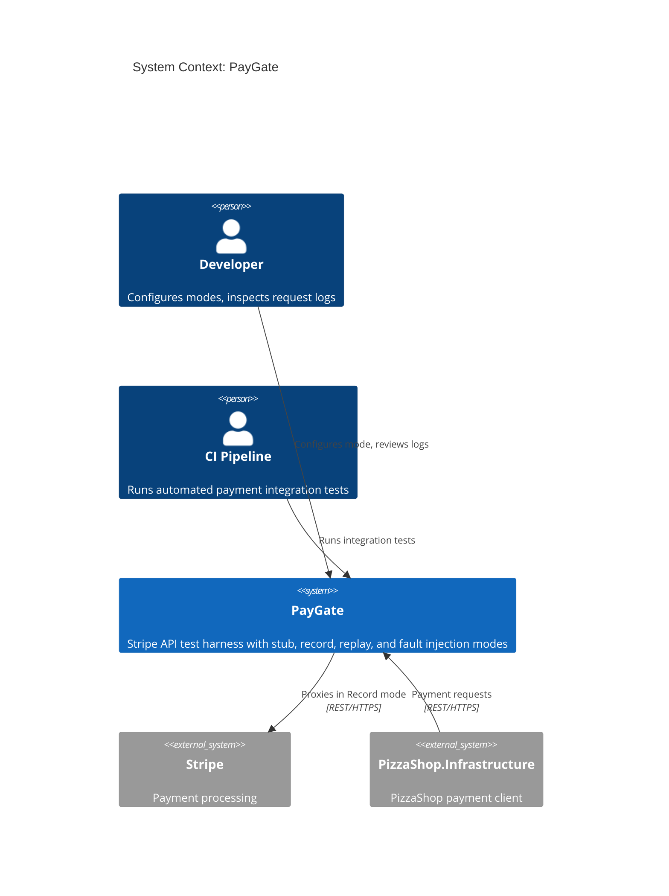

## System Declaration

```spec
system PayGate {
    target: "net10.0";
    responsibility: "HTTP-level test harness that mimics the Stripe REST
                     API surface. Supports four behavior modes: Stub,
                     Record, Replay, and FaultInject. Allows PizzaShop
                     to validate its payment integration without calling
                     the real Stripe API.";

    authored component PayGate.Server {
        kind: "api-host";
        path: "src/PayGate.Server";
        status: new;
        responsibility: "ASP.NET 10 minimal API that exposes Stripe-compatible
                         REST endpoints for payment intents and refunds.
                         Routes incoming requests through the active behavior
                         mode and returns appropriate responses.";
        contract {
            guarantees "Exposes POST /v1/payment_intents and
                        POST /v1/refunds matching Stripe's request and
                        response shapes.";
            guarantees "Behavior mode is switchable at runtime via the
                        configuration endpoint without restarting the
                        server.";
            guarantees "All incoming requests and outgoing responses are
                        captured in an in-memory log accessible via the
                        management API.";
        }
    }

    authored component PayGate.Client {
        kind: library;
        path: "src/PayGate.Client";
        status: new;
        responsibility: "A .NET client library that matches Stripe's client
                         shape. PizzaShop.Infrastructure can swap its Stripe
                         client for PayGate.Client through dependency
                         injection without changing calling code.";
        contract {
            guarantees "Public API surface mirrors the Stripe .NET SDK
                        methods used by PizzaShop: CreatePaymentIntent
                        and CreateRefund.";
            guarantees "Targets PayGate.Server by default. The base URL
                        is configurable.";
        }

        rationale {
            context "PizzaShop.Infrastructure calls Stripe through a typed
                     client. Swapping the base URL alone is insufficient
                     because test code also needs mode configuration and
                     log inspection methods.";
            decision "A dedicated client library wraps both the Stripe-
                      compatible endpoints and the PayGate management
                      endpoints in a single package.";
            consequence "PizzaShop test projects reference PayGate.Client
                         and register it in DI. Production code continues
                         to use the real Stripe client.";
        }
    }

    authored component PayGate.Tests {
        kind: tests;
        path: "tests/PayGate.Tests";
        status: new;
        responsibility: "Integration and unit tests for PayGate.Server and
                         PayGate.Client. Verifies each behavior mode,
                         request logging, fault injection, and client
                         parity with the Stripe SDK surface.";
    }

    consumed component xunit {
        source: nuget("xunit");
        version: "2.*";
        responsibility: "Unit and integration testing framework.";
        used_by: [PayGate.Tests];
    }

    consumed component TestHost {
        source: nuget("Microsoft.AspNetCore.Mvc.Testing");
        version: "10.*";
        responsibility: "In-process test server for integration testing
                         ASP.NET minimal API endpoints.";
        used_by: [PayGate.Tests];
    }
}
```

## Data Specification

### Enums

```spec
enum BehaviorMode {
    Stub: "Returns preconfigured static responses for all endpoints",
    Record: "Proxies requests to real Stripe and records both request and response",
    Replay: "Returns previously recorded responses matched by request signature",
    FaultInject: "Returns configurable error responses to test failure handling"
}

enum PaymentStatus {
    RequiresPaymentMethod: "Payment intent created but not yet confirmed",
    RequiresConfirmation: "Payment method attached, awaiting confirmation",
    Succeeded: "Payment completed successfully",
    Canceled: "Payment was canceled",
    Failed: "Payment attempt failed"
}

enum RefundStatus {
    Pending: "Refund initiated but not yet processed",
    Succeeded: "Refund completed successfully",
    Failed: "Refund attempt failed"
}
```

### Entities

The data model captures both the Stripe-compatible domain objects and the
internal recording/configuration state.

```spec
entity PaymentIntent {
    id: string;
    amount: int @range(1..99999999);
    currency: string @default("usd");
    status: PaymentStatus @default(RequiresPaymentMethod);
    metadata: string?;

    invariant "positive amount": amount > 0;
    invariant "id required": id != "";
    invariant "currency required": currency != "";

    rationale "amount" {
        context "Stripe represents amounts in the smallest currency unit
                 (cents for USD). PayGate follows the same convention.";
        decision "Amount is an integer in cents, not a decimal in dollars.";
        consequence "Callers must convert dollar amounts to cents before
                     calling PayGate, matching real Stripe behavior.";
    }
}

entity Refund {
    id: string;
    paymentIntentId: string;
    amount: int @range(1..99999999);
    status: RefundStatus @default(Pending);
    reason: string?;

    invariant "id required": id != "";
    invariant "payment intent reference": paymentIntentId != "";
    invariant "positive amount": amount > 0;
}

entity PayGateRequest {
    id: string;
    timestamp: string;
    method: string;
    path: string;
    body: string?;
    headers: string?;

    invariant "id required": id != "";
    invariant "path required": path != "";
}

entity PayGateResponse {
    id: string;
    requestId: string;
    statusCode: int @range(100..599);
    body: string?;
    latencyMs: int;

    invariant "id required": id != "";
    invariant "request reference": requestId != "";
    invariant "valid status code": statusCode >= 100;
}

entity FaultConfig {
    statusCode: int @range(400..599) @default(500);
    errorType: string @default("api_error");
    errorMessage: string @default("Simulated PayGate fault");
    delayMs: int @range(0..30000) @default(0);

    invariant "error status code": statusCode >= 400;
    invariant "non-negative delay": delayMs >= 0;

    rationale "delayMs" {
        context "Testing timeout handling requires the ability to
                 simulate slow responses from a payment provider.";
        decision "FaultConfig includes a configurable delay in
                 milliseconds applied before returning the error.";
        consequence "PizzaShop timeout and retry logic can be validated
                     by setting delayMs to values above the client
                     timeout threshold.";
    }
}
```

## Contracts

### Stripe-Compatible Endpoints

These contracts define the API surface that mirrors Stripe's REST endpoints.

```spec
contract CreatePaymentIntent {
    requires amount > 0;
    requires currency != "";
    ensures paymentIntent.id != "";
    ensures paymentIntent.status == RequiresConfirmation;
    guarantees "In Stub mode, returns a synthetic payment intent with a
                generated ID. In Record mode, proxies to Stripe and
                records both request and response. In Replay mode,
                returns the recorded response matching the request
                signature. In FaultInject mode, returns the configured
                error response after the configured delay.";
}

contract ConfirmPaymentIntent {
    requires paymentIntent.id != "";
    requires paymentIntent.status == RequiresConfirmation;
    ensures paymentIntent.status in [Succeeded, Failed];
    guarantees "Transitions a payment intent to its terminal state. In
                Stub mode, always succeeds. In FaultInject mode, returns
                the configured fault. In Record and Replay modes, follows
                the same proxy/replay pattern as CreatePaymentIntent.";
}

contract CreateRefund {
    requires paymentIntentId != "";
    requires amount > 0;
    ensures refund.id != "";
    ensures refund.status in [Pending, Succeeded, Failed];
    guarantees "Creates a refund against a previously created payment
                intent. Mode behavior follows the same pattern as the
                payment intent endpoints.";
}
```

### Management Endpoints

These contracts define the PayGate-specific configuration and inspection API.

```spec
contract ConfigureMode {
    requires mode in [Stub, Record, Replay, FaultInject];
    ensures activeMode == mode;
    guarantees "Switches the server behavior mode at runtime. When
                switching to FaultInject, an optional FaultConfig
                payload configures the error response. When switching
                to Record, Stripe API credentials must be provided.";
}

contract GetRequestLog {
    ensures count(entries) >= 0;
    guarantees "Returns all captured PayGateRequest and PayGateResponse
                pairs in chronological order. Supports optional filtering
                by path and time range. Log entries persist for the
                lifetime of the server process.";
}
```

## Topology

```spec
topology Dependencies {
    allow PayGate.Server -> PayGate.Client;
    allow PayGate.Tests -> PayGate.Server;
    allow PayGate.Tests -> PayGate.Client;

    deny PayGate.Client -> PayGate.Tests;
    deny PayGate.Server -> PayGate.Tests;

    invariant "server has no PizzaShop dependency":
        PayGate.Server does not reference PizzaShop;

    rationale {
        context "PayGate is a standalone test harness. It must not
                 depend on PizzaShop so it can be reused for other
                 projects that integrate with Stripe.";
        decision "PayGate.Server exposes Stripe-compatible REST endpoints.
                  PizzaShop.Infrastructure points to PayGate's URL in
                  test configuration. No compile-time dependency exists
                  between the two systems.";
        consequence "PayGate can be versioned and released independently.
                     Other projects can adopt it by configuring their
                     Stripe client base URL to point at PayGate.";
    }
}
```

Rendered topology:

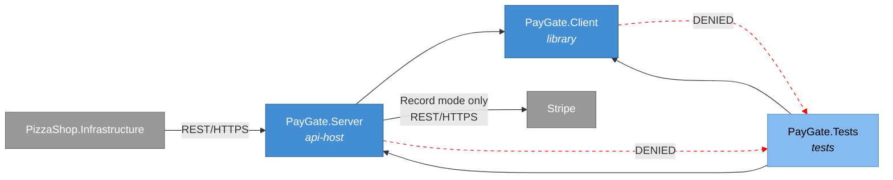

## Phases

```spec
phase ServerCore {
    produces: [PayGate.Server, PayGate.Client];

    gate ServerCompile {
        command: "dotnet build src/PayGate.Server";
        expects: "zero errors";
    }

    gate ClientCompile {
        command: "dotnet build src/PayGate.Client";
        expects: "zero errors";
    }

    gate HealthCheck {
        command: "curl -f http://localhost:5200/health";
        expects: "exit_code == 0";
    }
}

phase Testing {
    requires: ServerCore;
    produces: [PayGate.Tests];

    gate UnitTests {
        command: "dotnet test tests/PayGate.Tests --filter Category=Unit";
        expects: "all tests pass", pass >= 10;
    }

    gate IntegrationTests {
        command: "dotnet test tests/PayGate.Tests --filter Category=Integration";
        expects: "all tests pass", pass >= 8;
    }

    gate ModeTests {
        command: "dotnet test tests/PayGate.Tests --filter Category=Mode";
        expects: "all tests pass", pass >= 4;
        rationale "One test per behavior mode confirms that mode switching
                   and mode-specific response logic work correctly.";
    }
}

phase Integration {
    requires: Testing;

    gate FullBuild {
        command: "dotnet build PayGate.slnx";
        expects: "zero errors";
    }

    gate AllTests {
        command: "dotnet test PayGate.slnx";
        expects: "all tests pass", fail == 0;
    }

    rationale "Final gate confirms the complete solution builds and
               all tests pass before the spec can advance to Verified.";
}
```

Rendered phase ordering:

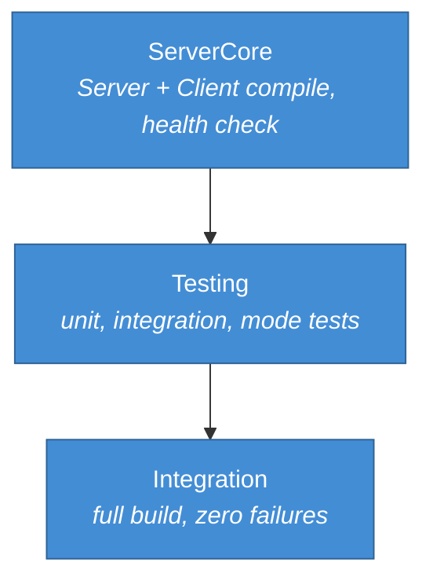

## Traces

```spec
trace PaymentFlow {
    CreatePaymentIntent -> [PayGate.Server, PayGate.Client];
    ConfirmPaymentIntent -> [PayGate.Server, PayGate.Client];
    CreateRefund -> [PayGate.Server, PayGate.Client];
    ConfigureMode -> [PayGate.Server, PayGate.Client];
    GetRequestLog -> [PayGate.Server, PayGate.Client];

    invariant "full coverage":
        all sources have count(targets) >= 1;
    invariant "server always involved":
        all sources have targets contains PayGate.Server;
}

trace DataModel {
    PaymentIntent -> [PayGate.Server, PayGate.Client];
    Refund -> [PayGate.Server, PayGate.Client];
    PayGateRequest -> [PayGate.Server];
    PayGateResponse -> [PayGate.Server];
    FaultConfig -> [PayGate.Server, PayGate.Client];
    BehaviorMode -> [PayGate.Server, PayGate.Client];
}
```

## System-Level Constraints

```spec
constraint NoPizzaShopDependency {
    scope: [PayGate.Server, PayGate.Client];
    rule: "No references to any PizzaShop namespace or assembly.
           PayGate communicates with PizzaShop only at the HTTP
           boundary.";

    rationale {
        context "PayGate must remain a general-purpose Stripe test
                 harness, reusable by any project.";
        decision "No compile-time coupling to PizzaShop. The contract
                  is Stripe's REST API shape, not any application type.";
        consequence "PayGate can be extracted to a separate repository
                     and published as an independent tool.";
    }
}

constraint NullableEnabled {
    scope: all authored components;
    rule: "Nullable reference types are enabled in every project file.
           No suppression operators (!) outside of test setup code.";
}

constraint StripeShapeParity {
    scope: [PayGate.Server];
    rule: "Request and response JSON shapes for /v1/payment_intents and
           /v1/refunds must match Stripe's documented API surface. Field
           names use snake_case to match Stripe conventions.";

    rationale "Shape parity ensures that PizzaShop.Infrastructure code
               works identically against PayGate and real Stripe without
               conditional logic or adapter layers.";
}

constraint InMemoryOnly {
    scope: [PayGate.Server];
    rule: "All state (request logs, recorded responses, fault config) is
           held in memory. No database, no file system persistence. State
           resets when the server process restarts.";

    rationale {
        context "PayGate is a test-time tool, not a production service.
                 Persistent state would add complexity without benefit.";
        decision "In-memory collections with no external storage
                  dependencies.";
        consequence "Each test run starts with a clean state. Long-running
                     recording sessions should export logs before stopping
                     the server.";
    }
}

constraint TestNaming {
    scope: [PayGate.Tests];
    rule: "Test methods follow MethodName_Scenario_ExpectedResult naming.
           Test classes mirror the source class name with a Tests suffix.";
}
```

## Package Policy

```spec
package_policy PayGatePolicy {
    source: nuget("https://api.nuget.org/v3/index.json");

    allow category("platform")
        includes ["System.*", "Microsoft.Extensions.*",
                  "Microsoft.AspNetCore.*"];

    allow category("testing")
        includes ["xunit", "xunit.*",
                  "Microsoft.AspNetCore.Mvc.Testing",
                  "Microsoft.NET.Test.Sdk", "coverlet.collector"];

    allow category("http")
        includes ["System.Net.Http.Json"];

    deny category("payment-sdks")
        includes ["Stripe.net", "Stripe.*"];

    default: require_rationale;

    rationale {
        context "PayGate mimics Stripe at the HTTP level. It must not
                 depend on the Stripe .NET SDK because it needs to
                 control the raw HTTP request and response shapes.";
        decision "Platform and testing packages are pre-approved. The
                  Stripe SDK is explicitly denied to prevent accidental
                  coupling. Any other package requires a rationale.";
        consequence "PayGate constructs Stripe-compatible JSON responses
                     by hand, ensuring full control over the test surface.";
    }
}
```

## Platform Realization

```spec
dotnet solution PayGate {
    format: slnx;
    startup: PayGate.Server;

    folder "src" {
        projects: [PayGate.Server, PayGate.Client];
    }

    folder "tests" {
        projects: [PayGate.Tests];
    }

    rationale {
        context "PayGate is a small, focused solution with two source
                 projects and one test project.";
        decision "PayGate.Server is the startup project. It serves the
                  Stripe-compatible endpoints and the management API
                  on a single configurable port.";
        consequence "Running dotnet run from the Server project starts
                     the test harness. The default port is 5200.";
    }
}
```

Rendered solution structure:

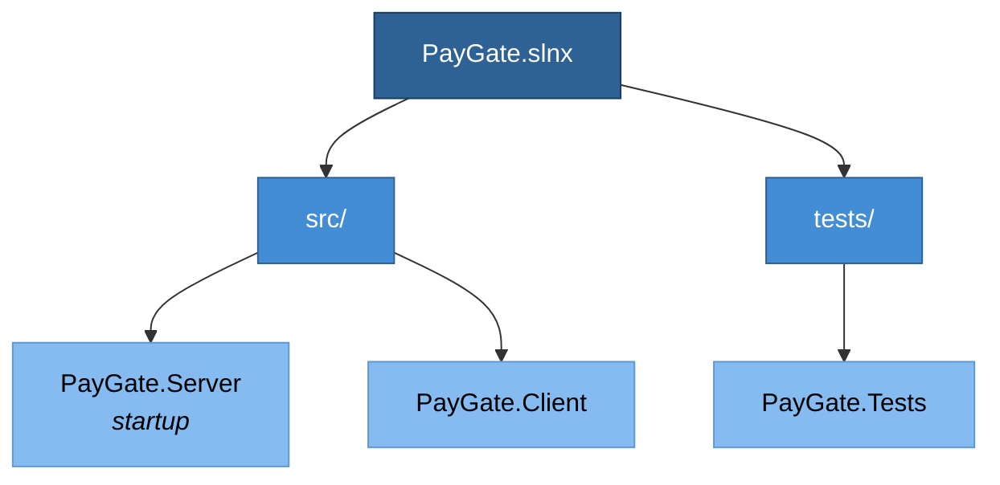

## Deployment

```spec
deployment Development {
    node "Developer Workstation" {
        technology: "Docker Desktop";

        node "PayGate Container" {
            technology: ".NET 10 SDK";
            instance: PayGate.Server;
            port: 5200;
        }
    }

    rationale "PayGate runs as a Docker container on the developer
               workstation. PizzaShop's docker-compose file starts
               PayGate alongside PostgreSQL, with the Stripe base URL
               environment variable pointing to http://paygate:5200.";
}

deployment CI {
    node "GitHub Actions Runner" {
        technology: "ubuntu-latest";

        node "PayGate Service Container" {
            technology: ".NET 10 SDK, Docker";
            instance: PayGate.Server;
            port: 5200;
        }
    }

    rationale {
        context "Integration tests in CI need a running PayGate
                 instance to validate PizzaShop payment flows.";
        decision "PayGate runs as a service container in GitHub Actions.
                  The PizzaShop test step sets STRIPE_BASE_URL to the
                  service container's address.";
        consequence "CI tests exercise the same code paths as production
                     without requiring Stripe API keys or network access
                     to Stripe's servers.";
    }
}
```

Rendered deployment:

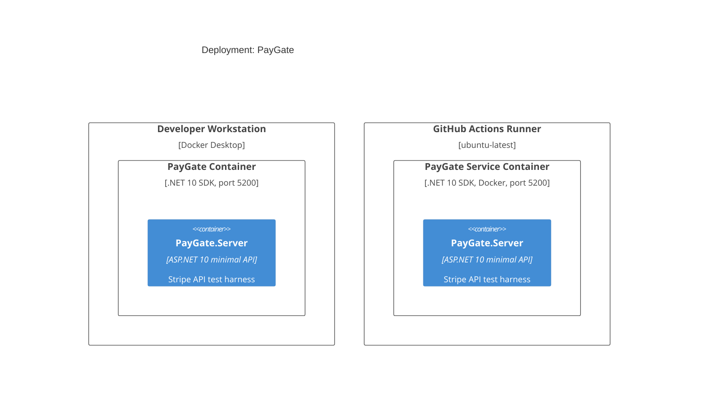

## Views

```spec
view systemContext of PayGate ContextView {
    include: all;
    autoLayout: top-down;
    description: "PayGate with its users (Developer, CI Pipeline) and
                  external systems (Stripe, PizzaShop.Infrastructure).";
}

view container of PayGate ContainerView {
    include: all;
    autoLayout: left-right;
    description: "Internal structure showing PayGate.Server,
                  PayGate.Client, and PayGate.Tests with their
                  dependencies.";
}

view deployment of Development DevelopmentDeploymentView {
    include: all;
    autoLayout: top-down;
    description: "Developer workstation running PayGate as a Docker
                  container alongside PizzaShop services.";
    @tag("dev");
}

view deployment of CI CIDeploymentView {
    include: all;
    autoLayout: top-down;
    description: "GitHub Actions runner with PayGate as a service
                  container for automated integration tests.";
    @tag("ci");
}
```

## Dynamic Scenarios

### Stub Mode: Payment Intent

PizzaShop.Infrastructure calls PayGate in Stub mode during unit-level
integration tests. PayGate returns a preconfigured success response
without contacting Stripe.

```spec
dynamic StubPaymentIntent {
    1: Developer -> PayGate.Server {
        description: "Configures PayGate to Stub mode via management API.";
        technology: "REST/HTTPS";
    };
    2: PizzaShop.Infrastructure -> PayGate.Server {
        description: "POST /v1/payment_intents with amount and currency.";
        technology: "REST/HTTPS";
    };
    3: PayGate.Server -> PayGate.Server
        : "Generates synthetic PaymentIntent with a unique ID and
           status RequiresConfirmation.";
    4: PayGate.Server -> PayGate.Server
        : "Logs request and response to in-memory request log.";
    5: PayGate.Server -> PizzaShop.Infrastructure {
        description: "Returns Stripe-shaped JSON with the synthetic
                      payment intent.";
        technology: "REST/HTTPS";
    };
}
```

Rendered interaction sequence:

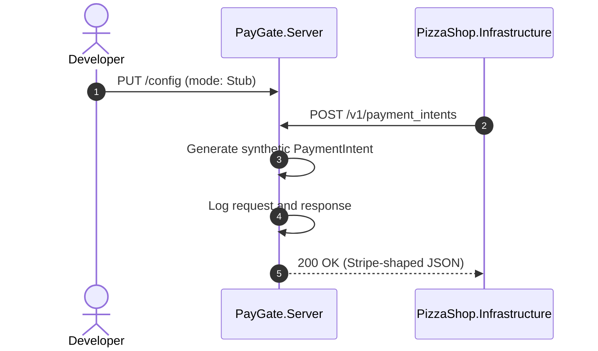

### Record Mode: Payment Intent

PayGate proxies the request to real Stripe and records both the request
and response for later replay.

```spec
dynamic RecordPaymentIntent {
    1: Developer -> PayGate.Server {
        description: "Configures PayGate to Record mode with Stripe API
                      credentials.";
        technology: "REST/HTTPS";
    };
    2: PizzaShop.Infrastructure -> PayGate.Server {
        description: "POST /v1/payment_intents with amount and currency.";
        technology: "REST/HTTPS";
    };
    3: PayGate.Server -> Stripe {
        description: "Forwards the request to Stripe with real credentials.";
        technology: "REST/HTTPS";
    };
    4: Stripe -> PayGate.Server
        : "Returns payment intent response.";
    5: PayGate.Server -> PayGate.Server
        : "Records request and response pair keyed by request signature.";
    6: PayGate.Server -> PizzaShop.Infrastructure {
        description: "Returns the real Stripe response unmodified.";
        technology: "REST/HTTPS";
    };
}
```

Rendered interaction sequence:

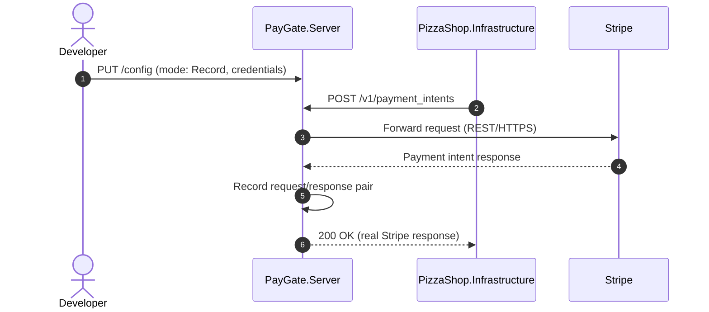

### Replay Mode: Payment Intent

PayGate returns a previously recorded response matched by request
signature. No network call to Stripe occurs.

```spec
dynamic ReplayPaymentIntent {
    1: Developer -> PayGate.Server {
        description: "Configures PayGate to Replay mode.";
        technology: "REST/HTTPS";
    };
    2: PizzaShop.Infrastructure -> PayGate.Server {
        description: "POST /v1/payment_intents with amount and currency.";
        technology: "REST/HTTPS";
    };
    3: PayGate.Server -> PayGate.Server
        : "Matches request signature against recorded entries.";
    4: PayGate.Server -> PayGate.Server
        : "Logs replay request and the matched response.";
    5: PayGate.Server -> PizzaShop.Infrastructure {
        description: "Returns the matched recorded response.";
        technology: "REST/HTTPS";
    };
}
```

Rendered interaction sequence:

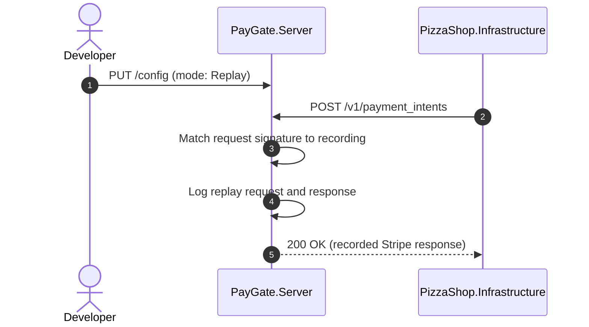

### FaultInject Mode: Payment Failure

PayGate returns a configurable error response to test PizzaShop's
failure handling for payments.

```spec
dynamic FaultInjectPayment {
    1: Developer -> PayGate.Server {
        description: "Configures PayGate to FaultInject mode with a
                      FaultConfig specifying 402, card_declined, and
                      2000ms delay.";
        technology: "REST/HTTPS";
    };
    2: PizzaShop.Infrastructure -> PayGate.Server {
        description: "POST /v1/payment_intents with amount and currency.";
        technology: "REST/HTTPS";
    };
    3: PayGate.Server -> PayGate.Server
        : "Waits for the configured delay (2000ms).";
    4: PayGate.Server -> PayGate.Server
        : "Logs the request and the fault response.";
    5: PayGate.Server -> PizzaShop.Infrastructure {
        description: "Returns 402 with Stripe-shaped error body
                      containing card_declined error type.";
        technology: "REST/HTTPS";
    };
}
```

Rendered interaction sequence:

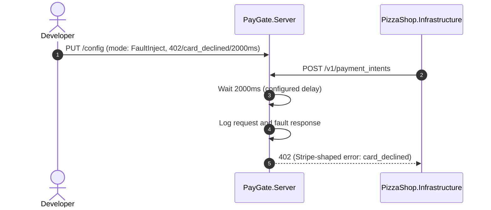

### Stub Mode: Refund

PizzaShop.Infrastructure requests a refund through PayGate in Stub mode,
exercising the CancelOrder payment path.

```spec
dynamic StubRefund {
    1: PizzaShop.Infrastructure -> PayGate.Server {
        description: "POST /v1/refunds with payment intent ID and amount.";
        technology: "REST/HTTPS";
    };
    2: PayGate.Server -> PayGate.Server
        : "Generates synthetic Refund with status Succeeded.";
    3: PayGate.Server -> PayGate.Server
        : "Logs request and response.";
    4: PayGate.Server -> PizzaShop.Infrastructure {
        description: "Returns Stripe-shaped JSON with the synthetic refund.";
        technology: "REST/HTTPS";
    };
}
```

Rendered interaction sequence:

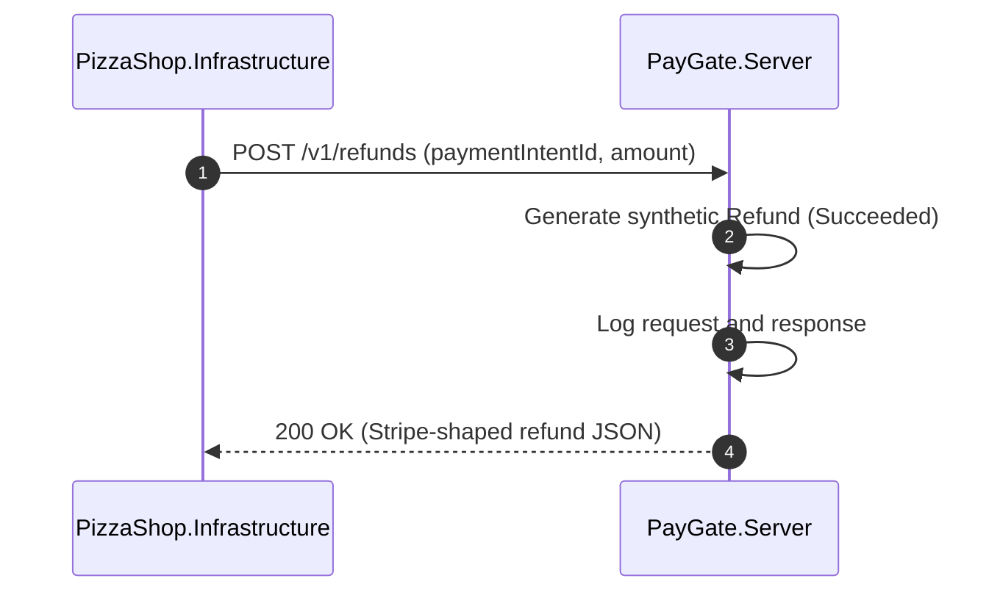

### Request Log Inspection

A developer or test assertion retrieves the captured request log to
verify that PizzaShop made the expected calls.

```spec
dynamic InspectRequestLog {
    1: Developer -> PayGate.Server {
        description: "GET /admin/requests to retrieve the request log.";
        technology: "REST/HTTPS";
    };
    2: PayGate.Server -> PayGate.Server
        : "Collects all PayGateRequest and PayGateResponse pairs.";
    3: PayGate.Server -> Developer {
        description: "Returns JSON array of request/response log entries.";
        technology: "REST/HTTPS";
    };
}
```

Rendered interaction sequence:

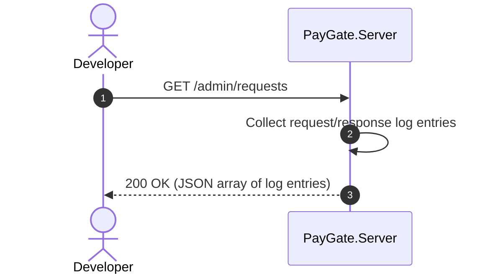

## Open Items

None at this time.
