# PizzaShop -- System Specification

## Tracking

| Field | Value |
|---|---|
| Created | 2026-04-15 |
| State | Draft |
| Reviewed | |
| Approved | |
| Executed | |
| Verified | |
| Dependencies | PayGate.spec.md, SendGate.spec.md (test harness subsystems) |

This specification describes an online pizza ordering system built with ASP.NET 10.
Customers browse a menu, customize pizzas, and place orders through a Blazor
WebAssembly frontend. The backend is an ASP.NET Web API that manages orders,
processes payments through Stripe, and sends confirmation emails via SendGrid.
Data is stored in PostgreSQL using Entity Framework Core.

An admin interface provides order management and sales analytics.

In dev and test environments, two companion test harness subsystems (PayGate
and SendGate) stand in for Stripe and SendGrid respectively, allowing
integration validation without hitting production APIs. See
PayGate.spec.md and SendGate.spec.md for their full specifications.

## Context

```spec
person Customer {
    description: "A person who browses the menu, customizes pizzas,
                  places orders, and tracks delivery status.";
    @tag("customer-facing");
}

person Admin {
    description: "Restaurant staff who manage menu items, monitor
                  incoming orders, and review sales analytics.";
    @tag("admin-only", "internal");
}

external system Stripe {
    description: "Third-party payment processor that handles credit
                  card charges and refunds.";
    technology: "REST/HTTPS";
    @tag("payment", "external");
    rationale "Stripe provides PCI-compliant payment processing,
               eliminating the need to handle card data directly.";
}

external system SendGrid {
    description: "Third-party email delivery service for transactional
                  messages such as order confirmations and status updates.";
    technology: "REST/HTTPS";
    @tag("notification", "external");
    rationale "SendGrid handles email deliverability, bounce tracking,
               and template rendering so the application does not need
               its own SMTP infrastructure.";
}

external system PayGate {
    description: "Test harness that mimics the Stripe REST API surface.
                  Used in dev and test environments so integration tests
                  can validate payment flows without hitting Stripe.
                  Supports stub, record, replay, and fault injection modes.";
    technology: "REST/HTTPS";
    @tag("payment", "test-harness");
    rationale "PayGate provides a controlled, deterministic payment
               endpoint for integration testing. See PayGate.spec.md.";
}

external system SendGate {
    description: "Test harness that mimics the SendGrid REST API surface.
                  Captures emails in an in-memory inbox for test assertion.
                  Used in dev and test environments to validate email flows
                  without delivering real messages.";
    technology: "REST/HTTPS";
    @tag("notification", "test-harness");
    rationale "SendGate provides inbox inspection so tests can assert
               email content and recipients. See SendGate.spec.md.";
}

Customer -> PizzaShop : "Browses menu, builds pizzas, places and tracks orders.";

Admin -> PizzaShop : "Manages menu items, views incoming orders, reviews analytics.";

PizzaShop -> Stripe {
    description: "Submits payment intents and processes refunds.";
    technology: "REST/HTTPS";
    @tag("production");
}

PizzaShop -> SendGrid {
    description: "Sends order confirmation and status update emails.";
    technology: "REST/HTTPS";
    @tag("production");
}

PizzaShop -> PayGate {
    description: "Submits payment intents and processes refunds
                  in dev/test environments.";
    technology: "REST/HTTPS";
    @tag("test-harness");
}

PizzaShop -> SendGate {
    description: "Sends emails in dev/test environments. SendGate
                  captures them for inbox inspection.";
    technology: "REST/HTTPS";
    @tag("test-harness");
}
```

Rendered system context:

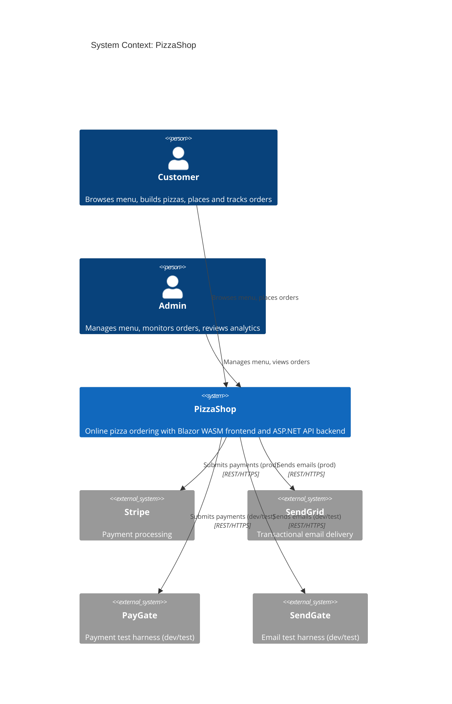

## System Declaration

```spec
system PizzaShop {
    target: "net10.0";
    responsibility: "Online pizza ordering system with a Blazor WebAssembly
                     frontend, ASP.NET Web API backend, and PostgreSQL
                     persistence. Supports menu browsing, pizza customization,
                     order placement, payment processing, and admin analytics.";

    authored component PizzaShop.Domain {
        kind: library;
        path: "src/PizzaShop.Domain";
        status: new;
        responsibility: "Domain model. Defines entities (Pizza, Topping,
                         Order, Customer), enums, repository interfaces,
                         and domain services. No infrastructure or UI concerns.";
        contract {
            guarantees "No references to Entity Framework, HTTP, or Blazor
                        namespaces. Domain depends only on base class library
                        types.";
        }
    }

    authored component PizzaShop.Infrastructure {
        kind: library;
        path: "src/PizzaShop.Infrastructure";
        status: new;
        responsibility: "Infrastructure layer. Implements repository interfaces
                         using Entity Framework Core and PostgreSQL. Contains
                         the Stripe payment client and SendGrid email client.";
        contract {
            guarantees "All external service calls are isolated behind
                        interfaces defined in PizzaShop.Domain.";
            guarantees "EF Core DbContext is the sole data access mechanism.
                        No raw SQL outside of migrations.";
        }
    }

    authored component PizzaShop.Shared {
        kind: library;
        path: "src/PizzaShop.Shared";
        status: existing;
        responsibility: "DTOs and API contracts shared between the Blazor
                         client and the Web API. Contains request and response
                         models, validation attributes, and route constants.";
        contract {
            guarantees "No domain entity references. All types are plain DTOs
                        suitable for JSON serialization.";
        }

        rationale {
            context "The Blazor WASM client and API must agree on request
                     and response shapes without sharing domain entities.";
            decision "A dedicated shared library holds DTOs, extracted from
                      the prototype built during discovery.";
            consequence "Both Client and Api reference PizzaShop.Shared but
                         neither depends on PizzaShop.Domain directly across
                         the network boundary.";
        }
    }

    authored component PizzaShop.Api {
        kind: "api-host";
        path: "src/PizzaShop.Api";
        status: new;
        responsibility: "ASP.NET Web API host. Exposes REST endpoints for
                         menu browsing, order placement, payment processing,
                         and admin operations. Wires dependency injection.";
    }

    authored component PizzaShop.Client {
        kind: "blazor-wasm-host";
        path: "src/PizzaShop.Client";
        status: new;
        responsibility: "Blazor WebAssembly frontend. Renders the menu,
                         pizza builder, cart, checkout flow, order tracking,
                         and admin dashboard. Communicates with the API
                         via HttpClient.";
    }

    authored component PizzaShop.Domain.Tests {
        kind: tests;
        path: "tests/PizzaShop.Domain.Tests";
        status: new;
        responsibility: "Unit tests for PizzaShop.Domain. Verifies domain
                         service logic, entity invariants, and price
                         calculations using xUnit.";
    }

    authored component PizzaShop.Client.Tests {
        kind: tests;
        path: "tests/PizzaShop.Client.Tests";
        status: new;
        responsibility: "Component tests for PizzaShop.Client. Verifies
                         Blazor component rendering and interaction using
                         bUnit.";
    }

    consumed component EntityFrameworkCore {
        source: nuget("Microsoft.EntityFrameworkCore");
        version: "10.*";
        responsibility: "ORM for data access and migration management.";
        used_by: [PizzaShop.Infrastructure];
        contract {
            guarantees "Code-first migrations for schema management.";
            guarantees "LINQ-based query composition.";
        }
    }

    consumed component NpgsqlEfCore {
        source: nuget("Npgsql.EntityFrameworkCore.PostgreSQL");
        version: "10.*";
        responsibility: "PostgreSQL provider for Entity Framework Core.";
        used_by: [PizzaShop.Infrastructure];
    }

    consumed component xunit {
        source: nuget("xunit");
        version: "2.*";
        responsibility: "Unit testing framework.";
        used_by: [PizzaShop.Domain.Tests, PizzaShop.Client.Tests];
    }

    consumed component bunit {
        source: nuget("bunit");
        version: "2.*";
        responsibility: "Blazor component testing library.";
        used_by: [PizzaShop.Client.Tests];
        contract {
            guarantees "Renders Blazor components in a test context with
                        simulated user interaction.";
        }
    }

    consumed component tailwindcss {
        source: npm("tailwindcss");
        version: "4.*";
        responsibility: "Utility-first CSS framework. The build pipeline
                         generates a production stylesheet from utility
                         classes used in Blazor components.";
        used_by: [PizzaShop.Client];
        rationale {
            context "The frontend needs a styling approach that integrates
                     with Blazor component markup.";
            decision "Tailwind CSS with a Node build step produces a single
                      optimized stylesheet.";
            consequence "The Client project includes a package.json and a
                         Tailwind config. The CSS build runs as a pre-build
                         step in the dotnet build pipeline.";
        }
    }

    consumed component postgresql {
        source: container("postgres:17");
        responsibility: "Relational database for all persistent data
                         including menu items, customers, and orders.";
        used_by: [PizzaShop.Infrastructure];
        rationale {
            context "The system needs relational storage with strong
                     consistency for order and payment data.";
            decision "PostgreSQL 17 running in a container for development
                      and as a managed service in production.";
            consequence "Migrations target PostgreSQL-specific features.
                         The development docker-compose file provisions
                         the database automatically.";
            supersedes "Early prototype used SQLite with Dapper for
                        local-only storage.";
        }
    }
}
```

## Data Specification

### Enums

The domain uses four enums to constrain status values, pizza configuration
options, and topping classification.

```spec
enum OrderStatus {
    Pending: "Order created but not yet confirmed",
    Confirmed: "Payment received, order queued for preparation",
    Preparing: "Kitchen staff are assembling the pizza",
    Baking: "Pizza is in the oven",
    Ready: "Pizza is boxed and awaiting pickup or delivery",
    OutForDelivery: "Driver has left with the order",
    Delivered: "Customer has received the order",
    Cancelled: "Order was cancelled before preparation"
}

enum PizzaSize {
    Small: "10 inch, serves 1",
    Medium: "12 inch, serves 2",
    Large: "14 inch, serves 3",
    ExtraLarge: "18 inch, serves 4"
}

enum CrustType {
    Thin: "Crispy thin crust",
    Classic: "Traditional hand-tossed",
    ThickCrust: "Deep dish style",
    Stuffed: "Cheese-stuffed crust"
}

enum ToppingCategory {
    Meat: "Animal protein toppings",
    Vegetable: "Plant-based toppings",
    Cheese: "Additional cheese varieties",
    Sauce: "Sauce drizzles and bases"
}
```

### Entities

The domain model centers on orders that reference pizzas and toppings.
Customers can be guests with minimal information or registered users
with saved addresses.

```spec
entity Customer {
    id: int;
    email: string @pattern("^[\\w.-]+@[\\w.-]+\\.\\w+$")
                  @confidence(high);
    name: string;
    phone: string? @reason("Optional because guest checkout requires
                            only an email address.");
    addresses: Address[];

    invariant "email required": email != "";
    invariant "name required": name != "";
}

entity Address {
    id: int;
    street: string;
    city: string;
    state: string;
    zipCode: string @pattern("^\\d{5}(-\\d{4})?$");

    invariant "street required": street != "";
    invariant "city required": city != "";
    invariant "zip format": zipCode != "";
}

entity Pizza {
    id: int;
    name: string @confidence(high);
    description: string;
    basePrice: double @range(5.99..49.99) @confidence(medium);
    size: PizzaSize @default(Medium);
    crust: CrustType @default(Classic);
    isAvailable: bool @default(true);

    invariant "name required": name != "";
    invariant "positive price": basePrice > 0;

    rationale "basePrice" {
        context "Each pizza has a base price before topping surcharges.
                 The final item price is base plus the sum of selected
                 topping prices, scaled by pizza size.";
        decision "Price is a double rather than a decimal type because
                  SpecLang uses double as its numeric type. The
                  implementation maps this to decimal in C#.";
        consequence "All price arithmetic in the domain service uses
                     decimal to avoid floating-point rounding issues.";
    }
}

entity Topping {
    id: int;
    name: string;
    price: double @range(0.50..4.99);
    category: ToppingCategory;
    isAvailable: bool @default(true);

    invariant "name required": name != "";
    invariant "positive price": price > 0;
}

entity OrderItem {
    id: int;
    pizzaId: int;
    size: PizzaSize;
    crust: CrustType;
    toppings: Topping[];
    quantity: int @range(1..20) @default(1);
    itemPrice: double;

    invariant "valid quantity": quantity >= 1;
    invariant "positive price": itemPrice > 0;
    invariant "pizza reference": pizzaId > 0;
}

entity Order {
    id: int;
    customerId: int;
    items: OrderItem[];
    status: OrderStatus @default(Pending);
    totalPrice: double;
    deliveryAddress: Address;
    createdAt: string;
    completedAt: string?;
    cancellationReason: string?;

    invariant "has items": count(items) >= 1;
    invariant "positive total": totalPrice > 0;
    invariant "customer reference": customerId > 0;
    invariant "delivered has timestamp":
        status == Delivered implies completedAt != null;
    invariant "cancelled has reason":
        status == Cancelled implies cancellationReason != null;

    rationale "status lifecycle" {
        context "Orders move through a fixed set of states from
                 Pending to Delivered or Cancelled.";
        decision "OrderStatus enum enforces the allowed values.
                  The domain service validates that transitions
                  follow the allowed sequence.";
        consequence "Invalid transitions (e.g., Delivered to Preparing)
                     are rejected by the domain service before
                     reaching the database.";
    }
}
```

### Refinements

Specialty pizzas are pre-configured recipes with fixed toppings.
Customers can still adjust the size and crust, but the topping list
is predetermined.

```spec
refines Pizza as SpecialtyPizza {
    recipeToppings: Topping[];
    isSignature: bool @default(false);

    invariant "has recipe": count(recipeToppings) >= 2;
    invariant "signature requires four":
        isSignature == true implies count(recipeToppings) >= 4;
}
```

## Contracts

### Order Operations

These contracts define the boundary commitments for the order lifecycle.

```spec
contract PlaceOrder {
    requires count(order.items) >= 1;
    requires order.status == Pending;
    requires order.totalPrice > 0;
    ensures order.id > 0;
    ensures order.status == Confirmed;
    guarantees "Order is persisted with a unique ID, all item prices
                are calculated, and the total reflects the sum of
                item prices including topping surcharges.";
}

contract ProcessPayment {
    requires order.id > 0;
    requires order.status == Pending;
    requires order.totalPrice > 0;
    ensures order.status in [Confirmed, Cancelled];
    guarantees "Payment is submitted to Stripe. On success the order
                moves to Confirmed. On failure the order is Cancelled
                with the Stripe error as the cancellation reason.";
}

contract CancelOrder {
    requires order.id > 0;
    requires order.status in [Pending, Confirmed];
    ensures order.status == Cancelled;
    ensures order.cancellationReason != null;
    guarantees "Only orders not yet in preparation can be cancelled.
                If payment was processed, a refund is initiated through
                Stripe.";
}

contract UpdateOrderStatus {
    requires order.id > 0;
    requires order.status != Delivered;
    requires order.status != Cancelled;
    ensures order.status != Pending;
    guarantees "Status advances one step in the lifecycle sequence.
                Delivered orders receive a completedAt timestamp.
                Cancelled orders cannot be updated.";
}
```

### Menu Operations

```spec
contract BrowseMenu {
    guarantees "Returns all pizzas where isAvailable is true, grouped
                by specialty and custom. Each pizza includes its base
                price and available toppings.";
    guarantees "Results are filterable by size, crust type, and
                topping category.";
}

contract ManageMenu {
    requires Admin;
    guarantees "Admin can add, update, and disable menu items.
                Disabling a pizza sets isAvailable to false without
                deleting the record, preserving order history.";
}
```

## Topology

```spec
topology Dependencies {
    allow PizzaShop.Api -> PizzaShop.Domain;
    allow PizzaShop.Api -> PizzaShop.Infrastructure;
    allow PizzaShop.Api -> PizzaShop.Shared;
    allow PizzaShop.Client -> PizzaShop.Shared;
    allow PizzaShop.Infrastructure -> PizzaShop.Domain;
    allow PizzaShop.Domain.Tests -> PizzaShop.Domain;
    allow PizzaShop.Client.Tests -> PizzaShop.Client;
    allow PizzaShop.Client.Tests -> PizzaShop.Shared;

    deny PizzaShop.Domain -> PizzaShop.Infrastructure;
    deny PizzaShop.Domain -> PizzaShop.Api;
    deny PizzaShop.Client -> PizzaShop.Domain;
    deny PizzaShop.Client -> PizzaShop.Infrastructure;
    deny PizzaShop.Shared -> PizzaShop.Domain;

    invariant "domain is a pure library":
        PizzaShop.Domain.kind == library;

    rationale "deny PizzaShop.Client -> PizzaShop.Domain" {
        context "The Blazor client runs in the browser and communicates
                 with the API over HTTP.";
        decision "Client references only PizzaShop.Shared for DTOs.
                  Domain entities never cross the network boundary.";
        consequence "The domain model can evolve independently of the
                     client contract. Breaking changes require explicit
                     DTO updates in Shared.";
    }

    rationale {
        context "The system separates concerns across four layers:
                 Domain (entities and logic), Infrastructure (data
                 access and external services), Shared (DTOs), and
                 hosts (Api and Client).";
        decision "Domain has no upward dependencies. The Client
                  communicates with the API via Shared DTOs over
                  HTTP. Infrastructure implements domain interfaces
                  and owns all external service integration.";
        consequence "Domain logic can be tested in isolation. The
                     Blazor client can be replaced with a mobile
                     app by targeting the same API. External service
                     providers (Stripe, SendGrid) can be swapped by
                     changing only Infrastructure.";
    }
}
```

Rendered topology:

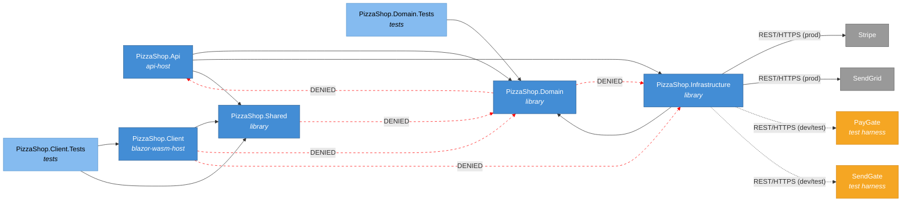

## Phases

```spec
phase DomainModel {
    produces: [PizzaShop.Domain, PizzaShop.Shared];

    gate Compile {
        command: "dotnet build src/PizzaShop.Domain";
        expects: "zero errors";
    }

    gate SharedCompile {
        command: "dotnet build src/PizzaShop.Shared";
        expects: "zero errors";
    }
}

phase DataAccess {
    requires: DomainModel;
    produces: [PizzaShop.Infrastructure];

    gate Compile {
        command: "dotnet build src/PizzaShop.Infrastructure";
        expects: "zero errors";
    }

    gate MigrationsApply {
        command: "dotnet ef database update --project src/PizzaShop.Infrastructure";
        expects: "zero errors";
    }
}

phase ApiHost {
    requires: DomainModel, DataAccess;
    produces: [PizzaShop.Api];

    gate Compile {
        command: "dotnet build src/PizzaShop.Api";
        expects: "zero errors";
    }

    gate HealthCheck {
        command: "curl -f http://localhost:5100/health";
        expects: "exit_code == 0";
    }
}

phase ClientShell {
    requires: DomainModel;
    produces: [PizzaShop.Client];

    gate Compile {
        command: "dotnet build src/PizzaShop.Client";
        expects: "zero errors";
    }

    gate TailwindBuild {
        command: "npm run build:css --prefix src/PizzaShop.Client";
        expects: "zero errors";
    }
}

phase Testing {
    requires: DomainModel, DataAccess;
    produces: [PizzaShop.Domain.Tests, PizzaShop.Client.Tests];

    gate DomainTests {
        command: "dotnet test tests/PizzaShop.Domain.Tests";
        expects: "all tests pass", pass >= 30;
    }

    gate ClientTests {
        command: "dotnet test tests/PizzaShop.Client.Tests";
        expects: "all tests pass", pass >= 15;
    }
}

phase Integration {
    requires: ApiHost, ClientShell, Testing;

    gate FullBuild {
        command: "dotnet build PizzaShop.slnx";
        expects: "zero errors";
    }

    gate AllTests {
        command: "dotnet test PizzaShop.slnx";
        expects: "all tests pass", fail == 0;
    }

    rationale "Final gate confirms the complete solution builds and
               all tests pass before the spec can advance to Verified.";
}
```

Rendered phase ordering:

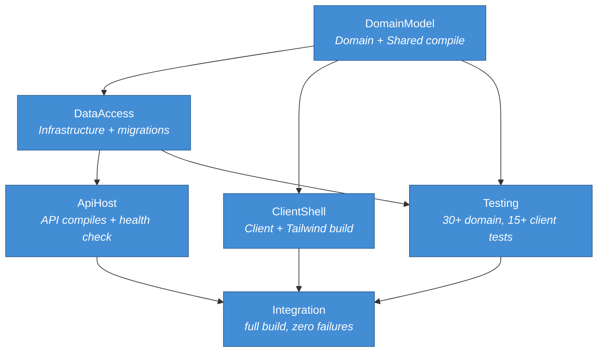

## Traces

```spec
trace OrderLifecycle {
    PlaceOrder -> [PizzaShop.Api, PizzaShop.Domain,
                   PizzaShop.Infrastructure, PizzaShop.Client];
    ProcessPayment -> [PizzaShop.Api, PizzaShop.Infrastructure];
    CancelOrder -> [PizzaShop.Api, PizzaShop.Domain,
                    PizzaShop.Infrastructure];
    UpdateOrderStatus -> [PizzaShop.Api, PizzaShop.Domain,
                          PizzaShop.Infrastructure];
    BrowseMenu -> [PizzaShop.Api, PizzaShop.Domain,
                   PizzaShop.Infrastructure, PizzaShop.Client];
    ManageMenu -> [PizzaShop.Api, PizzaShop.Domain,
                   PizzaShop.Infrastructure, PizzaShop.Client];

    invariant "full coverage":
        all sources have count(targets) >= 1;
    invariant "api always involved":
        all sources have targets contains PizzaShop.Api;
}

trace DataModel {
    Customer -> [PizzaShop.Domain, PizzaShop.Infrastructure];
    Pizza -> [PizzaShop.Domain, PizzaShop.Infrastructure,
              PizzaShop.Client];
    Topping -> [PizzaShop.Domain, PizzaShop.Infrastructure,
                PizzaShop.Client];
    Order -> [PizzaShop.Domain, PizzaShop.Infrastructure];
    OrderItem -> [PizzaShop.Domain, PizzaShop.Infrastructure];
    SpecialtyPizza -> [PizzaShop.Domain, PizzaShop.Client];

    invariant "all entities persisted":
        all sources have targets contains PizzaShop.Infrastructure;
}
```

## System-Level Constraints

```spec
constraint DomainPurity {
    scope: [PizzaShop.Domain];
    rule: "No references to Entity Framework, HttpClient, Blazor,
           or any infrastructure namespace. Domain depends only on
           base class library types and its own interfaces.";

    rationale {
        context "The domain must be testable in isolation and reusable
                 across different hosting models.";
        decision "All infrastructure access goes through interfaces
                  defined in PizzaShop.Domain and implemented in
                  PizzaShop.Infrastructure.";
        consequence "Swapping PostgreSQL for another database or Stripe
                     for another payment provider requires changes only
                     in PizzaShop.Infrastructure.";
    }
}

constraint NullableEnabled {
    scope: all authored components;
    rule: "Nullable reference types are enabled in every project file.
           No suppression operators (!) outside of test setup code.";

    rationale "Catches null-reference bugs at compile time. The suppression
               operator is allowed only in test arrange sections where mock
               setup requires it.";
}

constraint ApiStateless {
    scope: [PizzaShop.Api];
    rule: "API controllers are stateless. No static mutable fields, no
           in-memory caches, no session state. All state lives in the
           database or in scoped DI services.";

    rationale "Stateless API instances enable horizontal scaling behind
               a load balancer without sticky sessions.";
}

constraint SharedDtoOnly {
    scope: [PizzaShop.Shared];
    rule: "Contains only DTOs, enums, constants, and validation attributes.
           No business logic, no service interfaces, no entity types.";

    rationale "The Shared library crosses the network boundary. Keeping it
               limited to serializable types prevents accidental coupling
               between client and server internals.";
}

constraint TestNaming {
    scope: [PizzaShop.Domain.Tests, PizzaShop.Client.Tests];
    rule: "Test methods follow MethodName_Scenario_ExpectedResult naming.
           Test classes mirror the source class name with a Tests suffix.";

    rationale "Consistent naming makes test failures immediately
               interpretable from CI output alone.";
}
```

## Package Policy

```spec
package_policy PizzaShopPolicy {
    source: nuget("https://api.nuget.org/v3/index.json");

    allow category("platform")
        includes ["System.*", "Microsoft.Extensions.*",
                  "Microsoft.AspNetCore.*"];

    allow category("data-access")
        includes ["Microsoft.EntityFrameworkCore",
                  "Microsoft.EntityFrameworkCore.*",
                  "Npgsql", "Npgsql.*"];

    allow category("testing")
        includes ["xunit", "xunit.*", "bunit", "bunit.*",
                  "Microsoft.NET.Test.Sdk", "coverlet.collector"];

    allow category("blazor")
        includes ["Microsoft.AspNetCore.Components.*"];

    deny category("orm-alternatives")
        includes ["Dapper", "Dapper.*", "NHibernate", "NHibernate.*"];

    deny category("css-framework-alternatives")
        includes ["Bootstrap", "MudBlazor", "Radzen.*", "Blazorise.*"];

    default: require_rationale;

    rationale {
        context "The system standardizes on Entity Framework Core for
                 data access and Tailwind CSS for styling.";
        decision "Platform, EF Core, Blazor, and test packages are
                  pre-approved. Alternative ORMs and CSS component
                  libraries are denied to prevent fragmentation.
                  Anything else requires an explicit rationale.";
        consequence "Adding a new dependency outside the approved
                     categories triggers a review. This keeps the
                     dependency tree focused and auditable.";
        supersedes "Prototype used Dapper for data access and Bootstrap
                    for styling. Both were replaced during architecture
                    review to better support the domain model complexity
                    and component isolation goals.";
    }
}
```

## Platform Realization

```spec
dotnet solution PizzaShop {
    format: slnx;
    startup: PizzaShop.Api;

    folder "src" {
        projects: [PizzaShop.Domain, PizzaShop.Infrastructure,
                   PizzaShop.Shared, PizzaShop.Api, PizzaShop.Client];
    }

    folder "tests" {
        projects: [PizzaShop.Domain.Tests, PizzaShop.Client.Tests];
    }

    rationale {
        context ".NET 10 defaults to .slnx format. The solution groups
                 source and test projects into separate folders.";
        decision "PizzaShop.Api is the startup project. During
                  development, the Blazor WASM client is served by
                  the API host via UseBlazorFrameworkFiles.";
        consequence "Running dotnet run from the Api project serves
                     both the API and the Blazor client on a single
                     port in development.";
    }
}
```

Rendered solution structure:

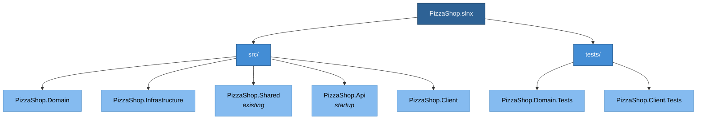

## Deployment

```spec
deployment Development {
    node "Developer Workstation" {
        technology: "Docker Desktop";

        node "API Container" {
            technology: ".NET 10 SDK";
            instance: PizzaShop.Api;
        }

        node "Blazor Dev Server" {
            technology: "Blazor WebAssembly";
            instance: PizzaShop.Client;
        }

        node "PostgreSQL Container" {
            technology: "PostgreSQL 17";
            instance: postgresql;
            @tag("infrastructure");
        }

        node "PayGate Container" {
            technology: ".NET 10, ASP.NET Minimal API";
            instance: PayGate;
            @tag("test-harness");
        }

        node "SendGate Container" {
            technology: ".NET 10, ASP.NET Minimal API";
            instance: SendGate;
            @tag("test-harness");
        }
    }

    rationale {
        context "Development uses Docker Compose to provision infrastructure
                 alongside the .NET projects. The API and client run via
                 dotnet watch for hot reload.";
        decision "PayGate and SendGate run as sidecar containers in the
                  Docker Compose stack. PizzaShop.Infrastructure reads
                  the payment and email base URLs from configuration,
                  pointing to the gate containers instead of the
                  production Stripe and SendGrid endpoints.";
        consequence "Integration tests run locally against deterministic
                     test doubles. No Stripe or SendGrid credentials are
                     needed for development.";
    }
}

deployment Production {
    node "Azure App Service" {
        technology: "Linux P2v3";
        instance: PizzaShop.Api;

        node "Static Web Assets" {
            technology: "Blazor WebAssembly CDN";
            instance: PizzaShop.Client;
        }
    }

    node "Azure Database for PostgreSQL" {
        technology: "Flexible Server, General Purpose D2ds_v5";
        instance: postgresql;
        @tag("infrastructure", "managed");
    }

    rationale {
        context "Production needs managed infrastructure with automatic
                 backups, scaling, and TLS termination.";
        decision "Azure App Service hosts the API and serves the Blazor
                  WASM assets as static files. Azure Database for
                  PostgreSQL provides managed relational storage.";
        consequence "Deployments target Azure via GitHub Actions. The
                     API container image is built in CI and pushed to
                     Azure Container Registry.";
    }
}
```

## Views

```spec
view systemLandscape LandscapeView {
    include: all;
    autoLayout: top-down;
    description: "All actors, the PizzaShop system, and external
                  service dependencies in the ordering ecosystem.";
}

view systemContext of PizzaShop ContextView {
    include: all;
    autoLayout: top-down;
    description: "The PizzaShop system with its two user roles and
                  two external service integrations.";
}

view container of PizzaShop ContainerView {
    include: all;
    autoLayout: left-right;
    description: "Internal structure showing all authored and consumed
                  components with their dependency relationships.";
}

view container of PizzaShop CustomerFacingView {
    include: [PizzaShop.Api, PizzaShop.Client, PizzaShop.Shared,
              PizzaShop.Domain, PizzaShop.Infrastructure];
    exclude: tagged "admin-only";
    autoLayout: left-right;
    description: "Components involved in the customer ordering flow,
                  excluding admin-only elements.";
    @tag("customer-facing");
}

view component of PizzaShop.Api ApiComponentView {
    include: all;
    exclude: tagged "infrastructure";
    autoLayout: top-down;
    description: "Internal structure of the API host showing
                  controllers, services, and middleware.";
}

view deployment of Production ProductionDeploymentView {
    include: all;
    autoLayout: top-down;
    description: "Production infrastructure on Azure showing the App
                  Service, static web assets, and managed PostgreSQL.";
    @tag("ops");
}

view deployment of Development DevelopmentDeploymentView {
    include: all;
    autoLayout: top-down;
    description: "Development environment with Docker Compose including
                  PayGate and SendGate test harness containers alongside
                  PostgreSQL.";
    @tag("dev", "test-harness");
}
```

Rendered system landscape:

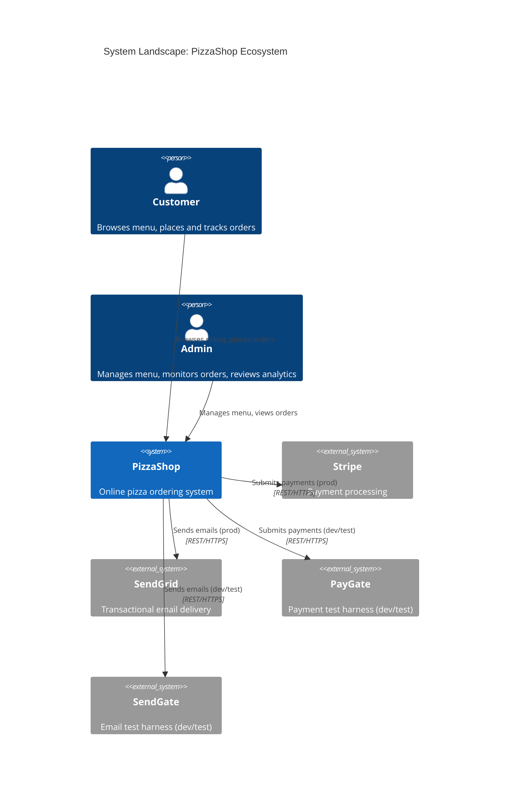

Rendered container view:

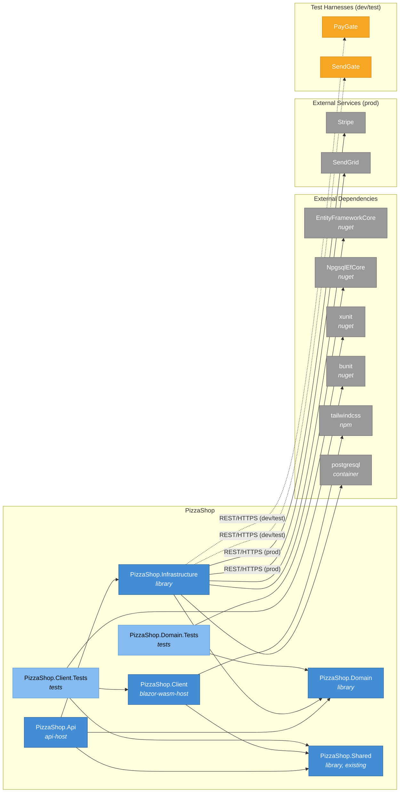

Rendered customer-facing view (excludes admin-only elements):

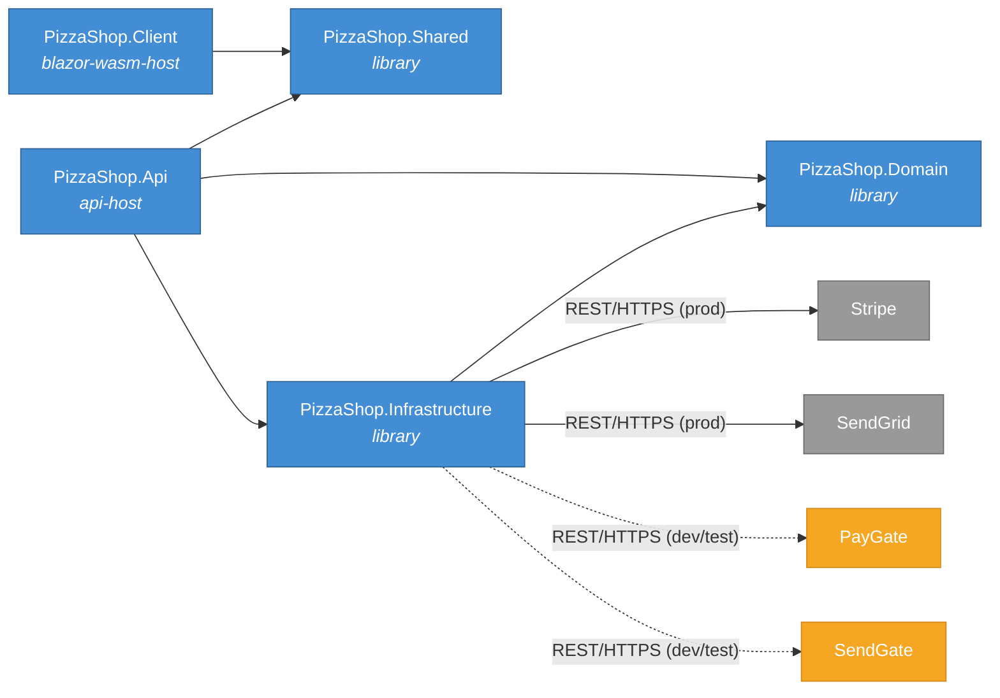

Rendered API component view:

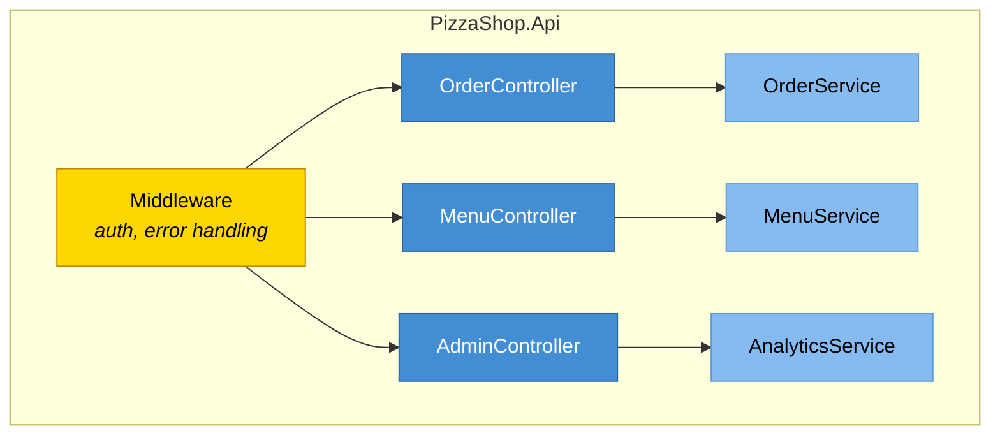

Rendered production deployment:

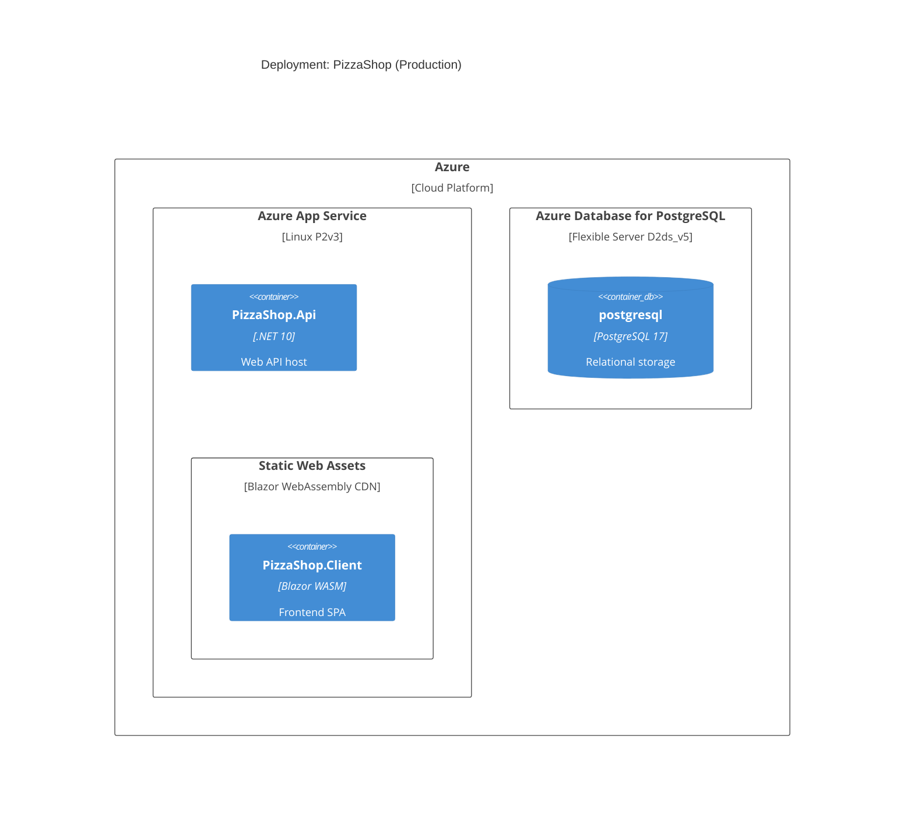

Rendered development deployment:

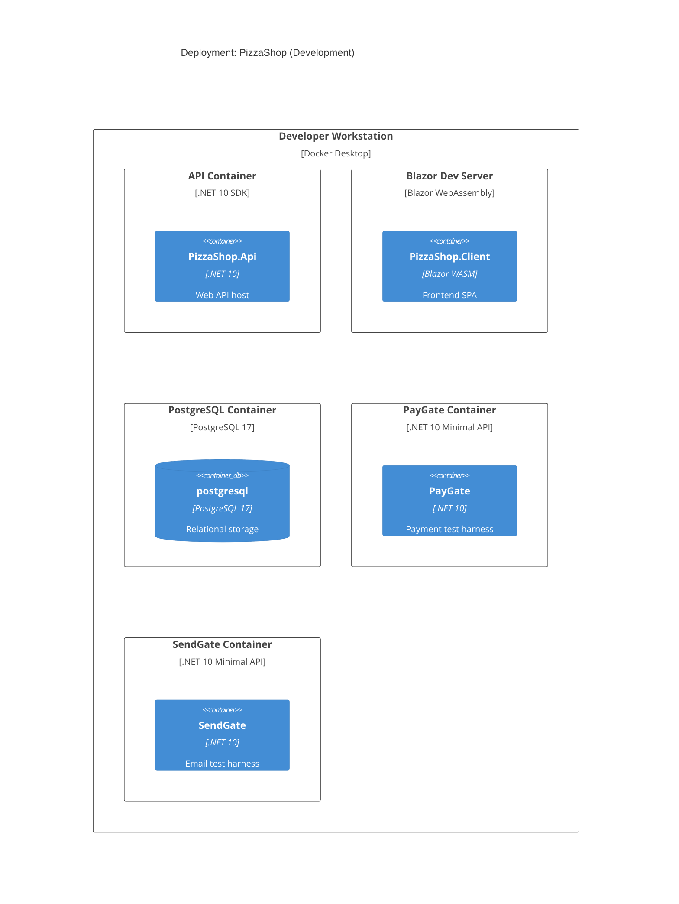

## Dynamic Scenarios

### Place Order

The primary customer flow from menu browsing through order confirmation.

```spec
dynamic PlaceOrder {
    1: Customer -> PizzaShop.Client
        : "Browses menu and adds customized pizzas to cart.";
    2: PizzaShop.Client -> PizzaShop.Api {
        description: "Submits order with items and delivery address.";
        technology: "HTTP/JSON";
    };
    3: PizzaShop.Api -> PizzaShop.Domain
        : "Validates order, calculates item prices and total.";
    4: PizzaShop.Api -> PizzaShop.Infrastructure
        : "Persists order to PostgreSQL via repository.";
    5: PizzaShop.Api -> PizzaShop.Infrastructure
        : "Initiates payment through Stripe client.";
    6: PizzaShop.Infrastructure -> Stripe {
        description: "Creates payment intent for order total.";
        technology: "REST/HTTPS";
    };
    7: Stripe -> PizzaShop.Infrastructure
        : "Returns payment confirmation.";
    8: PizzaShop.Infrastructure -> SendGrid {
        description: "Sends order confirmation email to customer.";
        technology: "REST/HTTPS";
    };
    9: PizzaShop.Api -> PizzaShop.Client {
        description: "Returns order confirmation with tracking ID.";
        technology: "HTTP/JSON";
    };
    10: PizzaShop.Client -> Customer
        : "Displays confirmation with order tracking link.";
}
```

Rendered interaction sequence:

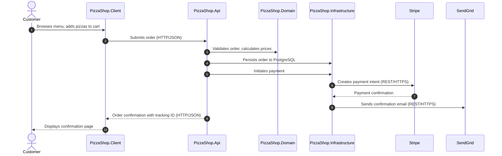

### Track Order

```spec
dynamic TrackOrder {
    1: Customer -> PizzaShop.Client
        : "Opens order tracking page with order ID.";
    2: PizzaShop.Client -> PizzaShop.Api {
        description: "Requests current order status.";
        technology: "HTTP/JSON";
    };
    3: PizzaShop.Api -> PizzaShop.Infrastructure
        : "Queries order from PostgreSQL.";
    4: PizzaShop.Infrastructure -> PizzaShop.Api
        : "Returns order with current status.";
    5: PizzaShop.Api -> PizzaShop.Client {
        description: "Returns order status and estimated time.";
        technology: "HTTP/JSON";
    };
    6: PizzaShop.Client -> Customer
        : "Displays order status with progress indicator.";
}
```

Rendered interaction sequence:

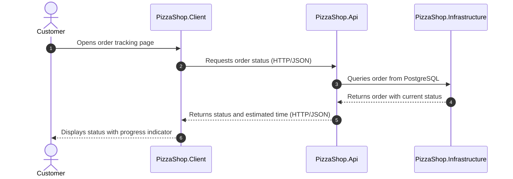

### Admin Order Management

```spec
dynamic AdminUpdateOrder {
    1: Admin -> PizzaShop.Client
        : "Opens admin order management page.";
    2: PizzaShop.Client -> PizzaShop.Api {
        description: "Advances order to next status.";
        technology: "HTTP/JSON";
    };
    3: PizzaShop.Api -> PizzaShop.Domain
        : "Validates status transition is allowed.";
    4: PizzaShop.Api -> PizzaShop.Infrastructure
        : "Updates order status in database.";
    5: PizzaShop.Infrastructure -> SendGrid {
        description: "Sends status update email to customer.";
        technology: "REST/HTTPS";
    };
    6: PizzaShop.Api -> PizzaShop.Client {
        description: "Confirms status update.";
        technology: "HTTP/JSON";
    };
    7: PizzaShop.Client -> Admin
        : "Refreshes order list with updated status.";
}
```

Rendered interaction sequence:

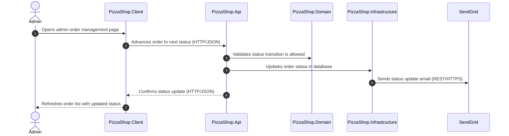

## Design

### Pages

The Blazor client is organized into customer-facing ordering pages and
admin management pages. Each page maps to a route and references the
domain concepts it renders.

```spec
page MenuPage {
    host: PizzaShop.Client;
    route: "/menu";
    concepts: [Pizza, Topping, PizzaSize, CrustType, SpecialtyPizza];
    role: "Displays available pizzas with filtering by size, crust,
           and topping category. Specialty pizzas are featured at the
           top of the page.";
    cross_links: [PizzaBuilderPage, CartPage];
}

page PizzaBuilderPage {
    host: PizzaShop.Client;
    route: "/pizza/{id}";
    concepts: [Pizza, Topping, PizzaSize, CrustType, ToppingCategory];
    role: "Interactive pizza customizer where the customer selects
           size, crust, and toppings. Displays a running price total
           that updates as selections change.";
    cross_links: [MenuPage, CartPage];
}

page CartPage {
    host: PizzaShop.Client;
    route: "/cart";
    concepts: [OrderItem, Pizza, Topping];
    role: "Shows all items in the current cart with quantities, per-item
           prices, and an order total. Items can be edited or removed.";
    cross_links: [MenuPage, PizzaBuilderPage, CheckoutPage];
}

page CheckoutPage {
    host: PizzaShop.Client;
    route: "/checkout";
    concepts: [Order, Customer, Address];
    role: "Collects delivery address and payment information. Submits
           the order and displays the confirmation on success.";
    cross_links: [CartPage, OrderTrackingPage];
}

page OrderTrackingPage {
    host: PizzaShop.Client;
    route: "/orders/{id}";
    concepts: [Order, OrderStatus];
    role: "Displays the current status of an order with a visual
           progress indicator showing each lifecycle stage.";
    cross_links: [MenuPage];
}

page AdminDashboardPage {
    host: PizzaShop.Client;
    route: "/admin";
    concepts: [Order, Pizza, OrderStatus];
    role: "Sales analytics dashboard showing order volume over time,
           revenue breakdown by pizza, and popular topping combinations.";
    cross_links: [AdminOrdersPage];

    rationale {
        context "The restaurant owner needs visibility into sales
                 trends without querying the database directly.";
        decision "A dedicated admin dashboard with chart visualizations
                  driven by aggregated order data.";
        consequence "The API exposes analytics endpoints that return
                     pre-aggregated data. No raw order dumps are sent
                     to the client.";
    }
}

page AdminOrdersPage {
    host: PizzaShop.Client;
    route: "/admin/orders";
    concepts: [Order, OrderStatus, Customer];
    role: "Lists all orders with filtering by status. Admin can advance
           an order to the next status or cancel pending orders.";
    cross_links: [AdminDashboardPage];
}
```

### Visualizations

The admin dashboard includes two chart visualizations for sales analytics.

```spec
visualization OrderVolumeChart {
    page: AdminDashboardPage;
    component: PizzaShop.Client;

    parameters {
        volume: Order.CountByDate;
    }

    sliders: [startDate, endDate];

    rationale "Bar chart showing daily order counts over a selectable
               date range. Helps identify peak ordering days and
               seasonal trends.";
}

visualization RevenueBreakdownChart {
    page: AdminDashboardPage;
    component: PizzaShop.Client;

    parameters {
        revenue: Order.RevenueByPizza;
    }

    sliders: [startDate, endDate];

    rationale "Pie chart showing revenue share per pizza type over
               a selectable date range. Informs menu pricing and
               promotion decisions.";
}
```

## Open Items

- PizzaShop.Infrastructure integration tests should add a phase gate that
  requires PayGate and SendGate containers to be running. This gate belongs
  in the Integration phase once the gate specs reach Executed state.
- Docker Compose file for the Development deployment should be authored to
  include PayGate and SendGate as sidecar services alongside PostgreSQL.
