# SendGate -- System Specification

## Tracking

| Field | Value |
|---|---|
| Created | 2026-04-16 |
| State | Draft |
| Reviewed | |
| Approved | |
| Executed | |
| Verified | |
| Dependencies | PizzaShop.spec.md |

SendGate is a test harness that mimics the SendGrid email API at the HTTP
level. It allows PizzaShop (and any other system that integrates with
SendGrid) to validate email-sending code in dev and test environments
without delivering real messages.

SendGate captures every email submitted to its `mail/send` endpoint,
stores the messages in memory, and exposes an inbox inspection API.
Tests can assert that the correct emails were sent to the correct
recipients with the expected content. Four behavior modes (Stub,
Record, Replay, FaultInject) cover the full range of test scenarios
from happy-path validation to fault-tolerance checks.

## Context

```spec
person Developer {
    description: "A software developer writing integration tests against
                  a system that uses SendGrid for transactional email.";
    @tag("primary-user");
}

person CIPipeline {
    description: "Automated CI runner that executes integration tests
                  with SendGate standing in for SendGrid.";
    @tag("automation");
}

external system SendGrid {
    description: "Third-party email delivery service. SendGate proxies
                  or stubs its REST API surface.";
    technology: "REST/HTTPS";
    @tag("external", "upstream");
}

external system PizzaShop.Infrastructure {
    description: "The PizzaShop infrastructure layer that calls SendGrid
                  to send order confirmation and status update emails.
                  In test configuration, its base URL points to SendGate
                  instead of the real SendGrid.";
    technology: "REST/HTTPS";
    @tag("consumer", "test-target");
}

Developer -> SendGate
    : "Configures behavior modes and inspects captured emails.";

CIPipeline -> SendGate
    : "Runs automated email integration tests.";

PizzaShop.Infrastructure -> SendGate
    : "Sends email requests that would normally go to SendGrid.";

SendGate -> SendGrid {
    description: "Proxies requests to real SendGrid in Record mode only.";
    technology: "REST/HTTPS";
}
```

Rendered system context:

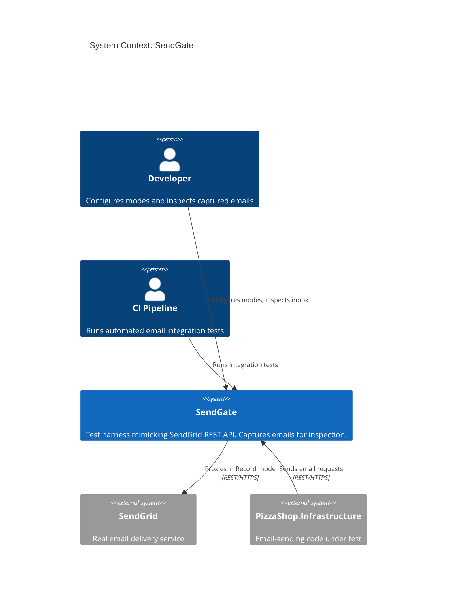

## System Declaration

```spec
system SendGate {
    target: "net10.0";
    responsibility: "HTTP-level test harness that mimics the SendGrid
                     mail/send REST endpoint. Captures submitted emails
                     in memory, exposes an inbox inspection API for test
                     assertions, and supports four behavior modes: Stub,
                     Record, Replay, and FaultInject.";

    authored component SendGate.Server {
        kind: "api-host";
        path: "src/SendGate.Server";
        status: new;
        responsibility: "ASP.NET minimal API that implements the SendGrid
                         mail/send endpoint and the inbox inspection
                         endpoints. Accepts email requests, stores them
                         in memory, and returns responses based on the
                         active behavior mode.";
        contract {
            guarantees "Exposes POST /v3/mail/send matching SendGrid's
                        request schema and status codes.";
            guarantees "Exposes GET/DELETE endpoints for inbox inspection
                        and mode configuration.";
            guarantees "All state is in-memory. No persistent storage
                        required.";
        }
    }

    authored component SendGate.Client {
        kind: library;
        path: "src/SendGate.Client";
        status: new;
        responsibility: "A .NET client library that wraps SendGate's
                         inspection and configuration APIs. Provides
                         typed methods for retrieving captured emails,
                         configuring behavior modes, and clearing the
                         inbox. Designed for use in test setup and
                         assertion code.";
        contract {
            guarantees "Client surface matches the SendGate inspection
                        API one-to-one. Every inspection endpoint has
                        a corresponding typed method.";
            guarantees "No dependency on SendGrid SDK. Uses HttpClient
                        directly against SendGate endpoints.";
        }

        rationale {
            context "Test code needs a convenient way to inspect
                     captured emails and configure SendGate without
                     constructing raw HTTP requests.";
            decision "A dedicated client library provides typed access
                      to the inspection API, reducing boilerplate in
                      integration tests.";
            consequence "Test projects reference SendGate.Client and
                         call methods like GetInboxAsync() and
                         ConfigureModeAsync() instead of building
                         HTTP requests manually.";
        }
    }

    authored component SendGate.Tests {
        kind: tests;
        path: "tests/SendGate.Tests";
        status: new;
        responsibility: "Integration tests for SendGate.Server and
                         SendGate.Client. Verifies that each behavior
                         mode works correctly, that the inbox inspection
                         API returns accurate data, and that fault
                         injection produces the expected error responses.";
    }

    consumed component AspNetCore {
        source: nuget("Microsoft.AspNetCore.App");
        version: "10.*";
        responsibility: "ASP.NET minimal API framework for the server.";
        used_by: [SendGate.Server];
    }

    consumed component xunit {
        source: nuget("xunit");
        version: "2.*";
        responsibility: "Unit testing framework.";
        used_by: [SendGate.Tests];
    }

    consumed component TestHost {
        source: nuget("Microsoft.AspNetCore.Mvc.Testing");
        version: "10.*";
        responsibility: "In-process test server for integration tests.";
        used_by: [SendGate.Tests];
    }
}
```

## Data Specification

### Enums

```spec
enum BehaviorMode {
    Stub: "Accepts emails, stores in memory, returns 202 Accepted.
           No external calls. Default mode.",
    Record: "Proxies requests to real SendGrid, records both the
             request and the response, and stores the email in
             the local inbox.",
    Replay: "Returns previously recorded responses for matching
             requests. Fails with 404 if no recording matches.",
    FaultInject: "Returns configurable error responses. Used to test
                  retry logic, timeout handling, and error paths."
}

enum SendStatus {
    Accepted: "SendGrid returned 202 Accepted (or Stub simulated it)",
    Rejected: "SendGrid returned a 4xx error",
    Failed: "SendGrid returned a 5xx error or the request timed out",
    Faulted: "FaultInject mode produced a synthetic error response"
}
```

### Entities

```spec
entity EmailRecipient {
    email: string @pattern("^[\\w.-]+@[\\w.-]+\\.\\w+$");
    name: string?;

    invariant "email required": email != "";
}

entity EmailMessage {
    id: string;
    from: EmailRecipient;
    to: EmailRecipient[];
    subject: string;
    htmlBody: string?;
    textBody: string?;
    templateId: string?;
    dynamicTemplateData: string?
        @reason("JSON-serialized key-value map for SendGrid dynamic
                 templates. Stored as a string to avoid coupling
                 SendGate to any particular template schema.");
    timestamp: string;

    invariant "has recipients": count(to) >= 1;
    invariant "has content": htmlBody != null or textBody != null
                             or templateId != null;
    invariant "id assigned": id != "";
}

entity SendResult {
    messageId: string;
    status: SendStatus;
    timestamp: string;

    invariant "id assigned": messageId != "";
}

entity SendGateRequest {
    id: string;
    method: string;
    path: string;
    headers: string;
    body: string;
    timestamp: string;

    invariant "id assigned": id != "";

    rationale "request capture" {
        context "Record and Replay modes need to match incoming
                 requests against previously seen traffic.";
        decision "Capture the full HTTP request including headers
                  and body as strings for flexible matching.";
        consequence "Replay matching compares method, path, and body.
                     Headers are stored for debugging but not used
                     in the match key by default.";
    }
}

entity SendGateResponse {
    id: string;
    statusCode: int;
    headers: string;
    body: string;
    timestamp: string;

    invariant "id assigned": id != "";
    invariant "valid status code": statusCode >= 100 and statusCode <= 599;
}

entity FaultConfig {
    statusCode: int @range(400..599);
    errorType: string?;
    errorMessage: string?;
    delayMs: int @range(0..30000) @default(0);

    invariant "valid error status": statusCode >= 400;

    rationale "delay support" {
        context "Testing timeout handling requires the ability to
                 simulate slow responses, not just error codes.";
        decision "FaultConfig includes a delayMs field that makes
                  the server wait before responding.";
        consequence "Tests can verify that HttpClient timeout and
                     retry policies activate correctly.";
    }
}
```

## Contracts

### Email Submission

```spec
contract SendEmail {
    requires count(message.to) >= 1;
    requires message.htmlBody != null or message.textBody != null
             or message.templateId != null;
    ensures result.messageId != "";
    ensures result.status in [Accepted, Rejected, Failed, Faulted];
    guarantees "In Stub mode, the email is stored in the inbox and
                a 202 Accepted response is returned immediately.";
    guarantees "In Record mode, the request is forwarded to SendGrid.
                Both the request and SendGrid's response are recorded.
                The email is stored in the inbox regardless of the
                upstream result.";
    guarantees "In Replay mode, the server looks up a recorded response
                matching the request. If found, it returns the recorded
                response. If not found, it returns 404.";
    guarantees "In FaultInject mode, the server returns the configured
                error response after the configured delay.";
}
```

### Inbox Inspection

These contracts define the primary testing value of SendGate. They allow
test code to query captured emails and make assertions about recipients,
subject lines, and body content.

```spec
contract GetInbox {
    ensures result is a list of EmailMessage;
    guarantees "Returns all captured emails in chronological order.
                Optionally filtered by recipient email address when
                a 'to' query parameter is provided.";
    guarantees "Each returned message includes the full envelope:
                from, to, subject, body content, template data,
                and the timestamp when it was received.";
}

contract GetMessage {
    requires messageId != "";
    ensures result is an EmailMessage or 404 if not found;
    guarantees "Returns a single captured email by its ID, including
                all envelope fields.";
}

contract ClearInbox {
    ensures inbox is empty after the call;
    guarantees "Removes all captured emails from memory. Returns
                the count of messages that were cleared. Useful for
                test isolation between test cases.";
}
```

### Mode Configuration

```spec
contract ConfigureMode {
    requires mode in [Stub, Record, Replay, FaultInject];
    ensures active mode matches the requested mode;
    guarantees "Switches the server's behavior mode. When switching
                to FaultInject, a FaultConfig payload is required.
                When switching to any other mode, FaultConfig is
                ignored if provided.";
    guarantees "Mode changes take effect immediately for the next
                incoming request.";
}

contract GetRequestLog {
    ensures result is a list of SendGateRequest;
    guarantees "Returns all captured HTTP requests in chronological
                order. Useful for verifying the exact request shape
                that the system under test produces.";
}
```

## Topology

```spec
topology Dependencies {
    allow SendGate.Tests -> SendGate.Server;
    allow SendGate.Tests -> SendGate.Client;
    allow SendGate.Client -> SendGate.Server;

    deny SendGate.Server -> SendGate.Client;
    deny SendGate.Server -> SendGate.Tests;

    invariant "server has no internal dependencies":
        SendGate.Server.kind == "api-host";

    rationale {
        context "SendGate is a self-contained test harness. The server
                 stands alone as a minimal API. The client library
                 wraps the server's HTTP endpoints for convenience.";
        decision "Server has no dependency on Client or Tests. Client
                  depends on Server only at the HTTP level (URL
                  configuration, not project reference). Tests
                  reference both to exercise the full stack.";
        consequence "SendGate.Server can be deployed as a standalone
                     Docker container. SendGate.Client is distributed
                     as a NuGet package for test projects to consume.";
    }
}
```

Rendered topology:

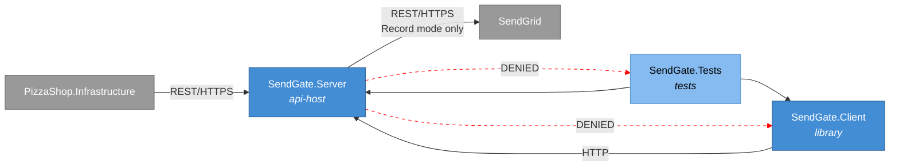

## Phases

```spec
phase ServerBuild {
    produces: [SendGate.Server];

    gate Compile {
        command: "dotnet build src/SendGate.Server";
        expects: "zero errors";
    }

    gate HealthCheck {
        command: "curl -f http://localhost:5200/health";
        expects: "exit_code == 0";
    }
}

phase ClientBuild {
    produces: [SendGate.Client];

    gate Compile {
        command: "dotnet build src/SendGate.Client";
        expects: "zero errors";
    }
}

phase Testing {
    requires: ServerBuild, ClientBuild;
    produces: [SendGate.Tests];

    gate AllTests {
        command: "dotnet test tests/SendGate.Tests";
        expects: "all tests pass", pass >= 20;
    }

    rationale "Tests exercise all four behavior modes, the inbox
               inspection API, and the client library methods.";
}

phase Integration {
    requires: Testing;

    gate FullBuild {
        command: "dotnet build SendGate.slnx";
        expects: "zero errors";
    }

    gate AllTests {
        command: "dotnet test SendGate.slnx";
        expects: "all tests pass", fail == 0;
    }
}
```

Rendered phase ordering:

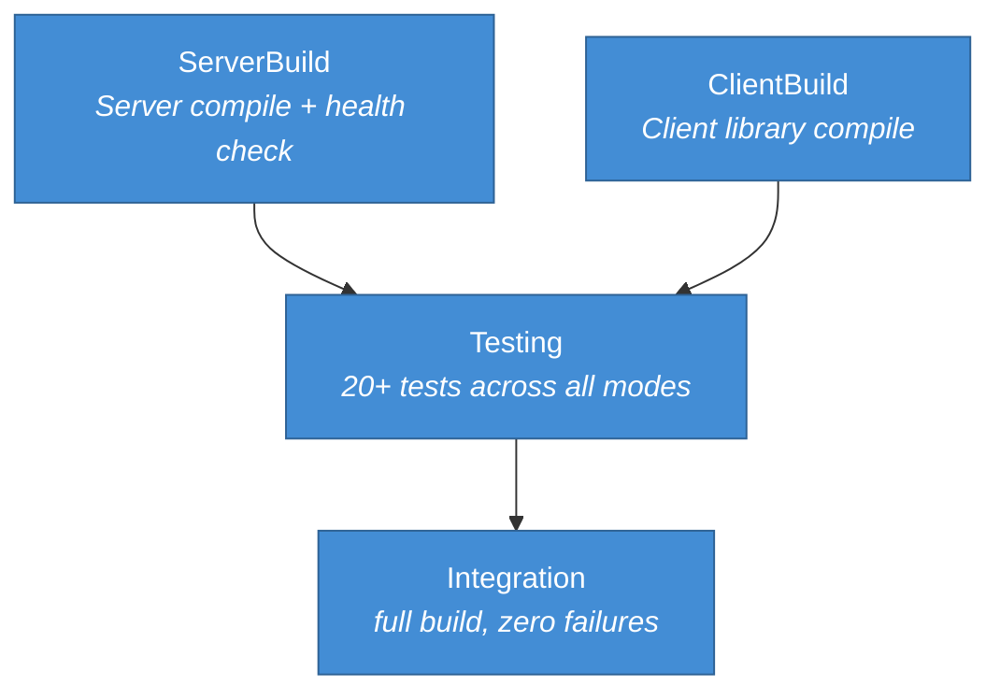

## Deployment

```spec
deployment DevTest {
    node "Developer Workstation or CI Runner" {
        technology: "Docker";

        node "SendGate Container" {
            technology: "ASP.NET 10 Minimal API";
            instance: SendGate.Server;

            rationale "Runs on a configurable port (default 5200).
                       PizzaShop integration tests point their
                       SendGrid base URL to this container.";
        }
    }
}
```

Rendered deployment:

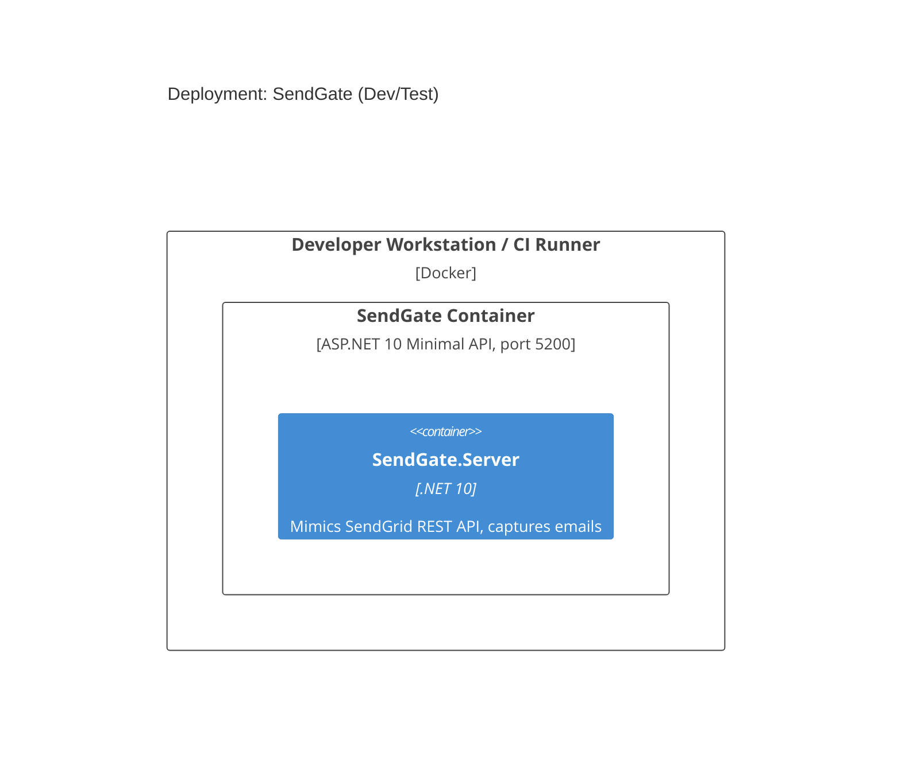

## Views

```spec
view systemContext of SendGate ContextView {
    include: all;
    autoLayout: top-down;
    description: "SendGate with its users, the upstream SendGrid
                  service, and PizzaShop.Infrastructure as the
                  primary consumer under test.";
}

view container of SendGate ContainerView {
    include: all;
    autoLayout: left-right;
    description: "Internal structure showing the Server, Client
                  library, and Tests with their relationships.";
}

view deployment of DevTest DevTestDeploymentView {
    include: all;
    autoLayout: top-down;
    description: "SendGate running as a Docker container in the
                  dev/test environment.";
    @tag("ops");
}
```

## Dynamic Scenarios

### Stub Mode: PizzaShop Sends Order Confirmation

The default mode for integration tests. PizzaShop.Infrastructure
sends an email to what it believes is SendGrid. SendGate accepts
the request and stores the message in memory. The test then
inspects the inbox to verify the email content.

```spec
dynamic StubSendOrderConfirmation {
    1: PizzaShop.Infrastructure -> SendGate.Server {
        description: "POST /v3/mail/send with order confirmation
                      email payload (from, to, subject, body).";
        technology: "REST/HTTPS";
    };
    2: SendGate.Server -> SendGate.Server
        : "Parses email, assigns ID, stores in in-memory inbox.";
    3: SendGate.Server -> PizzaShop.Infrastructure {
        description: "Returns 202 Accepted with message ID.";
        technology: "REST/HTTPS";
    };
}
```

Rendered interaction sequence:

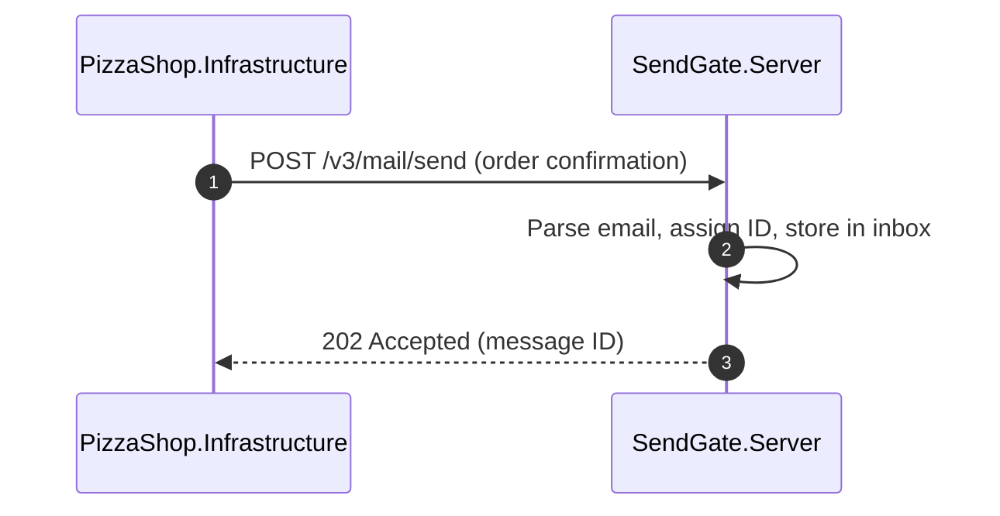

### Inbox Inspection After Email Send

After an email is sent in Stub mode, the test code uses
SendGate.Client to inspect the inbox and assert correctness.

```spec
dynamic InboxInspection {
    1: SendGate.Tests -> SendGate.Client
        : "Calls GetInboxAsync(recipientFilter: customer@example.com).";
    2: SendGate.Client -> SendGate.Server {
        description: "GET /api/inbox?to=customer@example.com";
        technology: "HTTP/JSON";
    };
    3: SendGate.Server -> SendGate.Client {
        description: "Returns list of captured EmailMessage objects
                      matching the recipient filter.";
        technology: "HTTP/JSON";
    };
    4: SendGate.Client -> SendGate.Tests
        : "Returns typed List<EmailMessage>.";
    5: SendGate.Tests -> SendGate.Tests
        : "Asserts message count, subject, body content, and
           recipient address match expected values.";
}
```

Rendered interaction sequence:

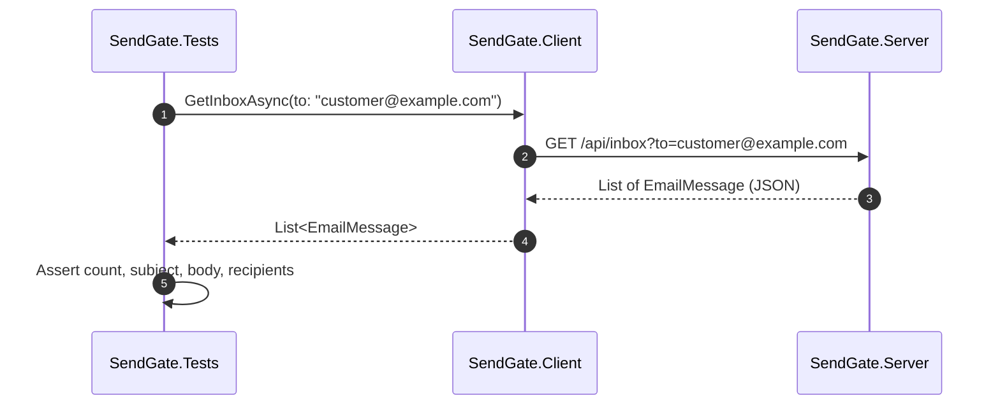

### Record Mode: Proxy to Real SendGrid

In Record mode, SendGate forwards the request to the real SendGrid
API, captures both the request and the response, and stores the
email in the local inbox.

```spec
dynamic RecordModeSend {
    1: PizzaShop.Infrastructure -> SendGate.Server {
        description: "POST /v3/mail/send with email payload.";
        technology: "REST/HTTPS";
    };
    2: SendGate.Server -> SendGate.Server
        : "Records the incoming request as a SendGateRequest.";
    3: SendGate.Server -> SendGrid {
        description: "Forwards the request to real SendGrid.";
        technology: "REST/HTTPS";
    };
    4: SendGrid -> SendGate.Server
        : "Returns actual SendGrid response.";
    5: SendGate.Server -> SendGate.Server
        : "Records the response as a SendGateResponse and stores
           the email in the inbox.";
    6: SendGate.Server -> PizzaShop.Infrastructure {
        description: "Returns the real SendGrid response to the caller.";
        technology: "REST/HTTPS";
    };
}
```

Rendered interaction sequence:

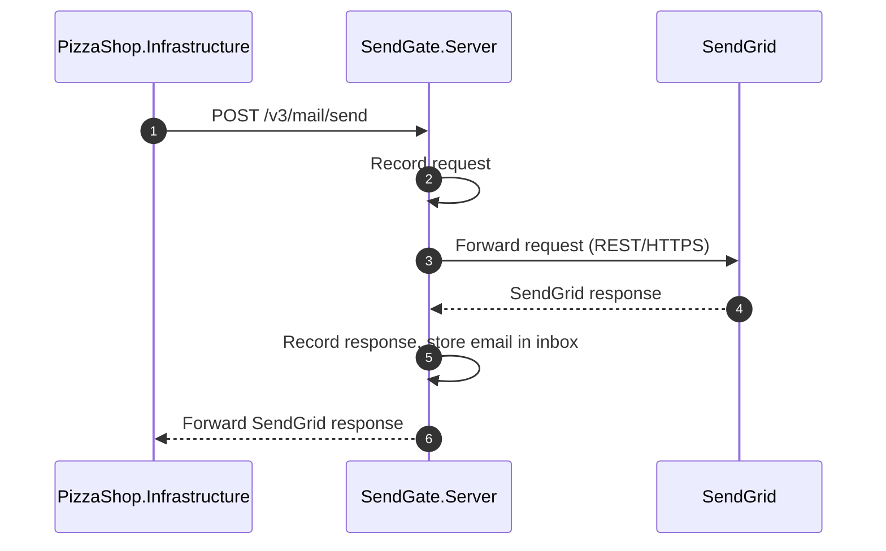

### FaultInject Mode: Simulated Failure

FaultInject mode tests how PizzaShop.Infrastructure handles
SendGrid errors. The developer configures a fault, then the
next email send receives the configured error response.

```spec
dynamic FaultInjectSend {
    1: SendGate.Tests -> SendGate.Client
        : "Calls ConfigureModeAsync(FaultInject, faultConfig) where
           faultConfig specifies statusCode: 503, delayMs: 2000.";
    2: SendGate.Client -> SendGate.Server {
        description: "PUT /api/mode with FaultInject config.";
        technology: "HTTP/JSON";
    };
    3: SendGate.Server -> SendGate.Client {
        description: "Returns 200 OK confirming mode switch.";
        technology: "HTTP/JSON";
    };
    4: PizzaShop.Infrastructure -> SendGate.Server {
        description: "POST /v3/mail/send with email payload.";
        technology: "REST/HTTPS";
    };
    5: SendGate.Server -> SendGate.Server
        : "Waits for configured delay (2000ms), then prepares
           503 error response.";
    6: SendGate.Server -> PizzaShop.Infrastructure {
        description: "Returns 503 Service Unavailable with configured
                      error body.";
        technology: "REST/HTTPS";
    };
}
```

Rendered interaction sequence:

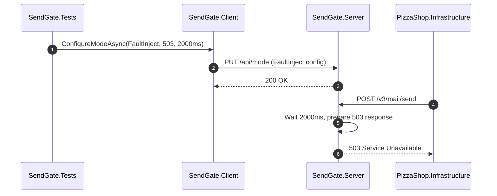

### Replay Mode: Return Recorded Response

After recording real SendGrid traffic, Replay mode returns
previously captured responses without making external calls.

```spec
dynamic ReplayModeSend {
    1: PizzaShop.Infrastructure -> SendGate.Server {
        description: "POST /v3/mail/send with email payload.";
        technology: "REST/HTTPS";
    };
    2: SendGate.Server -> SendGate.Server
        : "Looks up a recorded SendGateResponse matching the
           request method, path, and body.";
    3: SendGate.Server -> PizzaShop.Infrastructure {
        description: "Returns the matched recorded response, or
                      404 if no recording matches.";
        technology: "REST/HTTPS";
    };
}
```

Rendered interaction sequence:

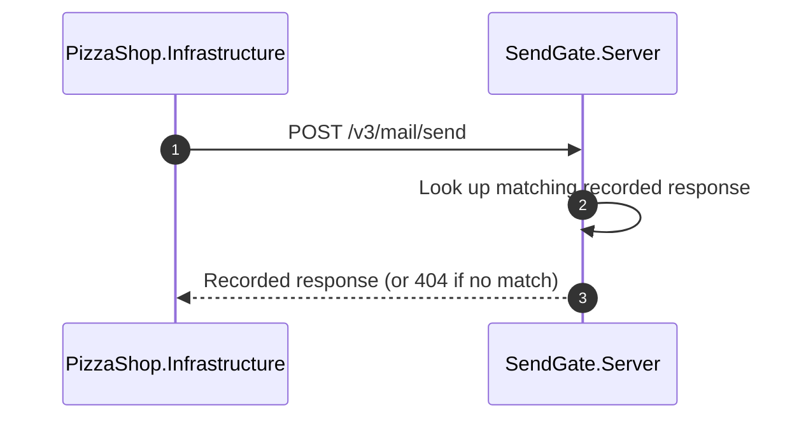

### Full Integration Test Flow

This scenario shows the typical end-to-end flow in a PizzaShop
integration test: clear the inbox, trigger the operation under
test, then inspect the inbox to assert correctness.

```spec
dynamic FullIntegrationTestFlow {
    1: SendGate.Tests -> SendGate.Client
        : "Calls ClearInboxAsync() to isolate this test.";
    2: SendGate.Client -> SendGate.Server {
        description: "DELETE /api/inbox";
        technology: "HTTP/JSON";
    };
    3: SendGate.Server -> SendGate.Client
        : "Returns 200 OK with count of cleared messages.";
    4: SendGate.Tests -> PizzaShop.Infrastructure
        : "Triggers the PlaceOrder flow, which results in an
           order confirmation email being sent.";
    5: PizzaShop.Infrastructure -> SendGate.Server {
        description: "POST /v3/mail/send with order confirmation.";
        technology: "REST/HTTPS";
    };
    6: SendGate.Server -> PizzaShop.Infrastructure
        : "Returns 202 Accepted.";
    7: SendGate.Tests -> SendGate.Client
        : "Calls GetInboxAsync() to retrieve captured emails.";
    8: SendGate.Client -> SendGate.Server {
        description: "GET /api/inbox";
        technology: "HTTP/JSON";
    };
    9: SendGate.Server -> SendGate.Client
        : "Returns list containing one EmailMessage.";
    10: SendGate.Tests -> SendGate.Tests
        : "Asserts exactly one email was captured. Verifies
           recipient matches the customer, subject contains
           the order ID, and body includes order details.";
}
```

Rendered interaction sequence:

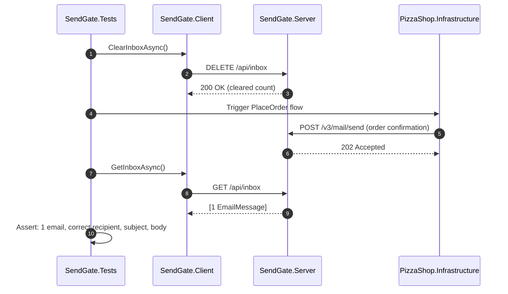

## System-Level Constraints

```spec
constraint InMemoryOnly {
    scope: [SendGate.Server];
    rule: "All state is held in memory. No database, no file system
           writes, no persistent storage of any kind. Restarting the
           server resets all captured emails and recordings.";

    rationale "In-memory storage keeps SendGate fast and disposable.
               Each test run starts from a clean state by clearing
               the inbox or restarting the container.";
}

constraint NoSendGridSdkDependency {
    scope: [SendGate.Server, SendGate.Client];
    rule: "Neither the server nor the client library references the
           official SendGrid NuGet package. SendGate mimics the REST
           API surface directly using ASP.NET routing and HttpClient.";

    rationale {
        context "Depending on the SendGrid SDK would couple SendGate
                 to SendGrid's client-side abstractions and versioning.";
        decision "Implement the API surface at the HTTP level. The
                  server matches SendGrid's REST contract by path and
                  JSON schema. The client library uses raw HttpClient.";
        consequence "SendGate is version-independent from the SendGrid
                     SDK. It works with any HTTP client that targets
                     the SendGrid REST API.";
    }
}

constraint NullableEnabled {
    scope: all authored components;
    rule: "Nullable reference types are enabled in every project file.
           No suppression operators (!) outside of test setup code.";
}

constraint TestNaming {
    scope: [SendGate.Tests];
    rule: "Test methods follow MethodName_Scenario_ExpectedResult naming.
           Test classes mirror the source class name with a Tests suffix.";
}
```

## Package Policy

```spec
package_policy SendGatePolicy {
    source: nuget("https://api.nuget.org/v3/index.json");

    allow category("platform")
        includes ["System.*", "Microsoft.Extensions.*",
                  "Microsoft.AspNetCore.*"];

    allow category("testing")
        includes ["xunit", "xunit.*",
                  "Microsoft.AspNetCore.Mvc.Testing",
                  "Microsoft.NET.Test.Sdk", "coverlet.collector"];

    deny category("sendgrid-sdk")
        includes ["SendGrid", "SendGrid.*"];

    deny category("orm")
        includes ["Microsoft.EntityFrameworkCore",
                  "Microsoft.EntityFrameworkCore.*",
                  "Dapper", "Dapper.*"];

    default: require_rationale;

    rationale {
        context "SendGate is a lightweight test harness with minimal
                 dependencies. It should not depend on SendGrid's SDK
                 or any ORM since it uses no persistent storage.";
        decision "Only platform and testing packages are pre-approved.
                  SendGrid SDK and ORM packages are explicitly denied.";
        consequence "Adding any dependency outside the approved list
                     triggers a review.";
    }
}
```

## Platform Realization

```spec
dotnet solution SendGate {
    format: slnx;
    startup: SendGate.Server;

    folder "src" {
        projects: [SendGate.Server, SendGate.Client];
    }

    folder "tests" {
        projects: [SendGate.Tests];
    }
}
```

Rendered solution structure:

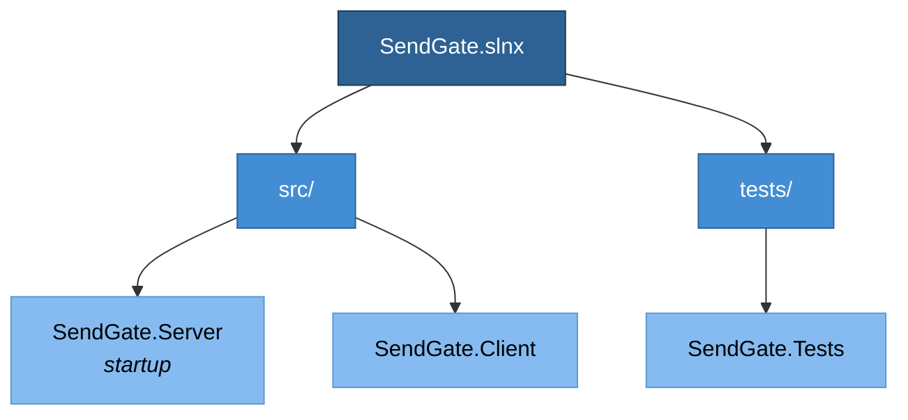

## Open Items

None at this time.
