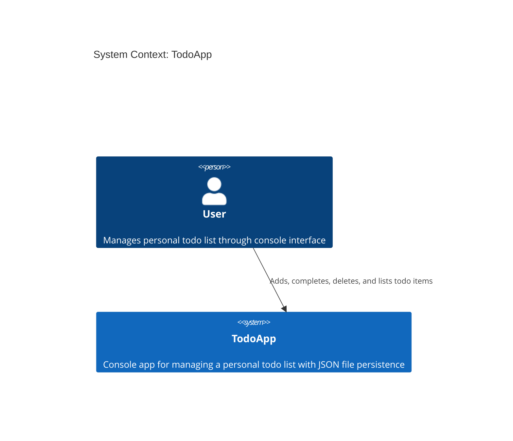
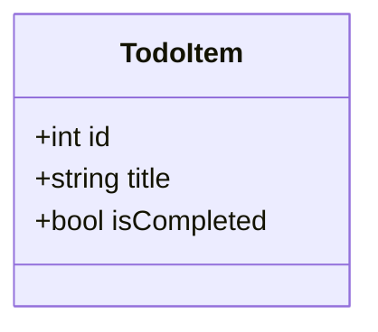
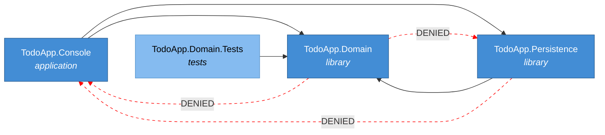
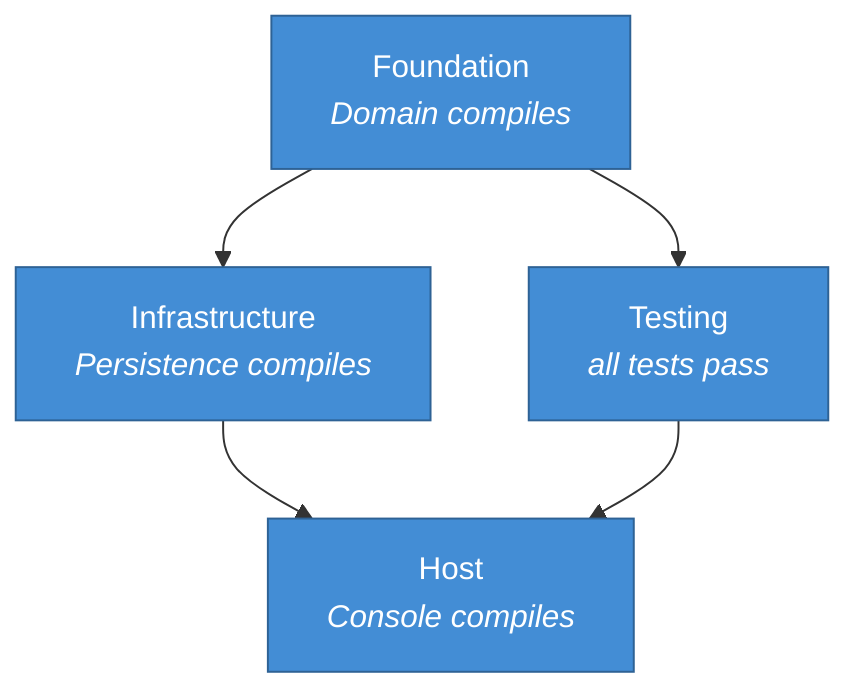
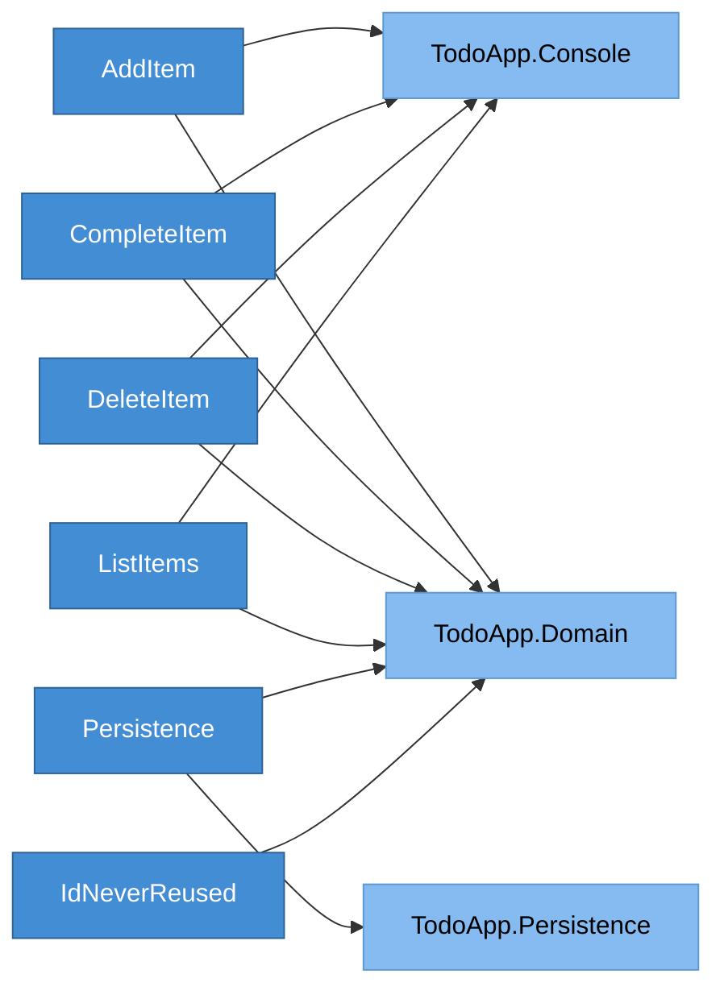
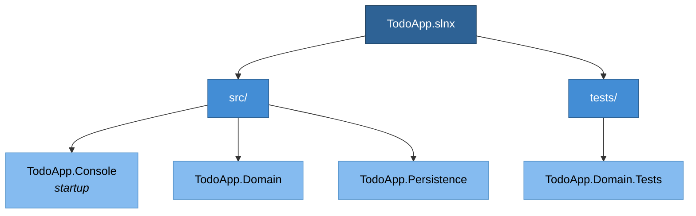
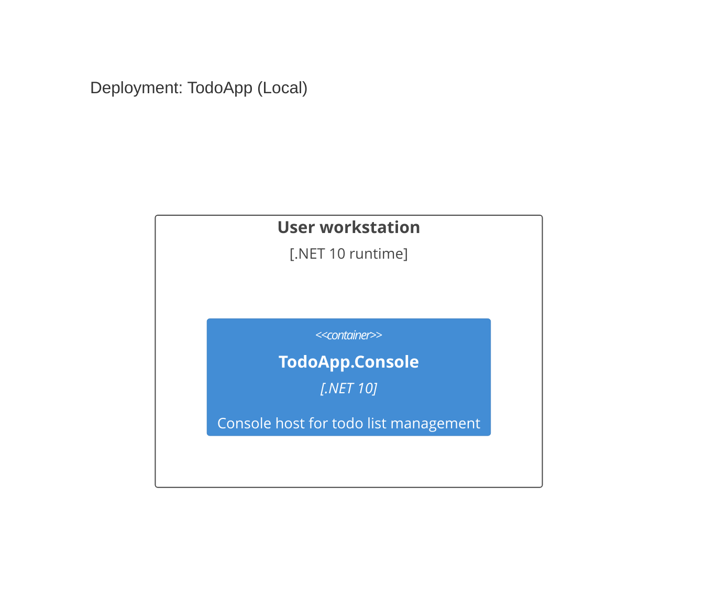
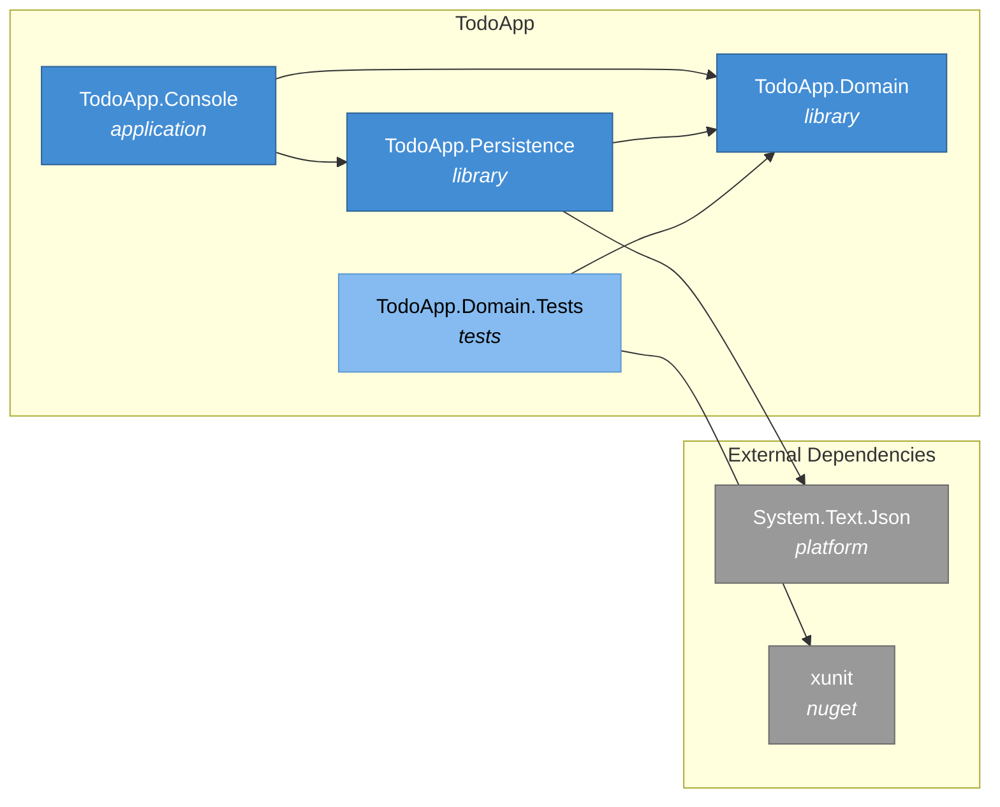
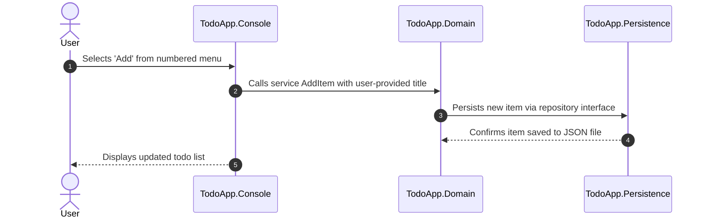

# TodoApp -- System Specification

## Tracking

| Field | Value |
|---|---|
| Created | 2026-04-05 |
| State | Reviewed |
| Reviewed | 2026-04-06 |
| Approved | |
| Executed | |
| Verified | |
| Dependencies | None (base system specification) |

This specification describes a .NET 10 console application that manages a personal
todo list. The user interacts through a numbered menu to add, complete, delete, and
list items. Items persist to a local JSON file so they survive between sessions.

The domain logic is separated from console IO so it can be reused in a different host.

## Context

```spec
person User {
    description: "Individual managing their personal todo list
                  through the console interface.";
}

User -> TodoApp : "Adds, completes, deletes, and lists todo items.";
```

Rendered system context:



## System Declaration

```spec
system TodoApp {
    target: "net10.0";
    responsibility: "Console application that manages a personal todo list
                     with add, complete, delete, and list operations.
                     Items persist to a local JSON file between sessions.";

    authored component TodoApp.Domain {
        kind: library;
        path: "src/TodoApp.Domain";
        status: new;
        responsibility: "Domain logic. Defines TodoItem, the repository
                         interface, and the service that implements
                         add, complete, delete, and list operations.
                         No IO, no console, no infrastructure concerns.";
    }

    authored component TodoApp.Persistence {
        kind: library;
        path: "src/TodoApp.Persistence";
        status: new;
        responsibility: "JSON file persistence. Implements the repository
                         interface from TodoApp.Domain using
                         System.Text.Json. Reads and writes a single
                         JSON file in the current directory.";
    }

    authored component TodoApp.Console {
        kind: application;
        path: "src/TodoApp.Console";
        status: new;
        responsibility: "Console host. Renders the numbered menu,
                         reads user input, delegates to TodoApp.Domain,
                         and wires the dependency injection root.";
    }

    authored component TodoApp.Domain.Tests {
        kind: library;
        path: "tests/TodoApp.Domain.Tests";
        status: new;
        responsibility: "Unit tests for TodoApp.Domain. Verifies add,
                         complete, delete, list, and ID-never-reused
                         rules using xUnit.";
    }

    consumed component xunit {
        source: nuget("xunit");
        version: "2.*";
        responsibility: "Unit testing framework.";
        used_by: [TodoApp.Domain.Tests];
    }
}
```

## Data Specification

### TodoItem Entity

The single aggregate in the domain. Each item has a unique integer ID that is
assigned on creation and never reused, even after deletion.

```spec
entity TodoItem {
    id: int;
    title: string;
    isCompleted: bool;

    invariant "id positive": id > 0;
    invariant "title not empty": title != "";

    rationale "TodoItem is the single aggregate in the domain.
               ID is an auto-incrementing integer assigned once
               and never reused. Deletion does not free the ID
               for reassignment.";
}
```

Rendered domain model:



## Contracts

### Domain Operations

These contracts define the boundary commitments for the four user-facing
operations and the persistence layer.

```spec
contract AddItem {
    requires title != "";
    ensures id > 0;
    guarantees "A new item is appended with a unique, never-reused ID.";
}

contract CompleteItem {
    requires id > 0;
    guarantees "The item with the given ID is marked as done.";
}

contract DeleteItem {
    requires id > 0;
    guarantees "The item with the given ID is removed from the list.";
}

contract ListItems {
    guarantees "Returns all items with their ID, title, and completion status.";
    guarantees "Completed items are marked with an X in the console display.";
}

contract Persistence {
    guarantees "Items are saved to a JSON file in the current directory.";
    guarantees "The file is created on first use if it does not exist.";
    guarantees "Items survive between application sessions.";
}
```

## Topology

```spec
topology Dependencies {
    allow TodoApp.Console -> TodoApp.Domain;
    allow TodoApp.Console -> TodoApp.Persistence;
    allow TodoApp.Persistence -> TodoApp.Domain;
    allow TodoApp.Domain.Tests -> TodoApp.Domain;

    deny TodoApp.Domain -> TodoApp.Console;
    deny TodoApp.Domain -> TodoApp.Persistence;
    deny TodoApp.Persistence -> TodoApp.Console;

    rationale {
        context "The app description mandates that domain logic
                 is separate from console IO so it can be reused
                 in a different host.";
        decision "TodoApp.Domain has zero upward dependencies.
                  TodoApp.Console is the composition root and
                  references both Domain and Persistence for
                  dependency injection wiring.
                  TodoApp.Persistence implements the repository
                  interface defined in TodoApp.Domain.";
        consequence "TodoApp.Domain can be consumed by a web host,
                     GUI, or test harness without pulling in
                     console or file-system dependencies.";
    }
}
```

Rendered topology:



## Phases

```spec
phase Foundation {
    produces: [TodoApp.Domain];

    gate Compile {
        command: "dotnet build src/TodoApp.Domain";
        expects: "zero errors";
    }
}

phase Infrastructure {
    requires: Foundation;
    produces: [TodoApp.Persistence];

    gate Compile {
        command: "dotnet build src/TodoApp.Persistence";
        expects: "zero errors";
    }
}

phase Testing {
    requires: Foundation;
    produces: [TodoApp.Domain.Tests];

    gate Compile {
        command: "dotnet build tests/TodoApp.Domain.Tests";
        expects: "zero errors";
    }

    gate Test {
        command: "dotnet test tests/TodoApp.Domain.Tests";
        expects: "all tests pass";
    }
}

phase Host {
    requires: Foundation, Infrastructure, Testing;
    produces: [TodoApp.Console];

    gate Compile {
        command: "dotnet build src/TodoApp.Console";
        expects: "zero errors";
    }
}
```

Rendered phase ordering:



## Traces

```spec
trace RequirementMap {
    AddItem -> [TodoApp.Domain, TodoApp.Console];
    CompleteItem -> [TodoApp.Domain, TodoApp.Console];
    DeleteItem -> [TodoApp.Domain, TodoApp.Console];
    ListItems -> [TodoApp.Domain, TodoApp.Console];
    Persistence -> [TodoApp.Persistence, TodoApp.Domain];
    IdNeverReused -> [TodoApp.Domain];

    invariant "full coverage": all sources have count(targets) >= 1;
}
```

Rendered requirement traceability:



## System-Level Constraints

```spec
constraint SeparationOfConcerns {
    scope: [TodoApp.Domain];
    rule: "No references to System.Console, System.IO, or any
           infrastructure concern. Domain depends only on base
           class library types.";

    rationale {
        context "The app description mandates domain logic separation
                 from console IO for host reusability.";
        decision "TodoApp.Domain defines only entities, service logic,
                  and the repository interface. All IO is delegated
                  to the repository abstraction.";
        consequence "Swapping the console host for a web API or GUI
                     requires no changes to TodoApp.Domain.";
    }
}

constraint TestNaming {
    scope: [TodoApp.Domain.Tests];
    rule: "MethodName_Scenario_ExpectedResult";

    rationale "Consistent naming makes test failures immediately
               interpretable without reading the test body.";
}

constraint JsonFileSingleLocation {
    scope: [TodoApp.Persistence];
    rule: "All file IO is confined to a single repository class.
           The file name and path are configurable, defaulting to
           todos.json in the current directory.";

    rationale "Centralizing file access prevents scattered IO and
               makes the persistence strategy easy to replace.";
}
```

## Package Policy

```spec
package_policy TodoPolicy {
    source: nuget("https://api.nuget.org/v3/index.json");

    allow category("platform")
        includes ["System.*", "Microsoft.Extensions.*"];

    allow category("testing")
        includes ["xunit", "xunit.*", "Microsoft.NET.Test.Sdk",
                  "coverlet.collector"];

    default: deny;

    rationale {
        context "A personal todo app has no need for third-party
                 libraries beyond the platform SDK and test tooling.";
        decision "Platform and testing packages are pre-approved.
                  Everything else is denied.";
        consequence "The app remains dependency-light and maintainable.
                     System.Text.Json ships with the runtime and does
                     not require a separate NuGet reference.";
    }
}
```

## Platform Realization

```spec
dotnet solution TodoApp {
    format: slnx;
    startup: TodoApp.Console;

    folder "src" {
        projects: [TodoApp.Console, TodoApp.Domain, TodoApp.Persistence];
    }

    folder "tests" {
        projects: [TodoApp.Domain.Tests];
    }

    rationale {
        context ".NET 10 defaults to .slnx format.";
        decision "Use .slnx with src/ and tests/ folder separation.
                  TodoApp.Console is the startup project.";
        consequence "All phase gate commands target the solution root:
                     dotnet build TodoApp.slnx
                     dotnet test TodoApp.slnx";
    }
}
```

Rendered solution structure:



## Deployment

```spec
deployment Local {
    node "User workstation" {
        technology: ".NET 10 runtime";
        instance: TodoApp.Console;
    }

    rationale "Console app runs locally on the user's machine.
               No server infrastructure needed.";
}
```

Rendered deployment:



## Views

```spec
view systemContext of TodoApp SystemContextView {
    include: all;
    autoLayout: top-down;
    description: "The TodoApp and its single user. No external
                  system dependencies.";
}

view container of TodoApp ContainerView {
    include: all;
    autoLayout: left-right;
    description: "Internal structure: domain library, persistence
                  library, console host, and tests.";
}
```

Rendered container view:



## Dynamic Scenarios

```spec
dynamic AddTodoItem {
    1: User -> TodoApp.Console : "Selects 'Add' from numbered menu.";
    2: TodoApp.Console -> TodoApp.Domain
        : "Calls service AddItem with user-provided title.";
    3: TodoApp.Domain -> TodoApp.Persistence
        : "Persists new item via repository interface.";
    4: TodoApp.Persistence -> TodoApp.Domain
        : "Confirms item saved to JSON file.";
    5: TodoApp.Console -> User
        : "Displays updated todo list.";
}
```

Rendered interaction sequence:



## Open Items

None at this time.
